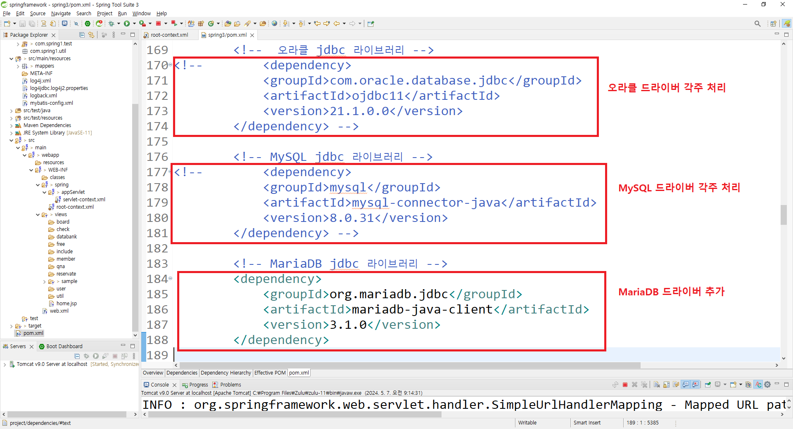
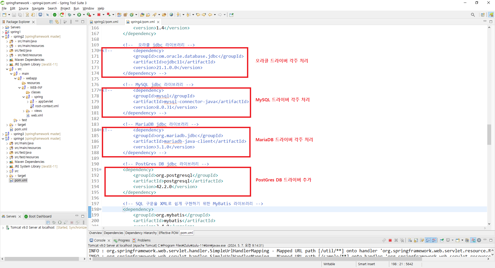
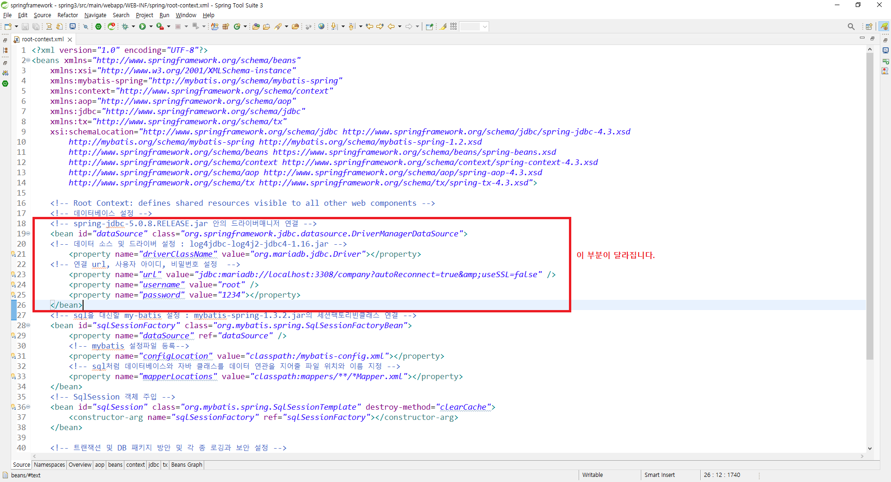
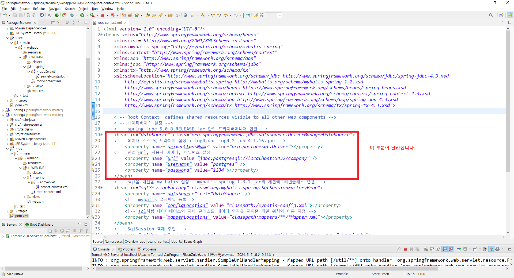
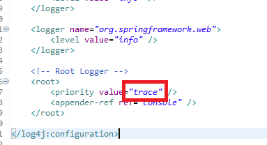
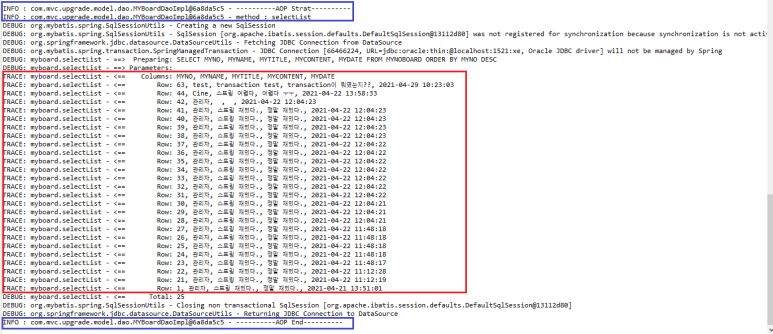

## [1-1. sts 설치와 Oracle 연동 설정](./spring1/) 

## [2-1. Oracle 연동한 애플리케이션 개발](./spring1/) 

## [1-2. sts 설치와 MySQL 연동 설정](./spring2/) 

## [2-2. MySQL을 연동한 애플리케이션 개발](./spring2/) 

## [1-3. sts 설치와 MariaDB 연동 설정](./spring3/) 

## [2-3. MariaDB를 연동한 애플리케이션 개발](./spring3/) 

## [1-4. sts 설치와 PostGres 연동 설정](./spring4/)

## [2-4. PostGres를 연동한 애플리케이션 개발](./spring4/) 

## [3. DI (Dependency Injection)와 IoC(Invert Of Control)](./study03/) 

## [4. Controller HTTP Request Mapping 연동](./study04/) 

## [5. HTTP Request Parameter Receive & Resolve](./study05/) 

## [6. Restful API(REpresentation State Transfer, Application Programming Interface)](./study06/) 

## [7. Ajax(Asynchronous Javascript And Xml)](./study07/) 

## [8. 폼 검증(Form Check Validation)](./study08/) 

## [9. 암호화 그리고, Filter와 Spring Security Interceptor, AOP(Aspect Oriented Programming)](./study09/) 

## [10. Mybatis & Mapper XML](./study10/) 

## [11. 트랜잭션과 로깅](./study11/) 

## [12. 예외 및 에러처리와 다국어](./study12/) 

## [13. 스프링프레임워크 어노테이션 정리](./study13/) 

## [14. Open API 와 API 용용 및 부가 기능](./study14/) 


<div id="1"></div>

# 1. sts 설치

<div id="1-1"> <a href="#quick">목차로</a> </div>

## 1-1. sts 다운로드 및 설치

**(1) 다운로드 페이지로 이동** ☞ [sts다운로드링크](https://github.com/spring-attic/toolsuite-distribution/wiki/Spring-Tool-Suite-3)


**(2) 아래와 같은 화면이 나올 때까지 스크롤합니다.**


<br>


<br>

**(3) 압축 파일을 원하는 폴더로 이동후에 이름을 sts.zip으로 변경하고, 아래 그림과 같이 진행합니다.**


<br>

**(4) 압축풀기가 끝나면 아래 그림과 같이 \sts\sts-bundle\sts-3.9.18RELEASE 폴더로 이동합니다.**


<br><br>

<div id="1-2"><a href="#quick">목차로</a></div>

## 1-2. Lombok 설치

<span style="color:red;font-weight:bold;font-size:24px">※ Lombok을 활용하면, DTO 클래스에 getter/setter/toString/Constructor 의 정의가 필요 없게 되어 프로젝트 진행시 개발 시간을 단축시킬 수 있습니다.</span> 

**(1) DTO 생성을 위한 Lombok.jar를 설치하기 위해 mvnrepository 페이지로 이동합니다.**


<br>

**(2) Lombok을 검색하여 찾아 해당 카테고리를 클릭하고, 상세 페이지로 이동합니다.**


<br>

**(3) Lombok의 Archive 목록에서 원하는 버전을 클릭하여 선택합니다.**


<br>

**(4) jar 파일을 다운로드합니다.**


<br>

**(5) download 폴더로 이동하여 다운로드된 lombok-1.18.22.jar파일을 찾아 파일의 이름을 lombok.jar로 변경합니다.**


<br>

**(6) lombok.jar 파일을 잘라내기하여 sts가 설치된 폴더로 붙여넣기 합니다.**


<br>

**(7) cmd(명령 프롬프트)를 관리자모드로 실행합니다.**


<br>

**(8) 해당 디렉토리로 이동 후에 java의 jar 명령으로 lombok.jar의 압축을 풀면서 실행을 시킵니다.**


<br>

**(9) lombok 설치 화면에서 [Specify location] 버튼을 클릭합니다.**


<br>

**(10) sts가 설치된 디렉토리 및 STS.exe 파일의 경로를 지정합니다.**


<br>

**(11) 경로지정이 끝나면 설치를 진행합니다.**


<br>

**(12) 설치가 모두 마치면, Lombok 설치를 종료합니다.**


<br><br><br>

<div id="1-3"><a href="#quick">목차로</a></div>

## 1-3. sts 설정

**(1) sts의 바로가기 아이콘을 바탕화면에 만들어 실행합니다.**


<br>

**(2) 프로젝트의 디렉토리인 워크스페이스 디렉토리를 지정합니다.**


<br>

**(3) Dash 보드 패널을 닫습니다.**


<br>

**(4) [Windows]-[Properties] 메뉴를 통하여 환경 설정 화면으로 이동합니다.**


<span style="color:red;font-weight:bold;font-size:24px">※ 워크스페이스를 변경시에는 환경 설정을 다시 해야합니다.</span> 

<br>

**(5) 워크스페이스의 인코딩을 설정합니다.**


<br>

**(6) 자바 컴파일러를 설정합니다.**


<br>

**(7) JRE를 설정합니다.**


<br>

**(8) CSS의 인코딩 방식을 설정합니다.**


<br>

**(9) HTML의 인코딩 방식을 설정합니다.**


<br>

**(10) JSP의 인코딩 방식을 설정합니다.**


<br>

**(11) JSP 템플릿을 수정하도록 합니다.**


<span style="color:red;font-weight:bold;font-size:24px">※ JSP 템플릿을 수정하게 되면, 매번 번거롭게 하는 일들을 줄일 수가 있습니다.</span> 

<br>

**(12) JSP 템플릿의 내용을 수정합니다.** 


아래는 템플릿에 추가할 내용입니다.

```html
    <meta name="viewport" content="width=device-width, initial-scale=1.0">
    <meta name="title" content="애플리케이션 제목">
    <meta name="application-name" content="애플리케이션 이름">
    <meta name="author" content="애플리케이션 제작자 이름">
    <meta name="description" content="애플리케이션 설명">
    <meta name="keywords" content="애플리케이션 검색어 열거">
    <meta property="og:url" content="애플리케이션 URL" />
    <meta property="og:type" content="website" />
    <meta property="og:title" content="애플리케이션 제목" />
    <meta property="og:description" content="애플리케이션 설명" />
    <meta property="og:image" content="애플리케이션 메인 이미지 경로" />
```

<br>

**(13) Server 를 설정합니다.**


<br>

**(14) 사용할 Server로 Tomcat Server 를 지정합니다.**


<span style="color:red;font-weight:bold;font-size:24px">※ Create a new local server 항목을 체크하지 않으면, Servers 패널에 나타나지 않으니 꼭 체크해 두시기 바랍니다.</span> 

<br>

**(15) 기존에 설치된 tomcat 9을 Server 로 지정합니다.**


<br>

**만약, tomcat이 설치되지 않았다면, 아래 작업을 먼저 진행하고, (15)번 작업을 진행하시기 바랍니다.**


**아파치톰캣 다운로드 페이지** [TOMCAT9](https://tomcat.apache.org/download-90.cgi)

**다운로드 받은 apache-tomcat-9.0.88-windows-x64.zip 파일을 원하는 곳으로 이동 후 압축을 해제합니다.**

<br>

**(16) 불필요한 VMWare Server를 제거하고, sts 설정을 종료합니다.**


<br><br><br>

<div id="1-4"><a href="#quick">목차로</a></div>

## 1-4. Dynamic Web Project 를 Maven Project로 변환하기

**(1) Dynamic Web Project 를 새롭게 추가합니다.**


<br>

**(2) Project 의 기본 정보를 입력하고 설정합니다.**


<br>

**(3) Project 에서 활용될 디렉토리 설정과 배포할 파일이 존재할 출력 디렉토리를 지정합니다.**


<br>

**(4) Project 에서 사용할 웹 모듈과 설정 방식을 지정합니다.**


<span style="color:red;font-weight:bold;font-size:24px">※ Create web.xml deployment descriptor 항목을 체크하지 않으면, 수동으로 만드는 수고를 해야 하니 꼭 체크하시기 바랍니다.</span> 

<br>

**(5) sts에서 Dynamic Web Project를 추가하게 되면, JSP/Servlet 개발 환경에 적합한 화면으로 변경하겠다는 메시지가 출력됩니다.**


<br><br>

**(6) Dynamic Web Project를 Maven Project 로 변환합니다.**


<br>

**(7) Maven Project 로 변환시 프로젝트의 그룹아이디와 저작아이디 그리고, 패키징 방식 등을 지정합니다.**


<br><br><br>

<div id="1-5"><a href="#quick">목차로</a></div>

## 1-5. 프로젝트 환경 설정하기

**(1) 프로젝트 환경을 설정창을 불러옵니다.**


<br>

**(2) 프로젝트의 인코딩 방식을 지정합니다.**


<br>

**(3) 프로젝트에서 사용할 자바 컴파일러를 설정합니다.**


<br>

**(4) 프로젝트의 프론트엔드/백엔드 웹 환경을 설정합니다.**


<br>

**(5) 프로젝트에서 사용할 JRE 환경을 지정합니다.**


<br>

**(6) 프로젝트에서 사용할 JRE 환경을 불러옵니다.**


<br>

**(7) 프로젝트에서 사용할 JRE 환경을 선택합니다.**


<br>

**(8) 프로젝트에서 사용하지 않는 JRE 환경을 제거하고, 환경 설정을 종료합니다.**


<br>

**(9) 프로젝트 개발작업을 시작합니다.**


<span style="color:red;font-weight:bold;font-size:24px"> ※ 위와 같이 Dynamic Web Project에서 Spring Legacy Project 변환하여 작성하게 되면, 모두 수동 설정 작업을 해야 하므로, 상당히 설정에 너무 시간이 소요된다. 그래서 이번에는 아래 화면들은 Spring Legacy Project 직접 만드는 것이 편합니다.</span>

<br><br><br>

<div id="1-6"><a href="#quick">목차로</a></div>

## 1-6. sts에 Spring Legacy Project 템플릿 추가하기

<br>

**(1) Spring Legacy Project 를 새롭게 추가합니다.**


<br>

**(2) 현재는 Spring Legacy Project 템플릿이 없는 상황입니다.**


**(3) 새로운 템플릿 추가작업을 위해 sts를 종료합니다.**

<br>

### 그런데 위에서 본바와 같이 2024년 되자 sts에서 Spring Legacy Project 를 만들 수 있는 템플릿이 사라졌다. 그래서 별도의 템플릿 추가 작업을 진행하여 프로젝트를 생성해야 합니다.

<br>

**https-content.xml 다운로드 링크** ☞
<a href="https-content.xml" download>https-content.xml 다운로드 받기</a>

<br>

**(4) Spring Legacy Project 템플릿 추가 작업을 진행합니다.**


<br>

**(5) sts를 다시 재기동합니다.**

<br>

**(6) Spring Legacy Project 를 새롭게 추가합니다.**


<br>

**(7) 화면 처럼 없던 템플릿이 추가된 것을 확인합니다.**


<br><br><br>

<div id="1-7"><a href="#quick">목차로</a></div>

## 1-7. sts에서 Spring Legacy Project 바로 추가하기

**(1) 메뉴에서 Spring Legacy Project를 새롭게 추가합니다.**


<br>

**(2) 프로젝트의 이름을 입력하고, Spring MVC Project를 선택합니다.**


<br>

**(3) 메시지 창에서 [Yes] 버튼을 누릅니다.**


<br>

**(4) 프로젝트의 이름을 확인하고, Spring MVC Project를 선택합니다.**


<br>

**(5) 메인 패키지의 이름을 입력합니다.**


<br>

**(6) 추가된 프로젝트의 내용을 상세하게 확인합니다.**


<br><br><br>

<div id="1-8"><a href="#quick">목차로</a></div>

## 1-8. Spring Legacy Project 환경 설정하기

**(1) 프로젝트 환경을 설정창을 불러옵니다.**


<br>

**(2) 프로젝트의 인코딩 방식을 지정합니다.**


<br>

**(3) 프로젝트에서 사용할 자바 컴파일러를 설정합니다.**


<br>

**(4) 프로젝트의 프론트엔드/백엔드 웹 환경을 설정합니다.**


<br>

**(5) 프로젝트에서 사용할 JRE 환경을 지정합니다.**


<br>

**(6) 프로젝트에서 사용할 JRE 환경을 불러옵니다.**


<br>

**(7) 프로젝트에서 사용할 JRE 환경을 선택합니다.**


<br>

**(8) 프로젝트에서 사용하지 않는 JRE 환경을 제거하고, 환경 설정을 종료합니다.**


<br><br><hr><br><br>

<div id="2"></div>

# 2. 애플리케이션 개발

<div id="2-1"><a href="#quick">목차로</a></div>

<br>

**주요 어노테이션 설명**

| 주요 어노테이션 | 설명 |
|---------------|-------------------------------------------------------------------------------|
| @Controller | 해당 클래스가 웹 어플리케이션 요청을 처리하는 컨트롤러임을 나타내는 어노테이션이다. |
| @Component | 스프링 IoC 컨테이너가 해당 클래스를 자동으로 빈으로 인식하고, 필요한 곳에 주입하거나 관리할 수 있게 하는 어노테이션이다. |
| @Service | 해당 클래스가 비즈니스 로직을 담당하는 서비스 계층 구성 요소임을 알려주는 어노테이션이다. |
| @Repository | 데이터 액세스 계층의 구성 요소를 다루는 어노테이션이다. |


## 2-1. 애플리케이션 설정하기

<div id="2-1-1"></div>

### 2-1-1. 프로젝트 관리자 역할을 하는 POM.xml 의존성 등록하기

**아래 화면과 같이 pom.xml 파일을 열고 작성을 완료하도록 합니다.**

#### 2-1-1-1. 오라클의 예


```xml
<project xmlns="http://maven.apache.org/POM/4.0.0" xmlns:xsi="http://www.w3.org/2001/XMLSchema-instance" 
	xsi:schemaLocation="http://maven.apache.org/POM/4.0.0 https://maven.apache.org/xsd/maven-4.0.0.xsd">
  <modelVersion>4.0.0</modelVersion>
  <groupId>spring1</groupId>
  <artifactId>spring1</artifactId>
  <version>0.0.1-SNAPSHOT</version>
  <packaging>war</packaging>
  <properties>
  	<java-version>11</java-version>
  	<org.springframework-version>5.0.8.RELEASE</org.springframework-version>
  	<org.aspectj-version>1.8.10</org.aspectj-version>
  	<org.slf4j-version>1.7.25</org.slf4j-version>
  </properties>
  <dependencies>
		<dependency>
			<groupId>org.springframework</groupId>
			<artifactId>spring-context</artifactId>
			<version>${org.springframework-version}</version>
			<exclusions>
				<!-- SLF4j를 위해 Commons Logging을 제외시킴 -->
				<exclusion>
					<groupId>commons-logging</groupId>
					<artifactId>commons-logging</artifactId>
				 </exclusion>
			</exclusions>
		</dependency>
		<dependency>
			<groupId>org.springframework</groupId>
			<artifactId>spring-webmvc</artifactId>
			<version>${org.springframework-version}</version>
		</dependency>
				
		<!-- AspectJ : 관점지향형(AOP) 기능 제공 라이브러리 -->
		<dependency>
			<groupId>org.aspectj</groupId>
			<artifactId>aspectjrt</artifactId>
			<version>${org.aspectj-version}</version>
		</dependency>	
		
		<!-- Logging : 모든 자원의 접속 로그를 기록하는 라이브러리 -->
		<dependency>
			<groupId>org.slf4j</groupId>
			<artifactId>slf4j-api</artifactId>
			<version>${org.slf4j-version}</version>
		</dependency>
		<dependency>
			<groupId>org.slf4j</groupId>
			<artifactId>jcl-over-slf4j</artifactId>
			<version>${org.slf4j-version}</version>
			<scope>runtime</scope>
		</dependency>
		<dependency>
			<groupId>org.slf4j</groupId>
			<artifactId>slf4j-log4j12</artifactId>
			<version>${org.slf4j-version}</version>
			<scope>runtime</scope>
		</dependency>
		<dependency>
			<groupId>log4j</groupId>
			<artifactId>log4j</artifactId>
			<version>1.2.15</version>
			<exclusions>
				<exclusion>
					<groupId>javax.mail</groupId>
					<artifactId>mail</artifactId>
				</exclusion>
				<exclusion>
					<groupId>javax.jms</groupId>
					<artifactId>jms</artifactId>
				</exclusion>
				<exclusion>
					<groupId>com.sun.jdmk</groupId>
					<artifactId>jmxtools</artifactId>
				</exclusion>
				<exclusion>
					<groupId>com.sun.jmx</groupId>
					<artifactId>jmxri</artifactId>
				</exclusion>
			</exclusions>
			<scope>runtime</scope>
		</dependency>

		<!-- @Inject : 의존성 주입 라이브러리 -->
		<dependency>
			<groupId>javax.inject</groupId>
			<artifactId>javax.inject</artifactId>
			<version>1</version>
		</dependency>
		
		<!-- JSP/Servlet 라이브러리 -->
		<dependency>
		    <groupId>javax.servlet</groupId>
		    <artifactId>javax.servlet-api</artifactId>
		    <version>4.0.1</version>
		    <scope>provided</scope>
		</dependency>
		<dependency>
			<groupId>javax.servlet.jsp</groupId>
			<artifactId>jsp-api</artifactId>
			<version>2.1</version>
			<scope>provided</scope>
		</dependency>
		<dependency>
			<groupId>javax.servlet</groupId>
			<artifactId>jstl</artifactId>
			<version>1.2</version>
		</dependency>
		
		<!-- Test : junit 테스트 라이브러리 -->
		<dependency>
			<groupId>junit</groupId>
			<artifactId>junit</artifactId>
			<version>4.13</version>
			<scope>test</scope>
		</dependency>  
		  
		<!--  스프링 테스트 라이브러리 추가 -->
		<dependency>
			<groupId>org.springframework</groupId>
			<artifactId>spring-test</artifactId>
			<version>5.0.8.RELEASE</version>
		</dependency>
		
		<!-- war 배포 및 패키징 라이브러리 추가 -->
		<dependency>
			<groupId>org.apache.maven.plugins</groupId>
			<artifactId>maven-war-plugin</artifactId>
			<version>3.2.0</version>
		</dependency>    
		
		<!--  getter, setter, constructer를 자동 생성해주는 라이브러리 -->
		<dependency>
		    <groupId>org.projectlombok</groupId>
		    <artifactId>lombok</artifactId>
		    <version>1.18.22</version>
		    <scope>provided</scope>
		</dependency>

		<!--  log4jdbc-log4j2-jdbc4 : DB 접속로그를 기록하는 라이브러리 -->
		<dependency>
		    <groupId>org.bgee.log4jdbc-log4j2</groupId>
		    <artifactId>log4jdbc-log4j2-jdbc4</artifactId>
		    <version>1.16</version>
		</dependency>
		
				
		<!-- 스프링 트랜잭션 라이브러리 -->
		<dependency>
		    <groupId>org.springframework</groupId>
		    <artifactId>spring-tx</artifactId>
		    <version>${org.springframework-version}</version>
		</dependency>
		
		<!-- 스프링 jdbc 라이브러리 -->
		<dependency>
		    <groupId>org.springframework</groupId>
		    <artifactId>spring-jdbc</artifactId>
		    <version>${org.springframework-version}</version>
		</dependency>
		
		<!-- commons-dbcp : 자바 웹 DB 연결 공용 라이브러리 -->
		<dependency>
		    <groupId>commons-dbcp</groupId>
		    <artifactId>commons-dbcp</artifactId>
		    <version>1.4</version>
		</dependency>
		
		<!--  오라클 jdbc 라이브러리 -->
		<dependency>
		    <groupId>com.oracle.database.jdbc</groupId>
		    <artifactId>ojdbc11</artifactId>
		    <version>21.1.0.0</version>
		</dependency>
		
		<!-- MySQL jdbc 라이브러리 -->
<!-- 		<dependency>
		    <groupId>mysql</groupId>
		    <artifactId>mysql-connector-java</artifactId>
		    <version>8.0.31</version>
		</dependency> -->

		<!-- MariaDB jdbc 라이브러리 -->
<!-- 		<dependency>
		    <groupId>org.mariadb.jdbc</groupId>
		    <artifactId>mariadb-java-client</artifactId>
		    <version>3.1.0</version>
		</dependency> -->

		<!-- SQL 구문을 XML로 쉽게 구현하기 위한 MyBatis 라이브러리 -->
		<dependency>
		    <groupId>org.mybatis</groupId>
		    <artifactId>mybatis</artifactId>
		    <version>3.4.0</version>
		</dependency>
		
		<dependency>
		    <groupId>org.mybatis</groupId>
		    <artifactId>mybatis-spring</artifactId>
		    <version>1.3.2</version>
		</dependency>
		
		<!-- 구글 JSON -->
		<dependency>
		    <groupId>com.google.code.gson</groupId>
		    <artifactId>gson</artifactId>
		    <version>2.7</version>
		</dependency>
		<dependency>
		    <groupId>org.jsoup</groupId>
		    <artifactId>jsoup</artifactId>
		    <version>1.12.1</version>
		</dependency>
		<dependency>
		    <groupId>org.json</groupId>
		    <artifactId>json</artifactId>
		    <version>20200518</version>
		</dependency>
		
		<!-- jackson 라이브러리 -->
		<dependency>
		    <groupId>com.fasterxml.jackson.core</groupId>
		    <artifactId>jackson-databind</artifactId>
		    <version>2.9.4</version>
		</dependency>
		
		<dependency>
		    <groupId>org.codehaus.jackson</groupId>
		    <artifactId>jackson-mapper-asl</artifactId>
		    <version>1.9.13</version>
		</dependency>
		
				<!-- 파일 첨부 및 업로드 라이브러리 -->		
		<dependency>
		    <groupId>commons-fileupload</groupId>
		    <artifactId>commons-fileupload</artifactId>
		    <version>1.3.2</version>
		</dependency>
		<dependency>
			<groupId>commons-io</groupId>
			<artifactId>commons-io</artifactId>
			<version>2.4</version>
		</dependency>
		<!--  이미지 편집 라이브러리 -->
		<dependency>
		    <groupId>org.imgscalr</groupId>
		    <artifactId>imgscalr-lib</artifactId>
		    <version>4.0</version>
		</dependency>
		
		<!-- 자바 이메일 기본 라이브러리 -->
		<dependency>
		    <groupId>javax.mail</groupId>
		    <artifactId>javax.mail-api</artifactId>
		    <version>1.4.7</version>
		</dependency>
		
		<!-- 이메일 및 자원에 대한 외부 송출 라이브러리 -->
		<dependency>
		    <groupId>org.springframework</groupId>
		    <artifactId>spring-context-support</artifactId>
		    <version>${org.springframework-version}</version>
		</dependency>

		<!-- java의 validation 라이브러리 -->		
		<dependency>
		    <groupId>javax.validation</groupId>
		    <artifactId>validation-api</artifactId>
		    <version>2.0.1.Final</version>
		</dependency>
		<!-- 폼 검증을 애노테이션으로 검증하도록 하는 hibernate 라이브러리 -->
		<dependency>
		    <groupId>org.hibernate</groupId>
		    <artifactId>hibernate-annotations</artifactId>
		    <version>3.5.6-Final</version>
		</dependency> 
		<!--  hibernate Validator 라이브러리 -->
		<dependency>
		    <groupId>org.hibernate.validator</groupId>
		    <artifactId>hibernate-validator</artifactId>
		    <version>6.0.8.Final</version>
		</dependency>
		<dependency>
		    <groupId>javax.xml.bind</groupId>
		    <artifactId>jaxb-api</artifactId>
		    <version>2.3.0</version>
		</dependency>
  </dependencies>
  <build>
    <plugins>
        <plugin>
            <artifactId>maven-eclipse-plugin</artifactId>
            <version>2.9</version>
            <configuration>
                <additionalProjectnatures>
                    <projectnature>org.springframework.ide.eclipse.core.springnature</projectnature>
                </additionalProjectnatures>
                <additionalBuildcommands>
                    <buildcommand>org.springframework.ide.eclipse.core.springbuilder</buildcommand>
                </additionalBuildcommands>
                <downloadSources>true</downloadSources>
                <downloadJavadocs>true</downloadJavadocs>
            </configuration>
        </plugin>
        <plugin>
            <groupId>org.apache.maven.plugins</groupId>
            <artifactId>maven-compiler-plugin</artifactId>
            <version>2.5.1</version>
            <configuration>
                <source>11</source>
                <target>11</target>
                <compilerArgument>-Xlint:all</compilerArgument>
                <showWarnings>true</showWarnings>
                <showDeprecation>true</showDeprecation>
            </configuration>
        </plugin>
        <plugin>
            <groupId>org.codehaus.mojo</groupId>
            <artifactId>exec-maven-plugin</artifactId>
            <version>1.2.1</version>
            <configuration>
                <mainClass>org.test.int1.Main</mainClass>
            </configuration>
        </plugin>
    </plugins>
  </build>
</project>
```

<br>

#### 2-1-1-1. MySQL의 예


```xml
<project xmlns="http://maven.apache.org/POM/4.0.0" xmlns:xsi="http://www.w3.org/2001/XMLSchema-instance" 
	xsi:schemaLocation="http://maven.apache.org/POM/4.0.0 https://maven.apache.org/xsd/maven-4.0.0.xsd">
  <modelVersion>4.0.0</modelVersion>
  <groupId>com.spring1</groupId>
  <artifactId>myapp</artifactId>
  <version>0.0.1-SNAPSHOT</version>
  <packaging>war</packaging>
  <properties>
  	<java-version>11</java-version>
  	<org.springframework-version>5.0.8.RELEASE</org.springframework-version>
  	<org.aspectj-version>1.8.10</org.aspectj-version>
  	<org.slf4j-version>1.7.25</org.slf4j-version>
  </properties>
  <dependencies>
		<dependency>
			<groupId>org.springframework</groupId>
			<artifactId>spring-context</artifactId>
			<version>${org.springframework-version}</version>
			<exclusions>
				<!-- Exclude Commons Logging in favor of SLF4j -->
				<exclusion>
					<groupId>commons-logging</groupId>
					<artifactId>commons-logging</artifactId>
				 </exclusion>
			</exclusions>
		</dependency>
		<dependency>
			<groupId>org.springframework</groupId>
			<artifactId>spring-webmvc</artifactId>
			<version>${org.springframework-version}</version>
		</dependency>
				
		<!-- AspectJ : 관점지향형(AOP) 기능 제공 라이브러리 -->
		<dependency>
			<groupId>org.aspectj</groupId>
			<artifactId>aspectjrt</artifactId>
			<version>${org.aspectj-version}</version>
		</dependency>	
		
		<!-- Logging : 모든 자원의 접속 로그를 기록하는 라이브러리 -->
		<dependency>
			<groupId>org.slf4j</groupId>
			<artifactId>slf4j-api</artifactId>
			<version>${org.slf4j-version}</version>
		</dependency>
		<dependency>
			<groupId>org.slf4j</groupId>
			<artifactId>jcl-over-slf4j</artifactId>
			<version>${org.slf4j-version}</version>
			<scope>runtime</scope>
		</dependency>
		<dependency>
			<groupId>org.slf4j</groupId>
			<artifactId>slf4j-log4j12</artifactId>
			<version>${org.slf4j-version}</version>
			<scope>runtime</scope>
		</dependency>
		<dependency>
			<groupId>log4j</groupId>
			<artifactId>log4j</artifactId>
			<version>1.2.15</version>
			<exclusions>
				<exclusion>
					<groupId>javax.mail</groupId>
					<artifactId>mail</artifactId>
				</exclusion>
				<exclusion>
					<groupId>javax.jms</groupId>
					<artifactId>jms</artifactId>
				</exclusion>
				<exclusion>
					<groupId>com.sun.jdmk</groupId>
					<artifactId>jmxtools</artifactId>
				</exclusion>
				<exclusion>
					<groupId>com.sun.jmx</groupId>
					<artifactId>jmxri</artifactId>
				</exclusion>
			</exclusions>
			<scope>runtime</scope>
		</dependency>

		<!-- @Inject : 의존성 주입 라이브러리 -->
		<dependency>
			<groupId>javax.inject</groupId>
			<artifactId>javax.inject</artifactId>
			<version>1</version>
		</dependency>
		
		<!-- JSP/Servlet 라이브러리 -->
		<dependency>
		    <groupId>javax.servlet</groupId>
		    <artifactId>javax.servlet-api</artifactId>
		    <version>4.0.1</version>
		    <scope>provided</scope>
		</dependency>
		<dependency>
			<groupId>javax.servlet.jsp</groupId>
			<artifactId>jsp-api</artifactId>
			<version>2.1</version>
			<scope>provided</scope>
		</dependency>
		<dependency>
			<groupId>javax.servlet</groupId>
			<artifactId>jstl</artifactId>
			<version>1.2</version>
		</dependency>
		
		<!-- Test : junit 테스트 라이브러리 -->
		<dependency>
			<groupId>junit</groupId>
			<artifactId>junit</artifactId>
			<version>4.13</version>
			<scope>test</scope>
		</dependency>  
		  
		<!--  스프링 테스트 라이브러리 추가 -->
		<dependency>
			<groupId>org.springframework</groupId>
			<artifactId>spring-test</artifactId>
			<version>5.0.8.RELEASE</version>
		</dependency>
		
		<!-- war 배포 및 패키징 라이브러리 추가 -->
		<dependency>
			<groupId>org.apache.maven.plugins</groupId>
			<artifactId>maven-war-plugin</artifactId>
			<version>3.2.0</version>
		</dependency>    
		
		<!--  getter, setter, constructer를 자동 생성해주는 라이브러리 -->
		<dependency>
		    <groupId>org.projectlombok</groupId>
		    <artifactId>lombok</artifactId>
		    <version>1.18.22</version>
		    <scope>provided</scope>
		</dependency>

		<!--  log4jdbc-log4j2-jdbc4 : DB 접속로그를 기록하는 라이브러리 -->
		<dependency>
		    <groupId>org.bgee.log4jdbc-log4j2</groupId>
		    <artifactId>log4jdbc-log4j2-jdbc4</artifactId>
		    <version>1.16</version>
		</dependency>
		
				
		<!-- 스프링 트랜잭션 라이브러리 -->
		<dependency>
		    <groupId>org.springframework</groupId>
		    <artifactId>spring-tx</artifactId>
		    <version>${org.springframework-version}</version>
		</dependency>
		
		<!-- 스프링 jdbc 라이브러리 -->
		<dependency>
		    <groupId>org.springframework</groupId>
		    <artifactId>spring-jdbc</artifactId>
		    <version>${org.springframework-version}</version>
		</dependency>
		
		<!-- commons-dbcp : 자바 웹 DB 연결 공용 라이브러리 -->
		<dependency>
		    <groupId>commons-dbcp</groupId>
		    <artifactId>commons-dbcp</artifactId>
		    <version>1.4</version>
		</dependency>
		
		<!--  오라클 jdbc 라이브러리 -->
<!-- 		<dependency>
		    <groupId>com.oracle.database.jdbc</groupId>
		    <artifactId>ojdbc11</artifactId>
		    <version>21.1.0.0</version>
		</dependency> -->
		
		<!-- MySQL jdbc 라이브러리 -->
 		<dependency>
		    <groupId>mysql</groupId>
		    <artifactId>mysql-connector-java</artifactId>
		    <version>8.0.31</version>
		</dependency>

		<!-- MariaDB jdbc 라이브러리 -->
<!-- 		<dependency>
		    <groupId>org.mariadb.jdbc</groupId>
		    <artifactId>mariadb-java-client</artifactId>
		    <version>3.1.0</version>
		</dependency> -->

		<!-- SQL 구문을 XML로 쉽게 구현하기 위한 MyBatis 라이브러리 -->
		<dependency>
		    <groupId>org.mybatis</groupId>
		    <artifactId>mybatis</artifactId>
		    <version>3.4.0</version>
		</dependency>
		
		<dependency>
		    <groupId>org.mybatis</groupId>
		    <artifactId>mybatis-spring</artifactId>
		    <version>1.3.2</version>
		</dependency>
		
		<!-- 구글 JSON -->
		<dependency>
		    <groupId>com.google.code.gson</groupId>
		    <artifactId>gson</artifactId>
		    <version>2.7</version>
		</dependency>
		<dependency>
		    <groupId>org.jsoup</groupId>
		    <artifactId>jsoup</artifactId>
		    <version>1.12.1</version>
		</dependency>
		<dependency>
		    <groupId>org.json</groupId>
		    <artifactId>json</artifactId>
		    <version>20200518</version>
		</dependency>
		
		<!-- jackson 라이브러리 -->
		<dependency>
		    <groupId>com.fasterxml.jackson.core</groupId>
		    <artifactId>jackson-databind</artifactId>
		    <version>2.9.4</version>
		</dependency>
		
		<dependency>
		    <groupId>org.codehaus.jackson</groupId>
		    <artifactId>jackson-mapper-asl</artifactId>
		    <version>1.9.13</version>
		</dependency>
		
				<!-- 파일 첨부 및 업로드 라이브러리 -->		
		<dependency>
		    <groupId>commons-fileupload</groupId>
		    <artifactId>commons-fileupload</artifactId>
		    <version>1.3.2</version>
		</dependency>
		<dependency>
			<groupId>commons-io</groupId>
			<artifactId>commons-io</artifactId>
			<version>2.4</version>
		</dependency>
		<!--  이미지 편집 라이브러리 -->
		<dependency>
		    <groupId>org.imgscalr</groupId>
		    <artifactId>imgscalr-lib</artifactId>
		    <version>4.0</version>
		</dependency>
		
		<!-- 자바 이메일 기본 라이브러리 -->
		<dependency>
		    <groupId>javax.mail</groupId>
		    <artifactId>javax.mail-api</artifactId>
		    <version>1.4.7</version>
		</dependency>
		
		<!-- 이메일 및 자원에 대한 외부 송출 라이브러리 -->
		<dependency>
		    <groupId>org.springframework</groupId>
		    <artifactId>spring-context-support</artifactId>
		    <version>${org.springframework-version}</version>
		</dependency>

		<!-- java의 validation 라이브러리 -->		
		<dependency>
		    <groupId>javax.validation</groupId>
		    <artifactId>validation-api</artifactId>
		    <version>2.0.1.Final</version>
		</dependency>
		<!-- 폼 검증을 애노테이션으로 검증하도록 하는 hibernate 라이브러리 -->
		<dependency>
		    <groupId>org.hibernate</groupId>
		    <artifactId>hibernate-annotations</artifactId>
		    <version>3.5.6-Final</version>
		</dependency> 
		<!--  hibernate Validator 라이브러리 -->
		<dependency>
		    <groupId>org.hibernate.validator</groupId>
		    <artifactId>hibernate-validator</artifactId>
		    <version>6.0.8.Final</version>
		</dependency>
		<dependency>
		    <groupId>javax.xml.bind</groupId>
		    <artifactId>jaxb-api</artifactId>
		    <version>2.3.0</version>
		</dependency>
  </dependencies>
  <build>
    <plugins>
        <plugin>
            <artifactId>maven-eclipse-plugin</artifactId>
            <version>2.9</version>
            <configuration>
                <additionalProjectnatures>
                    <projectnature>org.springframework.ide.eclipse.core.springnature</projectnature>
                </additionalProjectnatures>
                <additionalBuildcommands>
                    <buildcommand>org.springframework.ide.eclipse.core.springbuilder</buildcommand>
                </additionalBuildcommands>
                <downloadSources>true</downloadSources>
                <downloadJavadocs>true</downloadJavadocs>
            </configuration>
        </plugin>
        <plugin>
            <groupId>org.apache.maven.plugins</groupId>
            <artifactId>maven-compiler-plugin</artifactId>
            <version>2.5.1</version>
            <configuration>
                <source>11</source>
                <target>11</target>
                <compilerArgument>-Xlint:all</compilerArgument>
                <showWarnings>true</showWarnings>
                <showDeprecation>true</showDeprecation>
            </configuration>
        </plugin>
        <plugin>
            <groupId>org.codehaus.mojo</groupId>
            <artifactId>exec-maven-plugin</artifactId>
            <version>1.2.1</version>
            <configuration>
                <mainClass>org.test.int1.Main</mainClass>
            </configuration>
        </plugin>
    </plugins>
  </build>
</project>
```

<br>

#### 2-1-1-3. MariaDB의 예



```xml
<project xmlns="http://maven.apache.org/POM/4.0.0" xmlns:xsi="http://www.w3.org/2001/XMLSchema-instance" 
	xsi:schemaLocation="http://maven.apache.org/POM/4.0.0 https://maven.apache.org/xsd/maven-4.0.0.xsd">
  <modelVersion>4.0.0</modelVersion>
  <groupId>spring1</groupId>
  <artifactId>spring1</artifactId>
  <version>0.0.1-SNAPSHOT</version>
  <name>spring3</name>
  <packaging>war</packaging>
  <properties>
  	<java-version>11</java-version>
  	<org.springframework-version>5.0.8.RELEASE</org.springframework-version>
  	<org.aspectj-version>1.8.10</org.aspectj-version>
  	<org.slf4j-version>1.7.25</org.slf4j-version>
  </properties>
  <dependencies>
		<dependency>
			<groupId>org.springframework</groupId>
			<artifactId>spring-context</artifactId>
			<version>${org.springframework-version}</version>
			<exclusions>
				<!-- Exclude Commons Logging in favor of SLF4j -->
				<exclusion>
					<groupId>commons-logging</groupId>
					<artifactId>commons-logging</artifactId>
				 </exclusion>
			</exclusions>
		</dependency>
		<dependency>
			<groupId>org.springframework</groupId>
			<artifactId>spring-webmvc</artifactId>
			<version>${org.springframework-version}</version>
		</dependency>
				
		<!-- AspectJ : 관점지향형(AOP) 기능 제공 라이브러리 -->
		<dependency>
			<groupId>org.aspectj</groupId>
			<artifactId>aspectjrt</artifactId>
			<version>${org.aspectj-version}</version>
		</dependency>	
		
		<!-- Logging : 모든 자원의 접속 로그를 기록하는 라이브러리 -->
		<dependency>
			<groupId>org.slf4j</groupId>
			<artifactId>slf4j-api</artifactId>
			<version>${org.slf4j-version}</version>
		</dependency>
		<dependency>
			<groupId>org.slf4j</groupId>
			<artifactId>jcl-over-slf4j</artifactId>
			<version>${org.slf4j-version}</version>
			<scope>runtime</scope>
		</dependency>
		<dependency>
			<groupId>org.slf4j</groupId>
			<artifactId>slf4j-log4j12</artifactId>
			<version>${org.slf4j-version}</version>
			<scope>runtime</scope>
		</dependency>
		<dependency>
			<groupId>log4j</groupId>
			<artifactId>log4j</artifactId>
			<version>1.2.15</version>
			<exclusions>
				<exclusion>
					<groupId>javax.mail</groupId>
					<artifactId>mail</artifactId>
				</exclusion>
				<exclusion>
					<groupId>javax.jms</groupId>
					<artifactId>jms</artifactId>
				</exclusion>
				<exclusion>
					<groupId>com.sun.jdmk</groupId>
					<artifactId>jmxtools</artifactId>
				</exclusion>
				<exclusion>
					<groupId>com.sun.jmx</groupId>
					<artifactId>jmxri</artifactId>
				</exclusion>
			</exclusions>
			<scope>runtime</scope>
		</dependency>

		<!-- @Inject : 의존성 주입 라이브러리 -->
		<dependency>
			<groupId>javax.inject</groupId>
			<artifactId>javax.inject</artifactId>
			<version>1</version>
		</dependency>
		
		<!-- JSP/Servlet 라이브러리 -->
		<dependency>
		    <groupId>javax.servlet</groupId>
		    <artifactId>javax.servlet-api</artifactId>
		    <version>4.0.1</version>
		    <scope>provided</scope>
		</dependency>
		<dependency>
			<groupId>javax.servlet.jsp</groupId>
			<artifactId>jsp-api</artifactId>
			<version>2.1</version>
			<scope>provided</scope>
		</dependency>
		<dependency>
			<groupId>javax.servlet</groupId>
			<artifactId>jstl</artifactId>
			<version>1.2</version>
		</dependency>
		
		<!-- Test : junit 테스트 라이브러리 -->
		<dependency>
			<groupId>junit</groupId>
			<artifactId>junit</artifactId>
			<version>4.13</version>
			<scope>test</scope>
		</dependency>  
		  
		<!--  스프링 테스트 라이브러리 추가 -->
		<dependency>
			<groupId>org.springframework</groupId>
			<artifactId>spring-test</artifactId>
			<version>5.0.8.RELEASE</version>
		</dependency>
		
		<!-- war 배포 및 패키징 라이브러리 추가 -->
		<dependency>
			<groupId>org.apache.maven.plugins</groupId>
			<artifactId>maven-war-plugin</artifactId>
			<version>3.2.0</version>
		</dependency>    
		
		<!--  getter, setter, constructer를 자동 생성해주는 라이브러리 -->
		<dependency>
		    <groupId>org.projectlombok</groupId>
		    <artifactId>lombok</artifactId>
		    <version>1.18.22</version>
		    <scope>provided</scope>
		</dependency>

		<!--  log4jdbc-log4j2-jdbc4 : DB 접속로그를 기록하는 라이브러리 -->
		<dependency>
		    <groupId>org.bgee.log4jdbc-log4j2</groupId>
		    <artifactId>log4jdbc-log4j2-jdbc4</artifactId>
		    <version>1.16</version>
		</dependency>
		
				
		<!-- 스프링 트랜잭션 라이브러리 -->
		<dependency>
		    <groupId>org.springframework</groupId>
		    <artifactId>spring-tx</artifactId>
		    <version>${org.springframework-version}</version>
		</dependency>
		
		<!-- 스프링 jdbc 라이브러리 -->
		<dependency>
		    <groupId>org.springframework</groupId>
		    <artifactId>spring-jdbc</artifactId>
		    <version>${org.springframework-version}</version>
		</dependency>
		
		<!-- commons-dbcp : 자바 웹 DB 연결 공용 라이브러리 -->
		<dependency>
		    <groupId>commons-dbcp</groupId>
		    <artifactId>commons-dbcp</artifactId>
		    <version>1.4</version>
		</dependency>
		
		<!--  오라클 jdbc 라이브러리 -->
<!-- 		<dependency>
		    <groupId>com.oracle.database.jdbc</groupId>
		    <artifactId>ojdbc11</artifactId>
		    <version>21.1.0.0</version>
		</dependency> -->
		
		<!-- MySQL jdbc 라이브러리 -->
<!-- 		<dependency>
		    <groupId>mysql</groupId>
		    <artifactId>mysql-connector-java</artifactId>
		    <version>8.0.31</version>
		</dependency> -->

		<!-- MariaDB jdbc 라이브러리 -->
 		<dependency>
		    <groupId>org.mariadb.jdbc</groupId>
		    <artifactId>mariadb-java-client</artifactId>
		    <version>3.1.0</version>
		</dependency>

		<!-- SQL 구문을 XML로 쉽게 구현하기 위한 MyBatis 라이브러리 -->
		<dependency>
		    <groupId>org.mybatis</groupId>
		    <artifactId>mybatis</artifactId>
		    <version>3.4.0</version>
		</dependency>
		
		<dependency>
		    <groupId>org.mybatis</groupId>
		    <artifactId>mybatis-spring</artifactId>
		    <version>1.3.2</version>
		</dependency>
		
		<!-- 구글 JSON -->
		<dependency>
		    <groupId>com.google.code.gson</groupId>
		    <artifactId>gson</artifactId>
		    <version>2.7</version>
		</dependency>
		<dependency>
		    <groupId>org.jsoup</groupId>
		    <artifactId>jsoup</artifactId>
		    <version>1.12.1</version>
		</dependency>
		<dependency>
		    <groupId>org.json</groupId>
		    <artifactId>json</artifactId>
		    <version>20200518</version>
		</dependency>
		
		<!-- jackson 라이브러리 -->
		<dependency>
		    <groupId>com.fasterxml.jackson.core</groupId>
		    <artifactId>jackson-databind</artifactId>
		    <version>2.9.4</version>
		</dependency>
		
		<dependency>
		    <groupId>org.codehaus.jackson</groupId>
		    <artifactId>jackson-mapper-asl</artifactId>
		    <version>1.9.13</version>
		</dependency>
		
				<!-- 파일 첨부 및 업로드 라이브러리 -->		
		<dependency>
		    <groupId>commons-fileupload</groupId>
		    <artifactId>commons-fileupload</artifactId>
		    <version>1.3.2</version>
		</dependency>
		<dependency>
			<groupId>commons-io</groupId>
			<artifactId>commons-io</artifactId>
			<version>2.4</version>
		</dependency>
		<!--  이미지 편집 라이브러리 -->
		<dependency>
		    <groupId>org.imgscalr</groupId>
		    <artifactId>imgscalr-lib</artifactId>
		    <version>4.0</version>
		</dependency>
		
		<!-- 자바 이메일 기본 라이브러리 -->
		<dependency>
		    <groupId>javax.mail</groupId>
		    <artifactId>javax.mail-api</artifactId>
		    <version>1.4.7</version>
		</dependency>
		
		<!-- 이메일 및 자원에 대한 외부 송출 라이브러리 -->
		<dependency>
		    <groupId>org.springframework</groupId>
		    <artifactId>spring-context-support</artifactId>
		    <version>${org.springframework-version}</version>
		</dependency>

		<!-- java의 validation 라이브러리 -->		
		<dependency>
		    <groupId>javax.validation</groupId>
		    <artifactId>validation-api</artifactId>
		    <version>2.0.1.Final</version>
		</dependency>
		<!-- 폼 검증을 애노테이션으로 검증하도록 하는 hibernate 라이브러리 -->
		<dependency>
		    <groupId>org.hibernate</groupId>
		    <artifactId>hibernate-annotations</artifactId>
		    <version>3.5.6-Final</version>
		</dependency> 
		<!--  hibernate Validator 라이브러리 -->
		<dependency>
		    <groupId>org.hibernate.validator</groupId>
		    <artifactId>hibernate-validator</artifactId>
		    <version>6.0.8.Final</version>
		</dependency>
		<dependency>
		    <groupId>javax.xml.bind</groupId>
		    <artifactId>jaxb-api</artifactId>
		    <version>2.3.0</version>
		</dependency>
  </dependencies>
  <build>
    <plugins>
        <plugin>
            <artifactId>maven-eclipse-plugin</artifactId>
            <version>2.9</version>
            <configuration>
                <additionalProjectnatures>
                    <projectnature>org.springframework.ide.eclipse.core.springnature</projectnature>
                </additionalProjectnatures>
                <additionalBuildcommands>
                    <buildcommand>org.springframework.ide.eclipse.core.springbuilder</buildcommand>
                </additionalBuildcommands>
                <downloadSources>true</downloadSources>
                <downloadJavadocs>true</downloadJavadocs>
            </configuration>
        </plugin>
        <plugin>
            <groupId>org.apache.maven.plugins</groupId>
            <artifactId>maven-compiler-plugin</artifactId>
            <version>2.5.1</version>
            <configuration>
                <source>11</source>
                <target>11</target>
                <compilerArgument>-Xlint:all</compilerArgument>
                <showWarnings>true</showWarnings>
                <showDeprecation>true</showDeprecation>
            </configuration>
        </plugin>
        <plugin>
            <groupId>org.codehaus.mojo</groupId>
            <artifactId>exec-maven-plugin</artifactId>
            <version>1.2.1</version>
            <configuration>
                <mainClass>org.test.int1.Main</mainClass>
            </configuration>
        </plugin>
    </plugins>
  </build>
</project>
```

<br>

#### 2-1-1-4.PostGres DB 의 예



```xml
<project xmlns="http://maven.apache.org/POM/4.0.0" xmlns:xsi="http://www.w3.org/2001/XMLSchema-instance" 
	xsi:schemaLocation="http://maven.apache.org/POM/4.0.0 https://maven.apache.org/xsd/maven-4.0.0.xsd">
  <modelVersion>4.0.0</modelVersion>
  <groupId>com.spring1</groupId>
  <artifactId>myapp</artifactId>
  <version>0.0.1-SNAPSHOT</version>
  <name>spring4</name>
  <packaging>war</packaging>
  <properties>
  	<java-version>11</java-version>
  	<org.springframework-version>5.0.8.RELEASE</org.springframework-version>
  	<org.aspectj-version>1.8.10</org.aspectj-version>
  	<org.slf4j-version>1.7.25</org.slf4j-version>
  </properties>
  <dependencies>
		<dependency>
			<groupId>org.springframework</groupId>
			<artifactId>spring-context</artifactId>
			<version>${org.springframework-version}</version>
			<exclusions>
				<!-- Exclude Commons Logging in favor of SLF4j -->
				<exclusion>
					<groupId>commons-logging</groupId>
					<artifactId>commons-logging</artifactId>
				 </exclusion>
			</exclusions>
		</dependency>
		<dependency>
			<groupId>org.springframework</groupId>
			<artifactId>spring-webmvc</artifactId>
			<version>${org.springframework-version}</version>
		</dependency>
				
		<!-- AspectJ : 관점지향형(AOP) 기능 제공 라이브러리 -->
		<dependency>
			<groupId>org.aspectj</groupId>
			<artifactId>aspectjrt</artifactId>
			<version>${org.aspectj-version}</version>
		</dependency>	
		
		<!-- Logging : 모든 자원의 접속 로그를 기록하는 라이브러리 -->
		<dependency>
			<groupId>org.slf4j</groupId>
			<artifactId>slf4j-api</artifactId>
			<version>${org.slf4j-version}</version>
		</dependency>
		<dependency>
			<groupId>org.slf4j</groupId>
			<artifactId>jcl-over-slf4j</artifactId>
			<version>${org.slf4j-version}</version>
			<scope>runtime</scope>
		</dependency>
		<dependency>
			<groupId>org.slf4j</groupId>
			<artifactId>slf4j-log4j12</artifactId>
			<version>${org.slf4j-version}</version>
			<scope>runtime</scope>
		</dependency>
		<dependency>
			<groupId>log4j</groupId>
			<artifactId>log4j</artifactId>
			<version>1.2.15</version>
			<exclusions>
				<exclusion>
					<groupId>javax.mail</groupId>
					<artifactId>mail</artifactId>
				</exclusion>
				<exclusion>
					<groupId>javax.jms</groupId>
					<artifactId>jms</artifactId>
				</exclusion>
				<exclusion>
					<groupId>com.sun.jdmk</groupId>
					<artifactId>jmxtools</artifactId>
				</exclusion>
				<exclusion>
					<groupId>com.sun.jmx</groupId>
					<artifactId>jmxri</artifactId>
				</exclusion>
			</exclusions>
			<scope>runtime</scope>
		</dependency>

		<!-- @Inject : 의존성 주입 라이브러리 -->
		<dependency>
			<groupId>javax.inject</groupId>
			<artifactId>javax.inject</artifactId>
			<version>1</version>
		</dependency>
		
		<!-- JSP/Servlet 라이브러리 -->
		<dependency>
		    <groupId>javax.servlet</groupId>
		    <artifactId>javax.servlet-api</artifactId>
		    <version>4.0.1</version>
		    <scope>provided</scope>
		</dependency>
		<dependency>
			<groupId>javax.servlet.jsp</groupId>
			<artifactId>jsp-api</artifactId>
			<version>2.1</version>
			<scope>provided</scope>
		</dependency>
		<dependency>
			<groupId>javax.servlet</groupId>
			<artifactId>jstl</artifactId>
			<version>1.2</version>
		</dependency>
		
		<!-- Test : junit 테스트 라이브러리 -->
		<dependency>
			<groupId>junit</groupId>
			<artifactId>junit</artifactId>
			<version>4.13</version>
			<scope>test</scope>
		</dependency>  
		  
		<!--  스프링 테스트 라이브러리 추가 -->
		<dependency>
			<groupId>org.springframework</groupId>
			<artifactId>spring-test</artifactId>
			<version>5.0.8.RELEASE</version>
		</dependency>
		
		<!-- war 배포 및 패키징 라이브러리 추가 -->
		<dependency>
			<groupId>org.apache.maven.plugins</groupId>
			<artifactId>maven-war-plugin</artifactId>
			<version>3.2.0</version>
		</dependency>    
		
		<!--  getter, setter, constructer를 자동 생성해주는 라이브러리 -->
		<dependency>
		    <groupId>org.projectlombok</groupId>
		    <artifactId>lombok</artifactId>
		    <version>1.18.22</version>
		    <scope>provided</scope>
		</dependency>

		<!--  log4jdbc-log4j2-jdbc4 : DB 접속로그를 기록하는 라이브러리 -->
		<dependency>
		    <groupId>org.bgee.log4jdbc-log4j2</groupId>
		    <artifactId>log4jdbc-log4j2-jdbc4</artifactId>
		    <version>1.16</version>
		</dependency>
		
				
		<!-- 스프링 트랜잭션 라이브러리 -->
		<dependency>
		    <groupId>org.springframework</groupId>
		    <artifactId>spring-tx</artifactId>
		    <version>${org.springframework-version}</version>
		</dependency>
		
		<!-- 스프링 jdbc 라이브러리 -->
		<dependency>
		    <groupId>org.springframework</groupId>
		    <artifactId>spring-jdbc</artifactId>
		    <version>${org.springframework-version}</version>
		</dependency>
		
		<!-- commons-dbcp : 자바 웹 DB 연결 공용 라이브러리 -->
		<dependency>
		    <groupId>commons-dbcp</groupId>
		    <artifactId>commons-dbcp</artifactId>
		    <version>1.4</version>
		</dependency>
		
		<!--  오라클 jdbc 라이브러리 -->
<!-- 		<dependency>
		    <groupId>com.oracle.database.jdbc</groupId>
		    <artifactId>ojdbc11</artifactId>
		    <version>21.1.0.0</version>
		</dependency> -->
		
		<!-- MySQL jdbc 라이브러리 -->
<!--   		<dependency>
		    <groupId>mysql</groupId>
		    <artifactId>mysql-connector-java</artifactId>
		    <version>8.0.31</version>
		</dependency> -->

		<!-- MariaDB jdbc 라이브러리 -->
<!-- 		<dependency>
		    <groupId>org.mariadb.jdbc</groupId>
		    <artifactId>mariadb-java-client</artifactId>
		    <version>3.1.0</version>
		</dependency> -->

		<!-- PostGres DB jdbc 라이브러리 -->
 		<dependency>
		    <groupId>org.postgresql</groupId>
		    <artifactId>postgresql</artifactId>
		    <version>42.2.0</version>
		</dependency>

		<!-- SQL 구문을 XML로 쉽게 구현하기 위한 MyBatis 라이브러리 -->
		<dependency>
		    <groupId>org.mybatis</groupId>
		    <artifactId>mybatis</artifactId>
		    <version>3.4.0</version>
		</dependency>
		
		<dependency>
		    <groupId>org.mybatis</groupId>
		    <artifactId>mybatis-spring</artifactId>
		    <version>1.3.2</version>
		</dependency>
		
		<!-- 구글 JSON -->
		<dependency>
		    <groupId>com.google.code.gson</groupId>
		    <artifactId>gson</artifactId>
		    <version>2.7</version>
		</dependency>
		<dependency>
		    <groupId>org.jsoup</groupId>
		    <artifactId>jsoup</artifactId>
		    <version>1.12.1</version>
		</dependency>
		<dependency>
		    <groupId>org.json</groupId>
		    <artifactId>json</artifactId>
		    <version>20200518</version>
		</dependency>
		
		<!-- jackson 라이브러리 -->
		<dependency>
		    <groupId>com.fasterxml.jackson.core</groupId>
		    <artifactId>jackson-databind</artifactId>
		    <version>2.9.4</version>
		</dependency>
		
		<dependency>
		    <groupId>org.codehaus.jackson</groupId>
		    <artifactId>jackson-mapper-asl</artifactId>
		    <version>1.9.13</version>
		</dependency>
		
				<!-- 파일 첨부 및 업로드 라이브러리 -->		
		<dependency>
		    <groupId>commons-fileupload</groupId>
		    <artifactId>commons-fileupload</artifactId>
		    <version>1.3.2</version>
		</dependency>
		<dependency>
			<groupId>commons-io</groupId>
			<artifactId>commons-io</artifactId>
			<version>2.4</version>
		</dependency>
		<!--  이미지 편집 라이브러리 -->
		<dependency>
		    <groupId>org.imgscalr</groupId>
		    <artifactId>imgscalr-lib</artifactId>
		    <version>4.0</version>
		</dependency>
		
		<!-- 자바 이메일 기본 라이브러리 -->
		<dependency>
		    <groupId>javax.mail</groupId>
		    <artifactId>javax.mail-api</artifactId>
		    <version>1.4.7</version>
		</dependency>
		
		<!-- 이메일 및 자원에 대한 외부 송출 라이브러리 -->
		<dependency>
		    <groupId>org.springframework</groupId>
		    <artifactId>spring-context-support</artifactId>
		    <version>${org.springframework-version}</version>
		</dependency>

		<!-- java의 validation 라이브러리 -->		
		<dependency>
		    <groupId>javax.validation</groupId>
		    <artifactId>validation-api</artifactId>
		    <version>2.0.1.Final</version>
		</dependency>
		<!-- 폼 검증을 애노테이션으로 검증하도록 하는 hibernate 라이브러리 -->
		<dependency>
		    <groupId>org.hibernate</groupId>
		    <artifactId>hibernate-annotations</artifactId>
		    <version>3.5.6-Final</version>
		</dependency> 
		<!--  hibernate Validator 라이브러리 -->
		<dependency>
		    <groupId>org.hibernate.validator</groupId>
		    <artifactId>hibernate-validator</artifactId>
		    <version>6.0.8.Final</version>
		</dependency>
		<dependency>
		    <groupId>javax.xml.bind</groupId>
		    <artifactId>jaxb-api</artifactId>
		    <version>2.3.0</version>
		</dependency>
  </dependencies>
  <build>
    <plugins>
        <plugin>
            <artifactId>maven-eclipse-plugin</artifactId>
            <version>2.9</version>
            <configuration>
                <additionalProjectnatures>
                    <projectnature>org.springframework.ide.eclipse.core.springnature</projectnature>
                </additionalProjectnatures>
                <additionalBuildcommands>
                    <buildcommand>org.springframework.ide.eclipse.core.springbuilder</buildcommand>
                </additionalBuildcommands>
                <downloadSources>true</downloadSources>
                <downloadJavadocs>true</downloadJavadocs>
            </configuration>
        </plugin>
        <plugin>
            <groupId>org.apache.maven.plugins</groupId>
            <artifactId>maven-compiler-plugin</artifactId>
            <version>2.5.1</version>
            <configuration>
                <source>11</source>
                <target>11</target>
                <compilerArgument>-Xlint:all</compilerArgument>
                <showWarnings>true</showWarnings>
                <showDeprecation>true</showDeprecation>
            </configuration>
        </plugin>
        <plugin>
            <groupId>org.codehaus.mojo</groupId>
            <artifactId>exec-maven-plugin</artifactId>
            <version>1.2.1</version>
            <configuration>
                <mainClass>org.test.int1.Main</mainClass>
            </configuration>
        </plugin>
    </plugins>
  </build>
</project>
```


<br><br>

<div id="2-1-2"><a href="#quick">목차로</a></div>

### 2-1-2. 웹 환경설정하기 - web.xml

**프로젝트이름\src\main\webapp\WEB-INF\web.xml 파일을 열고, 웹 컨테이너와 필터, 서블릿 요청 처리, 외부 자원 등을 어떻게 할지 전반적인 웹 환경을 설정합니다.**


```xml
<?xml version="1.0" encoding="UTF-8"?>
<web-app version="2.5" xmlns="http://java.sun.com/xml/ns/javaee"
	xmlns:xsi="http://www.w3.org/2001/XMLSchema-instance"
	xsi:schemaLocation="http://java.sun.com/xml/ns/javaee https://java.sun.com/xml/ns/javaee/web-app_2_5.xsd">

	<!-- 모든 서블릿과 필터가 공유하는 루트 스프링 컨테이너의 정의 : 외부 자원에 대한 환경 설정 -->
	<context-param>
		<param-name>contextConfigLocation</param-name>
		<param-value>/WEB-INF/spring/root-context.xml</param-value>
	</context-param>
	
	<!-- 모든 서블릿과 필터가 공유하는 Spring 컨테이너를 생성합니다. -->
	<listener>
		<listener-class>org.springframework.web.context.ContextLoaderListener</listener-class>
	</listener>

	<!-- 요청 처리 서블릿 설정 : 접근 권한 설정, 리소스 경로 설정-->
	<servlet>
		<servlet-name>appServlet</servlet-name>
		<servlet-class>org.springframework.web.servlet.DispatcherServlet</servlet-class>
		<init-param>
			<param-name>contextConfigLocation</param-name>
			<param-value>
				/WEB-INF/spring/appServlet/servlet-context.xml
			</param-value>
		</init-param>
		<load-on-startup>1</load-on-startup>
	</servlet>
		
	<servlet-mapping>
		<servlet-name>appServlet</servlet-name>
		<url-pattern>/</url-pattern>
	</servlet-mapping>

    <!-- 한글깨짐 방지 --> 
    <filter> 
        <filter-name>encodingFilter</filter-name> 
        <filter-class>org.springframework.web.filter.CharacterEncodingFilter</filter-class>
        <init-param> 
            <param-name>encoding</param-name>
            <param-value>UTF-8</param-value>
        </init-param>
    </filter>
    <filter-mapping>
        <filter-name>encodingFilter</filter-name>
        <url-pattern>/*</url-pattern>
    </filter-mapping>
</web-app>
```

<br><br>

<div id="2-1-3"><a href="#quick">목차로</a></div>

### 2-1-3. 외부 자원 환경설정하기 - root-context.xml

**프로젝트이름\\src\main\webapp\WEB-INF\spring\root-context.xml 파일을 열고, 외부 자원인 데이터베이스, 트랜잭션, 네트워크 등의 환경을 설정합니다.**

#### 2-1-3-1. 오라클의 예


```xml
<?xml version="1.0" encoding="UTF-8"?>
<beans xmlns="http://www.springframework.org/schema/beans"
	xmlns:xsi="http://www.w3.org/2001/XMLSchema-instance"
	xmlns:mybatis-spring="http://mybatis.org/schema/mybatis-spring"
	xmlns:context="http://www.springframework.org/schema/context"
	xmlns:aop="http://www.springframework.org/schema/aop"
	xmlns:jdbc="http://www.springframework.org/schema/jdbc"
	xmlns:tx="http://www.springframework.org/schema/tx"
	xsi:schemaLocation="http://www.springframework.org/schema/jdbc http://www.springframework.org/schema/jdbc/spring-jdbc-4.3.xsd
		http://mybatis.org/schema/mybatis-spring http://mybatis.org/schema/mybatis-spring-1.2.xsd
		http://www.springframework.org/schema/beans https://www.springframework.org/schema/beans/spring-beans.xsd
		http://www.springframework.org/schema/context http://www.springframework.org/schema/context/spring-context-4.3.xsd
		http://www.springframework.org/schema/aop http://www.springframework.org/schema/aop/spring-aop-4.3.xsd
		http://www.springframework.org/schema/tx http://www.springframework.org/schema/tx/spring-tx-4.3.xsd">
	
	<!-- Root Context: defines shared resources visible to all other web components -->
	<!-- 데이터베이스 설정 -->
	<!-- spring-jdbc-5.0.8.RELEASE.jar 안의 드라이버매니저 연결 -->
	<bean id="dataSource" class="org.springframework.jdbc.datasource.DriverManagerDataSource">
	<!-- 데이터 소스 및 드라이버 설정 : log4jdbc-log4j2-jdbc4-1.16.jar -->
		<property name="driverClassName" value="net.sf.log4jdbc.sql.jdbcapi.DriverSpy"></property>
	<!-- 연결 url, 사용자 아이디, 비밀번호 설정  -->
		<property name="url" value="jdbc:log4jdbc:oracle:thin:@localhost:1521:xe" />
		<property name="username" value="system" />
		<property name="password" value="1234"></property>
	</bean>
	<!-- sql을 대신할 my-batis 설정 : mybatis-spring-1.3.2.jar의 세션팩토리빈클래스 연결 -->
	<bean id="sqlSessionFactory" class="org.mybatis.spring.SqlSessionFactoryBean">
		<property name="dataSource" ref="dataSource" />
		<!-- mybatis 설정파일 등록-->
		<property name="configLocation" value="classpath:/mybatis-config.xml"></property>
		<!-- sql처럼 데이터베이스와 자바 클래스를 데이터 연관을 지어줄 파일 위치와 이름 지정 -->
		<property name="mapperLocations" value="classpath:mappers/**/*Mapper.xml"></property>
	</bean>	
	<!-- SqlSession 객체 주입 -->
	<bean id="sqlSession" class="org.mybatis.spring.SqlSessionTemplate" destroy-method="clearCache">
		<constructor-arg name="sqlSessionFactory" ref="sqlSessionFactory"></constructor-arg>
	</bean>
	
	<!-- 트랜잭션 및 DB 패키지 방안 및 각 종 로깅과 보안 설정 -->
	<bean id="transactionManager" class="org.springframework.jdbc.datasource.DataSourceTransactionManager">
		<property name="dataSource" ref="dataSource" />
	</bean>
		
	<!-- @Transactional 어노테이션 처리 -->
	<tx:annotation-driven transaction-manager="transactionManager" />
	
	<!-- naver/daum/google 메일 서버 설정 -->
	
</beans>
```

<br>

#### 2-1-3-2. MySQL의 예


```xml
<?xml version="1.0" encoding="UTF-8"?>
<beans xmlns="http://www.springframework.org/schema/beans"
	xmlns:xsi="http://www.w3.org/2001/XMLSchema-instance"
	xmlns:mybatis-spring="http://mybatis.org/schema/mybatis-spring"
	xmlns:context="http://www.springframework.org/schema/context"
	xmlns:aop="http://www.springframework.org/schema/aop"
	xmlns:jdbc="http://www.springframework.org/schema/jdbc"
	xmlns:tx="http://www.springframework.org/schema/tx"
	xsi:schemaLocation="http://www.springframework.org/schema/jdbc http://www.springframework.org/schema/jdbc/spring-jdbc-4.3.xsd
		http://mybatis.org/schema/mybatis-spring http://mybatis.org/schema/mybatis-spring-1.2.xsd
		http://www.springframework.org/schema/beans https://www.springframework.org/schema/beans/spring-beans.xsd
		http://www.springframework.org/schema/context http://www.springframework.org/schema/context/spring-context-4.3.xsd
		http://www.springframework.org/schema/aop http://www.springframework.org/schema/aop/spring-aop-4.3.xsd
		http://www.springframework.org/schema/tx http://www.springframework.org/schema/tx/spring-tx-4.3.xsd">
	
	<!-- Root Context: defines shared resources visible to all other web components -->
	<!-- 데이터베이스 설정 -->
	<!-- spring-jdbc-5.0.8.RELEASE.jar 안의 드라이버매니저 연결 -->
	<bean id="dataSource" class="org.springframework.jdbc.datasource.DriverManagerDataSource">
	<!-- 데이터 소스 및 드라이버 설정 : log4jdbc-log4j2-jdbc4-1.16.jar -->
		<property name="driverClassName" value="com.mysql.cj.jdbc.Driver"></property>
	<!-- 연결 url, 사용자 아이디, 비밀번호 설정  -->
		<property name="url" value="jdbc:mysql://localhost:3306/company?serverTimezone=UTC" />
		<property name="username" value="root" />
		<property name="password" value="1234"></property>
	</bean>
	<!-- sql을 대신할 my-batis 설정 : mybatis-spring-1.3.2.jar의 세션팩토리빈클래스 연결 -->
	<bean id="sqlSessionFactory" class="org.mybatis.spring.SqlSessionFactoryBean">
		<property name="dataSource" ref="dataSource" />
		<!-- mybatis 설정파일 등록-->
		<property name="configLocation" value="classpath:/mybatis-config.xml"></property>
		<!-- sql처럼 데이터베이스와 자바 클래스를 데이터 연관을 지어줄 파일 위치와 이름 지정 -->
		<property name="mapperLocations" value="classpath:mappers/**/*Mapper.xml"></property>
	</bean>	
	<!-- SqlSession 객체 주입 -->
	<bean id="sqlSession" class="org.mybatis.spring.SqlSessionTemplate" destroy-method="clearCache">
		<constructor-arg name="sqlSessionFactory" ref="sqlSessionFactory"></constructor-arg>
	</bean>
	
	<!-- 트랜잭션 및 DB 패키지 방안 및 각 종 로깅과 보안 설정 -->
	<bean id="transactionManager" class="org.springframework.jdbc.datasource.DataSourceTransactionManager">
		<property name="dataSource" ref="dataSource" />
	</bean>
		
	<!-- @Transactional 어노테이션 처리 -->
	<tx:annotation-driven transaction-manager="transactionManager" />
	
	<!-- naver/daum/google 메일 서버 설정 -->
	
</beans>
```

<br>

#### 2-1-3-3. MariaDB의 예



```xml
<?xml version="1.0" encoding="UTF-8"?>
<beans xmlns="http://www.springframework.org/schema/beans"
	xmlns:xsi="http://www.w3.org/2001/XMLSchema-instance"
	xmlns:mybatis-spring="http://mybatis.org/schema/mybatis-spring"
	xmlns:context="http://www.springframework.org/schema/context"
	xmlns:aop="http://www.springframework.org/schema/aop"
	xmlns:jdbc="http://www.springframework.org/schema/jdbc"
	xmlns:tx="http://www.springframework.org/schema/tx"
	xsi:schemaLocation="http://www.springframework.org/schema/jdbc http://www.springframework.org/schema/jdbc/spring-jdbc-4.3.xsd
		http://mybatis.org/schema/mybatis-spring http://mybatis.org/schema/mybatis-spring-1.2.xsd
		http://www.springframework.org/schema/beans https://www.springframework.org/schema/beans/spring-beans.xsd
		http://www.springframework.org/schema/context http://www.springframework.org/schema/context/spring-context-4.3.xsd
		http://www.springframework.org/schema/aop http://www.springframework.org/schema/aop/spring-aop-4.3.xsd
		http://www.springframework.org/schema/tx http://www.springframework.org/schema/tx/spring-tx-4.3.xsd">
	
	<!-- Root Context: defines shared resources visible to all other web components -->
	<!-- 데이터베이스 설정 -->
	<!-- spring-jdbc-5.0.8.RELEASE.jar 안의 드라이버매니저 연결 -->
	<bean id="dataSource" class="org.springframework.jdbc.datasource.DriverManagerDataSource">
	<!-- 데이터 소스 및 드라이버 설정 : log4jdbc-log4j2-jdbc4-1.16.jar -->
		<property name="driverClassName" value="org.mariadb.jdbc.Driver"></property>
	<!-- 연결 url, 사용자 아이디, 비밀번호 설정  -->
		<property name="url" value="jdbc:mariadb://localhost:3308/company?autoReconnect=true&amp;useSSL=false" />
		<property name="username" value="root" />
		<property name="password" value="1234"></property>
	</bean>
	<!-- sql을 대신할 my-batis 설정 : mybatis-spring-1.3.2.jar의 세션팩토리빈클래스 연결 -->
	<bean id="sqlSessionFactory" class="org.mybatis.spring.SqlSessionFactoryBean">
		<property name="dataSource" ref="dataSource" />
		<!-- mybatis 설정파일 등록-->
		<property name="configLocation" value="classpath:/mybatis-config.xml"></property>
		<!-- sql처럼 데이터베이스와 자바 클래스를 데이터 연관을 지어줄 파일 위치와 이름 지정 -->
		<property name="mapperLocations" value="classpath:mappers/**/*Mapper.xml"></property>
	</bean>	
	<!-- SqlSession 객체 주입 -->
	<bean id="sqlSession" class="org.mybatis.spring.SqlSessionTemplate" destroy-method="clearCache">
		<constructor-arg name="sqlSessionFactory" ref="sqlSessionFactory"></constructor-arg>
	</bean>
	
	<!-- 트랜잭션 및 DB 패키지 방안 및 각 종 로깅과 보안 설정 -->
	<bean id="transactionManager" class="org.springframework.jdbc.datasource.DataSourceTransactionManager">
		<property name="dataSource" ref="dataSource" />
	</bean>
		
	<!-- @Transactional 어노테이션 처리 -->
	<tx:annotation-driven transaction-manager="transactionManager" />
	
	<!-- naver/daum/google 메일 서버 설정 -->
	
</beans>
```

<br><br>

#### 2-1-3-4. PostGres의 예



```xml
<?xml version="1.0" encoding="UTF-8"?>
<beans xmlns="http://www.springframework.org/schema/beans"
	xmlns:xsi="http://www.w3.org/2001/XMLSchema-instance"
	xmlns:mybatis-spring="http://mybatis.org/schema/mybatis-spring"
	xmlns:context="http://www.springframework.org/schema/context"
	xmlns:aop="http://www.springframework.org/schema/aop"
	xmlns:jdbc="http://www.springframework.org/schema/jdbc"
	xmlns:tx="http://www.springframework.org/schema/tx"
	xsi:schemaLocation="http://www.springframework.org/schema/jdbc http://www.springframework.org/schema/jdbc/spring-jdbc-4.3.xsd
		http://mybatis.org/schema/mybatis-spring http://mybatis.org/schema/mybatis-spring-1.2.xsd
		http://www.springframework.org/schema/beans https://www.springframework.org/schema/beans/spring-beans.xsd
		http://www.springframework.org/schema/context http://www.springframework.org/schema/context/spring-context-4.3.xsd
		http://www.springframework.org/schema/aop http://www.springframework.org/schema/aop/spring-aop-4.3.xsd
		http://www.springframework.org/schema/tx http://www.springframework.org/schema/tx/spring-tx-4.3.xsd">
	
	<!-- Root Context: defines shared resources visible to all other web components -->
	<!-- 데이터베이스 설정 -->
	<!-- spring-jdbc-5.0.8.RELEASE.jar 안의 드라이버매니저 연결 -->
	<bean id="dataSource" class="org.springframework.jdbc.datasource.DriverManagerDataSource">
	<!-- 데이터 소스 및 드라이버 설정 : log4jdbc-log4j2-jdbc4-1.16.jar -->
		<property name="driverClassName" value="org.postgresql.Driver"></property>
	<!-- 연결 url, 사용자 아이디, 비밀번호 설정  -->
		<property name="url" value="jdbc:postgresql://localhost:5432/company" />
		<property name="username" value="postgres" />
		<property name="password" value="1234"></property>
	</bean>
	<!-- sql을 대신할 my-batis 설정 : mybatis-spring-1.3.2.jar의 세션팩토리빈클래스 연결 -->
	<bean id="sqlSessionFactory" class="org.mybatis.spring.SqlSessionFactoryBean">
		<property name="dataSource" ref="dataSource" />
		<!-- mybatis 설정파일 등록-->
		<property name="configLocation" value="classpath:/mybatis-config.xml"></property>
		<!-- sql처럼 데이터베이스와 자바 클래스를 데이터 연관을 지어줄 파일 위치와 이름 지정 -->
		<property name="mapperLocations" value="classpath:mappers/**/*Mapper.xml"></property>
	</bean>	
	<!-- SqlSession 객체 주입 -->
	<bean id="sqlSession" class="org.mybatis.spring.SqlSessionTemplate" destroy-method="clearCache">
		<constructor-arg name="sqlSessionFactory" ref="sqlSessionFactory"></constructor-arg>
	</bean>
	
	<!-- 트랜잭션 및 DB 패키지 방안 및 각 종 로깅과 보안 설정 -->
	<bean id="transactionManager" class="org.springframework.jdbc.datasource.DataSourceTransactionManager">
		<property name="dataSource" ref="dataSource" />
	</bean>
		
	<!-- @Transactional 어노테이션 처리 -->
	<tx:annotation-driven transaction-manager="transactionManager" />
	
	<!-- naver/daum/google 메일 서버 설정 -->
	
</beans>
```

<br><br>

<div id="2-1-4"><a href="#quick">목차로</a></div>

### 2-1-4. 리소스 및 뷰 리졸버와 기본 패키지 설정하기 - servlet-context.xml

**프로젝트이름\src\main\webapp\WEB-INF\spring\appServlet\servlet-context.xml 파일을 열고, 외부 리소스의 접근 권한을 설정합니다.**


```xml
<?xml version="1.0" encoding="UTF-8"?>
<beans:beans xmlns="http://www.springframework.org/schema/mvc"
	xmlns:xsi="http://www.w3.org/2001/XMLSchema-instance"
	xmlns:beans="http://www.springframework.org/schema/beans"
	xmlns:context="http://www.springframework.org/schema/context"
	xsi:schemaLocation="http://www.springframework.org/schema/mvc https://www.springframework.org/schema/mvc/spring-mvc.xsd
		http://www.springframework.org/schema/beans https://www.springframework.org/schema/beans/spring-beans.xsd
		http://www.springframework.org/schema/context https://www.springframework.org/schema/context/spring-context.xsd">

	<!-- DispatcherServlet 의 요청 처리 인프라를 정의 -->
	
	<!-- Spring MVC @Controller 프로그래밍 모델을 활성화합니다. -->
	<annotation-driven />
	
	<!--  접근 자원에 대한 권한 설정 -->
	<!-- Handles HTTP GET requests for /resources/** by efficiently serving up static resources in the ${webappRoot}/resources directory -->
	<resources mapping="/resources/**" location="/resources/" />
	<resources mapping="/data/**" location="/data/" />
	
	<resources mapping="/include/**" location="/WEB-INF/views/include" />
	<resources mapping="/board/**" location="/WEB-INF/views/board" />
	<resources mapping="/member/**" location="/WEB-INF/views/member" />
	<resources mapping="/reservate/**" location="/WEB-INF/views/reservate" />
	<resources mapping="/qna/**" location="/WEB-INF/views/qna" />
	<resources mapping="/databank/**" location="/WEB-INF/views/databank" />
	<resources mapping="/util/**" location="/WEB-INF/views/util" />
	<resources mapping="/sample/**" location="/WEB-INF/views/sample" />
	<resources mapping="/check/**" location="/WEB-INF/views/check" />
	<resources mapping="/user/**" location="/WEB-INF/views/user" />
	<resources mapping="/free/**" location="/WEB-INF/views/free" />

	<!-- 리졸버에 대한 접두사와 접미사 설정 -->
	<!-- @Controller가 렌더링하기 위해 선택한 뷰를 /WEB-INF/views 디렉터리의 .jsp 리소스로 확인합니다. -->
	<beans:bean class="org.springframework.web.servlet.view.InternalResourceViewResolver">
		<beans:property name="prefix" value="/WEB-INF/views/" />
		<beans:property name="suffix" value=".jsp" />
	</beans:bean>
	
	<!-- 멀티파트 리졸버 설정 -->
	<beans:bean id="multipartResolver" class="org.springframework.web.multipart.commons.CommonsMultipartResolver">
		<beans:property name="maxUploadSize" value="10485760" /> <!-- 10mb 제한 -->
	</beans:bean>
	
	<!-- 멀티파트 업로드 디렉토리 지정 -->
	<beans:bean id="uploadPath" class="java.lang.String">
		<beans:constructor-arg value="D:\kim\springframework\spring1\src\main\webapp\resources\upload"></beans:constructor-arg>
	</beans:bean>
		
	<!-- 기본 메인 패키지 및 컨트롤러 패키지 설정 -->
	<context:component-scan base-package="com.spring1" />

</beans:beans>
```

<br>

**리소스 디렉토리 생성하기**


생성할 디렉토리 이름 목록

```
프로젝트이름\src\main\webapp\data
프로젝트이름\src\main\webapp\WEB-INF\views\include
프로젝트이름\src\main\webapp\WEB-INF\views\board
프로젝트이름\src\main\webapp\WEB-INF\views\member
프로젝트이름\src\main\webapp\WEB-INF\views\reservate
프로젝트이름\src\main\webapp\WEB-INF\views\qna
프로젝트이름\src\main\webapp\WEB-INF\views\databank
프로젝트이름\src\main\webapp\WEB-INF\views\util
프로젝트이름\src\main\webapp\WEB-INF\views\sample
프로젝트이름\src\main\webapp\WEB-INF\views\check
프로젝트이름\src\main\webapp\WEB-INF\views\user
프로젝트이름\src\main\webapp\WEB-INF\views\free
```

<br><br>

<div id="2-1-5"><a href="#quick">목차로</a></div>

### 2-1-5. SqlMapper 마이바티스 설정하기 - mybatis-config.xml

**프로젝트이름\src\main\resources\mybatis-config.xml 파일을 새로 생성하고, Mapper에 대한 내용을 설정하도록 합니다.**


```xml
<?xml version="1.0" encoding="UTF-8"?>
<!DOCTYPE configuration PUBLIC 
"-//mybatis.org//DTD Config 3.0//EN" 
"http://mybatis.org/dtd/mybatis-3-config.dtd">
<configuration>
	<typeAliases>
		<package name="com.spring1" />
	</typeAliases>
</configuration>
```

<br><br>

<div id="2-1-6"><a href="#quick">목차로</a></div>

### 2-1-6. logger 설정하기 - log4j.xml, log4jdbc.log4j2.properties, logback.xml

**프로젝트이름\src\main\resources\log4j.xml을 열고 어떤 객체에 대한 로그를 기록할지 설정하도록 합니다.**


```xml
<?xml version="1.0" encoding="UTF-8"?>
<!DOCTYPE log4j:configuration PUBLIC "-//APACHE//DTD LOG4J 1.2//EN" "log4j.dtd">
<log4j:configuration xmlns:log4j="http://jakarta.apache.org/log4j/">

	<!-- Appenders -->
	<appender name="console" class="org.apache.log4j.ConsoleAppender">
		<param name="Target" value="System.out" />
		<layout class="org.apache.log4j.PatternLayout">
			<param name="ConversionPattern" value="%-5p: %c - %m%n" />
		</layout>
	</appender>
	<!-- level의 지정가능한 value:FATAL<ERROR<WARN<INFO<DEBUG<TRACE -->
	<!-- FATAL : 심각한 시스템 이상 내용 표시 -->
	<!-- ERROR : 요청에 대한 문제 발생시 표시 -->
	<!-- WARN : 처리는 가능하지만 경고성 메시지 발신 표시 -->
	<!-- INFO : 정보성 메시지 표시 -->
	<!-- DEBUG : 실행 내용에 대한 설명을 표시 -->
	<!-- TRACE : 실행 내용이나 추적할 경로 등을 표시 -->
	<!-- Application Loggers -->
	<logger name="com.spring1.myapp">
		<level value="info" />
	</logger>
	
	<logger name="com.spring1.controller">
		<level value="info" />
	</logger>
	
	<logger name="com.spring1.dao">
		<level value="info" />
	</logger>

	<logger name="com.spring1.dto">
		<level value="info" />
	</logger>
	
	<logger name="com.spring1.service">
		<level value="info" />
	</logger>
	
	<!-- 3rdparty Loggers -->
	<logger name="org.springframework.core">
		<level value="info" />
	</logger>
	
	<logger name="org.springframework.beans">
		<level value="info" />
	</logger>
	
	<logger name="org.springframework.context">
		<level value="info" />
	</logger>

	<logger name="org.springframework.web">
		<level value="info" />
	</logger>

	<!-- Root Logger -->
	<root>
		<priority value="warn" />
		<appender-ref ref="console" />
	</root>
	
</log4j:configuration>

```

<br>

**프로젝트이름\src\main\resources\log4jdbc.log4j2.properties 파일을 새로 만들어 로거특성정보를 저장합니다.**


```properties
log4jdbc.spylogdelegator.name=net.sf.log4jdbc.log.slf4j.Slf4jSpyLogDelegator
```

<br>

**프로젝트이름\src\main\resources\logback.xml 파일을 작성하여 로그정보를 주기적으로 백업할 내용을 설정합니다.**


```xml
<?xml version="1.0" encoding="UTF-8"?>
<configuration>
    <!-- log4jdbc-log4j2 -->
	<logger name="jdbc.sqlonly"        level="DEBUG"/>
    <logger name="jdbc.sqltiming"      level="INFO"/>
    <logger name="jdbc.audit"          level="WARN"/>
    <logger name="jdbc.resultset"      level="ERROR"/>
    <logger name="jdbc.resultsettable" level="ERROR"/>
    <logger name="jdbc.connection"     level="INFO"/>
    
	<appender name="CONSOLE" class="ch.qos.logback.core.ConsoleAppender">
		<layout class="ch.qos.logback.classic.PatternLayout">
			<pattern>%d{HH:mm:ss.SSS} [%thread] %-4level [%logger.%method:%line]-
				%msg%n</pattern>
		</layout>
	</appender>

	<appender name="LOGFILE"
		class="ch.qos.logback.core.rolling.RollingFileAppender">
		<file>/WEB-INF/logback.log</file>
		<rollingPolicy class="ch.qos.logback.core.rolling.TimeBasedRollingPolicy">
			<fileNamePattern>logback.%d{yyyy-MM-dd}.log</fileNamePattern>
			<!-- 30일 지난 파일은 삭제한다. -->
			<maxHistory>30</maxHistory>
		</rollingPolicy>
		<encoder>
			<pattern>%d{yyyy-MM-dd HH:mm:ss.SSS} %-4level [%logger.%method:%line]
				- %msg %n</pattern>
		</encoder>
	</appender>

	<!-- 로그의 레벨( 지정된 로그 레벨 이상만 수집 ) : DEBUG < INFO < WARN < ERROR < FATAL -->
	<logger name="myweb" additivity="false">
		<level value="INFO" />
		<appender-ref ref="LOGFILE" />
		<appender-ref ref="CONSOLE" />
	</logger>

	<root>
		<level value="INFO" />
		<appender-ref ref="CONSOLE" />
	</root>

</configuration>
```

<br><br><br>

<div id="2-2"><a href="#quick">목차로</a></div>

## 2-2. 영속 계층 개발작업하기

<div id="2-2-1"><a href="#quick">목차로</a></div>

### 2-2-1. 테이블 정의와 더미 데이터 추가 작업

**SQL Developer 를 실행하고, 오라클을 접속한 후 샘플(sample) 테이블을 작성합니다.**


```sql
create table sample (num int, title varchar2(50), res TIMESTAMP default sysdate);

select * from sample;

insert into sample values (1, '샘플1', default);
insert into sample values (2, '샘플2', default);
insert into sample values (3, '샘플3', default);

commit;
```

<br><br>

<div id="2-2-2"><a href="#quick">목차로</a></div>

### 2-2-2. SqlMapper(MyBatis xml file) 작성하기

**프로젝트이름\src\main\resources\mappers\sampleMapper.xml 파일을 새로 생성하고, sample에 대한 sql 명령과 그에 해당하는 xml태그를 작성하도록 합니다.**


```xml
<?xml version="1.0" encoding="UTF-8"?>
<!DOCTYPE mapper PUBLIC 
"-//mybatis.org//DTD Mapper 3.0//EN" 
"http://mybatis.org/dtd/mybatis-3-mapper.dtd">
<mapper namespace="sample">
	<select id="getSampleList" resultType="com.spring1.dto.Sample">
		select * from sample
	</select>	
	<select id="getSample" resultType="com.spring1.dto.Sample">
		select * from sample where num=#{num}
	</select>	
	<insert id="insSample">
		insert into sample values (#{num}, #{title}, #{res})
	</insert>
	<update id="upSample">
		update sample set title=#{title} where num=#{num}
	</update>
	<delete id="delSample">
		delete from sample where num=#{num}
	</delete>
</mapper>
```

**프로젝트에 작성할 각종 패키지를 생성합니다.**


```
프로젝트이름\src\main\java\com\프로젝트이름\controller
프로젝트이름\src\main\java\com\프로젝트이름\dao
프로젝트이름\src\main\java\com\프로젝트이름\dto
프로젝트이름\src\main\java\com\프로젝트이름\myapp
프로젝트이름\src\main\java\com\프로젝트이름\service
프로젝트이름\src\main\java\com\프로젝트이름\test
프로젝트이름\src\main\java\com\프로젝트이름\util
```

<br><br>

<div id="2-2-3"><a href="#quick">목차로</a></div>

### 2-2-3. Repository(DAO) 작성하기

**프로젝트이름\src\main\java\com\프로젝트이름\dao\SampleDAO.java 작성**


```java
package com.spring1.dao;

import java.util.List;

import com.spring1.dto.Sample;

public interface SampleDAO {
	public List<Sample> getSampleList();
	public Sample getSample(int num);
	public void insSample(Sample sample);
	public void upSample(Sample sample);
	public void delSample(Sample sample);
}
```

<br>

**프로젝트이름\src\main\java\com\프로젝트이름\dao\SampleDAOImpl.java 작성**


```java
package com.spring1.dao;

import java.util.List;

import org.apache.ibatis.session.SqlSession;
import org.springframework.beans.factory.annotation.Autowired;
import org.springframework.stereotype.Repository;
import com.spring1.dto.Sample;

@Repository
public class SampleDAOImpl implements SampleDAO {

	@Autowired
	private SqlSession sqlSession;
	
	@Override
	public List<Sample> getSampleList() {
		return sqlSession.selectList("sample.getSampleList");
	}

	@Override
	public Sample getSample(int num) {
		return sqlSession.selectOne("sample.getSample", num);
	}

	@Override
	public void insSample(Sample sample) {
		sqlSession.insert("sample.insSample", sample);
	}

	@Override
	public void upSample(Sample sample) {
		sqlSession.update("sample.upSample", sample);		
	}

	@Override
	public void delSample(Sample sample) {
		sqlSession.delete("sample.delSample", sample);		
	}
}

```

<br><br>

<div id="2-3"><a href="#quick">목차로</a></div>

## 2-3. Service 작성하기

**프로젝트이름\src\main\java\com\프로젝트이름service\SampleService.java 작성**


```java
package com.spring1.service;

import java.util.List;

import com.spring1.dto.Sample;

public interface SampleService {
	public List<Sample> getSampleList();
	public Sample getSample(int num);
	public void insSample(Sample sample);
	public void upSample(Sample sample);
	public void delSample(Sample sample);
}
```

<br>

**프로젝트이름\src\main\java\com\프로젝트이름\service\SampleServiceImpl.java 작성**


```java
package com.spring1.service;

import java.util.List;
import org.springframework.beans.factory.annotation.Autowired;
import org.springframework.stereotype.Service;

import com.spring1.dao.SampleDAO;
import com.spring1.dto.Sample;

@Service
public class SampleServiceImpl implements SampleService {

	@Autowired
	private SampleDAO sampleDAO;
	
	@Override
	public List<Sample> getSampleList() {
		return sampleDAO.getSampleList();
	}

	@Override
	public Sample getSample(int num) {
		return sampleDAO.getSample(num);
	}

	@Override
	public void insSample(Sample sample) {
		sampleDAO.insSample(sample);
	}

	@Override
	public void upSample(Sample sample) {
		sampleDAO.upSample(sample);		
	}

	@Override
	public void delSample(Sample sample) {
		sampleDAO.delSample(sample);		
	}	
}
```

<br><br>

<div id="2-4"><a href="#quick">목차로</a></div>

## 2-4. Controller 작성하기

**프로젝트이름\src\main\java\com\프로젝트이름\service\SampleController.java 작성**

```java
package com.spring1.controller;

import java.util.List;

import org.springframework.beans.factory.annotation.Autowired;
import org.springframework.stereotype.Controller;
import org.springframework.ui.Model;
import org.springframework.web.bind.annotation.GetMapping;
import org.springframework.web.bind.annotation.RequestMapping;

import com.spring1.dto.Sample;
import com.spring1.service.SampleService;

@Controller
@RequestMapping("/sample/")
public class SampleController {
	
	@Autowired
	private SampleService sampleService;
	
	@GetMapping("list.do")
	public String getSampleList(Model model) {
		List<Sample> list = sampleService.getSampleList();
		model.addAttribute("list", list);
		return "sample/sampleList";
	}
}
```

<br>

**프로젝트이름\src\main\java\com\spring1\myapp\HomeController.java 수정하기**


```java
package com.spring1.myapp;

import java.text.DateFormat;
import java.util.Date;
import java.util.Locale;

import org.slf4j.Logger;
import org.slf4j.LoggerFactory;
import org.springframework.stereotype.Controller;
import org.springframework.ui.Model;
import org.springframework.web.bind.annotation.RequestMapping;
import org.springframework.web.bind.annotation.RequestMethod;

@Controller
public class HomeController {
	
	private static final Logger log = LoggerFactory.getLogger(HomeController.class);
	//localhost:8091/spring1/ => /WEB-INF/views/home.jsp
	@RequestMapping(value = "/", method = RequestMethod.GET)
	public String home(Locale locale, Model model) {
		log.info("Welcome home~! The Client locale is {}.", locale);
		
		Date date = new Date();
		DateFormat dateFormat = DateFormat.getDateTimeInstance(DateFormat.LONG, DateFormat.LONG, locale);
		
		String formatDate = dateFormat.format(date);
		
		model.addAttribute("serverTime", formatDate);
		model.addAttribute("author", "김기태");
		model.addAttribute("company", "파람소프트");
		
		return "home";
	}
}
```

<br><br>

<div id="2-5"><a href="#quick">목차로</a></div>

## 2-5. View(jsp) 작성하기

**프로젝트이름\src\main\webapp\WEB-INF\views\home.jsp 수정하기**

```java
<%@ page language="java" contentType="text/html; charset=UTF-8"
    pageEncoding="UTF-8"%>
<%@ taglib uri="http://java.sun.com/jsp/jstl/core" prefix="c" %>
<%@ taglib prefix="c" uri="http://java.sun.com/jsp/jstl/core"  %>
<%@ taglib prefix="fmt" uri="http://java.sun.com/jsp/jstl/fmt" %>
<%@ taglib prefix="fn" uri = "http://java.sun.com/jsp/jstl/functions"%>
<c:set var="path2" value="${pageContext.request.contextPath }" />
<!DOCTYPE html>
<html>
<head>
<meta charset="UTF-8">
<title>메인 페이지</title>
</head>
<body>
	<h2>${serverTime }</h2>
	<h2>${author }</h2>
	<h2>${company }</h2>
	<hr>
	<a href="${path2 }/sample/list.do">샘플 목록</a>	
</body>
</html>
```

<br>

**프로젝트이름\src\main\webapp\WEB-INF\views\sample\sampleList.jsp 작성**


```java
<%@ page language="java" contentType="text/html; charset=UTF-8"
    pageEncoding="UTF-8"%>
<%@ taglib prefix="c" uri="http://java.sun.com/jsp/jstl/core"  %>
<%@ taglib prefix="fmt" uri="http://java.sun.com/jsp/jstl/fmt" %>
<%@ taglib prefix="fn" uri = "http://java.sun.com/jsp/jstl/functions"%>
<!DOCTYPE html>
<html>
<head>
<meta charset="UTF-8">
<title>샘플 목록</title>
</head>
<body>
	<c:forEach var="sample" items="${list}">
		<p>번호 : ${sample.num }</p>
		<p>제목 : ${sample.title }</p>
		<p>일시 : ${sample.res }</p>
		<hr>
	</c:forEach>
</body>
</html>
```

<br><br><hr><br><br>

<div id="3"><a href="#quick">목차로</a></div>

# 3. DI (Dependency Injection)와 IoC(Invert Of Control)

- 의존성 주입 : DI (Dependency Injection)
- 제어의 역전 : IoC(Invert Of Control)

<br>

<div id="3-1"><a href="#quick">목차로</a></div>

## 3-1. 의존성 주입(Dependency Injection)

```
의존성 주입(DI)은 스프링 프레임워크가 지원하는 핵심 기능 중 하나로서, 객체 사이의 의존관계가 
객체 자신이 아닌 외부에 의해 결정되는 디자인 패턴입니다. 스프링 IoC 컨테이너는 어떤 객체(A)가 
필요로 하는, 의존관계에 있는 다른 객체(B)를 직접 생성하여 A 객체로 주입(설정)하는 역할을 
담당합니다. 컴포넌트를 구성하는 객체의 생성과 의존관계의 연결 처리를 해당 객체가 아닌 컨테이너가 
대신하기 때문에 제어의 역전(Inversion of Control)이라고 합니다. 의존성 주입을 사용하면 종속성과 
결합도(coupling)가 낮아져 테스트가 용이해지고 재사용성, 유연성, 확장성을 향상시킬 수 있게 됩니다.
```

<br><br>

<div id="3-2"><a href="#quick">목차로</a></div>

## 3-2. 의존성 주입 방법

| 방법 | 설명 |
|-------------|------------------------------------------------------------|
| 생성자 주입<br>(Constructor Injection) | 생성자를 통해 의존관계를 주입하는 방법. <br> 생성자 호출 시점에 1회 호출되는 것이 보장된다. <br> 주입받은 객체가 변하지 않거나, 반드시 객체의 주입이 필요한 <br> 경우에 강제하기 위해 사용할 수 있다  |
| 필드 주입<br>(Feild Injection) | 필드의 선언시 @Autowired 의 애너테이션에 의해 주입되는 방법. <br> 재생성이 잘 되지 않아 현재는 가급적 사용하지 않는다.  |
| 수정자 주입<br>(Setter Injection) | 필드 값을 변경하는 setter 메소드를 통해서 의존 관계를 주입하는 방법. <br> 주입받는 객체가 변경될 가능성이 있는 경우에 사용할 수 있다. |

<br><br>

<div id="3-3"><a href="#quick">목차로</a></div>

## 3-3. 의존성 빈 설정 방법

| 방법 | 설명 |
|-------------|------------------------------------------------------------|
| XML 기반 설정 방식<br> (XML-based configuration)	| XML 파일을 사용하는 방법으로 <bean> 요소의 class 속성에 FQCN(Fully-Qualified Class Name)을 기술하면 빈이 정의된다. <constructor-arg>나 <property> 요소를 사용해 의존성을 주입한다.
| 자바 기반 설정 방식<br> (Java-based configuration) | 자바 클래스에 @Configuration 애너테이션을, 메서드에 @Bean 애너테이션을 사용해 빈을 정의하는 방법. 최근에는 스프링 기반 애플리케이션 개발에 자주 사용되고 특히 스프링 부트에서 이 방식을 많이 활용한다. |
| 애너테이션 기반 설정 방식 <br>(Annotation-based configuration) | @Component 같은 마커 애너테이션(Marker Annotation)이 부여된 클래스를 탐색해서(Component Scan) DI 컨테이너에 빈을 자동으로 등록하는 방법이다. |

<br><br>

<div id="3-3-1"><a href="#quick">목차로</a></div>

### 3-3-1. XML 주입 방법

#### 3-3-1-1. XML 템플릿 제작 방법


<br>

**기본 포맷 - 빈 등록 XML** 


```xml
<?xml version="1.0" encoding="UTF-8"?>
<beans xmlns="http://www.springframework.org/schema/beans"
       xmlns:xsi="http://www.w3.org/2001/XMLSchema-instance"
       xsi:schemaLocation="http://www.springframework.org/schema/beans http://www.springframework.org/schema/beans/spring-beans.xsd">

</beans>
```


<br>

**애노테이션 설정을 사용하기 위한 포맷**


```xml
<?xml version="1.0" encoding="UTF-8"?>
<beans xmlns="http://www.springframework.org/schema/beans"
       xmlns:context="http://www.springframework.org/schema/context"
       xmlns:xsi="http://www.w3.org/2001/XMLSchema-instance"
       xsi:schemaLocation="http://www.springframework.org/schema/beans http://www.springframework.org/schema/beans/spring-beans.xsd 
       http://www.springframework.org/schema/context http://www.springframework.org/schema/context/spring-context.xsd">

    <context:annotation-config/>
</beans>
```

<br>

**기본 XML 템플릿 수정**


```xml
<?xml version="1.0" encoding="UTF-8"?>
<beans xmlns="http://www.springframework.org/schema/beans"
       xmlns:xsi="http://www.w3.org/2001/XMLSchema-instance"
       xsi:schemaLocation="http://www.springframework.org/schema/beans http://www.springframework.org/schema/beans/spring-beans.xsd">

</beans>
```

<br><br>

#### 3-3-1-2. 기본 XML 주입 실습

**주입 작업 패턴**

인터페이스 생성 -> DTO 생성 -> 인터페이스를 멤버로 하는 DTO 생성 -> Beans xml 파일 작성 -> java 테스트 -> Controller/Service/DAO 에 적용

<br><br>

**빈 설정 예시**

```xml
<bean id="id" class="com.dto.BeanTest"></bean>
```

- id : 빈 이름(id) 설정 
- class : 빈 타입 설정
- scope : 빈의 scope 설정 (singleton/prototype)
- primary : true를 지정하여 같은 타입의 빈이 여러개 일때 우선적으로 사용할 빈 설정
- lazy-init : true를 지정하여 빈을 사용할 때 객체가 생성되도록 설정
- init-method : 빈 객체가 생성될때 호출할 메소드 설정
- destroy-method : 빈 객체가 소멸될때 호출할 메소드 설정
- autowire : 자동주입 설정 (no, byName, byType, constructor)

<br><br>

**/src/main/resources/injectionContext.xml 파일 작성**


```xml
<?xml version="1.0" encoding="UTF-8"?>
<beans xmlns="http://www.springframework.org/schema/beans"
	xmlns:xsi="http://www.w3.org/2001/XMLSchema-instance"
	xsi:schemaLocation="http://www.springframework.org/schema/beans 
	http://www.springframework.org/schema/beans/spring-beans.xsd">
	<!-- 빈 객체 생성 NoArgument -->
	<bean id="store1" class="com.spring1.dto.Store"></bean>
	
	<!--		Store store1 = new Store();	 -->
	
	<!-- 생성자 주입 : All Argument -->
	<bean id="store2" class="com.spring1.dto.Store">
		<constructor-arg name="storeNum" value="1"></constructor-arg>
		<constructor-arg name="storeName" value="HomePlus"></constructor-arg>
	</bean> 
	
	<!--		Store store2 = new Store(1, "HomePlus");	 -->
	
	<!-- 생성자(Constructor) 주입2 : All Argument - value -->
	<bean id="store3" class="com.spring1.dto.Store">
		<constructor-arg name="storeNum">
			<value>2</value>
		</constructor-arg>
		<constructor-arg name="storeName">
			<value>KingMart</value>
		</constructor-arg>
	</bean>
	
	<!--		Store store3 = new Store(2, "KingMart");	-->
	
	<!--  수정자 주입(setter injection) -->		
	<bean id="store4" class="com.spring1.dto.Store">
		<property name="storeNum" value="3"></property>
		<property name="storeName" value="EMart"></property>
	</bean>		
	
	<!--
		Store store4 = new Store();
		store4.setStoreNum(1);
		store4.setStoreName("HomePlus"); 
	 -->
</beans>
```

<br>

**src/main/java/com/spring1/test/InjectionTest1.java 파일 작성**


```java
package com.spring1.test;

import org.springframework.context.ApplicationContext;
import org.springframework.context.support.GenericXmlApplicationContext;

import com.spring1.dto.Store;

public class InjectionTest1 {
	public static void main(String[] args) {
		ApplicationContext ctx1 = new GenericXmlApplicationContext("classpath:injectionContext.xml");

		Store store1 = ctx1.getBean("store1", Store.class);
		System.out.println("store1"+store1.toString());
		
		Store store2 = ctx1.getBean("store2", Store.class);
		System.out.println("store2"+store2.toString());
		
		Store store3 = ctx1.getBean("store3", Store.class);
		System.out.println("store3"+store3.toString());
		
		Store store4 = ctx1.getBean("store4", Store.class);
		System.out.println("store4"+store4.toString());
	}
}
```


<br><br>

#### 3-3-1-3. 객체 주입 실습

**com.spring1.dto.Product 작성**

```java
package com.spring1.dto;

public interface Product {

}
```

<br>

**com.spring1.dto.Pencil 작성**

```java
package com.spring1.dto;

public class Pencil implements Product {
	private String proName;
	private int price;
	public Pencil() { }
	public Pencil(String proName, int price) {
		super();
		this.proName = proName;
		this.price = price;
	}
	@Override
	public String toString() {
		return "Pencil [proName=" + proName + ", price=" + price + "]";
	}
}
```

<br>

**com.spring1.dto.Shop 작성**

```java
package com.spring1.dto;

public class Shop {
	private String shopName;
	private Product product;
	public Shop() { }
	public Shop(String shopName, Product product) {
		super();
		this.shopName = shopName;
		this.product = product;
	}
	public String getShopName() {
		return shopName;
	}
	public void setShopName(String shopName) {
		this.shopName = shopName;
	}
	public Product getProduct() {
		return product;
	}
	public void setProduct(Product product) {
		this.product = product;
	}
	@Override
	public String toString() {
		return "Shop [shopName=" + shopName + ", product=" + product + "]";
	}
}
```

<br>

**/src/main/resources/injectionContext2.xml 작성**

```xml
<?xml version="1.0" encoding="UTF-8"?>
<beans xmlns="http://www.springframework.org/schema/beans"
       xmlns:xsi="http://www.w3.org/2001/XMLSchema-instance"
       xsi:schemaLocation="http://www.springframework.org/schema/beans 
       http://www.springframework.org/schema/beans/spring-beans.xsd">
	<bean id="pencil" class="com.spring1.dto.Pencil">
		<constructor-arg name="proName">
			<value>A001</value>
		</constructor-arg>
		<constructor-arg name="price" value="1000" />
	</bean>
	
	<!-- 생성자 주입 -->
	<bean id="shop1" class="com.spring1.dto.Shop">
		<constructor-arg name="shopName" value="Daeil"></constructor-arg>
		<constructor-arg name="product" ref="pencil"></constructor-arg>
	</bean>
	
	<!-- 수정자 주입 -->
	<bean id="shop2" class="com.spring1.dto.Shop">
		<property name="shopName" value="YoungPoong"></property>
		<property name="product" ref="pencil"></property>	
	</bean>
	
	<!-- 생성자 주입2 -->
	<bean id="shop3" class="com.spring1.dto.Shop">
		<constructor-arg name="shopName">
			<value>Kyobo</value>
		</constructor-arg>
		<constructor-arg name="product">
			<ref bean="pencil" />
		</constructor-arg>
	</bean>
</beans>
```

<br>

**com.spring1.test.InjectionTest2 작성**

```java
package com.spring1.test;

import org.springframework.context.ApplicationContext;
import org.springframework.context.support.GenericXmlApplicationContext;

import com.spring1.dto.Shop;

public class InjectionTest2 {

	public static void main(String[] args) {
	  ApplicationContext ctx2 = new GenericXmlApplicationContext("classpath:injectionContext2.xml");
		
 	  Shop shop1 = ctx2.getBean("shop1", Shop.class);
	  System.out.println(shop1.toString());
		
	  Shop shop2 = (Shop) ctx2.getBean("shop2", Shop.class);
	  System.out.println(shop2.toString());
		
	  Shop shop3 = (Shop) ctx2.getBean("shop3", Shop.class);
	  System.out.println(shop3.toString());
	}

}
```

<br><br>

#### 3-3-1-4. List 컬렉션 주입 실습

**com.spring1.dto.Goods 작성**

```java
package com.spring1.dto;

public interface Goods {

}
```

<br>

**com.spring1.dto.Chair 작성**

```java
package com.spring1.dto;

public class Chair implements Goods {
	private int price;

	public int getPrice() {
		return price;
	}

	public void setPrice(int price) {
		this.price = price;
	}

	@Override
	public String toString() {
		return "Chair [price=" + price + "]";
	}
	
}
```

<br> <a href="#quick">목차로</a> <br>

**com.spring1.dto.Desk 작성**

```java
package com.spring1.dto;

public class Desk implements Goods {
	private double size;

	public Desk(double size) {
		super();
		this.size = size;
	}

	@Override
	public String toString() {
		return "Desk [size=" + size + "]";
	}
	
}
```

<br>

**com.spring1.dto.Shop 작성**

```java
package com.spring1.dto;

public class Shop {
	private String shopName;
	private Product product;
	public Shop() { }
	public Shop(String shopName, Product product) {
		super();
		this.shopName = shopName;
		this.product = product;
	}
	public String getShopName() {
		return shopName;
	}
	public void setShopName(String shopName) {
		this.shopName = shopName;
	}
	public Product getProduct() {
		return product;
	}
	public void setProduct(Product product) {
		this.product = product;
	}
	@Override
	public String toString() {
		return "Shop [shopName=" + shopName + ", product=" + product + "]";
	}
}
```

<br>

**src/main/resources/injectionContext3.xml 작성**

```xml
<?xml version="1.0" encoding="UTF-8"?>
<beans xmlns="http://www.springframework.org/schema/beans"
       xmlns:xsi="http://www.w3.org/2001/XMLSchema-instance"
       xsi:schemaLocation="http://www.springframework.org/schema/beans http://www.springframework.org/schema/beans/spring-beans.xsd">
	<bean id="desk" class="com.spring1.dto.Desk">
		<constructor-arg name="size" value="10"></constructor-arg>
	</bean>
	<bean id="chair" class="com.spring1.dto.Chair">
		<property name="price" value="50000"></property>
	</bean>
	<bean id="market1" class="com.spring1.dto.Market">
		<property name="marketName" value="Sun"></property>
		<property name="goodsList">
			<list>
				<ref bean="chair" />
				<ref bean="desk" />
				<bean class="com.spring1.dto.Desk">
					<constructor-arg name="size" value="4"></constructor-arg>
				</bean>
			</list>
		</property>
	</bean>
	
</beans>
```

<br>

**com.spring1.test.InjectionTest3 작성**

```java
package com.spring1.test;

import org.springframework.context.ApplicationContext;
import org.springframework.context.support.GenericXmlApplicationContext;

import com.spring1.dto.Market;

public class InjectionTest3 {

	public static void main(String[] args) {
		ApplicationContext ctx3 = new GenericXmlApplicationContext("classpath:injectionContext3.xml");
		
		Market market1 = ctx3.getBean("market1", Market.class);
		System.out.println(market1);
	}

}
```

<br> <a href="#quick">목차로</a> <br><br>


#### 3-3-1-5. Set 컬렉션 주입 실습

**com.spring1.dto.Fruits 작성**

```java
package com.spring1.dto;

public interface Fruits {

}
```

<br>

com.spring1.dto.Apple 작성

```java
package com.spring1.dto;

public class Apple implements Fruits {
	private int price;
	public Apple() {}
	public Apple(int price) {
		super();
		this.price = price;
	}
	public int getPrice() {
		return price;
	}
	public void setPrice(int price) {
		this.price = price;
	}
	@Override
	public String toString() {
		return "Apple [price=" + price + "]";
	}
	
}
```

<br>

**com.spring1.dto.Cherry 작성**

```java
package com.spring1.dto;

public class Cherry implements Fruits{
	private double amount;
	public Cherry() { }
	public Cherry(double amount) {
		super();
		this.amount = amount;
	}
	public double getAmount() {
		return amount;
	}
	public void setAmount(double amount) {
		this.amount = amount;
	}
	@Override
	public String toString() {
		return "Cherry [amount=" + amount + "]";
	}
	
}
```

<br>

**com.spring1.dto.Kiwi 작성**

```java
package com.spring1.dto;

public class Kiwi implements Fruits {
	private int price;
	public Kiwi() { } 
	public Kiwi(int price) {
		super();
		this.price = price;
	}
	public int getPrice() {
		return price;
	}
	public void setPrice(int price) {
		this.price = price;
	}
	@Override
	public String toString() {
		return "Kiwi [price=" + price + "]";
	}
}
```

<br>

**com.spring1.dto.Mango 작성**

```java
package com.spring1.dto;

public class Mango implements Fruits{
	private int size;
	public Mango() {}
	public Mango(int size) {
		super();
		this.size = size;
	}
	public int getSize() {
		return size;
	}
	public void setSize(int size) {
		this.size = size;
	}
	@Override
	public String toString() {
		return "Mango [size=" + size + "]";
	}
}
```

<br>

**com.spring1.dto.Mart 작성**

```java
package com.spring1.dto;

import java.util.Set;

public class Mart {
	private String martName;
	private Set<Fruits> fr;
	public Mart() { }
	public Mart(String martName, Set<Fruits> fr) {
		super();
		this.martName = martName;
		this.fr = fr;
	}
	public String getMartName() {
		return martName;
	}
	public void setMartName(String martName) {
		this.martName = martName;
	}
	public Set<Fruits> getFr() {
		return fr;
	}
	public void setFr(Set<Fruits> fr) {
		this.fr = fr;
	}
	@Override
	public String toString() {
		return "Mart [martName=" + martName + ", frSet=" + fr + "]";
	}
	
}
```

<br>

**src/main/resources/injectionContext4.xml 작성**

```xml
<?xml version="1.0" encoding="UTF-8"?>
<beans xmlns="http://www.springframework.org/schema/beans"
       xmlns:xsi="http://www.w3.org/2001/XMLSchema-instance"
       xsi:schemaLocation="http://www.springframework.org/schema/beans http://www.springframework.org/schema/beans/spring-beans.xsd">

	<bean id="apple" class="com.spring1.dto.Apple">
		<constructor-arg name="price" value="5000" />
	</bean>
	<bean id="mango" class="com.spring1.dto.Mango">
		<constructor-arg name="size" value="400" />
	</bean>
	<bean id="cherry" class="com.spring1.dto.Cherry">
		<constructor-arg name="amount" value="900" />
	</bean>
	<bean id="mart1" class="com.spring1.dto.Mart">
		<property name="martName" value="bigMart" />
		<property name="fr">
			<set>
				<ref bean="apple"/>
				<ref bean="mango"/>
				<ref bean="cherry"/>
				<bean class="com.spring1.dto.Kiwi">
					<constructor-arg name="price" value="5000"></constructor-arg>
				</bean>
			</set>
		</property>
	</bean>
</beans>
```

<br>

**com.spring1.test.InjectionTest4 작성**

```java
package com.spring1.test;

import org.springframework.context.ApplicationContext;
import org.springframework.context.support.GenericXmlApplicationContext;

import com.spring1.dto.Mart;

public class InjectionTest4 {
	public static void main(String[] args) {
		ApplicationContext ctx4 = new GenericXmlApplicationContext("classpath:injectionContext4.xml");
		
		Mart mart1 = ctx4.getBean("mart1", Mart.class);
		System.out.println(mart1);
	}
}
```

<br><a href="#quick">목차로</a><br><br>

#### 3-3-1-6. Map 컬렉션 주입 실습

**com.spring1.dto.Warehouse 작성**

```java
package com.spring1.dto;

import java.util.Map;

public class Warehouse {
	private Map<String, Object> map;
	public Warehouse() {}
	public Warehouse(Map<String, Object> map) {
		super();
		this.map = map;
	}
	public Map<String, Object> getMap() {
		return map;
	}
	public void setMap(Map<String, Object> map) {
		this.map = map;
	}
	@Override
	public String toString() {
		return "Store [map=" + map + "]";
	}
}
```

<br>

**src/main/resources/injectionContext5.xml 작성**

```xml
<?xml version="1.0" encoding="UTF-8"?>
<beans xmlns="http://www.springframework.org/schema/beans"
       xmlns:xsi="http://www.w3.org/2001/XMLSchema-instance"
       xsi:schemaLocation="http://www.springframework.org/schema/beans http://www.springframework.org/schema/beans/spring-beans.xsd">

	<bean id="apple" class="com.spring1.dto.Apple">
		<constructor-arg name="price" value="5000" />
	</bean>
	<bean id="mango" class="com.spring1.dto.Mango">
		<constructor-arg name="size" value="400" />
	</bean>
	<bean id="cherry" class="com.spring1.dto.Cherry">
		<constructor-arg name="amount" value="900" />
	</bean>
	<bean id="ware2" class="com.spring1.dto.Warehouse">
		<property name="map">
			<map>
				<entry>
					<key><value>martName</value></key>
					<value>EMart</value>
				</entry>
				<entry key="no" value="1004" value-type="int"></entry>
				<entry>
					<key><value>apple</value></key>
					<ref bean="apple"/>
				</entry>
				<entry>
					<key><value>mango</value></key>
					<ref bean="mango"/>
				</entry>
				<entry>
					<key><value>cherry</value></key>
					<ref bean="cherry"/>
				</entry>
			</map>
		</property>
	</bean>
</beans>
```

<br>

**com.spring1.test.InjectionTest5 작성**

```java
package com.spring1.test;

import org.springframework.context.ApplicationContext;
import org.springframework.context.support.GenericXmlApplicationContext;

import com.spring1.dto.Warehouse;

public class InjectionTest5 {

	public static void main(String[] args) {
		ApplicationContext ctx5 = new GenericXmlApplicationContext("classpath:injectionContext5.xml");
		
		Warehouse ware2 = ctx5.getBean("ware2", Warehouse.class);
		System.out.println(ware2);
	}

}
```

<br><br><br>

<div id="3-3-2"><a href="#quick">목차로</a></div>

### 3-3-2. Annotaion 주입 방법


<br><br>

#### 3-3-2-1. 객체 이름으로 주입


**src/main/resources/injectionAnnotaion.xml 작성**

```xml
<?xml version="1.0" encoding="UTF-8"?>
<beans xmlns="http://www.springframework.org/schema/beans"
       xmlns:context="http://www.springframework.org/schema/context"
       xmlns:xsi="http://www.w3.org/2001/XMLSchema-instance"
       xsi:schemaLocation="http://www.springframework.org/schema/beans 
       http://www.springframework.org/schema/beans/spring-beans.xsd 
       http://www.springframework.org/schema/context 
       http://www.springframework.org/schema/context/spring-context.xsd">

	<!-- autowired 어노테이션으로 주입시 객체 이름으로 찾아 주입  -->
	<bean id="obj1" class="com.spring1.test.InjectionAnnotation1" autowire="byName" />
	<bean id="storeBean1" class="com.spring1.dto.Store" />
	<bean id="storeBean2" class="com.spring1.dto.Store" />

    <context:annotation-config/>
</beans>
```

<br>

**com.spring1.test.InjectionAnnotation1 작성**


```java
package com.spring1.test;

import com.spring1.dto.Store;

public class InjectionAnnotation1 {
	
	private Store storeBean1;
	private Store storeBean2;
	public Store getStoreBean1() {
		return storeBean1;
	}
	public void setStoreBean1(Store storeBean1) {
		this.storeBean1 = storeBean1;
	}
	public Store getStoreBean2() {
		return storeBean2;
	}
	public void setStoreBean2(Store storeBean2) {
		this.storeBean2 = storeBean2;
	}
}
```

<br><br>

#### 3-3-2-2. 객체 타입으로 주입


**src/main/resources/injectionAnnotaion.xml 에 내용 추가**

```xml
<?xml version="1.0" encoding="UTF-8"?>
<beans xmlns="http://www.springframework.org/schema/beans"
       xmlns:context="http://www.springframework.org/schema/context"
       xmlns:xsi="http://www.w3.org/2001/XMLSchema-instance"
       xsi:schemaLocation="http://www.springframework.org/schema/beans 
       http://www.springframework.org/schema/beans/spring-beans.xsd 
       http://www.springframework.org/schema/context 
       http://www.springframework.org/schema/context/spring-context.xsd">
	   
	<!-- autowired 어노테이션으로 주입시 객체 이름으로 찾아 주입  -->
	<bean id="obj1" class="com.spring1.test.InjectionAnnotation1" autowire="byName" />
	<bean id="storeBean1" class="com.spring1.dto.Store" />
	<bean id="storeBean2" class="com.spring1.dto.Store" />

	<!-- autowired 어노테이션으로 주입시 객체 타입으로 찾아 주입  -->
	<bean id="obj2" class="com.spring1.test.InjectionAnnotation2" autowire="byType" />
	<bean id="shopBean1" class="com.spring1.dto.Shop" />

    <context:annotation-config/>
</beans>
```

<br>


**com.spring1.test.InjectionAnnotation2 작성**


```java
package com.spring1.test;

import com.spring1.dto.Shop;

public class InjectionAnnotation2 {
	private Shop shopBean1;
	public Shop getShopBean1() {
		return shopBean1;
	}
	public void setShopBean1(Shop shopBean1) {
		this.shopBean1 = shopBean1;
	}
}
```

<br><br>

#### 3-3-2-3. 생성자로 주입


**src/main/resources/injectionAnnotaion.xml 에 내용 추가**

```xml
<?xml version="1.0" encoding="UTF-8"?>
<beans xmlns="http://www.springframework.org/schema/beans"
       xmlns:context="http://www.springframework.org/schema/context"
       xmlns:xsi="http://www.w3.org/2001/XMLSchema-instance"
       xsi:schemaLocation="http://www.springframework.org/schema/beans 
       http://www.springframework.org/schema/beans/spring-beans.xsd 
       http://www.springframework.org/schema/context 
       http://www.springframework.org/schema/context/spring-context.xsd">
	   
	<!-- autowired 어노테이션으로 주입시 객체 이름으로 찾아 주입  -->
	<bean id="obj1" class="com.spring1.test.InjectionAnnotation1" autowire="byName" />
	<bean id="storeBean1" class="com.spring1.dto.Store" />
	<bean id="storeBean2" class="com.spring1.dto.Store" />

	<!-- autowired 어노테이션으로 주입시 객체 타입으로 찾아 주입  -->
	<bean id="obj2" class="com.spring1.test.InjectionAnnotation2" autowire="byType" />
	<bean id="shopBean1" class="com.spring1.dto.Shop" />

	<!-- autowired 어노테이션으로 주입시 생성자로 찾아 주입  -->
	<bean id="marketBean1" class="com.spring1.dto.Market" />
	<bean id="obj3" class="com.spring1.test.InjectionAnnotation3" autowire="constructor" />

    <context:annotation-config/>
</beans>
```

<br>


**com.spring1.test.InjectionAnnotation3 작성**


```java
package com.spring1.test;

import com.spring1.dto.Market;

public class InjectionAnnotation3 {
	private int data1;
	private String data2;
	private Market marketBean1;
	public InjectionAnnotation3(int data1, String data2, Market marketBean1) {
		super();
		this.data1 = data1;
		this.data2 = data2;
		this.marketBean1 = marketBean1;
	}
	public int getData1() {
		return data1;
	}
	public void setData1(int data1) {
		this.data1 = data1;
	}
	public String getData2() {
		return data2;
	}
	public void setData2(String data2) {
		this.data2 = data2;
	}
	public Market getMarketBean1() {
		return marketBean1;
	}
	public void setMarketBean1(Market marketBean1) {
		this.marketBean1 = marketBean1;
	}
}
```

<br><br>

#### 3-3-2-4. 생성자로 주입 - 직접 필드 값 대입


**src/main/resources/injectionAnnotaion.xml 에 내용 추가**

```xml
<?xml version="1.0" encoding="UTF-8"?>
<beans xmlns="http://www.springframework.org/schema/beans"
       xmlns:context="http://www.springframework.org/schema/context"
       xmlns:xsi="http://www.w3.org/2001/XMLSchema-instance"
       xsi:schemaLocation="http://www.springframework.org/schema/beans 
       http://www.springframework.org/schema/beans/spring-beans.xsd 
       http://www.springframework.org/schema/context 
       http://www.springframework.org/schema/context/spring-context.xsd">
	   
	<!-- autowired 어노테이션으로 주입시 객체 이름으로 찾아 주입  -->
	<bean id="obj1" class="com.spring1.test.InjectionAnnotation1" autowire="byName" />
	<bean id="storeBean1" class="com.spring1.dto.Store" />
	<bean id="storeBean2" class="com.spring1.dto.Store" />

	<!-- autowired 어노테이션으로 주입시 객체 타입으로 찾아 주입  -->
	<bean id="obj2" class="com.spring1.test.InjectionAnnotation2" autowire="byType" />
	<bean id="shopBean1" class="com.spring1.dto.Shop" />

	<!-- autowired 어노테이션으로 주입시 생성자로 찾아 주입  -->
	<bean id="marketBean1" class="com.spring1.dto.Market" />
	<bean id="obj3" class="com.spring1.test.InjectionAnnotation3" autowire="constructor" />

	<!-- autowired 어노테이션으로 주입시 생성자로 찾아 주입  -->
	<bean id="obj4" class="com.spring1.test.InjectionAnnotation4" autowire="constructor">
		<constructor-arg value="1000" index="0" type="int" />
		<constructor-arg value="문자열데이터" index="1" />
	</bean>

    <context:annotation-config/>
</beans>
```

<br><a href="#quick">목차로</a><br>


**com.spring1.test.InjectionAnnotation4 작성**


```java
package com.spring1.test;

public class InjectionAnnotation4 {
	private int data1;
	private String data2;
	public InjectionAnnotation4(int data1, String data2) {
		super();
		this.data1 = data1;
		this.data2 = data2;
	}
	public int getData1() {
		return data1;
	}
	public void setData1(int data1) {
		this.data1 = data1;
	}
	public String getData2() {
		return data2;
	}
	public void setData2(String data2) {
		this.data2 = data2;
	}
}
```

<br><br>

#### 3-3-2-5. Autowired Annotation 주입 실습 

**com.spring1.test.InjectionAnnotationTest1 작성**


```java
package com.spring1.test;

import org.springframework.beans.factory.annotation.Autowired;
import org.springframework.stereotype.Service;

import com.spring1.dto.Market;
import com.spring1.dto.Shop;
import com.spring1.dto.Store;

@Service
public class InjectionAnnotationTest1 {

	@Autowired
	private InjectionAnnotation1 obj1;
	
	@Autowired
	private InjectionAnnotation2 obj2;
	
	@Autowired
	private InjectionAnnotation3 obj3;
	
	@Autowired
	private InjectionAnnotation4 obj4;

	public Store getStore() { return obj1.getStoreBean1();	}
	
	public Shop getShop() {	return obj2.getShopBean1();	}
	
	public Market getMarket() {	return obj3.getMarketBean1();	}
	
	public int getData1() {	return obj4.getData1();	}
}
```

<br><br><br>

<div id="3-3-3"><a href="#quick">목차로</a></div>

### 3-3-3. Java Code 주입 방법

#### 3-3-3-1. 객체 주입 실습1

**com.spring1.vo.InjectionJava1 작성**


```java
package com.spring1.vo;

import com.spring1.dto.Store;

public class InjectionJava1 {
	private Store store;

	public InjectionJava1(Store store) {
		super();
		this.store = store;
	}

	public Store getStore() {
		return store;
	}

	public void setStore(Store store) {
		this.store = store;
	}
}
```

<br><br>

**com.spring1.test.InjectionJavaTest1 작성**


```java
package com.spring1.test;

import org.springframework.beans.factory.annotation.Autowired;
import org.springframework.stereotype.Service;

import com.spring1.dto.Store;
import com.spring1.vo.InjectionJava1;

@Service
public class InjectionJavaTest1 {

	private InjectionJava1 injectionJava1;	//필드 주입

	//생성자(Constructor)로 주입
	@Autowired
	public InjectionJavaTest1(InjectionJava1 injectionJava1) {
		this.injectionJava1 = injectionJava1;
	}

	//수정자(setter) 주입
	@Autowired
	public void setInjectionJava1(InjectionJava1 injectionJava1) {
		this.injectionJava1 = injectionJava1;
	}

	public Store getStore() {
		return injectionJava1.getStore();
	}	
}
```

<br><br>


#### 3-3-3-2. 객체 주입 실습2

**com.spring1.vo.InjectionJava2 작성**


```java
package com.spring1.vo;
public class InjectionJava2 {
	private int data1;
	private double data2;
	private String data3;
	public InjectionJava2(int data1) {
		this.data1 = data1;
		this.data2 = 0.0;
		this.data3 = null;
	}
	public InjectionJava2(double data2) {
		this.data1 = 0;
		this.data2 = data2;
		this.data3 = null;
	}
	public InjectionJava2(String data3) {
		this.data1 = 0;
		this.data2 = 0.0;
		this.data3 = data3;
	}
}
```

<br>

**com.spring1.test.InjectionJavaTest2 작성**


```java
package com.spring1.test;

import org.springframework.beans.factory.annotation.Autowired;
import org.springframework.stereotype.Service;

import com.spring1.vo.InjectionJava2;

@Service
public class InjectionJavaTest2 {

	//필드 주입
	private InjectionJava2 java2;

	//생성자 주입
	@Autowired
	public InjectionJavaTest2(InjectionJava2 java2) {
		this.java2 = java2;
	}

	//수정자 주입
	@Autowired
	public void setJava2(InjectionJava2 java2) {
		this.java2 = java2;
	}
	
	public InjectionJava2 getJava2() {
		return java2;
	}	
}
```

<div id="3-4"><a href="#quick">목차로</a></div>

## 3-4. 스프링프레임워크의 DI와 IoC


<br><br>

<div id="3-4-1"><a href="#quick">목차로</a></div>

### 3-4-1. 의존성 주입(DI) 관련 어노테이션

| 어노테이션 | 설명 |
|-------------------|------------------------------------------------------------|
| @Autowired | 변수 위에 설정하여 해당 타입의 객체를 찾아서 자동으로 할당.<br>org.springframework.beans.factory.annotation.Autowired |
| @Qualifier | 특정 객체의 이름을 이용하여 의존성을 주입할 때 사용. <br> org.springframework.beans.factory.annotation.Qualifier |
| @Inject | @Autowired 똑같다(Java 제공 어노테이션) <br>javax.annotation.Inject |
| @Resource | 해당 타입의 객체를 찾아서 자동으로 할당하고, 객체를 이용해 의존성을 주입할 떄 사용.<br> (@Autowired와 @Qualifier의 기능을 결합한것)<br>javax.annotation.Resource |

<br>

**@Autowired 주입 실습**

```java
package com.spring1.test;

import org.springframework.beans.factory.annotation.Autowired;

import com.spring1.dao.SampleDAO;
import com.spring1.dao.SampleDAOImpl;

public class TestAutowired {
	
	@Autowired
	private SampleDAO sampleDAO;

	public TestAutowired() {
		this.sampleDAO = new SampleDAOImpl();
	}
}
```

<br><br>

**@Qualifier 주입 실습**

```java
package com.spring1.test;

import org.springframework.beans.factory.annotation.Autowired;
import org.springframework.beans.factory.annotation.Qualifier;

import com.spring1.dao.SampleDAO;
import com.spring1.dao.SampleDAOImpl;

public class TestQualifier {

	@Autowired
	@Qualifier("testDAO")
	private SampleDAO sampleDAO;
	
	public TestQualifier() {
		this.sampleDAO = new SampleDAOImpl();
	}
}
```

<br><br>

**Inject 주입 실습 전에 반드시 pom.xml에 먼저 annoation-api를 의존성 등록하기**

<br><br>

```xml
	...중략....
	<dependencies>
	...중략....
		<dependency>
		    <groupId>javax.annotation</groupId>
		    <artifactId>javax.annotation-api</artifactId>
		    <version>1.2</version>
		</dependency>
  </dependencies>
```
<br><br>

**@Inject 주입 실습**

```java
package com.spring1.test;

import javax.inject.Inject;

import com.spring1.dao.SampleDAO;
import com.spring1.dao.SampleDAOImpl;

public class TestInject {

	@Inject
	private SampleDAO sampleDAO; 
	
	public TestInject() {
		this.sampleDAO = new SampleDAOImpl();
	}
}
```

<br><br>

**@Resource 주입 실습**

```java
package com.spring1.test;

import javax.annotation.Resource;

import com.spring1.dao.SampleDAO;
import com.spring1.dao.SampleDAOImpl;

public class TestResource {
	
	@Resource(name="testDAO")
	private SampleDAO sampleDAO;
	
	public TestResource() {
		this.sampleDAO = new SampleDAOImpl();
	}
}
```

<br><hr><br>

# 4. Controller HTTP Request Mapping 연동

**RequestMapping 방식**

| 요청 방식 | 설명 |
|--------------|------------------------------------------------------------------------------|
| POST | 폼 데이터나 객체 단위 데이터를 전송할 때의 요청 방식으로 Insert 작업시 주로 사용 |
| GET | 특정 인터넷 주소인 쿼리스트링 안에 파라미터의 값을 포함하여 요청하는 방식으로 Select 작업시 주로 사용 |
| DELETE | 삭제할 대상의 데이터를 요청할 때 사용하며, Delete 작업시 주로 사용 |
| PUT | 레코드의 전체 항목에 대한 갱신을 요청할 때 사용하며, Update 작업시 주로 사용 |
| PATCH | 레코드의 일부 항목에 대한 갱신을 요청할 때 사용하며, Update 작업시 주로 사용 |


<br><br>

**RequestMapping Annotation**

| 어노테이션 | 설명 |
|--------------|----------------------------------------------------------------------------|
| @RequestMapping(value="", method=RequestMethod.방식) | value 에는 요청 주소를 기재하며, <br> method에는 요청 방식을 지정<br> POST, GET, DELETE, PUT, PATCH 지정 가능 |
| @GetMapping(value="") | 요청방식을 Get 방식으로만 지정 가능<br> value 키워드 없이 @GetMapping("요청주소") 와 같은 방법도 가능 |
| @PostMapping(value="") | 요청방식을 Post 방식으로만 지정 가능<br> value 키워드 없이 @PostMapping("요청주소") 와 같은 방법도 가능 |
| @DeleteMapping(value="") | 요청방식을 Delete 방식으로만 지정 가능<br> value 키워드 없이 @DeleteMapping("요청주소") 와 같은 방법도 가능 |
| @PutMapping(value="") | 요청방식을 Put 방식으로만 지정 가능<br> value 키워드 없이 @PutMapping("요청주소") 와 같은 방법도 가능 |
| @PatchMapping(value="") | 요청방식을 Delete 방식으로만 지정 가능<br> value 키워드 없이 @PatchMapping("요청주소") 와 같은 방법도 가능 |

<span style="font-size:32px;color:red;">DELETE, PUT, PATCH 실습은 5. HTTP Request Parameter Receive & Resolve 에서 실습하도록 하겠습니다.</span>

<br><br>

**@RequestMapping 기본문법**

```java
@RequestMapping(value = "/test", method = RequestMethod.GET) // POST, DELETE, PUT, PATCH 사용 가능
public void TestCase(HttpServletRequest request, HttpServletResponse response) {
   //처리구문
} 
```

<br><br>

<div id="4-1">

## 4-1. RequestMapping 사용하기

### 4-1-1. Controller에 @RequestMapping 지정

**src/main/resources/mappers/sampleMapper.xml 수정**

```xml
<?xml version="1.0" encoding="UTF-8"?>
<!DOCTYPE mapper PUBLIC 
"-//mybatis.org//DTD Mapper 3.0//EN" 
"http://mybatis.org/dtd/mybatis-3-mapper.dtd">
<mapper namespace="sample">
	<select id="getSampleList" resultType="com.spring1.dto.Sample">
		select * from sample
	</select>	
	<select id="getSample" resultType="com.spring1.dto.Sample">
		select * from sample where num=#{num}
	</select>
	<!-- 추가된 내용 -->
	<select id="maxNum" resultType="int">
		select num from (select * from sample order by num desc) where rownum=1
	</select>
	<!--  최근 마지막 번호(MySQL/MariaDB/PostGres) : select num from sample order by num desc limit 1; -->
	<insert id="insSample">
		insert into sample values (#{num}, #{title}, default)
	</insert>
	<update id="upSample">
		update sample set title=#{title} where num=#{num}
	</update>
	<delete id="delSample">
		delete from sample where num=#{num}
	</delete>
</mapper>
```

<br>

**com.spring1.dao.SampleDAO 수정**

```java
package com.spring1.dao;

import java.util.List;

import com.spring1.dto.Sample;

public interface SampleDAO {
	public List<Sample> getSampleList();
	public Sample getSample(int num);
	public int maxNum();	//추가된 내용
	public void insSample(Sample sample);
	public void upSample(Sample sample);
	public void delSample(Sample sample);
}
```

<br>

**com.spring1.dao.SampleDAOImpl 수정**

```java
package com.spring1.dao;

import java.util.List;

import org.apache.ibatis.session.SqlSession;
import org.springframework.beans.factory.annotation.Autowired;
import org.springframework.stereotype.Repository;

import com.spring1.dto.Sample;

@Repository
public class SampleDAOImpl implements SampleDAO {

	@Autowired
	private SqlSession sqlSession;
	
	@Override
	public List<Sample> getSampleList() {
		return sqlSession.selectList("sample.getSampleList");
	}

	@Override
	public Sample getSample(int num) {
		return sqlSession.selectOne("sample.getSample", num);
	}
	
	@Override
	public int maxNum() {	//추가된 내용
		return sqlSession.selectOne("sample.maxNum");
	}

	@Override
	public void insSample(Sample sample) {
		sqlSession.insert("sample.insSample", sample);
	}

	@Override
	public void upSample(Sample sample) {
		sqlSession.update("sample.upSample", sample);		
	}

	@Override
	public void delSample(Sample sample) {
		sqlSession.delete("sample.delSample", sample);		
	}
}
```

<br>

**com.spring1.dao.SampleService 수정**

```java
package com.spring1.service;

import java.util.List;

import com.spring1.dto.Sample;

public interface SampleService {
	public List<Sample> getSampleList();
	public Sample getSample(int num);
	public int maxNum();	//추가된 내용
	public void insSample(Sample sample);
	public void upSample(Sample sample);
	public void delSample(Sample sample);
}
```

<br>

**com.spring1.dao.SampleServiceImpl 수정**

```java
package com.spring1.service;

import java.util.List;

import org.springframework.beans.factory.annotation.Autowired;
import org.springframework.stereotype.Service;

import com.spring1.dao.SampleDAO;
import com.spring1.dto.Sample;

@Service
public class SampleServiceImpl implements SampleService {

	@Autowired
	private SampleDAO sampleDAO;
	
	@Override
	public List<Sample> getSampleList() {
		return sampleDAO.getSampleList();
	}

	@Override
	public Sample getSample(int num) {
		return sampleDAO.getSample(num);
	}

	
	@Override
	public int maxNum() {	//추가된 내용
		return sampleDAO.maxNum();
	}

	@Override
	public void insSample(Sample sample) {
		sampleDAO.insSample(sample);
	}

	@Override
	public void upSample(Sample sample) {
		sampleDAO.upSample(sample);		
	}

	@Override
	public void delSample(Sample sample) {
		sampleDAO.delSample(sample);		
	}	
}
```

<br>

**com.spring1.controller.TestController 작성**

```java
package com.spring1.controller;

import java.util.List;

import javax.servlet.http.HttpServletRequest;

import org.springframework.beans.factory.annotation.Autowired;
import org.springframework.stereotype.Controller;
import org.springframework.ui.Model;
import org.springframework.web.bind.annotation.GetMapping;
import org.springframework.web.bind.annotation.PostMapping;
import org.springframework.web.bind.annotation.RequestMapping;
import org.springframework.web.bind.annotation.RequestMethod;

import com.spring1.dto.Sample;
import com.spring1.service.SampleService;

@Controller
@RequestMapping("/test/")
public class TestController {
	
	@Autowired
	private SampleService sampleService;
	
	//추가된 코드
	@RequestMapping(value="testList.do", method = RequestMethod.GET)
	public String getTestList(Model model) {
		List<Sample> list = sampleService.getSampleList();
		model.addAttribute("list", list);
		model.addAttribute("mapper", "테스트 목록1");
		return "test/testList";
	}
}
```

<br><br>

### 4-1-2. View(jsp) Resolve 페이지 만들기

**src/main/webapp/WEB-INF/views/test/testList.jsp 작성**

```java
<%@ page language="java" contentType="text/html; charset=UTF-8"
    pageEncoding="UTF-8"%>
<%@ taglib prefix="c" uri="http://java.sun.com/jsp/jstl/core"  %>
<%@ taglib prefix="fmt" uri="http://java.sun.com/jsp/jstl/fmt" %>
<%@ taglib prefix="fn" uri = "http://java.sun.com/jsp/jstl/functions"%>
<c:set var="path2" value="${pageContext.request.contextPath }" />
<!DOCTYPE html>
<html>
<head>
<meta charset="UTF-8">
<title>테스트 목록</title>
</head>
<body>
	<h2>${mapper }</h2>
	<c:forEach var="test" items="${list}">
		<p>번호 : ${test.num }</p>
		<p>제목 : <a href="${path2}/test/getTest.do?num=${test.num }">${test.title }</a></p>
		<p>일시 : ${test.res }</p>
		<hr>
	</c:forEach>
	<br><hr><br>
	<a href="${path2 }/test/insTest.do">테스트 추가</a>
</body>
</html>
```

<br><br>

### 4-1-3. View(jsp) 요청 페이지 수정 및 만들기

**src/main/webapp/WEB-INF/views/home.jsp 작성 및 수정**

```java
<%@ page language="java" contentType="text/html; charset=UTF-8"
    pageEncoding="UTF-8"%>
<%@ taglib uri="http://java.sun.com/jsp/jstl/core" prefix="c" %>
<%@ taglib prefix="c" uri="http://java.sun.com/jsp/jstl/core"  %>
<%@ taglib prefix="fmt" uri="http://java.sun.com/jsp/jstl/fmt" %>
<%@ taglib prefix="fn" uri = "http://java.sun.com/jsp/jstl/functions"%>
<c:set var="path2" value="${pageContext.request.contextPath }" />
<!DOCTYPE html>
<html>
<head>
<meta charset="UTF-8">
<title>메인 페이지</title>
</head>
<body>
	<h2>${serverTime }</h2>
	<h2>${author }</h2>
	<h2>${company }</h2>
	<hr>
	<a href="${path2 }/sample/list.do">샘플 목록</a>
	<ul>
		<li><a href="${path2 }/test/testList.do">테스트 목록</a></li>
		<li><a href="${path2 }/test/testList2.do">테스트 목록2</a></li>
	</ul>	
</body>
</html>
```

<br><br><br>

<div id="4-2">

## 4-2. GetMapping 사용하기

### 4-2-1. Controller에 @GetMapping 지정

**com.spring1.controller.TestController 수정**

```java
package com.spring1.controller;

import java.util.List;

import javax.servlet.http.HttpServletRequest;

import org.springframework.beans.factory.annotation.Autowired;
import org.springframework.stereotype.Controller;
import org.springframework.ui.Model;
import org.springframework.web.bind.annotation.GetMapping;
import org.springframework.web.bind.annotation.PostMapping;
import org.springframework.web.bind.annotation.RequestMapping;
import org.springframework.web.bind.annotation.RequestMethod;

import com.spring1.dto.Sample;
import com.spring1.service.SampleService;

@Controller
@RequestMapping("/test/")
public class TestController {
	
	@Autowired
	private SampleService sampleService;
	
	@RequestMapping(value="testList.do", method = RequestMethod.GET)
	public String getTestList(Model model) {
		List<Sample> list = sampleService.getSampleList();
		model.addAttribute("list", list);
		model.addAttribute("mapper", "테스트 목록1");
		return "test/testList";
	}
	
	//추가된 코드
	@GetMapping("testList2.do")
	public String getTestList2(Model model) {
		List<Sample> list = sampleService.getSampleList();
		model.addAttribute("list", list);
		model.addAttribute("mapper", "테스트 목록2");
		return "test/testList";
	}
	
	//추가된 코드
	@GetMapping("getTest.do")
	public String getTest(HttpServletRequest request, Model model) {
		int num = Integer.parseInt(request.getParameter("num"));
		Sample sample = sampleService.getSample(num);
		model.addAttribute("test", sample);
		return "test/getTest";
	}
}
```

<br><br>

### 4-2-2. View(jsp) Resolve 페이지 만들기

**src/main/webapp/WEB-INF/views/test/getTest.jsp 작성**

```java
<%@ page language="java" contentType="text/html; charset=UTF-8"
    pageEncoding="UTF-8"%>
<%@ taglib prefix="c" uri="http://java.sun.com/jsp/jstl/core"  %>
<%@ taglib prefix="fmt" uri="http://java.sun.com/jsp/jstl/fmt" %>
<%@ taglib prefix="fn" uri = "http://java.sun.com/jsp/jstl/functions"%>
<c:set var="path2" value="${pageContext.request.contextPath }" />
<!DOCTYPE html>
<html>
<head>
<meta charset="UTF-8">
<title>테스트 상세보기</title>
</head>
<body>
	<h2>테스트 상세보기</h2>
	<hr>
	<div class="test">
		<p>번호 : ${test.num }</p>
		<p>제목 : ${test.title }</p>
		<p>일시 : ${test.res }</p>
	</div>
	<hr><br>
	<a href="${path2 }/test/testList.do">테스트 목록으로</a><br>
	<a href="${path2 }/test/modTest.do?num=${test.num }">테스트 수정</a><br>
	<a href="${path2 }/test/delTest.do?num=${test.num }">테스트 삭제</a>
</body>
</html>
```

<br><br><br>

<div id="4-3">

## 4-3. PostMapping 사용하기

### 4-3-1. Controller에 @GetMapping 지정

**com.spring1.controller.TestController 수정**

```java
package com.spring1.controller;

import java.util.List;

import javax.servlet.http.HttpServletRequest;

import org.springframework.beans.factory.annotation.Autowired;
import org.springframework.stereotype.Controller;
import org.springframework.ui.Model;
import org.springframework.web.bind.annotation.GetMapping;
import org.springframework.web.bind.annotation.PostMapping;
import org.springframework.web.bind.annotation.RequestMapping;
import org.springframework.web.bind.annotation.RequestMethod;

import com.spring1.dto.Sample;
import com.spring1.service.SampleService;

@Controller
@RequestMapping("/test/")
public class TestController {
	
	@Autowired
	private SampleService sampleService;
	
	@RequestMapping(value="testList.do", method = RequestMethod.GET)
	public String getTestList(Model model) {
		List<Sample> list = sampleService.getSampleList();
		model.addAttribute("list", list);
		model.addAttribute("mapper", "테스트 목록1");
		return "test/testList";
	}
	
	@GetMapping("testList2.do")
	public String getTestList2(Model model) {
		List<Sample> list = sampleService.getSampleList();
		model.addAttribute("list", list);
		model.addAttribute("mapper", "테스트 목록2");
		return "test/testList";
	}
		
	@GetMapping("getTest.do")
	public String getTest(HttpServletRequest request, Model model) {
		int num = Integer.parseInt(request.getParameter("num"));
		Sample sample = sampleService.getSample(num);
		model.addAttribute("test", sample);
		return "test/getTest";
	}

	//추가된 코드
	@GetMapping("insTest.do")
	public String insTest(Model model) {
		return "test/insTest";
	}

	//추가된 코드
	@PostMapping("insTestPro.do")
	public String insTestPro(HttpServletRequest request, Model model) {
		int num = sampleService.maxNum() + 1; //그 다음 번호를 계산	
		String title = request.getParameter("title"); //폼에서 들어온 제목	
		Sample sample = new Sample();	//빈 객체를 생성한 후
		sample.setNum(num);		//계산되어온 번호로 대입
		sample.setTitle(title);	//폼에서 들어온 제목 대입	
		sampleService.insSample(sample);	//서비스에 객체 추가를 요청
		return "redirect:testList.do";
	}
}
```

<br><br>

### 4-3-2. View(jsp) Resolve 페이지 만들기

**src/main/webapp/WEB-INF/views/test/insTest.jsp 작성**

```java
<%@ page language="java" contentType="text/html; charset=UTF-8"
    pageEncoding="UTF-8"%>
<%@ taglib prefix="c" uri="http://java.sun.com/jsp/jstl/core"  %>
<%@ taglib prefix="fmt" uri="http://java.sun.com/jsp/jstl/fmt" %>
<%@ taglib prefix="fn" uri = "http://java.sun.com/jsp/jstl/functions"%>
<!DOCTYPE html>
<html>
<head>
<meta charset="UTF-8">
<title>테스트 추가</title>
</head>
<body>
	<h2>테스트 추가</h2>
	<hr>
	<form name="insert" action="insTestPro.do" method="post">
		<input type="text" name="title" id="title" placeholder="제목 입력"/><br>
		<button type="submit">추가</button>
	</form>
</body>
</html>
```

<br><br><br>

## 4-4. GetMapping/PostMapping 혼용

### 4-4-1. Controller에서 GetMapping으로 출력

**com.spring1.controller.TestController 수정**

```java
package com.spring1.controller;

import java.util.List;

import javax.servlet.http.HttpServletRequest;

import org.springframework.beans.factory.annotation.Autowired;
import org.springframework.stereotype.Controller;
import org.springframework.ui.Model;
import org.springframework.web.bind.annotation.GetMapping;
import org.springframework.web.bind.annotation.PostMapping;
import org.springframework.web.bind.annotation.RequestMapping;
import org.springframework.web.bind.annotation.RequestMethod;

import com.spring1.dto.Sample;
import com.spring1.service.SampleService;

@Controller
@RequestMapping("/test/")
public class TestController {
	
	@Autowired
	private SampleService sampleService;
	
	@RequestMapping(value="testList.do", method = RequestMethod.GET)
	public String getTestList(Model model) {
		List<Sample> list = sampleService.getSampleList();
		model.addAttribute("list", list);
		model.addAttribute("mapper", "테스트 목록1");
		return "test/testList";
	}
	
	@GetMapping("testList2.do")
	public String getTestList2(Model model) {
		List<Sample> list = sampleService.getSampleList();
		model.addAttribute("list", list);
		model.addAttribute("mapper", "테스트 목록2");
		return "test/testList";
	}
	
	@GetMapping("insTest.do")
	public String insTest(Model model) {
		return "test/insTest";
	}

	@GetMapping("getTest.do")
	public String getTest(HttpServletRequest request, Model model) {
		int num = Integer.parseInt(request.getParameter("num"));
		Sample sample = sampleService.getSample(num);
		model.addAttribute("test", sample);
		return "test/getTest";
	}

	@PostMapping("insTestPro.do")
	public String insTestPro(HttpServletRequest request, Model model) {
		int num = sampleService.maxNum() + 1; //그 다음 번호를 계산	
		String title = request.getParameter("title"); //폼에서 들어온 제목	
		Sample sample = new Sample();	//빈 객체를 생성한 후
		sample.setNum(num);		//계산되어온 번호로 대입
		sample.setTitle(title);	//폼에서 들어온 제목 대입	
		sampleService.insSample(sample);	//서비스에 객체 추가를 요청
		return "redirect:testList.do";
	}
	
	//추가된 코드
	@GetMapping("modTest.do")
	public String modTest(HttpServletRequest request, Model model) {
		int num = Integer.parseInt(request.getParameter("num"));
		Sample sample = sampleService.getSample(num);
		model.addAttribute("test", sample);
		return "test/modTest";
	}
		
}
```

<br><br>

### 4-4-2. View(jsp) Resolve 및 송신 폼 페이지 만들기

**src/main/webapp/WEB-INF/views/test/modTest.jsp 작성**

```java
<%@ page language="java" contentType="text/html; charset=UTF-8"
    pageEncoding="UTF-8"%>
<%@ taglib prefix="c" uri="http://java.sun.com/jsp/jstl/core"  %>
<%@ taglib prefix="fmt" uri="http://java.sun.com/jsp/jstl/fmt" %>
<%@ taglib prefix="fn" uri = "http://java.sun.com/jsp/jstl/functions"%>
<c:set var="path2" value="${pageContext.request.contextPath }" />
<!DOCTYPE html>
<html>
<head>
<meta charset="UTF-8">
<title>테스트 수정하기</title>
</head>
<body>
	<h2>테스트 수정하기</h2>
	<hr>
	<div class="test">
		<form name="modifyForm" action="${path2 }/test/modTestPro.do" method="post">
			<p>번호 : <input type="text" name="num" id="num" value="${test.num }" readonly /></p>
			<p>제목 : <input type="text" name="title" id="title" value="${test.title }" /></p>
			<p>일시 : <input type="text" name="res" id="res" value="${test.res }" readonly /></p>
			<input type="submit" value="테스트 수정">		
		</form>
	</div>
	<hr><br>
	<a href="${path2 }/test/testList.do">테스트 목록으로</a><br>
</body>
</html>
```

<br><br>

### 4-4-3. Controller에서 PostMapping으로 입력 받기

**com.spring1.controller.TestController 수정**

```java
package com.spring1.controller;

import java.util.List;

import javax.servlet.http.HttpServletRequest;

import org.springframework.beans.factory.annotation.Autowired;
import org.springframework.stereotype.Controller;
import org.springframework.ui.Model;
import org.springframework.web.bind.annotation.GetMapping;
import org.springframework.web.bind.annotation.PostMapping;
import org.springframework.web.bind.annotation.RequestMapping;
import org.springframework.web.bind.annotation.RequestMethod;

import com.spring1.dto.Sample;
import com.spring1.service.SampleService;

@Controller
@RequestMapping("/test/")
public class TestController {
	
	@Autowired
	private SampleService sampleService;
	
	@RequestMapping(value="testList.do", method = RequestMethod.GET)
	public String getTestList(Model model) {
		List<Sample> list = sampleService.getSampleList();
		model.addAttribute("list", list);
		model.addAttribute("mapper", "테스트 목록1");
		return "test/testList";
	}
	
	@GetMapping("testList2.do")
	public String getTestList2(Model model) {
		List<Sample> list = sampleService.getSampleList();
		model.addAttribute("list", list);
		model.addAttribute("mapper", "테스트 목록2");
		return "test/testList";
	}

	@GetMapping("getTest.do")
	public String getTest(HttpServletRequest request, Model model) {
		int num = Integer.parseInt(request.getParameter("num"));
		Sample sample = sampleService.getSample(num);
		model.addAttribute("test", sample);
		return "test/getTest";
	}

	@GetMapping("insTest.do")
	public String insTest(Model model) {
		return "test/insTest";
	}
	
	@PostMapping("insTestPro.do")
	public String insTestPro(HttpServletRequest request, Model model) {
		int num = sampleService.maxNum() + 1; //그 다음 번호를 계산	
		String title = request.getParameter("title"); //폼에서 들어온 제목	
		Sample sample = new Sample();	//빈 객체를 생성한 후
		sample.setNum(num);		//계산되어온 번호로 대입
		sample.setTitle(title);	//폼에서 들어온 제목 대입	
		sampleService.insSample(sample);	//서비스에 객체 추가를 요청
		return "redirect:testList.do";
	}
	
	@GetMapping("modTest.do")
	public String modTest(HttpServletRequest request, Model model) {
		int num = Integer.parseInt(request.getParameter("num"));
		Sample sample = sampleService.getSample(num);
		model.addAttribute("test", sample);
		return "test/modTest";
	}
	
	//추가된 코드
	@PostMapping("modTestPro.do")
	public String modTestPro(HttpServletRequest request, Model model) {
		Sample sample = new Sample(Integer.parseInt(request.getParameter("num")), 
				request.getParameter("title"), request.getParameter("res"));
		sampleService.upSample(sample);
		return "redirect:testList.do";
	}

	//추가된 코드
	@GetMapping("delTest.do")
	public String delTest(HttpServletRequest request, Model model) {
		int num = Integer.parseInt(request.getParameter("num"));
		Sample sample = new Sample();
		sample.setNum(num);
		sampleService.delSample(sample);
		model.addAttribute("test", sample);
		return "redirect:testList.do";
	}
}
```

<br><br>

## 4-5 실행결과

**메인화면**


<br>

**테스트 목록1 실행**


<br>

**테스트 목록2 실행**


<br>

**특정 항목 열기 실행**


<br>

**특정 항목 수정 실행**


<br>

**특정 항목 삭제 실행**


<br>

**특정 항목 추가 작업 실행**


<br><br><br>

<div id="4-5"></div>

## 4-5. ObjectAid 로 클래스 다이어그램 작성하기

### 4-5-1. sts에 ObjectAid 다운로드 및 수동 설치

#### 4-5-1-1. ObjectAid 다운로드

<a href="./plugin/objectAid/objectaid.zip" download>objectaid.zip 다운로드</a>

<a href="./plugin/objectAid/bundles.info에 추가할 내용.txt" download>bundles.info에 추가할 내용.txt 다운로드</a>

#### ※ 위 objectaid.zip과 bundles.info에 추가할 내용.txt 를 다운로드 받으시기 바랍니다. 다운로드가 안 될 경우 plugin/objectAid 디렉토리에 있으니 참고하여 다운로드 받으시면 됩니다.

<span style="font-size:32px;color:red"> ※ objectaid를 설치하기 전에 반드시 sts를 모두 종료하고, 진행하여야 합니다.</span>

<br><br>

#### 4-5-1-2. ObjectAid 압축풀기

**다운로드 받은 objectaid.zip 파일을 sts가 설치된 sts.exe가 존재하는 디렉토리에 압축을 해제합니다.**


<br>

**다운로드 받은 bundles.info에 추가할 내용.txt 파일을 열고, 찾아 바꾸기를 진행하고, 변경된 내용을 전체 선택하여 복사하기 합니다.**


<br>

**sts가 설치된 디렉토리 안의 configuration/org.eclipse.equinox.simpleconfigurator/bundles.info를 메모장으로 열고, 맨 끝에 복사하기 한 내용을 붙여 넣고 저장합니다.**


<br><br><br>

### 4-5-2. sts에서 ObjectAid를 활용하여 클래스 다이어그램 작성하기

**sts를 다시 시작하여 아래와 같이 클래스 다이어그램을 작성합니다.**


<br><br><hr><br><br>

# 5. HTTP Request Parameter Receive & Resolve

**HTTP 전송 데이터 수신에 따른 매개변수 타입**

| 파라미터 수신 방법 | 설명  |
|----------------|------------------------------------------------------------------------------|
| HttpServletRequest request | Servlet과 마찬가지인 request 객체를 활용<br> request.getParameter("파라미터 변수명") |
| @RequestParam("파라미터변수명") 타입 변수명 | 파라미터 변수 하나당 하나의 변수로 대입하여 수신<br> ★ 속성<br> value : HTTP 요청 파라미터의 이름 <br> required : 필수 여부. true일 경우 파라미터의 값이 없으면 익셉션 발생(default = true) <br> defaultValue : 해당 요청 파라미터의 값이 없을 경우 사용할 문자열 |
| Object | 해당 객체를 매개변수로 지정 |
| @ModelAttribute("모델변수명") 타입 변수명 | 매개변수 또는 객체 단위 수신 | 
| @PathVariable("매개변수명") 타입 변수명 | URL이 "요청주소/변수1/변수2"와 같은 형식으로 수신하므로 Get 방식에서만 가능함. |

<br>

**HttpServletRequest 기본 문법** 

```java
@RequestMapping("요청주소")
public String view(HttpServletRequest request, Model model) {    
	타입 변수명 = request.getParameter("파라미터변수명");
    model.addAttribute("뷰바인딩변수명", 변수명);
    return "뷰경로및이름";
}
```

<br>

**@RequestParam 기본 문법** 

```java
@RequestMapping("요청주소")
public String view(@RequestParam("파라미터변수명") 타입 변수명, Model model) {    
    model.addAttribute("뷰바인딩변수명", 변수명);
    return "뷰경로및이름";
}
```

<br>

**Object 기본 문법** 

```java
@RequestMapping("요청주소")
public String view(클래스 객체명, Model model) {    
    model.addAttribute("뷰바인딩변수명", 객체명);
    return "뷰경로및이름";
}
```

<br>

**@ModelAttribute 기본 문법** 

```java
@RequestMapping("요청주소")
public String view(@ModelAttribute("모델객체명") 클래스 객체명, Model model) {    
    model.addAttribute("뷰바인딩변수명", 객체명);
    return "뷰경로및이름";
}
```

<br>

**@PathVariable 기본 문법** 

```java
@RequestMapping("요청주소/{매개변수명}")
public String view(@PathVariable("매개변수명") 타입 변수명, Model model) {    
    model.addAttribute("뷰바인딩변수명", 변수명);
    return "뷰경로및이름";
}
```

<br><br>

**HTTP View(JSP) Resolve 타입**

| VIEW Resolve 타입 | 설명  |
|----------------|------------------------------------------------------------------------------|
| Model | 파라미터로 받은 데이터를 리턴 값에 지정된 뷰(jsp) 문서로 값을 넘길 때 사용하므로<br> 별도로 뷰를 지정하지 않음. <br> 매개변수 자리에 선언을 하고, 처리 구문에 모델객체명.addAttribute("뷰바인딩변수명", 변수 &#124; 객체명 &#124; 데이터값) 으로 지정 |
| ModelAndView | 파라미터로 받은 데이터는 모델객체명.addObject("뷰바인딩변수명", 변수 &#124; 객체명 &#124; 데이터값)<br> 와 같은 형식으로 지정되며, 모델객체명.setViewName("뷰경로및이름") 으로 지정 |

<br>

**Model 기본 문법** 

```java
@RequestMapping("요청주소")
public String view(Model model) {    
    model.addAttribute("뷰바인딩변수명", 변수 | 객체명 | 데이터값)
    return "뷰경로및이름";
}
```

<br>

**ModelAndView 기본 문법** 

```java
@RequestMapping("요청주소")
public ModelAndView 메소드명(ModelAndView mav) {
	mav.addObject("뷰바인딩변수명", 변수 | 객체명 | 데이터값);
    mav.setViewName("뷰경로및이름");
    return mv;
}
```

<br><br><br>

<div id="5-1"></div>

## 5-1. GetMapping 의 파라미터 받는 방법

### 5-1-1. GetMapping 의 @RequestParam 을 이용하여 파라미터 값 받기

**com.spring1.controller.TestController2 작성**

```java
package com.spring1.controller;

import org.springframework.beans.factory.annotation.Autowired;
import org.springframework.stereotype.Controller;
import org.springframework.ui.Model;
import org.springframework.web.bind.annotation.GetMapping;
import org.springframework.web.bind.annotation.ModelAttribute;
import org.springframework.web.bind.annotation.PathVariable;
import org.springframework.web.bind.annotation.PostMapping;
import org.springframework.web.bind.annotation.RequestMapping;
import org.springframework.web.bind.annotation.RequestParam;
import org.springframework.web.servlet.ModelAndView;

import com.spring1.dto.Sample;
import com.spring1.service.SampleService;

@Controller
@RequestMapping("/test2/")
public class TestController2 {

	@GetMapping("get1.do")
	public String get1(@RequestParam("num") int num, 
			@RequestParam("title") String title, Model model) {
		model.addAttribute("num", num);
		model.addAttribute("title", title);
		return "test2/get1";
	}	
}
```

<br><br>

**src/main/webapp/WEB-INF/views/test2/get1.jsp 작성**

```java
<%@ page language="java" contentType="text/html; charset=UTF-8"
    pageEncoding="UTF-8"%>
<%@ taglib prefix="c" uri="http://java.sun.com/jsp/jstl/core"  %>
<%@ taglib prefix="fmt" uri="http://java.sun.com/jsp/jstl/fmt" %>
<%@ taglib prefix="fn" uri = "http://java.sun.com/jsp/jstl/functions"%>
<c:set var="path2" value="${pageContext.request.contextPath }" />
<!DOCTYPE html>
<html>
<head>
<meta charset="UTF-8">
<title>Get 테스트</title>
</head>
<body>
	<h2>Get 테스트 - @RequestParam</h2>
	<hr>
	<div class="test">
		<p>번호 : ${num }</p>
		<p>제목 : ${title }</p>
	</div>
	<hr><br>
	<a href="${path2 }">홈으로</a><br>
</body>
</html>
```

<br><br>

**src/main/webapp/WEB-INF/views/home.jsp 수정**

```java
<%@ page language="java" contentType="text/html; charset=UTF-8"
    pageEncoding="UTF-8"%>
<%@ taglib uri="http://java.sun.com/jsp/jstl/core" prefix="c" %>
<%@ taglib prefix="c" uri="http://java.sun.com/jsp/jstl/core"  %>
<%@ taglib prefix="fmt" uri="http://java.sun.com/jsp/jstl/fmt" %>
<%@ taglib prefix="fn" uri = "http://java.sun.com/jsp/jstl/functions"%>
<c:set var="path2" value="${pageContext.request.contextPath }" />
<!DOCTYPE html>
<html>
<head>
<meta charset="UTF-8">
<title>메인 페이지</title>
</head>
<body>
	<h2>${serverTime }</h2>
	<h2>${author }</h2>
	<h2>${company }</h2>
	<hr>
	<a href="${path2 }/sample/list.do">샘플 목록</a>
	<ul>
		<li><a href="${path2 }/test/testList.do">테스트 목록</a></li>
		<li><a href="${path2 }/test/testList2.do">테스트 목록2</a></li>
	</ul>
	<!-- 여기부터 수정된 내용 -->
	<hr>
	<ul>
		<li><a href="${path2 }/test2/get1.do?num=1&title='저는 getTest1 입니다'">get1 테스트</a></li>
	</ul>
</body>
</html>
```

<br><br>

**실행 결과**


<br><br>

### 5-1-2. GetMapping 의 Object 를 이용하여 파라미터 값 받기

**com.spring1.controller.TestController2 수정**

```java
package com.spring1.controller;

import org.springframework.beans.factory.annotation.Autowired;
import org.springframework.stereotype.Controller;
import org.springframework.ui.Model;
import org.springframework.web.bind.annotation.GetMapping;
import org.springframework.web.bind.annotation.ModelAttribute;
import org.springframework.web.bind.annotation.PathVariable;
import org.springframework.web.bind.annotation.PostMapping;
import org.springframework.web.bind.annotation.RequestMapping;
import org.springframework.web.bind.annotation.RequestParam;
import org.springframework.web.servlet.ModelAndView;

import com.spring1.dto.Sample;
import com.spring1.service.SampleService;

@Controller
@RequestMapping("/test2/")
public class TestController2 {
	
	@Autowired
	private SampleService sampleService;

	@GetMapping("get1.do")
	public String get1(@RequestParam("num") int num, 
			@RequestParam("title") String title, Model model) {
		model.addAttribute("num", num);
		model.addAttribute("title", title);
		return "test2/get1";
	}
	
	@GetMapping("get2.do")	//추가된 내용
	public String get2(Sample sample, Model model) {
		model.addAttribute("test", sample);
		return "test2/get2";
	}
}
```

<br><br>

**src/main/webapp/WEB-INF/views/test2/get2.jsp 작성**

```java
<%@ page language="java" contentType="text/html; charset=UTF-8"
    pageEncoding="UTF-8"%>
<%@ taglib prefix="c" uri="http://java.sun.com/jsp/jstl/core"  %>
<%@ taglib prefix="fmt" uri="http://java.sun.com/jsp/jstl/fmt" %>
<%@ taglib prefix="fn" uri = "http://java.sun.com/jsp/jstl/functions"%>
<c:set var="path2" value="${pageContext.request.contextPath }" />
<!DOCTYPE html>
<html>
<head>
<meta charset="UTF-8">
<title>Get 테스트2</title>
</head>
<body>
	<h2>Get 테스트 - Object</h2>
	<hr>
	<div class="test">
		<p>번호 : ${test.num }</p>
		<p>제목 : ${test.title }</p>
	</div>
	<hr><br>
	<a href="${path2 }">홈으로</a><br>
</body>
</html>
```

<br><br>

**src/main/webapp/WEB-INF/views/home.jsp 수정**

```java
<%@ page language="java" contentType="text/html; charset=UTF-8"
    pageEncoding="UTF-8"%>
<%@ taglib uri="http://java.sun.com/jsp/jstl/core" prefix="c" %>
<%@ taglib prefix="c" uri="http://java.sun.com/jsp/jstl/core"  %>
<%@ taglib prefix="fmt" uri="http://java.sun.com/jsp/jstl/fmt" %>
<%@ taglib prefix="fn" uri = "http://java.sun.com/jsp/jstl/functions"%>
<c:set var="path2" value="${pageContext.request.contextPath }" />
<!DOCTYPE html>
<html>
<head>
<meta charset="UTF-8">
<title>메인 페이지</title>
</head>
<body>
	<h2>${serverTime }</h2>
	<h2>${author }</h2>
	<h2>${company }</h2>
	<hr>
	<a href="${path2 }/sample/list.do">샘플 목록</a>
	<ul>
		<li><a href="${path2 }/test/testList.do">테스트 목록</a></li>
		<li><a href="${path2 }/test/testList2.do">테스트 목록2</a></li>
	</ul>
	<hr>
	<ul>
		<li><a href="${path2 }/test2/get1.do?num=1&title='저는 getTest1 입니다'">get1 테스트</a></li>
		<!-- 추가된 내용 -->
		<li><a href="${path2 }/test2/get2.do?num=2&title='저는 getTest2 입니다'">get2 테스트</a></li>
	</ul>	
</body>
</html>
```

<br><br>

**실행 결과**


<br><br>

### 5-1-3. GetMapping 의 @ModelAttribute 를 이용하여 파라미터 값 받기

**com.spring1.controller.TestController2 수정**

```java
package com.spring1.controller;

import org.springframework.beans.factory.annotation.Autowired;
import org.springframework.stereotype.Controller;
import org.springframework.ui.Model;
import org.springframework.web.bind.annotation.GetMapping;
import org.springframework.web.bind.annotation.ModelAttribute;
import org.springframework.web.bind.annotation.PathVariable;
import org.springframework.web.bind.annotation.PostMapping;
import org.springframework.web.bind.annotation.RequestMapping;
import org.springframework.web.bind.annotation.RequestParam;
import org.springframework.web.servlet.ModelAndView;

import com.spring1.dto.Sample;
import com.spring1.service.SampleService;

@Controller
@RequestMapping("/test2/")
public class TestController2 {
	
	@Autowired
	private SampleService sampleService;

	@GetMapping("get1.do")
	public String get1(@RequestParam("num") int num, 
			@RequestParam("title") String title, Model model) {
		model.addAttribute("num", num);
		model.addAttribute("title", title);
		return "test2/get1";
	}
	
	@GetMapping("get2.do")
	public String get2(Sample sample, Model model) {
		model.addAttribute("test", sample);
		return "test2/get2";
	}
	
	@GetMapping("get3.do")	//추가된 내용
	public String get3(@ModelAttribute("sam") Sample sample, Model model) {
		return "test2/get3";
	}
}
```

<br><br>

**src/main/webapp/WEB-INF/views/test2/get3.jsp 작성**

```java
<%@ page language="java" contentType="text/html; charset=UTF-8"
    pageEncoding="UTF-8"%>
<%@ taglib prefix="c" uri="http://java.sun.com/jsp/jstl/core"  %>
<%@ taglib prefix="fmt" uri="http://java.sun.com/jsp/jstl/fmt" %>
<%@ taglib prefix="fn" uri = "http://java.sun.com/jsp/jstl/functions"%>
<c:set var="path2" value="${pageContext.request.contextPath }" />
<!DOCTYPE html>
<html>
<head>
<meta charset="UTF-8">
<title>Get 테스트3</title>
</head>
<body>
	<h2>Get 테스트 - @ModelAttribute</h2>
	<hr>
	<div class="test">
		<p>번호 : ${sam.num }</p>
		<p>제목 : ${sam.title }</p>
	</div>
	<hr><br>
	<a href="${path2 }">홈으로</a><br>
</body>
</html>
```

<br><br>

**src/main/webapp/WEB-INF/views/home.jsp 수정**

```java
<%@ page language="java" contentType="text/html; charset=UTF-8"
    pageEncoding="UTF-8"%>
<%@ taglib uri="http://java.sun.com/jsp/jstl/core" prefix="c" %>
<%@ taglib prefix="c" uri="http://java.sun.com/jsp/jstl/core"  %>
<%@ taglib prefix="fmt" uri="http://java.sun.com/jsp/jstl/fmt" %>
<%@ taglib prefix="fn" uri = "http://java.sun.com/jsp/jstl/functions"%>
<c:set var="path2" value="${pageContext.request.contextPath }" />
<!DOCTYPE html>
<html>
<head>
<meta charset="UTF-8">
<title>메인 페이지</title>
</head>
<body>
	<h2>${serverTime }</h2>
	<h2>${author }</h2>
	<h2>${company }</h2>
	<hr>
	<a href="${path2 }/sample/list.do">샘플 목록</a>
	<ul>
		<li><a href="${path2 }/test/testList.do">테스트 목록</a></li>
		<li><a href="${path2 }/test/testList2.do">테스트 목록2</a></li>
	</ul>
	<hr>
	<ul>
		<li><a href="${path2 }/test2/get1.do?num=1&title='저는 getTest1 입니다'">get1 테스트</a></li>
		<li><a href="${path2 }/test2/get2.do?num=2&title='저는 getTest2 입니다'">get2 테스트</a></li>
		<!-- 추가된 내용 -->
		<li><a href="${path2 }/test2/get3.do?num=3&title='저는 getTest3 입니다'">get3 테스트</a></li>
	</ul>	
</body>
</html>
```

<br><br>

**실행 결과**


<br><br>

### 5-1-4. GetMapping 의 @PathVariable 를 이용하여 파라미터 값 받기

**com.spring1.controller.TestController2 수정**

```java
package com.spring1.controller;

import org.springframework.beans.factory.annotation.Autowired;
import org.springframework.stereotype.Controller;
import org.springframework.ui.Model;
import org.springframework.web.bind.annotation.GetMapping;
import org.springframework.web.bind.annotation.ModelAttribute;
import org.springframework.web.bind.annotation.PathVariable;
import org.springframework.web.bind.annotation.PostMapping;
import org.springframework.web.bind.annotation.RequestMapping;
import org.springframework.web.bind.annotation.RequestParam;
import org.springframework.web.servlet.ModelAndView;

import com.spring1.dto.Sample;
import com.spring1.service.SampleService;

@Controller
@RequestMapping("/test2/")
public class TestController2 {
	
	@Autowired
	private SampleService sampleService;

	@GetMapping("get1.do")
	public String get1(@RequestParam("num") int num, 
			@RequestParam("title") String title, Model model) {
		model.addAttribute("num", num);
		model.addAttribute("title", title);
		return "test2/get1";
	}
	
	@GetMapping("get2.do")
	public String get2(Sample sample, Model model) {
		model.addAttribute("test", sample);
		return "test2/get2";
	}
	
	@GetMapping("get3.do")
	public String get3(@ModelAttribute("sam") Sample sample, Model model) {
		return "test2/get3";
	}
	
	@GetMapping("get4.do/{num}/{title}")	//추가된 내용
	public String get4(@PathVariable("num") int num, 
			@PathVariable("title") String title, Model model) {
		Sample test = new Sample(num, title, "2024-05-09");
		model.addAttribute("test", test);
		return "test2/get4";
	}
}
```

<br><br>

**src/main/webapp/WEB-INF/views/test2/get4.jsp 작성**

```java
<%@ page language="java" contentType="text/html; charset=UTF-8"
    pageEncoding="UTF-8"%>
<%@ taglib prefix="c" uri="http://java.sun.com/jsp/jstl/core"  %>
<%@ taglib prefix="fmt" uri="http://java.sun.com/jsp/jstl/fmt" %>
<%@ taglib prefix="fn" uri = "http://java.sun.com/jsp/jstl/functions"%>
<c:set var="path2" value="${pageContext.request.contextPath }" />
<!DOCTYPE html>
<html>
<head>
<meta charset="UTF-8">
<title>Get 테스트4</title>
</head>
<body>
	<h2>Get 테스트 - @PathVariable</h2>
	<hr>
	<div class="test">
		<p>번호 : ${test.num }</p>
		<p>제목 : ${test.title }</p>
	</div>
	<hr><br>
	<a href="${path2 }">홈으로</a><br>
</body>
</html>
```

<br><br>

**src/main/webapp/WEB-INF/views/home.jsp 수정**

```java
<%@ page language="java" contentType="text/html; charset=UTF-8"
    pageEncoding="UTF-8"%>
<%@ taglib uri="http://java.sun.com/jsp/jstl/core" prefix="c" %>
<%@ taglib prefix="c" uri="http://java.sun.com/jsp/jstl/core"  %>
<%@ taglib prefix="fmt" uri="http://java.sun.com/jsp/jstl/fmt" %>
<%@ taglib prefix="fn" uri = "http://java.sun.com/jsp/jstl/functions"%>
<c:set var="path2" value="${pageContext.request.contextPath }" />
<!DOCTYPE html>
<html>
<head>
<meta charset="UTF-8">
<title>메인 페이지</title>
</head>
<body>
	<h2>${serverTime }</h2>
	<h2>${author }</h2>
	<h2>${company }</h2>
	<hr>
	<a href="${path2 }/sample/list.do">샘플 목록</a>
	<ul>
		<li><a href="${path2 }/test/testList.do">테스트 목록</a></li>
		<li><a href="${path2 }/test/testList2.do">테스트 목록2</a></li>
	</ul>
	<hr>
	<ul>
		<li><a href="${path2 }/test2/get1.do?num=1&title='저는 getTest1 입니다'">get1 테스트</a></li>
		<li><a href="${path2 }/test2/get2.do?num=2&title='저는 getTest2 입니다'">get2 테스트</a></li>
		<li><a href="${path2 }/test2/get3.do?num=3&title='저는 getTest3 입니다'">get3 테스트</a></li>
		<!-- 추가된 내용 -->
		<li><a href="${path2 }/test2/get4.do/4/저는 getTest4 입니다">get4 테스트</a></li>
	</ul>	
</body>
</html>
```

<br><br>

**실행 결과**


<br><br>

### 5-1-5. ModelAndView 를 이용하여 View(jsp)에 값 보내기

**com.spring1.controller.TestController2 수정**

```java
package com.spring1.controller;

import org.springframework.beans.factory.annotation.Autowired;
import org.springframework.stereotype.Controller;
import org.springframework.ui.Model;
import org.springframework.web.bind.annotation.GetMapping;
import org.springframework.web.bind.annotation.ModelAttribute;
import org.springframework.web.bind.annotation.PathVariable;
import org.springframework.web.bind.annotation.PostMapping;
import org.springframework.web.bind.annotation.RequestMapping;
import org.springframework.web.bind.annotation.RequestParam;
import org.springframework.web.servlet.ModelAndView;

import com.spring1.dto.Sample;
import com.spring1.service.SampleService;

@Controller
@RequestMapping("/test2/")
public class TestController2 {
	
	@Autowired
	private SampleService sampleService;

	@GetMapping("get1.do")
	public String get1(@RequestParam("num") int num, 
			@RequestParam("title") String title, Model model) {
		model.addAttribute("num", num);
		model.addAttribute("title", title);
		return "test2/get1";
	}
	
	@GetMapping("get2.do")
	public String get2(Sample sample, Model model) {
		model.addAttribute("test", sample);
		return "test2/get2";
	}
	
	@GetMapping("get3.do")
	public String get3(@ModelAttribute("sam") Sample sample, Model model) {
		return "test2/get3";
	}
	
	@GetMapping("get4.do/{num}/{title}")
	public String get4(@PathVariable("num") int num, 
			@PathVariable("title") String title, Model model) {
		Sample test = new Sample(num, title, "2024-05-09");
		model.addAttribute("test", test);
		return "test2/get4";
	}
	
	@GetMapping("get5.do")	//추가된 내용
	public ModelAndView get5(@RequestParam("num") int num, 
			@RequestParam("title") String title, ModelAndView mav) {
		mav.addObject("num", num);
		mav.addObject("title", title);
		mav.setViewName("test2/get5");
		return mav;
	}
}
```

<br><br>

**src/main/webapp/WEB-INF/views/test2/get5.jsp 작성**

```java
<%@ page language="java" contentType="text/html; charset=UTF-8"
    pageEncoding="UTF-8"%>
<%@ taglib prefix="c" uri="http://java.sun.com/jsp/jstl/core"  %>
<%@ taglib prefix="fmt" uri="http://java.sun.com/jsp/jstl/fmt" %>
<%@ taglib prefix="fn" uri = "http://java.sun.com/jsp/jstl/functions"%>
<c:set var="path2" value="${pageContext.request.contextPath }" />
<!DOCTYPE html>
<html>
<head>
<meta charset="UTF-8">
<title>Get 테스트5</title>
</head>
<body>
	<h2>Get 테스트 - ModelAndView</h2>
	<hr>
	<div class="test">
		<p>번호 : ${num }</p>
		<p>제목 : ${title }</p>
	</div>
	<hr><br>
	<a href="${path2 }">홈으로</a><br>
</body>
</html>
```

<br><br>

**src/main/webapp/WEB-INF/views/home.jsp 수정**

```java
<%@ page language="java" contentType="text/html; charset=UTF-8"
    pageEncoding="UTF-8"%>
<%@ taglib uri="http://java.sun.com/jsp/jstl/core" prefix="c" %>
<%@ taglib prefix="c" uri="http://java.sun.com/jsp/jstl/core"  %>
<%@ taglib prefix="fmt" uri="http://java.sun.com/jsp/jstl/fmt" %>
<%@ taglib prefix="fn" uri = "http://java.sun.com/jsp/jstl/functions"%>
<c:set var="path2" value="${pageContext.request.contextPath }" />
<!DOCTYPE html>
<html>
<head>
<meta charset="UTF-8">
<title>메인 페이지</title>
</head>
<body>
	<h2>${serverTime }</h2>
	<h2>${author }</h2>
	<h2>${company }</h2>
	<hr>
	<a href="${path2 }/sample/list.do">샘플 목록</a>
	<ul>
		<li><a href="${path2 }/test/testList.do">테스트 목록</a></li>
		<li><a href="${path2 }/test/testList2.do">테스트 목록2</a></li>
	</ul>
	<hr>
	<ul>
		<li><a href="${path2 }/test2/get1.do?num=1&title='저는 getTest1 입니다'">get1 테스트</a></li>
		<li><a href="${path2 }/test2/get2.do?num=2&title='저는 getTest2 입니다'">get2 테스트</a></li>
		<li><a href="${path2 }/test2/get3.do?num=3&title='저는 getTest3 입니다'">get3 테스트</a></li>
		<li><a href="${path2 }/test2/get4.do/4/저는 getTest4 입니다">get4 테스트</a></li>
		<!-- 추가된 내용 -->
		<li><a href="${path2 }/test2/get5.do?num=5&title=저는 getTest5 입니다">get5 테스트</a></li>
	</ul>
</body>
</html>
```

<br><br>

**실행 결과**


<br><br><br>

<div id="5-2"></div>

## 5-2. PostMapping 의 파라미터 받는 방법

### 5-2-1. PostMapping 의 @RequestParam 을 이용하여 파라미터 값 받기

**com.spring1.controller.TestController2 수정**

```java

```

<br><br>

**src/main/webapp/WEB-INF/views/test2/post.jsp 작성**

```java
package com.spring1.controller;

import org.springframework.beans.factory.annotation.Autowired;
import org.springframework.stereotype.Controller;
import org.springframework.ui.Model;
import org.springframework.web.bind.annotation.GetMapping;
import org.springframework.web.bind.annotation.ModelAttribute;
import org.springframework.web.bind.annotation.PathVariable;
import org.springframework.web.bind.annotation.PostMapping;
import org.springframework.web.bind.annotation.RequestMapping;
import org.springframework.web.bind.annotation.RequestParam;
import org.springframework.web.servlet.ModelAndView;

import com.spring1.dto.Sample;
import com.spring1.service.SampleService;

@Controller
@RequestMapping("/test2/")
public class TestController2 {
	
	@Autowired
	private SampleService sampleService;

	@GetMapping("get1.do")
	public String get1(@RequestParam("num") int num, 
			@RequestParam("title") String title, Model model) {
		model.addAttribute("num", num);
		model.addAttribute("title", title);
		return "test2/get1";
	}
	
	@GetMapping("get2.do")
	public String get2(Sample sample, Model model) {
		model.addAttribute("test", sample);
		return "test2/get2";
	}
	
	@GetMapping("get3.do")
	public String get3(@ModelAttribute("sam") Sample sample, Model model) {
		return "test2/get3";
	}
	
	@GetMapping("get4.do/{num}/{title}")
	public String get4(@PathVariable("num") int num, 
			@PathVariable("title") String title, Model model) {
		Sample test = new Sample(num, title, "2024-05-09");
		model.addAttribute("test", test);
		return "test2/get4";
	}
	
	@GetMapping("get5.do")
	public ModelAndView get5(@RequestParam("num") int num, 
			@RequestParam("title") String title, ModelAndView mav) {
		mav.addObject("num", num);
		mav.addObject("title", title);
		mav.setViewName("test2/get5");
		return mav;
	}
	
	@GetMapping("post.do")	//추가된 내용
	public String post(Model model) {
		return "test2/post";
	}
	
	@PostMapping("post1.do")	//추가된 내용
	public String post1(@RequestParam("num") int num, 
			@RequestParam("title") String title, Model model) {
		model.addAttribute("num", num);
		model.addAttribute("title", title);
		return "test2/post1";
	}
}
```

<br><br>

**src/main/webapp/WEB-INF/views/test2/post1.jsp 작성**

```java
<%@ page language="java" contentType="text/html; charset=UTF-8"
    pageEncoding="UTF-8"%>
<%@ taglib prefix="c" uri="http://java.sun.com/jsp/jstl/core"  %>
<%@ taglib prefix="fmt" uri="http://java.sun.com/jsp/jstl/fmt" %>
<%@ taglib prefix="fn" uri = "http://java.sun.com/jsp/jstl/functions"%>
<c:set var="path2" value="${pageContext.request.contextPath }" />
<!DOCTYPE html>
<html>
<head>
<meta charset="UTF-8">
<title>Post 테스트1</title>
</head>
<body>
	<h2>Post 테스트1 - @RequestParam</h2>
	<hr>
	<div class="test">
		<p>번호 : ${num }</p>
		<p>제목 : ${title }</p>
	</div>
	<hr><br>
	<a href="${path2 }">홈으로</a><br>
</body>
</html>
```

<br><br>

**src/main/webapp/WEB-INF/views/test2/post.jsp 작성**

```java
<%@ page language="java" contentType="text/html; charset=UTF-8"
    pageEncoding="UTF-8"%>
<%@ taglib prefix="c" uri="http://java.sun.com/jsp/jstl/core"  %>
<%@ taglib prefix="fmt" uri="http://java.sun.com/jsp/jstl/fmt" %>
<%@ taglib prefix="fn" uri = "http://java.sun.com/jsp/jstl/functions"%>
<c:set var="path2" value="${pageContext.request.contextPath }" />
<!DOCTYPE html>
<html>
<head>
<meta charset="UTF-8">
<title>Post 전송</title>
<script src="https://code.jquery.com/jquery-1.11.0.js"></script>
</head>
<body>
<div class="wrap">
	<h2>Post 테스트1 - @RequestParam</h2>
	<hr>
	<div class="test">
		<form name="post1" action="${path2 }/test2/post1.do" method="post">
			<input type="number" name="num" id="num1" placeholder="숫자 입력" requrired /><br><br>
			<input type="text" name="title" id="title1" placeholder="제목 입력" requrired /><br><br>
			<button type="submit">post1 전송</button>
		</form>
	</div>
	<hr><br>
</div>
<div class="wrap">
	<h2>Post 테스트2 - Object</h2>
	<hr>
	<div class="test">
		<form name="post2" action="${path2 }/test2/post2.do" method="post">
			<input type="number" name="num" id="num2" placeholder="숫자 입력" requrired /><br><br>
			<input type="text" name="title" id="title2" placeholder="제목 입력" requrired /><br><br>
			<button type="submit">post2 전송</button>
		</form>
	</div>
	<hr><br>
</div>
<div class="wrap">
	<h2>Post 테스트3 - @ModelAttribute</h2>
	<hr>
	<div class="test">
		<form name="post3" action="${path2 }/test2/post3.do" method="post">
			<input type="number" name="num" id="num3" placeholder="숫자 입력" requrired /><br><br>
			<input type="text" name="title" id="title3" placeholder="제목 입력" requrired /><br><br>
			<button type="submit">post3 전송</button>
		</form>
	</div>
	<hr><br>
</div>
<div class="wrap">
	<h2>Post 테스트4 - @PathVariable</h2>
	<hr>
	<div class="test">
		<form name="post4" action="" method="get">
			<input type="number" name="num" id="num4" placeholder="숫자 입력" requrired /><br><br>
			<input type="text" name="title" id="title4" placeholder="제목 입력" required /><br><br>
			<button type="button" onclick="fnc1()">post4 전송</button>
		</form>
	</div>
	<script>
	function fnc1() {
		if($("#num4").val()=="" || $("#title4").val()==""){
			alert("값이 비어 있습니다.");
			return;
		}
		var num = parseInt($("#num4").val());
		var title = $("#title4").val();
		location.href = "${path2 }/test2/post4.do/"+num+"/"+title;
	}
	</script>	
	<hr><br>
</div>
<div class="wrap">
	<h2>Post 테스트5 - ModelAndView</h2>
	<hr>
	<div class="test">
		<form name="post5" action="${path2 }/test2/post5.do" method="post">
			<input type="number" name="num" id="num5" placeholder="숫자 입력" requrired /><br><br>
			<input type="text" name="title" id="title5" placeholder="제목 입력" requrired /><br><br>
			<button type="submit">post5 전송</button>
		</form>
	</div>
	<hr><br>
</div>


	<a href="${path2 }">홈으로</a><br>
</body>
</html>
```

<br><br>

**src/main/webapp/WEB-INF/views/home.jsp 수정**

```java
<%@ page language="java" contentType="text/html; charset=UTF-8"
    pageEncoding="UTF-8"%>
<%@ taglib uri="http://java.sun.com/jsp/jstl/core" prefix="c" %>
<%@ taglib prefix="c" uri="http://java.sun.com/jsp/jstl/core"  %>
<%@ taglib prefix="fmt" uri="http://java.sun.com/jsp/jstl/fmt" %>
<%@ taglib prefix="fn" uri = "http://java.sun.com/jsp/jstl/functions"%>
<c:set var="path2" value="${pageContext.request.contextPath }" />
<!DOCTYPE html>
<html>
<head>
<meta charset="UTF-8">
<title>메인 페이지</title>
</head>
<body>
	<h2>${serverTime }</h2>
	<h2>${author }</h2>
	<h2>${company }</h2>
	<hr>
	<a href="${path2 }/sample/list.do">샘플 목록</a>
	<ul>
		<li><a href="${path2 }/test/testList.do">테스트 목록</a></li>
		<li><a href="${path2 }/test/testList2.do">테스트 목록2</a></li>
	</ul>
	<hr>
	<ul>
		<li><a href="${path2 }/test2/get1.do?num=1&title='저는 getTest1 입니다'">get1 테스트</a></li>
		<li><a href="${path2 }/test2/get2.do?num=2&title='저는 getTest2 입니다'">get2 테스트</a></li>
		<li><a href="${path2 }/test2/get3.do?num=3&title='저는 getTest3 입니다'">get3 테스트</a></li>
		<li><a href="${path2 }/test2/get4.do/4/저는 getTest4 입니다">get4 테스트</a></li>
		<li><a href="${path2 }/test2/get5.do?num=5&title=저는 getTest5 입니다">get5 테스트</a></li>
	</ul>
	<!-- 여기 부터 추가된 내용 -->
	<hr>
	<ul>
		<li><a href="${path2 }/test2/post.do">post 테스트</a></li>
	</ul>		
</body>
</html>
```

<br><br>

**실행 결과**


<br><br>

### 5-2-2. PostMapping 의 Object 를 이용하여 파라미터 값 받기

**com.spring1.controller.TestController2 수정**

```java
package com.spring1.controller;

import org.springframework.beans.factory.annotation.Autowired;
import org.springframework.stereotype.Controller;
import org.springframework.ui.Model;
import org.springframework.web.bind.annotation.GetMapping;
import org.springframework.web.bind.annotation.ModelAttribute;
import org.springframework.web.bind.annotation.PathVariable;
import org.springframework.web.bind.annotation.PostMapping;
import org.springframework.web.bind.annotation.RequestMapping;
import org.springframework.web.bind.annotation.RequestParam;
import org.springframework.web.servlet.ModelAndView;

import com.spring1.dto.Sample;
import com.spring1.service.SampleService;

@Controller
@RequestMapping("/test2/")
public class TestController2 {
	
	@Autowired
	private SampleService sampleService;

	@GetMapping("get1.do")
	public String get1(@RequestParam("num") int num, 
			@RequestParam("title") String title, Model model) {
		model.addAttribute("num", num);
		model.addAttribute("title", title);
		return "test2/get1";
	}
	
	@GetMapping("get2.do")
	public String get2(Sample sample, Model model) {
		model.addAttribute("test", sample);
		return "test2/get2";
	}
	
	@GetMapping("get3.do")
	public String get3(@ModelAttribute("sam") Sample sample, Model model) {
		return "test2/get3";
	}
	
	@GetMapping("get4.do/{num}/{title}")
	public String get4(@PathVariable("num") int num, 
			@PathVariable("title") String title, Model model) {
		Sample test = new Sample(num, title, "2024-05-09");
		model.addAttribute("test", test);
		return "test2/get4";
	}
	
	@GetMapping("get5.do")
	public ModelAndView get5(@RequestParam("num") int num, 
			@RequestParam("title") String title, ModelAndView mav) {
		mav.addObject("num", num);
		mav.addObject("title", title);
		mav.setViewName("test2/get5");
		return mav;
	}
	
	@GetMapping("post.do")
	public String post(Model model) {
		return "test2/post";
	}
	
	@PostMapping("post1.do")
	public String post1(@RequestParam("num") int num, 
			@RequestParam("title") String title, Model model) {
		model.addAttribute("num", num);
		model.addAttribute("title", title);
		return "test2/post1";
	}

	@PostMapping("post2.do")	//추가된 내용
	public String post2(Sample sample, Model model) {
		model.addAttribute("test", sample);
		return "test2/post2";
	}
}
```

<br><br>

**src/main/webapp/WEB-INF/views/test2/post2.jsp 작성**

```java
<%@ page language="java" contentType="text/html; charset=UTF-8"
    pageEncoding="UTF-8"%>
<%@ taglib prefix="c" uri="http://java.sun.com/jsp/jstl/core"  %>
<%@ taglib prefix="fmt" uri="http://java.sun.com/jsp/jstl/fmt" %>
<%@ taglib prefix="fn" uri = "http://java.sun.com/jsp/jstl/functions"%>
<c:set var="path2" value="${pageContext.request.contextPath }" />
<!DOCTYPE html>
<html>
<head>
<meta charset="UTF-8">
<title>Post 테스트2</title>
</head>
<body>
	<h2>Post 테스트2 - Object</h2>
	<hr>
	<div class="test">
		<p>번호 : ${test.num }</p>
		<p>제목 : ${test.title }</p>
	</div>
	<hr><br>
	<a href="${path2 }">홈으로</a><br>
</body>
</html>
```

<br><br>

**실행 결과**


<br><br>

### 5-2-3. PostMapping 의 @ModelAttribute 를 이용하여 파라미터 값 받기

**com.spring1.controller.TestController2 수정**

```java
package com.spring1.controller;

import org.springframework.beans.factory.annotation.Autowired;
import org.springframework.stereotype.Controller;
import org.springframework.ui.Model;
import org.springframework.web.bind.annotation.GetMapping;
import org.springframework.web.bind.annotation.ModelAttribute;
import org.springframework.web.bind.annotation.PathVariable;
import org.springframework.web.bind.annotation.PostMapping;
import org.springframework.web.bind.annotation.RequestMapping;
import org.springframework.web.bind.annotation.RequestParam;
import org.springframework.web.servlet.ModelAndView;

import com.spring1.dto.Sample;
import com.spring1.service.SampleService;

@Controller
@RequestMapping("/test2/")
public class TestController2 {
	
	@Autowired
	private SampleService sampleService;

	@GetMapping("get1.do")
	public String get1(@RequestParam("num") int num, 
			@RequestParam("title") String title, Model model) {
		model.addAttribute("num", num);
		model.addAttribute("title", title);
		return "test2/get1";
	}
	
	@GetMapping("get2.do")
	public String get2(Sample sample, Model model) {
		model.addAttribute("test", sample);
		return "test2/get2";
	}
	
	@GetMapping("get3.do")
	public String get3(@ModelAttribute("sam") Sample sample, Model model) {
		return "test2/get3";
	}
	
	@GetMapping("get4.do/{num}/{title}")
	public String get4(@PathVariable("num") int num, 
			@PathVariable("title") String title, Model model) {
		Sample test = new Sample(num, title, "2024-05-09");
		model.addAttribute("test", test);
		return "test2/get4";
	}
	
	@GetMapping("get5.do")
	public ModelAndView get5(@RequestParam("num") int num, 
			@RequestParam("title") String title, ModelAndView mav) {
		mav.addObject("num", num);
		mav.addObject("title", title);
		mav.setViewName("test2/get5");
		return mav;
	}
	
	@GetMapping("post.do")
	public String post(Model model) {
		return "test2/post";
	}
	
	@PostMapping("post1.do")
	public String post1(@RequestParam("num") int num, 
			@RequestParam("title") String title, Model model) {
		model.addAttribute("num", num);
		model.addAttribute("title", title);
		return "test2/post1";
	}

	@PostMapping("post2.do")
	public String post2(Sample sample, Model model) {
		model.addAttribute("test", sample);
		return "test2/post2";
	}

	@PostMapping("post3.do")	//추가된 내용
	public String post3(@ModelAttribute("sample") Sample sample, Model model) {
		model.addAttribute("test", sample);
		return "test2/post3";
	}
}
```

<br><br>

**src/main/webapp/WEB-INF/views/test2/post3.jsp 작성**

```java
<%@ page language="java" contentType="text/html; charset=UTF-8"
    pageEncoding="UTF-8"%>
<%@ taglib prefix="c" uri="http://java.sun.com/jsp/jstl/core"  %>
<%@ taglib prefix="fmt" uri="http://java.sun.com/jsp/jstl/fmt" %>
<%@ taglib prefix="fn" uri = "http://java.sun.com/jsp/jstl/functions"%>
<c:set var="path2" value="${pageContext.request.contextPath }" />
<!DOCTYPE html>
<html>
<head>
<meta charset="UTF-8">
<title>Post 테스트3</title>
</head>
<body>
	<h2>Post 테스트3 - @ModelAttribute</h2>
	<hr>
	<div class="test">
		<p>번호 : ${test.num }</p>
		<p>제목 : ${test.title }</p>
	</div>
	<hr><br>
	<a href="${path2 }">홈으로</a><br>
</body>
</html>
```

<br><br>

**실행 결과**


<br><br>

### 5-2-4. PostMapping 의 @PathVariable 를 이용하여 파라미터 값 받기

**com.spring1.controller.TestController2 수정**

```java
package com.spring1.controller;

import org.springframework.beans.factory.annotation.Autowired;
import org.springframework.stereotype.Controller;
import org.springframework.ui.Model;
import org.springframework.web.bind.annotation.GetMapping;
import org.springframework.web.bind.annotation.ModelAttribute;
import org.springframework.web.bind.annotation.PathVariable;
import org.springframework.web.bind.annotation.PostMapping;
import org.springframework.web.bind.annotation.RequestMapping;
import org.springframework.web.bind.annotation.RequestParam;
import org.springframework.web.servlet.ModelAndView;

import com.spring1.dto.Sample;
import com.spring1.service.SampleService;

@Controller
@RequestMapping("/test2/")
public class TestController2 {
	
	@Autowired
	private SampleService sampleService;

	@GetMapping("get1.do")
	public String get1(@RequestParam("num") int num, 
			@RequestParam("title") String title, Model model) {
		model.addAttribute("num", num);
		model.addAttribute("title", title);
		return "test2/get1";
	}
	
	@GetMapping("get2.do")
	public String get2(Sample sample, Model model) {
		model.addAttribute("test", sample);
		return "test2/get2";
	}
	
	@GetMapping("get3.do")
	public String get3(@ModelAttribute("sam") Sample sample, Model model) {
		return "test2/get3";
	}
	
	@GetMapping("get4.do/{num}/{title}")
	public String get4(@PathVariable("num") int num, 
			@PathVariable("title") String title, Model model) {
		Sample test = new Sample(num, title, "2024-05-09");
		model.addAttribute("test", test);
		return "test2/get4";
	}
	
	@GetMapping("get5.do")
	public ModelAndView get5(@RequestParam("num") int num, 
			@RequestParam("title") String title, ModelAndView mav) {
		mav.addObject("num", num);
		mav.addObject("title", title);
		mav.setViewName("test2/get5");
		return mav;
	}
	
	@GetMapping("post.do")
	public String post(Model model) {
		return "test2/post";
	}
	
	@PostMapping("post1.do")
	public String post1(@RequestParam("num") int num, 
			@RequestParam("title") String title, Model model) {
		model.addAttribute("num", num);
		model.addAttribute("title", title);
		return "test2/post1";
	}

	@PostMapping("post2.do")
	public String post2(Sample sample, Model model) {
		model.addAttribute("test", sample);
		return "test2/post2";
	}

	@PostMapping("post3.do")
	public String post3(@ModelAttribute("sample") Sample sample, Model model) {
		model.addAttribute("test", sample);
		return "test2/post3";
	}
	
	@GetMapping("post4.do/{num}/{title}") //Post로는 @PathVariable의 값을 받을 수 없음
	public String post4(@PathVariable("num") int num, 
			@PathVariable("title") String title, Model model) {
		Sample test = new Sample(num, title, "2024-05-09");
		model.addAttribute("test", test);
		return "test2/post4";
	}
}
```

<br><br>

**src/main/webapp/WEB-INF/views/test2/post4.jsp 작성**

```java
<%@ page language="java" contentType="text/html; charset=UTF-8"
    pageEncoding="UTF-8"%>
<%@ taglib prefix="c" uri="http://java.sun.com/jsp/jstl/core"  %>
<%@ taglib prefix="fmt" uri="http://java.sun.com/jsp/jstl/fmt" %>
<%@ taglib prefix="fn" uri = "http://java.sun.com/jsp/jstl/functions"%>
<c:set var="path2" value="${pageContext.request.contextPath }" />
<!DOCTYPE html>
<html>
<head>
<meta charset="UTF-8">
<title>Post 테스트4</title>
</head>
<body>
	<h2>Post 테스트4 - @PathVariable</h2>
	<hr>
	<div class="test">
		<p>번호 : ${test.num }</p>
		<p>제목 : ${test.title }</p>
	</div>
	<hr><br>
	<a href="${path2 }">홈으로</a><br>
</body>
</html>
```

<br><br>

**실행 결과**


<br><br>

### 5-2-5. PostMapping 의 ModelAndView 를 이용하여 View(jsp)에 값 보내기

**com.spring1.controller.TestController2 수정**

```java
package com.spring1.controller;

import org.springframework.beans.factory.annotation.Autowired;
import org.springframework.stereotype.Controller;
import org.springframework.ui.Model;
import org.springframework.web.bind.annotation.GetMapping;
import org.springframework.web.bind.annotation.ModelAttribute;
import org.springframework.web.bind.annotation.PathVariable;
import org.springframework.web.bind.annotation.PostMapping;
import org.springframework.web.bind.annotation.RequestMapping;
import org.springframework.web.bind.annotation.RequestParam;
import org.springframework.web.servlet.ModelAndView;

import com.spring1.dto.Sample;
import com.spring1.service.SampleService;

@Controller
@RequestMapping("/test2/")
public class TestController2 {
	
	@Autowired
	private SampleService sampleService;

	@GetMapping("get1.do")
	public String get1(@RequestParam("num") int num, 
			@RequestParam("title") String title, Model model) {
		model.addAttribute("num", num);
		model.addAttribute("title", title);
		return "test2/get1";
	}
	
	@GetMapping("get2.do")
	public String get2(Sample sample, Model model) {
		model.addAttribute("test", sample);
		return "test2/get2";
	}
	
	@GetMapping("get3.do")
	public String get3(@ModelAttribute("sam") Sample sample, Model model) {
		return "test2/get3";
	}
	
	@GetMapping("get4.do/{num}/{title}")
	public String get4(@PathVariable("num") int num, 
			@PathVariable("title") String title, Model model) {
		Sample test = new Sample(num, title, "2024-05-09");
		model.addAttribute("test", test);
		return "test2/get4";
	}
	
	@GetMapping("get5.do")
	public ModelAndView get5(@RequestParam("num") int num, 
			@RequestParam("title") String title, ModelAndView mav) {
		mav.addObject("num", num);
		mav.addObject("title", title);
		mav.setViewName("test2/get5");
		return mav;
	}
	
	@GetMapping("post.do")
	public String post(Model model) {
		return "test2/post";
	}
	
	@PostMapping("post1.do")
	public String post1(@RequestParam("num") int num, 
			@RequestParam("title") String title, Model model) {
		model.addAttribute("num", num);
		model.addAttribute("title", title);
		return "test2/post1";
	}

	@PostMapping("post2.do")
	public String post2(Sample sample, Model model) {
		model.addAttribute("test", sample);
		return "test2/post2";
	}

	@PostMapping("post3.do")
	public String post3(@ModelAttribute("sample") Sample sample, Model model) {
		model.addAttribute("test", sample);
		return "test2/post3";
	}
	
	@GetMapping("post4.do/{num}/{title}")	//Post로는 @PathVariable의 값을 받을 수 없음
	public String post4(@PathVariable("num") int num, 
			@PathVariable("title") String title, Model model) {
		Sample test = new Sample(num, title, "2024-05-09");
		model.addAttribute("test", test);
		return "test2/post4";
	}
	
	@PostMapping("post5.do")	//추가된 내용
	public ModelAndView post5(@RequestParam("num") int num, 
			@RequestParam("title") String title, ModelAndView mav) {
		mav.addObject("num", num);
		mav.addObject("title", title);
		mav.setViewName("test2/post5");
		return mav;
	}
}
```

<br><br>

**src/main/webapp/WEB-INF/views/test2/post5.jsp 작성**

```java
<%@ page language="java" contentType="text/html; charset=UTF-8"
    pageEncoding="UTF-8"%>
<%@ taglib prefix="c" uri="http://java.sun.com/jsp/jstl/core"  %>
<%@ taglib prefix="fmt" uri="http://java.sun.com/jsp/jstl/fmt" %>
<%@ taglib prefix="fn" uri = "http://java.sun.com/jsp/jstl/functions"%>
<c:set var="path2" value="${pageContext.request.contextPath }" />
<!DOCTYPE html>
<html>
<head>
<meta charset="UTF-8">
<title>Post 테스트5</title>
</head>
<body>
	<h2>Post 테스트5 - ModelAndView</h2>
	<hr>
	<div class="test">
		<p>번호 : ${num }</p>
		<p>제목 : ${title }</p>
	</div>
	<hr><br>
	<a href="${path2 }">홈으로</a><br>
</body>
</html>
```

<br><br>

**실행 결과**


<br><br><hr><br><br>

# 6. Restful API(REpresentation State Transfer, Application Programming Interface)

- Restful API : 프로그래밍으로 재표현이 가능한 상태의 애플리케이션 인터페이스
- API 를 제작하기 위해서는 다른 VIEW 템플릿이나 프론트 단에서 제한없이 응답하기 위해서는 공통으로 JSON으로 응답을 해야 합니다.
- JSON으로 처리하기 위한 자바의 라이브러리에는 표준 JSON, simple-json, Gson, Jackson 등이 있습니다.
- 직렬화(Serialization) : JSON 을 JAVA의 객체로 변환
- 역직렬화(Deserialization) : JAVA의 객체를 JSON으로 변환

<br><br>

**JSON 관련 라이브러리**

| 라이브러리 종류 | 주요 클래스 |  특징 |
|------------------|-----------------------------------------|----------------------------------------------------------|
| 표준 JSON | java.util.* | 스프링에서 제공하는 기본 형태의 JSON으로 별도의 라이브러리가 필요 없음 |
| simple-json | org.json.simple.JSONObject<br> org.json.simple.parser.JSONParser <br> org.json.simple.parser.ParseException | 일반적인 환경 즉 큰 파일과 작은 파일을 골고루 사용하는 곳에서 유리 |
|  Gson | com.google.gson.Gson |  마이크로 서비스와 분산 아키텍처 서비스로 작은 용량의 많은 환경에서 유리 |
| Jackson | com.fasterxml.jackson.core.type.TypeReference<br>  com.fasterxml.jackson.databind.ObjectMapper <br> com.fasterxml.jackson.core.JsonProcessingException | 빅데이터 처리가 필요한 큰 사이즈의 JSON을 처리해야 하는 서비스에서 유리 |

<br><br>

**pom.xml의 라이브러리 가져오기 및 컨트롤러의 import 부분 설명**


<br><br>

**com.spring1.controller.RestfulController 기본 작성 내용**

```java
package com.spring1.controller;

import java.io.IOException;
import java.util.*;

import org.json.simple.JSONObject;
import org.json.simple.parser.JSONParser;
import org.json.simple.parser.ParseException;
import org.slf4j.Logger;
import org.slf4j.LoggerFactory;
import org.springframework.beans.factory.annotation.Autowired;
import org.springframework.web.bind.annotation.GetMapping;
import org.springframework.web.bind.annotation.PostMapping;
import org.springframework.web.bind.annotation.RequestBody;
import org.springframework.web.bind.annotation.RequestMapping;
import org.springframework.web.bind.annotation.RestController;

import com.fasterxml.jackson.core.JsonProcessingException;
import com.fasterxml.jackson.core.type.TypeReference;
import com.fasterxml.jackson.databind.ObjectMapper;
import com.google.gson.Gson;
import com.spring1.dto.Classroom;
import com.spring1.dto.Store;
import com.spring1.dto.Student;
import com.spring1.service.SampleService;
import com.spring1.service.StoreService;
import com.spring1.vo.Maker;

//REST(REpresentation State Transfer) : 표현 가능한 자원의 상태를 전송
//RESTful : 표현 가능한 자원의 상태를 자유롭게 전송할 수 있는
//API : 프로그래밍시에 활용할 수 있는 애플리케이션 형태의 자원
//RESTful API(Application Programming Interface Of REpresentation State Transfer)
@RestController //@ResponseBody + @Controller : JSON으로 출력
@RequestMapping("/api/")
public class RestfulController {

	private static final Logger log = LoggerFactory.getLogger(RestfulController.class);
	
	@Autowired
	private SampleService sampleService;
	
	@Autowired
	private StoreService storeService;
	
}
```

<br><br>

**요청 페이지 로딩을 위한 com.spring1.controller.RESTSubController 작성**

```java
package com.spring1.controller;

import org.springframework.stereotype.Controller;
import org.springframework.web.bind.annotation.GetMapping;
import org.springframework.web.bind.annotation.RequestMapping;

@Controller
@RequestMapping("/api/sub/")
public class RESTSubController {

	@GetMapping("api5")
	public String api5() {
		return "api/api5";
	}
	
	@GetMapping("api6")
	public String api6() {
		return "api/api6";
	}
	
	@GetMapping("api7")
	public String api7() {
		return "api/api7";
	}
	
	@GetMapping("api8")
	public String api8() {
		return "api/api8";
	}
	
	@GetMapping("api9")
	public String api9() {
		return "api/api9";
	}
	
	@GetMapping("api10")
	public String api10() {
		return "api/api10";
	}
	
	@GetMapping("api11")
	public String api11() {
		return "api/api11";
	}
	
	@GetMapping("api12")
	public String api12() {
		return "api/api12";
	}
	
	@GetMapping("api13")
	public String api13() {
		return "api/api13";
	}
	
	@GetMapping("api14")
	public String api14() {
		return "api/api14";
	}
	
	@GetMapping("api15")
	public String api15() {
		return "api/api15";
	}
}
```

<br><br>

**src/main/webapp/WEB-INF/views/home.jsp 작성**

```java
<%@ page language="java" contentType="text/html; charset=UTF-8"
    pageEncoding="UTF-8"%>
<%@ taglib uri="http://java.sun.com/jsp/jstl/core" prefix="c" %>
<%@ taglib prefix="c" uri="http://java.sun.com/jsp/jstl/core"  %>
<%@ taglib prefix="fmt" uri="http://java.sun.com/jsp/jstl/fmt" %>
<%@ taglib prefix="fn" uri = "http://java.sun.com/jsp/jstl/functions"%>
<c:set var="path2" value="${pageContext.request.contextPath }" />
<!DOCTYPE html>
<html>
<head>
<meta charset="UTF-8">
<title>메인 페이지</title>
</head>
<body>
	<h2>${serverTime }</h2>
	<h2>${author }</h2>
	<h2>${company }</h2>
	<hr>
	<ul>
		<li><a href="${path2 }/api/api1.do">API1 테스트</a></li>
		<li><a href="${path2 }/api/api2.do">API2 테스트</a></li>
		<li><a href="${path2 }/api/api3.do">API3 테스트</a></li>
		<li><a href="${path2 }/api/api4.do">API4 테스트</a></li>
		<li><a href="${path2 }/api/sub/api5">API5 테스트</a></li>
		<li><a href="${path2 }/api/sub/api6">API6 테스트</a></li>
		<li><a href="${path2 }/api/sub/api7">API7 테스트</a></li>
		<li><a href="${path2 }/api/sub/api8">API8 테스트</a></li>
		<li><a href="${path2 }/api/sub/api9">API9 테스트</a></li>
		<li><a href="${path2 }/api/sub/api10">API10 테스트</a></li>
		<li><a href="${path2 }/api/sub/api11">API11 테스트</a></li>
		<li><a href="${path2 }/api/sub/api12">API12 테스트</a></li>
		<li><a href="${path2 }/api/sub/api13">API13 테스트</a></li>
		<li><a href="${path2 }/api/sub/api14">API14 테스트</a></li>
		<li><a href="${path2 }/api/sub/api15">API15 테스트</a></li>
	</ul>
	<hr>	
</body>
</html>
```

<br><br>

## 6-1. 표준 JSON

### 6-1-1. com.spring1.controller.RestfulController에 getApi1() 메소드 추가


<br><br>

### 6-1-2. src/main/webapp/WEB-INF/views/api/api1.jsp 작성

<br><br>

### 6-1-3. api1.do 을 호출하여 실행


<br>

### 6-1-4. com.spring1.controller.RestfulController에 getApi2() 메소드 추가


<br><br>

### 6-1-2. src/main/webapp/WEB-INF/views/api/api2.jsp 작성

<br><br>

### 6-1-3. api2.do 을 호출하여 실행


<br>

### 6-1-1. com.spring1.controller.RestfulController에 getApi1() 메소드 추가


<br><br>

### 6-1-2. api1.do 을 호출하여 실행


<br><br><br>

### 6-1-3. com.spring1.controller.RestfulController에 getApi2() 메소드 추가


<br><br>

### 6-1-4. api2.do 을 호출하여 실행


<br><br><br>

### 6-1-5. com.spring1.controller.RestfulController에 getApi3() 메소드 추가


<br><br>

### 6-1-6. api3.do 을 호출하여 실행


<br><br><br>

### 6-1-7. com.spring1.controller.RestfulController에 getApi4() 메소드 추가


<br><br>

### 6-1-8. api4.do 을 호출하여 실행


<br><br><br>

### 6-1-9. com.spring1.controller.RestfulController에 getApi5() 메소드 추가


<br><br>

### 6-1-10. src/main/webapp/WEB-INF/views/api/api5.jsp 작성

```java
<%@ page language="java" contentType="text/html; charset=UTF-8"
    pageEncoding="UTF-8"%>
<%@ taglib prefix="c" uri="http://java.sun.com/jsp/jstl/core"  %>
<%@ taglib prefix="fmt" uri="http://java.sun.com/jsp/jstl/fmt" %>
<%@ taglib prefix="fn" uri = "http://java.sun.com/jsp/jstl/functions"%>
<c:set var="path2" value="${pageContext.request.contextPath }" />
<!DOCTYPE html>
<html>
<head>
<meta charset="UTF-8">
<title>상점 등록</title>
<script src="https://code.jquery.com/jquery-latest.js"></script>
</head>
<body>
	<div class="form">
		<input type="number" name="storeNum" id="num" placeholder="번호 입력" /><br><br>
		<input type="text" name="storeName" id="name" placeholder="상점명 입력" /><br><br>
		<button type="button" id="btn1">등록</button>
	</div>
	<table>
		<thead>
			<th>번호</th><th>상점명</th>
		</thead>
		<tbody id="tbody">
			
		</tbody>
	</table>
	<script>
	$(document).ready(function(){
		$("#btn1").click(function(){
			var store = {storeNum:parseInt($("#num").val()), storeName:$("#name").val() };
			$.ajax({
				type:"post",
				url:"${path2}/api/api5.do",
				data:JSON.stringify(store),
				dataType:"json",
			    contentType: 'application/json; charset=utf-8', 
				success:function(data) { 
					console.log(data);
					var tbody = $("#tbody").html();
					var conData = "<tr><td>"+data.storeNum+"</td><td>"+data.storeName+"</td></tr>";
					$("#tbody").html(tbody+conData);
				}
			});
		});
	});
	</script>
</body>
</html>
```

<br><br>

### 6-1-11. api5.do 을 호출하여 실행


<br><br><br>

### 6-1-12. com.spring1.controller.RestfulController에 getApi1() 메소드 추가


<br><br>

### 6-1-13. src/main/webapp/WEB-INF/views/api/api6.jsp 작성

```java
<%@ page language="java" contentType="text/html; charset=UTF-8"
    pageEncoding="UTF-8"%>
<%@ taglib prefix="c" uri="http://java.sun.com/jsp/jstl/core"  %>
<%@ taglib prefix="fmt" uri="http://java.sun.com/jsp/jstl/fmt" %>
<%@ taglib prefix="fn" uri = "http://java.sun.com/jsp/jstl/functions"%>
<c:set var="path2" value="${pageContext.request.contextPath }" />
<!DOCTYPE html>
<html>
<head>
<meta charset="UTF-8">
<title>학생 객체 전송</title>
<script src="https://code.jquery.com/jquery-latest.js"></script>
</head>
<body>
	<!-- src/main/webapp/WEB-INF/views/api/api5.jsp 를 src/main/webapp/WEB-INF/views/api/api6.jsp 이름으로 복사하여 편집 -->
	<div class="form">
		<input type="number" name="stdNumber" id="num" placeholder="번호 입력" /><br><br>
		<input type="text" name="name" id="name" placeholder="학생명 입력" /><br><br>
		<input type="number" name="age" id="age" placeholder="나이 입력" /><br><br>
		<button type="button" id="btn1">등록</button>
	</div>
	<script>
	$(document).ready(function(){
		$("#btn1").click(function(){
			var student = {stdNumber:parseInt($("#num").val()), name:$("#name").val(),
					age:parseInt($("#age").val()) };
			$.ajax({
				type:"post",
				url:"${path2}/api/api6.do",
				data:JSON.stringify(student),
				dataType:"json",
			    contentType: 'application/json; charset=utf-8', 
				success:function(data) {
					console.log(data)
				}
			});
		});
	});
	</script>
</body>
</html>
```

<br><br>

### 6-1-14. api6.do 을 호출하여 실행


<br><br><br>

### 6-1-15. com.spring1.controller.RestfulController에 getApi7() 메소드 추가


<br><br>

### 6-1-16. src/main/webapp/WEB-INF/views/api/api7.jsp 작성

```java
<%@ page language="java" contentType="text/html; charset=UTF-8"
    pageEncoding="UTF-8"%>
<%@ taglib prefix="c" uri="http://java.sun.com/jsp/jstl/core"  %>
<%@ taglib prefix="fmt" uri="http://java.sun.com/jsp/jstl/fmt" %>
<%@ taglib prefix="fn" uri = "http://java.sun.com/jsp/jstl/functions"%>
<c:set var="path2" value="${pageContext.request.contextPath }" />
<!DOCTYPE html>
<html>
<head>
<meta charset="UTF-8">
<title>학생 컬렉션 전송</title>
<script src="https://code.jquery.com/jquery-latest.js"></script>
</head>
<body>
	<!-- src/main/webapp/WEB-INF/views/api/api6.jsp 를 src/main/webapp/WEB-INF/views/api/api7.jsp 이름으로 복사하여 편집 -->
	<div class="form">
		<input type="number" name="stdNumber1" class="num" placeholder="번호 입력" />
		<input type="text" name="name1" class="name" placeholder="학생명 입력" />
		<input type="number" name="age1" class="age" placeholder="나이 입력" />
	</div>
	<div class="form">
		<input type="number" name="stdNumber2" class="num" placeholder="번호 입력" />
		<input type="text" name="name2" class="name" placeholder="학생명 입력" />
		<input type="number" name="age2" class="age" placeholder="나이 입력" />
	</div>
	<div class="form">
		<input type="number" name="stdNumber3" class="num" placeholder="번호 입력" />
		<input type="text" name="name3" class="name" placeholder="학생명 입력" />
		<input type="number" name="age3" class="age" placeholder="나이 입력" />
	</div>
	<button type="button" id="btn1">등록</button>
	
	<script>
	$(document).ready(function(){
		$("#btn1").click(function(){
			var student = {stdNumber:0, name:"아무개", age:0 };
			var stds = [student, student, student];
			$.each($(".form"), function(index, value){
				var num = $(this).find(".num").val();
				var name = $(this).find(".name").val();
				var age = $(this).find(".age").val();
				
				student = {stdNumber:num, name:name, age:age };
				stds[index] = student;  
			});
			$.ajax({
				type:"post",
				url:"${path2}/api/api7.do",
				data:JSON.stringify(stds),
				dataType:"json",
			    contentType: 'application/json; charset=utf-8', 
				success:function(data) {}
			});
		});
	});
	</script>
</body>
</html>
```

<br><br>

### 6-1-17. api7.do 을 호출하여 실행


<br><br><br>


### 6-1-18. com.spring1.controller.RestfulController에 getApi8() 메소드 추가


<br><br>

### 6-1-19. src/main/webapp/WEB-INF/views/api/api8.jsp 작성

```java
<%@ page language="java" contentType="text/html; charset=UTF-8"
    pageEncoding="UTF-8"%>
<%@ taglib prefix="c" uri="http://java.sun.com/jsp/jstl/core"  %>
<%@ taglib prefix="fmt" uri="http://java.sun.com/jsp/jstl/fmt" %>
<%@ taglib prefix="fn" uri = "http://java.sun.com/jsp/jstl/functions"%>
<c:set var="path2" value="${pageContext.request.contextPath }" />
<!DOCTYPE html>
<html>
<head>
<meta charset="UTF-8">
<title>학급 객체(컬렉션 포함) 전송</title>
<script src="https://code.jquery.com/jquery-latest.js"></script>
</head>
<body>
	<!-- src/main/webapp/WEB-INF/views/api/api7.jsp 를 src/main/webapp/WEB-INF/views/api/api8.jsp 이름으로 복사하여 편집 -->
	<h2>학급 객체(컬렉션 포함) 전송</h2>
	<input type="text" name="part" id="part" placeholder="반 이름 입력" /><br><br>
	<input type="number" name="classNum" id="classNum" placeholder="반 번호 입력" /><br><br>
	<div class="form">
		<input type="number" name="stdNumber1" class="num" placeholder="번호 입력" />
		<input type="text" name="name1" class="name" placeholder="학생명 입력" />
		<input type="number" name="age1" class="age" placeholder="나이 입력" />
	</div>
	<div class="form">
		<input type="number" name="stdNumber2" class="num" placeholder="번호 입력" />
		<input type="text" name="name2" class="name" placeholder="학생명 입력" />
		<input type="number" name="age2" class="age" placeholder="나이 입력" />
	</div>
	<div class="form">
		<input type="number" name="stdNumber3" class="num" placeholder="번호 입력" />
		<input type="text" name="name3" class="name" placeholder="학생명 입력" />
		<input type="number" name="age3" class="age" placeholder="나이 입력" />
	</div>
	<button type="button" id="btn1">등록</button>
	
	<script>
	$(document).ready(function(){
		$("#btn1").click(function(){
			var student = {stdNumber:0, name:"아무개", age:0 };
			var students = [student, student, student];
			var team = {part:$("#part").val(), classNum:parseInt($("#classNum").val()),
					students:students};
			$.each($(".form"), function(index, value){
				var num = $(this).find(".num").val();
				var name = $(this).find(".name").val();
				var age = $(this).find(".age").val();
				
				student = {stdNumber:num, name:name, age:age };
				students[index] = student;
			});
			team.students = students;
			$.ajax({
				type:"post",
				url:"${path2}/api/api8.do",
				data:JSON.stringify(team),
				dataType:"json",
			    contentType: 'application/json; charset=utf-8', 
				success:function(data) {}
			});
		});
	});
	</script>
</body>
</html>
```

<br><br>

### 6-1-20. api8.do 을 호출하여 실행


<br><br><br>


## 6-2. simgple-json 

### 6-2-1. com.spring1.controller.RestfulController에 getApi9() 메소드 추가


<br><br>

### 6-2-2. src/main/webapp/WEB-INF/views/api/api9.jsp 작성

```java
<%@ page language="java" contentType="text/html; charset=UTF-8"
    pageEncoding="UTF-8"%>
<%@ taglib prefix="c" uri="http://java.sun.com/jsp/jstl/core"  %>
<%@ taglib prefix="fmt" uri="http://java.sun.com/jsp/jstl/fmt" %>
<%@ taglib prefix="fn" uri = "http://java.sun.com/jsp/jstl/functions"%>
<c:set var="path2" value="${pageContext.request.contextPath }" />
<!DOCTYPE html>
<html>
<head>
<meta charset="UTF-8">
<title>학생 객체 전송 - JSON으로 받기1</title>
<script src="https://code.jquery.com/jquery-latest.js"></script>
</head>
<body>
	<h2>학생 객체 전송 - JSON으로 받기1 : org.json.simple.JSONObject, org.json.simple.parser.JSONParser</h2>
	<hr>
	<div class="form">
		<input type="number" name="stdNumber" id="num" placeholder="번호 입력" /><br><br>
		<input type="text" name="name" id="name" placeholder="학생명 입력" /><br><br>
		<input type="number" name="age" id="age" placeholder="나이 입력" /><br><br>
		<button type="button" id="btn1">등록</button>
	</div>
	<script>
	$(document).ready(function(){
		$("#btn1").click(function(){
			var student = {stdNumber:parseInt($("#num").val()), name:$("#name").val(),
					age:parseInt($("#age").val()) };
			$.ajax({
				type:"post",
				url:"${path2}/api/api9.do",
				data:JSON.stringify(student),
				dataType:"json",
			    contentType: 'application/json; charset=utf-8', 
				success:function(data) {
					console.log(data)
				}
			});
		});
	});
	</script>
</body>
</html>
```

<br><br>

### 6-2-3. api9.do 을 호출하여 실행


<br><br><br>

### 6-2-4. com.spring1.controller.RestfulController에 getApi10() 메소드 추가


<br><br>

### 6-2-5. src/main/webapp/WEB-INF/views/api/api10.jsp 작성

```java
<%@ page language="java" contentType="text/html; charset=UTF-8"
    pageEncoding="UTF-8"%>
<%@ taglib prefix="c" uri="http://java.sun.com/jsp/jstl/core"  %>
<%@ taglib prefix="fmt" uri="http://java.sun.com/jsp/jstl/fmt" %>
<%@ taglib prefix="fn" uri = "http://java.sun.com/jsp/jstl/functions"%>
<c:set var="path2" value="${pageContext.request.contextPath }" />
<!DOCTYPE html>
<html>
<head>
<meta charset="UTF-8">
<title>학생 객체 전송 - JSON으로 받기1</title>
<script src="https://code.jquery.com/jquery-latest.js"></script>
</head>
<body>
	<h2>학생 객체 전송 - JSON으로 받기1 : org.json.simple.JSONObject, org.json.simple.parser.JSONParser</h2>
	<hr>
	<div class="form">
		<input type="number" name="stdNumber" id="num" placeholder="번호 입력" /><br><br>
		<input type="text" name="name" id="name" placeholder="학생명 입력" /><br><br>
		<input type="number" name="age" id="age" placeholder="나이 입력" /><br><br>
		<button type="button" id="btn1">등록</button>
	</div>
	<script>
	$(document).ready(function(){
		$("#btn1").click(function(){
			var student = {stdNumber:parseInt($("#num").val()), name:$("#name").val(),
					age:parseInt($("#age").val()) };
			$.ajax({
				type:"post",
				url:"${path2}/api/api9.do",
				data:JSON.stringify(student),
				dataType:"json",
			    contentType: 'application/json; charset=utf-8', 
				success:function(data) {
					console.log(data)
				}
			});
		});
	});
	</script>
</body>
</html>
```

<br><br>

### 6-2-6. api10.do 을 호출하여 실행


<br><br><br>

## 6-3. Gson

### 6-3-1. com.spring1.controller.RestfulController에 getApi11() 메소드 추가


<br><br>

### 6-3-2. src/main/webapp/WEB-INF/views/api/api11.jsp 작성

```java
<%@ page language="java" contentType="text/html; charset=UTF-8"
    pageEncoding="UTF-8"%>
<%@ taglib prefix="c" uri="http://java.sun.com/jsp/jstl/core"  %>
<%@ taglib prefix="fmt" uri="http://java.sun.com/jsp/jstl/fmt" %>
<%@ taglib prefix="fn" uri = "http://java.sun.com/jsp/jstl/functions"%>
<c:set var="path2" value="${pageContext.request.contextPath }" />
<!DOCTYPE html>
<html>
<head>
<meta charset="UTF-8">
<title>학생 객체 전송 - JSON으로 받기3</title>
<script src="https://code.jquery.com/jquery-latest.js"></script>
</head>
<body>
	<h2>학생 객체 전송 - JSON으로 받기3 : com.google.gson.Gson</h2>
	<hr>
	<div class="form">
		<input type="number" name="stdNumber" id="num" placeholder="번호 입력" /><br><br>
		<input type="text" name="name" id="name" placeholder="학생명 입력" /><br><br>
		<input type="number" name="age" id="age" placeholder="나이 입력" /><br><br>
		<button type="button" id="btn1">등록</button>
	</div>
	<script>
	$(document).ready(function(){
		$("#btn1").click(function(){
			var student = {stdNumber:parseInt($("#num").val()), name:$("#name").val(),
					age:parseInt($("#age").val()) };
			$.ajax({
				type:"post",
				url:"${path2}/api/api11.do",
				data:JSON.stringify(student),
				dataType:"json",
			    contentType: 'application/json; charset=utf-8', 
				success:function(data) {
					console.log(data)
				}
			});
		});
	});
	</script>
</body>
</html>
```

<br><br>

### 6-3-3. api11.do 을 호출하여 실행


<br><br><br>

### 6-3-4. com.spring1.controller.RestfulController에 getApi12() 메소드 추가


<br><br>

### 6-3-5. src/main/webapp/WEB-INF/views/api/api12.jsp 작성

```java
<%@ page language="java" contentType="text/html; charset=UTF-8"
    pageEncoding="UTF-8"%>
<%@ taglib prefix="c" uri="http://java.sun.com/jsp/jstl/core"  %>
<%@ taglib prefix="fmt" uri="http://java.sun.com/jsp/jstl/fmt" %>
<%@ taglib prefix="fn" uri = "http://java.sun.com/jsp/jstl/functions"%>
<c:set var="path2" value="${pageContext.request.contextPath }" />
<!DOCTYPE html>
<html>
<head>
<meta charset="UTF-8">
<title>학생 객체 전송 - JSON으로 받기4</title>
<script src="https://code.jquery.com/jquery-latest.js"></script>
</head>
<body>
	<h2>학급 객체(컬렉션 포함) 전송 - JSON으로 받기4 : com.google.gson.Gson</h2>
	<hr>
	<input type="text" name="part" id="part" placeholder="반 이름 입력" /><br><br>
	<input type="number" name="classNum" id="classNum" placeholder="반 번호 입력" /><br><br>
	<div class="form">
		<input type="number" name="stdNumber1" class="num" placeholder="번호 입력" />
		<input type="text" name="name1" class="name" placeholder="학생명 입력" />
		<input type="number" name="age1" class="age" placeholder="나이 입력" />
	</div>
	<div class="form">
		<input type="number" name="stdNumber2" class="num" placeholder="번호 입력" />
		<input type="text" name="name2" class="name" placeholder="학생명 입력" />
		<input type="number" name="age2" class="age" placeholder="나이 입력" />
	</div>
	<div class="form">
		<input type="number" name="stdNumber3" class="num" placeholder="번호 입력" />
		<input type="text" name="name3" class="name" placeholder="학생명 입력" />
		<input type="number" name="age3" class="age" placeholder="나이 입력" />
	</div>
	<button type="button" id="btn1">등록</button>
	
	<script>
	$(document).ready(function(){
		$("#btn1").click(function(){
			var student = {stdNumber:0, name:"아무개", age:0 };
			var students = [student, student, student];
			var team = {part:$("#part").val(), classNum:parseInt($("#classNum").val()),
					students:students};
			$.each($(".form"), function(index, value){
				var num = $(this).find(".num").val();
				var name = $(this).find(".name").val();
				var age = $(this).find(".age").val();
				
				student = {stdNumber:num, name:name, age:age };
				students[index] = student;
			});
			team.students = students;
			$.ajax({
				type:"post",
				url:"${path2}/api/api12.do",
				data:JSON.stringify(team),
				dataType:"json",
			    contentType: 'application/json; charset=utf-8', 
				success:function(data) {
					console.log(data);
				}
			});
		});
	});
	</script>
</body>
</html>
```

<br><br>

### 6-3-6. api12.do 을 호출하여 실행


<br><br><br>

### 6-3-1. com.spring1.controller.RestfulController에 getApi13() 메소드 추가


<br><br>

### 6-3-2. src/main/webapp/WEB-INF/views/api/api13.jsp 작성

```java
<%@ page language="java" contentType="text/html; charset=UTF-8"
    pageEncoding="UTF-8"%>
<%@ taglib prefix="c" uri="http://java.sun.com/jsp/jstl/core"  %>
<%@ taglib prefix="fmt" uri="http://java.sun.com/jsp/jstl/fmt" %>
<%@ taglib prefix="fn" uri = "http://java.sun.com/jsp/jstl/functions"%>
<c:set var="path2" value="${pageContext.request.contextPath }" />
<!DOCTYPE html>
<html>
<head>
<meta charset="UTF-8">
<title>학생 객체 전송 - JSON으로 받기5</title>
<script src="https://code.jquery.com/jquery-latest.js"></script>
</head>
<body>
	<h2>학급 객체(컬렉션 포함) 전송 - JSON으로 받기5 : com.google.gson.Gson</h2>
	<hr>
	<input type="text" name="part" id="part" placeholder="반 이름 입력" /><br><br>
	<input type="number" name="classNum" id="classNum" placeholder="반 번호 입력" /><br><br>
	<div class="form">
		<input type="number" name="stdNumber1" class="num" placeholder="번호 입력" />
		<input type="text" name="name1" class="name" placeholder="학생명 입력" />
		<input type="number" name="age1" class="age" placeholder="나이 입력" />
	</div>
	<div class="form">
		<input type="number" name="stdNumber2" class="num" placeholder="번호 입력" />
		<input type="text" name="name2" class="name" placeholder="학생명 입력" />
		<input type="number" name="age2" class="age" placeholder="나이 입력" />
	</div>
	<div class="form">
		<input type="number" name="stdNumber3" class="num" placeholder="번호 입력" />
		<input type="text" name="name3" class="name" placeholder="학생명 입력" />
		<input type="number" name="age3" class="age" placeholder="나이 입력" />
	</div>
	<button type="button" id="btn1">등록</button>
	
	<script>
	$(document).ready(function(){
		$("#btn1").click(function(){
			var student = {stdNumber:0, name:"아무개", age:0 };
			var students = [student, student, student];
			var team = {part:$("#part").val(), classNum:parseInt($("#classNum").val()),
					students:students};
			$.each($(".form"), function(index, value){
				var num = $(this).find(".num").val();
				var name = $(this).find(".name").val();
				var age = $(this).find(".age").val();
				
				student = {stdNumber:num, name:name, age:age };
				students[index] = student;
			});
			team.students = students;
			$.ajax({
				type:"post",
				url:"${path2}/api/api13.do",
				data:JSON.stringify(team),
				dataType:"json",
			    contentType: 'application/json; charset=utf-8', 
				success:function(data) {
					console.log(data);
				}
			});
		});
	});
	</script>
</body>
</html>
```

<br><br>

### 6-3-3. api13.do 을 호출하여 실행


<br><br><br>

## 6-4. Jackson 라이브러리 활용

### 6-4-1. com.spring1.controller.RestfulController에 getApi14() 메소드 추가


<br><br>

### 6-4-2. src/main/webapp/WEB-INF/views/api/api14.jsp 작성

```java
<%@ page language="java" contentType="text/html; charset=UTF-8"
    pageEncoding="UTF-8"%>
<%@ taglib prefix="c" uri="http://java.sun.com/jsp/jstl/core"  %>
<%@ taglib prefix="fmt" uri="http://java.sun.com/jsp/jstl/fmt" %>
<%@ taglib prefix="fn" uri = "http://java.sun.com/jsp/jstl/functions"%>
<c:set var="path2" value="${pageContext.request.contextPath }" />
<!DOCTYPE html>
<html>
<head>
<meta charset="UTF-8">
<title>학생 객체 전송 - JSON으로 받기6</title>
<script src="https://code.jquery.com/jquery-latest.js"></script>
</head>
<body>
	<h2>학급 객체(컬렉션 포함) 전송 - JSON으로 받기6 : com.fasterxml.jackson.databind.ObjectMapper</h2>
	<hr>
	<input type="text" name="part" id="part" placeholder="반 이름 입력" /><br><br>
	<input type="number" name="classNum" id="classNum" placeholder="반 번호 입력" /><br><br>
	<div class="form">
		<input type="number" name="stdNumber1" class="num" placeholder="번호 입력" />
		<input type="text" name="name1" class="name" placeholder="학생명 입력" />
		<input type="number" name="age1" class="age" placeholder="나이 입력" />
	</div>
	<div class="form">
		<input type="number" name="stdNumber2" class="num" placeholder="번호 입력" />
		<input type="text" name="name2" class="name" placeholder="학생명 입력" />
		<input type="number" name="age2" class="age" placeholder="나이 입력" />
	</div>
	<div class="form">
		<input type="number" name="stdNumber3" class="num" placeholder="번호 입력" />
		<input type="text" name="name3" class="name" placeholder="학생명 입력" />
		<input type="number" name="age3" class="age" placeholder="나이 입력" />
	</div>
	<button type="button" id="btn1">등록</button>
	
	<script>
	$(document).ready(function(){
		$("#btn1").click(function(){
			var student = {stdNumber:0, name:"아무개", age:0 };
			var students = [student, student, student];
			var team = {part:$("#part").val(), classNum:parseInt($("#classNum").val()),
					students:students};
			$.each($(".form"), function(index, value){
				var num = $(this).find(".num").val();
				var name = $(this).find(".name").val();
				var age = $(this).find(".age").val();
				
				student = {stdNumber:num, name:name, age:age };
				students[index] = student;
			});
			team.students = students;
			$.ajax({
				type:"post",
				url:"${path2}/api/api14.do",
				data:JSON.stringify(team),
				dataType:"json",
			    contentType: 'application/json; charset=utf-8', 
				success:function(data) {
					console.log(data);
				}
			});
		});
	});
	</script>
</body>
</html>
```

<br><br>

### 6-4-3. api14.do 을 호출하여 실행


<br><br><br>

### 6-4-4. com.spring1.controller.RestfulController에 getApi15() 메소드 추가


<br><br>

### 6-4-5. src/main/webapp/WEB-INF/views/api/api15.jsp 작성

```java
<%@ page language="java" contentType="text/html; charset=UTF-8"
    pageEncoding="UTF-8"%>
<%@ taglib prefix="c" uri="http://java.sun.com/jsp/jstl/core"  %>
<%@ taglib prefix="fmt" uri="http://java.sun.com/jsp/jstl/fmt" %>
<%@ taglib prefix="fn" uri = "http://java.sun.com/jsp/jstl/functions"%>
<c:set var="path2" value="${pageContext.request.contextPath }" />
<!DOCTYPE html>
<html>
<head>
<meta charset="UTF-8">
<title>학생 객체 전송 - JSON으로 받기7</title>
<script src="https://code.jquery.com/jquery-latest.js"></script>
</head>
<body>
	<h2>학급 객체(컬렉션 포함) 전송 - JSON으로 받기7 : com.fasterxml.jackson.databind.ObjectMapper</h2>
	<hr>
	<input type="text" name="part" id="part" placeholder="반 이름 입력" /><br><br>
	<input type="number" name="classNum" id="classNum" placeholder="반 번호 입력" /><br><br>
	<div class="form">
		<input type="number" name="stdNumber1" class="num" placeholder="번호 입력" />
		<input type="text" name="name1" class="name" placeholder="학생명 입력" />
		<input type="number" name="age1" class="age" placeholder="나이 입력" />
	</div>
	<div class="form">
		<input type="number" name="stdNumber2" class="num" placeholder="번호 입력" />
		<input type="text" name="name2" class="name" placeholder="학생명 입력" />
		<input type="number" name="age2" class="age" placeholder="나이 입력" />
	</div>
	<div class="form">
		<input type="number" name="stdNumber3" class="num" placeholder="번호 입력" />
		<input type="text" name="name3" class="name" placeholder="학생명 입력" />
		<input type="number" name="age3" class="age" placeholder="나이 입력" />
	</div>
	<button type="button" id="btn1">등록</button>
	
	<script>
	$(document).ready(function(){
		$("#btn1").click(function(){
			var student = {stdNumber:0, name:"아무개", age:0 };
			var students = [student, student, student];
			var team = {part:$("#part").val(), classNum:parseInt($("#classNum").val()),
					students:students};
			$.each($(".form"), function(index, value){
				var num = $(this).find(".num").val();
				var name = $(this).find(".name").val();
				var age = $(this).find(".age").val();
				
				student = {stdNumber:num, name:name, age:age };
				students[index] = student;
			});
			team.students = students;
			$.ajax({
				type:"post",
				url:"${path2}/api/api15.do",
				data:JSON.stringify(team),
				dataType:"json",
			    contentType: 'application/json; charset=utf-8', 
				success:function(data) {
					console.log(data);
				}
			});
		});
	});
	</script>
</body>
</html>
```

<br><br>

### 6-4-6. api15.do 을 호출하여 실행


<br><br><hr><br><br>

# 7. Ajax(Asynchronous Javascript And Xml)

- Ajax : 비동기식으로 자바스크립 객체 또는 XML로 구현되는 방식
- Ajax는 요청하는 페이지의 전체 내용을 응답된 내용으로 모두 변경하거나 다른 페이지로 이동하는 것이 아니라 필요한 일부 부분만을 변경하는 방식을 의미합니다.
- Ajax를 구현하는 방식은 프론트 단에서 어떠한 라이브러리나 방법을 활용하느냐에 따라 달라질 수도 있고, 백 단에서 @Controller, @RestController, @ResponseBody, @ResponseBody, @ModelAttribute, Object, Primitive Type 등에 따라 달라질 수도 있으며, 전송 방식인 Get, Post 에 따라 달라 집니다. 

<br><br>

**프론트 단에서의 Ajax를 구현하는 방법**

| 방법 | 설명 | 
|-----------------------|-----------------------------------------------------------|
| $.ajax | jQuery(jquery.js)의 ajax 기능을 활용하는 방법 <br> - GET, POST,  PUT, DELETE 전송방식을 지원 <br> - 웹페이지의 속도향상 서버의 처리가 완료될 때까지 기다리지 않고 처리가 가능하며, 서버에서 Data만 전송하면 되므로 전체적인 코딩의 양이 줄어듦. <br> - 다만, 모듈을 설치하거나 별도의 jquery.js 를 연결해야 하며, 또한, 히스토리 관리가 되지 않고, 페이지 이동없는 통신으로 인한 보안상의 문제가 발생할 수 있음. |
| axios | axios.js 의 axios 자바스크립트 객체를 활용하는 방법<br> - GET, POST, PUT, DELETE 전송방식을 지원<br> - response timeout 처리 방법이 있으며, promise 기반으로 다루기가 쉬움 <br> - 크로스 브라우징에 신경을 많이썼기에 브라우저 호환성이 뛰어남 <br> - 다만, 모듈 설치를 하거나 내부에 axios.js를 로딩해야 함. |
| Fetch | javascript ES6 이상의 Fetch 함수 객체의 async/await 을 활용하는 방법 <br> - GET, POST,  PUT, PATCH, DELETE 전송방식을 지원 <br> - 내장 라이브러리이기에 별도의 import를 하거나 라이브러리를 연결할 필요가 없으며, promise 기반으로 다루기가 쉬움<br> - 다만, 일부 브라우저에서는 제공하지 못할 수 있어 브라우저 호환성이 떨어짐. |

<br><br>

**jQuery 의 ajax에서 GET 방식으로 text 전송시 사용 문법**

```javascript
$.ajax({
	url: "요청주소?파라미터변수명="+파라미터값,
	method: "GET",
	dataType: "text",
	success: function (data) {
		console.log(data)
	}
});
```

<br><br>

**jQuery 의 ajax에서 GET 방식으로 객체 전송시 사용 문법**

```javascript
$.ajax({
	url: "요청주소",
	method: "GET",
	dataType: "json",
	data:JSON.stringify(자바스크립트객체명),
	success: function (data) {
		console.log(data)
	}
});
```

<br><br>

**jQuery 의 ajax에서 POST 방식으로 객체 전송시 사용 문법**

```javascript
$.ajax({
	url: "요청주소",
	method: "POST",
	dataType: "json",
	data:JSON.stringify(자바스크립트객체명),
	success: function (data) {
		console.log(data)
	}
});
```

<br><br>

**jQuery 의 ajax에서 GET 방식으로 전송하고, 백 단에서 PathVariable로 받도록 할 경우 문법**

```javascript
$.ajax({
	url: "요청주소/"+파라미터변수명,
	method: "GET",
	dataType: "text",
	success: function (data) {
		console.log(data)
	}
});
```

<br><br>

**jQuery 의 ajax에서 PUT 방식으로 객체 전송시 사용 문법**

```javascript
$.ajax({
	url: "요청주소",
	method: "PUT",
	dataType: "json",
	data: JSON.stringify(자바스크립트객체명),
	success: function (data) {
		console.log(data)
	}
});
```

<br><br>

**jQuery 의 ajax에서 DELETE 방식으로 객체 전송시 사용 문법**

```javascript
$.ajax({
	url: "요청주소",
	method: "DELETE",
	dataType: "json",
	data: JSON.stringify(자바스크립트객체명),
	success: function (data) {
		$('#output').val(data)
		console.log(data)
	}
})
```

<br><br>

**axios의 GET 방식으로 전송시 사용 문법**

```javascript
axios.get("요청주소?파라미터변수명="+값).then((res)=>{
    console.log(res.data);
}).catch((Error)=>{
    console.log(Error);
});
```

<br><br>

**axios의 POST 방식으로 전송시 사용 문법**

```javascript
axios.post("요청주소", 자바스크립트객체명).then((res)=>{
    console.log(res.data);
}).catch((Error)=>{
    console.log(Error);
});
```

<br><br>

**axios의 DELETE 방식으로 전송시 사용 문법**

```javascript
axios.delete("요청주소?파라미터변수명="+값).then(function(response){
    console.log(response);
}).catch(function(ex){
    throw new Error(ex)
});
```

<br><br>

**axios의 PUT 방식으로 전송시 사용 문법**

```javascript
axios.put("요청주소", 자바스크립트객체명).then((res)=>{
    console.log(res.data);
}).catch((Error)=>{
    console.log(Error);
});
```

<br><br>

**Fetch의 GET 전송시 사용 문법**

```javascript
async function(){
	try {
		const response = await fetch("요청주소?파라미터변수명="+값);
		if (response.ok) {
			//성공시
		} else {
			//실패시
		}
	} catch (error) {
		console.error(error);
	}
}
```

<br><br>

**Fetch의 POST 전송시 사용 문법**

```javascript
async function(){
	try {
		const response = await fetch("요청주소", {
			method: 'POST',
		});
		if (response.ok) {
			//성공시
		} else {
			//실패시
		}
	} catch (error) {
		console.error(error);
	}
}
```

<br><br>

**Fetch의 PUT 전송시 사용 문법**

```javascript
async function(){
	try {
		const response = await fetch("요청주소?파라미터변수명="+값, {
			method: 'PUT',
		});
		if (response.ok) {
			//성공시
		} else {
			//실패시
		}
	} catch (error) {
		console.error(error);
	}
}
```

<br><br>

**Fetch의 PATCH 전송시 사용 문법**

```javascript
async function(){
	try {
		const response = await fetch("요청주소?파라미터변수명="+값, {
			method: 'PATCH',
		});
		if (response.ok) {
			//성공시
		} else {
			//실패시
		}
	} catch (error) {
		console.error(error);
	}
}
```

<br><br>

**Fetch의 DELETE 전송시 사용 문법**

```javascript
async function(){
	try {
		const response = await fetch("요청주소?파라미터변수명="+값, {
			method: 'DELETE',
		});
		if (response.ok) {
			//성공시
		} else {
			//실패시
		}
	} catch (error) {
		console.error(error);
	}
}
```

<br><br><br>

## 7-1. 사전 작업

**src/main/webapp/WEB-INF/views/home.jsp 작성**

```java
<%@ page language="java" contentType="text/html; charset=UTF-8"
    pageEncoding="UTF-8"%>
<%@ taglib uri="http://java.sun.com/jsp/jstl/core" prefix="c" %>
<%@ taglib prefix="c" uri="http://java.sun.com/jsp/jstl/core"  %>
<%@ taglib prefix="fmt" uri="http://java.sun.com/jsp/jstl/fmt" %>
<%@ taglib prefix="fn" uri = "http://java.sun.com/jsp/jstl/functions"%>
<c:set var="path2" value="${pageContext.request.contextPath }" />
<!DOCTYPE html>
<html>
<head>
<meta charset="UTF-8">
<title>메인 페이지</title>
</head>
<body>
	<h2>${serverTime }</h2>
	<h2>${author }</h2>
	<h2>${company }</h2>
	<hr>
	<ul>
		<li><a href="${path2 }/ajax/">AJAX 테스트 - jQuery Ajax</a></li>
		<li><a href="${path2 }/ajax2/">AJAX2 테스트 - Axios</a></li>
		<li><a href="${path2 }/ajax3/">AJAX2 테스트 - Fetch(async/await)</a></li>
	</ul>
	<hr>	
</body>
</html>
```


<br><br><br>

## 7-2. jQuery Ajax 를 활용한 ajax 구현

**src/main/webapp/WEB-INF/views/ajax/home.jsp 작성**

```java
<%@ page language="java" contentType="text/html; charset=UTF-8"
    pageEncoding="UTF-8"%>
<%@ taglib uri="http://java.sun.com/jsp/jstl/core" prefix="c" %>
<%@ taglib prefix="c" uri="http://java.sun.com/jsp/jstl/core"  %>
<%@ taglib prefix="fmt" uri="http://java.sun.com/jsp/jstl/fmt" %>
<%@ taglib prefix="fn" uri = "http://java.sun.com/jsp/jstl/functions"%>
<c:set var="path2" value="${pageContext.request.contextPath }" />
<!DOCTYPE html>
<html>
<head>
<meta charset="UTF-8">
<title>Ajax 메인 페이지</title>
</head>
<body>
	<h2>Ajax 메인</h2>
	<hr>
	<ul>
		<li><a href="${path2 }/ajax/ajax1.do">API1 테스트</a></li>
		<li><a href="${path2 }/ajax/ajax2.do">API2 테스트</a></li>
		<li><a href="${path2 }/ajax/ajax3.do">API3 테스트</a></li>
		<li><a href="${path2 }/ajax/ajax4.do">API4 테스트</a></li>
		<li><a href="${path2 }/ajax/ajax5.do">API5 테스트</a></li>
		<li><a href="${path2 }/ajax/ajax6.do">API6 테스트</a></li>
		<li><a href="${path2 }/ajax/ajax7.do">API7 테스트</a></li>
		<li><a href="${path2 }/ajax/ajax8.do">API8 테스트</a></li>
		<li><a href="${path2 }/ajax/ajax9.do">API9 테스트</a></li>
		<li><a href="${path2 }/ajax/ajax10.do">API10 테스트</a></li>
	</ul>
	<hr>	
</body>
</html>
```

<br><br>

**com.spring1.controller.AjaxController 작성**

```java
package com.spring1.controller;

import java.util.List;

import org.slf4j.Logger;
import org.slf4j.LoggerFactory;
import org.springframework.beans.factory.annotation.Autowired;
import org.springframework.http.HttpStatus;
import org.springframework.http.ResponseEntity;
import org.springframework.stereotype.Controller;
import org.springframework.web.bind.annotation.GetMapping;
import org.springframework.web.bind.annotation.ModelAttribute;
import org.springframework.web.bind.annotation.PostMapping;
import org.springframework.web.bind.annotation.RequestBody;
import org.springframework.web.bind.annotation.RequestMapping;
import org.springframework.web.bind.annotation.RequestParam;
import org.springframework.web.bind.annotation.ResponseBody;

import com.spring1.dto.Sample;
import com.spring1.dto.Student;
import com.spring1.service.SampleService;

@Controller
@RequestMapping("/ajax")
public class AjaxController {

	private static final Logger log = 
			LoggerFactory.getLogger(AjaxController.class);
	
    @Autowired
    private SampleService sampleService;
	
	@GetMapping("/")	
	public String ajaxHome() {
		return "ajax/home";
	}
	
    @GetMapping("/ajax1.do")
    public String ajaxTest1() { return "ajax/ajax1"; }

    @ResponseBody
    @GetMapping(value="/ajax1pro.do", produces="application/json;charset=UTF-8")
    public String ajaxTest1Pro() {
    	String str = "GET 전송 테스트";
    	log.info(str);
        return str;
    }

    @GetMapping("/ajax2.do")
    public String ajaxTest2() { return "/ajax/ajax2"; }

    @PostMapping("/ajax2pro.do")
    public String ajaxTest2Pro() {
    	String str = "POST 전송 테스트";
        log.info(str);
        return "ajax/ajax2";
    }

    @GetMapping("/ajax3")
    public String ajaxTest3() {
        return "ajax/ajax3";
    }

    @GetMapping("/ajax3pro.do")
    public String ajaxTest3Pro(@RequestParam("msg") String msg) {
        log.info(msg);
        return "ajax/ajax3";
    }

    @GetMapping("/ajax4.do")
    public String ajaxTest4() {
        return "ajax/ajax4";
    }

    @PostMapping("/ajax4pro.do")
    public String ajaxTest4Pro(@RequestParam("msg") String msg) {
        log.info(msg);
        return "/ajax/ajax4";
    }

    @GetMapping("/ajax5.do")
    public String ajaxTest5() {
        return "ajax/ajax5";
    }

    @GetMapping("/ajax5pro.do")
    @ResponseBody
    public Student ajaxTest5Pro(@ModelAttribute("student") Student student) {
        log.info(student.toString());
        return student;
    }

    @GetMapping("/ajax6.do")
    public String ajaxTest6() {
        return "ajax/ajax6";
    }

    @PostMapping("/ajax6pro")
    @ResponseBody
    public Student ajaxTest6Pro(@ModelAttribute("student") Student student) {
        log.info(student.toString());
        return student;
    }

    @GetMapping("/ajax7.do")
    public String ajaxTest7() {
        return "ajax/ajax7";
    }
    
    @PostMapping("/ajax7pro.do")
    @ResponseBody
    public Student ajaxTest7Pro(@RequestBody Student student) {
        log.info(student.toString());
        return student;
    }

    @GetMapping("/ajax8.do")
    public String ajaxTest8() {
        return "ajax/ajax8";
    }
    
    @PostMapping("/ajax8pro.do")
    @ResponseBody
    public List<Sample> ajaxTest8Pro(@RequestBody Sample sample) throws Exception {
        log.info(sample.toString());
        sample.setNum(sampleService.maxNum()+1);
        sampleService.insSample(sample);
        List<Sample> tList = sampleService.getSampleList();
        return tList;
    }

    @GetMapping("/ajax9.do")
    public String ajaxTest9() {
        return "ajax/ajax9";
    }

    @PostMapping(value="/ajax9pro.do", produces="application/json;charset=UTF-8")
    public ResponseEntity ajaxTest9Pro(@RequestBody Sample sample) throws Exception {
        log.info(sample.toString());
        return new ResponseEntity<>(sample, HttpStatus.OK);
    }

    @GetMapping("/ajax10.do")
    public String ajaxTest10() {
        return "ajax/ajax10";
    }

    @PostMapping(value="/ajax10pro.do", produces="application/json;charset=UTF-8")
    public ResponseEntity ajaxTest10Pro(@RequestBody Sample sample) throws Exception {
    	sample.setNum(sampleService.maxNum()+1);
    	sampleService.insSample(sample);
        List<Sample> tList = sampleService.getSampleList();
        return new ResponseEntity<>(tList, HttpStatus.OK);
    }
}
```


<br><br>

### 7-2-1. jQuery Ajax 를 활용한 ajax GET 전송

**src/main/webapp/WEB-INF/views/ajax/ajax1.jsp 작성**

```java
<%@ page contentType="text/html;charset=UTF-8" pageEncoding="UTF-8" language="java" %>
<%@ taglib prefix="c" uri="http://java.sun.com/jsp/jstl/core"  %>
<%@ taglib prefix="fmt" uri="http://java.sun.com/jsp/jstl/fmt" %>
<%@ taglib prefix="fn" uri = "http://java.sun.com/jsp/jstl/functions"%>
<c:set var="path2" value="${pageContext.servletContext.contextPath }" />
<!DOCTYPE html>
<html lang="ko">
<head>
    <meta charset="UTF-8">
    <meta name="viewport" content="width=device-width, initial-scale=1.0">
    <title>Ajax Test1</title>
    <script src="https://code.jquery.com/jquery-latest.js"></script>
    <script src="https://unpkg.com/axios/dist/axios.min.js"></script>
</head>
<body>
<nav>
    <h2>01_Get 전송</h2>
    <hr>
    <ul>
        <li><a href="${path2}/ajax/">Home</a></li>
    </ul>
    <button id="btn1" type="button">Get 전송</button>
    <script>
    $(document).ready(function(){
        var fn1 = () => $.ajax({
            type:"get",
            url:"${path2}/ajax/ajax1pro.do",
            success:function(data) { console.log("성공", data); },
            error:function(err) { console.log("실패", err); }
        });
        $("#btn1").on("click", function() { fn1(); });
    });
    </script>
</nav>
</body>
</html>
```


<br><br>

### 7-2-2. jQuery Ajax 를 활용한 ajax POST 전송

**src/main/webapp/WEB-INF/views/ajax/ajax2.jsp 작성**

```java
<%@ page contentType="text/html;charset=UTF-8" pageEncoding="UTF-8" language="java" %>
<%@ taglib prefix="c" uri="http://java.sun.com/jsp/jstl/core"  %>
<%@ taglib prefix="fmt" uri="http://java.sun.com/jsp/jstl/fmt" %>
<%@ taglib prefix="fn" uri = "http://java.sun.com/jsp/jstl/functions"%>
<c:set var="path2" value="${pageContext.servletContext.contextPath }" />
<!DOCTYPE html>
<html lang="ko">
<head>
    <meta charset="UTF-8">
    <meta name="viewport" content="width=device-width, initial-scale=1.0">
    <title>Ajax Test2</title>
    <script src="https://code.jquery.com/jquery-latest.js"></script>
    <script src="https://unpkg.com/axios/dist/axios.min.js"></script>
</head>
<body>
<nav>
    <h2>02_Post 전송</h2>
    <hr>
    <ul>
        <li><a href="${path2}/ajax/">Home</a></li>
    </ul>
    <button id="btn2" type="button">Post 전송</button>
    <script>
    $(document).ready(function(){
        var fn2 = () => $.ajax({
            type:"post",
            url:"${path2}/ajax/ajax2pro.do",
            success:function(rep) { console.log("성공", rep); },
            error:function(err) { console.log("실패", err); }
        });
        $("#btn2").on("click", function() { fn2(); });
    });
    </script>
</nav>
</body>
</html>
```


<br><br>

### 7-2-3. jQuery Ajax 를 활용한 ajax GET 파라미터 전송

**src/main/webapp/WEB-INF/views/ajax/ajax3.jsp 작성**

```java
<%@ page contentType="text/html;charset=UTF-8" pageEncoding="UTF-8" language="java" %>
<%@ taglib prefix="c" uri="http://java.sun.com/jsp/jstl/core"  %>
<%@ taglib prefix="fmt" uri="http://java.sun.com/jsp/jstl/fmt" %>
<%@ taglib prefix="fn" uri = "http://java.sun.com/jsp/jstl/functions"%>
<c:set var="path2" value="${pageContext.servletContext.contextPath }" />
<!DOCTYPE html>
<html lang="ko">
<head>
    <meta charset="UTF-8">
    <meta name="viewport" content="width=device-width, initial-scale=1.0">
    <title>Ajax Test3</title>
    <script src="https://code.jquery.com/jquery-latest.js"></script>
    <script src="https://unpkg.com/axios/dist/axios.min.js"></script>
</head>
<body>
<nav>
    <h2>03_Get 전송 + Parameter</h2>
    <hr>
    <ul>
        <li><a href="${path2}/ajax/">Home</a></li>
    </ul>
    <button id="btn3" type="button">Get 전송</button>
    <script>
    $(document).ready(function(){
        var fn3 = () => $.ajax({
            type:"get",
            url:"${path2}/ajax/ajax3pro.do?msg=파라미터 Get 전송",
            success:function(rep) { console.log("성공", rep); },
            error:function(err) { console.log("실패", err); }
        });
        $("#btn3").on("click", function() { fn3(); });
    });
    </script>
</nav>
</body>
</html>
```


<br><br>

### 7-2-4. jQuery Ajax 를 활용한 ajax POST 파라미터 전송

**src/main/webapp/WEB-INF/views/ajax/ajax4.jsp 작성**

```java
<%@ page contentType="text/html;charset=UTF-8" pageEncoding="UTF-8" language="java" %>
<%@ taglib prefix="c" uri="http://java.sun.com/jsp/jstl/core"  %>
<%@ taglib prefix="fmt" uri="http://java.sun.com/jsp/jstl/fmt" %>
<%@ taglib prefix="fn" uri = "http://java.sun.com/jsp/jstl/functions"%>
<c:set var="path2" value="${pageContext.servletContext.contextPath }" />
<!DOCTYPE html>
<html lang="ko">
<head>
    <meta charset="UTF-8">
    <meta name="viewport" content="width=device-width, initial-scale=1.0">
    <title>Ajax Test4</title>
    <script src="https://code.jquery.com/jquery-latest.js"></script>
    <script src="https://unpkg.com/axios/dist/axios.min.js"></script>
</head>
<body>
<nav>
    <h2>04_Post + Parameter</h2>
    <hr>
    <ul>
        <li><a href="${path2}/ajax/">Home</a></li>
    </ul>
    <input type="text" name="msg" id="msg" placeholder="메시지 입력">
    <button id="btn4" type="button">Post 전송</button>
    <script>
        $(document).ready(function(){
            $("#btn4").click(function() {
                var msg = $("#msg").val();
                if(msg==""){ msg = "Post Parameter 전송"; }
                var obj = { "msg": msg};
                $.ajax({
                    type:"post",
                    url:"${path2}/ajax/ajax4pro.do",
                    data:obj,
                    success:function(res) { console.log("성공", res); },
                    error:function(err) { console.log("실패", err); }
                });
            });
        });
    </script>
</nav>
</body>
</html>
```


<br><br>

### 7-2-5. jQuery Ajax 를 활용한 ajax Get + @ModelAttribute + Object 전송

**src/main/webapp/WEB-INF/views/ajax/ajax5.jsp 작성**

```java
<%@ page contentType="text/html;charset=UTF-8" pageEncoding="UTF-8" language="java" %>
<%@ taglib prefix="c" uri="http://java.sun.com/jsp/jstl/core"  %>
<%@ taglib prefix="fmt" uri="http://java.sun.com/jsp/jstl/fmt" %>
<%@ taglib prefix="fn" uri = "http://java.sun.com/jsp/jstl/functions"%>
<c:set var="path2" value="${pageContext.servletContext.contextPath }" />
<!DOCTYPE html>
<html lang="ko">
<head>
    <meta charset="UTF-8">
    <meta name="viewport" content="width=device-width, initial-scale=1.0">
    <title>Ajax Test5</title>
    <script src="https://code.jquery.com/jquery-latest.js"></script>
    <script src="https://unpkg.com/axios/dist/axios.min.js"></script>
</head>
<body>
<nav>
    <h2>05_Get + @ModelAttribute + Object 전송</h2>
    <hr>
    <ul>
        <li><a href="${path2}/ajax/">Home</a></li>
    </ul>
    <button id="btn5" type="button" num="2" age="38" name="김기태">Get 전송</button>
    <script>
        $(document).ready(function(){
            $("#btn5").click(function() {
                var student = {"stdNumber":parseInt($(this).attr("num")),
                		"age":parseInt($(this).attr("age")),
                		"name":$(this).attr("name") };
                $.ajax({
                    type:"get",
                    url:"${path2}/ajax/ajax5pro.do",
                    data:student,
                    success:function(res) { console.log("성공", res); },
                    error:function(err) { console.log("실패", err); }
                });
            });
        });
    </script>
</nav>
</body>
</html>
```


<br><br>

### 7-2-6. jQuery Ajax 를 활용한 ajax Post + @ModelAttribute + Object 전송

**src/main/webapp/WEB-INF/views/ajax/ajax6.jsp 작성**

```java
<%@ page contentType="text/html;charset=UTF-8" pageEncoding="UTF-8" language="java" %>
<%@ taglib prefix="c" uri="http://java.sun.com/jsp/jstl/core"  %>
<%@ taglib prefix="fmt" uri="http://java.sun.com/jsp/jstl/fmt" %>
<%@ taglib prefix="fn" uri = "http://java.sun.com/jsp/jstl/functions"%>
<c:set var="path2" value="${pageContext.servletContext.contextPath }" />
<!DOCTYPE html>
<html lang="ko">
<head>
    <meta charset="UTF-8">
    <meta name="viewport" content="width=device-width, initial-scale=1.0">
    <title>Ajax Test6</title>
    <script src="https://code.jquery.com/jquery-latest.js"></script>
    <script src="https://unpkg.com/axios/dist/axios.min.js"></script>
</head>
<body>
<nav>
    <h2>06_Post + @ModelAttribute + Object 전송</h2>
    <hr>
    <ul>
        <li><a href="${path2}/ajax/">Home</a></li>
    </ul>
    <input type="text" name="num" id="num" placeholder="번호 입력" required><br>
    <input type="text" name="name" id="name" placeholder="이름 입력" required><br>
    <input type="text" name="age" id="age" placeholder="나이 입력" required><br>
    <button id="btn6" type="button">Post 전송</button>
    <script>
        $(document).ready(function(){
            $("#btn6").click(function() {
                var student  = { "stdNumber":parseInt($("#num").val()),
                		"age":parseInt($("#age").val()), "name":$("#name").val() };
                $.ajax({
                    type:"post",
                    url:"${path2}/ajax/ajax6pro.do",
                    data:student,
                    success:function(res) { console.log("성공", res); },
                    error:function(err) { console.log("실패", err); }
                });
            });
        });
    </script>
</nav>
</body>
</html>
```


<br><br>

### 7-2-7. jQuery Ajax 를 활용한 ajax Post + @RequestBody + Object 전송

**src/main/webapp/WEB-INF/views/ajax/ajax7.jsp 작성**

```java
<%@ page contentType="text/html;charset=UTF-8" pageEncoding="UTF-8" language="java" %>
<%@ taglib prefix="c" uri="http://java.sun.com/jsp/jstl/core"  %>
<%@ taglib prefix="fmt" uri="http://java.sun.com/jsp/jstl/fmt" %>
<%@ taglib prefix="fn" uri = "http://java.sun.com/jsp/jstl/functions"%>
<c:set var="path2" value="${pageContext.servletContext.contextPath }" />
<!DOCTYPE html>
<html lang="ko">
<head>
    <meta charset="UTF-8">
    <meta name="viewport" content="width=device-width, initial-scale=1.0">
    <title>Ajax Test7</title>
    <script src="https://code.jquery.com/jquery-latest.js"></script>
    <script src="https://unpkg.com/axios/dist/axios.min.js"></script>
</head>
<body>
<nav>
    <h2>07_Post + @RequestBody + Object 전송</h2>
    <hr>
    <ul>
        <li><a href="${path2}/ajax/">Home</a></li>
    </ul>
    <input type="text" name="num" id="num" placeholder="번호 입력" required><br>
    <input type="text" name="name" id="name" placeholder="이름 입력" required><br>
    <input type="text" name="age" id="age" placeholder="나이 입력" required><br><br>
    <button id="btn7" type="button">Post 전송</button>
    <button id="remove" type="button">결과 비우기</button>
    <hr>
    <h3>입력된 데이터</h3>
    <div id="res"></div>
    <script>
        $(document).ready(function(){
            $("#btn7").click(function() {
                var student = { "stdNumber":parseInt($("#num").val()),
                		"age":parseInt($("#age").val()), "name":$("#name").val() };
                $.ajax({
                    type:"post",
                    url:"${path2}/ajax/ajax7pro.do",
                    data:JSON.stringify(student),
                    dataType:"json",
                    contentType: "application/json",
                    success:function(res) {
                    	console.log("번호", res.stdNumber);
                        console.log("이름", res.name);
                        console.log("나이", res.age);
                        var txt = "<span>번호 : "+res.stdNumber +"</span><br>";
                        txt += "<span>나이 : "+res.age +"</span><br>";
                        txt += "<span>이름 : "+res.name +"</span><hr>";
                        $("#res").append(txt);
                    },
                    error:function(err) { console.log("실패", err); }
                });
            });
            $("#remove").click(function(){
                $("#res").empty();
            });
        });
    </script>
</nav>
</body>
</html>
```


<br><br>

### 7-2-8. jQuery Ajax 를 활용한 ajax Post + Parameter/Object + List 전송

**src/main/webapp/WEB-INF/views/ajax/ajax8.jsp 작성**

```java
<%@ page contentType="text/html;charset=UTF-8" pageEncoding="UTF-8" language="java" %>
<%@ taglib prefix="c" uri="http://java.sun.com/jsp/jstl/core"  %>
<%@ taglib prefix="fmt" uri="http://java.sun.com/jsp/jstl/fmt" %>
<%@ taglib prefix="fn" uri = "http://java.sun.com/jsp/jstl/functions"%>
<c:set var="path2" value="${pageContext.servletContext.contextPath }" />
<!DOCTYPE html>
<html lang="ko">
<head>
    <meta charset="UTF-8">
    <meta name="viewport" content="width=device-width, initial-scale=1.0">
    <title>Ajax Test8</title>
    <script src="https://code.jquery.com/jquery-latest.js"></script>
    <script src="https://unpkg.com/axios/dist/axios.min.js"></script>
    <style>
    #tb1 { border-collapse: collapse; }
    #tb1 th { border-top:2px solid #333; border-bottom:2px solid #333; background-color:gold; line-height:30px; min-width:150px;
        padding-left: 24px; padding-right: 24px; }
    #tb1 td { border-bottom:1px solid #333;  line-height: 30px; min-width:150px;  padding-left: 24px; padding-right: 24px; }
    #tb1 tbody tr:last-child td { background-color:#eee; }
    </style>
</head>
<body>
<nav>
    <h2>08_Post + Parameter/Object + List 전송</h2>
    <hr>
    <ul>
        <li><a href="${path2}/ajax/">Home</a></li>
    </ul>
    <input type="text" name="num" id="num" placeholder="연번 입력" required><br>
    <input type="text" name="title" id="title" placeholder="제목 입력" required><br><br>
    <input type="text" name="res" id="res" placeholder="작성일 입력" readonly><br><br>
    <button id="btn8" type="button">Post 전송</button>
    <button id="empty" type="button">결과 비우기</button>
    <hr>
    <h3>결과 목록</h3>
    <div id="res">
        <table id="tb1">
            <thead>
                <tr><th>연번</th><th>제목</th><th>날짜</th></tr>
            </thead>
            <tbody>

            </tbody>
        </table>
    </div>
    <script>
        $(document).ready(function(){
            $("#btn8").click(function() {
                var sample = { "title":$("#title").val() };
                var txt = "";
                $.ajax({
                    type:"post",
                    url:"${path2}/ajax/ajax8pro.do",
                    data:JSON.stringify(sample),
                    dataType:"json",
                    contentType: "application/json",
                    success:function(res) {
                        console.log("성공", res);
                        console.log("성공", res[0]);
                        for(let i in res){
                            console.log(res[i]);
                            txt = txt + "<tr><td>"+res[i].num+"</td><td>"+res[i].title +"</td><td>"+res[i].res+"</td></tr>";
                        }
                        $("#num").val(res[0].num);
                        $("#title").val(res[0].title);
                        $("#res").val(res[0].res);
                        $("#tb1 tbody").html(txt);
                    },
                    error:function(err) { console.log("실패", err); }
                });
            });
            $("#empty").click(function(){
               $("#tb1 tbody").empty();
            });
        });
    </script>
</nav>
</body>
</html>
```


<br><br>

### 7-2-9. jQuery Ajax 를 활용한 ajax Post + Parameter + ResponseEntity Object 전송

**src/main/webapp/WEB-INF/views/ajax/ajax9.jsp 작성**

```java
<%@ page contentType="text/html;charset=UTF-8" pageEncoding="UTF-8" language="java" %>
<%@ taglib prefix="c" uri="http://java.sun.com/jsp/jstl/core"  %>
<%@ taglib prefix="fmt" uri="http://java.sun.com/jsp/jstl/fmt" %>
<%@ taglib prefix="fn" uri = "http://java.sun.com/jsp/jstl/functions"%>
<c:set var="path2" value="${pageContext.servletContext.contextPath }" />
<!DOCTYPE html>
<html lang="ko">
<head>
    <meta charset="UTF-8">
    <meta name="viewport" content="width=device-width, initial-scale=1.0">
    <title>Ajax Test9</title>
    <script src="https://code.jquery.com/jquery-latest.js"></script>
    <script src="https://unpkg.com/axios/dist/axios.min.js"></script>
    <style>
        #tb1 { border-collapse: collapse; }
        #tb1 th { border-top:2px solid #333; border-bottom:2px solid #333; background-color:gold; line-height:30px; min-width:150px;
            padding-left: 24px; padding-right: 24px; }
        #tb1 td { border-bottom:1px solid #333;  line-height: 30px; min-width:150px;  padding-left: 24px; padding-right: 24px; }
        #tb1 tbody tr:last-child td { background-color:#eee; }
    </style>
</head>
<body>
<nav>
    <h2>09_Post + Parameter + ResponseEntity Object 전송</h2>
    <hr>
    <ul>
        <li><a href="${path2}/ajax/">Home</a></li>
    </ul>
    <input type="text" name="num" id="num" placeholder="연번 입력" value="12" readonly required><br>
    <input type="text" name="title" id="title" placeholder="제목 입력" required><br><br>
    <button id="btn9" type="button">Post 전송</button>
    <hr>
    <h3>결과</h3>
    <ul id="res">

    </ul>
    <script>
        $(document).ready(function(){
            $("#btn9").click(function() {
                var test = {"num":parseInt($("#num").val()), "title":$("#title").val() };
                var txt = "";
                $.ajax({
                    type:"post",
                    url:"${path2}/ajax/ajax9pro.do",
                    data:JSON.stringify(test),
                    dataType:"json",
                    contentType: "application/json; charset=utf-8",
                    success:function(res) {
                        console.log("성공", res);
                        console.log("번호 : "+res.num);
                        console.log("제목 : "+res.title);
                        $("#res").append("<li>"+res.num+", "+res.title+"</li>");
                    },
                    error:function(err) { console.log("실패", err); }
                });
            });
        });
    </script>
</nav>
</body>
</html>
```


<br><br>

### 7-2-10. jQuery Ajax 를 활용한 ajax Post + Parameter + ResponseEntity Object 전송

**src/main/webapp/WEB-INF/views/ajax/ajax10.jsp 작성**

```java
<%@ page contentType="text/html;charset=UTF-8" pageEncoding="UTF-8" language="java" %>
<%@ taglib prefix="c" uri="http://java.sun.com/jsp/jstl/core"  %>
<%@ taglib prefix="fmt" uri="http://java.sun.com/jsp/jstl/fmt" %>
<%@ taglib prefix="fn" uri = "http://java.sun.com/jsp/jstl/functions"%>
<c:set var="path2" value="${pageContext.servletContext.contextPath }" />
<!DOCTYPE html>
<html lang="ko">
<head>
    <meta charset="UTF-8">
    <meta name="viewport" content="width=device-width, initial-scale=1.0">
    <title>Ajax Test10</title>
    <script src="https://code.jquery.com/jquery-latest.js"></script>
    <script src="https://unpkg.com/axios/dist/axios.min.js"></script>
    <style>
    #tb1 { border-collapse: collapse; }
    #tb1 th { border-top:2px solid #333; border-bottom:2px solid #333; background-color:gold; line-height:30px; min-width:150px;
        padding-left: 24px; padding-right: 24px; }
    #tb1 td { border-bottom:1px solid #333;  line-height: 30px; min-width:150px;  padding-left: 24px; padding-right: 24px; }
    #tb1 tbody tr:last-child td { background-color:#eee; }
    </style>
</head>
<body>
<nav>
    <h2>10_Post + Parameter + ResponseEntity Object 전송</h2>
    <hr>
    <ul>
        <li><a href="${path2}/ajax/">Home</a></li>
    </ul>
    <input type="text" name="num" id="num" placeholder="연번 입력" readonly required><br>
    <input type="text" name="title" id="title" placeholder="제목 입력" required><br><br>
    <input type="text" name="res" id="res" placeholder="작성일 입력" readonly><br><br>
    <button id="btn8" type="button">Post 전송</button>
    <button id="empty" type="button">결과 비우기</button>
    <hr>
    <h3>결과 목록</h3>
    <div id="res">
        <table id="tb1">
            <thead>
                <tr><th>연번</th><th>제목</th><th>날짜</th></tr>
            </thead>
            <tbody>

            </tbody>
        </table>
    </div>
    <script>
        $(document).ready(function(){
            $("#btn8").click(function() {
                var sample = { "title":$("#title").val() };
                var txt = "";
                $.ajax({
                    type:"post",
                    url:"${path2}/ajax/ajax10pro.do",
                    data:JSON.stringify(sample),
                    dataType:"json",
                    contentType: "application/json; charset=utf-8",
                    success:function(res) {
                        console.log("성공", res);
                        console.log("성공", res[0]);
                        for(let i in res){
                            console.log(res[i]);
                            txt = txt + "<tr><td>"+res[i].num+"</td><td>"+res[i].title +"</td><td>"+res[i].res+"</td></tr>";
                        }
                        $("#tb1 tbody").html(txt);
                        
                        $("#num").val(res[0].num);
                        $("#title").val(res[0].title);
                        $("#res").val(res[0].res);
                    },
                    error:function(err) { console.log("실패", err); }
                });
            });
            $("#empty").click(function(){
               $("#tb1 tbody").empty();
            });
        });
    </script>
</nav>
</body>
</html>
```


<br><br><br>


## 7-3. axios.js 를 활용한 ajax 구현

**src/main/webapp/WEB-INF/views/ajax2/home.jsp 작성**

```java
<%@ page language="java" contentType="text/html; charset=UTF-8"
    pageEncoding="UTF-8"%>
<%@ taglib uri="http://java.sun.com/jsp/jstl/core" prefix="c" %>
<%@ taglib prefix="c" uri="http://java.sun.com/jsp/jstl/core"  %>
<%@ taglib prefix="fmt" uri="http://java.sun.com/jsp/jstl/fmt" %>
<%@ taglib prefix="fn" uri = "http://java.sun.com/jsp/jstl/functions"%>
<c:set var="path2" value="${pageContext.request.contextPath }" />
<!DOCTYPE html>
<html>
<head>
<meta charset="UTF-8">
<title>Ajax2 메인 페이지</title>
</head>
<body>
	<h2>Ajax2 메인</h2>
	<hr>
	<ul>
		<li><a href="${path2 }/ajax2/ajax1.do">API1 테스트</a></li>
		<li><a href="${path2 }/ajax2/ajax2.do">API2 테스트</a></li>
		<li><a href="${path2 }/ajax2/ajax3.do">API3 테스트</a></li>
		<li><a href="${path2 }/ajax2/ajax4.do">API4 테스트</a></li>
		<li><a href="${path2 }/ajax2/ajax5.do">API5 테스트</a></li>
		<li><a href="${path2 }/ajax2/ajax6.do">API6 테스트</a></li>
		<li><a href="${path2 }/ajax2/ajax7.do">API7 테스트</a></li>
		<li><a href="${path2 }/ajax2/ajax8.do">API8 테스트</a></li>
		<li><a href="${path2 }/ajax2/ajax9.do">API9 테스트</a></li>
		<li><a href="${path2 }/ajax2/ajax10.do">API10 테스트</a></li>
	</ul>
	<hr>	
</body>
</html>
```

<br><br>

**com.spring1.controller.Ajax2Controller 작성**

```java
package com.spring1.controller;

import java.util.List;

import org.slf4j.Logger;
import org.slf4j.LoggerFactory;
import org.springframework.beans.factory.annotation.Autowired;
import org.springframework.http.HttpStatus;
import org.springframework.http.ResponseEntity;
import org.springframework.stereotype.Controller;
import org.springframework.web.bind.annotation.GetMapping;
import org.springframework.web.bind.annotation.ModelAttribute;
import org.springframework.web.bind.annotation.PostMapping;
import org.springframework.web.bind.annotation.RequestBody;
import org.springframework.web.bind.annotation.RequestMapping;
import org.springframework.web.bind.annotation.RequestParam;
import org.springframework.web.bind.annotation.ResponseBody;

import com.spring1.dto.Sample;
import com.spring1.dto.Student;
import com.spring1.service.SampleService;

@Controller
@RequestMapping("/ajax2")
public class Ajax2Controller {

	private static final Logger log = 
			LoggerFactory.getLogger(Ajax2Controller.class);
	
    @Autowired
    private SampleService sampleService;
	
	@GetMapping("/")	
	public String ajaxHome() {
		return "ajax2/home";
	}
	
    @GetMapping("/ajax1.do")
    public String ajaxTest1() { return "ajax2/ajax1"; }

    @ResponseBody
    @GetMapping(value="/ajax1pro.do", produces="application/json;charset=UTF-8")
    public String ajaxTest1Pro() {
    	String str = "GET 전송 테스트";
    	log.info(str);
        return str;
    }

    @GetMapping("/ajax2.do")
    public String ajaxTest2() { return "/ajax2/ajax2"; }

    @PostMapping("/ajax2pro.do")
    public String ajaxTest2Pro() {
    	String str = "POST 전송 테스트";
        log.info(str);
        return "ajax2/ajax2";
    }

    @GetMapping("/ajax3")
    public String ajaxTest3() {
        return "ajax2/ajax3";
    }

    @GetMapping("/ajax3pro.do")
    public String ajaxTest3Pro(@RequestParam("msg") String msg) {
        log.info(msg);
        return "ajax2/ajax3";
    }

    @GetMapping("/ajax4.do")
    public String ajaxTest4() {
        return "ajax2/ajax4";
    }

    @PostMapping("/ajax4pro.do")
    public String ajaxTest4Pro(@RequestBody String msg) {
        log.info(msg);
        return "ajax2/ajax4";
    }

    @GetMapping("/ajax5.do")
    public String ajaxTest5() {
        return "ajax2/ajax5";
    }

    @GetMapping(value="/ajax5pro.do", produces="application/json;charset=UTF-8")
    @ResponseBody
    public Student ajaxTest5Pro(@RequestParam("stdNumber") int stdNumber,
            @RequestParam("age") int age,
            @RequestParam("name") String name) {
		Student student = new Student(stdNumber, name, age);
        log.info(student.toString());
        return student;
    }

    @GetMapping("/ajax6.do")
    public String ajaxTest6() {
        return "ajax2/ajax6";
    }

    @PostMapping(value="/ajax6pro.do", produces="application/json;charset=UTF-8")
    @ResponseBody
    public Student ajaxTest6Pro(@RequestBody Student student) {
        log.info(student.toString());
        return student;
    }

    @GetMapping("/ajax7.do")
    public String ajaxTest7() {
        return "ajax2/ajax7";
    }
    
    @PostMapping("/ajax7pro.do")
    @ResponseBody
    public Student ajaxTest7Pro(@RequestBody Student student) {
        log.info(student.toString());
        return student;
    }

    @GetMapping("/ajax8.do")
    public String ajaxTest8() {
        return "ajax2/ajax8";
    }
    
    @PostMapping("/ajax8pro.do")
    @ResponseBody
    public List<Sample> ajaxTest8Pro(@RequestBody Sample sample) throws Exception {
        log.info(sample.toString());
        sample.setNum(sampleService.maxNum()+1);
        sampleService.insSample(sample);
        List<Sample> tList = sampleService.getSampleList();
        return tList;
    }

    @GetMapping("/ajax9.do")
    public String ajaxTest9() {
        return "ajax2/ajax9";
    }

    @PostMapping(value="/ajax9pro.do", produces="application/json;charset=UTF-8")
    public ResponseEntity ajaxTest9Pro(@RequestBody Sample sample) throws Exception {
        log.info(sample.toString());
        return new ResponseEntity<>(sample, HttpStatus.OK);
    }

    @GetMapping("/ajax10.do")
    public String ajaxTest10() {
        return "ajax2/ajax10";
    }

    @PostMapping(value="/ajax10pro.do", produces="application/json;charset=UTF-8")
    public ResponseEntity ajaxTest10Pro(@RequestBody Sample sample) throws Exception {
    	sample.setNum(sampleService.maxNum()+1);
    	sampleService.insSample(sample);
        List<Sample> tList = sampleService.getSampleList();
        return new ResponseEntity<>(tList, HttpStatus.OK);
    }
}
```


<br><br>

### 7-3-1. axios.js 를 활용한 ajax Get 전송

**src/main/webapp/WEB-INF/views/ajax2/ajax1.jsp 작성**

```java
<%@ page contentType="text/html;charset=UTF-8" pageEncoding="UTF-8" language="java" %>
<%@ taglib prefix="c" uri="http://java.sun.com/jsp/jstl/core"  %>
<%@ taglib prefix="fmt" uri="http://java.sun.com/jsp/jstl/fmt" %>
<%@ taglib prefix="fn" uri = "http://java.sun.com/jsp/jstl/functions"%>
<c:set var="path2" value="${pageContext.servletContext.contextPath }" />
<!DOCTYPE html>
<html lang="ko">
<head>
    <meta charset="UTF-8">
    <meta name="viewport" content="width=device-width, initial-scale=1.0">
    <title>Axios Test1</title>
    <script src="https://code.jquery.com/jquery-latest.js"></script>
    <script src="https://unpkg.com/axios/dist/axios.min.js"></script>
</head>
<body>
<nav>
    <h2>01_Get 전송</h2>
    <hr>
    <ul>
        <li><a href="${path2}/ajax2/">Home</a></li>
    </ul>
    <button id="btn1" type="button">Get 전송</button>
    <script>
    document.getElementById("btn1").addEventListener("click", function(){
    	axios.get('${path2}/ajax2/ajax1pro.do').then(res => {
			alert("ajax1pro 전송 완료");
        });
    });
    </script>
</nav>
</body>
</html>
```


<br><br>

### 7-3-2. axios.js 를 활용한 ajax Post 전송
**src/main/webapp/WEB-INF/views/ajax2/ajax2.jsp 작성**

```java
<%@ page contentType="text/html;charset=UTF-8" pageEncoding="UTF-8" language="java" %>
<%@ taglib prefix="c" uri="http://java.sun.com/jsp/jstl/core"  %>
<%@ taglib prefix="fmt" uri="http://java.sun.com/jsp/jstl/fmt" %>
<%@ taglib prefix="fn" uri = "http://java.sun.com/jsp/jstl/functions"%>
<c:set var="path2" value="${pageContext.servletContext.contextPath }" />
<!DOCTYPE html>
<html lang="ko">
<head>
    <meta charset="UTF-8">
    <meta name="viewport" content="width=device-width, initial-scale=1.0">
    <title>Ajax Test2</title>
    <script src="https://code.jquery.com/jquery-latest.js"></script>
    <script src="https://unpkg.com/axios/dist/axios.min.js"></script>
</head>
<body>
<nav>
    <h2>02_Post 전송</h2>
    <hr>
    <ul>
        <li><a href="${path2}/ajax2/">Home</a></li>
    </ul>
    <button id="btn2" type="button">Post 전송</button>
    <script>
    document.getElementById("btn2").addEventListener("click", function(){
    	axios.post('${path2}/ajax2/ajax2pro.do').then(res => {
			alert("ajax2pro 전송 완료");
        });
    });
    </script>
</nav>
</body>
</html>
```


<br><br>

### 7-3-3. axios.js 를 활용한 ajax Get 전송 + Parameter

**src/main/webapp/WEB-INF/views/ajax2/ajax3.jsp 작성**

```java
<%@ page contentType="text/html;charset=UTF-8" pageEncoding="UTF-8" language="java" %>
<%@ taglib prefix="c" uri="http://java.sun.com/jsp/jstl/core"  %>
<%@ taglib prefix="fmt" uri="http://java.sun.com/jsp/jstl/fmt" %>
<%@ taglib prefix="fn" uri = "http://java.sun.com/jsp/jstl/functions"%>
<c:set var="path2" value="${pageContext.servletContext.contextPath }" />
<!DOCTYPE html>
<html lang="ko">
<head>
    <meta charset="UTF-8">
    <meta name="viewport" content="width=device-width, initial-scale=1.0">
    <title>Ajax Test3</title>
    <script src="https://code.jquery.com/jquery-latest.js"></script>
    <script src="https://unpkg.com/axios/dist/axios.min.js"></script>
</head>
<body>
<nav>
    <h2>03_Get 전송 + Parameter</h2>
    <hr>
    <ul>
        <li><a href="${path2}/ajax2/">Home</a></li>
    </ul>
    <button id="btn3" type="button">Get 전송</button>
    <script>
    document.getElementById("btn3").addEventListener("click", function(){
    	axios.get('${path2}/ajax2/ajax3pro.do?msg=파라미터 Get 전송').then(res => {
			alert("ajax3pro 전송 완료");
        });
    });
    </script>
</nav>
</body>
</html>
```


<br><br>

### 7-3-4. axios.js 를 활용한 ajax Post + Parameter + @RequestBody

**src/main/webapp/WEB-INF/views/ajax2/ajax4.jsp 작성**

```java
<%@ page contentType="text/html;charset=UTF-8" pageEncoding="UTF-8" language="java" %>
<%@ taglib prefix="c" uri="http://java.sun.com/jsp/jstl/core"  %>
<%@ taglib prefix="fmt" uri="http://java.sun.com/jsp/jstl/fmt" %>
<%@ taglib prefix="fn" uri = "http://java.sun.com/jsp/jstl/functions"%>
<c:set var="path2" value="${pageContext.servletContext.contextPath }" />
<!DOCTYPE html>
<html lang="ko">
<head>
    <meta charset="UTF-8">
    <meta name="viewport" content="width=device-width, initial-scale=1.0">
    <title>Ajax Test4</title>
    <script src="https://code.jquery.com/jquery-latest.js"></script>
    <script src="https://unpkg.com/axios/dist/axios.min.js"></script>
</head>
<body>
<nav>
    <h2>04_Post + Parameter + @RequestBody</h2>
    <hr>
    <ul>
        <li><a href="${path2}/ajax2/">Home</a></li>
    </ul>
    <input type="text" name="msg" id="msg" placeholder="메시지 입력">
    <button id="btn4" type="button">Post 전송</button>
    <script>
    document.getElementById("btn4").addEventListener("click", function(){
        var msgData = document.getElementById("msg").value;
        console.log("원본 데이터 : "+msgData);
        if(msgData==""){ msgData = "Post Parameter 전송"; }
        var msg = { "msg": msgData };
    	axios.post("${path2}/ajax2/ajax4pro.do", msg).then(res => {
			alert("ajax4pro 전송 완료");
        });
    });
    </script>
</nav>
</body>
</html>
```


<br><br>

### 7-3-5. axios.js 를 활용한 ajax Get + queryString + @RequestParam 전송

**src/main/webapp/WEB-INF/views/ajax2/ajax5.jsp 작성**

```java
<%@ page contentType="text/html;charset=UTF-8" pageEncoding="UTF-8" language="java" %>
<%@ taglib prefix="c" uri="http://java.sun.com/jsp/jstl/core"  %>
<%@ taglib prefix="fmt" uri="http://java.sun.com/jsp/jstl/fmt" %>
<%@ taglib prefix="fn" uri = "http://java.sun.com/jsp/jstl/functions"%>
<c:set var="path2" value="${pageContext.servletContext.contextPath }" />
<!DOCTYPE html>
<html lang="ko">
<head>
    <meta charset="UTF-8">
    <meta name="viewport" content="width=device-width, initial-scale=1.0">
    <title>Ajax Test5</title>
    <script src="https://code.jquery.com/jquery-latest.js"></script>
    <script src="https://unpkg.com/axios/dist/axios.min.js"></script>
</head>
<body>
<nav>
    <h2>05_Get + queryString + @RequestParam 전송</h2>
    <hr>
    <ul>
        <li><a href="${path2}/ajax2/">Home</a></li>
    </ul>
    <button id="btn5" type="button" num="2" age="38" name="김기태">Get 전송</button>
    <script>
    var btn5 = document.getElementById("btn5");
    btn5.addEventListener("click", function(){
        var student = {stdNumber:parseInt(btn5.getAttribute("num")),
        		age:parseInt(btn5.getAttribute("age")),
        		name:btn5.getAttribute("name") };
        var queryString = "?stdNumber="+student.stdNumber+"&age="+student.age+"&name="+student.name;
    	axios.get('${path2}/ajax2/ajax5pro.do'+queryString).then(res => {
			alert("ajax5pro 전송 완료");
			console.log(res.data);
        });
    });
    </script>
</nav>
</body>
</html>
```


<br><br>

### 7-3-6. axios.js 를 활용한 ajax Post + Object 전송 + @RequestBody

**src/main/webapp/WEB-INF/views/ajax2/ajax6.jsp 작성**

```java
<%@ page contentType="text/html;charset=UTF-8" pageEncoding="UTF-8" language="java" %>
<%@ taglib prefix="c" uri="http://java.sun.com/jsp/jstl/core"  %>
<%@ taglib prefix="fmt" uri="http://java.sun.com/jsp/jstl/fmt" %>
<%@ taglib prefix="fn" uri = "http://java.sun.com/jsp/jstl/functions"%>
<c:set var="path2" value="${pageContext.servletContext.contextPath }" />
<!DOCTYPE html>
<html lang="ko">
<head>
    <meta charset="UTF-8">
    <meta name="viewport" content="width=device-width, initial-scale=1.0">
    <title>Ajax Test6</title>
    <script src="https://code.jquery.com/jquery-latest.js"></script>
    <script src="https://unpkg.com/axios/dist/axios.min.js"></script>
</head>
<body>
<nav>
    <h2>06_Post + Object 전송 + @RequestBody</h2>
    <hr>
    <ul>
        <li><a href="${path2}/ajax2/">Home</a></li>
    </ul>
    <input type="text" name="num" id="num" placeholder="번호 입력" required><br>
    <input type="text" name="stdName" id="stdName" placeholder="이름 입력" required><br>
    <input type="text" name="age" id="age" placeholder="나이 입력" required><br>
    <button id="btn6" type="button">Post 전송</button>
    <script>
    var btn6 = document.getElementById("btn6");
    var num = document.getElementById("num");
    var age = document.getElementById("age");
    var stdName = document.getElementById("stdName");
    var student  = { "stdNumber":0, "age":0, "name":"김아무개" };
    btn6.addEventListener("click", function(){
        student = { stdNumber:parseInt(num.value), 
        		name:stdName.value,
        		age:parseInt(age.value)};
        console.log(JSON.stringify(student));
    	axios.post("${path2}/ajax2/ajax6pro.do", student).then(res => {
			alert("ajax6pro 전송 완료");
			console.log(res.data);
        });
    });
    </script>
</nav>
</body>
</html>
```


<br><br>

### 7-3-7. axios.js 를 활용한 ajax Post + @RequestBody + Object 전송

**src/main/webapp/WEB-INF/views/ajax2/ajax7.jsp 작성**

```java
<%@ page contentType="text/html;charset=UTF-8" pageEncoding="UTF-8" language="java" %>
<%@ taglib prefix="c" uri="http://java.sun.com/jsp/jstl/core"  %>
<%@ taglib prefix="fmt" uri="http://java.sun.com/jsp/jstl/fmt" %>
<%@ taglib prefix="fn" uri = "http://java.sun.com/jsp/jstl/functions"%>
<c:set var="path2" value="${pageContext.servletContext.contextPath }" />
<!DOCTYPE html>
<html lang="ko">
<head>
    <meta charset="UTF-8">
    <meta name="viewport" content="width=device-width, initial-scale=1.0">
    <title>Ajax Test7</title>
    <script src="https://code.jquery.com/jquery-latest.js"></script>
    <script src="https://unpkg.com/axios/dist/axios.min.js"></script>
</head>
<body>
<nav>
    <h2>07_Post + @RequestBody + Object 전송</h2>
    <hr>
    <ul>
        <li><a href="${path2}/ajax2/">Home</a></li>
    </ul>
    <input type="text" name="num" id="num" placeholder="번호 입력" required><br>
    <input type="text" name="stdName" id="stdName" placeholder="이름 입력" required><br>
    <input type="text" name="age" id="age" placeholder="나이 입력" required><br><br>
    <button id="btn7" type="button">Post 전송</button>
    <button id="remove" type="button">결과 비우기</button>
    <hr>
    <h3>입력된 데이터</h3>
    <div id="res"></div>
    <script>
		var btn7 = document.getElementById("btn7");
		var prt = document.getElementById("res");
		var remove = document.getElementById("remove");
        btn7.addEventListener("click", function() {
            var student = { stdNumber:parseInt(document.getElementById("num").value),
            		name:document.getElementById("stdName").value,
            		age:document.getElementById("age").value};
            console.log(JSON.stringify(student));
        	axios.post("${path2}/ajax2/ajax7pro.do", student).then(res => {
    			alert("ajax7pro 전송 완료");
    			console.log(res.data);
    			var rds = res.data;
                var txt = "<span>번호 : "+rds.stdNumber +"</span><br>";
                txt += "<span>나이 : "+rds.age +"</span><br>";
                txt += "<span>이름 : "+rds.name +"</span><hr>";
           		prt.innerHTML = txt;     
            });
        });
        remove.addEventListener("click", function(){
            prt.innerHTML = "";
        });
    </script>
</nav>
</body>
</html>
```


<br><br>

### 7-3-8. axios.js 를 활용한 ajax Post + Parameter/Object + List 전송

**src/main/webapp/WEB-INF/views/ajax2/ajax8.jsp 작성**

```java
<%@ page contentType="text/html;charset=UTF-8" pageEncoding="UTF-8" language="java" %>
<%@ taglib prefix="c" uri="http://java.sun.com/jsp/jstl/core"  %>
<%@ taglib prefix="fmt" uri="http://java.sun.com/jsp/jstl/fmt" %>
<%@ taglib prefix="fn" uri = "http://java.sun.com/jsp/jstl/functions"%>
<c:set var="path2" value="${pageContext.servletContext.contextPath }" />
<!DOCTYPE html>
<html lang="ko">
<head>
    <meta charset="UTF-8">
    <meta name="viewport" content="width=device-width, initial-scale=1.0">
    <title>Ajax Test8</title>
    <script src="https://code.jquery.com/jquery-latest.js"></script>
    <script src="https://unpkg.com/axios/dist/axios.min.js"></script>
    <style>
    #tb1 { border-collapse: collapse; }
    #tb1 th { border-top:2px solid #333; border-bottom:2px solid #333; background-color:gold; line-height:30px; min-width:150px;
        padding-left: 24px; padding-right: 24px; }
    #tb1 td { border-bottom:1px solid #333;  line-height: 30px; min-width:150px;  padding-left: 24px; padding-right: 24px; }
    #tb1 tbody tr:last-child td { background-color:#eee; }
    </style>
</head>
<body>
<nav>
    <h2>08_Post + Parameter/Object + List 전송</h2>
    <hr>
    <ul>
        <li><a href="${path2}/ajax2/">Home</a></li>
    </ul>
    <input type="text" name="num" id="num" placeholder="연번 입력" value="12" required><br><br>
    <input type="text" name="title" id="title" placeholder="제목 입력" required><br><br>
    <input type="text" name="res" id="res" placeholder="작성일 입력" value="2024-05-10" readonly><br><br>
    <button id="btn8" type="button">Post 전송</button>
    <button id="empty" type="button">결과 비우기</button>
    <hr>
    <h3>결과 목록</h3>
    <div id="res">
        <table id="tb1">
            <thead>
                <tr><th>연번</th><th>제목</th><th>날짜</th></tr>
            </thead>
            <tbody id="tbody">

            </tbody>
        </table>
    </div>
    <script>
	var btn8 = document.getElementById("btn8");
	var tbody = document.getElementById("tbody");
	var empty = document.getElementById("empty");
	btn8.addEventListener("click", function(){
        var sample = { 
        		num:document.getElementById("num").value,
        		title:document.getElementById("title").value,
        		res:document.getElementById("res").value
        		};
        var txt = "";
        console.log(sample);
    	axios.post("${path2}/ajax2/ajax8pro.do", sample).then(res => {
			alert("ajax8pro 전송 완료");
            console.log("성공", res.data);
            var rds = res.data;
            console.log("성공", rds[0]);
            for(let i in rds){
                console.log(rds[i]);
                txt = txt + "<tr><td>"+rds[i].num+"</td><td>"+rds[i].title +"</td><td>"+rds[i].res+"</td></tr>";
            }
            document.getElementById("num").value = rds[0].num;
            document.getElementById("title").value = rds[0].title;
            document.getElementById("res").value = rds[0].res;
            tbody.innerHTML = txt;
        });
    });
    empty.addEventListener("click", function(){
    	tbody.innerHTML = "";
    });
    </script>
</nav>
</body>
</html>
```


<br><br>

### 7-3-9. axios.js 를 활용한 ajax Post + Parameter + ResponseEntity Object 전송

**src/main/webapp/WEB-INF/views/ajax2/ajax9.jsp 작성**

```java
<%@ page contentType="text/html;charset=UTF-8" pageEncoding="UTF-8" language="java" %>
<%@ taglib prefix="c" uri="http://java.sun.com/jsp/jstl/core"  %>
<%@ taglib prefix="fmt" uri="http://java.sun.com/jsp/jstl/fmt" %>
<%@ taglib prefix="fn" uri = "http://java.sun.com/jsp/jstl/functions"%>
<c:set var="path2" value="${pageContext.servletContext.contextPath }" />
<!DOCTYPE html>
<html lang="ko">
<head>
    <meta charset="UTF-8">
    <meta name="viewport" content="width=device-width, initial-scale=1.0">
    <title>Ajax Test9</title>
    <script src="https://code.jquery.com/jquery-latest.js"></script>
    <script src="https://unpkg.com/axios/dist/axios.min.js"></script>
    <style>
        #tb1 { border-collapse: collapse; }
        #tb1 th { border-top:2px solid #333; border-bottom:2px solid #333; background-color:gold; line-height:30px; min-width:150px;
            padding-left: 24px; padding-right: 24px; }
        #tb1 td { border-bottom:1px solid #333;  line-height: 30px; min-width:150px;  padding-left: 24px; padding-right: 24px; }
        #tb1 tbody tr:last-child td { background-color:#eee; }
    </style>
</head>
<body>
<nav>
    <h2>09_Post + Parameter + ResponseEntity Object 전송</h2>
    <hr>
    <ul>
        <li><a href="${path2}/ajax2/">Home</a></li>
    </ul>
    <input type="text" name="num" id="num" placeholder="연번 입력" value="12" readonly required><br>
    <input type="text" name="title" id="title" placeholder="제목 입력" required><br><br>
    <button id="btn9" type="button">Post 전송</button>
    <hr>
    <h3>결과</h3>
    <ul id="res">

    </ul>
    <script>
	var btn9 = document.getElementById("btn9");
	var prt = document.getElementById("res");
	var txt = "";
	btn9.addEventListener("click", function(){
       	var sample = {num:parseInt(document.getElementById("num").value), 
       		title:document.getElementById("title").value };
       	var txt = "";
 		axios.post("${path2}/ajax2/ajax9pro.do", sample).then(res => {
			alert("ajax9pro 전송 완료");
			console.log(res.data);
			var rds = res.data;
	        console.log("성공", rds);
	        console.log("번호 : "+rds.num);
	        console.log("제목 : "+rds.title);
	        txt += "<li>"+rds.num+", "+rds.title+"</li>";
	   		prt.innerHTML = txt;     
        });
    });
    </script>
</nav>
</body>
</html>
```


<br><br>

### 7-3-10. axios.js 를 활용한 ajax Post + Parameter + ResponseEntity Object 전송

**src/main/webapp/WEB-INF/views/ajax2/ajax10.jsp 작성**

```java
<%@ page contentType="text/html;charset=UTF-8" pageEncoding="UTF-8" language="java" %>
<%@ taglib prefix="c" uri="http://java.sun.com/jsp/jstl/core"  %>
<%@ taglib prefix="fmt" uri="http://java.sun.com/jsp/jstl/fmt" %>
<%@ taglib prefix="fn" uri = "http://java.sun.com/jsp/jstl/functions"%>
<c:set var="path2" value="${pageContext.servletContext.contextPath }" />
<!DOCTYPE html>
<html lang="ko">
<head>
    <meta charset="UTF-8">
    <meta name="viewport" content="width=device-width, initial-scale=1.0">
    <title>Ajax Test10</title>
    <script src="https://code.jquery.com/jquery-latest.js"></script>
    <script src="https://unpkg.com/axios/dist/axios.min.js"></script>
    <style>
    #tb1 { border-collapse: collapse; }
    #tb1 th { border-top:2px solid #333; border-bottom:2px solid #333; background-color:gold; line-height:30px; min-width:150px;
        padding-left: 24px; padding-right: 24px; }
    #tb1 td { border-bottom:1px solid #333;  line-height: 30px; min-width:150px;  padding-left: 24px; padding-right: 24px; }
    #tb1 tbody tr:last-child td { background-color:#eee; }
    </style>
</head>
<body>
<nav>
    <h2>10_Post + Parameter + ResponseEntity Object 전송</h2>
    <hr>
    <ul>
        <li><a href="${path2}/ajax2/">Home</a></li>
    </ul>
    <input type="text" name="num" id="num" placeholder="연번 입력" readonly required><br>
    <input type="text" name="title" id="title" placeholder="제목 입력" required><br>
    <input type="text" name="res" id="res" placeholder="작성일 입력" readonly><br><br>
    <button id="btn10" type="button">Post 전송</button>
    <button id="empty" type="button">결과 비우기</button>
    <hr>
    <h3>결과 목록</h3>
    <div id="res">
        <table id="tb1">
            <thead>
                <tr><th>연번</th><th>제목</th><th>날짜</th></tr>
            </thead>
            <tbody id="tbody">

            </tbody>
        </table>
    </div>
    <script>
	var btn10 = document.getElementById("btn10");
	var tbody = document.getElementById("tbody");
	var empty = document.getElementById("empty");
	btn10.addEventListener("click", function(){
        var sample = { title:document.getElementById("title").value };
        var txt = "";
    	axios.post("${path2}/ajax2/ajax10pro.do", sample).then(res => {
			alert("ajax10pro 전송 완료");
            console.log("성공", res);
            var rds = res.data;
            console.log("성공", rds[0]);
            for(let i in rds){
                console.log(res[i]);
                txt = txt + "<tr><td>"+rds[i].num+"</td><td>"+rds[i].title +"</td><td>"+rds[i].res+"</td></tr>";
            }
            document.getElementById("num").value = rds[0].num;
            document.getElementById("title").value = rds[0].title;
            document.getElementById("res").value = rds[0].res;
            tbody.innerHTML = txt;
        });
    });
    empty.addEventListener("click", function(){
    	tbody.innerHTML = "";
    });
    </script>
</nav>
</body>
</html>
```


<br><br><br>


## 7-4. Fetch의 async/await 을 활용한 ajax 구현

**src/main/webapp/WEB-INF/views/ajax3/home.jsp 작성**

```java
<%@ page language="java" contentType="text/html; charset=UTF-8"
    pageEncoding="UTF-8"%>
<%@ taglib uri="http://java.sun.com/jsp/jstl/core" prefix="c" %>
<%@ taglib prefix="c" uri="http://java.sun.com/jsp/jstl/core"  %>
<%@ taglib prefix="fmt" uri="http://java.sun.com/jsp/jstl/fmt" %>
<%@ taglib prefix="fn" uri = "http://java.sun.com/jsp/jstl/functions"%>
<c:set var="path2" value="${pageContext.request.contextPath }" />
<!DOCTYPE html>
<html>
<head>
<meta charset="UTF-8">
<title>Ajax3 메인 페이지</title>
</head>
<body>
	<h2>Ajax3 메인</h2>
	<hr>
	<ul>
		<li><a href="${path2 }/ajax3/ajax1.do">API1 테스트</a></li>
		<li><a href="${path2 }/ajax3/ajax2.do">API2 테스트</a></li>
		<li><a href="${path2 }/ajax3/ajax3.do">API3 테스트</a></li>
		<li><a href="${path2 }/ajax3/ajax4.do">API4 테스트</a></li>
		<li><a href="${path2 }/ajax3/ajax5.do">API5 테스트</a></li>
		<li><a href="${path2 }/ajax3/ajax6.do">API6 테스트</a></li>
		<li><a href="${path2 }/ajax3/ajax7.do">API7 테스트</a></li>
		<li><a href="${path2 }/ajax3/ajax8.do">API8 테스트</a></li>
		<li><a href="${path2 }/ajax3/ajax9.do">API9 테스트</a></li>
		<li><a href="${path2 }/ajax3/ajax10.do">API10 테스트</a></li>
	</ul>
	<hr>	
</body>
</html>
```

<br><br>

**com.spring1.controller.Ajax3Controller 작성**

```java
package com.spring1.controller;

import java.util.List;

import org.slf4j.Logger;
import org.slf4j.LoggerFactory;
import org.springframework.beans.factory.annotation.Autowired;
import org.springframework.http.HttpStatus;
import org.springframework.http.ResponseEntity;
import org.springframework.stereotype.Controller;
import org.springframework.web.bind.annotation.GetMapping;
import org.springframework.web.bind.annotation.ModelAttribute;
import org.springframework.web.bind.annotation.PostMapping;
import org.springframework.web.bind.annotation.RequestBody;
import org.springframework.web.bind.annotation.RequestMapping;
import org.springframework.web.bind.annotation.RequestParam;
import org.springframework.web.bind.annotation.ResponseBody;

import com.spring1.dto.Sample;
import com.spring1.dto.Student;
import com.spring1.service.SampleService;

@Controller
@RequestMapping("/ajax3")
public class Ajax3Controller {

	private static final Logger log = 
			LoggerFactory.getLogger(Ajax3Controller.class);
	
    @Autowired
    private SampleService sampleService;
	
	@GetMapping("/")	
	public String ajaxHome() {
		return "ajax3/home";
	}
	
    @GetMapping("/ajax1.do")
    public String ajaxTest1() { return "ajax2/ajax1"; }

    @ResponseBody
    @GetMapping(value="/ajax1pro.do", produces="application/json;charset=UTF-8")
    public String ajaxTest1Pro() {
    	String str = "GET 전송 테스트";
    	log.info(str);
        return str;
    }

    @GetMapping("/ajax2.do")
    public String ajaxTest2() { return "/ajax2/ajax2"; }

    @PostMapping("/ajax2pro.do")
    public String ajaxTest2Pro() {
    	String str = "POST 전송 테스트";
        log.info(str);
        return "ajax3/ajax2";
    }

    @GetMapping("/ajax3")
    public String ajaxTest3() {
        return "ajax3/ajax3";
    }

    @GetMapping("/ajax3pro.do")
    public String ajaxTest3Pro(@RequestParam("msg") String msg) {
        log.info(msg);
        return "ajax3/ajax3";
    }

    @GetMapping("/ajax4.do")
    public String ajaxTest4() {
        return "ajax3/ajax4";
    }

    @PostMapping("/ajax4pro.do")
    public String ajaxTest4Pro(@RequestBody String msg) {
        log.info(msg);
        return "ajax3/ajax4";
    }

    @GetMapping("/ajax5.do")
    public String ajaxTest5() {
        return "ajax2/ajax5";
    }

    @GetMapping(value="/ajax5pro.do", produces="application/json;charset=UTF-8")
    @ResponseBody
    public Student ajaxTest5Pro(@RequestParam("stdNumber") int stdNumber,
            @RequestParam("age") int age,
            @RequestParam("name") String name) {
		Student student = new Student(stdNumber, name, age);
        log.info(student.toString());
        return student;
    }

    @GetMapping("/ajax6.do")
    public String ajaxTest6() {
        return "ajax3/ajax6";
    }

    @PostMapping(value="/ajax6pro.do", produces="application/json;charset=UTF-8")
    @ResponseBody
    public Student ajaxTest6Pro(@RequestBody Student student) {
        log.info(student.toString());
        return student;
    }

    @GetMapping("/ajax7.do")
    public String ajaxTest7() {
        return "ajax3/ajax7";
    }
    
    @PostMapping("/ajax7pro.do")
    @ResponseBody
    public Student ajaxTest7Pro(@RequestBody Student student) {
        log.info(student.toString());
        return student;
    }

    @GetMapping("/ajax8.do")
    public String ajaxTest8() {
        return "ajax3/ajax8";
    }
    
    @PostMapping("/ajax8pro.do")
    @ResponseBody
    public List<Sample> ajaxTest8Pro(@RequestBody Sample sample) throws Exception {
        log.info(sample.toString());
        sample.setNum(sampleService.maxNum()+1);
        sampleService.insSample(sample);
        List<Sample> tList = sampleService.getSampleList();
        return tList;
    }

    @GetMapping("/ajax9.do")
    public String ajaxTest9() {
        return "ajax3/ajax9";
    }

    @PostMapping(value="/ajax9pro.do", produces="application/json;charset=UTF-8")
    public ResponseEntity ajaxTest9Pro(@RequestBody Sample sample) throws Exception {
        log.info(sample.toString());
        return new ResponseEntity<>(sample, HttpStatus.OK);
    }

    @GetMapping("/ajax10.do")
    public String ajaxTest10() {
        return "ajax3/ajax10";
    }

    @PostMapping(value="/ajax10pro.do", produces="application/json;charset=UTF-8")
    public ResponseEntity ajaxTest10Pro(@RequestBody Sample sample) throws Exception {
    	sample.setNum(sampleService.maxNum()+1);
    	sampleService.insSample(sample);
        List<Sample> tList = sampleService.getSampleList();
        return new ResponseEntity<>(tList, HttpStatus.OK);
    }
}
```


<br><br>

### 7-4-1. Fetch의 async/await 을 활용한 ajax Get 전송

**src/main/webapp/WEB-INF/views/ajax3/ajax1.jsp 작성**

```java
<%@ page contentType="text/html;charset=UTF-8" pageEncoding="UTF-8" language="java" %>
<%@ taglib prefix="c" uri="http://java.sun.com/jsp/jstl/core"  %>
<%@ taglib prefix="fmt" uri="http://java.sun.com/jsp/jstl/fmt" %>
<%@ taglib prefix="fn" uri = "http://java.sun.com/jsp/jstl/functions"%>
<c:set var="path2" value="${pageContext.servletContext.contextPath }" />
<!DOCTYPE html>
<html lang="ko">
<head>
    <meta charset="UTF-8">
    <meta name="viewport" content="width=device-width, initial-scale=1.0">
    <title>Axios Test1</title>
    <script src="https://code.jquery.com/jquery-latest.js"></script>
</head>
<body>
<nav>
    <h2>01_Get 전송</h2>
    <hr>
    <ul>
        <li><a href="${path2}/ajax3/">Home</a></li>
    </ul>
    <button id="btn1" type="button">Get 전송</button>
    <script>
    document.getElementById("btn1").addEventListener("click", async function(){
        try {
            const response = await fetch('${path2}/ajax3/ajax1pro.do');
            if (response.ok) {
                alert("ajax1pro 전송 완료");
            } else {
                throw new Error('서버 응답 실패');
            }
        } catch (error) {
            console.error(error);
        }
    });
    </script>
</nav>
</body>
</html>
```


<br><br>

### 7-4-2. Fetch의 async/await 을 활용한 ajax Post 전송

**src/main/webapp/WEB-INF/views/ajax3/ajax2.jsp 작성**

```java
<%@ page contentType="text/html;charset=UTF-8" pageEncoding="UTF-8" language="java" %>
<%@ taglib prefix="c" uri="http://java.sun.com/jsp/jstl/core"  %>
<%@ taglib prefix="fmt" uri="http://java.sun.com/jsp/jstl/fmt" %>
<%@ taglib prefix="fn" uri = "http://java.sun.com/jsp/jstl/functions"%>
<c:set var="path2" value="${pageContext.servletContext.contextPath }" />
<!DOCTYPE html>
<html lang="ko">
<head>
    <meta charset="UTF-8">
    <meta name="viewport" content="width=device-width, initial-scale=1.0">
    <title>Ajax Test2</title>
    <script src="https://code.jquery.com/jquery-latest.js"></script>
</head>
<body>
<nav>
    <h2>02_Post 전송</h2>
    <hr>
    <ul>
        <li><a href="${path2}/ajax3/">Home</a></li>
    </ul>
    <button id="btn2" type="button">Post 전송</button>
    <script>
    document.getElementById("btn2").addEventListener("click", async function(){
        try {
            const response = await fetch('${path2}/ajax3/ajax2pro.do', {
                method: 'POST',
            });
            if (response.ok) {
                alert("ajax2pro 전송 완료");
            } else {
                throw new Error('서버 응답 실패');
            }
        } catch (error) {
            console.error(error);
        }
    });
    </script>
</nav>
</body>
</html>
```


<br><br>

### 7-4-3. Fetch의 async/await 을 활용한 ajax Get 전송 + Parameter

**src/main/webapp/WEB-INF/views/ajax3/ajax3.jsp 작성**

```java
<%@ page contentType="text/html;charset=UTF-8" pageEncoding="UTF-8" language="java" %>
<%@ taglib prefix="c" uri="http://java.sun.com/jsp/jstl/core"  %>
<%@ taglib prefix="fmt" uri="http://java.sun.com/jsp/jstl/fmt" %>
<%@ taglib prefix="fn" uri = "http://java.sun.com/jsp/jstl/functions"%>
<c:set var="path2" value="${pageContext.servletContext.contextPath }" />
<!DOCTYPE html>
<html lang="ko">
<head>
    <meta charset="UTF-8">
    <meta name="viewport" content="width=device-width, initial-scale=1.0">
    <title>Ajax Test3</title>
    <script src="https://code.jquery.com/jquery-latest.js"></script>
</head>
<body>
<nav>
    <h2>03_Get 전송 + Parameter</h2>
    <hr>
    <ul>
        <li><a href="${path2}/ajax3/">Home</a></li>
    </ul>
    <button id="btn3" type="button">Get 전송</button>
    <script>
    document.getElementById("btn3").addEventListener("click", async function(){
        try {
            const response = await fetch('${path2}/ajax3/ajax3pro.do?msg=파라미터 Get 전송');
            if (response.ok) {
                alert("ajax3pro 전송 완료");
            } else {
                throw new Error('서버 응답 실패');
            }
        } catch (error) {
            console.error(error);
        }
    });
    </script>
</nav>
</body>
</html>
```


<br><br>

### 7-4-4. Fetch의 async/await 을 활용한 ajax Post + Parameter + @RequestBody

**src/main/webapp/WEB-INF/views/ajax3/ajax4.jsp 작성**

```java
<%@ page contentType="text/html;charset=UTF-8" pageEncoding="UTF-8" language="java" %>
<%@ taglib prefix="c" uri="http://java.sun.com/jsp/jstl/core"  %>
<%@ taglib prefix="fmt" uri="http://java.sun.com/jsp/jstl/fmt" %>
<%@ taglib prefix="fn" uri = "http://java.sun.com/jsp/jstl/functions"%>
<c:set var="path2" value="${pageContext.servletContext.contextPath }" />
<!DOCTYPE html>
<html lang="ko">
<head>
    <meta charset="UTF-8">
    <meta name="viewport" content="width=device-width, initial-scale=1.0">
    <title>Ajax Test4</title>
    <script src="https://code.jquery.com/jquery-latest.js"></script>
</head>
<body>
<nav>
    <h2>04_Post + Parameter + @RequestBody</h2>
    <hr>
    <ul>
        <li><a href="${path2}/ajax3/">Home</a></li>
    </ul>
    <input type="text" name="msg" id="msg" placeholder="메시지 입력">
    <button id="btn4" type="button">Post 전송</button>
    <script>
    document.getElementById("btn4").addEventListener("click", async function(){
        try {
            var msgData = document.getElementById("msg").value;
            console.log("원본 데이터 : "+msgData);
            if(msgData==""){ msgData = "Post Parameter 전송"; }
            var msg = { "msg": msgData };
            
            const response = await fetch("${path2}/ajax3/ajax4pro.do", {
                method: 'POST',
                headers: {
                    'Content-Type': 'application/json'
                },
                body: JSON.stringify(msg)
            });

            if (response.ok) {
                alert("ajax4pro 전송 완료");
            } else {
                throw new Error('서버 응답 실패');
            }
        } catch (error) {
            console.error(error);
        }
    });
    </script>
</nav>
</body>
</html>
```


<br><br>

### 7-4-5. Fetch의 async/await 을 활용한 ajax Get + queryString + @RequestParam 전송

**src/main/webapp/WEB-INF/views/ajax3/ajax5.jsp 작성**

```java
<%@ page contentType="text/html;charset=UTF-8" pageEncoding="UTF-8" language="java" %>
<%@ taglib prefix="c" uri="http://java.sun.com/jsp/jstl/core"  %>
<%@ taglib prefix="fmt" uri="http://java.sun.com/jsp/jstl/fmt" %>
<%@ taglib prefix="fn" uri = "http://java.sun.com/jsp/jstl/functions"%>
<c:set var="path2" value="${pageContext.servletContext.contextPath }" />
<!DOCTYPE html>
<html lang="ko">
<head>
    <meta charset="UTF-8">
    <meta name="viewport" content="width=device-width, initial-scale=1.0">
    <title>Ajax Test5</title>
    <script src="https://code.jquery.com/jquery-latest.js"></script>
</head>
<body>
<nav>
    <h2>05_Get + queryString + @RequestParam 전송</h2>
    <hr>
    <ul>
        <li><a href="${path2}/ajax3/">Home</a></li>
    </ul>
    <button id="btn5" type="button" num="2" age="38" name="김기태">Get 전송</button>
    <script>
    var btn5 = document.getElementById("btn5");
    btn5.addEventListener("click", async function(){
        try {
            var student = {
                stdNumber: parseInt(btn5.getAttribute("num")),
                age: parseInt(btn5.getAttribute("age")),
                name: btn5.getAttribute("name")
            };
            var queryString = `?stdNumber=${student.stdNumber}&age=${student.age}&name=${student.name}`;
            
            const response = await fetch('${path2}/ajax3/ajax5pro.do'+queryString);
            if (!response.ok) {
                throw new Error('서버 응답 실패');
            }
            
            const data = await response.json();
            alert("ajax5pro 전송 완료");
            console.log(data);
        } catch (error) {
            console.error(error);
        }
    });
    </script>
</nav>
</body>
</html>
```


<br><br>

### 7-4-6. Fetch의 async/await 을 활용한 ajax Post + Object 전송 + @RequestBody

**src/main/webapp/WEB-INF/views/ajax3/ajax6.jsp 작성**

```java
<%@ page contentType="text/html;charset=UTF-8" pageEncoding="UTF-8" language="java" %>
<%@ taglib prefix="c" uri="http://java.sun.com/jsp/jstl/core"  %>
<%@ taglib prefix="fmt" uri="http://java.sun.com/jsp/jstl/fmt" %>
<%@ taglib prefix="fn" uri = "http://java.sun.com/jsp/jstl/functions"%>
<c:set var="path2" value="${pageContext.servletContext.contextPath }" />
<!DOCTYPE html>
<html lang="ko">
<head>
    <meta charset="UTF-8">
    <meta name="viewport" content="width=device-width, initial-scale=1.0">
    <title>Ajax Test6</title>
    <script src="https://code.jquery.com/jquery-latest.js"></script>
</head>
<body>
<nav>
    <h2>06_Post + Object 전송 + @RequestBody</h2>
    <hr>
    <ul>
        <li><a href="${path2}/ajax3/">Home</a></li>
    </ul>
    <input type="text" name="num" id="num" placeholder="번호 입력" required><br>
    <input type="text" name="stdName" id="stdName" placeholder="이름 입력" required><br>
    <input type="text" name="age" id="age" placeholder="나이 입력" required><br>
    <button id="btn6" type="button">Post 전송</button>
    <script>
    var btn6 = document.getElementById("btn6");
    var num = document.getElementById("num");
    var age = document.getElementById("age");
    var stdName = document.getElementById("stdName");
    var student = { stdNumber: 0, age: 0, name: "김아무개" };
    
    btn6.addEventListener("click", async function(){
        try {
            student.stdNumber = parseInt(num.value);
            student.age = parseInt(age.value);
            student.name = stdName.value;
            
            const response = await fetch("${path2}/ajax3/ajax6pro.do", {
                method: 'POST',
                headers: {
                    'Content-Type': 'application/json'
                },
                body: JSON.stringify(student)
            });
            
            if (!response.ok) {
                throw new Error('서버 응답 실패');
            }
            
            const data = await response.json();
            alert("ajax6pro 전송 완료");
            console.log(data);
        } catch (error) {
            console.error(error);
        }
    });
    </script>
</nav>
</body>
</html>
```


<br><br>

### 7-3-7. Fetch의 async/await 을 활용한 ajax Post + @RequestBody + Object 전송

**src/main/webapp/WEB-INF/views/ajax3/ajax7.jsp 작성**

```java
<%@ page contentType="text/html;charset=UTF-8" pageEncoding="UTF-8" language="java" %>
<%@ taglib prefix="c" uri="http://java.sun.com/jsp/jstl/core"  %>
<%@ taglib prefix="fmt" uri="http://java.sun.com/jsp/jstl/fmt" %>
<%@ taglib prefix="fn" uri = "http://java.sun.com/jsp/jstl/functions"%>
<c:set var="path2" value="${pageContext.servletContext.contextPath }" />
<!DOCTYPE html>
<html lang="ko">
<head>
    <meta charset="UTF-8">
    <meta name="viewport" content="width=device-width, initial-scale=1.0">
    <title>Ajax Test7</title>
    <script src="https://code.jquery.com/jquery-latest.js"></script>
</head>
<body>
<nav>
    <h2>07_Post + @RequestBody + Object 전송</h2>
    <hr>
    <ul>
        <li><a href="${path2}/ajax3/">Home</a></li>
    </ul>
    <input type="text" name="num" id="num" placeholder="번호 입력" required><br>
    <input type="text" name="stdName" id="stdName" placeholder="이름 입력" required><br>
    <input type="text" name="age" id="age" placeholder="나이 입력" required><br><br>
    <button id="btn7" type="button">Post 전송</button>
    <button id="remove" type="button">결과 비우기</button>
    <hr>
    <h3>입력된 데이터</h3>
    <div id="res"></div>
    <script>
        var btn7 = document.getElementById("btn7");
        var prt = document.getElementById("res");
        var remove = document.getElementById("remove");
        
        btn7.addEventListener("click", async function() {
            try {
                var student = {
                    stdNumber: parseInt(document.getElementById("num").value),
                    name: document.getElementById("stdName").value,
                    age: parseInt(document.getElementById("age").value)
                };
                console.log(JSON.stringify(student));

                const response = await fetch("${path2}/ajax3/ajax7pro.do", {
                    method: 'POST',
                    headers: {
                        'Content-Type': 'application/json'
                    },
                    body: JSON.stringify(student)
                });

                if (!response.ok) {
                    throw new Error('서버 응답 실패');
                }

                const data = await response.json();
                alert("ajax7pro 전송 완료");
                console.log(data);
                var txt = "<span>번호 : " + data.stdNumber + "</span><br>";
                txt += "<span>나이 : " + data.age + "</span><br>";
                txt += "<span>이름 : " + data.name + "</span><hr>";
                prt.innerHTML = txt;
            } catch (error) {
                console.error(error);
            }
        });

        remove.addEventListener("click", function() {
            prt.innerHTML = "";
        });
    </script>
</nav>
</body>
</html>
```


<br><br>

### 7-4-8. Fetch의 async/await 을 활용한 ajax Post + Parameter/Object + List 전송

**src/main/webapp/WEB-INF/views/ajax3/ajax8.jsp 작성**

```java
<%@ page contentType="text/html;charset=UTF-8" pageEncoding="UTF-8" language="java" %>
<%@ taglib prefix="c" uri="http://java.sun.com/jsp/jstl/core"  %>
<%@ taglib prefix="fmt" uri="http://java.sun.com/jsp/jstl/fmt" %>
<%@ taglib prefix="fn" uri = "http://java.sun.com/jsp/jstl/functions"%>
<c:set var="path2" value="${pageContext.servletContext.contextPath }" />
<!DOCTYPE html>
<html lang="ko">
<head>
    <meta charset="UTF-8">
    <meta name="viewport" content="width=device-width, initial-scale=1.0">
    <title>Ajax Test8</title>
    <script src="https://code.jquery.com/jquery-latest.js"></script>
    <style>
    #tb1 { border-collapse: collapse; }
    #tb1 th { border-top:2px solid #333; border-bottom:2px solid #333; background-color:gold; line-height:30px; min-width:150px;
        padding-left: 24px; padding-right: 24px; }
    #tb1 td { border-bottom:1px solid #333;  line-height: 30px; min-width:150px;  padding-left: 24px; padding-right: 24px; }
    #tb1 tbody tr:last-child td { background-color:#eee; }
    </style>
</head>
<body>
<nav>
    <h2>08_Post + Parameter/Object + List 전송</h2>
    <hr>
    <ul>
        <li><a href="${path2}/ajax3/">Home</a></li>
    </ul>
    <input type="text" name="num" id="num" placeholder="연번 입력" value="12" required><br><br>
    <input type="text" name="title" id="title" placeholder="제목 입력" required><br><br>
    <input type="text" name="res" id="res" placeholder="작성일 입력" value="2024-05-10" readonly><br><br>
    <button id="btn8" type="button">Post 전송</button>
    <button id="empty" type="button">결과 비우기</button>
    <hr>
    <h3>결과 목록</h3>
    <div id="result">
        <table id="tb1">
            <thead>
                <tr><th>연번</th><th>제목</th><th>날짜</th></tr>
            </thead>
            <tbody id="tbody">

            </tbody>
        </table>
    </div>
    <script>
    var btn8 = document.getElementById("btn8");
    var tbody = document.getElementById("tbody");
    var empty = document.getElementById("empty");

    btn8.addEventListener("click", async function() {
        try {
            var sample = { 
                num:document.getElementById("num").value,
                title:document.getElementById("title").value,
                res:document.getElementById("res").value
            };
            console.log(sample);

            const response = await fetch("${path2}/ajax3/ajax8pro.do", {
                method: 'POST',
                headers: {
                    'Content-Type': 'application/json'
                },
                body: JSON.stringify(sample)
            });

            if (!response.ok) {
                throw new Error('서버 응답 실패');
            }

            const data = await response.json();
            alert("ajax8pro 전송 완료");
            console.log("성공", data);
            var txt = "";
            for (let i in data) {
                console.log(data[i]);
                txt += "<tr><td>" + data[i].num + "</td><td>" + data[i].title + "</td><td>" + data[i].res + "</td></tr>";
            }
            document.getElementById("num").value = data[0].num;
            document.getElementById("title").value = data[0].title;
            document.getElementById("res").value = data[0].res;
            tbody.innerHTML = txt;
        } catch (error) {
            console.error(error);
        }
    });

    empty.addEventListener("click", function() {
        tbody.innerHTML = "";
    });
    </script>
</nav>
</body>
</html>
```


<br><br>

### 7-4-9. Fetch의 async/await 을 활용한 ajax Post + Parameter + ResponseEntity Object 전송

**src/main/webapp/WEB-INF/views/ajax3/ajax9.jsp 작성**

```java
<%@ page contentType="text/html;charset=UTF-8" pageEncoding="UTF-8" language="java" %>
<%@ taglib prefix="c" uri="http://java.sun.com/jsp/jstl/core"  %>
<%@ taglib prefix="fmt" uri="http://java.sun.com/jsp/jstl/fmt" %>
<%@ taglib prefix="fn" uri = "http://java.sun.com/jsp/jstl/functions"%>
<c:set var="path2" value="${pageContext.servletContext.contextPath }" />
<!DOCTYPE html>
<html lang="ko">
<head>
    <meta charset="UTF-8">
    <meta name="viewport" content="width=device-width, initial-scale=1.0">
    <title>Ajax Test9</title>
    <script src="https://code.jquery.com/jquery-latest.js"></script>
    <style>
        #tb1 { border-collapse: collapse; }
        #tb1 th { border-top:2px solid #333; border-bottom:2px solid #333; background-color:gold; line-height:30px; min-width:150px;
            padding-left: 24px; padding-right: 24px; }
        #tb1 td { border-bottom:1px solid #333;  line-height: 30px; min-width:150px;  padding-left: 24px; padding-right: 24px; }
        #tb1 tbody tr:last-child td { background-color:#eee; }
    </style>
</head>
<body>
<nav>
    <h2>09_Post + Parameter + ResponseEntity Object 전송</h2>
    <hr>
    <ul>
        <li><a href="${path2}/ajax3/">Home</a></li>
    </ul>
    <input type="text" name="num" id="num" placeholder="연번 입력" value="12" readonly required><br>
    <input type="text" name="title" id="title" placeholder="제목 입력" required><br><br>
    <button id="btn9" type="button">Post 전송</button>
    <hr>
    <h3>결과</h3>
    <ul id="res">

    </ul>
    <script>
    var btn9 = document.getElementById("btn9");
    var prt = document.getElementById("res");

    btn9.addEventListener("click", async function() {
        try {
            var sample = {
                num: parseInt(document.getElementById("num").value),
                title: document.getElementById("title").value
            };

            const response = await fetch("${path2}/ajax3/ajax9pro.do", {
                method: 'POST',
                headers: {
                    'Content-Type': 'application/json'
                },
                body: JSON.stringify(sample)
            });

            if (!response.ok) {
                throw new Error('서버 응답 실패');
            }

            const data = await response.json();
            alert("ajax9pro 전송 완료");
            console.log(data);
            var txt = "<li>" + data.num + ", " + data.title + "</li>";
            prt.innerHTML = txt;
        } catch (error) {
            console.error(error);
        }
    });
    </script>
</nav>
</body>
</html>
```


<br><br>

### 7-4-10. Fetch의 async/await 을 활용한 ajax Post + Parameter + ResponseEntity Object 전송

**src/main/webapp/WEB-INF/views/ajax3/ajax10.jsp 작성**

```java
<%@ page contentType="text/html;charset=UTF-8" pageEncoding="UTF-8" language="java" %>
<%@ taglib prefix="c" uri="http://java.sun.com/jsp/jstl/core"  %>
<%@ taglib prefix="fmt" uri="http://java.sun.com/jsp/jstl/fmt" %>
<%@ taglib prefix="fn" uri = "http://java.sun.com/jsp/jstl/functions"%>
<c:set var="path2" value="${pageContext.servletContext.contextPath }" />
<!DOCTYPE html>
<html lang="ko">
<head>
    <meta charset="UTF-8">
    <meta name="viewport" content="width=device-width, initial-scale=1.0">
    <title>Ajax Test10</title>
    <script src="https://code.jquery.com/jquery-latest.js"></script>
    <style>
    #tb1 { border-collapse: collapse; }
    #tb1 th { border-top:2px solid #333; border-bottom:2px solid #333; background-color:gold; line-height:30px; min-width:150px;
        padding-left: 24px; padding-right: 24px; }
    #tb1 td { border-bottom:1px solid #333;  line-height: 30px; min-width:150px;  padding-left: 24px; padding-right: 24px; }
    #tb1 tbody tr:last-child td { background-color:#eee; }
    </style>
</head>
<body>
<nav>
    <h2>10_Post + Parameter + ResponseEntity Object 전송</h2>
    <hr>
    <ul>
        <li><a href="${path2}/ajax3/">Home</a></li>
    </ul>
    <input type="text" name="num" id="num" placeholder="연번 입력" readonly required><br>
    <input type="text" name="title" id="title" placeholder="제목 입력" required><br>
    <input type="text" name="res" id="res" placeholder="작성일 입력" readonly><br><br>
    <button id="btn10" type="button">Post 전송</button>
    <button id="empty" type="button">결과 비우기</button>
    <hr>
    <h3>결과 목록</h3>
    <div id="res">
        <table id="tb1">
            <thead>
                <tr><th>연번</th><th>제목</th><th>날짜</th></tr>
            </thead>
            <tbody id="tbody">

            </tbody>
        </table>
    </div>
    <script>
    var btn10 = document.getElementById("btn10");
    var tbody = document.getElementById("tbody");
    var empty = document.getElementById("empty");

    btn10.addEventListener("click", async function() {
        try {
            var sample = {
                title: document.getElementById("title").value
            };

            const response = await fetch("${path2}/ajax3/ajax10pro.do", {
                method: 'POST',
                headers: {
                    'Content-Type': 'application/json'
                },
                body: JSON.stringify(sample)
            });

            if (!response.ok) {
                throw new Error('서버 응답 실패');
            }

            const data = await response.json();
            alert("ajax10pro 전송 완료");
            console.log("성공", data);
            var txt = "";
            for (let i in data) {
                console.log(data[i]);
                txt += "<tr><td>" + data[i].num + "</td><td>" + data[i].title + "</td><td>" + data[i].res + "</td></tr>";
            }
            document.getElementById("num").value = data[0].num;
            document.getElementById("title").value = data[0].title;
            document.getElementById("res").value = data[0].res;
            tbody.innerHTML = txt;
        } catch (error) {
            console.error(error);
        }
    });

    empty.addEventListener("click", function() {
        tbody.innerHTML = "";
    });
    </script>
</nav>
</body>
</html>
```


<br><br><hr><br><br>

# 8. 폼 검증(Form Check Validation)

## 8-1. 의존성 라이브러리 추가

### 8-1-1. pom.xml 에 의존성 라이브러리 추가


```xml
<!-- java의 validation 라이브러리 -->		
<dependency>
	<groupId>javax.validation</groupId>
	<artifactId>validation-api</artifactId>
	<version>2.0.1.Final</version>
</dependency>
<!-- 폼 검증을 애노테이션으로 검증하도록 하는 hibernate 라이브러리 -->
<dependency>
	<groupId>org.hibernate</groupId>
	<artifactId>hibernate-annotations</artifactId>
	<version>3.5.6-Final</version>
</dependency> 
<!--  hibernate Validator 라이브러리 -->
<dependency>
	<groupId>org.hibernate.validator</groupId>
	<artifactId>hibernate-validator</artifactId>
	<version>6.2.0.Final</version>
</dependency>
```

<br><br><br>

## 8-2. DTO 만들기

### 8-2-1. com.spring1.util.Check 클래스 생성

```java
package com.spring1.util;

import lombok.AllArgsConstructor;
import lombok.Data;
import lombok.NoArgsConstructor;

//Lombok을 활용한 DTO

@Data
@NoArgsConstructor
@AllArgsConstructor
public class Check {
	private String id;
	private String pw;
}
```

<br><br><br>

## 8-3. VO 만들기

**javax의 validation 어노테이션**

| Annotation | 설명	| 주요 속성 |
|-------------|-------------------------------------------------------------|---------------------|
| @NotNull | 필드가 null이 아닌지 확인합니다.	|  |
| @Size | 문자열, 컬렉션 또는 배열의 크기를 확인합니다. | min, max, message |
| @Pattern | 값이 지정된 정규식과 일치하는지 확인합니다. | regexp, message |
| @Email | 값이 올바른 형식의 이메일 주소인지 확인합니다. |  |
| @Min | 숫자 값이 지정된 최소값보다 크거나 같은지 확인합니다. | value, message |
| @Max | 숫자 값이 지정된 최대값보다 작거나 같은지 확인합니다. | value, message |
| @NotEmpty | 문자열, 컬렉션 또는 배열이 비어 있지 않은지 확인합니다. |  |	
| @NotBlank | 문자열이 공백이 아니라 비어 있지 않은지 확인합니다. |  |

<br><br>

### 8-3-1. com.spring1.util.CheckVO 클래스 생성

```java
package com.spring1.util;

import javax.persistence.Id;
import javax.validation.constraints.NotNull;
import javax.validation.constraints.Pattern;
import javax.validation.constraints.Size;

import lombok.AllArgsConstructor;
import lombok.NoArgsConstructor;

//javax.validation + Lombok 을 활용한 검증 VO

@NoArgsConstructor
@AllArgsConstructor
public class CheckVO {
	
	@Id
	@Size(min=5, max=12, message="아이디는 5~12 자로 작성해야 합니다.")
	@Pattern(regexp="^[a-z0-9]+$", message="영문 소문자와 숫자로만 입력해야 합니다.")
	String id;
	
	
	@NotNull
	@Size(min=8, max=12, message="비밀번호는 8~12 자로 작성해야 합니다.")
	@Pattern(regexp="^[a-zA-Z0-9]+$", message="영문 대소문자와 숫자로만 입력해야 합니다.")
	String pw;


	public String getId() {
		return id;
	}


	public void setId(String id) {
		this.id = id;
	}


	public String getPw() {
		return pw;
	}


	public void setPw(String pw) {
		this.pw = pw;
	}


	@Override
	public String toString() {
		return "CheckVO [id=" + id + ", pw=" + pw + "]";
	}
	
}
```

<br><br><br>

## 8-4. CheckValidator 만들기

**springframework validation 패키지의 클래스 및 인터페이스**

| 클래스 및 인터페이스 | 설명 |
|------------------------|----------------------------------------------------------------------------------|
| Validator | 애플리케이션에서 사용하는 객체를 검증할 수 있는 기능을 제공하는 인터페이스 <br> boolean supports(Class clazz) : 어떤 타입의 객체를 검증할 때 이 객체의 클래스가 이 Validator가 검증할 수 있는 클래스인 지를 판단하는 메소드 <br> void validate(Object target, Errors error) : 실제 검증 로직이 이루어지는 구현 메소드, 구현시에는 ValidationUtils 이나 Errors를 사용하여 편리하게 작성 가능 |
| ValidationUtils | 전달된 값을 검증하는 메소드로 구성된 클래스<br> rejectIfEmpty() : 값이 null이거나 길이가 0인 경우 에러 코드를 추가 <br> rejectIfEmptyOrWhitespace() : 값이 null이거나 길이가 0이거나 값이 공백 문자로 구성되어 있는 경우 에러 코드를 추가 |
| Errors | 에러가 발생할 경우 메시지를 전달하는 클래스 <br> rejectValue() : 해당 컬럼의 에러시 전달할 오류 메시지를 지정 |
| Pattern | java.util.regex 패키지에 속한 클래스로 정규 표현식을 생성하거나 비교할 경우 사용 <br> compile() : 패턴을 생성하는 메소드 <br> matcher() : 비교할 대상을 지정하는 메소드 <br> matches() : 생성된 패턴과 입력데이터를 비교하는 메소드 |

<br><br>

**Pattern 플래그 상수**

| Pattern 플래그 상수 | 기호 | 설명 |
|-----------------------|-----------|-------------------------------------------------------------|
| Pattern.CANON_EQ | None | 표준화된 매칭 모드를 활성화합니다.이 모드가 켜지면 a를 나타내는 유니코드 "\u00E5"와 a와 상단고리 유니코드를 쓴 "a\u030A"를 같다고 매칭합니다. |
| Pattern.CASE_INSENSITIVE | (?i) | 대소문자를 구분하지 않습니다. |
| Pattern.COMMENTS | (?x) | 공백과 주석이 무시됩니다. 주석은 #부터 그 행 끝까지 입니다. |
| Pattern.MULTILINE | (?m) | 다중행 모드를 사용여 모든 ^와 $가 인식됩니다. 기본값은 입력값 전체를 하나의 시작과 끝으로 인식합니다. |
| Pattern.DOTALL | (?s) | .가 개행문자 까지 포함하는 모든 문자로 매칭됩니다. |
| Pattern.LITERAL | None | 입력의 메타문자와 이스케이프된 문자를 일반 문자로 취급합니다. <br> CASE_INSENSITIVE와 UNICODE_CASE는 기능이 유지됩니다. |
| Pattern.UNICODE_CASE | (?u) | 이 모드가 활성화 되면 대소문자 매칭이 유니코드 표준을 따릅니다. 기본은 US-ASCII 문자 집합을 따릅니다. |
| Pattern.UNIX_LINES | (?d) | ^와 $를 처리시 UNIX 개행을 사용합니다. |


<br><br>

### 8-4-1. com.spring1.util.CheckValidator 클래스 생성

```java
package com.spring1.util;

import java.util.regex.Pattern;

import org.slf4j.Logger;
import org.slf4j.LoggerFactory;
import org.springframework.stereotype.Component;
import org.springframework.validation.Errors;
import org.springframework.validation.ValidationUtils;
import org.springframework.validation.Validator;

//springframework validation을 활용한 VO(DTO) 검증

@Component
public class CheckValidator implements Validator {

	private static final Logger log = LoggerFactory.getLogger(CheckValidator.class);
	
	@Override
	public boolean supports(Class<?> clazz) {
		return Check.class.equals(clazz);
	}

	@Override
	public void validate(Object obj, Errors errors) {
		log.info("springframework validation");
		
		Check check = (Check) obj;
		ValidationUtils.rejectIfEmpty(errors, "id", "check.id.empty", "아이디를 입력해주세요");
		ValidationUtils.rejectIfEmpty(errors, "pw", "check.pw.empty", "비밀번호를 입력해주세요");
		
		//아이디 입력 패턴
		Pattern pat1 = Pattern.compile("^[a-z0-9]{5,12}$", Pattern.CASE_INSENSITIVE);
		//비밀번호 입력 패턴
		Pattern pat2 = Pattern.compile("^[a-zA-Z0-9]{8,12}$", Pattern.CASE_INSENSITIVE);
		if(!(pat1.matcher(check.getId()).matches())) {
			errors.rejectValue("id", "check.id.invaild");
		}
		if(!(pat2.matcher(check.getPw()).matches())) {
			errors.rejectValue("pw", "check.pw.invaild");
		}
		
	}
}
```

<br><br><br>

## 8-5. CheckValidator2 만들기

### 8-5-1. com.spring1.util.CheckValidator2 클래스 생성

```java
package com.spring1.util;

import java.util.regex.Pattern;

import org.slf4j.Logger;
import org.slf4j.LoggerFactory;
import org.springframework.validation.Errors;
import org.springframework.validation.Validator;

public class CheckValidator2 implements Validator {
	private static final Logger log = LoggerFactory.getLogger(CheckValidator2.class);
	
    public void validate(Object obj, Errors error) {
        System.out.println("validate action");
        CheckVO check = (CheckVO)obj;

        Pattern pat1 = Pattern.compile("^[a-z0-9]$", Pattern.CASE_INSENSITIVE);
        Pattern pat2 = Pattern.compile("^[a-zA-Z0-9]$", Pattern.CASE_INSENSITIVE);

        if(!(pat1.matcher(check.getId()).matches())){
            error.rejectValue("id", "check.id.invalid", "아이디 형식이 일치하지 않습니다.");
        }
        if(!(pat2.matcher(check.getPw()).matches())){
            error.rejectValue("pw", "check.pw.invalid", "비밀번호 형식이 올바르지 않습니다.");
        }

	    String id = check.getId();
        String pw = check.getPw();

        if(id == null || id.trim().isEmpty()) {
            error.rejectValue("id", "not value");
        }

        if(pw == null || pw.trim().isEmpty()) {
            error.rejectValue("pw", "not value");
        }

        //id가 8~12 이하인지 확인
        if(id.length() < 5 || id.length() > 12) {
            error.rejectValue("id", "id bad size", "아이디의 글자수가 맞지 않습니다.");
        }

        //pw가 6~12자 이하인지 확인
        if(pw.length() < 8 || pw.length() > 12) {
            error.rejectValue("pw", "pw bad size", "비밀번호의 글자수가 맞지 않습니다.");
        }

    }
	
    @Override
    public boolean supports(Class<?> clazz) {
        return CheckVO.class.isAssignableFrom(clazz);
    }
}
```

<br><br><br>

## 8-6. CheckController 만들기

### 8-6-1. com.spring1.controller.CheckController 클래스 생성

```java
package com.spring1.controller;

import java.util.Locale;

import javax.validation.Valid;

import org.springframework.beans.factory.annotation.Autowired;
import org.springframework.context.MessageSource;
import org.springframework.stereotype.Controller;
import org.springframework.ui.Model;
import org.springframework.validation.BindException;
import org.springframework.validation.BindingResult;
import org.springframework.web.bind.WebDataBinder;
import org.springframework.web.bind.annotation.GetMapping;
import org.springframework.web.bind.annotation.InitBinder;
import org.springframework.web.bind.annotation.ModelAttribute;
import org.springframework.web.bind.annotation.PostMapping;
import org.springframework.web.bind.annotation.RequestMapping;
import org.springframework.web.bind.annotation.RequestParam;

import com.spring1.util.BindExceptionWithViewName;
import com.spring1.util.Check;
import com.spring1.util.CheckVO;
import com.spring1.util.CheckValidator;
import com.spring1.util.CheckValidator2;

@Controller
@RequestMapping("/check")
public class CheckController {

	//private CheckVO chk1;
	
	@Autowired
	private CheckValidator check;
	
	@Autowired
	private MessageSource messageSource;
	
	@GetMapping("/")
	public String checkHome(Model model) {
		return "check/home";
	}
	
	@GetMapping("/check1.do")
	public String check1(Model model) {
		return "check/check1";
	}
	
	@PostMapping("/check1pro.do")
	public String check1pro(@RequestParam String id, @RequestParam String pw, Model model) {
		model.addAttribute("id", id);
		model.addAttribute("pw", pw);
		return "check/check1_result";
	}
	
	@GetMapping("/check2.do")
	public String check2(Model model) {
		return "check/check2";
	}
	
	@PostMapping("/check2pro.do")
	public String check2pro(@RequestParam String id, @RequestParam String pw, Model model) {
		model.addAttribute("id", id);
		model.addAttribute("pw", pw);
		return "check/check2_result";
	}
	
	@GetMapping("/check3.do")
	public String check3(Model model) {
		return "check/check3";
	}
	
	@GetMapping("/check3pro.do")
	public String check3pro(@RequestParam String id, @RequestParam String pw, Model model) {
		model.addAttribute("id", id);
		model.addAttribute("pw", pw);
		return "check/check3_result";
	}
	
	@GetMapping("/check4.do")
	public String check4(Model model) {
		return "check/check4";
	}
	
	@PostMapping("/check4pro.do")
	public String check4pro(@ModelAttribute("check") Check check, Model model, BindingResult result) {
		String page = "check/check4_result";
		CheckValidator ckVal = new CheckValidator();
		ckVal.validate(check, result);
		if(result.hasErrors()) {
			page = "check/error4";
		} else {
			model.addAttribute("id", check.getId());
			model.addAttribute("pw", check.getPw());
		}
		return page;
	}
	
	@InitBinder("check")
	protected void initBinder(WebDataBinder binder) {
		binder.setValidator(new CheckValidator());
	}
	
	@InitBinder("chk1")
	protected void initBinder2(WebDataBinder binder) {
		binder.setValidator(new CheckValidator2());
	}

	@GetMapping("/check5.do")
	public String check5(Model model) {
        model.addAttribute("check", new Check());
        return "check/check5";
	}
	
    @PostMapping("/check5pro.do")
    public String check5pro(@Valid @ModelAttribute("check") Check check, BindingResult result, Model model) {
        if (result.hasErrors()) {
            return "check/error5";
        }
        model.addAttribute("check", check);
        return "check/check5_result";
    }
	
	@GetMapping("/check6.do")
	public String check6(Model model, @ModelAttribute("chk1") CheckVO chk1) {
		model.addAttribute("chk1", chk1);
		return "check/check6";
	}
		
    @PostMapping("/check6.do")
    public String check6pro(@Valid @ModelAttribute("chk1") CheckVO chk1, BindingResult result, Model model) {
        if (result.hasErrors()) {
            return "check/check6";
        }
        model.addAttribute("chk1", chk1);
        return "check/check6_result";
    }
}
```

<br><br>

### 8-6-2. 메인 페이지 수정

**src/main/webapp/WEB-INF/views/home.jsp 웹페이지 수정**

```java
<%@ page language="java" contentType="text/html; charset=UTF-8"
    pageEncoding="UTF-8"%>
<%@ taglib uri="http://java.sun.com/jsp/jstl/core" prefix="c" %>
<%@ taglib prefix="c" uri="http://java.sun.com/jsp/jstl/core"  %>
<%@ taglib prefix="fmt" uri="http://java.sun.com/jsp/jstl/fmt" %>
<%@ taglib prefix="fn" uri = "http://java.sun.com/jsp/jstl/functions"%>
<c:set var="path2" value="${pageContext.request.contextPath }" />
<!DOCTYPE html>
<html>
<head>
<meta charset="UTF-8">
<title>메인 페이지</title>
</head>
<body>
	<h2>${serverTime }</h2>
	<h2>${author }</h2>
	<h2>${company }</h2>
	<hr>
	<ul>
		<li><a href="${path2 }/ajax/">AJAX 테스트</a></li>
		<li><a href="${path2 }/ajax2/">AJAX2 테스트</a></li>
		<li><a href="${path2 }/ajax3/">AJAX3 테스트</a></li>
		<li><a href="${path2 }/check/">폼 검증 테스트</a></li>
	</ul>
	<hr>	
</body>
</html>
```

<br><br>

### 8-6-3. 폼 체크 메인 페이지 작성

**src/main/webapp/WEB-INF/views/check/home.jsp 웹페이지 작성**

```
<%@ page language="java" contentType="text/html; charset=UTF-8"
    pageEncoding="UTF-8"%>
<%@ taglib uri="http://java.sun.com/jsp/jstl/core" prefix="c" %>
<%@ taglib prefix="c" uri="http://java.sun.com/jsp/jstl/core"  %>
<%@ taglib prefix="fmt" uri="http://java.sun.com/jsp/jstl/fmt" %>
<%@ taglib prefix="fn" uri = "http://java.sun.com/jsp/jstl/functions"%>
<c:set var="path2" value="${pageContext.request.contextPath }" />
<!DOCTYPE html>
<html>
<head>
<meta charset="UTF-8">
<title>메인 페이지</title>
</head>
<body>
	<h2>Form 검증</h2>
	<hr>
	<ul>
		<li><a href="${path2 }/check/check1.do">Check 폼 검증 테스트1</a></li>
		<li><a href="${path2 }/check/check2.do">Check 폼 검증 테스트2</a></li>
		<li><a href="${path2 }/check/check3.do">Check 폼 검증 테스트3</a></li>
		<li><a href="${path2 }/check/check4.do">Check 폼 검증 테스트4</a></li>
		<li><a href="${path2 }/check/check5.do">Check 폼 검증 테스트5</a></li>
		<li><a href="${path2 }/check/check6.do">Check 폼 검증 테스트6</a></li>
	</ul>
	<hr>	
</body>
</html>
```

<br><br><br>

## 8-7. HTML5 의 pattern 속성을 이용한 폼 검증

**com.spring1.controller.CheckController 클래스에 메소드 추가**

```java
package com.spring1.controller;

import java.util.Locale;

import javax.validation.Valid;

import org.springframework.beans.factory.annotation.Autowired;
import org.springframework.context.MessageSource;
import org.springframework.stereotype.Controller;
import org.springframework.ui.Model;
import org.springframework.validation.BindException;
import org.springframework.validation.BindingResult;
import org.springframework.web.bind.WebDataBinder;
import org.springframework.web.bind.annotation.GetMapping;
import org.springframework.web.bind.annotation.InitBinder;
import org.springframework.web.bind.annotation.ModelAttribute;
import org.springframework.web.bind.annotation.PostMapping;
import org.springframework.web.bind.annotation.RequestMapping;
import org.springframework.web.bind.annotation.RequestParam;

import com.spring1.util.BindExceptionWithViewName;
import com.spring1.util.Check;
import com.spring1.util.CheckVO;
import com.spring1.util.CheckValidator;
import com.spring1.util.CheckValidator2;

@Controller
@RequestMapping("/check")
public class CheckController {

	//private CheckVO chk1;
	
	@Autowired
	private CheckValidator check;
	
	@Autowired
	private MessageSource messageSource;
	
	@GetMapping("/")
	public String checkHome(Model model) {
		return "check/home";
	}
	
	@GetMapping("/check1.do")
	public String check1(Model model) {
		return "check/check1";
	}
	
	@PostMapping("/check1pro.do")
	public String check1pro(@RequestParam String id, @RequestParam String pw, Model model) {
		model.addAttribute("id", id);
		model.addAttribute("pw", pw);
		return "check/check1_result";
	}
}
```

<br><br>

### 8-7-1. 폼 입력 페이지 작성

**src/main/webapp/WEB-INF/views/check/check1.jsp 웹페이지 작성**

```java
<%@ page contentType="text/html;charset=UTF-8" pageEncoding="UTF-8" language="java" %>
<%@ taglib prefix="c" uri="http://java.sun.com/jsp/jstl/core"  %>
<%@ taglib prefix="fmt" uri="http://java.sun.com/jsp/jstl/fmt" %>
<%@ taglib prefix="fn" uri = "http://java.sun.com/jsp/jstl/functions"%>
<!DOCTYPE html>
<html lang="en">
<head>
    <meta charset="UTF-8">
    <meta name="viewport" content="width=device-width, initial-scale=1.0">
    <title>폼 요소에서 유효성 검사 - check1.jsp</title>
</head>
<body>
    <div class="container">
        <h2>form 태그의 pattern, maxlength, required를 이용한 폼 유효성 검증</h2>
        <hr>
        <form action="./check1pro.do" method="post">
            <!-- 영문 소문자와 숫자 조합 글자 길이 5~12 글자 사이의 유효성 패턴 -->
            id : <input type="text" name="id" id="id" pattern="^[a-z0-9]{5,12}" maxlength="12" required /><br><br>
            <!-- 영문 소문자 대문자, 숫자 조합 8~12 글자 사이의 유효성 패턴 -->
            pw : <input type="password" name="pw" id="pw" pattern="^[a-zA-Z0-9]{8,12}" maxlength="12" required /><br><br>
            <button type="submit">확인</button>
        </form>
    </div>
</body>
</html>
```

<br><br>

### 8-7-2. 폼 검증 결과 페이지 작성

**src/main/webapp/WEB-INF/views/check/check1_result.jsp 웹페이지 작성**

```
<%@ page contentType="text/html;charset=UTF-8" pageEncoding="UTF-8" language="java" %>
<%@ taglib prefix="c" uri="http://java.sun.com/jsp/jstl/core"  %>
<%@ taglib prefix="fmt" uri="http://java.sun.com/jsp/jstl/fmt" %>
<%@ taglib prefix="fn" uri = "http://java.sun.com/jsp/jstl/functions"%>
<!DOCTYPE html>
<html lang="en">
<head>
    <meta charset="UTF-8">
    <meta name="viewport" content="width=device-width, initial-scale=1.0">
    <title>form pattern, required, maxlength Result</title>
</head>
<body>
    <h2>check1 결과</h2>
    <hr>
    <p>${id}</p>
    <p>${pw}</p>
</body>
</html>
```

<br><br><br>

## 8-8. javascript를 이용한 폼 검증

**com.spring1.controller.CheckController 클래스에 메소드 추가**

```
package com.spring1.controller;

import java.util.Locale;

import javax.validation.Valid;

import org.springframework.beans.factory.annotation.Autowired;
import org.springframework.context.MessageSource;
import org.springframework.stereotype.Controller;
import org.springframework.ui.Model;
import org.springframework.validation.BindException;
import org.springframework.validation.BindingResult;
import org.springframework.web.bind.WebDataBinder;
import org.springframework.web.bind.annotation.GetMapping;
import org.springframework.web.bind.annotation.InitBinder;
import org.springframework.web.bind.annotation.ModelAttribute;
import org.springframework.web.bind.annotation.PostMapping;
import org.springframework.web.bind.annotation.RequestMapping;
import org.springframework.web.bind.annotation.RequestParam;

import com.spring1.util.BindExceptionWithViewName;
import com.spring1.util.Check;
import com.spring1.util.CheckVO;
import com.spring1.util.CheckValidator;
import com.spring1.util.CheckValidator2;

@Controller
@RequestMapping("/check")
public class CheckController {

	//private CheckVO chk1;
	
	@Autowired
	private CheckValidator check;
	
	@Autowired
	private MessageSource messageSource;
	
	@GetMapping("/")
	public String checkHome(Model model) {
		return "check/home";
	}
	
	@GetMapping("/check1.do")
	public String check1(Model model) {
		return "check/check1";
	}
	
	@PostMapping("/check1pro.do")
	public String check1pro(@RequestParam String id, @RequestParam String pw, Model model) {
		model.addAttribute("id", id);
		model.addAttribute("pw", pw);
		return "check/check1_result";
	}
	
	@GetMapping("/check2.do")
	public String check2(Model model) {
		return "check/check2";
	}
	
	@PostMapping("/check2pro.do")
	public String check2pro(@RequestParam String id, @RequestParam String pw, Model model) {
		model.addAttribute("id", id);
		model.addAttribute("pw", pw);
		return "check/check2_result";
	}
}
```

<br><br>

### 8-8-1. 폼 입력 페이지 작성

**src/main/webapp/WEB-INF/views/check/check2.jsp 웹페이지 작성**

```java
<%@ page contentType="text/html;charset=UTF-8" pageEncoding="UTF-8" language="java" %>
<%@ taglib prefix="c" uri="http://java.sun.com/jsp/jstl/core"  %>
<%@ taglib prefix="fmt" uri="http://java.sun.com/jsp/jstl/fmt" %>
<%@ taglib prefix="fn" uri = "http://java.sun.com/jsp/jstl/functions"%>
<!DOCTYPE html>
<html lang="en">
<head>
    <meta charset="UTF-8">
    <meta name="viewport" content="width=device-width, initial-scale=1.0">
    <title>자바스크립트에서 유효성 검사 - check2.jsp</title>
</head>
<body>
    <div class="container">
        <h2>javascript를 이용한 폼 유효성 검증</h2>
        <hr>
        <form action="./check2pro.do" method="post" onsubmit="return loginCheck(this)">
            <!-- 영문 소문자와 숫자 조합 글자 길이 5~12 글자 사이의 유효성 패턴 -->
            id : <input type="text" name="id" id="id" /><br><br>
            <!-- 영문 소문자 대문자, 숫자 조합 8~12 글자 사이의 유효성 패턴 -->
            pw : <input type="password" name="pw" id="pw" /><br><br>
            <button type="submit">확인</button>
        </form>
        <script>
        var loginCheck = function(f){
            var id = f.id.value;
            var pw = f.pw.value;
            if(id=="" || pw==""){
                alert("아이디 또는 비밀번호 입력 칸이 비어 있습니다.");
                return false;
            }
            if(id.length<5 || id.length>12){
                alert("아이디의 글자 수가 맞지 않습니다. 5~12글자 사이로 입력하시기 바랍니다.");
                return false;
            }
            if(pw.length<8 || pw.length>12){
                alert("비밀번호의 글자 수가 맞지 않습니다. 8~12글자 사이로 입력하시기 바랍니다.");
                return false;
            }   //써큠플렉스(circumflex) = ^ = 위꺽쇠
            var idReg = /^[a-z0-9]{5,12}$/g;    //정규표현식(유효성검증식)
            if(!idReg.test(id)){
                alert("아이디 입력 형식이 맞지 않습니다.");
                return;
            }
            var pwReg = /^[a-zA-Z0-9]{8,12}$/g;
            if(!pwReg.test(pw)){
                alert("비밀번호 입력 형식이 맞지 않습니다.");
                return;
            }
        }
        </script>
    </div>
</body>
</html>
```

<br><br>

### 8-8-2. 폼 검증 결과 페이지 작성

**src/main/webapp/WEB-INF/views/check/check2_result.jsp 웹페이지 작성**

```java
<%@ page contentType="text/html;charset=UTF-8" pageEncoding="UTF-8" language="java" %>
<%@ taglib prefix="c" uri="http://java.sun.com/jsp/jstl/core"  %>
<%@ taglib prefix="fmt" uri="http://java.sun.com/jsp/jstl/fmt" %>
<%@ taglib prefix="fn" uri = "http://java.sun.com/jsp/jstl/functions"%>
<!DOCTYPE html>
<html lang="en">
<head>
    <meta charset="UTF-8">
    <meta name="viewport" content="width=device-width, initial-scale=1.0">
    <title>javascript Result</title>
</head>
<body>
    <h2>check2 결과</h2>
    <hr>
    <p>${id}</p>
    <p>${pw}</p>
</body>
</html>
```

<br><br><br>

## 8-9. jQuery를 이용한 폼 검증

**com.spring1.controller.CheckController 클래스에 메소드 추가**

```java
package com.spring1.controller;

import java.util.Locale;

import javax.validation.Valid;

import org.springframework.beans.factory.annotation.Autowired;
import org.springframework.context.MessageSource;
import org.springframework.stereotype.Controller;
import org.springframework.ui.Model;
import org.springframework.validation.BindException;
import org.springframework.validation.BindingResult;
import org.springframework.web.bind.WebDataBinder;
import org.springframework.web.bind.annotation.GetMapping;
import org.springframework.web.bind.annotation.InitBinder;
import org.springframework.web.bind.annotation.ModelAttribute;
import org.springframework.web.bind.annotation.PostMapping;
import org.springframework.web.bind.annotation.RequestMapping;
import org.springframework.web.bind.annotation.RequestParam;

import com.spring1.util.BindExceptionWithViewName;
import com.spring1.util.Check;
import com.spring1.util.CheckVO;
import com.spring1.util.CheckValidator;
import com.spring1.util.CheckValidator2;

@Controller
@RequestMapping("/check")
public class CheckController {

	//private CheckVO chk1;
	
	@Autowired
	private CheckValidator check;
	
	@Autowired
	private MessageSource messageSource;
	
	@GetMapping("/")
	public String checkHome(Model model) {
		return "check/home";
	}
	
	@GetMapping("/check1.do")
	public String check1(Model model) {
		return "check/check1";
	}
	
	@PostMapping("/check1pro.do")
	public String check1pro(@RequestParam String id, @RequestParam String pw, Model model) {
		model.addAttribute("id", id);
		model.addAttribute("pw", pw);
		return "check/check1_result";
	}
	
	@GetMapping("/check2.do")
	public String check2(Model model) {
		return "check/check2";
	}
	
	@PostMapping("/check2pro.do")
	public String check2pro(@RequestParam String id, @RequestParam String pw, Model model) {
		model.addAttribute("id", id);
		model.addAttribute("pw", pw);
		return "check/check2_result";
	}
	
	@GetMapping("/check3.do")
	public String check3(Model model) {
		return "check/check3";
	}
	
	@GetMapping("/check3pro.do")
	public String check3pro(@RequestParam String id, @RequestParam String pw, Model model) {
		model.addAttribute("id", id);
		model.addAttribute("pw", pw);
		return "check/check3_result";
	}
}
```

<br><br>

### 8-9-1. 폼 입력 페이지 작성

**src/main/webapp/WEB-INF/views/check/check3.jsp 웹페이지 작성**

```java
<%@ page contentType="text/html;charset=UTF-8" pageEncoding="UTF-8" language="java" %>
<%@ taglib prefix="c" uri="http://java.sun.com/jsp/jstl/core"  %>
<%@ taglib prefix="fmt" uri="http://java.sun.com/jsp/jstl/fmt" %>
<%@ taglib prefix="fn" uri = "http://java.sun.com/jsp/jstl/functions"%>
<!DOCTYPE html>
<html lang="en">
<head>
    <meta charset="UTF-8">
    <meta name="viewport" content="width=device-width, initial-scale=1.0">
    <title>jQuery에서 유효성 검사 - check3.jsp</title>
    <script src="https://code.jquery.com/jquery-latest.js"></script>
</head>
<body>
<div class="container">
    <h2>jQuery를 이용한 폼 유효성 검증</h2>
    <hr>
    <!-- 영문 소문자와 숫자 조합 글자 길이 5~12 글자 사이의 유효성 패턴 -->
    id : <input type="text" name="id" id="id" /><br><br>
    <!-- 영문 소문자 대문자, 숫자 조합 8~12 글자 사이의 유효성 패턴 -->
    pw : <input type="password" name="pw" id="pw" /><br><br>
    <button type="button" id="submit-btn">확인</button>
    <script>
    $(document).ready(function(){
       $("#submit-btn").click(function(){
          var id = $("#id").val();
          var pw = $("#pw").val();

          if(id=="" || pw==""){
              alert("아이디 또는 비밀번호 입력 칸이 비어 있습니다.");
              return false;
          }
           if(id.length<5 || id.length>12){
               alert("아이디의 글자 수가 맞지 않습니다. 5~12글자 사이로 입력하시기 바랍니다.");
               return false;
           }
           if(pw.length<8 || pw.length>12){
               alert("비밀번호의 글자 수가 맞지 않습니다. 8~12글자 사이로 입력하시기 바랍니다.");
               return false;
           }   //써큠플렉스(circumflex) = ^ = 위꺽쇠
           var idReg = /^[a-z0-9]{5,12}$/g;    //정규표현식(유효성검증식)
           if(!idReg.test(id)){
               alert("아이디 입력 형식이 맞지 않습니다.");
               return;
           }
           var pwReg = /^[a-zA-Z0-9]{8,12}$/g;
           if(!pwReg.test(pw)){
               alert("비밀번호 입력 형식이 맞지 않습니다.");
               return;
           }
           location.href = "./check3pro.do?id="+id+"&pw="+pw;
       });
    });
    </script>
</div>
</body>
</html>
```

<br><br>

### 8-9-2. 폼 검증 결과 페이지 작성

**src/main/webapp/WEB-INF/views/check/check3_result.jsp 웹페이지 작성**

```java
<%@ page contentType="text/html;charset=UTF-8" pageEncoding="UTF-8" language="java" %>
<%@ taglib prefix="c" uri="http://java.sun.com/jsp/jstl/core"  %>
<%@ taglib prefix="fmt" uri="http://java.sun.com/jsp/jstl/fmt" %>
<%@ taglib prefix="fn" uri = "http://java.sun.com/jsp/jstl/functions"%>
<!DOCTYPE html>
<html lang="en">
<head>
    <meta charset="UTF-8">
    <meta name="viewport" content="width=device-width, initial-scale=1.0">
    <title>jQuery Result</title>
</head>
<body>
    <h2>check3 결과</h2>
    <hr>
    <p>id : ${id}</p>
    <p>pw : ${pw}</p>
</body>
</html>
```

<br><br><br>

## 8-10. springframework Validator를 이용한 폼 검증

**com.spring1.controller.CheckController 클래스에 메소드 추가**

```java
package com.spring1.controller;

import java.util.Locale;

import javax.validation.Valid;

import org.springframework.beans.factory.annotation.Autowired;
import org.springframework.context.MessageSource;
import org.springframework.stereotype.Controller;
import org.springframework.ui.Model;
import org.springframework.validation.BindException;
import org.springframework.validation.BindingResult;
import org.springframework.web.bind.WebDataBinder;
import org.springframework.web.bind.annotation.GetMapping;
import org.springframework.web.bind.annotation.InitBinder;
import org.springframework.web.bind.annotation.ModelAttribute;
import org.springframework.web.bind.annotation.PostMapping;
import org.springframework.web.bind.annotation.RequestMapping;
import org.springframework.web.bind.annotation.RequestParam;

import com.spring1.util.BindExceptionWithViewName;
import com.spring1.util.Check;
import com.spring1.util.CheckVO;
import com.spring1.util.CheckValidator;
import com.spring1.util.CheckValidator2;

@Controller
@RequestMapping("/check")
public class CheckController {

	//private CheckVO chk1;
	
	@Autowired
	private CheckValidator check;
	
	@Autowired
	private MessageSource messageSource;
	
	@GetMapping("/")
	public String checkHome(Model model) {
		return "check/home";
	}
	
	@GetMapping("/check1.do")
	public String check1(Model model) {
		return "check/check1";
	}
	
	@PostMapping("/check1pro.do")
	public String check1pro(@RequestParam String id, @RequestParam String pw, Model model) {
		model.addAttribute("id", id);
		model.addAttribute("pw", pw);
		return "check/check1_result";
	}
	
	@GetMapping("/check2.do")
	public String check2(Model model) {
		return "check/check2";
	}
	
	@PostMapping("/check2pro.do")
	public String check2pro(@RequestParam String id, @RequestParam String pw, Model model) {
		model.addAttribute("id", id);
		model.addAttribute("pw", pw);
		return "check/check2_result";
	}
	
	@GetMapping("/check3.do")
	public String check3(Model model) {
		return "check/check3";
	}
	
	@GetMapping("/check3pro.do")
	public String check3pro(@RequestParam String id, @RequestParam String pw, Model model) {
		model.addAttribute("id", id);
		model.addAttribute("pw", pw);
		return "check/check3_result";
	}
	
	@GetMapping("/check4.do")
	public String check4(Model model) {
		return "check/check4";
	}
	
	@PostMapping("/check4pro.do")
	public String check4pro(@ModelAttribute("check") Check check, Model model, BindingResult result) {
		String page = "check/check4_result";
		CheckValidator ckVal = new CheckValidator();
		ckVal.validate(check, result);
		if(result.hasErrors()) {
			page = "check/error4";
		} else {
			model.addAttribute("id", check.getId());
			model.addAttribute("pw", check.getPw());
		}
		return page;
	}
}
```

<br><br>

### 8-10-1. 폼 입력 페이지 작성

**src/main/webapp/WEB-INF/views/check/check4.jsp 웹페이지 작성**

```java
<%@ page contentType="text/html;charset=UTF-8" pageEncoding="UTF-8" language="java" %>
<%@ taglib prefix="c" uri="http://java.sun.com/jsp/jstl/core"  %>
<%@ taglib prefix="fmt" uri="http://java.sun.com/jsp/jstl/fmt" %>
<%@ taglib prefix="fn" uri = "http://java.sun.com/jsp/jstl/functions"%>
<c:set var="path1" value="${pageContext.servletContext.contextPath }" />
<!DOCTYPE html>
<html lang="en">
<head>
    <meta charset="UTF-8">
    <meta name="viewport" content="width=device-width, initial-scale=1.0">
    <title>Springframework Validator에서 유효성 검사 - check4.jsp</title>
</head>
<body>
<div class="container">
    <h2>Springframework Validator에서 유효성 검사</h2>
    <hr>
    <form action="${path1 }/check/check4pro.do" method="post">
        <!-- 영문 소문자와 숫자 조합 글자 길이 5~12 글자 사이의 유효성 패턴 -->
        id : <input type="text" name="id" id="id" /><br><br>
        <!-- 영문 소문자 대문자, 숫자 조합 8~12 글자 사이의 유효성 패턴 -->
        pw : <input type="password" name="pw" id="pw" /><br><br>
        <button type="submit" id="submit-btn">확인</button>
    </form>
</div>
</body>
</html>
```

<br><br>

### 8-10-2. 폼 검증 결과 페이지 작성

**src/main/webapp/WEB-INF/views/check/check4_result.jsp 웹페이지 작성**

```java
<%@ page contentType="text/html;charset=UTF-8" pageEncoding="UTF-8" language="java" %>
<%@ taglib prefix="c" uri="http://java.sun.com/jsp/jstl/core"  %>
<%@ taglib prefix="fmt" uri="http://java.sun.com/jsp/jstl/fmt" %>
<%@ taglib prefix="fn" uri = "http://java.sun.com/jsp/jstl/functions"%>
<!DOCTYPE html>
<html lang="en">
<head>
    <meta charset="UTF-8">
    <meta name="viewport" content="width=device-width, initial-scale=1.0">
    <title>Springframework Validator Result</title>
</head>
<body>
    <h2>check4 결과</h2>
    <hr>
    <p>id : ${check.id}</p>
    <p>pw : ${check.pw}</p>
</body>
</html>
```

<br><br><br>

## 8-11. springframework Validator의 @initBinder과 @Valid 를 이용한 폼 검증

**com.spring1.controller.CheckController 클래스에 메소드 추가**

```java
package com.spring1.controller;

import java.util.Locale;

import javax.validation.Valid;

import org.springframework.beans.factory.annotation.Autowired;
import org.springframework.context.MessageSource;
import org.springframework.stereotype.Controller;
import org.springframework.ui.Model;
import org.springframework.validation.BindException;
import org.springframework.validation.BindingResult;
import org.springframework.web.bind.WebDataBinder;
import org.springframework.web.bind.annotation.GetMapping;
import org.springframework.web.bind.annotation.InitBinder;
import org.springframework.web.bind.annotation.ModelAttribute;
import org.springframework.web.bind.annotation.PostMapping;
import org.springframework.web.bind.annotation.RequestMapping;
import org.springframework.web.bind.annotation.RequestParam;

import com.spring1.util.BindExceptionWithViewName;
import com.spring1.util.Check;
import com.spring1.util.CheckVO;
import com.spring1.util.CheckValidator;
import com.spring1.util.CheckValidator2;

@Controller
@RequestMapping("/check")
public class CheckController {

	//private CheckVO chk1;
	
	@Autowired
	private CheckValidator check;
	
	@Autowired
	private MessageSource messageSource;
	
	@GetMapping("/")
	public String checkHome(Model model) {
		return "check/home";
	}
	
	@GetMapping("/check1.do")
	public String check1(Model model) {
		return "check/check1";
	}
	
	@PostMapping("/check1pro.do")
	public String check1pro(@RequestParam String id, @RequestParam String pw, Model model) {
		model.addAttribute("id", id);
		model.addAttribute("pw", pw);
		return "check/check1_result";
	}
	
	@GetMapping("/check2.do")
	public String check2(Model model) {
		return "check/check2";
	}
	
	@PostMapping("/check2pro.do")
	public String check2pro(@RequestParam String id, @RequestParam String pw, Model model) {
		model.addAttribute("id", id);
		model.addAttribute("pw", pw);
		return "check/check2_result";
	}
	
	@GetMapping("/check3.do")
	public String check3(Model model) {
		return "check/check3";
	}
	
	@GetMapping("/check3pro.do")
	public String check3pro(@RequestParam String id, @RequestParam String pw, Model model) {
		model.addAttribute("id", id);
		model.addAttribute("pw", pw);
		return "check/check3_result";
	}
	
	@GetMapping("/check4.do")
	public String check4(Model model) {
		return "check/check4";
	}
	
	@PostMapping("/check4pro.do")
	public String check4pro(@ModelAttribute("check") Check check, Model model, BindingResult result) {
		String page = "check/check4_result";
		CheckValidator ckVal = new CheckValidator();
		ckVal.validate(check, result);
		if(result.hasErrors()) {
			page = "check/error4";
		} else {
			model.addAttribute("id", check.getId());
			model.addAttribute("pw", check.getPw());
		}
		return page;
	}
	
	@InitBinder("check")
	protected void initBinder(WebDataBinder binder) {
		binder.setValidator(new CheckValidator());
	}
	
	@GetMapping("/check5.do")
	public String check5(Model model) {
        model.addAttribute("check", new Check());
        return "check/check5";
	}
	
    @PostMapping("/check5pro.do")
    public String check5pro(@Valid @ModelAttribute("check") Check check, BindingResult result, Model model) {
        if (result.hasErrors()) {
            return "check/error5";
        }
        model.addAttribute("check", check);
        return "check/check5_result";
    }
}
```

<br><br>

### 8-11-1. 폼 입력 페이지 작성

**src/main/webapp/WEB-INF/views/check/check5.jsp 웹페이지 작성**

```java
<%@ page contentType="text/html;charset=UTF-8" pageEncoding="UTF-8" language="java" %>
<%@ taglib prefix="c" uri="http://java.sun.com/jsp/jstl/core"  %>
<%@ taglib prefix="fmt" uri="http://java.sun.com/jsp/jstl/fmt" %>
<%@ taglib prefix="fn" uri = "http://java.sun.com/jsp/jstl/functions"%>
<%@ taglib prefix="form" uri="http://www.springframework.org/tags/form" %>
<c:set var="path1" value="${pageContext.servletContext.contextPath}" />
<!DOCTYPE html>
<html lang="en">
<head>
    <meta charset="UTF-8">
    <meta name="viewport" content="width=device-width, initial-scale=1.0">
    <title>Springframework Validator에서 @initBinder+@Valid 유효성 검사 - check5.jsp</title>
</head>
<body>
<div class="container">
    <h2>Springframework Validator에서 @initBinder+@Valid 유효성 검사</h2>
    <hr>
    <p>입력값을 다시 확인해주세요.</p>
    <form:form action="${path1}/check/check5pro.do" method="post" modelAttribute="check">
        아이디 : <form:input path="id" /><br>
        <form:errors path="id" element="div" /><br>
        비밀번호 : <form:password path="pw" /><br>
        <form:errors path="pw" element="div" /><br>
        <button type="submit" id="submit-btn">확인</button>
    </form:form>
</div>
</body>
</html>
```

<br><br>

### 8-11-2. 폼 검증 결과 페이지 작성

**src/main/webapp/WEB-INF/views/check/check5_result.jsp 웹페이지 작성**

```java
<%@ page contentType="text/html;charset=UTF-8" pageEncoding="UTF-8" language="java" %>
<%@ taglib prefix="c" uri="http://java.sun.com/jsp/jstl/core"  %>
<%@ taglib prefix="fmt" uri="http://java.sun.com/jsp/jstl/fmt" %>
<%@ taglib prefix="fn" uri = "http://java.sun.com/jsp/jstl/functions"%>
<!DOCTYPE html>
<html lang="en">
<head>
    <meta charset="UTF-8">
    <meta name="viewport" content="width=device-width, initial-scale=1.0">
    <title>Springframework Validator에서 @initBinder+@Valid Result</title>
</head>
<body>
<h2>check5 결과</h2>
<hr>
    <p>id : ${check.id}</p>
    <p>pw : ${check.pw}</p>
</body>
</html>
```

<br><br><br>

## 8-12. springframework hibernate Validator를 이용한 폼 검증

**com.spring1.controller.CheckController 클래스에 메소드 추가**

```java
package com.spring1.controller;

import java.util.Locale;

import javax.validation.Valid;

import org.springframework.beans.factory.annotation.Autowired;
import org.springframework.context.MessageSource;
import org.springframework.stereotype.Controller;
import org.springframework.ui.Model;
import org.springframework.validation.BindException;
import org.springframework.validation.BindingResult;
import org.springframework.web.bind.WebDataBinder;
import org.springframework.web.bind.annotation.GetMapping;
import org.springframework.web.bind.annotation.InitBinder;
import org.springframework.web.bind.annotation.ModelAttribute;
import org.springframework.web.bind.annotation.PostMapping;
import org.springframework.web.bind.annotation.RequestMapping;
import org.springframework.web.bind.annotation.RequestParam;

import com.spring1.util.BindExceptionWithViewName;
import com.spring1.util.Check;
import com.spring1.util.CheckVO;
import com.spring1.util.CheckValidator;
import com.spring1.util.CheckValidator2;

@Controller
@RequestMapping("/check")
public class CheckController {

	//private CheckVO chk1;
	
	@Autowired
	private CheckValidator check;
	
	@Autowired
	private MessageSource messageSource;
	
	@GetMapping("/")
	public String checkHome(Model model) {
		return "check/home";
	}
	
	@GetMapping("/check1.do")
	public String check1(Model model) {
		return "check/check1";
	}
	
	@PostMapping("/check1pro.do")
	public String check1pro(@RequestParam String id, @RequestParam String pw, Model model) {
		model.addAttribute("id", id);
		model.addAttribute("pw", pw);
		return "check/check1_result";
	}
	
	@GetMapping("/check2.do")
	public String check2(Model model) {
		return "check/check2";
	}
	
	@PostMapping("/check2pro.do")
	public String check2pro(@RequestParam String id, @RequestParam String pw, Model model) {
		model.addAttribute("id", id);
		model.addAttribute("pw", pw);
		return "check/check2_result";
	}
	
	@GetMapping("/check3.do")
	public String check3(Model model) {
		return "check/check3";
	}
	
	@GetMapping("/check3pro.do")
	public String check3pro(@RequestParam String id, @RequestParam String pw, Model model) {
		model.addAttribute("id", id);
		model.addAttribute("pw", pw);
		return "check/check3_result";
	}
	
	@GetMapping("/check4.do")
	public String check4(Model model) {
		return "check/check4";
	}
	
	@PostMapping("/check4pro.do")
	public String check4pro(@ModelAttribute("check") Check check, Model model, BindingResult result) {
		String page = "check/check4_result";
		CheckValidator ckVal = new CheckValidator();
		ckVal.validate(check, result);
		if(result.hasErrors()) {
			page = "check/error4";
		} else {
			model.addAttribute("id", check.getId());
			model.addAttribute("pw", check.getPw());
		}
		return page;
	}
	
	@InitBinder("check")
	protected void initBinder(WebDataBinder binder) {
		binder.setValidator(new CheckValidator());
	}
	
	@InitBinder("chk1")
	protected void initBinder2(WebDataBinder binder) {
		binder.setValidator(new CheckValidator2());
	}

	@GetMapping("/check5.do")
	public String check5(Model model) {
        model.addAttribute("check", new Check());
        return "check/check5";
	}
	
    @PostMapping("/check5pro.do")
    public String check5pro(@Valid @ModelAttribute("check") Check check, BindingResult result, Model model) {
        if (result.hasErrors()) {
            return "check/error5";
        }
        model.addAttribute("check", check);
        return "check/check5_result";
    }
	
	@GetMapping("/check6.do")
	public String check6(Model model, @ModelAttribute("chk1") CheckVO chk1) {
		model.addAttribute("chk1", chk1);
		return "check/check6";
	}
		
    @PostMapping("/check6.do")
    public String check6pro(@Valid @ModelAttribute("chk1") CheckVO chk1, BindingResult result, Model model) {
        if (result.hasErrors()) {
            return "check/check6";
        }
        model.addAttribute("chk1", chk1);
        return "check/check6_result";
    }
}
```

<br><br>

### 8-11-1. 폼 입력 페이지 작성

**src/main/webapp/WEB-INF/views/check/check6.jsp 웹페이지 작성**

```java
<%@ page contentType="text/html;charset=UTF-8" pageEncoding="UTF-8" language="java" %>
<%@ taglib prefix="c" uri="http://java.sun.com/jsp/jstl/core"  %>
<%@ taglib prefix="fmt" uri="http://java.sun.com/jsp/jstl/fmt" %>
<%@ taglib prefix="fn" uri = "http://java.sun.com/jsp/jstl/functions"%>
<%@ taglib prefix="form" uri="http://www.springframework.org/tags/form" %>
<c:set var="path1" value="${pageContext.servletContext.contextPath }" />
<!DOCTYPE html>
<html lang="en">
<head>
    <meta charset="UTF-8">
    <meta name="viewport" content="width=device-width, initial-scale=1.0">
    <title>hibernate Validator에서 유효성 검사 - check6.jsp</title>
</head>
<body>
<div class="container">
    <h2>hibernate Validator에서 유효성 검사</h2>
    <hr>
    <form:form action="${path1 }/check/check6.do" method="post" modelAttribute="chk1">
        아이디 : <form:input path="id"/><br>
        <form:errors path="id" element="div" delimiter=" "/>

        비밀번호 : <form:password path="pw"/><br>
        <form:errors path="pw" element="div" delimiter=" "/>

        <button class="btn" type="submit"> 전송 </button>
    </form:form>
</div>
</body>
</html>
```

<br><br>

### 8-11-2. 폼 검증 결과 페이지 작성

**src/main/webapp/WEB-INF/views/check/check6_result.jsp 웹페이지 작성**

```java
<%@ page contentType="text/html;charset=UTF-8" pageEncoding="UTF-8" language="java" %>
<%@ taglib prefix="c" uri="http://java.sun.com/jsp/jstl/core"  %>
<%@ taglib prefix="fmt" uri="http://java.sun.com/jsp/jstl/fmt" %>
<%@ taglib prefix="fn" uri = "http://java.sun.com/jsp/jstl/functions"%>
<!DOCTYPE html>
<html lang="en">
<head>
    <meta charset="UTF-8">
    <meta name="viewport" content="width=device-width, initial-scale=1.0">
    <title>hibernate Result</title>
</head>
<body>
<h2>check6 결과</h2>
<hr>
<p>id : ${chk.id}</p>
<p>pw : ${chk.pw}</p>
</body>
</html>
```

<br><br><br>

<br><br><hr><br><br>

# 9. 암호화 그리고, Filter와 Spring Security Interceptor, AOP(Aspect Oriented Programming)

- 암호화 : org.springframework.security.crypto.bcrypt.BCryptPasswordEncoder
- Filter : web.xml에 등록된 필터를 이용하여 접근제어
- Spring Security Interceptor : servlet-context에 등록된 Interceptor를 이용하여 접근제어
- AOP(Aspect Oriented Programming) : 관점지향형 프로그래밍

<br><br>

## 9-1. 암호화(Encryption)

### 9-1-1. 스프링 암호화(Spring Security) 라이브러리 의존성 추가

**pom.xml 내용 수정**

```xml
	<!-- 스프링 암호화 라이브러리 -->
	<dependency>
		<groupId>org.springframework.security</groupId>
		<artifactId>spring-security-core</artifactId>
		<version>5.4.0</version>
	</dependency>
	<dependency>
		<groupId>org.springframework.security</groupId>
		<artifactId>spring-security-web</artifactId>
		<version>5.4.0</version>
	</dependency>
	<dependency>
		<groupId>org.springframework.security</groupId>
		<artifactId>spring-security-config</artifactId>
		<version>5.4.0</version>
	</dependency>
	<dependency>
		<groupId>org.springframework.security</groupId>
		<artifactId>spring-security-taglibs</artifactId>
		<version>5.4.0</version>
	</dependency>
```

<br><br>

### 9-1-2. Spring Security 사용자 설정

**src/main/webapp/WEB-INF/web.xml 내용 수정**

```xml
<?xml version="1.0" encoding="UTF-8"?>
<web-app version="2.5" xmlns="http://java.sun.com/xml/ns/javaee"
	xmlns:xsi="http://www.w3.org/2001/XMLSchema-instance"
	xsi:schemaLocation="http://java.sun.com/xml/ns/javaee https://java.sun.com/xml/ns/javaee/web-app_2_5.xsd">

	<!-- 모든 서블릿과 필터가 공유하는 루트 스프링 컨테이너의 정의 : 외부 자원에 대한 환경 설정 -->
	<context-param>
		<param-name>contextConfigLocation</param-name>
		<param-value>/WEB-INF/spring/root-context.xml</param-value>
	</context-param>
	
	<!-- 모든 서블릿과 필터가 공유하는 Spring 컨테이너를 생성합니다. -->
	<listener>
		<listener-class>org.springframework.web.context.ContextLoaderListener</listener-class>
	</listener>

	<!-- 요청 처리 서블릿 설정 : 접근 권한 설정, 리소스 경로 설정-->
	<servlet>
		<servlet-name>appServlet</servlet-name>
		<servlet-class>org.springframework.web.servlet.DispatcherServlet</servlet-class>
		<init-param>
			<param-name>contextConfigLocation</param-name>
			<param-value>
				/WEB-INF/spring/appServlet/servlet-context.xml
				/WEB-INF/spring/spring-security.xml
			</param-value>
		</init-param>
		<load-on-startup>1</load-on-startup>
	</servlet>
		
	<servlet-mapping>
		<servlet-name>appServlet</servlet-name>
		<url-pattern>/</url-pattern>
	</servlet-mapping>

    <!-- 한글깨짐 방지 --> 
    <filter> 
        <filter-name>encodingFilter</filter-name> 
        <filter-class>org.springframework.web.filter.CharacterEncodingFilter</filter-class>
        <init-param> 
            <param-name>encoding</param-name>
            <param-value>UTF-8</param-value>
        </init-param>
    </filter>
    <!-- PUT, PATCH, DELETE 방식의 메소드를 지원하지 않는 브라우저가 있을 경우 Spring에서 PUT, PATCH, DELETE 를 지원하는 필터 -->
   	<filter>
		<filter-name>httpMethodFilter</filter-name>
		<filter-class>org.springframework.web.filter.HiddenHttpMethodFilter</filter-class>
	</filter>
    <filter-mapping>
        <filter-name>encodingFilter</filter-name>
        <url-pattern>/*</url-pattern>
    </filter-mapping>
	<filter-mapping>
		<filter-name>httpMethodFilter</filter-name>
		<url-pattern>/*</url-pattern>
	</filter-mapping>   
</web-app>
```

<br><br>

**src/main/webapp/WEB-INF/spring/spring-security.xml 파일 작성**

```xml
<?xml version="1.0" encoding="UTF-8"?>
<beans:beans xmlns="http://www.springframework.org/schema/security"
             xmlns:beans="http://www.springframework.org/schema/beans"
             xmlns:xsi="http://www.w3.org/2001/XMLSchema-instance"
             xsi:schemaLocation="http://www.springframework.org/schema/beans
    http://www.springframework.org/schema/beans/spring-beans.xsd
    http://www.springframework.org/schema/security
    http://www.springframework.org/schema/security/spring-security.xsd">
    <!-- spring-security.xml : 암호화 패턴 설정 파일 -->
    <beans:bean id="pwdEncoder" class="org.springframework.security.crypto.bcrypt.BCryptPasswordEncoder" />
</beans:beans>
```

<br><br>

**com.spring1.dto.Custom 클래스 작성**

```java
package com.spring1.dto;

import lombok.AllArgsConstructor;
import lombok.Data;
import lombok.NoArgsConstructor;

@Data
@NoArgsConstructor
@AllArgsConstructor
public class Custom {
	private String id;  
	private String pw; 
	private String name;  
	private String email; 
	private String tel;  
	private String addr; 
	private String postcode; 
	private String regdate;
}
```

<br><br>

**Oracle 데이터베이스 custom 테이블 작성**

```sql
create table custom(id varchar2(20) primary key,
pw varchar2(400) not null, name varchar2(50) not null,
email varchar2(200), tel varchar2(18), addr varchar2(200),
postcode varchar2(10), resdate date default sysdate);

desc custom;

select * from custom;

insert into custom values ('admin', '$2a$10$KQkfO4mfgTW6/sRScc21huHhohWHo.keJEQD.uF0jKhvJdD.D75xG', '관리자', 'admin@spring1.com', '010-1004-1004', '서울 종로구 $ 1204호', '031139', default);

update custom set pw='$2a$10$sVtTU6E40Fr0sgM0TRn5g.v0Q0WLb8HTmhgs07tnBAuHObdJ6EeN2' where id='admin';

commit;
```

<br><br>

**src/main/resources/mappers/customMapper.xml 작성**

```xml
<?xml version="1.0" encoding="UTF-8"?>
<!DOCTYPE mapper PUBLIC 
"-//mybatis.org//DTD Mapper 3.0//EN" 
"http://mybatis.org/dtd/mybatis-3-mapper.dtd">
<mapper namespace="custom">
	<select id="getCustomList" resultType="com.spring1.dto.Custom">
		select * from custom order by resdate desc
	</select>	
	<select id="getCustom" resultType="com.spring1.dto.Custom">
		select * from custom where id=#{id}
	</select>
	<select id="maxNum" resultType="int">
		select count(*) from custom
	</select>
	<insert id="insCustom">
		insert into custom values (#{id}, #{pw}, #{name}, #{email}, #{tel}, 
		#{addr}, #{postcode}, default)
	</insert>
	<update id="changePw">
		update custom set pw=#{pw} where id=#{id}
	</update>
	<update id="changeInfo">
		update custom set name=#{name}, email=#{email}, tel=#{tel}, 
		addr=#{addr}, postcode=#{postcode} where id=#{id}
	</update>
	<delete id="delCustom">
		delete from custom where id=#{id}
	</delete>
</mapper>
```

<br><br>

**com.spring1.dao.CustomDAO 인터페이스 작성**

```java
package com.spring1.dao;

import java.util.List;

import com.spring1.dto.Custom;

public interface CustomDAO {
	public List<Custom> getCustomList();
	public Custom getCustom(String id);
	public int maxNum();
	public void insCustom(Custom custom);
	public void changePw(String pw);
	public void changeInfo(Custom custom);
	public void delCustom(String id);
}
```

<br><br>

**com.spring1.dao.CustomDAOImpl 클래스 작성**

```java
package com.spring1.dao;

import java.util.List;

import org.apache.ibatis.session.SqlSession;
import org.springframework.beans.factory.annotation.Autowired;
import org.springframework.stereotype.Repository;

import com.spring1.dto.Custom;

@Repository
public class CustomDAOImpl implements CustomDAO {

	@Autowired
	private SqlSession sqlSession;
	
	@Override
	public List<Custom> getCustomList() {
		return sqlSession.selectList("custom.getCustomList");
	}

	@Override
	public Custom getCustom(String id) {
		return sqlSession.selectOne("custom.getCustom", id);
	}

	@Override
	public int maxNum() {
		return sqlSession.selectOne("custom.maxNum");
	}

	@Override
	public void insCustom(Custom custom) {
		sqlSession.insert("custom.insCustom", custom);		
	}

	@Override
	public void changePw(String pw) {
		sqlSession.update("custom.changePw", pw);
	}

	@Override
	public void changeInfo(Custom custom) {
		sqlSession.update("custom.changeInfo", custom);		
	}

	@Override
	public void delCustom(String id) {
		sqlSession.delete("custom.delCustom", id);		
	}
	
}
```

<br><br>

**com.spring1.service.CustomService 인터페이스 작성**

```java
package com.spring1.service;

import java.util.List;

import com.spring1.dto.Custom;

public interface CustomService {
	public List<Custom> getCustomList();
	public Custom getCustom(String id);
	public int maxNum();
	public void insCustom(Custom custom);
	public void changePw(String pw);
	public void changeInfo(Custom custom);
	public void delCustom(String id);
}
```

<br><br>

**com.spring1.service.CustomServiceImpl 클래스 작성**

```java
package com.spring1.service;

import java.util.List;

import org.springframework.beans.factory.annotation.Autowired;
import org.springframework.stereotype.Service;

import com.spring1.dao.CustomDAO;
import com.spring1.dto.Custom;

@Service
public class CustomServiceImpl implements CustomService {

	@Autowired
	private CustomDAO customDAO; 
	
	@Override
	public List<Custom> getCustomList() {
		return customDAO.getCustomList();
	}

	@Override
	public Custom getCustom(String id) {
		return customDAO.getCustom(id);
	}

	@Override
	public int maxNum() {
		return customDAO.maxNum();
	}

	@Override
	public void insCustom(Custom custom) {
		customDAO.insCustom(custom);		
	}

	@Override
	public void changePw(String pw) {
		customDAO.changePw(pw);		
	}

	@Override
	public void changeInfo(Custom custom) {
		customDAO.changeInfo(custom);
	}

	@Override
	public void delCustom(String id) {
		customDAO.delCustom(id);		
	}
}
```

<br><br>

**com.spring1.controller.CustomController 클래스 작성**

```java
package com.spring1.controller;

import java.io.IOException;
import java.io.PrintWriter;

import javax.servlet.http.HttpServletRequest;
import javax.servlet.http.HttpServletResponse;
import javax.servlet.http.HttpSession;

import org.json.JSONObject;
import org.springframework.beans.factory.annotation.Autowired;
import org.springframework.security.crypto.bcrypt.BCryptPasswordEncoder;
import org.springframework.stereotype.Controller;
import org.springframework.ui.Model;
import org.springframework.web.bind.annotation.GetMapping;
import org.springframework.web.bind.annotation.ModelAttribute;
import org.springframework.web.bind.annotation.PostMapping;
import org.springframework.web.bind.annotation.RequestMapping;
import org.springframework.web.bind.annotation.RequestParam;
import org.springframework.web.servlet.mvc.support.RedirectAttributes;

import com.spring1.dto.Custom;
import com.spring1.service.CustomService;

@Controller
@RequestMapping("/custom/")
public class CustomController {

	@Autowired
	private CustomService customService;
	
	@Autowired
	private BCryptPasswordEncoder pwdEncoder;
	
	@Autowired
	private HttpSession session;

	@GetMapping("agree.do")
	public String agree(Model model, RedirectAttributes rttr) {
		rttr.addAttribute("msg", "회원 약관에 동의하시기 바랍니다.");
		return "custom/agree";
	}
	
	@GetMapping("join.do")
	public String join(Model model, @ModelAttribute("custom") Custom custom) {
		model.addAttribute("custom", custom);
		return "custom/join";
	}

	@PostMapping("idCheck.do")
	public void idCheck(HttpServletRequest request, HttpServletResponse response, Model model) throws IOException {
		String id = request.getParameter("id");
		Custom cus = customService.getCustom(id);
		boolean result;
		if(cus!=null) {
			result = false;
		} else {
			result = true;
		}
		JSONObject json = new JSONObject();
		json.put("result", result);
		PrintWriter out = response.getWriter();
		out.println(json.toString());
	}
	
	@PostMapping("joinPro.do")
	public String joinPro(HttpServletRequest request, Model model, RedirectAttributes rttr) {
		Custom custom = new Custom();
		custom.setId(request.getParameter("id"));
		custom.setPw(pwdEncoder.encode(request.getParameter("pw")));	//비밀번호 암호화
		custom.setName(request.getParameter("name"));
		custom.setEmail(request.getParameter("email"));
		custom.setTel(request.getParameter("tel"));
		custom.setAddr(request.getParameter("addr1") + " $ " +request.getParameter("addr2"));
		custom.setPostcode(request.getParameter("postcode"));
		customService.insCustom(custom);
		model.addAttribute("msg", "회원가입을 축하합니다.");
		return "redirect:/";
	}
	
	@GetMapping("login.do")
	public String login(Model model) {
		return "custom/login";
	}

	@PostMapping("loginPro.do")
	public String loginPro(@RequestParam("id") String id, @RequestParam("pw") String pw, Model model, RedirectAttributes rttr) {
		session.invalidate();
		Custom cus = customService.getCustom(id);
		boolean loginSuccess = pwdEncoder.matches(pw, cus.getPw());
		if(loginSuccess) {
			session.setAttribute("cus", cus);
			session.setAttribute("sid", id);
			session.setAttribute("spw", pw);
			model.addAttribute("msg", "로그인 성공");
			return "redirect:/";
		} else {
			//rttr.addAttribute("msg", "로그인 실패");
			return "redirect:login.do";	
		}
	}
	
	@GetMapping("logout.do")
	public String logout(Model model, RedirectAttributes rttr) {
		session.invalidate();
		model.addAttribute("msg", "로그아웃 하였습니다.");
		return "redirect:/";
	}
	
	@GetMapping("myInfo.do")
	public String myInfo(Model model) {
		return "custom/myInfo";
	}
	
	@GetMapping("myUpdate.do")
	public String myUpdate(Model model) {
		return "custom/myUpdate";
	}
	
	
	@PostMapping("myUpdatePro.do")
	public String myUpdatePro(HttpServletRequest request, Model model, RedirectAttributes rttr) {
		Custom custom = new Custom();
		custom.setId(request.getParameter("id"));
		custom.setPw(pwdEncoder.encode(request.getParameter("pw")));	//비밀번호 암호화
		custom.setName(request.getParameter("name"));
		custom.setEmail(request.getParameter("email"));
		custom.setTel(request.getParameter("tel"));
		custom.setAddr(request.getParameter("addr1") + " $ " +request.getParameter("addr2"));
		custom.setPostcode(request.getParameter("postcode"));
		customService.changeInfo(custom);
		model.addAttribute("msg", "회원가입을 축하합니다.");
		session.invalidate();
		return "redirect:/";
	}
	
	@GetMapping("customDelete.do")
	public String customDelete(@RequestParam("id") String id, Model model) {
		customService.delCustom(id);
		session.invalidate();
		return "redirect:/";
	}
	
}
```

<br><br>

**src/main/webapp/WEB-INF/views/home.jsp 수정**

```java
<%@ page language="java" contentType="text/html; charset=UTF-8"
    pageEncoding="UTF-8"%>
<%@ taglib uri="http://java.sun.com/jsp/jstl/core" prefix="c" %>
<%@ taglib prefix="c" uri="http://java.sun.com/jsp/jstl/core"  %>
<%@ taglib prefix="fmt" uri="http://java.sun.com/jsp/jstl/fmt" %>
<%@ taglib prefix="fn" uri = "http://java.sun.com/jsp/jstl/functions"%>
<c:set var="path2" value="${pageContext.request.contextPath }" />
<!DOCTYPE html>
<html>
<head>
<meta charset="UTF-8">
<title>메인 페이지</title>
</head>
<body>
	<h2>${serverTime }</h2>
	<h2>${author }</h2>
	<h2>${company }</h2>
	<p>${msg }</p>	
	<hr>
	<ul>
		<li><a href="${path2 }/ajax/">AJAX 테스트</a></li>
		<li><a href="${path2 }/ajax2/">AJAX2 테스트</a></li>
		<li><a href="${path2 }/ajax3/">AJAX3 테스트</a></li>
		<li><a href="${path2 }/check/">폼 검증 테스트</a></li>
	</ul>
	<hr>
	<c:if test="${empty cus}">
	<ul>
		<li><a href="${path2 }/custom/login.do">로그인</a></li>
		<li><a href="${path2 }/custom/agree.do">회원가입</a></li>
	</ul>
	</c:if>
	<c:if test="${!empty cus}">
	<ul>
		<li><a href="${path2 }/custom/myInfo.do">마이페이지</a></li>
		<li><a href="${path2 }/custom/myUpdate.do">회원정보수정</a></li>
		<li><a href="${path2 }/custom/logout.do">로그아웃</a></li>
	</ul>
	</c:if>
</body>
</html>
```

<br><br>

**src/main/webapp/WEB-INF/views/custom/agree.jsp 작성**

```java
<%@ page language="java" contentType="text/html; charset=UTF-8"
         pageEncoding="UTF-8"%>
<%@ taglib prefix="c" uri="http://java.sun.com/jsp/jstl/core"  %>
<%@ taglib prefix="fmt" uri="http://java.sun.com/jsp/jstl/fmt" %>
<%@ taglib prefix="fn" uri = "http://java.sun.com/jsp/jstl/functions"%>
<c:set var="path1" value="${pageContext.request.contextPath }" />
<!DOCTYPE html>
<html>
<head>
    <meta charset="UTF-8">
    <meta http-equiv="X-UA-Compatible" content="IE=edge">
    <meta name="viewport" content="width=device-width, initial-scale=1.0">
    <title>회원 약관 동의</title>
    <script src="https://code.jquery.com/jquery-latest.js"></script>
    <link rel="stylesheet" href="resources/css/normalize.css" />
    <link rel="stylesheet" href="https://cdnjs.cloudflare.com/ajax/libs/foundation/6.4.3/css/foundation.min.css">
    <link rel="stylesheet" href="https://cdnjs.cloudflare.com/ajax/libs/motion-ui/1.2.3/motion-ui.min.css">
    <link rel="stylesheet" href="https://cdnjs.cloudflare.com/ajax/libs/foundation/6.4.3/css/foundation-prototype.min.css">
    <link href='https://cdnjs.cloudflare.com/ajax/libs/foundicons/3.0.0/foundation-icons.css' rel='stylesheet' type='text/css'>
    <script src="https://code.jquery.com/jquery-2.1.4.min.js"></script>
    <script src="https://cdnjs.cloudflare.com/ajax/libs/foundation/6.4.3/js/foundation.min.js"></script>
    <script src="https://cdnjs.cloudflare.com/ajax/libs/motion-ui/1.2.3/motion-ui.min.js"></script>
    <script>
        $(document).ready(function(){
            $(document).foundation();
        });
    </script>
    <style>
        .title { padding-top:36px; padding-bottom:20px; }
        .agree_fr { width: 900px; white-space:pre-wrap; margin: 10px auto;
            padding: 24px; border:2px solid #eee; height:600px; overflow-y:auto; }
    </style>
</head>
<body>
<header id="header">
	<a href="${path1 }">메인으로</a>
</header>
<div class="content container" id="content">
    <h2 class="title">회원 약관 동의</h2>
    <p>${msg }</p>
    <article class="agree_fr">
        <h2>제1장 총칙</h2>

        제1조(목적) 이 약관은 회사가 온라인으로 제공하는 디지털콘텐츠(이하 "콘텐츠"라고 한다) 및 제반서비스의 이용과 관련하여 회사와 이용자와의 권리, 의무 및 책임사항 등을 규정함을 목적으로 합니다.
        제2조(정의) 이 약관에서 사용하는 용어의 정의는 다음과 같습니다.
        1. "회사"라 함은 "콘텐츠" 산업과 관련된 경제활동을 영위하는 자로서 콘텐츠 및 제반서비스를 제공하는 자를 말합니다.

        2. "이용자"라 함은 "회사"의 사이트에 접속하여 이 약관에 따라 "회사"가 제공하는 "콘텐츠" 및 제반서비스를 이용하는 회원 및 비회원을 말합니다.

        3. "회원"이라 함은 "회사"와 이용계약을 체결하고 "이용자" 아이디(ID)를 부여받은 "이용자"로서 "회사"의 정보를 지속적으로 제공받으며 "회사"가 제공하는 서비스를 지속적으로 이용할 수 있는 자를 말합니다.

        4. "비회원"이라 함은 "회원"이 아니면서 "회사"가 제공하는 서비스를 이용하는 자를 말합니다.

        5. "콘텐츠"라 함은 정보통신망이용촉진 및 정보보호 등에 관한 법률 제2조 제1항 제1호의 규정에 의한 정보통신망에서 사용되는 부호·문자·음성·음향·이미지 또는 영상 등으로 표현된 자료 또는 정보로서, 그 보존 및 이용에 있어서 효용을 높일 수 있도록 전자적 형태로 제작 또는 처리된 것을 말합니다.

        6. "아이디(ID)"라 함은 "회원"의 식별과 서비스이용을 위하여 "회원"이 정하고 "회사"가 승인하는 문자 또는 숫자의 조합을 말합니다.

        7. "비밀번호(PASSWORD)"라 함은 "회원"이 부여받은 "아이디"와 일치되는 "회원"임을 확인하고 비밀보호를 위해 "회원" 자신이 정한 문자 또는 숫자의 조합을 말합니다.

        제3조(신원정보 등의 제공) "회사"는 이 약관의 내용, 상호, 대표자 성명, 영업소 소재지 주소(소비자의 불만을 처리할 수 있는 곳의 주소를 포함), 전화번호, 모사전송번호, 전자우편주소, 사업자등록번호, 통신판매업 신고번호 및 개인정보관리책임자 등을 이용자가 쉽게 알 수 있도록 온라인 서비스초기화면에 게시합니다. 다만, 약관은 이용자가 연결화면을 통하여 볼 수 있도록 할 수 있습니다.
        제4조(약관의 게시 등)   ① "회사"는 이 약관을 "회원"이 그 전부를 인쇄할 수 있고 거래과정에서 해당 약관의 내용을 확인할 수 있도록 기술적 조치를 취합니다.
        ② "회사"는 "이용자"가 "회사"와 이 약관의 내용에 관하여 질의 및 응답할 수 있도록 기술적 장치를 설치합니다.

        ③ "회사"는 "이용자"가 약관에 동의하기에 앞서 약관에 정하여져 있는 내용 중 청약철회, 환불조건 등과 같은 중요한 내용을 이용자가 쉽게 이해할 수 있도록 별도의 연결화면 또는 팝업화면 등을 제공하여 "이용자"의 확인을 구합니다.

        제5조(약관의 개정 등)   ① "회사"는 온라인 디지털콘텐츠산업 발전법, 전자상거래 등에서의 소비자보호에 관한 법률, 약관의 규제에 관한 법률 등 관련법을 위배하지 않는 범위에서 이 약관을 개정할 수 있습니다.
        ② "회사"가 약관을 개정할 경우에는 적용일자 및 개정사유를 명시하여 현행약관과 함께 서비스초기화면에 그 적용일자 7일 이전부터 적용일 후 상당한 기간동안 공지하고, 기존회원에게는 개정약관을 전자우편주소로 발송합니다.

        ③ "회사"가 약관을 개정할 경우에는 개정약관 공지 후 개정약관의 적용에 대한 "이용자"의 동의 여부를 확인합니다. "이용자"가 개정약관의 적용에 동의하지 않는 경우 "회사" 또는 "이용자"는 콘텐츠 이용계약을 해지할 수 있습니다. 이때, "회사"는 계약해지로 인하여 "이용자"가 입은 손해를 배상합니다.

        제6조(약관의 해석) 이 약관에서 정하지 아니한 사항과 이 약관의 해석에 관하여는 온라인 디지털콘텐츠산업 발전법, 전자상거래 등에서의 소비자보호에 관한 법률, 약관의 규제에 관한 법률, 문화체육관광부장관이 정하는 디지털콘텐츠이용자보호지침, 기타 관계법령 또는 상관례에 따릅니다.
        제2장 회원가입

        제7조(회원가입)   ① 회원가입은 "이용자"가 약관의 내용에 대하여 동의를 하고 회원가입신청을 한 후 "회사"가 이러한 신청에 대하여 승낙함으로써 체결됩니다.
        ② 회원가입신청서에는 다음 사항을 기재해야 합니다. 1호 내지 3호의 사항은 필수사항이며, 그 외의 사항은 선택사항입니다.

        1. "회원"의 성명과 주민등록번호 또는 인터넷상 개인식별번호

        2. "아이디"와 "비밀번호"

        3. 전자우편주소

        4. 이용하려는 "콘텐츠"의 종류

        5. 기타 "회사"가 필요하다고 인정하는 사항

        ③ "회사"는 상기 "이용자"의 신청에 대하여 회원가입을 승낙함을 원칙으로 합니다. 다만, "회사"는 다음 각 호에 해당하는 신청에 대하여는 승낙을 하지 않을 수 있습니다.

        1. 가입신청자가 이 약관에 의하여 이전에 회원자격을 상실한 적이 있는 경우

        2. 실명이 아니거나 타인의 명의를 이용한 경우

        3. 허위의 정보를 기재하거나, 회사가 제시하는 내용을 기재하지 않은 경우

        4. 이용자의 귀책사유로 인하여 승인이 불가능하거나 기타 규정한 제반 사항을 위반하며 신청하는 경우

        ④ "회사"는 서비스 관련 설비의 여유가 없거나, 기술상 또는 업무상 문제가 있는 경우에는 승낙을 유보할 수 있습니다.

        ⑤ 제3항과 제4항에 따라 회원가입신청의 승낙을 하지 아니하거나 유보한 경우, "회사"는 이를 신청자에게 알려야 합니다. "회사"의 귀책사유 없이 신청자에게 통지할 수 없는 경우에는 예외로 합니다.

        ⑥ 회원가입계약의 성립 시기는 "회사"의 승낙이 "이용자"에게 도달한 시점으로 합니다.

        제8조(미성년자의 회원가입에 관한 특칙)   ① 만 14세 미만의 "이용자"는 개인정보의 수집 및 이용목적에 대하여 충분히 숙지하고 부모 등 법정대리인의 동의를 얻은 후에 회원가입을 신청하고 본인의 개인정보를 제공하여야 합니다.
        ② 회사는 부모 등 법정대리인의 동의에 대한 확인절차를 거치지 않은 14세 미만 이용자에 대하여는 가입을 취소 또는 불허합니다.

        ③ 만 14세 미만 "이용자"의 부모 등 법정대리인은 아동에 대한 개인정보의 열람, 정정, 갱신을 요청하거나 회원가입에 대한 동의를 철회할 수 있으며, 이러한 경우에 "회사"는 지체 없이 필요한 조치를 취해야 합니다.

        제9조(회원정보의 변경)   ① "회원"은 개인정보관리화면을 통하여 언제든지 자신의 개인정보를 열람하고 수정할 수 있습니다.
        ② "회원"은 회원가입신청 시 기재한 사항이 변경되었을 경우 온라인으로 수정을 하거나 전자우편 기타 방법으로 "회사"에 대하여 그 변경사항을 알려야 합니다.

        ③ 제2항의 변경사항을 "회사"에 알리지 않아 발생한 불이익에 대하여 "회사"는 책임지지 않습니다.

        제10조("회원"의 "아이디" 및 "비밀번호"의 관리에 대한 의무)   ① "회원"의 "아이디"와 "비밀번호"에 관한 관리책임은 "회원"에게 있으며, 이를 제3자가 이용하도록 하여서는 안 됩니다.
        ② "회원"은 "아이디" 및 "비밀번호"가 도용되거나 제3자에 의해 사용되고 있음을 인지한 경우에는 이를 즉시 "회사"에 통지하고 "회사"의 안내에 따라야 합니다.

        ③ 제2항의 경우에 해당 "회원"이 "회사"에 그 사실을 통지하지 않거나, 통지한 경우에도 "회사"의 안내에 따르지 않아 발생한 불이익에 대하여 "회사"는 책임지지 않습니다.

        제11조("회원"에 대한 통지)   ① "회사"가 "회원"에 대한 통지를 하는 경우 "회원"이 지정한 전자우편주소로 할 수 있습니다.
        ② "회사"는 "회원" 전체에 대한 통지의 경우 7일 이상 "회사"의 게시판에 게시함으로써 제1항의 통지에 갈음할 수 있습니다. 다만, "회원" 본인의 거래와 관련하여 중대한 영향을 미치는 사항에 대하여는 제1항의 통지를 합니다.

        제12조(회원탈퇴 및 자격 상실 등)   ① "회원"은 "회사"에 언제든지 탈퇴를 요청할 수 있으며 "회사"는 즉시 회원탈퇴를 처리합니다.
        ② "회원"이 다음 각호의 사유에 해당하는 경우, "회사"는 회원자격을 제한 및 정지시킬 수 있습니다.

        1. 가입신청 시에 허위내용을 등록한 경우

        2. "회사"의 서비스이용대금, 기타 "회사"의 서비스이용에 관련하여 회원이 부담하는 채무를 기일에 이행하지 않는 경우

        3. 다른 사람의 "회사"의 서비스이용을 방해하거나 그 정보를 도용하는 등 전자상거래 질서를 위협하는 경우

        4. "회사"를 이용하여 법령 또는 이 약관이 금지하거나 공서양속에 반하는 행위를 하는 경우

        ③ "회사"가 회원자격을 제한·정지시킨 후, 동일한 행위가 2회 이상 반복되거나 30일 이내에 그 사유가 시정되지 아니하는 경우 "회사"는 회원자격을 상실시킬 수 있습니다.

        ④ "회사"가 회원자격을 상실시키는 경우에는 회원등록을 말소합니다. 이 경우 "회원"에게 이를 통지하고, 회원등록 말소 전에 최소한 30일 이상의 기간을 정하여 소명할 기회를 부여합니다.

        제3장 콘텐츠이용계약

        제13조("콘텐츠"의 내용 등의 게시)   ① "회사"는 다음 사항을 해당 "콘텐츠"의 이용초기화면이나 그 포장에 "이용자"가 알기 쉽게 표시합니다.
        1. "콘텐츠"의 명칭 또는 제호

        2. "콘텐츠"의 제작 및 표시 연월일

        3. "콘텐츠" 제작자의 성명(법인인 경우에는 법인의 명칭), 주소, 전화번호

        4. "콘텐츠"의 내용, 이용방법, 이용료 기타 이용조건

        ② "회사"는 "콘텐츠"별 이용가능기기 및 이용에 필요한 최소한의 기술사양에 관한 정보를 계약체결과정에서 "이용자"에게 제공합니다.

        제14조(이용계약의 성립 등)   ① "이용자"는 "회사"가 제공하는 다음 또는 이와 유사한 절차에 의하여 이용신청을 합니다. "회사"는 계약 체결 전에 각 호의 사항에 관하여 "이용자"가 정확하게 이해하고 실수 또는 착오 없이 거래할 수 있도록 정보를 제공합니다.
        1. "콘텐츠" 목록의 열람 및 선택

        2. 성명, 주소, 전화번호(또는 이동전화번호), 전자우편주소 등의 입력

        3. 약관내용, 청약철회가 불가능한 "콘텐츠"에 대해 "회사"가 취한 조치에 관련한 내용에 대한 확인

        4. 이 약관에 동의하고 위 제3호의 사항을 확인하거나 거부하는 표시(예, 마우스 클릭)

        5. "콘텐츠"의 이용신청에 관한 확인 또는 "회사"의 확인에 대한 동의

        6. 결제방법의 선택

        ② "회사"는 "이용자"의 이용신청이 다음 각 호에 해당하는 경우에는 승낙하지 않거나 승낙을 유보할 수 있습니다.

        1. 실명이 아니거나 타인의 명의를 이용한 경우

        2. 허위의 정보를 기재하거나, "회사"가 제시하는 내용을 기재하지 않은 경우

        3. 미성년자가 청소년보호법에 의해서 이용이 금지되는 "콘텐츠"를 이용하고자 하는 경우

        4. 서비스 관련 설비의 여유가 없거나, 기술상 또는 업무상 문제가 있는 경우

        ③ "회사"의 승낙이 제16조 제1항의 수신확인통지형태로 "이용자"에게 도달한 시점에 계약이 성립한 것으로 봅니다.

        ④ "회사"의 승낙의 의사표시에는 "이용자"의 이용신청에 대한 확인 및 서비스제공 가능여부, 이용신청의 정정·취소 등에 관한 정보 등을 포함합니다.

        제15조(미성년자 이용계약에 관한 특칙) "회사"는 만 20세 미만의 미성년이용자가 유료서비스를 이용하고자 하는 경우에 부모 등 법정 대리인의 동의를 얻거나, 계약체결 후 추인을 얻지 않으면 미성년자 본인 또는 법정대리인이 그 계약을 취소할 수 있다는 내용을 계약체결 전에 고지하는 조치를 취합니다.
        제16조(수신확인통지·이용신청 변경 및 취소)   ① "회사"는 "이용자"의 이용신청이 있는 경우 "이용자"에게 수신확인통지를 합니다.
        ② 수신확인통지를 받은 "이용자"는 의사표시의 불일치 등이 있는 경우에는 수신확인통지를 받은 후 즉시 이용신청 변경 및 취소를 요청할 수 있고, "회사"는 서비스제공 전에 "이용자"의 요청이 있는 경우에는 지체 없이 그 요청에 따라 처리하여야 합니다. 다만, 이미 대금을 지불한 경우에는 청약철회 등에 관한 제27조의 규정에 따릅니다.

        제17조("회사"의 의무)   ① "회사"는 법령과 이 약관이 정하는 권리의 행사와 의무의 이행을 신의에 좇아 성실하게 하여야 합니다.
        ② "회사"는 "이용자"가 안전하게 "콘텐츠"를 이용할 수 있도록 개인정보(신용정보 포함)보호를 위해 보안시스템을 갖추어야 하며 개인정보보호정책을 공시하고 준수합니다.

        ③ "회사"는 "이용자"가 콘텐츠이용 및 그 대금내역을 수시로 확인할 수 있도록 조치합니다.

        ④ "회사"는 콘텐츠이용과 관련하여 "이용자"로부터 제기된 의견이나 불만이 정당하다고 인정할 경우에는 이를 지체없이 처리합니다. 이용자가 제기한 의견이나 불만사항에 대해서는 게시판을 활용하거나 전자우편 등을 통하여 그 처리과정 및 결과를 전달합니다.

        ⑤ "회사"는 이 약관에서 정한 의무 위반으로 인하여 "이용자"가 입은 손해를 배상합니다.

        제18조("이용자"의 의무)   ① "이용자"는 다음 행위를 하여서는 안 됩니다.
        1. 신청 또는 변경 시 허위내용의 기재

        2. 타인의 정보도용

        3. "회사"에 게시된 정보의 변경

        4. "회사"가 금지한 정보(컴퓨터 프로그램 등)의 송신 또는 게시

        5. "회사"와 기타 제3자의 저작권 등 지적재산권에 대한 침해

        6. "회사" 및 기타 제3자의 명예를 손상시키거나 업무를 방해하는 행위

        7. 외설 또는 폭력적인 말이나 글, 화상, 음향, 기타 공서양속에 반하는 정보를 "회사"의 사이트에 공개 또는 게시하는 행위

        8. 기타 불법적이거나 부당한 행위

        ② "이용자"는 관계법령, 이 약관의 규정, 이용안내 및 "콘텐츠"와 관련하여 공지한 주의사항, "회사"가 통지하는 사항 등을 준수하여야 하며, 기타 "회사"의 업무에 방해되는 행위를 하여서는 안 됩니다.

        제19조(지급방법) "콘텐츠"의 이용에 대한 대금지급방법은 다음 각 호의 방법 중 가능한 방법으로 할 수 있습니다. 다만, "회사"는 "이용자"의 지급방법에 대하여 어떠한 명목의 수수료도 추가하여 징수하지 않습니다.
        1. 폰뱅킹, 인터넷뱅킹, 메일 뱅킹 등의 각종 계좌이체

        2. 선불카드, 직불카드, 신용카드 등의 각종 카드결제

        3. 온라인무통장입금

        4. 전자화폐에 의한 결제

        5. 마일리지 등 "회사"가 지급한 포인트에 의한 결제

        6. "회사"와 계약을 맺었거나 "회사"가 인정한 상품권에 의한 결제

        7. 전화 또는 휴대전화를 이용한 결제

        8. 기타 전자적 지급방법에 의한 대금지급 등

        제20조(콘텐츠서비스의 제공 및 중단)   ① 콘텐츠서비스는 연중무휴, 1일 24시간 제공함을 원칙으로 합니다.
        ② "회사"는 컴퓨터 등 정보통신설비의 보수점검, 교체 및 고장, 통신두절 또는 운영상 상당한 이유가 있는 경우 콘텐츠서비스의 제공을 일시적으로 중단할 수 있습니다. 이 경우 "회사"는 제11조["회원"에 대한 통지]에 정한 방법으로 "이용자"에게 통지합니다. 다만, "회사"가 사전에 통지할 수 없는 부득이한 사유가 있는 경우 사후에 통지할 수 있습니다.

        ③ "회사"는 상당한 이유 없이 콘텐츠서비스의 제공이 일시적으로 중단됨으로 인하여 "이용자"가 입은 손해에 대하여 배상합니다. 다만, "회사"가 고의 또는 과실이 없음을 입증하는 경우에는 그러하지 아니합니다.

        ④ "회사"는 콘텐츠서비스의 제공에 필요한 경우 정기점검을 실시할 수 있으며, 정기점검시간은 서비스제공화면에 공지한 바에 따릅니다.

        ⑤ 사업종목의 전환, 사업의 포기, 업체 간의 통합 등의 이유로 콘텐츠서비스를 제공할 수 없게 되는 경우에는 "회사"는 제11조["회원"에 대한 통지]에 정한 방법으로 "이용자"에게 통지하고 당초 "회사"에서 제시한 조건에 따라 "이용자"에게 보상합니다. 다만, "회사"가 보상기준 등을 고지하지 아니하거나, 고지한 보상기준이 적절하지 않은 경우에는 "이용자"들의 마일리지 또는 적립금 등을 현물 또는 현금으로 "이용자"에게 지급합니다.

        제21조(콘텐츠서비스의 변경)   ① "회사"는 상당한 이유가 있는 경우에 운영상, 기술상의 필요에 따라 제공하고 있는 콘텐츠서비스를 변경할 수 있습니다.
        ② "회사"는 콘텐츠서비스의 내용, 이용방법, 이용시간을 변경할 경우에 변경사유, 변경될 콘텐츠서비스의 내용 및 제공일자 등을 그 변경 전 7일 이상 해당 콘텐츠초기화면에 게시합니다.

        ③ 제2항의 경우에 변경된 내용이 중대하거나 "이용자"에게 불리한 경우에는 "회사"가 해당 콘텐츠서비스를 제공받는 "이용자"에게 제11조["회원"에 대한 통지]에 정한 방법으로 통지하고 동의를 받습니다. 이때, "회사"는 동의를 거절한 "이용자"에 대하여는 변경전 서비스를 제공합니다. 다만, 그러한 서비스 제공이 불가능할 경우 계약을 해지할 수 있습니다.

        ④ "회사"는 제1항에 의한 서비스의 변경 및 제3항에 의한 계약의 해지로 인하여 "이용자"가 입은 손해를 배상합니다.

        제22조(정보의 제공 및 광고의 게재)   ① "회사"는 "이용자"가 콘텐츠이용 중 필요하다고 인정되는 다양한 정보를 공지사항이나 전자우편 등의 방법으로 "회원"에게 제공할 수 있습니다. 다만, "회원"은 언제든지 전자우편 등을 통하여 수신 거절을 할 수 있습니다.
        ② 제1항의 정보를 전화 및 모사전송기기에 의하여 전송하려고 하는 경우에는 "회원"의 사전 동의를 받아서 전송합니다.

        ③ "회사"는 "콘텐츠"서비스 제공과 관련하여 콘텐츠화면, 홈페이지, 전자우편 등에 광고를 게재할 수 있습니다. 광고가 게재된 전자우편 등을 수신한 "회원"은 수신거절을 "회사"에게 할 수 있습니다.

        제23조(게시물의 삭제)   ① "회사"는 게시판에 정보통신망이용촉진 및 정보보호 등에 관한 법률을 위반한 청소년유해매체물이 게시되어 있는 경우에는 이를 지체 없이 삭제 합니다. 다만, 19세 이상의 "이용자"만 이용할 수 있는 게시판은 예외로 합니다.
        ② "회사"가 운영하는 게시판 등에 게시된 정보로 인하여 법률상 이익이 침해된 자는 "회사"에게 당해 정보의 삭제 또는 반박내용의 게재를 요청할 수 있습니다. 이 경우 "회사"는 지체 없이 필요한 조치를 취하고 이를 즉시 신청인에게 통지합니다.

        제24조(저작권 등의 귀속)   ① "회사"가 작성한 저작물에 대한 저작권 기타 지적재산권은 "회사"에 귀속합니다.
        ② "회사"가 제공하는 서비스 중 제휴계약에 의해 제공되는 저작물에 대한 저작권 기타 지적재산권은 해당 제공업체에 귀속합니다.

        ③ "이용자"는 "회사"가 제공하는 서비스를 이용함으로써 얻은 정보 중 "회사" 또는 제공업체에 지적재산권이 귀속된 정보를 "회사" 또는 제공업체의 사전승낙 없이 복제, 전송, 출판, 배포, 방송 기타 방법에 의하여 영리목적으로 이용하거나 제3자에게 이용하게 하여서는 안 됩니다.

        ④ "회사"는 약정에 따라 "이용자"의 저작물을 사용하는 경우 당해 "이용자"의 허락을 받습니다..

        제25조(개인정보보호)   ① "회사"는 제7조 제2항의 신청서기재사항 이외에 "이용자"의 콘텐츠이용에 필요한 최소한의 정보를 수집할 수 있습니다. 이를 위해 "회사"가 문의한 사항에 관해 "이용자"는 진실한 내용을 성실하게 고지하여야 합니다.
        ② "회사"가 "이용자"의 개인 식별이 가능한 "개인정보"를 수집하는 때에는 당해 "이용자"의 동의를 받습니다.

        ③ "회사"는 "이용자"가 이용신청 등에서 제공한 정보와 제1항에 의하여 수집한 정보를 당해 "이용자"의 동의 없이 목적 외로 이용하거나 제3자에게 제공할 수 없으며, 이를 위반한 경우에 모든 책임은 "회사"가 집니다. 다만, 다음의 경우에는 예외로 합니다.

        1. 통계작성, 학술연구 또는 시장조사를 위하여 필요한 경우로서 특정 개인을 식별할 수 없는 형태로 제공하는 경우

        2. "콘텐츠" 제공에 따른 요금정산을 위하여 필요한 경우

        3. 도용방지를 위하여 본인확인에 필요한 경우

        4. 약관의 규정 또는 법령에 의하여 필요한 불가피한 사유가 있는 경우

        ④ "회사"가 제2항과 제3항에 의해 "이용자"의 동의를 받아야 하는 경우에는 "개인정보"관리책임자의 신원(소속, 성명 및 전화번호 기타 연락처), 정보의 수집목적 및 이용목적, 제3자에 대한 정보제공관련사항(제공받는 자, 제공목적 및 제공할 정보의 내용)등에 관하여 정보통신망이용촉진 및 정보보호 등에 관한 법률 제22조 제2항이 규정한 사항을 명시하고 고지하여야 합니다.

        ⑤ "이용자"는 언제든지 제3항의 동의를 임의로 철회할 수 있습니다.

        ⑥ "이용자"는 언제든지 "회사"가 가지고 있는 자신의 "개인정보"에 대해 열람 및 오류의 정정을 요구할 수 있으며, "회사"는 이에 대해 지체 없이 필요한 조치를 취할 의무를 집니다. "이용자"가 오류의 정정을 요구한 경우에는 "회사"는 그 오류를 정정할 때까지 당해 "개인정보"를 이용하지 않습니다.

        ⑦ "회사"는 개인정보보호를 위하여 관리자를 한정하여 그 수를 최소화하며, 신용카드, 은행계좌 등을 포함한 "이용자"의 "개인정보"의 분실, 도난, 유출, 변조 등으로 인한 "이용자"의 손해에 대하여 책임을 집니다.

        ⑧ "회사" 또는 그로부터 "개인정보"를 제공받은 자는 "이용자"가 동의한 범위 내에서 "개인정보"를 사용할 수 있으며, 목적이 달성된 경우에는 당해 "개인정보"를 지체 없이 파기합니다.

        ⑨ "회사"는 정보통신망이용촉진 및 정보보호에 관한 법률 등 관계 법령이 정하는 바에 따라 "이용자"의 "개인정보"를 보호하기 위해 노력합니다. "개인정보"의 보호 및 사용에 대해서는 관련법령 및 "회사"의 개인정보보호정책이 적용됩니다.

        제4장 콘텐츠이용계약의 청약철회, 계약해제·해지 및 이용제한

        제26조("이용자"의 청약철회와 계약해제·해지)   ① "회사"와 "콘텐츠"의 이용에 관한 계약을 체결한 "이용자"는 수신확인의 통지를 받은 날로부터 7일 이내에는 청약의 철회를 할 수 있습니다. 다만, "회사"가 다음 각 호중 하나의 조치를 취한 경우에는 "이용자"의 청약철회권이 제한될 수 있습니다.
        1. 청약의 철회가 불가능한 "콘텐츠"에 대한 사실을 표시사항에 포함한 경우

        2. 시용상품을 제공한 경우

        3. 한시적 또는 일부이용 등의 방법을 제공한 경우

        ② "이용자"는 다음 각 호의 사유가 있을 때에는 당해 "콘텐츠"를 공급받은 날로부터 3월 이내 또는 그 사실을 안 날 또는 알 수 있었던 날부터 30일 이내에 콘텐츠이용계약을 해제·해지할 수 있습니다.

        1. 이용계약에서 약정한 "콘텐츠"가 제공되지 않는 경우

        2. 제공되는 "콘텐츠"가 표시·광고 등과 상이하거나 현저한 차이가 있는 경우

        3. 기타 "콘텐츠"의 결함으로 정상적인 이용이 현저히 불가능한 경우

        ③ 제1항의 청약철회와 제2항의 계약해제·해지는 "이용자"가 전화, 전자우편 또는 모사전송으로 "회사"에 그 의사를 표시한 때에 효력이 발생합니다.

        ④ "회사"는 제3항에 따라 "이용자"가 표시한 청약철회 또는 계약해제·해지의 의사표시를 수신한 후 지체 없이 이러한 사실을 "이용자"에게 회신합니다.

        ⑤ "이용자"는 제2항의 사유로 계약해제·해지의 의사표시를 하기 전에 상당한 기간을 정하여 완전한 "콘텐츠" 혹은 서비스이용의 하자에 대한 치유를 요구할 수 있습니다.

        제27조("이용자"의 청약철회와 계약해제·해지의 효과)   ① "회사"는 "이용자"가 청약철회의 의사표시를 한 날로부터 또는 "이용자"에게 계약해제·해지의 의사표시에 대하여 회신한 날로부터 3영업일 이내에 대금의 결제와 동일한 방법으로 이를 환급하여야 하며, 동일한 방법으로 환불이 불가능할 때에는 이를 사전에 고지하여야 합니다. 이 경우 "회사"가 "이용자"에게 환급을 지연한 때에는 그 지연기간에 대하여 공정거래위원회가 정하여 고시하는 지연이자율을 곱하여 산정한 지연이자를 지급합니다.
        ② "회사"가 제1항에 따라 환급할 경우에 "이용자"가 서비스이용으로부터 얻은 이익에 해당하는 금액을 공제하고 환급할 수 있습니다.

        ③ "회사"는 위 대금을 환급함에 있어서 "이용자"가 신용카드 또는 전자화폐 등의 결제수단으로 재화 등의 대금을 지급한 때에는 지체 없이 당해 결제수단을 제공한 사업자로 하여금 재화 등의 대금의 청구를 정지 또는 취소하도록 요청합니다. 다만, 제2항의 금액공제가 필요한 경우에는 그러하지 아니할 수 있습니다.

        ④ "회사", "콘텐츠 등의 대금을 지급 받은 자" 또는 "이용자와 콘텐츠이용계약을 체결한 자"가 동일인이 아닌 경우에 각자는 청약철회 또는 계약해제·해지로 인한 대금환급과 관련한 의무의 이행에 있어서 연대하여 책임을 집니다.

        ⑤ "회사"는 "이용자"에게 청약철회를 이유로 위약금 또는 손해배상을 청구하지 않습니다. 그러나 "이용자"의 계약해제·해지는 손해배상의 청구에 영향을 미치지 않습니다.

        제28조(회사의 계약해제·해지 및 이용제한)   ① "회사"는 "이용자"가 제12조 제2항에서 정한 행위를 하였을 경우 사전통지 없이 계약을 해제·해지하거나 또는 기간을 정하여 서비스이용을 제한할 수 있습니다.
        ② 제1항의 해제·해지는 "회사"가 자신이 정한 통지방법에 따라 "이용자"에게 그 의사를 표시한 때에 효력이 발생합니다.

        ③ "회사"의 해제·해지 및 이용제한에 대하여 "이용자"는 "회사"가 정한 절차에 따라 이의신청을 할 수 있습니다. 이 때 이의가 정당하다고 "회사"가 인정하는 경우, "회사"는 즉시 서비스의 이용을 재개합니다.

        제29조(회사의 계약해제·해지의 효과) "이용자"의 귀책사유에 따른 이용계약의 해제·해지의 효과는 제27조를 준용합니다. 다만, "회사"는 "이용자"에 대하여 계약해제·해지의 의사표시를 한 날로부터 7영업일 이내에 대금의 결제와 동일한 방법으로 이를 환급합니다.
        제5장 과오금, 피해보상 등

        제30조(과오금)   ① "회사"는 과오금이 발생한 경우 이용대금의 결제와 동일한 방법으로 과오금 전액을 환불하여야 합니다. 다만, 동일한 방법으로 환불이 불가능할 때는 이를 사전에 고지합니다.
        ② "회사"의 책임 있는 사유로 과오금이 발생한 경우 "회사"는 계약비용, 수수료 등에 관계없이 과오금 전액을 환불합니다. 다만, "이용자"의 책임 있는 사유로 과오금이 발생한 경우, "회사"가 과오금을 환불하는 데 소요되는 비용은 합리적인 범위 내에서 "이용자"가 부담하여야 합니다.

        ③ 회사는 "이용자"가 주장하는 과오금에 대해 환불을 거부할 경우에 정당하게 이용대금이 부과되었음을 입증할 책임을 집니다.

        ④ "회사"는 과오금의 환불절차를 디지털콘텐츠이용자보호지침에 따라 처리합니다.

        제31조(콘텐츠하자 등에 의한 이용자피해보상) "회사"는 콘텐츠하자 등에 의한 이용자피해보상의 기준·범위·방법 및 절차에 관한 사항을 디지털콘텐츠이용자보호지침에 따라 처리합니다.
        제32조(면책조항)   ① "회사"는 천재지변 또는 이에 준하는 불가항력으로 인하여 "콘텐츠"를 제공할 수 없는 경우에는 "콘텐츠" 제공에 관한 책임이 면제됩니다.
        ② "회사"는 "이용자"의 귀책사유로 인한 콘텐츠이용의 장애에 대하여는 책임을 지지 않습니다.

        ③ "회사"는 "회원"이 "콘텐츠"와 관련하여 게재한 정보, 자료, 사실의 신뢰도, 정확성 등의 내용에 관하여는 책임을 지지 않습니다.

        ④ "회사"는 "이용자" 상호간 또는 "이용자"와 제3자 간에 "콘텐츠"를 매개로 하여 발생한 분쟁 등에 대하여 책임을 지지 않습니다.

        제33조(분쟁의 해결) "회사"는 분쟁이 발생하였을 경우에 "이용자"가 제기하는 정당한 의견이나 불만을 반영하여 적절하고 신속한 조치를 취합니다. 다만, 신속한 처리가 곤란한 경우에 "회사"는 "이용자"에게 그 사유와 처리일정을 통보합니다.
    </article>
    <div class="form-check">
        <input type="checkbox" id="ck_item1" name="ck_item" class="form-check-input">
        <label for="ck_item1" class="form-check-label">약관에 동의</label><br><br>
    </div>
    <article class="agree_fr">
        제1장 총칙

        제1조(목적) 이 지침은 「개인정보 보호법」(이하 "법"이라 한다) 제12조제1항에 따른 개인정보의 처리에 관한 기준, 개인정보 침해의 유형 및 예방조치 등에 관한 세부적인 사항을 규정함을 목적으로 한다.
        제2조(용어의 정의) 이 지침에서 사용하는 용어의 뜻은 다음과 같다.
        1. "개인정보 처리"란 개인정보를 수집, 생성, 연계, 연동, 기록, 저장, 보유, 가공, 편집, 검색, 출력, 정정(訂正), 복구, 이용, 제공, 공개, 파기(破棄), 그 밖에 이와 유사한 행위를 말한다.

        2. "개인정보처리자"란 업무를 목적으로 법 제2조제4호에 따른 개인정보파일을 운용하기 위하여 개인정보를 처리하는 모든 공공기관, 영리목적의 사업자, 협회·동창회 등 비영리기관·단체, 개인 등을 말한다.

        3. "공공기관"이란 법 제2조제6호 및 「개인정보 보호법 시행령」(이하 "영"이라 한다) 제2조에 따른 기관을 말한다.

        4. "친목단체"란 학교, 지역, 기업, 인터넷 커뮤니티 등을 단위로 구성되는 것으로서 자원봉사, 취미, 정치, 종교 등 공통의 관심사나 목표를 가진 사람간의 친목도모를 위한 각종 동창회, 동호회, 향우회, 반상회 및 동아리 등의 모임을 말한다.

        5. "개인정보 보호책임자"란 개인정보처리자의 개인정보 처리에 관한 업무를 총괄해서 책임지는 자로서 영 제32조제2항에 해당하는 자를 말한다.

        6. "개인정보취급자"란 개인정보처리자의 지휘·감독을 받아 개인정보를 처리하는 업무를 담당하는 자로서 임직원, 파견근로자, 시간제근로자 등을 말한다.

        7. "개인정보처리시스템"이란 데이터베이스 시스템 등 개인정보를 처리할 수 있도록 체계적으로 구성한 응용시스템을 말한다.

        8. "영상정보처리기기"란 일정한 공간에 지속적으로 설치되어 사람 또는 사물의 영상 등을 촬영하거나 이를 유·무선망을 통하여 전송하는 일체의 장치로서 영 제3조에 따른 폐쇄회로 텔레비전 및 네트워크 카메라를 말한다.

        9. "개인영상정보"란 영상정보처리기기에 의하여 촬영·처리되는 영상정보 중 개인의 초상, 행동 등과 관련된 영상으로서 해당 개인을 식별할 수 있는 정보를 말한다.

        10. "영상정보처리기기운영자"란 법 제25조제1항 각 호에 따라 영상정보처리기기를 설치·운영하는 자를 말한다.

        11. "공개된 장소"란 공원, 도로, 지하철, 상가 내부, 주차장 등 불특정 또는 다수가 접근하거나 통행하는 데에 제한을 받지 아니하는 장소를 말한다.

        제3조(적용범위) 이 지침은 전자적 파일과 인쇄물, 서면 등 모든 형태의 개인정보파일을 운용하는 개인정보처리자에게 적용된다.
        제4조(개인정보 보호 원칙)   ① 개인정보처리자는 개인정보 처리 목적을 명확하게 하여야 하고 그 목적에 필요한 범위에서 최소한의 개인정보만을 적법하고 정당하게 수집하여야 한다.
        ② 개인정보처리자는 개인정보의 처리 목적에 필요한 범위에서 적합하게 개인정보를 처리하여야 하며, 그 목적 외의 용도로 활용하여서는 아니 된다.

        ③ 개인정보처리자는 개인정보의 처리 목적에 필요한 범위에서 개인정보의 정확성과 최신성을 유지하도록 하여야 하고, 개인정보를 처리하는 과정에서 고의 또는 과실로 부당하게 변경 또는 훼손되지 않도록 하여야 한다.

        ④ 개인정보처리자는 개인정보의 처리 방법 및 종류 등에 따라 정보주체의 권리가 침해받을 가능성과 그 위험 정도를 고려하여 그에 상응하는 적절한 관리적·기술적 및 물리적 보호조치를 통하여 개인정보를 안전하게 관리하여야 한다.

        ⑤ 개인정보처리자는 개인정보 처리방침 등 개인정보의 처리에 관한 사항을 공개하여야 하며, 열람청구권 등 정보주체의 권리가 보장될 수 있도록 합리적인 절차와 방법 등을 마련하여야 한다.

        ⑥ 개인정보처리자는 개인정보의 처리 목적에 필요한 범위에서 적법하게 개인정보를 처리하는 경우에도 정보주체의 사생활 침해를 최소화하는 방법으로 개인정보를 처리하여야 한다.

        ⑦ 개인정보처리자는 개인정보를 적법하게 수집한 경우에도 익명에 의하여 업무 목적을 달성할 수 있으면 개인정보를 익명에 의하여 처리될 수 있도록 하여야 한다.

        ⑧ 개인정보처리자는 관계 법령에서 규정하고 있는 책임과 의무를 준수하고 실천함으로써 정보주체의 신뢰를 얻기 위하여 노력하여야 한다.

        제5조(다른 지침과의 관계) 중앙행정기관의 장이 소관 분야의 개인정보 처리와 관련한 개인정보 보호지침을 정하는 경우에는 이 지침에 부합되도록 하여야 한다.
        제2장 개인정보 처리 기준

        제1절 개인정보의 처리

        제6조(개인정보의 수집·이용)   ① 개인정보의 "수집"이란 정보주체로부터 직접 이름, 주소, 전화번호 등의 개인정보를 제공받는 것뿐만 아니라 정보주체에 관한 모든 형태의 개인정보를 취득하는 것을 말한다.
        ② 개인정보처리자는 다음 각 호의 경우에 개인정보를 수집할 수 있으며, 그 수집 목적의 범위에서 이용할 수 있다.

        1. 정보주체로부터 사전에 동의를 받은 경우

        2. 법률에서 개인정보를 수집·이용할 수 있음을 구체적으로 명시하거나 허용하고 있는 경우

        3. 법령에서 개인정보처리자에게 구체적인 의무를 부과하고 있고, 개인정보처리자가 개인정보를 수집·이용하지 않고는 그 의무를 이행하는 것이 불가능하거나 현저히 곤란한 경우

        4. 공공기관이 개인정보를 수집·이용하지 않고는 법령 등에서 정한 소관 업무를 수행하는 것이 불가능하거나 현저히 곤란한 경우

        5. 개인정보를 수집·이용하지 않고는 정보주체와 계약을 체결하고, 체결된 계약의 내용에 따른 의무를 이행하는 것이 불가능하거나 현저히 곤란한 경우

        6. 정보주체 또는 그 법정대리인이 의사표시를 할 수 없는 상태에 있거나 주소불명 등으로 사전 동의를 받을 수 없는 경우로서 명백히 정보주체 또는 제3자(정보주체를 제외한 그 밖의 모든 자를 말한다)의 급박한 생명, 신체, 재산의 이익을 위하여 필요하다고 인정되는 경우

        7. 개인정보처리자가 법령 또는 정보주체와의 계약 등에 따른 정당한 이익을 달성하기 위하여 필요한 경우로서 명백하게 정보주체의 권리보다 우선하는 경우. 다만, 이 경우 개인정보의 수집·이용은 개인정보처리자의 정당한 이익과 상당한 관련이 있고 합리적인 범위를 초과하지 아니한 경우에 한한다.

        ③ 개인정보처리자는 정보주체로부터 직접 명함 또는 그와 유사한 매체(이하 "명함등"이라 함)를 제공받음으로써 개인정보를 수집하는 경우 명함등을 제공하는 정황 등에 비추어 사회통념상 동의 의사가 있었다고 인정되는 범위 내에서만 이용할 수 있다.

        ④ 개인정보처리자는 인터넷 홈페이지 등 공개된 매체 또는 장소(이하 "인터넷 홈페이지등"이라 함)에서 개인정보를 수집하는 경우 정보주체의 동의 의사가 명확히 표시되거나 인터넷 홈페이지등의 표시 내용에 비추어 사회통념상 동의 의사가 있었다고 인정되는 범위 내에서만 이용할 수 있다.

        ⑤ 개인정보처리자는 계약 등의 상대방인 정보주체가 대리인을 통하여 법률행위 또는 의사표시를 하는 경우 대리인의 대리권 확인을 위한 목적으로만 대리인의 개인정보를 수집·이용할 수 있다.

        ⑥ 근로자와 사용자가 근로계약을 체결하는 경우 「근로기준법」에 따른 임금지급, 교육, 증명서 발급, 근로자 복지제공을 위하여 근로자의 동의 없이 개인정보를 수집·이용할 수 있다.

        제7조(개인정보의 제공)   ① 개인정보의 "제공"이란 개인정보의 저장 매체나 개인정보가 담긴 출력물·책자 등을 물리적으로 이전하거나 네트워크를 통한 개인정보의 전송, 개인정보에 대한 제3자의 접근권한 부여, 개인정보처리자와 제3자의 개인정보 공유 등 개인정보의 이전 또는 공동 이용 상태를 초래하는 모든 행위를 말한다.
        ② 법 제17조의 "제3자"란 정보주체와 정보주체에 관한 개인정보를 수집·보유하고 있는 개인정보처리자를 제외한 모든 자를 의미하며, 정보주체의 대리인(명백히 대리의 범위 내에 있는 것에 한한다)과 법 제26조제2항에 따른 수탁자는 제외한다(이하 같다).

        ③ 개인정보처리자가 법 제17조제2항제1호에 따라 정보주체에게 개인정보를 제공받는 자를 알리는 경우에는 그 성명(법인 또는 단체인 경우에는 그 명칭)과 연락처를 함께 알려야 한다.

        제8조(개인정보의 목적 외 이용·제공)   ① 개인정보처리자가 법 제18조제2항에 따라 개인정보를 목적 외의 용도로 제3자에게 제공하는 경우에는 개인정보를 제공받는 자에게 이용 목적, 이용 방법, 이용 기간, 이용 형태 등을 제한하거나, 개인정보의 안전성 확보를 위하여 필요한 구체적인 조치를 마련하도록 문서(전자문서를 포함한다. 이하 같다)로 요청하여야 한다. 이 경우 요청을 받은 자는 그에 따른 조치를 취하고 그 사실을 개인정보를 제공한 개인정보처리자에게 문서로 알려야 한다.
        ② 법 제18조제2항에 따라 개인정보를 목적 외의 용도로 제3자에게 제공하는 자는 해당 개인정보를 제공받는 자와 개인정보의 안전성 확보 조치에 관한 책임관계를 명확히 하여야 한다.

        ③ 개인정보처리자가 법 제18조제3항제1호에 따라 정보주체에게 개인정보를 제공받는 자를 알리는 경우에는 그 성명(법인 또는 단체인 경우에는 그 명칭)과 연락처를 함께 알려야 한다.

        제9조(개인정보 수집 출처 등 고지)   ① 개인정보처리자가 정보주체 이외로부터 수집한 개인정보를 처리하는 때에는 정당한 사유가 없는 한 정보주체의 요구가 있은 날로부터 3일 이내에 법 제20조제1항 각 호의 모든 사항을 정보주체에게 알려야 한다. 다만, 다음 각 호의 어느 하나에 해당하는 경우에는 그러하지 아니 하다.
        1. 고지를 요구하는 대상이 되는 개인정보가 법 제32조제2항 각 호의 어느 하나에 해당하는 개인정보파일에 포함되어 있는 경우

        2. 고지로 인하여 다른 사람의 생명·신체를 해할 우려가 있거나 다른 사람의 재산과 그 밖의 이익을 부당하게 침해할 우려가 있는 경우

        ② 개인정보처리자는 제1항 단서에 따라 제1항 전문에 따른 정보주체의 요구를 거부하는 경우에는 정당한 사유가 없는 한 정보주체의 요구가 있은 날로부터 3일 이내에 그 거부의 근거와 사유를 정보주체에게 알려야 한다.

        제10조(개인정보의 파기방법 및 절차)   ① 개인정보처리자는 개인정보의 보유 기간이 경과하거나 개인정보의 처리 목적 달성, 해당 서비스의 폐지, 사업의 종료 등 그 개인정보가 불필요하게 되었을 때에는 정당한 사유가 없는 한 그로부터 5일 이내에 그 개인정보를 파기하여야 한다.
        ② 영 제16조제1항제1호의 ‘복원이 불가능한 방법’이란 현재의 기술수준에서 사회통념상 적정한 비용으로 파기한 개인정보의 복원이 불가능하도록 조치하는 방법을 말한다.

        ③ 개인정보처리자는 개인정보의 파기에 관한 사항을 기록·관리하여야 한다.

        ④ 개인정보 보호책임자는 개인정보 파기 시행 후 파기 결과를 확인하여야 한다.

        ⑤ 개인정보처리자 중 공공기관의 개인정보파일 파기에 관하여는 제55조 및 제56조를 적용한다.

        제11조(법령에 따른 개인정보의 보존)   ① 개인정보처리자가 법 제21조제1항 단서에 따라 법령에 근거하여 개인정보를 파기하지 아니하고 보존하여야 하는 경우에는 물리적 또는 기술적 방법으로 분리하여서 저장·관리하여야 한다.
        ② 제1항에 따라 개인정보를 분리하여 저장·관리하는 경우에는 개인정보 처리방침 등을 통하여 법령에 근거하여 해당 개인정보 또는 개인정보파일을 저장·관리한다는 점을 정보주체가 알 수 있도록 하여야 한다.

        제12조(동의를 받는 방법)   ① 개인정보처리자가 개인정보의 처리에 대하여 정보주체의 동의를 받을 때에는 정보주체의 동의 없이 처리할 수 있는 개인정보와 정보주체의 동의가 필요한 개인정보를 구분하여야 하며, 정보주체의 동의는 동의가 필요한 개인정보에 한한다. 이 경우 동의 없이 처리할 수 있는 개인정보라는 입증책임은 개인정보처리자가 부담한다.
        ② 개인정보처리자는 다음 각 호의 어느 하나에 해당하는 경우에는 정보주체에게 법 제18조제3항 각 호의 사항을 알리고 동의를 받아야 한다.

        1. 개인정보를 수집·이용하고자 하는 경우로서 법 제15조제1항제2호 내지 제6호에 해당하지 않은 경우

        2. 법 제18조제2항에 따라 개인정보를 수집 목적 외의 용도로 이용하거나 제공하고자 하는 경우

        3. 법 제22조제3항에 해당하여 정보주체에게 재화나 서비스를 홍보하거나 판매를 권유하고자 하는 경우

        4. 주민등록번호 외의 고유식별정보 처리가 필요한 경우로서 법령에 고유식별정보 처리 근거가 없는 경우

        5. 민감정보를 처리하고자 하는 경우로서 법령에 민감정보 처리 근거가 없는 경우

        ③ 개인정보처리자는 제2항 각 호에 해당하여 개인정보를 처리하고자 하는 경우에는 정보주체에게 동의 또는 동의 거부를 선택할 수 있음을 명시적으로 알려야 한다.

        ④ 개인정보처리자는 법 제15조제1항제2호 내지 제6호에 따라 정보주체의 동의 없이 개인정보를 수집하는 경우에는 개인정보를 수집할 수 있는 법적 근거 등을 정보주체에게 알리기 위해 노력하여야 한다.

        ⑤ 개인정보처리자가 영 제17조제1항제2호의 규정에 따라 전화에 의한 동의와 관련하여 통화내용을 녹취할 때에는 녹취사실을 정보주체에게 알려야 한다.

        ⑥ 개인정보처리자가 친목단체를 운영하기 위하여 다음 각 호의 어느 하나에 해당하는 개인정보를 수집하는 경우에는 정보주체의 동의 없이 개인정보를 수집·이용할 수 있다.

        1. 친목단체의 가입을 위한 성명, 연락처 및 친목단체의 회칙으로 정한 공통의 관심사나 목표와 관련된 인적 사항

        2. 친목단체의 회비 등 친목유지를 위해 필요한 비용의 납부현황에 관한 사항

        3. 친목단체의 활동에 대한 구성원의 참석여부 및 활동내용에 관한 사항

        4. 기타 친목단체의 구성원 상호 간의 친교와 화합을 위해 구성원이 다른 구성원에게 알리기를 원하는 생일, 취향 및 가족의 애경사 등에 관한 사항

        ⑦ 개인정보처리자가 정보주체의 동의를 받기 위하여 동의서를 작성하는 경우에는 「개인정보 수집·제공 동의서 작성 가이드라인」을 준수하여야 한다.

        제13조(법정대리인의 동의)   ① 영 제17조제3항에 따라 개인정보처리자가 법정대리인의 성명·연락처를 수집할 때에는 해당 아동에게 자신의 신분과 연락처, 법정대리인의 성명과 연락처를 수집하고자 하는 이유를 알려야 한다.
        ② 개인정보처리자는 법 제22조제5항에 따라 수집한 법정대리인의 개인정보를 법정대리인의 동의를 얻기 위한 목적으로만 이용하여야 하며, 법정대리인의 동의 거부가 있거나 법정대리인의 동의 의사가 확인되지 않는 경우 수집일로부터 5일 이내에 파기해야 한다.

        제14조(정보주체의 사전 동의를 받을 수 없는 경우) 개인정보처리자가 법 제15조제1항제5호 및 법 제18조제2항제3호에 따라 정보주체의 사전 동의 없이 개인정보를 수집·이용 또는 제공한 경우 당해 사유가 해소된 때에는 개인정보의 처리를 즉시 중단하여야 하며, 정보주체에게 사전 동의 없이 개인정보를 수집·이용 또는 제공한 사실과 그 사유 및 이용내역을 알려야 한다.
        제15조(개인정보취급자에 대한 감독)   ① 개인정보처리자는 개인정보취급자를 업무상 필요한 한도 내에서 최소한으로 두어야 하며, 개인정보취급자의 개인정보 처리 범위를 업무상 필요한 한도 내에서 최소한으로 제한하여야 한다.
        ② 개인정보처리자는 개인정보 처리시스템에 대한 접근권한을 업무의 성격에 따라 당해 업무수행에 필요한 최소한의 범위로 업무담당자에게 차등 부여하고 접근권한을 관리하기 위한 조치를 취해야 한다.

        ③ 개인정보처리자는 개인정보취급자에게 보안서약서를 제출하도록 하는 등 적절한 관리·감독을 해야 하며, 인사이동 등에 따라 개인정보취급자의 업무가 변경되는 경우에는 개인정보에 대한 접근권한을 변경 또는 말소해야 한다.

        제2절 개인정보 처리의 위탁

        제16조(수탁자의 선정 시 고려사항) 개인정보의 처리 업무를 위탁하는 개인정보처리자(이하 "위탁자"라 한다)가 개인정보 처리 업무를 위탁받아 처리하는 자(이하 "수탁자"라 한다)를 선정할 때에는 인력과 물적 시설, 재정 부담능력, 기술 보유의 정도, 책임능력 등 개인정보 처리 및 보호 역량을 종합적으로 고려하여야 한다.
        제17조(개인정보 보호 조치의무) 수탁자는 위탁받은 개인정보를 보호하기 위하여 「개인정보의 안전성 확보조치 기준 고시」에 따른 관리적·기술적·물리적 조치를 하여야 한다.
        제3절 개인정보 처리방침 작성

        제18조(개인정보 처리방침의 작성기준 등)   ① 개인정보처리자가 개인정보 처리방침을 작성하는 때에는 법 제30조제1항 각 호 및 영 제31조제1항 각 호의 사항을 명시적으로 구분하되, 알기 쉬운 용어로 구체적이고 명확하게 표현하여야 한다.
        ② 개인정보처리자는 처리하는 개인정보가 개인정보의 처리 목적에 필요한 최소한이라는 점을 밝혀야 한다.

        제19조(개인정보 처리방침의 기재사항) 개인정보처리자가 개인정보 처리방침을 작성할 때에는 법 제30조제1항에 따라 다음 각 호의 사항을 모두 포함하여야 한다.
        1. 개인정보의 처리 목적

        2. 처리하는 개인정보의 항목

        3. 개인정보의 처리 및 보유 기간

        4. 개인정보의 제3자 제공에 관한 사항(해당하는 경우에만 정한다)

        5. 개인정보의 파기에 관한 사항

        6. 개인정보 처리 수탁자 담당자 연락처, 수탁자의 관리 현황 점검 결과 등 개인정보처리 위탁에 관한 사항(해당하는 경우에만 정한다)

        7. 영 제30조제1항에 따른 개인정보의 안전성 확보조치에 관한 사항

        8. 개인정보의 열람, 정정·삭제, 처리정지 요구권 등 정보주체의 권리·의무 및 그 행사방법에 관한 사항

        9. 개인정보 처리방침의 변경에 관한 사항

        10. 개인정보 보호책임자에 관한 사항

        11. 개인정보의 열람청구를 접수·처리하는 부서

        12. 정보주체의 권익침해에 대한 구제방법

        제20조(개인정보 처리방침의 공개)   ① 개인정보처리자가 법 제30조제2항에 따라 개인정보 처리방침을 수립하는 경우에는 인터넷 홈페이지를 통해 지속적으로 게재하여야 하며, 이 경우 "개인정보 처리방침"이라는 명칭을 사용하되, 글자 크기, 색상 등을 활용하여 다른 고지사항과 구분함으로써 정보주체가 쉽게 확인할 수 있도록 하여야 한다.
        ② 개인정보처리자가 인터넷 홈페이지를 운영하지 않는 경우 또는 인터넷 홈페이지 관리상의 하자가 있는 경우에는 영 제31조제3항 각 호의 어느 하나 이상의 방법으로 개인정보 처리방침을 공개하여야 한다. 이 경우에도 "개인정보 처리방침"이라는 명칭을 사용하되, 글자 크기, 색상 등을 활용하여 다른 고지사항과 구분함으로써 정보주체가 쉽게 확인할 수 있도록 하여야 한다.

        ③ 개인정보처리자가 영 제31조제3항제3호의 방법으로 개인정보 처리방침을 공개하는 경우에는 간행물·소식지·홍보지·청구서 등이 발행될 때마다 계속하여 게재하여야 한다.

        제21조(개인정보 처리방침의 변경) 개인정보처리자가 개인정보 처리방침을 변경하는 경우에는 변경 및 시행의 시기, 변경된 내용을 지속적으로 공개하여야 하며, 변경된 내용은 정보주체가 쉽게 확인할 수 있도록 변경 전·후를 비교하여 공개하여야 한다.
        제4절 개인정보 보호책임자

        제22조(개인정보 보호책임자의 공개)   ① 개인정보처리자가 개인정보 보호책임자를 지정하거나 변경하는 경우 개인정보 보호책임자의 지정 및 변경 사실, 성명과 부서의 명칭, 전화번호 등 연락처를 공개하여야 한다.
        ② 개인정보처리자는 개인정보 보호책임자를 공개하는 경우 개인정보 보호와 관련한 고충처리 및 상담을 실제로 처리할 수 있는 연락처를 공개하여야 한다. 이 경우 개인정보 보호책임자와 개인정보 보호 업무를 처리하는 담당자의 성명, 부서의 명칭, 전화번호 등 연락처를 함께 공개할 수 있다.

        제23조(개인정보 보호책임자의 교육) 영 제32조제4항에 따라 보호위원회가 개설 운영할 수 있는 개인정보 보호책임자에 대한 교육의 내용은 다음 각 호와 같다.
        1. 개인정보 보호 관련 법령 및 제도의 내용

        2. 법 제31조제2항 및 영 제32조제1항 각 호의 업무수행에 필요한 사항

        3. 그 밖에 개인정보처리자의 개인정보 보호를 위하여 필요한 사항

        제24조(교육계획의 수립 및 시행)   ① 보호위원회는 매년 초 당해 연도 개인정보 보호책임자 교육계획을 수립하여 시행한다.
        ② 보호위원회는 제1항의 교육계획에 따라 사단법인 한국개인정보보호협의회 등의 단체에 개인정보 보호책임자 교육을 실시하게 할 수 있다.

        ③ 보호위원회는 개인정보 보호책임자가 지리적·경제적 여건에 구애받지 않고 편리하게 교육을 받은 수 있는 여건 조성을 위해 노력하여야 한다.

        제5절 개인정보 유출 통지 및 신고 등

        제25조(개인정보의 유출) 개인정보의 유출은 법령이나 개인정보처리자의 자유로운 의사에 의하지 않고, 정보주체의 개인정보에 대하여 개인정보처리자가 통제를 상실하거나 권한 없는 자의 접근을 허용한 것으로서 다음 각 호의 어느 하나에 해당하는 경우를 말한다.
        1. 개인정보가 포함된 서면, 이동식 저장장치, 휴대용 컴퓨터 등을 분실하거나 도난당한 경우

        2. 개인정보가 저장된 데이터베이스 등 개인정보처리시스템에 정상적인 권한이 없는 자가 접근한 경우

        3. 개인정보처리자의 고의 또는 과실로 인해 개인정보가 포함된 파일 또는 종이문서, 기타 저장 매체가 권한이 없는 자에게 잘못 전달된 경우

        4. 기타 권한이 없는 자에게 개인정보가 전달된 경우

        제26조(유출 통지시기 및 항목)   ① 개인정보처리자는 개인정보가 유출되었음을 알게 된 때에는 정당한 사유가 없는 한 5일 이내에 해당 정보주체에게 다음 각 호의 사항을 알려야 한다. 다만 유출된 개인정보의 확산 및 추가 유출을 방지하기 위하여 접속경로의 차단, 취약점 점검·보완, 유출된 개인정보의 삭제 등 긴급한 조치가 필요한 경우에는 그 조치를 한 후 그로부터 5일 이내에 정보주체에게 알릴 수 있다.
        1. 유출된 개인정보의 항목

        2. 유출된 시점과 그 경위

        3. 유출로 인하여 발생할 수 있는 피해를 최소화하기 위하여 정보주체가 할 수 있는 방법 등에 관한 정보

        4. 개인정보처리자의 대응조치 및 피해구제절차

        5. 정보주체에게 피해가 발생한 경우 신고 등을 접수할 수 있는 담당부서 및 연락처

        ② 개인정보처리자는 제1항 각 호의 사항을 모두 확인하기 어려운 경우에는 정보주체에게 다음 각 호의 사실만을 우선 알리고, 추후 확인되는 즉시 알릴 수 있다.

        1. 정보주체에게 유출이 발생한 사실

        2. 제1항의 통지항목 중 확인된 사항

        ③ 개인정보처리자는 개인정보 유출 사고를 인지하지 못해 유출 사고가 발생한 시점으로부터 5일 이내에 해당 정보주체에게 개인정보 유출 통지를 하지 아니한 경우에는 실제 유출 사고를 알게 된 시점을 입증하여야 한다.

        제27조(유출 통지방법)   ① 개인정보처리자는 정보주체에게 제26조제1항 각 호의 사항을 통지할 때에는 서면, 전자우편, 모사전송, 전화, 휴대전화 문자전송 또는 이와 유사한 방법을 통하여 지체 없이 정보주체에게 알려야 한다.
        ② 개인정보처리자는 제1항의 통지방법과 동시에, 홈페이지 등을 통하여 제26조제1항 각 호의 사항을 공개할 수 있다.

        제28조(개인정보 유출신고 등)   ① 개인정보처리자는 1천명 이상의 정보주체에 관한 개인정보가 유출된 경우에는 정보주체에 대한 통지 및 조치결과를 5일 이내에 보호위원회 또는 영 제39조제2항의 전문기관에게 신고하여야 한다.
        ② 제1항에 따른 신고는 별지 제1호서식에 따른 개인정보 유출신고서를 통하여 하여야 한다.

        ③ 개인정보처리자는 전자우편, 팩스 또는 영 제39조제2항에 따른 전문기관의 인터넷 사이트를 통하여 유출신고를 할 시간적 여유가 없거나 그밖에 특별한 사정이 있는 때에는 먼저 전화를 통하여 제26조제1항의 사항을 신고한 후, 별지 제1호서식에 따른 개인정보 유출신고서를 제출할 수 있다.

        ④ 개인정보처리자는 1천명 이상의 정보주체에 관한 개인정보가 유출된 경우에는 제26조제1항에 따른 통지와 함께 인터넷 홈페이지 등에 정보주체가 알아보기 쉽도록 제26조제1항 각 호의 사항을 7일 이상 게재하여야 한다.

        제29조(개인정보 유출 사고 대응 매뉴얼 등)   ① 다음 각 호의 어느 하나에 해당하는 개인정보처리자는 유출 사고 발생 시 신속한 대응을 통해 피해 발생을 최소화하기 위해 「개인정보 유출 사고 대응 매뉴얼」을 마련하여야 한다.
        1. 법 제2조제6호에 따른 공공기관

        2. 그 밖에 1천명 이상의 정보주체에 관한 개인정보를 처리하는 개인정보처리자

        ② 제1항에 따른 개인정보 유출 사고 대응 매뉴얼에는 유출 통지·조회 절차, 영업점·인터넷회선 확충 등 고객 민원 대응조치, 현장 혼잡 최소화 조치, 고객불안 해소조치, 피해자 구제조치 등을 포함하여야 한다.

        ③ 개인정보처리자는 개인정보 유출에 따른 피해복구 조치 등을 수행함에 있어 정보주체의 불편과 경제적 부담을 최소화할 수 있도록 노력하여야 한다.

        제30조(개인정보 침해 사실의 신고 처리 등)   ① 개인정보처리자의 개인정보 처리로 인하여 개인정보에 관한 권리 또는 이익을 침해받은 사람은 법 제62조제2항에 따른 개인정보침해 신고센터에 침해 사실을 신고할 수 있다.
        ② 제1항에 따른 개인정보침해 신고센터는 다음 각 호의 업무를 수행한다.

        1. 개인정보 처리와 관련한 신고의 접수·상담

        2. 개인정보 침해 신고에 대한 사실 조사·확인 및 관계자의 의견 청취

        3. 개인정보처리자에 대한 개인정보 침해 사실 안내 및 시정 유도

        4. 사실 조사 결과가 정보주체의 권리 또는 이익 침해 사실이 없는 것으로 판단되는 경우 신고의 종결 처리

        5. 법 제43조에 따른 개인정보 분쟁조정위원회 조정 안내 등을 통한 고충 해소 지원

        제6절 정보주체의 권리 보장

        제31조(개인정보 열람 연기 사유의 소멸)   ① 개인정보처리자가 법 제35조제3항 후문에 따라 개인정보의 열람을 연기한 후 그 사유가 소멸한 경우에는 정당한 사유가 없는 한 사유가 소멸한 날로부터 10일 이내에 열람하도록 하여야 한다.
        ② 정보주체로부터 영 제41조제1항제4호의 규정에 따른 개인정보의 제3자 제공 현황의 열람청구를 받은 개인정보처리자는 국가안보에 긴요한 사안으로 법 제35조제4항제3호마목의 규정에 따른 업무를 수행하는데 중대한 지장을 초래하는 경우, 제3자에게 열람청구의 허용 또는 제한, 거부와 관련한 의견을 조회하여 결정할 수 있다.

        제32조(개인정보의 정정·삭제)   ① 개인정보처리자가 법 제36조제1항에 따른 개인정보의 정정·삭제 요구를 받았을 때는 정당한 사유가 없는 한 요구를 받은 날로부터 10일 이내에 그 개인정보를 조사하여 정보주체의 요구에 따라 정정·삭제 등 필요한 조치를 한 후 그 결과를 정보주체에게 알려야 한다.
        ② 정보주체의 정정·삭제 요구가 법 제36조제1항 단서에 해당하는 경우에는 정당한 사유가 없는 한 요구를 받은 날로부터 10일 이내에 삭제를 요구할 수 없는 근거법령의 내용을 정보주체에게 알려야 한다.

        제33조(개인정보의 처리정지)   ① 개인정보처리자가 정보주체로부터 법 제37조제1항에 따라 개인정보처리를 정지하도록 요구받은 때에는 정당한 사유가 없는 한 요구를 받은 날로부터 10일 이내에 개인정보 처리의 일부 또는 전부를 정지하여야 한다. 다만, 법 제37조제2항 단서에 해당하는 경우에는 정보주체의 처리정지 요구를 거절할 수 있다.
        ② 개인정보처리자는 정보주체의 요구에 따라 처리가 정지된 개인정보에 대하여 정당한 사유가 없는 한 처리정지의 요구를 받은 날로부터 10일 이내에 해당 개인정보의 파기 등 정보주체의 요구에 상응하는 조치를 취하고 그 결과를 정보주체에게 알려야 한다.

        제34조(권리행사의 방법 및 절차)   ① 개인정보처리자는 정보주체가 법 제38조제1항에 따른 열람등요구를 하는 경우에는 개인정보를 수집하는 방법과 동일하거나 보다 쉽게 정보주체가 열람요구 등 권리를 행사할 수 있도록 간편한 방법을 제공하여야 하며, 개인정보의 수집시에 요구되지 않았던 증빙서류 등을 요구하거나 추가적인 절차를 요구할 수 없다.
        ② 제1항의 규정은 영 제46조에 따라 본인 또는 정당한 대리인임을 확인하고자 하는 경우와 영 제47조에 따른 수수료와 우송료의 정산에도 준용한다.

        제3장 영상정보처리기기 설치·운영

        제1절 영상정보처리기기의 설치

        제35조(적용범위) 이 장은 영상정보처리기기운영자가 공개된 장소에 설치·운영하는 영상정보처리기기와 이 기기를 통하여 처리되는 개인영상정보를 대상으로 한다.
        제36조(영상정보처리기기 운영·관리 지침)   ① 영상정보처리기기 운영·관리 지침을 수립하거나 변경하는 경우에는 정보주체가 쉽게 확인할 수 있도록 공개하여야 한다.
        ② 영상정보처리기기 운영·관리 지침을 마련한 경우에는 법 제30조에 따른 개인정보 처리방침을 정하지 아니하거나, 영상정보처리기기 설치·운영에 관한 사항을 법 제30조에 따른 개인정보 처리방침에 포함하여 정할 수 있다.

        제37조(관리책임자의 지정)   ① 영상정보처리기기운영자는 개인영상정보의 처리에 관한 업무를 총괄해서 책임질 관리책임자를 지정하여야 한다.
        ② 제1항의 관리책임자는 법 제31조제2항에 따른 개인정보 보호책임자의 업무에 준하여 다음 각 호의 업무를 수행한다.

        1. 개인영상정보 보호 계획의 수립 및 시행

        2. 개인영상정보 처리 실태 및 관행의 정기적인 조사 및 개선

        3. 개인영상정보 처리와 관련한 불만의 처리 및 피해구제

        4. 개인영상정보 유출 및 오용·남용 방지를 위한 내부통제시스템의 구축

        5. 개인영상정보 보호 교육 계획 수립 및 시행

        6. 개인영상정보 파일의 보호 및 파기에 대한 관리·감독

        7. 그 밖에 개인영상정보의 보호를 위하여 필요한 업무

        ③ 법 제31조에 따른 개인정보 보호책임자가 지정되어 있는 경우에는 그 개인정보 보호책임자가 관리책임자의 업무를 수행할 수 있다.

        제38조(사전의견 수렴) 영상정보처리기기의 설치 목적 변경에 따른 추가 설치 등의 경우에도 영 제23조제1항에 따라 관계 전문가 및 이해관계인의 의견을 수렴하여야 한다.
        제39조(안내판의 설치)   ① 영상정보처리기기운영자는 정보주체가 영상정보처리기기가 설치·운영 중임을 쉽게 알아볼 수 있도록 법 제25조제4항 본문에 따라 다음 각 호의 사항을 기재한 안내판 설치 등 필요한 조치를 하여야 한다.
        1. 설치목적 및 장소

        2. 촬영범위 및 시간

        3. 관리책임자의 성명 또는 직책 및 연락처

        4. 영상정보처리기기 설치·운영에 관한 사무를 위탁하는 경우, 수탁자의 명칭 및 연락처

        ② 제1항에 따른 안내판은 촬영범위 내에서 정보주체가 알아보기 쉬운 장소에 누구라도 용이하게 판독할 수 있게 설치되어야 하며, 이 범위 내에서 영상정보처리기기운영자가 안내판의 크기, 설치위치 등을 자율적으로 정할 수 있다.

        ③ 공공기관의 장이 기관 내 또는 기관 간에 영상정보처리기기의 효율적 관리 및 정보 연계 등을 위해 용도별·지역별 영상정보처리기기를 물리적·관리적으로 통합하여 설치·운영(이하 ‘통합관리’라 한다)하는 경우에는 설치목적 등 통합관리에 관한 내용을 정보주체가 쉽게 알아볼 수 있도록 제1항에 따른 안내판에 기재하여야 한다.

        제2절 개인영상정보의 처리

        제40조(개인영상정보 이용·제3자 제공 등 제한 등)   ① 영상정보처리기기운영자는 다음 각 호의 경우를 제외하고는 개인영상정보를 수집 목적 이외로 이용하거나 제3자에게 제공하여서는 아니 된다. 다만 제5호부터 제9호까지의 경우는 공공기관의 경우로 한정한다.
        1. 정보주체에게 동의를 얻은 경우

        2. 다른 법률에 특별한 규정이 있는 경우

        3. 정보주체 또는 그 법정대리인이 의사표시를 할 수 없는 상태에 있거나 주소불명 등으로 사전 동의를 받을 수 없는 경우로서 명백히 정보주체 또는 제3자의 급박한 생명, 신체, 재산의 이익을 위하여 필요하다고 인정되는 경우

        4. 통계작성 및 학술연구 등의 목적을 위하여 필요한 경우로서 특정 개인을 알아볼 수 없는 형태로 개인영상정보를 제공하는 경우

        5. 개인영상정보를 목적 외의 용도로 이용하거나 이를 제3자에게 제공하지 아니하면 다른 법률에서 정하는 소관 업무를 수행할 수 없는 경우로서 보호위원회의 심의·의결을 거친 경우

        6. 조약, 그 밖의 국제협정의 이행을 위하여 외국정부 또는 국제기구에 제공하기 위하여 필요한 경우

        7. 범죄의 수사와 공소의 제기 및 유지를 위하여 필요한 경우

        8. 법원의 재판업무 수행을 위하여 필요한 경우

        9. 형(刑) 및 감호, 보호처분의 집행을 위하여 필요한 경우

        제41조(보관 및 파기)   ① 영상정보처리기기운영자는 수집한 개인영상정보를 영상정보처리기기 운영·관리 방침에 명시한 보관 기간이 만료한 때에는 지체 없이 파기하여야 한다. 다만, 다른 법령에 특별한 규정이 있는 경우에는 그러하지 아니하다.
        ② 영상정보처리기기운영자가 그 사정에 따라 보유 목적의 달성을 위한 최소한의 기간을 산정하기 곤란한 때에는 보관 기간을 개인영상정보 수집 후 30일 이내로 한다.

        ③ 개인영상정보의 파기 방법은 다음 각 호의 어느 하나와 같다.

        1. 개인영상정보가 기록된 출력물(사진 등) 등은 파쇄 또는 소각

        2. 전자기적(電磁氣的) 파일 형태의 개인영상정보는 복원이 불가능한 기술적 방법으로 영구 삭제

        제42조(이용·제3자 제공·파기의 기록 및 관리)   ① 영상정보처리기기운영자는 개인영상정보를 수집 목적 이외로 이용하거나 제3자에게 제공하는 경우에는 다음 각 호의 사항을 기록하고 이를 관리하여야 한다.
        1. 개인영상정보 파일의 명칭

        2. 이용하거나 제공받은 자(공공기관 또는 개인)의 명칭

        3. 이용 또는 제공의 목적

        4. 법령상 이용 또는 제공근거가 있는 경우 그 근거

        5. 이용 또는 제공의 기간이 정하여져 있는 경우에는 그 기간

        6. 이용 또는 제공의 형태

        ② 영상정보처리기기운영자가 개인영상정보를 파기하는 경우에는 다음 사항을 기록하고 관리하여야 한다.

        1. 파기하는 개인영상정보 파일의 명칭

        2. 개인영상정보 파기 일시 (사전에 파기 시기 등을 정한 자동 삭제의 경우에는 파기 주기 및 자동 삭제 여부에 관한 확인 시기)

        3. 개인영상정보 파기 담당자

        제43조(영상정보처리기기 설치 및 관리 등의 위탁)   ① 영상정보처리기기운영자가 영 제26조제1항에 따라 영상정보처리기기의 설치·운영에 관한 사무를 제3자에게 위탁하는 경우에는 그 내용을 정보주체가 언제든지 쉽게 확인할 수 있도록 영 제24조에 따른 안내판 및 영 제27조에 따른 영상정보처리기기 운영·관리 방침에 수탁자의 명칭 등을 공개하여야 한다.
        ② 영상정보처리기기운영자가 영 제26조제1항에 따라 영상정보처리기기의 설치·운영에 관한 사무를 제3자에게 위탁할 경우에는 그 사무를 위탁받은 자가 개인영상정보를 안전하게 처리하고 있는지를 관리·감독하여야 한다.

        제3절 개인영상정보의 열람등 요구

        제44조(정보주체의 열람등 요구)   ① 정보주체는 영상정보처리기기운영자가 처리하는 개인영상정보에 대하여 열람 또는 존재확인(이하 "열람등"이라 한다)을 해당 영상정보처리기기운영자에게 요구할 수 있다. 이 경우 정보주체가 열람등을 요구할 수 있는 개인영상정보는 정보주체 자신이 촬영된 개인영상정보 및 명백히 정보주체의 급박한 생명, 신체, 재산의 이익을 위하여 필요한 개인영상정보에 한한다.
        ② 영상정보처리기기운영자가 공공기관인 경우에는 해당 기관의 장에게 별지 제2호서식에 따른 개인영상정보 열람·존재확인 청구서(전자문서를 포함한다)로 하여야 한다.

        ③ 영상정보처리기기운영자는 제1항에 따른 요구를 받았을 때에는 지체 없이 필요한 조치를 취하여야 한다. 이때에 영상정보처리기기운영자는 열람등 요구를 한 자가 본인이거나 정당한 대리인인지를 주민등록증·운전면허증·여권 등의 신분증명서를 제출받아 확인하여야 한다.

        ④ 제3항의 규정에도 불구하고 다음 각 호에 해당하는 경우에는 영상정보처리기기운영자는 정보주체의 개인영상정보 열람등 요구를 거부할 수 있다. 이 경우 영상정보처리기기운영자는 10일 이내에 서면 등으로 거부 사유를 정보주체에게 통지하여야 한다.

        1. 범죄수사·공소유지·재판수행에 중대한 지장을 초래하는 경우(공공기관에 한함)

        2. 개인영상정보의 보관기간이 경과하여 파기한 경우

        3. 기타 정보주체의 열람등 요구를 거부할 만한 정당한 사유가 존재하는 경우

        ⑤ 영상정보처리기기운영자는 제3항 및 제4항에 따른 조치를 취하는 경우 다음 각 호의 사항을 기록하고 관리하여야 한다.

        1. 개인영상정보 열람등을 요구한 정보주체의 성명 및 연락처

        2. 정보주체가 열람등을 요구한 개인영상정보 파일의 명칭 및 내용

        3. 개인영상정보 열람등의 목적

        4. 개인영상정보 열람등을 거부한 경우 그 거부의 구체적 사유

        5. 정보주체에게 개인영상정보 사본을 제공한 경우 해당 영상정보의 내용과 제공한 사유

        ⑥ 정보주체는 영상정보처리기기운영자에게 정보주체 자신의 개인영상정보에 대한 파기를 요구하는 때에는 제1항에 의하여 보존을 요구하였던 개인영상정보에 대하여만 그 파기를 요구할 수 있다. 영상정보처리기기운영자가 해당 파기조치를 취한 경우에는 그 내용을 기록하고 관리하여야 한다.

        제45조(개인영상정보 관리대장) 제42조제1항 및 제2항, 제44조제5항 및 제6항에 따른 기록 및 관리는 별지 제3호서식에 따른 ‘개인영상정보 관리대장’을 활용할 수 있다.
        제46조(정보주체 이외의 자의 개인영상정보 보호) 영상정보처리기기운영자는 제44조제2항에 따른 열람등 조치를 취하는 경우, 만일 정보주체 이외의 자를 명백히 알아볼 수 있거나 정보주체 이외의 자의 사생활 침해의 우려가 있는 경우에는 해당되는 정보주체 이외의 자의 개인영상정보를 알아볼 수 없도록 보호조치를 취하여야 한다.
        제4절 개인영상정보 보호 조치

        제47조(개인영상정보의 안전성 확보를 위한 조치) 영상정보처리기기운영자는 개인영상정보가 분실·도난·유출·변조 또는 훼손되지 아니하도록 법 제29조 및 영 제30조제1항에 따라 안전성 확보를 위하여 다음 각 호의 조치를 하여야 한다.
        1. 개인영상정보의 안전한 처리를 위한 내부 관리계획의 수립·시행, 다만 「개인정보의 안전성 확보조치 기준 고시」제2조제4호에 따른 ‘소상공인’은 내부관리계획을 수립하지 아니할 수 있다.

        2. 개인영상정보에 대한 접근 통제 및 접근 권한의 제한 조치

        3. 개인영상정보를 안전하게 저장·전송할 수 있는 기술의 적용 (네트워크 카메라의 경우 안전한 전송을 위한 암호화 조치, 개인영상정보파일 저장시 비밀번호 설정 등)

        4. 처리기록의 보관 및 위조·변조 방지를 위한 조치 (개인영상정보의 생성 일시 및 열람할 경우에 열람 목적·열람자·열람 일시 등 기록·관리 조치 등)

        5. 개인영상정보의 안전한 물리적 보관을 위한 보관시설 마련 또는 잠금장치 설치

        제48조(개인영상정보처리기기의 설치·운영에 대한 점검)   ① 공공기관의 장이 영상정보처리기기를 설치·운영하는 경우에는 이 지침의 준수 여부에 대한 자체점검을 실시하여 다음 해 3월 31일까지 그 결과를 보호위원회에게 통보하고 영 제34조제3항에 따른 시스템에 등록하여야 한다. 이 경우 다음 각 호의 사항을 고려하여야 한다.
        1. 영상정보처리기기의 운영·관리 방침에 열거된 사항

        2. 관리책임자의 업무 수행 현황

        3. 영상정보처리기기의 설치 및 운영 현황

        4. 개인영상정보 수집 및 이용·제공·파기 현황

        5. 위탁 및 수탁자에 대한 관리·감독 현황

        6. 정보주체의 권리행사에 대한 조치 현황

        7. 기술적·관리적·물리적 조치 현황

        8. 영상정보처리기 설치·운영의 필요성 지속 여부 등

        ② 공공기관의 장은 제1항과 제3항에 따른 영상정보처리기기 설치·운영에 대한 자체점검을 완료한 후에는 그 결과를 홈페이지 등에 공개하여야 한다.

        ③ 공공기관 외의 영상정보처리기기운영자는 영상정보처리기기 설치·운영으로 인하여 정보주체의 개인영상정보의 침해가 우려되는 경우에는 자체점검 등 개인영상정보의 침해 방지를 위해 적극 노력하여야 한다.

        제4장 공공기관 개인정보파일 등록·공개

        제1절 총칙

        제49조(적용대상) 이 장의 적용대상은 다음과 같다.
        1. 중앙행정기관(대통령 소속 기관과 국무총리 소속 기관을 포함한다) 및 그 소속 기관, 지방자치단체

        2. 「국가인권위원회법」에 따른 국가인권위원회

        3. 「공공기관의 운영에 관한 법률」에 따른 공공기관

        4. 「지방공기업법」에 따른 지방공사 및 지방공단

        5. 특별법에 의하여 설립된 특수법인

        6. 「초·중등교육법」,「고등교육법」및 그 밖의 다른 법률에 따라 설치된 각급 학교

        제50조(적용제외) 이 장은 다음 각 호의 어느 하나에 해당하는 개인정보파일에 관하여는 적용하지 아니한다.
        1. 국회, 법원, 헌법재판소, 중앙선거관리위원회(그 소속기관을 포함한다)에서 관리하는 개인정보파일

        2. 법 제32조제2항에 따라 적용이 제외되는 다음 각목의 개인정보파일

        가. 국가안전, 외교상 비밀, 그 밖에 국가의 중대한 이익에 관한 사항을 기록한 개인정보파일

        나. 범죄의 수사, 공소의 제기 및 유지, 형 및 감호의 집행, 교정처분, 보호처분, 보안관찰처분과 출입국 관리에 관한 사항을 기록한 개인정보파일

        다. 「조세범처벌법」에 따른 범칙행위 조사 및 「관세법」에 따른 범칙행위 조사에 관한 사항을 기록한 개인정보파일

        라. 공공기관의 내부적 업무처리만을 위하여 사용되는 개인정보파일

        마. 다른 법령에 따라 비밀로 분류된 개인정보파일

        3. 법 제58조제1항에 따라 적용이 제외되는 다음 각목의 개인정보파일

        가. 공공기관이 처리하는 개인정보 중 「통계법」에 따라 수집되는 개인정보파일

        나. 국가안전보장과 관련된 정보 분석을 목적으로 수집 또는 제공 요청되는 개인정보파일

        다. 공중위생 등 공공의 안전과 안녕을 위하여 긴급히 필요한 경우로서 일시적으로 처리되는 개인정보파일

        4. 영상정보처리기기를 통하여 처리되는 개인영상정보파일

        5. 자료·물품 또는 금전의 송부, 1회성 행사 수행 등의 목적만을 위하여 운용하는 경우로서 저장하거나 기록하지 않고 폐기할 목적으로 수집된 개인정보파일

        6. 「금융실명거래 및 비밀보장에 관한 법률」에 따른 금융기관이 금융업무 취급을 위해 보유하는 개인정보파일

        제2절 개인정보파일의 등록주체와 절차

        제51조(개인정보파일 등록 주체)   ① 개인정보파일을 운용하는 공공기관의 개인정보 보호책임자는 그 현황을 보호위원회에 등록하여야 한다.
        ② 중앙행정기관, 광역자치단체, 특별자치시도, 기초자치단체는 보호위원회에 직접 등록하여야 한다.

        ③ 교육청 및 각급 학교 등은 교육부를 통하여 보호위원회에 등록하여야 한다.

        ④ 중앙행정기관 및 지방자치단체의 소속기관, 기타 공공기관은 상위 관리기관을 통하여 보호위원회에 등록하여야 한다.

        제52조(개인정보파일 등록 및 변경 신청)   ① 개인정보파일을 운용하는 공공기관의 개인정보취급자는 해당 공공기관의 개인정보 보호책임자에게 개인정보파일 등록을 신청하여야 한다.
        ② 개인정보파일 등록 신청 사항은 다음의 각 호와 같다. 신청은 「개인정보 보호법 고시」(이하 "고시"라 한다) 제3조제2항에 따른 별지 제2호서식의 ‘개인정보파일 등록·변경등록 신청서‘를 활용할 수 있다.

        1. 개인정보파일을 운용하는 공공기관의 명칭

        2. 개인정보파일의 명칭

        3. 개인정보파일의 운영 근거 및 목적

        4. 개인정보파일에 기록되는 개인정보의 항목

        5. 개인정보파일로 보유하고 있는 개인정보의 정보주체 수

        6. 개인정보의 처리 방법

        7. 개인정보의 보유 기간

        8. 개인정보를 통상적 또는 반복적으로 제공하는 경우에는 그 제공받는 자

        9. 해당 공공기관에서 개인정보 처리 관련 업무를 담당하는 부서

        10. 개인정보의 열람 요구를 접수·처리하는 부서

        11. 개인정보파일의 개인정보 중 법 제35조제4항에 따라 열람을 제한하거나 거절할 수 있는 개인정보의 범위 및 제한 또는 거절 사유

        12. 법 제33조제1항에 따른 개인정보 영향평가를 받은 개인정보파일의 경우에는 그 영향평가의 결과

        ③ 개인정보취급자는 등록한 사항이 변경된 경우에는 고시 제3조제2항에 따른 별지 제2호서식의 ‘개인정보파일 등록·변경등록 신청서‘를 활용하여 개인정보 보호책임자에게 변경을 신청하여야 한다.

        제53조(개인정보파일 등록 및 변경 확인)   ① 개인정보파일 등록 또는 변경 신청을 받은 개인정보 보호책임자는 등록·변경 사항을 검토하고 그 적정성을 판단한 후 보호위원회에 등록하여야 한다.
        ② 교육청 및 각급 학교 등의 개인정보 보호책임자는 교육부에 제1항에 따른 등록·변경 사항의 검토 및 적정성 판단을 요청한 후, 교육부의 확인을 받아 보호위원회에 등록하여야 한다.

        ③ 중앙행정기관 및 지방자치단체의 소속기관, 기타 공공기관은 상위 관리기관에 제1항에 따른 등록·변경 사항의 검토 및 적정성 판단을 요청한 후, 상위 관리기관의 확인을 받아 보호위원회에 등록하여야 한다.

        ④ 제1항부터 제3항의 등록은 60일 이내에 하여야 한다.

        제54조(개인정보파일 표준목록 등록과 관리)   ① 특별지방행정기관, 지방자치단체, 교육기관(학교 포함) 등 전국적으로 단일한 공통업무를 집행하고 있는 기관은 각 중앙행정기관에서 제공하는 ‘개인정보파일 표준목록’에 따라 등록해야 한다.
        ② 전국 단일의 공통업무와 관련된 개인정보파일 표준목록은 해당 중앙부처에서 등록·관리해야 한다.

        제55조(개인정보파일의 파기)   ① 공공기관은 개인정보파일의 보유기간 경과, 처리 목적 달성 등 개인정보파일이 불필요하게 되었을 때에는 지체 없이 그 개인정보파일을 파기하여야 한다. 다만, 다른 법령에 따라 보존하여야 하는 경우에는 그러하지 아니하다.
        ② 공공기관은 개인정보파일의 보유기간, 처리 목적 등을 반영한 개인정보 파기계획을 수립·시행하여야 한다. 다만, 영 제30조제1항제1호에 따른 내부 관리계획이 수립되어 있는 경우에는 내부 관리계획에 개인정보 파기계획을 포함하여 시행할 수 있다.

        ③ 개인정보취급자는 보유기간 경과, 처리 목적 달성 등 파기 사유가 발생한 개인정보파일을 선정하고, 별지 제4호서식에 따른 개인정보파일 파기요청서에 파기 대상 개인정보파일의 명칭, 파기방법 등을 기재하여 개인정보 보호책임자의 승인을 받아 개인정보를 파기하여야 한다.

        ④ 개인정보 보호책임자는 개인정보 파기 시행 후 파기 결과를 확인하고 별지 제5호서식에 따른 개인정보파일 파기 관리대장을 작성하여야 한다.

        제56조(개인정보파일 등록 사실의 삭제)   ① 개인정보취급자는 제55조에 따라 개인정보파일을 파기한 경우, 법 제32조에 따른 개인정보파일의 등록사실에 대한 삭제를 개인정보 보호책임자에게 요청해야 한다.
        ② 개인정보파일 등록의 삭제를 요청받은 개인정보 보호책임자는 그 사실을 확인하고, 지체 없이 등록 사실을 삭제한 후 그 사실을 보호위원회에 통보한다.

        제57조(등록·파기에 대한 개선권고)   ① 공공기관의 개인정보 보호책임자는 제53조제1항에 따라 검토한 개인정보파일이 과다하게 운용되고 있다고 판단되는 경우에는 개선을 권고할 수 있다.
        ② 교육청 및 각급 학교, 중앙행정기관 및 지방자치단체의 소속기관, 기타 공공기관의 개인정보 보호책임자는 제53조제2항 및 제53조제3항에 따라 검토한 개인정보파일이 과다하게 운용된다고 판단되거나, 등록되지 않은 파일이 있는 것으로 확인되는 경우에는 개선을 권고할 수 있다.

        ③ 보호위원회는 개인정보파일의 등록사항과 그 내용을 검토하고 다음 각 호의 어느 하나에 해당되는 경우에는 법 제32조제3항에 따라 해당 공공기관의 개인정보 보호책임자에게 개선을 권고할 수 있다.

        1. 개인정보파일이 과다하게 운용된다고 판단되는 경우

        2. 등록하지 않은 개인정보파일이 있는 경우

        3. 개인정보파일 등록 사실이 삭제되었음에도 불구하고 개인정보파일을 계속 보유하고 있는 경우

        4. 개인정보 영향평가를 받은 개인정보파일을 보유하고 있음에도 그 결과를 등록사항에 포함하지 않은 경우

        5. 기타 법 제32조에 따른 개인정보파일의 등록 및 공개에 위반되는 사항이 있다고 판단되는 경우

        ④ 보호위원회는 제3항에 따라 개선을 권고한 경우에는 그 내용 및 결과에 대하여 개인정보 보호위원회의 심의·의결을 거쳐 공표할 수 있다.

        ⑤ 보호위원회는 공공기관의 개인정보파일 등록·파기 현황에 대한 점검을 실시할 수 있다.

        제3절 개인정보파일의 관리 및 공개

        제58조(개인정보파일대장 작성) 공공기관은 1개의 개인정보파일에 1개의 개인정보파일대장을 작성해야 한다.
        제59조(개인정보파일 이용·제공 관리) 공공기관은 법 제18조제2항 각 호에 따라 제3자가 개인정보파일의 이용·제공을 요청한 경우에는 각각의 이용·제공 가능 여부를 확인하고 별지 제6호서식의 ‘개인정보 목적 외 이용·제공대장’에 기록하여 관리해야 한다.
        제60조(개인정보파일 보유기간의 산정)   ① 보유기간은 전체 개인정보가 아닌 개별 개인정보의 수집부터 삭제까지의 생애주기로서 보유목적에 부합된 최소기간으로 산정하되, 개별 법령의 규정에 명시된 자료의 보존기간에 따라 산정해야 한다.
        ② 개별 법령에 구체적인 보유기간이 명시되어 있지 않은 경우에는 개인정보 보호책임자의 협의를 거쳐 기관장의 결재를 통하여 산정해야 한다. 다만, 보유기간은 별표 1의 개인정보파일 보유기간 책정 기준표에서 제시한 기준과「공공기록물 관리에 관한 법률 영」에 따른 기록관리기준표를 상회할 수 없다.

        ③ 정책고객, 홈페이지회원 등의 홍보 및 대국민서비스 목적의 외부고객 명부는 특별한 경우를 제외하고는 2년을 주기로 정보주체의 재동의 절차를 거쳐 동의한 경우에만 계속하여 보유할 수 있다.

        제61조(개인정보파일 현황 공개 및 방법)   ① 공공기관의 개인정보 보호책임자는 개인정보파일의 보유·파기현황을 주기적으로 조사하여 그 결과를 해당 공공기관의 개인정보 처리방침에 포함하여 관리해야 한다.
        ② 보호위원회는 개인정보파일 등록 현황을 누구든지 쉽게 열람할 수 있도록 공개하여야 한다.

        ③ 보호위원회는 전 공공기관의 개인정보파일 등록 및 삭제 현황을 종합하여 매년 공개해야 하며, 개인정보파일 현황 공개에 관한 업무를 전자적으로 처리하기 위하여 정보시스템을 구축·운영할 수 있다.

        제5장 보칙

        제62조(친목단체에 대한 벌칙조항의 적용배제)   ① 친목단체의 개인정보처리자에 대하여는 법 제75조제1항제1호, 법 제75조제2항제1호, 법 제75조제4항제8호 및 법 제75조제4항제8호의 벌칙을 적용하지 아니한다.
        ② 제1항에서 규정한 사항을 제외한 벌칙규정은 친목단체의 개인정보처리자에 대하여도 적용한다.

        제63조(처리 중인 개인정보에 관한 경과조치)   ① 법 시행 전에 근거법령 없이 개인정보를 수집한 경우 당해 개인정보를 보유하는 것은 적법한 처리로 본다. 다만, 이 법 시행 이후 기존의 수집목적 범위 내에서 이용하는 경우를 제외하고 개인정보를 새롭게 처리하는 경우에는 법, 영, 고시 및 이 지침에 따라야 한다.
        ② 법 시행 전에 법률의 근거 또는 정보주체의 동의 없이 제3자로부터 개인정보를 제공받아 목적 외의 용도로 이용하고 있는 개인정보처리자는 정보주체의 동의를 받아야 한다.

        ③ 법 시행 전에 개인정보를 수집한 개인정보처리자는 기존의 수집목적 범위에도 불구하고 제1항 단서 및 제2항을 준수하기 위하여 새롭게 정보주체의 동의를 받을 목적으로 법 시행 전에 수집한 개인정보를 이용할 수 있다.
    </article>
    <div class="form-check">
        <input type="checkbox" id="ck_item2" name="ck_item2" class="form-check-input">
        <label for="ck_item2" class="form-check-label">개인정보처리방침에 동의</label><br><br>
    </div><br><hr><br>
    <div class="form-check">
        <label onclick="protocol()" class="form-check-label"><strong>전체 약관에 동의</strong></label>
    </div>
    <br><hr><br>
    <div class="btn-group">
        <button type="button" id="in_btn1" class="button is-info">다음 단계</button>
    </div>
    <script>
        var ck_item1 = document.getElementById("ck_item1");
        var ck_item2 = document.getElementById("ck_item2");
        var in_btn1 = document.getElementById("in_btn1");
        in_btn1.addEventListener("click", function(){
            if(ck_item1.checked && ck_item2.checked){
                location.href = "${path1}/custom/join.do";
            } else {
                alert("약관 및 개인정보처리 방침에 동의하지 않으셨습니다.");
                return;
            }
        });
        function protocol(){
            ck_item1.checked = true;
            ck_item2.checked = true;
        }
    </script>
</div>
<footer id="footer" class="footer-nav row expanded collapse">

</footer>
</body>
</html>
```

<br><br>

**src/main/webapp/WEB-INF/views/custom/join.jsp 작성**

```java
<%@ page language="java" contentType="text/html; charset=UTF-8"
         pageEncoding="UTF-8"%>
<%@ taglib prefix="c" uri="http://java.sun.com/jsp/jstl/core"  %>
<%@ taglib prefix="fmt" uri="http://java.sun.com/jsp/jstl/fmt" %>
<%@ taglib prefix="fn" uri = "http://java.sun.com/jsp/jstl/functions"%>
<c:set var="path1" value="${pageContext.request.contextPath }" />
<!DOCTYPE html>
<html>
<head>
    <meta charset="UTF-8">
    <meta http-equiv="X-UA-Compatible" content="IE=edge">
    <meta name="viewport" content="width=device-width, initial-scale=1.0">
    <title>회원가입</title>
    <script src="https://code.jquery.com/jquery-latest.js"></script>
    <link rel="stylesheet" href="resources/css/normalize.css" />
    <link rel="stylesheet" href="https://cdnjs.cloudflare.com/ajax/libs/foundation/6.4.3/css/foundation.min.css">
    <link rel="stylesheet" href="https://cdnjs.cloudflare.com/ajax/libs/motion-ui/1.2.3/motion-ui.min.css">
    <link rel="stylesheet" href="https://cdnjs.cloudflare.com/ajax/libs/foundation/6.4.3/css/foundation-prototype.min.css">
    <link href='https://cdnjs.cloudflare.com/ajax/libs/foundicons/3.0.0/foundation-icons.css' rel='stylesheet' type='text/css'>
    <script src="https://code.jquery.com/jquery-2.1.4.min.js"></script>
    <script src="https://cdnjs.cloudflare.com/ajax/libs/foundation/6.4.3/js/foundation.min.js"></script>
    <script src="https://cdnjs.cloudflare.com/ajax/libs/motion-ui/1.2.3/motion-ui.min.js"></script>
</head>
<body>
<header id="header">
	<a href="${path1 }">메인으로</a>
</header>

<div class="content" id="con">
    <div class="row column text-center">
        <h2 class="h1">회원가입</h2>
        <hr>
        <div class="container">
            <form name="frm1" id="frm1" action="${path1 }/custom/joinPro.do" method="post" onsubmit="return joinCheck(this)">
                <table id="table1">
                    <tbody>
                    <tr>
                        <th style="background-color:#dcdcdc">아이디</th>
                        <td>
                            <input type="text" name="id" id="id" placeholder="아이디 입력" pattern="^[a-z0-9]{5,12}" maxlength="12" required style="width:700px; float:left;">
                            <input type="button" id="idCkBtn" class="button" value="아이디 중복 체크" onclick="idCheck()">
                            <input type="hidden" name="idck" id="idck" value="no"/>
                            <c:if test="${empty qid }">
                                <p id="msg" style="padding-left:0.5rem">아직 아이디 중복 체크를 하지 않으셨습니다.</p>
                            </c:if>
                            <c:if test="${not empty qid }">
                                <p id="msg" style="padding-left:0.5rem">아이디 중복 체크후 수정하였습니다.</p>
                            </c:if>
                        </td>
                    </tr>
                    <tr>
                        <th style="background-color:#dcdcdc">비밀번호</th>
                        <td>
                            <input type="password" name="pw" id="pw" placeholder="비밀번호 입력" maxlength="12" required>
                            <!-- pattern="^(?=.*[A-Za-z])(?=.*\d)(?=.*[$@$!%*#?&])[A-Za-z\d$@$!%*#?&]{8,12}$"  -->
                        </td>
                    </tr>
                    <tr>
                        <th style="background-color:#dcdcdc">비밀번호 확인</th>
                        <td>
                            <input type="password" name="pw2" id="pw2" placeholder="비밀번호 확인 입력" maxlength="12" required>
                            <!-- pattern="^(?=.*[A-Za-z])(?=.*\d)(?=.*[$@$!%*#?&])[A-Za-z\d$@$!%*#?&]{8,12}$"  -->
                        </td>
                    </tr>
                    <tr>
                        <th style="background-color:#dcdcdc">이름</th>
                        <td>
                            <input type="text" name="name" id="name" placeholder="이름 입력" maxlength="40" required>
                        </td>
                    </tr>
                    <tr>
                        <th style="background-color:#dcdcdc">이메일</th>
                        <td>
                            <input type="email" name="email" id="email" placeholder="이메일 입력" pattern="^\w+((\.\w+)?)+@\w+.?\w+\.\w+$" maxlength="80" required>
                        </td>
                    </tr>
                    <tr>
                        <th style="background-color:#dcdcdc">전화번호</th>
                        <td>
                            <input type="tel" name="tel" id="tel" placeholder="전화번호 입력" pattern="[0-9]{2,3}-[0-9]{3,4}-[0-9]{3,4}" maxlength="19" required>
                        </td>
                    </tr>
                    <tr>
                        <th style="background-color:#dcdcdc">주소</th>
                        <td>
                            <input type="text" name="addr1" id="addr1" placeholder="기본주소 입력" maxlength="150" required><br><br>
                            <input type="text" name="addr2" id="addr2" placeholder="상세주소 입력" maxlength="90" required><br><br>
                            <input type="text" name="postcode" id="postcode" placeholder="우편번호 입력" maxlength="9" required>
                            <input type="button" id="isAddrBtn" class="button" value="주소 입력" onclick="findAddr()">
                            <input type="hidden" name="addrck" id="addrck" value="no"/>
                        </td>
                    </tr>
                    <tr>
                        <td colspan="2">
                            <input type="submit" class="submit success button" value="회원 가입" >
                            <input type="reset" class="reset button" value="취소" >
                        </td>
                    </tr>
                    </tbody>
                </table>
            </form>
            <script>
                $(document).ready(function(){
                    $("#id").keyup(function(){
                        $("#idck").val("no");
                        if($(this).val()!=""){
                            $("#msg").html("<strong>아이디 입력중입니다.</strong>");
                        } else {
                            $("#msg").html("아직 아이디 중복 체크를 하지 않으셨습니다.");
                        }
                    });
                });
            </script>
            <script>
                function idCheck(){
                    if($("#id").val()==""){
                        alert("아이디를 입력하지 않으셨습니다.");
                        $("#id").focus();
                        return;
                    }
                    var params = {	id : $("#id").val()	} //전송되어질 데이터를 객체로 묶음
                    $.ajax({
                        url:"${path1 }/custom/idCheck.do",	//아이디가 전송되어질 곳
                        type:"post",		//전송방식
                        dataType:"json",	//데이터 반환 방식
                        data:params,		//전송방식이 post인 경우 객체로 묶어서 전송
                        success:function(result){
                            console.log(result.result);
                            var idChk = result.result;	//true 또는 false를 받음
                            if(idChk==false){	//사용할 수 없는 아이디
                                $("#idck").val("no");
                                $("#msg").html("<strong style='color:red'>기존에 사용되고 있는 아이디 입니다. 다시 입력하시기 바랍니다.</strong>");
                                $("#id").focus();
                            } else if(idChk==true){	//사용 가능한 아이디
                                $("#idck").val("yes");
                                $("#msg").html("<strong style='color:blue'>사용가능한 아이디 입니다.</strong>");
                            } else if(idck==""){
                                $("#msg").html("<strong>아이디가 확인되지 않았습니다. 다시 시도해주시기 바랍니다.</strong>");
                            }
                        }
                    });
                }
                function joinCheck(f){
                    if(f.pw.value!=f.pw2.value){
                        alert("비밀번호와 비밀번호 확인이 서로 다릅니다.");
                        f.pw.focus();
                        return false;
                    }
                    if(f.idck.value!="yes"){
                        alert("아이디 중복 체크를 하지 않으셨습니다.");
                        return false;
                    }
                }
            </script>
            <script>
                function findAddr() {
                    new daum.Postcode({
                        oncomplete: function(data) {
                            console.log(data);
                            var roadAddr = data.roadAddress;
                            var jibunAddr = data.jibunAddress;
                            document.getElementById("postcode").value = data.zonecode;
                            if(roadAddr !== '') {
                                document.getElementById("addr1").value = roadAddr;
                            } else if(jibunAddr !== ''){
                                document.getElementById("addr1").value = jibunAddr;
                            }
                            document.getElementById("addr2").focus();
                        }
                    }).open();
                }
            </script>
            <script src="https://t1.daumcdn.net/mapjsapi/bundle/postcode/prod/postcode.v2.js"></script>
        </div>
    </div>
</div>
<footer id="footer" class="footer-nav row expanded collapse">

</footer>
</body>
</html>
```

<br><br>

**src/main/webapp/WEB-INF/views/custom/login.jsp 작성**

```java
<%@ page language="java" contentType="text/html; charset=UTF-8"
         pageEncoding="UTF-8"%>
<%@ taglib prefix="c" uri="http://java.sun.com/jsp/jstl/core"  %>
<%@ taglib prefix="fmt" uri="http://java.sun.com/jsp/jstl/fmt" %>
<%@ taglib prefix="fn" uri = "http://java.sun.com/jsp/jstl/functions"%>
<c:set var="path1" value="${pageContext.request.contextPath }" />
<!DOCTYPE html>
<html>
<head>
    <meta charset="UTF-8">
    <meta http-equiv="X-UA-Compatible" content="IE=edge">
    <meta name="viewport" content="width=device-width, initial-scale=1.0">
    <title>로그인</title>
    <script src="https://code.jquery.com/jquery-latest.js"></script>
    <link rel="stylesheet" href="resources/css/normalize.css" />
    <link rel="stylesheet" href="https://cdnjs.cloudflare.com/ajax/libs/foundation/6.4.3/css/foundation.min.css">
    <link rel="stylesheet" href="https://cdnjs.cloudflare.com/ajax/libs/motion-ui/1.2.3/motion-ui.min.css">
    <link rel="stylesheet" href="https://cdnjs.cloudflare.com/ajax/libs/foundation/6.4.3/css/foundation-prototype.min.css">
    <link href='https://cdnjs.cloudflare.com/ajax/libs/foundicons/3.0.0/foundation-icons.css' rel='stylesheet' type='text/css'>
    <script src="https://code.jquery.com/jquery-2.1.4.min.js"></script>
    <script src="https://cdnjs.cloudflare.com/ajax/libs/foundation/6.4.3/js/foundation.min.js"></script>
    <script src="https://cdnjs.cloudflare.com/ajax/libs/motion-ui/1.2.3/motion-ui.min.js"></script>
</head>
<body>
<header id="header">

</header>

<div class="content" id="con">
    <div class="row column text-center">
        <h2 class="h1">로그인</h2>
        <hr>
        <div class="container">
            <form action="${path1 }/custom/loginPro.do" method="post" name="loginForm">
                <div class="table_form_wrap">
                    <table class="table_form">
                        <tbody>
                        <tr>
                            <th><label for="id">아이디</label></th>
                            <td><input type="text" name="id" id="id" size="100" class="single100" placeholder="아이디 입력" required>
                                <!--  pattern="^[a-z0-9]+$"  -->
                            </td>
                        </tr>
                        <tr>
                            <th><label for="pw">비밀번호</label></th>
                            <td><input type="password" name="pw" id="pw"  class="single100" placeholder="비밀번호 입력" required>
                                <!--  pattern="(?=.*\d)(?=.*[a-z])(?=.*[A-Z]).{8,}"  -->
                            </td>
                        </tr>
                        <tr>
                            <td colspan="2">
                                <input type="submit" class="button" value="로그인">
                                <input type="reset" class="button" value="취소">
                            </td>
                        </tr>
                        </tbody>
                    </table>
                </div>
            </form>
            <script>
                function loginFaiure() {
                    alert("로그인 실패");
                }
            </script>
        </div>
    </div>
</div>
<footer id="footer" class="footer-nav row expanded collapse">

</footer>
</body>
</html>
```

<br><br>

**src/main/webapp/WEB-INF/views/custom/myInfo.jsp 작성**

```java
<%@ page language="java" contentType="text/html; charset=UTF-8"
         pageEncoding="UTF-8"%>
<%@ taglib prefix="c" uri="http://java.sun.com/jsp/jstl/core"  %>
<%@ taglib prefix="fmt" uri="http://java.sun.com/jsp/jstl/fmt" %>
<%@ taglib prefix="fn" uri = "http://java.sun.com/jsp/jstl/functions"%>
<c:set var="path1" value="${pageContext.request.contextPath }" />
<!DOCTYPE html>
<html>
<head>
    <meta charset="UTF-8">
    <meta http-equiv="X-UA-Compatible" content="IE=edge">
    <meta name="viewport" content="width=device-width, initial-scale=1.0">
    <title>회원 정보 보기</title>
    <script src="https://code.jquery.com/jquery-latest.js"></script>
    <link rel="stylesheet" href="resources/css/normalize.css" />
    <link rel="stylesheet" href="https://cdnjs.cloudflare.com/ajax/libs/foundation/6.4.3/css/foundation.min.css">
    <link rel="stylesheet" href="https://cdnjs.cloudflare.com/ajax/libs/motion-ui/1.2.3/motion-ui.min.css">
    <link rel="stylesheet" href="https://cdnjs.cloudflare.com/ajax/libs/foundation/6.4.3/css/foundation-prototype.min.css">
    <link href='https://cdnjs.cloudflare.com/ajax/libs/foundicons/3.0.0/foundation-icons.css' rel='stylesheet' type='text/css'>
    <script src="https://code.jquery.com/jquery-2.1.4.min.js"></script>
    <script src="https://cdnjs.cloudflare.com/ajax/libs/foundation/6.4.3/js/foundation.min.js"></script>
    <script src="https://cdnjs.cloudflare.com/ajax/libs/motion-ui/1.2.3/motion-ui.min.js"></script>
</head>
<body>
<header id="header">
	<a href="${path1 }">메인으로</a>
</header>

<div class="content" id="con">
    <div class="row column text-center">
        <div class="container">
            <div class="table_form_wrap">
                <table class="table_form">
                    <tbody>
	                    <tr>
	                        <th>아이디</th>
	                        <td>${cus.id }</td>
	                        </td>
	                    </tr>
	                    <tr>
	                        <th>비밀번호</th>
	                        <td>********</p>
	                        </td>
	                    </tr>
	                    <tr>
	                        <th>이름</th>
	                        <td>${cus.name }</td>
	                    </tr>
	                    <tr>
	                        <th>이메일</th>
	                        <td>${cus.email }</td>
	                    </tr>
	                    <tr>
	                        <th>전화번호</th>
	                        <td>${cus.tel }</td>
	                    </tr>
	                    <tr>
	                        <th>주소</th>
	                        <td>
	                            ${cus.addr }
	                        </td>
	                    </tr>
	                    <tr>
	                        <td colspan="2">
	                            <c:if test="${cus.id=='admin' }">
	                                <a href="${path1 }/admin/customDelete.do?id=${aid }" class="button btn-primary">직권 강퇴</a>
	                            </c:if>
	                            <c:if test="${!empty cus.id }">
	                            	<a href="${path1 }/custom/myUpdate.do" class="button btn-primary">회원 정보수정</a>
	                                <a href="${path1 }/custom/customDelete.do?id=${cus.id }" class="button btn-primary">회원 탈퇴</a>
	                            </c:if>
	                            <c:if test="${cus.id=='admin' }">
	                                <a href="${path1 }/admin/customList.do" class="button btn-primary">회원 목록</a>
	                            </c:if>
	                        </td>
	                    </tr>
                    </tbody>
                </table>
            </div>
        </div>
    </div>
</div>
<footer id="footer" class="footer-nav row expanded collapse">

</footer>
</body>
</html>
```

<br><br>

**src/main/webapp/WEB-INF/views/custom/myUpdate.jsp 작성**

```java
<%@ page language="java" contentType="text/html; charset=UTF-8"
         pageEncoding="UTF-8"%>
<%@ taglib prefix="c" uri="http://java.sun.com/jsp/jstl/core"  %>
<%@ taglib prefix="fmt" uri="http://java.sun.com/jsp/jstl/fmt" %>
<%@ taglib prefix="fn" uri = "http://java.sun.com/jsp/jstl/functions"%>
<c:set var="path1" value="${pageContext.request.contextPath }" />
<!DOCTYPE html>
<html>
<head>
    <meta charset="UTF-8">
    <meta http-equiv="X-UA-Compatible" content="IE=edge">
    <meta name="viewport" content="width=device-width, initial-scale=1.0">
    <title>회원 정보 수정</title>
    <script src="https://code.jquery.com/jquery-latest.js"></script>
    <link rel="stylesheet" href="resources/css/normalize.css" />
    <link rel="stylesheet" href="https://cdnjs.cloudflare.com/ajax/libs/foundation/6.4.3/css/foundation.min.css">
    <link rel="stylesheet" href="https://cdnjs.cloudflare.com/ajax/libs/motion-ui/1.2.3/motion-ui.min.css">
    <link rel="stylesheet" href="https://cdnjs.cloudflare.com/ajax/libs/foundation/6.4.3/css/foundation-prototype.min.css">
    <link href='https://cdnjs.cloudflare.com/ajax/libs/foundicons/3.0.0/foundation-icons.css' rel='stylesheet' type='text/css'>
    <script src="https://code.jquery.com/jquery-2.1.4.min.js"></script>
    <script src="https://cdnjs.cloudflare.com/ajax/libs/foundation/6.4.3/js/foundation.min.js"></script>
    <script src="https://cdnjs.cloudflare.com/ajax/libs/motion-ui/1.2.3/motion-ui.min.js"></script>
</head>
<body>
<header id="header">
	<a href="${path1 }">메인으로</a>
</header>

<div class="content" id="con">
    <div class="row column text-center">
        <div class="container">
            <c:if test="${sid=='admin' }">
                <h2 class="page_tit">회원 정보 수정</h2>
            </c:if>
            <c:if test="${sid!='admin' }">
                <h2 class="page_tit">마이 페이지</h2>
            </c:if>
            <hr>
            <form action="${path1 }/custom/myUpdatePro.do" method="post" onsubmit="return updateCheck(this)">
                <div class="table_form_wrap">
                    <table class="table_form">
                        <tbody>
                        <tr>
                            <th><label for="id">아이디</label></th>
                            <td><input type="text" name="id" id="id" size="100" class="single100" value="${cus.id }" readonly required>
                            </td>
                        </tr>
                        <tr>
                            <th><label for="pw">비밀번호</label></th>
                            <td><input type="password" name="pw" id="pw"  class="single100" value="" pattern="(?=.*\d)(?=.*[a-z])(?=.*[A-Z]).{8,}" required>
                                <p>(최소 8자리에서 최대 16자리까지, 숫자, 영문 대소문자, 특수문자가 각 1 문자 이상 포함되어야 함)</p>
                            </td>
                        </tr>
                        <tr>
                            <th><label for="pw2">비밀번호 확인</label></th>
                            <td><input type="password" name="pw2" id="pw2"  class="single100" value="" required></td>
                        </tr>
                        <tr>
                            <th><label for="name">이름</label></th>
                            <td><input type="text" name="name" id="name" class="single100"  value="${cus.name }" required></td>
                        </tr>
                        <tr>
                            <th><label for="email">이메일</label></th>
                            <td><input type="email" name="email" id="email" class="single100" value="${cus.email }" pattern="[a-z0-9._%+-]+@[a-z0-9.-]+\.[a-z]{2,3}$" required></td>
                        </tr>
                        <tr>
                            <th><label for="tel">전화번호</label></th>
                            <td><input type="tel" name="tel" id="tel" class="single100"  value="${cus.tel }" pattern="[0-9]{2,3}-[0-9]{3,4}-[0-9]{4}" required></td>
                        </tr>
                        <tr>
                            <th><label for="" onclick="findAddr()">주소</label></th>
                            <td>
                                <input type="text" name="addr1" id="addr1" class="single100" value="${addr1 }"><br>
                                <input type="text" name="addr2" id="addr2" class="single100" value="${addr2 }"><br>
                                <input type="text" name="postcode" id="postcode"  class="single40" value="${cus.postcode }">
                                <input type="button" value="주소찾기" onclick="findAddr()" class="btn btn-primary">
                            </td>
                        </tr>
                        <tr>
                            <td colspan="2">
                                <input type="submit" class="button btn-writer" value="회원정보수정">
                                <a href="${path1 }/custom/myInfo.do" class="button btn-primary">취소</a>
                            </td>
                        </tr>
                        </tbody>
                    </table>
                </div>
            </form>
            <script>
                function updateCheck(f){
                    if(f.userpw.value!=f.userpw2.value){
                        alert("비밀번호와 비밀번호 확인이 서로 다릅니다.");
                        return false;
                    }
                }
            </script>
            <script>
                function findAddr() {
                    new daum.Postcode({
                        oncomplete: function(data) {
                            console.log(data);
                            var roadAddr = data.roadAddress;
                            var jibunAddr = data.jibunAddress;
                            document.getElementById("postcode").value = data.zonecode;
                            if(roadAddr !== '') {
                                document.getElementById("addr1").value = roadAddr;
                            } else if(jibunAddr !== ''){
                                document.getElementById("addr1").value = jibunAddr;
                            }
                        }
                    }).open();
                }
            </script>
            <script src="https://t1.daumcdn.net/mapjsapi/bundle/postcode/prod/postcode.v2.js"></script>
        </div>
    </div>
</div>
<footer id="footer" class="footer-nav row expanded collapse">

</footer>
</body>
</html>
```


<br>

<span style="color:red; font-size:32px">회원가입시 회원 가입 폼에서 /custom/joinPro.do 를 요청하게 되면, 회원 추가 전에 사용자가 입력한 비밀번호 항목의 값을 암호화하여 다시 설정하게 되어 데이터베이스에 저장되게 되며, 로그인 시에는 데이터베이스에 저장된 회원의 암호화된 비밀번호와 사용자가 입력한 암호화되어 있지 않은 비밀번호를 match 메소드로 비교하여 일치하는지 여부를 판단할 수 있도록 하여 로그인 처리가 되도록 하였음.</span>

<br><br><br>


## 9-2. Filter 를 이용한 접근 제어

**src/main/webapp/WEB-INF/web.xml 내용 수정**

```xml
<?xml version="1.0" encoding="UTF-8"?>
<web-app version="2.5" xmlns="http://java.sun.com/xml/ns/javaee"
	xmlns:xsi="http://www.w3.org/2001/XMLSchema-instance"
	xsi:schemaLocation="http://java.sun.com/xml/ns/javaee https://java.sun.com/xml/ns/javaee/web-app_2_5.xsd">

	<!-- 모든 서블릿과 필터가 공유하는 루트 스프링 컨테이너의 정의 : 외부 자원에 대한 환경 설정 -->
	<context-param>
		<param-name>contextConfigLocation</param-name>
		<param-value>/WEB-INF/spring/root-context.xml</param-value>
	</context-param>
	
	<!-- 모든 서블릿과 필터가 공유하는 Spring 컨테이너를 생성합니다. -->
	<listener>
		<listener-class>org.springframework.web.context.ContextLoaderListener</listener-class>
	</listener>

	<!-- 요청 처리 서블릿 설정 : 접근 권한 설정, 리소스 경로 설정-->
	<servlet>
		<servlet-name>appServlet</servlet-name>
		<servlet-class>org.springframework.web.servlet.DispatcherServlet</servlet-class>
		<init-param>
			<param-name>contextConfigLocation</param-name>
			<param-value>
				/WEB-INF/spring/appServlet/servlet-context.xml
				/WEB-INF/spring/spring-security.xml
			</param-value>
		</init-param>
		<load-on-startup>1</load-on-startup>
	</servlet>
		
	<servlet-mapping>
		<servlet-name>appServlet</servlet-name>
		<url-pattern>/</url-pattern>
	</servlet-mapping>

    <!-- 한글깨짐 방지 --> 
    <filter> 
        <filter-name>encodingFilter</filter-name> 
        <filter-class>org.springframework.web.filter.CharacterEncodingFilter</filter-class>
        <init-param> 
            <param-name>encoding</param-name>
            <param-value>UTF-8</param-value>
        </init-param>
    </filter>
    <!-- PUT, PATCH, DELETE 방식의 메소드를 지원하지 않는 브라우저가 있을 경우 Spring에서 PUT, PATCH, DELETE 를 지원하는 필터 -->
   	<filter>
		<filter-name>httpMethodFilter</filter-name>
		<filter-class>org.springframework.web.filter.HiddenHttpMethodFilter</filter-class>
	</filter>
	<!-- 필터 기능 탑재 -->
	<filter>
		<filter-name>loginCheckFilter</filter-name>
		<filter-class>com.spring1.filter.LoginCheckFilter</filter-class>
	</filter>
    <filter-mapping>
        <filter-name>encodingFilter</filter-name>
        <url-pattern>/*</url-pattern>
    </filter-mapping>
	<filter-mapping>
		<filter-name>httpMethodFilter</filter-name>
		<url-pattern>/*</url-pattern>
	</filter-mapping>
	<filter-mapping>
		<filter-name>loginCheckFilter</filter-name>
		<url-pattern>/board/*</url-pattern>
	</filter-mapping>    
</web-app>
```

<br><br>

**com.spring1.filter.LoginCheckFilter 작성**

```java
package com.spring1.filter;

import java.io.IOException;

import javax.servlet.Filter;
import javax.servlet.FilterChain;
import javax.servlet.FilterConfig;
import javax.servlet.ServletException;
import javax.servlet.ServletRequest;
import javax.servlet.ServletResponse;
import javax.servlet.http.HttpServletRequest;
import javax.servlet.http.HttpServletResponse;
import javax.servlet.http.HttpSession;

public class LoginCheckFilter implements Filter {

    @Override
    public void init(FilterConfig filterConfig) throws ServletException {}

    @Override
    public void doFilter(ServletRequest request, ServletResponse response, FilterChain chain)
            throws IOException, ServletException {
        
        HttpServletRequest httpRequest = (HttpServletRequest) request;
        HttpServletResponse httpResponse = (HttpServletResponse) response;
        
        HttpSession session = httpRequest.getSession(false);
        String path = httpRequest.getContextPath();
        if(session == null || session.getAttribute("cus") == null) {
            httpResponse.sendRedirect(path+"/custom/login.do");
            return;
        }
        
        chain.doFilter(request, response);
    }

    @Override
    public void destroy() {}
}
```

<br><br>

**Oracle 데이터베이스 board 테이블 생성**

```sql
create table board(bno int primary key, title varchar2(200), content varchar2(1000),
author varchar2(20), vcnt int default 0, resdate date default sysdate);
```

<br><br>

**src/main/resources/mappers/boardMapper.xml 맵퍼 파일 작성**

```xml
<?xml version="1.0" encoding="UTF-8"?>
<!DOCTYPE mapper PUBLIC 
"-//mybatis.org//DTD Mapper 3.0//EN" 
"http://mybatis.org/dtd/mybatis-3-mapper.dtd">
<mapper namespace="board">
	<select id="getBoardList" resultType="com.spring1.dto.Board">
		select * from board order by resdate desc
	</select>	
	<select id="getBoard" resultType="com.spring1.dto.Board">
		select * from board where bno=#{bno}
	</select>
	<select id="maxNum" resultType="int">
		select bno from (select * from board order by bno desc) where rownum=1
	</select>
	<insert id="insBoard">
		insert into board values (#{bno}, #{title}, #{content}, #{author}, 
		default, default)
	</insert>
	<update id="upBoard">
		update board set title=#{title}, content=#{content} where bno=#{bno}
	</update>
	<delete id="delBoard">
		delete from board where bno=#{bno}
	</delete>
</mapper>
```

<br><br>

**com.spring1.dao.BoardDAO 인터페이스 작성**

```java
package com.spring1.dao;

import java.util.List;

import com.spring1.dto.Board;

public interface BoardDAO {
	public List<Board> getBoardList();
	public Board getBoard(int bno);
	public int maxNum();
	public void insBoard(Board board);
	public void upBoard(Board board);
	public void delBoard(int bno);
}
```

<br><br>

**com.spring1.dao.BoardDAOImpl 클래스 작성**

```java
package com.spring1.dao;

import java.util.List;

import org.apache.ibatis.session.SqlSession;
import org.springframework.beans.factory.annotation.Autowired;
import org.springframework.stereotype.Repository;

import com.spring1.dto.Board;

@Repository
public class BoardDAOImpl implements BoardDAO {

	@Autowired
	private SqlSession sqlSession;
	
	
	@Override
	public List<Board> getBoardList() {
		return sqlSession.selectList("board.getBoardList");
	}

	@Override
	public Board getBoard(int bno) {
		return sqlSession.selectOne("board.getBoard", bno);
	}

	@Override
	public int maxNum() {
		return sqlSession.selectOne("board.maxNum");
	}

	@Override
	public void insBoard(Board board) {
		sqlSession.insert("board.insBoard", board);
	}

	@Override
	public void upBoard(Board board) {
		sqlSession.update("board.upBoard", board);
	}

	@Override
	public void delBoard(int bno) {
		sqlSession.delete("board.delBoard", bno);		
	}
}
```

<br><br>

**com.spring1.service.BoardService 인터페이스 작성**

```java
package com.spring1.service;

import java.util.List;

import com.spring1.dto.Board;

public interface BoardService {
	public List<Board> getBoardList();
	public Board getBoard(int bno);
	public int maxNum();
	public void insBoard(Board board);
	public void upBoard(Board board);
	public void delBoard(int bno);
}
```

<br><br>

**com.spring1.service.BoardServiceImpl 클래스 작성**

```java
package com.spring1.service;

import java.util.List;

import org.springframework.beans.factory.annotation.Autowired;
import org.springframework.stereotype.Service;

import com.spring1.dao.BoardDAO;
import com.spring1.dto.Board;

@Service
public class BoardServiceImpl implements BoardService {

	@Autowired
	private BoardDAO boardDAO;
	
	@Override
	public List<Board> getBoardList() {
		return boardDAO.getBoardList();
	}

	@Override
	public Board getBoard(int bno) {
		return boardDAO.getBoard(bno);
	}

	@Override
	public int maxNum() {
		return boardDAO.maxNum();
	}

	@Override
	public void insBoard(Board board) {
		boardDAO.insBoard(board);
	}

	@Override
	public void upBoard(Board board) {
		boardDAO.upBoard(board);
	}

	@Override
	public void delBoard(int bno) {
		boardDAO.delBoard(bno);		
	}
}
```

<br><br>

**com.spring1.controller.BoardController 인터페이스 작성**

```java
package com.spring1.controller;

import java.util.List;

import org.springframework.beans.factory.annotation.Autowired;
import org.springframework.stereotype.Controller;
import org.springframework.ui.Model;
import org.springframework.web.bind.annotation.GetMapping;
import org.springframework.web.bind.annotation.RequestMapping;

import com.spring1.dto.Board;
import com.spring1.service.BoardService;

@Controller
@RequestMapping("/board/")
public class BoardController {

	@Autowired
	private BoardService boardService;
	
	@GetMapping("boardList.do")
	public String getBoardList(Model model) {
		List<Board> boardList = boardService.getBoardList();
		model.addAttribute("boardList", boardList);
		return "board/boardList";
	}
}
```

<br><br>

**src/main/webapp/WEB-INF/views/home.jsp 파일 수정**

```java
<%@ page language="java" contentType="text/html; charset=UTF-8"
    pageEncoding="UTF-8"%>
<%@ taglib uri="http://java.sun.com/jsp/jstl/core" prefix="c" %>
<%@ taglib prefix="c" uri="http://java.sun.com/jsp/jstl/core"  %>
<%@ taglib prefix="fmt" uri="http://java.sun.com/jsp/jstl/fmt" %>
<%@ taglib prefix="fn" uri = "http://java.sun.com/jsp/jstl/functions"%>
<c:set var="path2" value="${pageContext.request.contextPath }" />
<!DOCTYPE html>
<html>
<head>
<meta charset="UTF-8">
<title>메인 페이지</title>
</head>
<body>
	<h2>${serverTime }</h2>
	<h2>${author }</h2>
	<h2>${company }</h2>
	<p>${msg }</p>	
	<hr>
	<ul>
		<li><a href="${path2 }/ajax/">AJAX 테스트</a></li>
		<li><a href="${path2 }/ajax2/">AJAX2 테스트</a></li>
		<li><a href="${path2 }/ajax3/">AJAX3 테스트</a></li>
		<li><a href="${path2 }/check/">폼 검증 테스트</a></li>
	</ul>
	<hr>
	<c:if test="${empty cus}">
	<ul>
		<li><a href="${path2 }/custom/login.do">로그인</a></li>
		<li><a href="${path2 }/custom/agree.do">회원가입</a></li>
	</ul>
	</c:if>
	<c:if test="${!empty cus}">
	<ul>
		<li><a href="${path2 }/custom/myInfo.do">마이페이지</a></li>
		<li><a href="${path2 }/custom/myUpdate.do">회원정보수정</a></li>
		<li><a href="${path2 }/custom/logout.do">로그아웃</a></li>
	</ul>
	</c:if>
	<ul>
		<li><a href="${path2 }/board/boardList.do">게시판 목록</a></li>
	</ul>	
</body>
</html>
```

<br><br>

**src/main/webapp/WEB-INF/views/board/boardList.jsp 파일 작성**

```java
<%@ page language="java" contentType="text/html; charset=UTF-8"
    pageEncoding="UTF-8"%>
<%@ taglib prefix="c" uri="http://java.sun.com/jsp/jstl/core" %>
<%@ taglib prefix="fmt" uri="http://java.sun.com/jsp/jstl/fmt" %> 
<c:set var="path0" value="<%=request.getContextPath() %>" />    
<!DOCTYPE html>
<html>
<head>
	<meta charset="UTF-8">
    <title>게시판 목록</title>
    <script src="https://code.jquery.com/jquery-latest.js"></script>
    <link rel="stylesheet" href="resources/css/normalize.css" />
    <link rel="stylesheet" href="https://cdnjs.cloudflare.com/ajax/libs/foundation/6.4.3/css/foundation.min.css">
    <link rel="stylesheet" href="https://cdnjs.cloudflare.com/ajax/libs/motion-ui/1.2.3/motion-ui.min.css">
    <link rel="stylesheet" href="https://cdnjs.cloudflare.com/ajax/libs/foundation/6.4.3/css/foundation-prototype.min.css">
    <link href='https://cdnjs.cloudflare.com/ajax/libs/foundicons/3.0.0/foundation-icons.css' rel='stylesheet' type='text/css'>
    <script src="https://code.jquery.com/jquery-2.1.4.min.js"></script>
    <script src="https://cdnjs.cloudflare.com/ajax/libs/foundation/6.4.3/js/foundation.min.js"></script>
    <script src="https://cdnjs.cloudflare.com/ajax/libs/motion-ui/1.2.3/motion-ui.min.js"></script>
</head>
<body>
<header id="header">
	<a href="${path0 }">메인으로</a>
</header>
<div id="contents">
	<section class="page" id="page1">
		<div style="width:1400px; margin:0 auto;">
			<h3 class="page_title">게시판 목록</h3>
			<div>
				<table class="table" id="tb1">
					<thead>
						<tr>
							<th class="item1">번호</th>
							<th class="item2">제목</th>
							<th class="item3">작성일</th>
							<th class="item4">조회수</th>
						</tr>
					</thead>
					<tbody>
						<c:if test="${not empty boardList }">
							<c:forEach var="dto" items="${boardList }">
							<tr>
								<td>${dto.bno }</td>
								<td>
									<c:if test="${empty cus }">
									<strong>${dto.title }</strong>
									</c:if>
									<c:if test="${not empty cus }">
									<a href="${path0 }/getBoard.do?bno=${dto.bno }">${dto.title }</a>
									</c:if>
								</td>
								<td>${dto.resdate }</td><td>${dto.visited }</td>
							</tr>
							</c:forEach>
						</c:if>
						<c:if test="${empty notiList }">
							<tr>
								<td colspan="4"><strong>공지사항이 존재하지 않습니다.</strong></td>
							</tr>
						</c:if>
					</tbody>
				</table>
				<script>
				$(document).ready(function(){
					$("#tb1").DataTable({
						order:[[0,"desc"]]
					});
				});
				</script>
				<hr>
				<c:if test="${cus.id.equals('admin') }">
				<div class="btn-group">
				  <a href="${path0 }/board/insBoard.do" class="btn btn-secondary">글 등록</a>
				</div>
				</c:if>
			</div>
		</div>
	</section>
</div>
<footer id="footer" class="footer-nav row expanded collapse">

</footer>
</body>
</html>
```

<br><br>

**src/main/webapp/WEB-INF/views/board/editBoard.jsp 파일 작성**

```java
<%@ page language="java" contentType="text/html; charset=UTF-8"
    pageEncoding="UTF-8"%>
<%@ taglib prefix="c" uri="http://java.sun.com/jsp/jstl/core" %>
<%@ taglib prefix="fmt" uri="http://java.sun.com/jsp/jstl/fmt" %> 
<c:set var="path0" value="<%=request.getContextPath() %>" />    
<!DOCTYPE html>
<html>
<head>
	<meta charset="UTF-8">
    <title>게시판 글 수정</title>
    <script src="https://code.jquery.com/jquery-latest.js"></script>
    <link rel="stylesheet" href="resources/css/normalize.css" />
    <link rel="stylesheet" href="https://cdnjs.cloudflare.com/ajax/libs/foundation/6.4.3/css/foundation.min.css">
    <link rel="stylesheet" href="https://cdnjs.cloudflare.com/ajax/libs/motion-ui/1.2.3/motion-ui.min.css">
    <link rel="stylesheet" href="https://cdnjs.cloudflare.com/ajax/libs/foundation/6.4.3/css/foundation-prototype.min.css">
    <link href='https://cdnjs.cloudflare.com/ajax/libs/foundicons/3.0.0/foundation-icons.css' rel='stylesheet' type='text/css'>
    <script src="https://code.jquery.com/jquery-2.1.4.min.js"></script>
    <script src="https://cdnjs.cloudflare.com/ajax/libs/foundation/6.4.3/js/foundation.min.js"></script>
    <script src="https://cdnjs.cloudflare.com/ajax/libs/motion-ui/1.2.3/motion-ui.min.js"></script>
</head>
<body>
<header id="header">
	<a href="${path0 }">메인으로</a>
</header>
<div id="contents">
	<section class="page" id="page1">
		<div style="width:1400px; margin:0 auto;">
			<h3 class="page_title">게시판 글 수정</h3>
			<form action="${path0 }/EditProNotice.do" method="post">
				<table class="table">
					<tbody>
						<tr>
							<th><label for="no">글 번호</label></th>
							<td>
								<input type="text" name="no" id="no" class="form-control" maxlength="100" value="${board.bno }" readonly>
							</td>
						</tr>
						<tr>
							<th><label for="title">제목</label></th>
							<td>
								<input type="text" name="title" id="title" class="form-control" maxlength="100" value="${board.title }" required>
							</td>
						</tr>
						<tr>
							<th><label for="content">내용</label></th>
							<td>
								<textarea name="content" id="content" rows="8" cols="80" class="form-control">${board.content }</textarea>
							</td>
						</tr>
						<tr>
							<th><label for="resdate">작성일시</label></th>
							<td>
								<input type="text" name="resdate" id="resdate" class="form-control" value="${board.resdate }" disabled>
							</td>
						</tr>
						<tr>
							<th><label for="visited">읽은횟수</label></th>
							<td>
								<input type="text" name="visited" id="visited" class="form-control" value="${board.vcnt }" disabled>
							</td>
						</tr>
					</tbody>
				</table>
				<hr>
				<div class="btn-group">
				  <button type="submit" class="btn btn-secondary">글 수정</button>
				  <a href="${path0 }/NoticeList.do" class="btn btn-secondary">글 목록</a>
				  <a href="${path0 }/GetNotice.do?no=${noti.no} " class="btn btn-secondary">글 상세보기</a>
				</div>
			</form>
		</div>
	</section>	
</div>
<footer id="footer" class="footer-nav row expanded collapse">

</footer>
</body>
</html>
```

<br><br>

**src/main/webapp/WEB-INF/views/board/getBoard.jsp 파일 작성**

```java
<%@ page language="java" contentType="text/html; charset=UTF-8"
    pageEncoding="UTF-8"%>
<%@ taglib prefix="c" uri="http://java.sun.com/jsp/jstl/core" %>
<%@ taglib prefix="fmt" uri="http://java.sun.com/jsp/jstl/fmt" %> 
<c:set var="path0" value="<%=request.getContextPath() %>" />    
<!DOCTYPE html>
<html>
<head>
	<meta charset="UTF-8">
    <title>게시판 글 상세보기</title>
    <script src="https://code.jquery.com/jquery-latest.js"></script>
    <link rel="stylesheet" href="resources/css/normalize.css" />
    <link rel="stylesheet" href="https://cdnjs.cloudflare.com/ajax/libs/foundation/6.4.3/css/foundation.min.css">
    <link rel="stylesheet" href="https://cdnjs.cloudflare.com/ajax/libs/motion-ui/1.2.3/motion-ui.min.css">
    <link rel="stylesheet" href="https://cdnjs.cloudflare.com/ajax/libs/foundation/6.4.3/css/foundation-prototype.min.css">
    <link href='https://cdnjs.cloudflare.com/ajax/libs/foundicons/3.0.0/foundation-icons.css' rel='stylesheet' type='text/css'>
    <script src="https://code.jquery.com/jquery-2.1.4.min.js"></script>
    <script src="https://cdnjs.cloudflare.com/ajax/libs/foundation/6.4.3/js/foundation.min.js"></script>
    <script src="https://cdnjs.cloudflare.com/ajax/libs/motion-ui/1.2.3/motion-ui.min.js"></script>
</head>
<body>
<header id="header">
	<a href="${path0 }">메인으로</a>
</header>
<div id="contents">
	<section class="page" id="page1">
		<div style="width:1400px; margin:0 auto;">
			<h3 class="page_title">게시판 글 상세보기</h3>
			<div>
				<table class="table">
					<tbody>
						<tr>
							<th>글 번호</th>
							<td></td>
						</tr>
						<tr>
							<th>글 제목</th>
							<td></td>
						</tr>
						<tr>
							<th>글 내용</th>
							<td></td>
						</tr>
						<tr>
							<th>작성일시</th>		
							<td></td>
						</tr>
						<tr>
							<th>조회수</th>
							<td></td>
						</tr>
					</tbody>
				</table>
				<hr>
				<div class="btn-group">
				  <c:if test="${cus.id.equals('admin') }">
				  <a href="${path0 }/board/insBoard.do" class="btn btn-secondary">글 등록</a>
				  <a href="${path0 }/board/editBoard.do?bno=${board.bno }" class="btn btn-secondary">글 수정</a>
				  <a href="${path0 }/board/delBoard.do?bno=${board.bno }" class="btn btn-secondary">글 삭제</a>
				  </c:if>
				  <a href="${path0 }/board/boardList.do" class="btn btn-secondary">글 목록</a>
				</div>
			</div>
		</div>
	</section>	
</div>
<footer id="footer" class="footer-nav row expanded collapse">

</footer>
</body>
</html>
```

<br><br>

**src/main/webapp/WEB-INF/views/board/insBoard.jsp 파일 작성**

```java
<%@ page language="java" contentType="text/html; charset=UTF-8"
    pageEncoding="UTF-8"%>
<%@ taglib prefix="c" uri="http://java.sun.com/jsp/jstl/core" %>
<%@ taglib prefix="fmt" uri="http://java.sun.com/jsp/jstl/fmt" %> 
<c:set var="path0" value="<%=request.getContextPath() %>" />    
<!DOCTYPE html>
<html>
<head>
	<meta charset="UTF-8">
    <title>게시판 글 등록</title>
    <script src="https://code.jquery.com/jquery-latest.js"></script>
    <link rel="stylesheet" href="resources/css/normalize.css" />
    <link rel="stylesheet" href="https://cdnjs.cloudflare.com/ajax/libs/foundation/6.4.3/css/foundation.min.css">
    <link rel="stylesheet" href="https://cdnjs.cloudflare.com/ajax/libs/motion-ui/1.2.3/motion-ui.min.css">
    <link rel="stylesheet" href="https://cdnjs.cloudflare.com/ajax/libs/foundation/6.4.3/css/foundation-prototype.min.css">
    <link href='https://cdnjs.cloudflare.com/ajax/libs/foundicons/3.0.0/foundation-icons.css' rel='stylesheet' type='text/css'>
    <script src="https://code.jquery.com/jquery-2.1.4.min.js"></script>
    <script src="https://cdnjs.cloudflare.com/ajax/libs/foundation/6.4.3/js/foundation.min.js"></script>
    <script src="https://cdnjs.cloudflare.com/ajax/libs/motion-ui/1.2.3/motion-ui.min.js"></script>

</head>
<body>
<header id="header">
	<a href="${path0 }">메인으로</a>
</header>
<div id="contents">
	<section class="page" id="page1">
		<div style="width:1400px; margin:0 auto;">
			<h3 class="page_title">게시판 글 등록</h3>
			<form action="${path0 }/board/insBoard.do" method="post">
				<table class="table">
					<tbody>
						<tr>
							<th><label for="title">제목</label></th>
							<td>
								<input type="text" name="title" id="title" class="form-control" maxlength="100" required>
							</td>
						</tr>
						<tr>
							<th><label for="content">내용</label></th>
							<td>
								<textarea name="content" id="content" rows="8" cols="80" class="form-control"></textarea>
							</td>
						</tr>
					</tbody>
				</table>
				<hr>
				<div class="btn-group">
				  <button type="submit" class="btn btn-secondary">글 등록</button>
				  <a href="${path0 }/board/boardList.do" class="btn btn-secondary">글 목록</a>
				</div>
			</form>
		</div>
	</section>
</div>
<footer id="footer" class="footer-nav row expanded collapse">

</footer>
</body>
</html>
```

<br>

<span style="color:red; font-size:32px">Filter 기능을 활용하여 로그인한 사용자만 board에 접근할 수 있도록 필터링하였으므로 /board/boardList.do 를 요청하더라도 그 내용을 볼 수 없도록 하였음.</span>

<br><br><br>

## 9-3. Spring Security Interceptor 를 이용한 접근 제어

<br><br>

**src/main/webapp/WEB-INF/spring/appServlet/servlet-context.xml 내용 수정**

```xml
<?xml version="1.0" encoding="UTF-8"?>
<beans:beans xmlns="http://www.springframework.org/schema/mvc"
	xmlns:xsi="http://www.w3.org/2001/XMLSchema-instance"
	xmlns:beans="http://www.springframework.org/schema/beans"
	xmlns:context="http://www.springframework.org/schema/context"
	xsi:schemaLocation="http://www.springframework.org/schema/mvc https://www.springframework.org/schema/mvc/spring-mvc.xsd
		http://www.springframework.org/schema/beans https://www.springframework.org/schema/beans/spring-beans.xsd
		http://www.springframework.org/schema/context https://www.springframework.org/schema/context/spring-context.xsd">

	<!-- DispatcherServlet 의 요청 처리 인프라를 정의 -->
	
	<!-- Spring MVC @Controller 프로그래밍 모델을 활성화합니다. -->
	<annotation-driven />

	<!--  접근 자원에 대한 권한 설정 -->
	<!-- Handles HTTP GET requests for /resources/** by efficiently serving up static resources in the ${webappRoot}/resources directory -->
	<resources mapping="/resources/**" location="/resources/" />
	<resources mapping="/data/**" location="/data/" />
	
	<resources mapping="/include/**" location="/WEB-INF/views/include" />
	<resources mapping="/board/**" location="/WEB-INF/views/board" />
	<resources mapping="/member/**" location="/WEB-INF/views/member" />
	<resources mapping="/reservate/**" location="/WEB-INF/views/reservate" />
	<resources mapping="/qna/**" location="/WEB-INF/views/qna" />
	<resources mapping="/databank/**" location="/WEB-INF/views/databank" />
	<resources mapping="/util/**" location="/WEB-INF/views/util" />
	<resources mapping="/sample/**" location="/WEB-INF/views/sample" />
	<resources mapping="/check/**" location="/WEB-INF/views/check" />
	<resources mapping="/user/**" location="/WEB-INF/views/user" />
	<resources mapping="/free/**" location="/WEB-INF/views/free" />
	<resources mapping="/test/**" location="/WEB-INF/views/test" />
	<resources mapping="/test2/**" location="/WEB-INF/views/test2" />
	<resources mapping="/api/**" location="/WEB-INF/views/api" />
	<resources mapping="/ajax/**" location="/WEB-INF/views/ajax" />
	<resources mapping="/ajax2/**" location="/WEB-INF/views/ajax2" />
	<resources mapping="/custom/**" location="/WEB-INF/views/custom" />
	<resources mapping="/admin/**" location="/WEB-INF/views/admin" />
		
	<!-- 리졸버에 대한 접두사와 접미사 설정 -->
	<!-- @Controller가 렌더링하기 위해 선택한 뷰를 /WEB-INF/views 디렉터리의 .jsp 리소스로 확인합니다. -->
	<beans:bean class="org.springframework.web.servlet.view.InternalResourceViewResolver">
		<beans:property name="prefix" value="/WEB-INF/views/" />
		<beans:property name="suffix" value=".jsp" />
	</beans:bean>
	
	<!-- 멀티파트 리졸버 설정 -->
	<beans:bean id="multipartResolver" class="org.springframework.web.multipart.commons.CommonsMultipartResolver">
		<beans:property name="maxUploadSize" value="10485760" /> <!-- 10mb 제한 -->
	</beans:bean>
	
	<!-- 멀티파트 업로드 디렉토리 지정 -->
	<beans:bean id="uploadPath" class="java.lang.String">
		<beans:constructor-arg value="D:\kim\springframework\spring1\src\main\webapp\resources\upload"></beans:constructor-arg>
	</beans:bean>
	
	<!-- Spring Validator 지정 -->
	<annotation-driven validator="validator"/>
	<beans:bean id="validator" class="org.springframework.validation.beanvalidation.LocalValidatorFactoryBean" />
	
	<!-- 기본 메인 패키지 및 컨트롤러 패키지 설정 -->
	<context:component-scan base-package="com.spring1" />

	<!-- 인터셉터 추가 -->
	<beans:bean id="adminIntercepter" class="com.spring1.filter.AdminInterceptor" />
    <interceptors>
        <interceptor>
            <mapping path="/admin/**"/>
            <beans:ref bean="adminIntercepter" />
        </interceptor>
    </interceptors>
	
</beans:beans>
```

<br><br>

**com.spring1.filter.HandlerInterceptor 작성**

```java
package com.spring1.filter;

import javax.servlet.http.HttpServletRequest;
import javax.servlet.http.HttpServletResponse;

import org.springframework.lang.Nullable;
import org.springframework.web.servlet.ModelAndView;

public interface HandlerInterceptor {
    default boolean preHandle(HttpServletRequest request, HttpServletResponse response, Object handler)
			throws Exception {

		return true;
	}

    default void postHandle(HttpServletRequest request, HttpServletResponse response, Object handler,
			@Nullable ModelAndView modelAndView) throws Exception {
	}

    default void afterCompletion(HttpServletRequest request, HttpServletResponse response, Object handler,
			@Nullable Exception ex) throws Exception {
	}
}
```

<br><br>

**com.spring1.filter.AdminInterceptor 작성**

```java
package com.spring1.filter;

import javax.servlet.http.HttpServletRequest;
import javax.servlet.http.HttpServletResponse;
import javax.servlet.http.HttpSession;

import org.springframework.web.servlet.ModelAndView;
import org.springframework.web.servlet.handler.HandlerInterceptorAdapter;

import com.spring1.dto.Custom;

public class AdminInterceptor extends HandlerInterceptorAdapter {
    @Override
    public boolean preHandle(HttpServletRequest request, HttpServletResponse response, Object handler) throws Exception {
        HttpSession session = request.getSession();
        Custom cus = (Custom) session.getAttribute("cus");
        if(session.getAttribute("cus")==null) { //로그인을 하지 않은 경우
            response.sendRedirect(request.getContextPath()+"/custom/login.do");
            return false;
        }
        if(cus.getId().equals("admin")){ //관리자(admin) 계정인 경우 (/admin/**) 접근 가능
            return true;
        } else { //관리자(admin) 계정이 아닌 경우
        	
            response.sendRedirect(request.getContextPath()+"/custom/login.do");
            return false;
        }
    }

    @Override
    public void postHandle(HttpServletRequest request, HttpServletResponse response, Object handler, ModelAndView modelAndView) throws Exception {
        super.postHandle(request, response, handler, modelAndView);
    }
}
```

<br><br>

**com.spring1.controller.AdminController 작성**

```java
package com.spring1.controller;

import java.util.List;

import org.springframework.beans.factory.annotation.Autowired;
import org.springframework.stereotype.Controller;
import org.springframework.ui.Model;
import org.springframework.web.bind.annotation.GetMapping;
import org.springframework.web.bind.annotation.RequestMapping;

import com.spring1.dto.Custom;
import com.spring1.service.CustomService;

@Controller
@RequestMapping("/admin/")
public class AdminController {

	@Autowired
	private CustomService customService;
	
	@GetMapping("customList.do")
	public String getCustomList(Model model) {
		List<Custom> customList = customService.getCustomList(); 
		return "admin/customList";
	}
}
```

<br><br>

**src/main/webapp/WEB-INF/views/home.jsp 파일 수정**

```java
<%@ page language="java" contentType="text/html; charset=UTF-8"
    pageEncoding="UTF-8"%>
<%@ taglib uri="http://java.sun.com/jsp/jstl/core" prefix="c" %>
<%@ taglib prefix="c" uri="http://java.sun.com/jsp/jstl/core"  %>
<%@ taglib prefix="fmt" uri="http://java.sun.com/jsp/jstl/fmt" %>
<%@ taglib prefix="fn" uri = "http://java.sun.com/jsp/jstl/functions"%>
<c:set var="path2" value="${pageContext.request.contextPath }" />
<!DOCTYPE html>
<html>
<head>
<meta charset="UTF-8">
<title>메인 페이지</title>
</head>
<body>
	<h2>${serverTime }</h2>
	<h2>${author }</h2>
	<h2>${company }</h2>
	<p>${msg }</p>	
	<hr>
	<ul>
		<li><a href="${path2 }/ajax/">AJAX 테스트</a></li>
		<li><a href="${path2 }/ajax2/">AJAX2 테스트</a></li>
		<li><a href="${path2 }/ajax3/">AJAX3 테스트</a></li>
		<li><a href="${path2 }/check/">폼 검증 테스트</a></li>
	</ul>
	<hr>
	<c:if test="${empty cus}">
	<ul>
		<li><a href="${path2 }/custom/login.do">로그인</a></li>
		<li><a href="${path2 }/custom/agree.do">회원가입</a></li>
	</ul>
	</c:if>
	<c:if test="${!empty cus}">
	<ul>
		<li><a href="${path2 }/custom/myInfo.do">마이페이지</a></li>
		<li><a href="${path2 }/custom/myUpdate.do">회원정보수정</a></li>
		<li><a href="${path2 }/custom/logout.do">로그아웃</a></li>
	</ul>
	</c:if>
	<ul>
		<li><a href="${path2 }/board/boardList.do">게시판 목록</a></li>
	</ul>
	<c:if test="${sid.equals('admin') }">
	<ul>
		<li><a href="${path2 }/admin/customList.do">회원목록</a></li>
	</ul>
	</c:if>	
</body>
</html>
```

<br><br>

**src/main/webapp/WEB-INF/views/admin/customList.jsp 파일 작성**

```java
<%@ page language="java" contentType="text/html; charset=UTF-8"
    pageEncoding="UTF-8"%>
<%@ taglib prefix="c" uri="http://java.sun.com/jsp/jstl/core" %>
<%@ taglib prefix="fmt" uri="http://java.sun.com/jsp/jstl/fmt" %> 
<c:set var="path0" value="<%=request.getContextPath() %>" />    
<!DOCTYPE html>
<html>
<head>
	<meta charset="UTF-8">
    <title>회원 목록</title>
    <script src="https://code.jquery.com/jquery-latest.js"></script>
    <link rel="stylesheet" href="resources/css/normalize.css" />
    <link rel="stylesheet" href="https://cdnjs.cloudflare.com/ajax/libs/foundation/6.4.3/css/foundation.min.css">
    <link rel="stylesheet" href="https://cdnjs.cloudflare.com/ajax/libs/motion-ui/1.2.3/motion-ui.min.css">
    <link rel="stylesheet" href="https://cdnjs.cloudflare.com/ajax/libs/foundation/6.4.3/css/foundation-prototype.min.css">
    <link href='https://cdnjs.cloudflare.com/ajax/libs/foundicons/3.0.0/foundation-icons.css' rel='stylesheet' type='text/css'>
    <script src="https://code.jquery.com/jquery-2.1.4.min.js"></script>
    <script src="https://cdnjs.cloudflare.com/ajax/libs/foundation/6.4.3/js/foundation.min.js"></script>
    <script src="https://cdnjs.cloudflare.com/ajax/libs/motion-ui/1.2.3/motion-ui.min.js"></script>
</head>
<body>
<header id="header">
	<a href="${path0 }">메인으로</a>
</header>
<div id="contents">
	<section class="page" id="page1">
		<div style="width:1400px; margin:0 auto;">
			<h3 class="page_title">회원 목록</h3>
			<div>
				<table class="table" id="tb1">
					<thead>
						<tr>
							<th class="item1">순번</th>
							<th class="item2">아이디</th>
							<th class="item3">이름</th>
							<th class="item4">이메일</th>
						</tr>
					</thead>
					<tbody>
						<c:if test="${not empty customList }">
							<c:forEach var="dto" items="${customList }">
							<tr>
								<td></td>
								<td>
									<strong>${dto.id }</strong>

								</td>
								<td>${dto.name }</td><td>${dto.email }</td>
							</tr>
							</c:forEach>
						</c:if>
						<c:if test="${empty customList }">
							<tr>
								<td colspan="4"><strong>회원이 존재하지 않습니다.</strong></td>
							</tr>
						</c:if>
					</tbody>
				</table>
				<script>
				$(document).ready(function(){
					$("#tb1").DataTable({
						order:[[0,"desc"]]
					});
				});
				</script>
				<hr>
			</div>
		</div>
	</section>
</div>
<footer id="footer" class="footer-nav row expanded collapse">

</footer>
</body>
</html>
```


<br>

<span style="color:red; font-size:32px">Intercepter에 의해서 /admin/에 접근시 반드시 admin 계정으로 로그인한 관리자만 요청가능하도록 하였으므로 /admin/customList.do 를 요청하게 되면, admin으로 로그인한 관리자만 회원 목록을 볼 수 있으며, 그렇지 않다면, 로그인 페이지로 이동하도록 하였음.</span>


<br><br><br>

## 9-4. 관점 지향형(Aspect Oriented Programming)

- AOP는 Interceptor와 마찬가지로 Spring Container에서 실행되지만 Servlet에서 실행되는 Filter, Interceptor와 달리 AOP는 Proxy를 통해 실행

### 9-4-1. AOP 관련 의존성 라이브러리 추가

**pom.xml 내용 수정**

```xml
	<!-- aop 관련 -->
	<!-- aspectjweaver -->
	<dependency>
		<groupId>org.aspectj</groupId>
		<artifactId>aspectjweaver</artifactId>
		<version>${org.aspectj-version}</version>
	</dependency>
	<!-- aspectjrt  -->
	<dependency>
		<groupId>org.aspectj</groupId>
		<artifactId>aspectjrt</artifactId>
		<version>${org.aspectj-version}</version>
	</dependency>
```

<br><br>

**src/main/webapp/WEB-INF/web.xml 내용 수정**

```xml
<?xml version="1.0" encoding="UTF-8"?>
<web-app version="2.5" xmlns="http://java.sun.com/xml/ns/javaee"
	xmlns:xsi="http://www.w3.org/2001/XMLSchema-instance"
	xsi:schemaLocation="http://java.sun.com/xml/ns/javaee https://java.sun.com/xml/ns/javaee/web-app_2_5.xsd">

	<!-- 모든 서블릿과 필터가 공유하는 루트 스프링 컨테이너의 정의 : 외부 자원에 대한 환경 설정 -->
	<context-param>
		<param-name>contextConfigLocation</param-name>
		<param-value>/WEB-INF/spring/root-context.xml</param-value>
	</context-param>
	
	<!-- 모든 서블릿과 필터가 공유하는 Spring 컨테이너를 생성합니다. -->
	<listener>
		<listener-class>org.springframework.web.context.ContextLoaderListener</listener-class>
	</listener>

	<!-- 요청 처리 서블릿 설정 : 접근 권한 설정, 리소스 경로 설정-->
	<servlet>
		<servlet-name>appServlet</servlet-name>
		<servlet-class>org.springframework.web.servlet.DispatcherServlet</servlet-class>
		<init-param>
			<param-name>contextConfigLocation</param-name>
			<param-value>
				/WEB-INF/spring/appServlet/servlet-context.xml
				/WEB-INF/spring/spring-security.xml
				/WEB-INF/spring/aop-context.xml
			</param-value>
		</init-param>
		<load-on-startup>1</load-on-startup>
	</servlet>
		
	<servlet-mapping>
		<servlet-name>appServlet</servlet-name>
		<url-pattern>/</url-pattern>
	</servlet-mapping>

    <!-- 한글깨짐 방지 --> 
    <filter> 
        <filter-name>encodingFilter</filter-name> 
        <filter-class>org.springframework.web.filter.CharacterEncodingFilter</filter-class>
        <init-param> 
            <param-name>encoding</param-name>
            <param-value>UTF-8</param-value>
        </init-param>
    </filter>
    <!-- PUT, PATCH, DELETE 방식의 메소드를 지원하지 않는 브라우저가 있을 경우 Spring에서 PUT, PATCH, DELETE 를 지원하는 필터 -->
   	<filter>
		<filter-name>httpMethodFilter</filter-name>
		<filter-class>org.springframework.web.filter.HiddenHttpMethodFilter</filter-class>
	</filter>
	<!-- 필터 기능 탑재 -->
	<filter>
		<filter-name>loginCheckFilter</filter-name>
		<filter-class>com.spring1.filter.LoginCheckFilter</filter-class>
	</filter>
    <filter-mapping>
        <filter-name>encodingFilter</filter-name>
        <url-pattern>/*</url-pattern>
    </filter-mapping>
	<filter-mapping>
		<filter-name>httpMethodFilter</filter-name>
		<url-pattern>/*</url-pattern>
	</filter-mapping>
	<filter-mapping>
		<filter-name>loginCheckFilter</filter-name>
		<url-pattern>/board/*</url-pattern>
	</filter-mapping>    
</web-app>
```

### 9-4-2. AOP 클래스 생성

**com.spring1.aop.LogAop 클래스 작성**

```java
package com.spring1.aop;

import org.aspectj.lang.JoinPoint;
import org.slf4j.Logger;
import org.slf4j.LoggerFactory;

public class LogAop {

	public void before(JoinPoint join) {
		Logger logger = LoggerFactory.getLogger(join.getTarget() + "");		// 대상 객체
		logger.info("----------AOP Strat----------");
		
		Object[] args = join.getArgs();										// 대상 파라미터
		if(args != null) {
			logger.info("method : " + join.getSignature().getName());		// 대상 메서드 정보
			for(int i = 0; i < args.length; i++) {
				logger.info(i+"번째 : " + args[i]);
			}
		}
	}
	
	public void after(JoinPoint join) {
		Logger logger = LoggerFactory.getLogger(join.getTarget() + "");
		logger.info("----------AOP End----------");
	}

	public void afterThrowing(JoinPoint join) {
		Logger logger = LoggerFactory.getLogger(join.getTarget() + "");
		logger.info("----------AOP Error Log----------");
		logger.info("ERROR : " + join.getArgs());
		logger.info("ERROR : " + join.toString());
	}
	
}
```

<br><br>

**src/main/resources/log4j.xml 내용 수정**



```xml
<?xml version="1.0" encoding="UTF-8"?>
<!DOCTYPE log4j:configuration PUBLIC "-//APACHE//DTD LOG4J 1.2//EN" "log4j.dtd">
<log4j:configuration xmlns:log4j="http://jakarta.apache.org/log4j/">

	<!-- Appenders -->
	<appender name="console" class="org.apache.log4j.ConsoleAppender">
		<param name="Target" value="System.out" />
		<layout class="org.apache.log4j.PatternLayout">
			<param name="ConversionPattern" value="%-5p: %c - %m%n" />
		</layout>
	</appender>
	<!-- level의 지정가능한 value:FATAL<ERROR<WARN<INFO<DEBUG<TRACE -->
	<!-- FATAL : 심각한 시스템 이상 내용 표시 -->
	<!-- ERROR : 요청에 대한 문제 발생시 표시 -->
	<!-- WARN : 처리는 가능하지만 경고성 메시지 발신 표시 -->
	<!-- INFO : 정보성 메시지 표시 -->
	<!-- DEBUG : 실행 내용에 대한 설명을 표시 -->
	<!-- TRACE : 실행 내용이나 추적할 경로 등을 표시 -->
	<!-- Application Loggers -->
	<logger name="com.spring1.myapp">
		<level value="info" />
	</logger>
	
	<logger name="com.spring1.controller">
		<level value="info" />
	</logger>
	
	<logger name="com.spring1.dao">
		<level value="info" />
	</logger>

	<logger name="com.spring1.dto">
		<level value="info" />
	</logger>
	
	<logger name="com.spring1.service">
		<level value="info" />
	</logger>
	
	<logger name="com.spring1.filter">
		<level value="info" />
	</logger>
	
	<logger name="com.spring1.test">
		<level value="info" />
	</logger>
	
	<logger name="com.spring1.util">
		<level value="info" />
	</logger>
	
	<logger name="com.spring1.aop">
		<level value="trace" />
	</logger>
	
	<!-- 3rdparty Loggers -->
	<logger name="org.springframework.core">
		<level value="info" />
	</logger>
	
	<logger name="org.springframework.beans">
		<level value="info" />
	</logger>
	
	<logger name="org.springframework.context">
		<level value="info" />
	</logger>

	<logger name="org.springframework.web">
		<level value="info" />
	</logger>

	<!-- Root Logger -->
	<root>
		<priority value="trace" />
		<appender-ref ref="console" />
	</root>
	
</log4j:configuration>
```



<br><br><hr><br><br>

# 10. Mybatis & Mapper XML

## 10-1. MyBatis 개념

### 10-1-1. MyBatis 란?

- 객체 지향 언어인 자바의 관계형 데이터베이스 프로그래밍을 좀 더 쉽게 할 수 있게 도와 주는 개발 프레임 워크로서 JDBC를 통해 데이터베이스에 엑세스하는 작업을 캡슐화하고 일반 SQL 쿼리, 저장 프로 시저 및 고급 매핑을 지원하며 모든 JDBC 코드 및 매개 변수의 중복작업을 제거 합니다. Mybatis에서는 프로그램에 있는 SQL쿼리들을 한 구성파일에 구성하여 프로그램 코드와 SQL을 분리할 수 있는 장점을 가지고 있습니다.

<br><br>

### 10-1-2. MyBatis 주요 구성 요소

<br>


<br>

1. 응용 프로그램이 SqlSessionFactoryBuilder를 위해 SqlSessionFactory를 빌드하도록 요청합니다.
2. SqlSessionFactoryBuilder는 SqlSessionFactory를 생성하기 위한 MyBatis 구성 파일을 읽습니다.
3. SqlSessionFactoryBuilder는 MyBatis 구성 파일의 정의에 따라 SqlSessionFactory를 생성합니다.

<br>

| 구성 요소 | 설명 |
|------------------------|---------------------------------------------------------------------------|
| SqlSessionFactoryBuilder | - MyBatis3 구성 파일을 읽고 SqlSessionFactory를 생성하는 구성 요소입니다.<br>- 해당 클래스는 인스턴스화되어 사용되고 던져질 수 있으며, SqlSessionFactory를 생성한 후 유지할 필요가 없다. <br><br> · XML, 어노테이션, 자바 설정을 통해 SqlSessionFactory를 생성할 수 있습니다. <br><br> · SqlSessionFactory build(InputStream inputStream) <br> · SqlSessionFactory build(InputStream inputStream, String environment) <br> · SqlSessionFactory build(InputStream inputStream, Properties properties) <br> · SqlSessionFactory build(InputStream inputStream, String env, Properties props) <br> · SqlSessionFactory build(Configuration config) |
| SqlSessionFactory | SqlSession을 생성하는 구성 요소입니다. <br> SqlSessionFactory는 애플리케이션을 실행하는 동안 존재해야한다. <br> 때문에, SqlSessionFactory의 생명주기를 싱글톤으로 관리하는 것이 좋다. <br> · 오토 커밋 여부, 설정된 DataSource 사용, 적용 모드를 파라미터로 설정할 수 있습니다. <br> · ExecutorType.SIMPLE : 구문 실행마다 새로운 PreparedStatement를 생성합니다. <br> · ExecutorType.REUSE : 생성된 PreparedStatements를 재사용합니다. <br> · ExecutorType.BATCH : update 구문을 일괄 처리합니다. <br><br> · SqlSession openSession() <br> · SqlSession openSession(boolean autoCommit) <br> · SqlSession openSession(Connection connection) <br> · SqlSession openSession(TransactionIsolationLevel level) <br> · SqlSession openSession(ExecutorType execType, TransactionIsolationLevel level) <br> · SqlSession openSession(ExecutorType execType) <br> · SqlSession openSession(ExecutorType execType, boolean autoCommit) <br> · SqlSession openSession(ExecutorType execType, Connection connection) |
| SqlSession | SQL 실행 및 트랜잭션 제어를 위한 API를 제공하는 구성 요소입니다. <br> SqlSession 인스턴스는 공유되지 않고, 쓰레드에 안전하지 않다. <br> 때문에, 요청 또는 메소드 스코프로 사용하는 것이 좋다. <br> SqlSession은 static 필드나 클래스의 인스턴스 필드로 지정하지 않고, 요청을 받을때마다 만들고 닫는 것이 중요하다. <br><br> · 데이터를 조작할 수 있는 CRUD 기능을 제공합니다. <br> · 트랜잭션 제어를 할 수 있는 기능을 제공합니다. <br> · JDBC 드라이버 클래스에 저장된 배치 수정구문을 지우는 flush 기능을 제공합니다. <br><br> · <T> T selectOne(String statement) <br> · <E> List<E> selectList(String statement) <br> · <T> Cursor<T> selectCursor(String statement) <br> · <K,V> Map<K,V> selectMap(String statement, String mapKey) <br> · int insert(String statement) <br> · int update(String statement) <br> · int delete(String statement) <br> · void commit() <br> · List<BatchResult> flushStatements() <br> · void rollback() |

<br><br>

### 10-1-3. MyBatis-Spring 컴포넌트 구조

<br>


<br>

1. SqlSessionFactoryBean은 SqlSessionFactoryBuilder를 위해 SqlSessionFactory를 빌드하도록 요청합니다.
2. SessionFactoryBuilder는 SqlSessionFactory 생성을 위해 MyBatis 구성 파일을 읽습니다. 
3. SqlSessionFactoryBuilder는 MyBatis 구성 파일의 정의에 따라 SqlSessionFactory를 생성합니다. 따라서 생성된 SqlSessionFactory는 Spring DI 컨테이너에 의해 저장됩니다.
4. MapperFactoryBean은 안전한 SqlSession(SqlSessionTemplate) 및 스레드 안전 매퍼 개체(Mapper 인터페이스의 프록시 객체)를 생성합니 다. 따라서 생성되는 매퍼 객체는 스프링 DI 컨테이너에 의해 저장되며 서비스 클래스 등에 DI가 적용됩니다. 매퍼 개체는 안전한 SqlSession(SqlSessionTemplate)을 사용하여 스레드 안전 구현을 제공합니다.

<br>

| 구성 요소 | 설명 |
|------------------------|---------------------------------------------------------------------------|
| SqlSessionFactoryBean | SqlSessionFactory를 작성하고 Srping DI 컨테이너에 개체를 저장하는 구성 요소입니다. <br> 표준 MyBatis3에서 SqlSessionFactory는 MyBatis 구성 파일에 정의된 정보를 기반으로 합니다. <br> 그러나 SqlSessionFactoryBean을 사용하면 MyBatis 구성 파일이 없어도 SqlSessionFactory를 빌드할 수 있습니다. |
| MapperFactoryBean | Singleton Mapper 개체를 만들고 Spring DI 컨테이너에 개체를 저장하는 구성 요소입니다. <br> MyBatis3 표준 메커니즘에 의해 생성된 매퍼 객체는 스레드가 안전하지 않습니다.따라서 각 스레드에 대한 인스턴스를 할당해야 했습니다. MyBatis-Spring 구성 요소에 의해 생성된 매퍼 개체는 안전한 매퍼 개체를 생성할 수 있습니다. 따라서 서비스 등 싱글톤 구성요소에 DI를 적용할 수 있습니다. |
| SqlSessionTemplate | SqlSession 인터페이스를 구현하는 Singleton 버전의 SqlSession 구성 요소입니다. <br> 쓰레드에 안전하고 여러개의 DAO나 매퍼에서 공유할 수 있습니다. 커밋이나 롤백 등 트랜잭션과 세션의 생명주기를 관리해줍니다. |
| root-context.xml | 데이터베이스의 접속 주소 정보나 Mapping File의 경로 등의 고정된 환경정보를 설정합니다. |
| mybatis-config.xml | MyBatis를 통하여 오고 가는 데이터를 저장할 DTO에 대한 환경설정을 합니다. |
| xxxMapper.xml | MyBatis 명령에 해당하는 xml 태그가 있는 mapper 파일을 작성합니다. |


<br>


- MyBatis는 개발자가 지정한 SQL, 저장프로시저, 몇가지 고급 매핑을 지원하는 퍼시스턴스 프레임워크
- JDBC로 처리하는 상당부분의 코드와 파라미터 설정 및 결과 매핑을 대신 처리해줌.


<br><br><br>

## 10-2. MyBatis 설정

<br><br>

### 10-2-1. MyBatis 라이브러리 의존성 등록

- MyBatis를 사용하기 위해 메이븐에 의존성 추가
- mybatis-x.x.x.jar 파일을 클래스패스에 두어 사용할 수도 있음

**pom.xml 파일에 MyBatis 내용 추가**

```xml
	<dependency>
		<groupId>org.mybatis</groupId>
		<artifactId>mybatis</artifactId>
		<version>3.4.0</version>
	</dependency>

	<dependency>
		<groupId>org.mybatis</groupId>
		<artifactId>mybatis-spring</artifactId>
		<version>1.3.2</version>
	</dependency>
```

<br><br>

### 10-2-2. MyBatis 의존성 추가 및 주입

- 마이바티스의 핵심이 되는 설정은 트랜잭션을 제어하기 위한 TransactionManager과 함께 데이터베이스 Connection 인스턴스를 가져오기 위한 DataSource를 포함합니다.
- 연동 DB 정보, mapper 위치 설정
- SQL을 수행하는 SqlSession 객체 생성 및 주입
- 트랜잭션 및 로깅 수행 설정과 주입


**src/main/webapp/WEB-INF/spring/root-context.xml 파일 작성**

```xml
<?xml version="1.0" encoding="UTF-8"?>
<beans xmlns="http://www.springframework.org/schema/beans"
	xmlns:xsi="http://www.w3.org/2001/XMLSchema-instance"
	xmlns:mybatis-spring="http://mybatis.org/schema/mybatis-spring"
	xmlns:context="http://www.springframework.org/schema/context"
	xmlns:aop="http://www.springframework.org/schema/aop"
	xmlns:jdbc="http://www.springframework.org/schema/jdbc"
	xmlns:tx="http://www.springframework.org/schema/tx"
	xsi:schemaLocation="http://www.springframework.org/schema/jdbc http://www.springframework.org/schema/jdbc/spring-jdbc-4.3.xsd
		http://mybatis.org/schema/mybatis-spring http://mybatis.org/schema/mybatis-spring-1.2.xsd
		http://www.springframework.org/schema/beans https://www.springframework.org/schema/beans/spring-beans.xsd
		http://www.springframework.org/schema/context http://www.springframework.org/schema/context/spring-context-4.3.xsd
		http://www.springframework.org/schema/aop http://www.springframework.org/schema/aop/spring-aop-4.3.xsd
		http://www.springframework.org/schema/tx http://www.springframework.org/schema/tx/spring-tx-4.3.xsd">
	
	<!-- Root Context: defines shared resources visible to all other web components -->
	<!-- 데이터베이스 설정 -->
	<!-- spring-jdbc-5.0.8.RELEASE.jar 안의 드라이버매니저 연결 -->
	<bean id="dataSource" class="org.springframework.jdbc.datasource.DriverManagerDataSource">
	<!-- 데이터 소스 및 드라이버 설정 : log4jdbc-log4j2-jdbc4-1.16.jar -->
		<property name="driverClassName" value="net.sf.log4jdbc.sql.jdbcapi.DriverSpy"></property>
	<!-- 연결 url, 사용자 아이디, 비밀번호 설정  -->
		<property name="url" value="jdbc:log4jdbc:oracle:thin:@localhost:1521:xe" />
		<property name="username" value="system" />
		<property name="password" value="1234"></property>
	</bean>
	<!-- sql을 대신할 my-batis 설정 : mybatis-spring-1.3.2.jar의 세션팩토리빈클래스 연결 -->
	<bean id="sqlSessionFactory" class="org.mybatis.spring.SqlSessionFactoryBean">
		<property name="dataSource" ref="dataSource" />
		<!-- mybatis 설정파일 등록-->
		<property name="configLocation" value="classpath:/mybatis-config.xml"></property>
		<!-- sql처럼 데이터베이스와 자바 클래스를 데이터 연관을 지어줄 파일 위치와 이름 지정 -->
		<property name="mapperLocations" value="classpath:mappers/**/*Mapper.xml"></property>
	</bean>	
	<!-- SqlSession 객체 주입 -->
	<bean id="sqlSession" class="org.mybatis.spring.SqlSessionTemplate" destroy-method="clearCache">
		<constructor-arg name="sqlSessionFactory" ref="sqlSessionFactory"></constructor-arg>
	</bean>
	
	<!-- 트랜잭션 및 DB 패키지 방안 및 각 종 로깅과 보안 설정 -->
	<bean id="transactionManager" class="org.springframework.jdbc.datasource.DataSourceTransactionManager">
		<property name="dataSource" ref="dataSource" />
	</bean>
		
	<!-- @Transactional 어노테이션 처리 -->
	<tx:annotation-driven transaction-manager="transactionManager" />	
</beans>
```

<br><br>

### 10-2-3. MyBatis 설정

#### 10-2-3-1. package 로 설정

**src/main/resources/mybatis-config.xml 파일 작성**

```xml
<?xml version="1.0" encoding="UTF-8"?>
<!DOCTYPE configuration PUBLIC 
"-//mybatis.org//DTD Config 3.0//EN" 
"http://mybatis.org/dtd/mybatis-3-config.dtd">
<configuration>
	<typeAliases>
		<package name="com.spring1" />
	</typeAliases>
</configuration>
```

<br><br>

#### 10-2-3-2. typeAlias 로 설정

- alias(별칭)이 중복되어서는 안되며, 사용자가 생성한 DTO나 VO 클래스로 하거나 아래에서 제시한 타입은 기본으로 제공하고 있어서 보통은 기본 타입이나 자바 타입의 경우는 설정하지 않는다.

| 별칭 | 매핑된 타입 |
|-----------------------------------|----------------------------------------|
| _byte	| byte |
| _char (since 3.5.10)	| char |
| _character (since 3.5.10)	| char |
| _long	| long |
| _short | short |
| _int | int |
| _integer | int |
| _double | double |
| _float | float |
| _boolean | boolean |
| string | String |
| byte | Byte |
| char (since 3.5.10) | Character |
| character (since 3.5.10) | Character |
| long | Long |
| short | Short |
| int | Integer |
| integer | Integer |
| double | Double |
| float | Float |
| boolean | Boolean |
| date | Date |
| decimal | BigDecimal |
| bigdecimal | BigDecimal |
| biginteger | BigInteger |
| object | Object |
| date[] | Date[] |
| decimal[] | BigDecimal[] |
| bigdecimal[] | BigDecimal[] |
| biginteger[]	BigInteger[] |
| object[] | Object[] |
| map | Map |
| hashmap | HashMap |
| list | List |
| arraylist | ArrayList |
| collection | Collection |
| iterator | Iterator |

<br>

**src/main/resources/mybatis-config.xml 파일 작성**

```xml
<?xml version="1.0" encoding="UTF-8"?>
<!DOCTYPE configuration PUBLIC 
"-//mybatis.org//DTD Config 3.0//EN" 
"http://mybatis.org/dtd/mybatis-3-config.dtd">
<configuration>
	<typeAliases>
		<typeAlias type="com.spring1.dto.Board" alias="Board" />
		<typeAlias type="com.spring1.dto.Custom" alias="Custom" />
		<typeAlias type="com.spring1.dto.Sample" alias="Sample" />
	</typeAliases>
</configuration>
```

<br><br>

### 10-2.4. Mapper 파일 생성

**src/main/resources/mappers/boardMapper.xml 파일 생성**

```xml
<?xml version="1.0" encoding="UTF-8"?>
<!DOCTYPE mapper PUBLIC 
"-//mybatis.org//DTD Mapper 3.0//EN" 
"http://mybatis.org/dtd/mybatis-3-mapper.dtd">
<mapper namespace="board">

</mapper>
```

<br><br><br>

## 10-3. MyBatis 기본 문법

[MyBatis 메뉴얼](https://mybatis.org/mybatis-3/ko/getting-started.html)

<br><br>

### 10-3-0. 기본 태그

| 기본 태그 | 설명 |
|--------------|------------------------------------------------------------------------|
| cache | 해당 네임스페이스을 위한 캐시 설정 |
| cache-ref | 다른 네임스페이스의 캐시 설정에 대한 참조 |
| resultMap | 데이터베이스 결과데이터를 객체에 로드하는 방법을 정의하는 엘리먼트 |
| include | sql 태그로 정의된 부분을 해당 태그에 삽입할 경우 사용하는 엘리먼트 |
| sql | 다른 구문에서 재사용하기 위한 SQL 조각을 정의하는 엘리먼트 |
| insert | sql의 INSERT 구문을 매핑하는 엘리먼트 |
| update | sql의 UPDATE 구문을 매핑하는 엘리먼트 |
| delete | sql의 DELETE 구문을 매핑하는 엘리먼트 |
| select | sql의 SELECT 구문을 매핑하는 엘리먼트 |

<br><br>

**select 태그 구문에 적용할 수 있는 속성**

| 속성 | 설명 |
|-------------------|--------------------------------------------------------------------------|
| id | 구문을 찾기 위해 사용될 수 있는 네임스페이스내 유일한 구분자로서 절대 중복되서는 안됨 |
| parameterType | 구문에 전달될 파라미터의 패키지 경로를 포함한 전체 클래스명이나 별칭 |
| resultType | 구문에 의해 리턴되는 반환타입의 패키지 경로를 포함한 전체 클래스명이나 별칭. <br> collection인 경우 collection 타입 자체가 아닌 collection 이 포함된 타입이 될 수 있음. <br> resultType이나 resultMap을 사용함 |
| resultMap | 외부 resultMap 의 참조명. 결과맵은 마이바티스의 가장 강력한 기능 <br> resultType이나 resultMap을 사용함 |
| flushCache | true 로 셋팅하면 구문이 호출될때마다 로컬, 2nd 레벨 캐시가 지워질것이다(flush). 디폴트는 false임 |
| useCache | true 로 셋팅하면 구문의 결과가 2nd 레벨 캐시에 캐시 될 것이며, 디폴트는 true임
timeout	예외가 던져지기 전에 데이터베이스의 요청 결과를 기다리는 최대시간을 설정함. 디폴트는 셋팅하지 않는 것이고 드라이버에 따라 다소 지원되지 않을 수 있음 |
| fetchSize | 지정된 수만큼의 결과를 리턴하도록 하는 드라이버 힌트 형태의 값이며, 디폴트는 셋팅하지 않는 것이고 드라이버에 따라 다소 지원되지 않을 수 있음 |
| statementType | STATEMENT, PREPARED 또는 CALLABLE 중 하나를 선택할 수 있으며, 마이바티스에게 Statement, PreparedStatement 또는 CallableStatement를 사용하게 함. 디폴트는 PREPARED임 |
| resultSetType | FORWARD_ONLY, SCROLL_SENSITIVE, SCROLL_INSENSITIVE, DEFAULT(same as unset)중 하나를 선택할 수 있으며, 디폴트는 셋팅하지 않는 것이고 드라이버에 다라 다소 지원되지 않을 수 있음 |
| databaseId | 설정된 databaseIdProvider가 있는 경우 마이바티스는 databaseId 속성이 없는 모든 구문을 로드하거나 일치하는 databaseId와 함께 로드될 것임. 같은 구문에서 databaseId가 있거나 없는 경우 모두 있다면 뒤에 나온 것이 무시됨. |
| resultOrdered | 이 설정은 내포된 결과를 조회하는 구문에서만 적용이 가능하며, true로 설정하면 내포된 결과를 가져오거나 새로운 주요 결과 레코드를 리턴할때 함께 가져오도록 함. 이전의 결과 레코드에 대한 참조는 더 이상 발생하지 않음. 이 설정은 내포된 결과를 처리할때 조금 더 많은 메모리를 채우며, 디폴트값은 false 임 |
| resultSets | 여러 결과 세트에만 적용 가능합니다. 명령문에 의해 반환될 결과 집합을 나열하고 각 결과 집합에 이름을 지정하며, 이름은 쉼표로 구분됨 |
| affectData | 트랜잭션이 올바르게 제어되도록 데이터를 반환하는 INSERT, UPDATE 또는 DELETE 문을 작성할 때 이를 true로 설정하며, 기본값: false (since 3.5.12) |

<br><br>

**insert/update/delete 태그 구문에 적용할 수 있는 속성**

| 속성 | 설명 |
|-------------------|--------------------------------------------------------------------------|
| id | 구문을 찾기 위해 사용될 수 있는 네임스페이스내 유일한 구분자로서 절대 중복되서는 안됨 |
| parameterType | 구문에 전달될 파라미터의 패키지 경로를 포함한 전체 클래스명이나 별칭 |
| flushCache | true 로 셋팅하면 구문이 호출될때마다 로컬, 2nd 레벨 캐시가 지워질것이다(flush). 디폴트는 false임 |
| statementType | STATEMENT, PREPARED 또는 CALLABLE 중 하나를 선택할 수 있으며, 마이바티스에게 Statement, PreparedStatement 또는 CallableStatement를 사용하게 함. 디폴트는 PREPARED임 |
| timeout | 예외가 던져지기 전에 데이터베이스의 요청 결과를 기다리는 최대시간을 설정하며, 디폴트는 셋팅하지 않는 것이고 드라이버에 따라 다소 지원되지 않을 수 있음 |
| statementType | STATEMENT, PREPARED 또는 CALLABLE중 하나를 선택할 수 있으며, 마이바티스에게 Statement, PreparedStatement 또는 CallableStatement를 사용하게 함. 디폴트는 PREPARED 임 |
| useGeneratedKeys | insert, update에만 적용되며, 데이터베이스에서 내부적으로 생성한 키 (예를들어 MySQL또는 SQL Server와 같은 RDBMS의 자동 증가 필드)를 받는 JDBC getGeneratedKeys메소드를 사용하도록 설정하며, 디폴트는 false 임 |
| keyProperty | insert, update에만 적용되며, getGeneratedKeys 메소드나 insert 구문의 selectKey 하위 엘리먼트에 의해 리턴된 키를 셋팅할 프로퍼티를 지정. 디폴트는 셋팅하지 않는 것으로 여러개의 칼럼을 사용한다면 프로퍼티명에 콤마를 구분자로 나열할수 있음 |
| keyColumn | insert, update에만 적용되며, 생성키를 가진 테이블의 칼럼명을 셋팅. 키 칼럼이 테이블이 첫번째 칼럼이 아닌 데이터베이스(PostgreSQL 처럼)에서만 필요함. 여러 개의 칼럼을 사용한다면 프로퍼티명에 콤마를 구분자로 나열할수 있음 |
| databaseId | 설정된 databaseIdProvider가 있는 경우 마이바티스는 databaseId 속성이 없는 모든 구문을 로드하거나 일치하는 databaseId와 함께 로드될 것이며, 같은 구문에서 databaseId가 있거나 없는 경우 모두 있다면 뒤에 나온 것이 무시됨 |

<br><br>

**selectKey 태그 구문에 적용할 수 있는 속성**

| 속성 | 설명 |
|-------------------|--------------------------------------------------------------------------|
| keyProperty | selectKey구문의 결과가 셋팅될 대상 프로퍼티 |
| keyColumn | 리턴되는 결과셋의 칼럼명은 프로퍼티에 일치하며, 여러 개의 칼럼을 사용한다면 칼럼명의 목록은 콤마를 사용해서 구분 |
| resultType | 반환(결과)의 타입. 마이바티스는 이 기능을 제거할 수 있지만 추가하는게 문제가 되지는 않으며, 마이바티스는 String을 포함하여 키로 사용될 수 있는 간단한 타입을 허용 |
| order	| BEFORE 또는 AFTER를 셋팅할 수 있으며, BEFORE로 설정하면 키를 먼저 조회하고 그 값을 keyProperty 에 셋팅한 뒤 insert 구문을 실행하고, AFTER로 설정하면 insert 구문을 실행한 뒤 selectKey 구문을 실행함. 오라클과 같은 데이터베이스에서는 insert구문 내부에서 일관된 호출형태로 처리 |
| statementType	| 마이바티스는 Statement, PreparedStatement 그리고 CallableStatement을 매핑하기 위해 STATEMENT, PREPARED 그리고 CALLABLE 구문타입을 지원 |

<br><br>

**resultMap 태그 구문**

- resultMap엘리먼트는 많은 하위 엘리먼트를 가지며, 엘리먼트의 개념적인 뷰(conceptual view) 를 설정할 때 사용합니다.

| 속성 | 종류 | 설명 |
|-------------------|------------------|--------------------------------------------------------------------------|
| constructor  | 하위 엘리먼트 | 인스턴스화되는 클래스의 생성자에 결과를 삽입하기 위해 사용됨 <br> idArg - ID 인자. ID 와 같은 결과는 전반적으로 성능을 향상시킴 <br> arg - 생성자에 삽입되는 일반적인 결과 |
| result | 하위 엘리먼트 | 필드나 자바빈 프로퍼티에 삽입되는 일반적인 결과 |
| association | 하위 엘리먼트 | 복잡한 타입의 연관관계로서 많은 결과는 타입으로 나타냄 <br> 중첩된 결과 매핑 – resultMap 스스로의 연관관계 |
| collection | 하위 엘리먼트 | 복잡한 타입의 컬렉션 <br> 중첩된 결과 매핑 – resultMap 스스로의 연관관계
| discriminator | 하위 엘리먼트 | 사용할 resultMap 을 판단하기 위한 결과값을 사용 |
| case | 하위 엘리먼트 | 몇 가지 값에 기초한 결과 매핑 <br> 중첩된 결과 매핑 – 이 경우 또한 결과매핑 자체이고 이러한 동일한 엘리먼트를 많이 포함하거나 외부 resultMap을 참조할 수 있음 |
| id | 속성 | 결과매핑을 참조하기 위해 사용할 수 있는 값으로 네임스페이스에서 유일한 식별자 |
| type | 속성 | 패키지를 포함한 자바 클래스명이나 타입별칭 |
| autoMapping | 속성 | 마이바티스는 결과매핑을 자동매핑으로 처리할지 말지를 처리하며, 이 속성은 autoMappingBehavior 라는 전역설정을 덮으며, 디폴트는 unset임 |

<br><br>

### 10-3-1. 레코드 검색

```xml
<select id="selectPerson" parameterType="int" resultType="hashmap">
  SELECT * FROM PERSON WHERE ID = #{id}
</select>
```

<br><br>

### 10-3-2. 레코드 추가

```xml
<insert id="insertAuthor">
  insert into Author (id,username,password,email,bio)
  values (#{id},#{username},#{password},#{email},#{bio})
</insert>
<insert id="insertAuthor2" useGeneratedKeys="true" keyProperty="id">
  insert into Author (username,password,email,bio)
  values (#{username},#{password},#{email},#{bio})
</insert>
<insert id="insertAuthor3" useGeneratedKeys="true" keyProperty="id">
  insert into Author (username, password, email, bio) values
  <foreach item="item" collection="list" separator=",">
    (#{item.username}, #{item.password}, #{item.email}, #{item.bio})
  </foreach>
</insert>
<insert id="insertAuthor4">
  <selectKey keyProperty="id" resultType="int" order="BEFORE">
    select CAST(RANDOM()*1000000 as INTEGER) a from SYSIBM.SYSDUMMY1
  </selectKey>
  insert into Author
    (id, username, password, email,bio, favourite_section)
  values
    (#{id}, #{username}, #{password}, #{email}, #{bio}, #{favouriteSection,jdbcType=VARCHAR})
</insert>
```

<br><br>

### 10-3-3. 레코드 변경

```xml
<update id="updateAuthor">
  update Author set
    username = #{username},
    password = #{password},
    email = #{email},
    bio = #{bio}
  where id = #{id}
</update>
```

<br><br>

### 10-3-4. 레코드 삭제

```xml
<delete id="deleteAuthor">
  delete from Author where id = #{id}
</delete>
```

<br><br>

### 10-3-5. 중복 구문을 위한 sql과 include와 property 태그

**sql/include/propert 기본 문법**

```xml
<sql id="아이디">
	컬럼명1 [, 컬럼명2,....컬럼명n]
</sql>

<include refid="sql구문의 id" />

<property name="변수명" value="값"/>
```


<br>

**sql/include/propert 사용 예시**

```xml
<sql id="sometable">
  ${prefix}Table
</sql>

<sql id="someinclude">
  from
    <include refid="${include_target}"/>
</sql>

<select id="select" resultType="map">
  select
    field1, field2, field3
  <include refid="someinclude">
    <property name="prefix" value="Some"/>
    <property name="include_target" value="sometable"/>
  </include>
</select>
```

<br><br>

### 10-3-6. selectKey 의 사용

```xml
  <selectKey keyProperty="id" resultType="int" order="BEFORE">
    select CAST(RANDOM()*1000000 as INTEGER) a from SYSIBM.SYSDUMMY1
  </selectKey>
```

<br><br>

### 10-3-7. resultMap의 사용

```xml
  <resultMap type="org.apache.ibatis.submitted.rounding.User" id="usermap">
    <id column="id" property="id"/>
    <result column="name" property="name"/>
    <result column="funkyNumber" property="funkyNumber"/>
    <result column="roundingMode" property="roundingMode"/>
  </resultMap>

  <select id="getUser" resultMap="usermap">
    select * from users
  </select>
  <insert id="insert">
      insert into users (id, name, funkyNumber, roundingMode) values (
        #{id}, #{name}, #{funkyNumber}, #{roundingMode}
      )
  </insert>
```

```xml
<resultMap id="detailedBlogResultMap" type="Blog">
  <constructor>
    <idArg column="blog_id" javaType="int"/>
  </constructor>
  <result property="title" column="blog_title"/>
  <association property="author" javaType="Author">
    <id property="id" column="author_id"/>
    <result property="username" column="author_username"/>
    <result property="password" column="author_password"/>
    <result property="email" column="author_email"/>
    <result property="bio" column="author_bio"/>
    <result property="favouriteSection" column="author_favourite_section"/>
  </association>
  <collection property="posts" ofType="Post">
    <id property="id" column="post_id"/>
    <result property="subject" column="post_subject"/>
    <association property="author" javaType="Author"/>
    <collection property="comments" ofType="Comment">
      <id property="id" column="comment_id"/>
    </collection>
    <collection property="tags" ofType="Tag" >
      <id property="id" column="tag_id"/>
    </collection>
    <discriminator javaType="int" column="draft">
      <case value="1" resultType="DraftPost"/>
    </discriminator>
  </collection>
</resultMap>

<resultMap id="blogResult" type="Blog">
  <association property="author" column="author_id" javaType="Author" select="selectAuthor"/>
</resultMap>
<select id="selectBlog" resultMap="blogResult">
  SELECT * FROM BLOG WHERE ID = #{id}
</select>
<select id="selectAuthor" resultType="Author">
  SELECT * FROM AUTHOR WHERE ID = #{id}
</select>
```

```xml
<resultMap id="blogExample" type="Blog">
	<!-- id, result 하위 엘리먼트 -->
	<id property="id" column="post_id"/>
	<result property="subject" column="post_subject"/>
	<!-- constructor 하위 엘리먼트 -->
	<constructor>
	<idArg column="id" javaType="int" name="id" />
	<arg column="age" javaType="_int" name="age" />
	<arg column="username" javaType="String" name="username" />
	</constructor>
	<!-- association 하위 엘리먼트 -->
	<association property="author" column="blog_author_id" javaType="Author">
		<id property="id" column="author_id"/>
		<result property="username" column="author_username"/>
	</association>
	<!-- collection 하위 엘리먼트 -->
	<collection property="posts" ofType="domain.blog.Post">
		<id property="id" column="post_id"/>
		<result property="subject" column="post_subject"/>
		<result property="body" column="post_body"/>
	</collection>
</resultMap>

<resultMap id="blogResult" type="Blog">
  <id property="id" column="blog_id" />
  <result property="title" column="blog_title"/>
  <association property="author" column="blog_author_id" javaType="Author" resultMap="authorResult"/>
</resultMap>

<resultMap id="authorResult" type="Author">
  <id property="id" column="author_id"/>
  <result property="username" column="author_username"/>
  <result property="password" column="author_password"/>
  <result property="email" column="author_email"/>
  <result property="bio" column="author_bio"/>
</resultMap>

<resultMap id="blogResult" type="Blog">
  <id property="id" column="blog_id" />
  <result property="title" column="blog_title"/>
  <association property="author" javaType="Author">
    <id property="id" column="author_id"/>
    <result property="username" column="author_username"/>
    <result property="password" column="author_password"/>
    <result property="email" column="author_email"/>
    <result property="bio" column="author_bio"/>
  </association>
</resultMap>
```

<br><br><br>

## 10-4. MyBatis 동적 SQL 구현

| 태그 | 설명 |
|------------|------------------------------------------------------------------------------|
| if | 조건에 따라 여러 가지 방식의 문장을 실행할 수 있습니다. |
| choose, when, otherwise | 다단계의 조건으로 그 조건에 따라 해당 문장을 실행할 수 있습니다. |
| foreach | 배열 객체가 파라미터로 넘어올 경우 반복하여 처리할 수 있습니다. |
| where | · <where> 내부에는 조건을 표현할 수 있는 <if>나 <choose>가 사용될 수 있습니다. <br> · <where> 내부 코드가 추가되는 경우 동적으로 WHERE 키워드를 붙이고, 가장 앞에 해당되는 "AND"나 "OR"를 지워줍니다. |
| set | 동적으로 SET 키워드를 붙이고 필요없는 콤마를 제거합니다. |
| trim | · 접두사, 접미사를 추가하거나 오버라이딩하여 커스텀하게 동적 쿼리를 만들 수 있습니다.<br> · prefix : 실행될 쿼리의 가장 앞에 문자를 추가합니다. <br> · prefixOverrides : 실행될 쿼리의 가장 앞에 해당하는 문자가 있는 경우 지워줍니다. <br> · suffix : 실행될 쿼리의 가장 뒤에 문자를 추가합니다. <br> · suffixOverrides : 실행될 쿼리의 가장 뒤에 해당하는 문자가 있는 경우 지워줍니다. |
| selectKey | MyBatis 쿼리문을 실행하기전 <selectKey> 태그안에 쿼리를 먼저 수행하여 해당 조회된 결과를 파라미터로 사용할 수 있습니다. |
| bind | 엘리먼트 내부에서 해당 변수의 값이나 패턴을 바인딩시킬 때 사용합니다. |

<br><br>

### 10-4-1. 조건문 태그(if, choose, when, otherwise)

**if 기본 문법**

```xml
<if test="조건">
    조건이 참일 때 추가될 문장
</if>
```

<br>

**if 사용 예**

```xml
<!-- 학생 ID로 학생 정보 조회 -->
<select id="getStudentInfo" parameterType="String" resultType="hashMap">
    SELECT *
    FROM STUDENT
    WHERE USE_YN = 'Y'
    <if test='studentId != null and studentId != ""'>
        AND STUDENT_ID = #{studentId}
    </if> 
</select>
```

<br>

**choose, when, otherwise 기본 문법**

```xml
<choose>
    <when test="조건1">
        조건1이 참일 때 추가될 문장
    </when>
    <when test="조건2">
        조건1이 거짓이고, 조건2가 참일 때 추가될 문장
    </when>
    <otherwise>
        조건1, 조건2 모두 거짓일 때 실행할 문장
    </otherwise>
</choose>
```

<br>

**choose, when, otherwise 사용 예시**

```xml
<!-- 검색 기준에 따른 값으로 게시판 정보 조회 -->
<select id="getStudentInfo" parameterType="hashMap" resultType="hashMap">
    SELECT *
    FROM BOARD
    WHERE USE_YN = 'Y'
    <choose>
        <when test='"writer".equals(searchType)'>
            AND WRITER = #{searchValue}
        </when>
        <when test='"content".equals(searchType)'>
            AND CONTENT = #{searchValue}
        </when>
        <otherwise>
            AND TITLE = #{searchValue}
        </otherwise>
    </choose>
</select>
```

<br><br>

### 10-4-2. 반복문 태그(foreach)

**foreach 사용 가능한 속성**

| 속성 | 설명 |
|----------------|------------------------------------------------------------------------|
| collection | 컬렉션 파라미터(Map, List, Set, 배열, .. 등 반복가능한 객체) |
| item | 현재 반복되는 값을 저장할 변수 |
| index | 현재 반복되는 인덱스 값을 저장할 변수 |
| open | 쿼리가 실행될 때 앞에 추가될 접두사(시작문자열) |
| close | 쿼리가 실행될 때 끝에 추가될 접미사(종료문자열) |
| separator | 컬렉션이 반복될 때 추가될 문자(구분자 문자열) |

<br>

**foreach 기본 문법**

```xml
<foreach collection="컬렉션 변수" item="항목" index="인덱스" open="시작문자열" close="종료문자열" separator="구분자">
    #{item}
</foreach>
```

<br>

**foreach 사용 예시**

```xml
<!-- List<HashMap<String, Object> params = new ArrayList<HashMap<String, Object>();
 HashMap<String, Object>에는 studentId 키값으로 존재 -->
<select id="getStudentInfoList" parameterType="hashMap" resultType="hashMap">
    SELECT *
    FROM STUDENT
    WHERE STUDENT_ID IN
    <foreach collection="params" item="item" open="(" separator="," close=")">
        #{item.studentId}
    </foreach>
</select>

<!-- List<String> params = new ArrayList<String>(); -->
<select id="getStudentInfoList" parameterType="hashMap" resultType="hashMap">
    SELECT *
    FROM STUDENT
    WHERE STUDENT_ID IN
    <foreach collection="params" item="item" open="(" separator="," close=")">
        #{item}
    </foreach>
</select>
```

<br><br>

### 10-4-3. 기타 태그(where, set, trim, bind, selectKey)

**where 기본 문법**

```xml
<WHERE>
    <if test="조건">
        AND 컬럼명 = #{변수}
    </if>
    <if test="조건">
        AND 컬럼명 = #{변수}
    </if>
</WHERE>
```

<br>

**where 예시 코드**

```xml
<select id="getStudentInfo" parameterType="hashMap" resultType="hashMap">
    SELECT *
    FROM BOARD
    <where>
        <if test='title != null and title != ""'>
            AND TITLE = #{title}
        </if>
        <if test='writer != null and writer != ""'>
            AND WRITER = #{writer}
        </if>
        <if test='reportingDate != null and reportingDate != ""'>
            AND REPORTING_DATE = #{reportingDate}
        </if>
    </where>
</select>
```

<br><br>

<br>

**set 기본 문법**

```xml
<set>
    <if test="조건">
        컬럼명 = #{변수},
    </if>
    <if test="조건">
        컬럼명 = #{변수},
    </if>
</set>
```

<br>

**set 사용 예시**

```xml
<update id="updateStudentInfo">
    UPDATE
        STUDENT
    <set>
        <if test='age != null age != ""'>
            AGE = #{age},
        </if>
        <if test='name != null name != ""'>
            NAME = #{name},
        </if>
        <if test='phoneNumber != null phoneNumber != ""'>
            PHONE_NUMBER = #{phoneNumber},
        </if>
    </set>
</update>
```

<br>

**trim 기본 문법**

```xml
<trim prefix="문자열" prefixOverrides="문자열" suffix="문자열" suffixOverrides="문자열">
   실행될 쿼리
</trim>
```

<br>

**trim 사용 예시**

```xml
<select id="getStudentInfo" parameterType="hashMap" resultType="hashMap">
    SELECT *
    FROM BOARD
    <trim prefix="WHERE" prefixOverrides="AND|OR">
        <if test='title != null and title != ""'>
            AND TITLE = #{title}
        </if>
        <if test='writer != null and writer != ""'>
            AND WRITER = #{writer}
        </if>
        <if test='reportingDate != null and reportingDate != ""'>
            AND REPORTING_DATE = #{reportingDate}
        </if>
    </trim>
</select>
<update id="updateStudentInfo">
    UPDATE
        STUDENT
    <trim prefix="SET" prefixOverrides="," suffixOverrides=",">
        <if test='age != null age != ""'>
            AGE = #{age},
        </if>
        <if test='name != null name != ""'>
            NAME = #{name},
        </if>
        <if test='phoneNumber != null phoneNumber != ""'>
            PHONE_NUMBER = #{phoneNumber},
        </if>
    </trim>
</update>
```

**selectKey 의 속성**

| 속성 | 설명 |
|--------------|----------------------------------------------------------------------|
| resultType | 결과의 타입 |
| keyProperty | selectKey 구문의 결과가 세팅될 대상 프로퍼티
| keyColumn | 리턴되는 결과셋의 컬럼명은 프로퍼티에 일치, 여러개의 컬럼을 사용하는 경우 콤마를 사용해서 구분 |
| order | 쿼리 수행 순서(BEFORE, AFTER) |

<br>

**selectKey 기본 문법**

```xml
<!-- 1. 단일 프로퍼티(BEFORE)
 #{프로퍼티명} 으로 바인드 변수 사용할 수 있음 -->
<selectKey keyProperty="프로퍼티명" resultType="string" order="BEFORE">
    SELECT 컬럼명
    FROM 테이블명
    WHERE 조건
</selectKey>

<!-- 1. 단일 프로퍼티(AFTER)
 JAVA단에서 AFTER로 보낸 값을 사용할 수 있음, 바인드변수 불가 -->
<selectKey keyProperty="프로퍼티명" resultType="string" order="AFTER">
    SELECT 컬럼명
    FROM 테이블명
    WHERE 조건
</selectKey>

<!-- 2. 다중 프로퍼티 -->
<selectKey keyColumn="컬럼명, 컬럼명" keyProperty="변수명, 변수명" resultType="hashMap" order="BEFORE">
    SELECT 컬럼명, 컬럼명
    FROM 테이블명
    WHERE 조건
</selectKey>
```

**selectKey 사용 예시**

```xml
<!-- 입력하기전 특정키값을 조회하여 처리 -->
<insert id="insert">
    <selectKey keyProperty="boardId" resultType="string" order="BEFORE">
        SELECT MAX(BOARD_ID) + 1 AS boardId
        FROM BOARD
    </selectKey>
    INSERT INTO BOARD (
        BOARD_ID,
        TITLE,
        CONTENT
    ) VALUES (
        #{boardId},
        #{title},
        #{content}
    )
</insert>

<!-- 방금 입력한 값의 특정값 리턴 -->
<insert id="insertSurveyInfo" parameterType="Board">
    INSERT INTO BOARD (
        BOARD_ID,
        TITLE,
        CONTENT
    ) VALUES (
        #{boardId},
        #{title},
        #{content}
    )
    <selectKey keyProperty="boardId" resultType="string" order="AFTER">
        SELECT LAST_INSERT_ID()
    </selectKey>        
</insert>

<!-- selectKey 여러개 사용 -->
<insert id="insert">
    <selectKey keyColumn="boardId, seq" keyProperty="boardId, seq" resultType="hashMap" order="BEFORE">
        SELECT MAX(BOARD_ID) + 1 AS boardId,
               boardSeq.NEXTVAL AS seq
        FROM BOARD
    </selectKey>
    INSERT INTO BOARD (
        SEQ,
        BOARD_ID,
        TITLE,
        CONTENT
    ) VALUES (
        #{seq},
        #{boardId},
        #{title},
        #{content}
    )
</insert>
```

<br>

**bind 기본 문법**

```xml
<bind name="변수명" value="값" />
```

<br>

**bind 사용 예시**

```xml
	<select id="getBoard" parameterType="Integer" resultType="com.spring.dto.Board">
		<bind name="pattern" value="5" />
		select * from board where 
		bno = #{pattern}
	</select>
	<!-- bind 태그 예시 -->
	<select id="getBoard2" parameterType="String" resultType="com.spring.dto.Board">
		<bind name="pattern" value="'%' + keyword + '%'" />
		select * from board where 
		title like #{pattern}
	</select>
```

<br><br>

### 10-4-4. MyBatis에서 게시판의 페이징 처리 기법

**DTO 작성**

```java
package com.spring1.dto;

import lombok.Getter;
import lombok.Setter;

@Getter
@Setter
public class SearchDTO {

    private int page;             // 현재 페이지 번호
    private int recordSize;       // 페이지당 출력할 데이터 개수
    private int pageSize;         // 화면 하단에 출력할 페이지 사이즈
    private String keyword;       // 검색 키워드
    private String searchType;    // 검색 유형

    public SearchDTO() {
        this.page = 1;
        this.recordSize = 10;
        this.pageSize = 10;
    }

    public int getOffset() {
        return (page - 1) * recordSize;
    }
}
```

<br>

**BoardDTO 수정**

```java
    /**
     * 게시글 리스트 조회
     * @return 게시글 리스트
     */
    List<Board> findAll(SearchDTO params);

    /**
     * 게시글 수 카운팅
     * @return 게시글 수
     */
    int count(SearchDTO params);
```

<br>

**boardMapper.xml 수정**

```xml
    <!-- 게시글 리스트 조회 -->
    <select id="findAll" parameterType="com.spring1.dto.SearchDTO" resultType="com.spring1.dto.Board">
        SELECT
            <include refid="postColumns" />
        FROM
            tb_post
        WHERE
            delete_yn = 0
        ORDER BY
            id DESC
        LIMIT #{offset}, #{recordSize}
    </select>
    
    
    <!-- 게시글 수 카운팅 -->
    <select id="count" parameterType="com.spring1.dto.SearchDTO" resultType="int">
        SELECT
            COUNT(*)
        FROM
            tb_post
        WHERE
            delete_yn = 0
    </select>
```

<br><br><hr><br><br>

# 11. 트랜잭션과 로깅

<br><br><hr><br><br>

# 12. 예외처리 및 에러처리

<br><br><hr><br><br>

# 13. 스프링프레임워크 어노테이션 정리

<br><br><hr><br><br>

# 14. Open API 와 API 용용 및 부가 기능

<br><br><hr><br><br>
