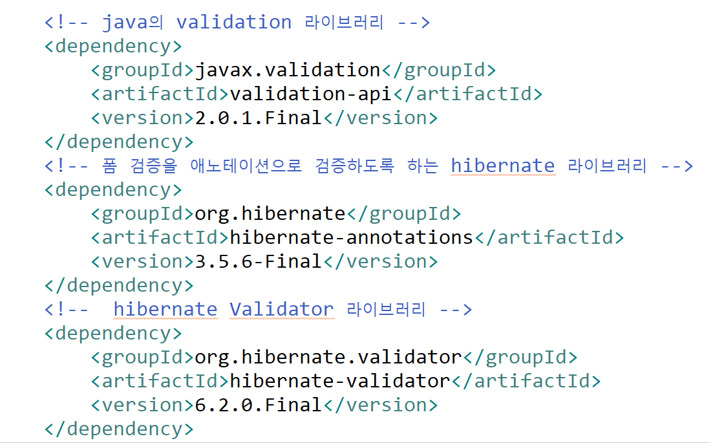

<nav id="quick" style="position:fixed;top:150px;right:100px;width:200px;height:auto;overflow:hidden;z-index:999;background-color:rgba(255,255,255,0.75);">
	<label for="chap8" style="color:black;font-size:28px;">8. 폼 검증(Form Check Validation)</label>
	<input type="radio" name="chap" id="chap8" style="display:none;">
	<ul class="menu">
		<li><a href="#8-1" style="color:black;font-size:20px;text-decoration:none;">8-1. 의존성 라이브러리 추가</a></li>
		<li><a href="#8-2" style="color:black;font-size:20px;text-decoration:none;">8-2. DTO 만들기</a></li>
		<li><a href="#8-3" style="color:black;font-size:20px;text-decoration:none;">8-3. VO 만들기</a></li>
		<li><a href="#8-4" style="color:black;font-size:20px;text-decoration:none;">8-4. CheckValidator 만들기</a></li>
		<li><a href="#8-5" style="color:black;font-size:20px;text-decoration:none;">8-5. CheckValidator2 만들기</a></li>
		<li><a href="#8-6" style="color:black;font-size:20px;text-decoration:none;">8-6. CheckController 만들기</a></li>
		<li><a href="#8-7" style="color:black;font-size:20px;text-decoration:none;">8-7. HTML5 의 pattern 속성을 이용한 폼 검증</a></li>
		<li><a href="#8-8" style="color:black;font-size:20px;text-decoration:none;">8-8. javascript를 이용한 폼 검증</a></li>
		<li><a href="#8-9" style="color:black;font-size:20px;text-decoration:none;">8-9. jQuery를 이용한 폼 검증</a></li>
		<li><a href="#8-10" style="color:black;font-size:20px;text-decoration:none;">8-10. springframework Validator를 이용한 폼 검증</a></li>
		<li><a href="#8-11" style="color:black;font-size:20px;text-decoration:none;">8-11. springframework Validator의 @initBinder과 @Valid 를 이용한 폼 검증</a></li>
		<li><a href="#8-12" style="color:black;font-size:20px;text-decoration:none;">8-12. springframework hibernate Validator를 이용한 폼 검증</a></li>
	</ul>
</nav>

<div id="8"></div>

# 8. 폼 검증(Form Check Validation)

<div id="8-1"></div>

## 8-1. 의존성 라이브러리 추가

### 8-1-1. pom.xml 에 의존성 라이브러리 추가



```xml
<!-- java의 validation 라이브러리 -->		
<dependency>
	<groupId>javax.validation</groupId>
	<artifactId>validation-api</artifactId>
	<version>2.0.1.Final</version>
</dependency>
<!-- 폼 검증을 애노테이션으로 검증하도록 하는 hibernate 라이브러리 -->
<dependency>
	<groupId>org.hibernate</groupId>
	<artifactId>hibernate-annotations</artifactId>
	<version>3.5.6-Final</version>
</dependency> 
<!--  hibernate Validator 라이브러리 -->
<dependency>
	<groupId>org.hibernate.validator</groupId>
	<artifactId>hibernate-validator</artifactId>
	<version>6.2.0.Final</version>
</dependency>
```

<br><br><br>

<div id="8-2"></div>

## 8-2. DTO 만들기

### 8-2-1. com.spring1.util.Check 클래스 생성

```java
package com.spring1.util;

import lombok.AllArgsConstructor;
import lombok.Data;
import lombok.NoArgsConstructor;

//Lombok을 활용한 DTO

@Data
@NoArgsConstructor
@AllArgsConstructor
public class Check {
	private String id;
	private String pw;
}
```

<br><br><br>

<div id="8-3"></div>

## 8-3. VO 만들기

**javax의 validation 어노테이션**

| Annotation | 설명	| 주요 속성 |
|-------------|-------------------------------------------------------------|---------------------|
| @NotNull | 필드가 null이 아닌지 확인합니다.	|  |
| @Size | 문자열, 컬렉션 또는 배열의 크기를 확인합니다. | min, max, message |
| @Pattern | 값이 지정된 정규식과 일치하는지 확인합니다. | regexp, message |
| @Email | 값이 올바른 형식의 이메일 주소인지 확인합니다. |  |
| @Min | 숫자 값이 지정된 최소값보다 크거나 같은지 확인합니다. | value, message |
| @Max | 숫자 값이 지정된 최대값보다 작거나 같은지 확인합니다. | value, message |
| @NotEmpty | 문자열, 컬렉션 또는 배열이 비어 있지 않은지 확인합니다. |  |	
| @NotBlank | 문자열이 공백이 아니라 비어 있지 않은지 확인합니다. |  |

<br><br>

### 8-3-1. com.spring1.util.CheckVO 클래스 생성

```java
package com.spring1.util;

import javax.persistence.Id;
import javax.validation.constraints.NotNull;
import javax.validation.constraints.Pattern;
import javax.validation.constraints.Size;

import lombok.AllArgsConstructor;
import lombok.NoArgsConstructor;

//javax.validation + Lombok 을 활용한 검증 VO

@NoArgsConstructor
@AllArgsConstructor
public class CheckVO {
	
	@Id
	@Size(min=5, max=12, message="아이디는 5~12 자로 작성해야 합니다.")
	@Pattern(regexp="^[a-z0-9]+$", message="영문 소문자와 숫자로만 입력해야 합니다.")
	String id;
	
	
	@NotNull
	@Size(min=8, max=12, message="비밀번호는 8~12 자로 작성해야 합니다.")
	@Pattern(regexp="^[a-zA-Z0-9]+$", message="영문 대소문자와 숫자로만 입력해야 합니다.")
	String pw;


	public String getId() {
		return id;
	}


	public void setId(String id) {
		this.id = id;
	}


	public String getPw() {
		return pw;
	}


	public void setPw(String pw) {
		this.pw = pw;
	}


	@Override
	public String toString() {
		return "CheckVO [id=" + id + ", pw=" + pw + "]";
	}
	
}
```

<br><br><br>

<div id="8-4"></div>

## 8-4. CheckValidator 만들기

**springframework validation 패키지의 클래스 및 인터페이스**

| 클래스 및 인터페이스 | 설명 |
|------------------------|----------------------------------------------------------------------------------|
| Validator | 애플리케이션에서 사용하는 객체를 검증할 수 있는 기능을 제공하는 인터페이스 <br> boolean supports(Class clazz) : 어떤 타입의 객체를 검증할 때 이 객체의 클래스가 이 Validator가 검증할 수 있는 클래스인 지를 판단하는 메소드 <br> void validate(Object target, Errors error) : 실제 검증 로직이 이루어지는 구현 메소드, 구현시에는 ValidationUtils 이나 Errors를 사용하여 편리하게 작성 가능 |
| ValidationUtils | 전달된 값을 검증하는 메소드로 구성된 클래스<br> rejectIfEmpty() : 값이 null이거나 길이가 0인 경우 에러 코드를 추가 <br> rejectIfEmptyOrWhitespace() : 값이 null이거나 길이가 0이거나 값이 공백 문자로 구성되어 있는 경우 에러 코드를 추가 |
| Errors | 에러가 발생할 경우 메시지를 전달하는 클래스 <br> rejectValue() : 해당 컬럼의 에러시 전달할 오류 메시지를 지정 |
| Pattern | java.util.regex 패키지에 속한 클래스로 정규 표현식을 생성하거나 비교할 경우 사용 <br> compile() : 패턴을 생성하는 메소드 <br> matcher() : 비교할 대상을 지정하는 메소드 <br> matches() : 생성된 패턴과 입력데이터를 비교하는 메소드 |

<br><br>

**Pattern 플래그 상수**

| Pattern 플래그 상수 | 기호 | 설명 |
|-----------------------|-----------|-------------------------------------------------------------|
| Pattern.CANON_EQ | None | 표준화된 매칭 모드를 활성화합니다.이 모드가 켜지면 a를 나타내는 유니코드 "\u00E5"와 a와 상단고리 유니코드를 쓴 "a\u030A"를 같다고 매칭합니다. |
| Pattern.CASE_INSENSITIVE | (?i) | 대소문자를 구분하지 않습니다. |
| Pattern.COMMENTS | (?x) | 공백과 주석이 무시됩니다. 주석은 #부터 그 행 끝까지 입니다. |
| Pattern.MULTILINE | (?m) | 다중행 모드를 사용여 모든 ^와 $가 인식됩니다. 기본값은 입력값 전체를 하나의 시작과 끝으로 인식합니다. |
| Pattern.DOTALL | (?s) | .가 개행문자 까지 포함하는 모든 문자로 매칭됩니다. |
| Pattern.LITERAL | None | 입력의 메타문자와 이스케이프된 문자를 일반 문자로 취급합니다. <br> CASE_INSENSITIVE와 UNICODE_CASE는 기능이 유지됩니다. |
| Pattern.UNICODE_CASE | (?u) | 이 모드가 활성화 되면 대소문자 매칭이 유니코드 표준을 따릅니다. 기본은 US-ASCII 문자 집합을 따릅니다. |
| Pattern.UNIX_LINES | (?d) | ^와 $를 처리시 UNIX 개행을 사용합니다. |


<br><br>

### 8-4-1. com.spring1.util.CheckValidator 클래스 생성

```java
package com.spring1.util;

import java.util.regex.Pattern;

import org.slf4j.Logger;
import org.slf4j.LoggerFactory;
import org.springframework.stereotype.Component;
import org.springframework.validation.Errors;
import org.springframework.validation.ValidationUtils;
import org.springframework.validation.Validator;

//springframework validation을 활용한 VO(DTO) 검증

@Component
public class CheckValidator implements Validator {

	private static final Logger log = LoggerFactory.getLogger(CheckValidator.class);
	
	@Override
	public boolean supports(Class<?> clazz) {
		return Check.class.equals(clazz);
	}

	@Override
	public void validate(Object obj, Errors errors) {
		log.info("springframework validation");
		
		Check check = (Check) obj;
		ValidationUtils.rejectIfEmpty(errors, "id", "check.id.empty", "아이디를 입력해주세요");
		ValidationUtils.rejectIfEmpty(errors, "pw", "check.pw.empty", "비밀번호를 입력해주세요");
		
		//아이디 입력 패턴
		Pattern pat1 = Pattern.compile("^[a-z0-9]{5,12}$", Pattern.CASE_INSENSITIVE);
		//비밀번호 입력 패턴
		Pattern pat2 = Pattern.compile("^[a-zA-Z0-9]{8,12}$", Pattern.CASE_INSENSITIVE);
		if(!(pat1.matcher(check.getId()).matches())) {
			errors.rejectValue("id", "check.id.invaild");
		}
		if(!(pat2.matcher(check.getPw()).matches())) {
			errors.rejectValue("pw", "check.pw.invaild");
		}
		
	}
}
```

<br><br><br>

<div id="8-5"></div>

## 8-5. CheckValidator2 만들기

### 8-5-1. com.spring1.util.CheckValidator2 클래스 생성

```java
package com.spring1.util;

import java.util.regex.Pattern;

import org.slf4j.Logger;
import org.slf4j.LoggerFactory;
import org.springframework.validation.Errors;
import org.springframework.validation.Validator;

public class CheckValidator2 implements Validator {
	private static final Logger log = LoggerFactory.getLogger(CheckValidator2.class);
	
    public void validate(Object obj, Errors error) {
        System.out.println("validate action");
        CheckVO check = (CheckVO)obj;

        Pattern pat1 = Pattern.compile("^[a-z0-9]$", Pattern.CASE_INSENSITIVE);
        Pattern pat2 = Pattern.compile("^[a-zA-Z0-9]$", Pattern.CASE_INSENSITIVE);

        if(!(pat1.matcher(check.getId()).matches())){
            error.rejectValue("id", "check.id.invalid", "아이디 형식이 일치하지 않습니다.");
        }
        if(!(pat2.matcher(check.getPw()).matches())){
            error.rejectValue("pw", "check.pw.invalid", "비밀번호 형식이 올바르지 않습니다.");
        }

	    String id = check.getId();
        String pw = check.getPw();

        if(id == null || id.trim().isEmpty()) {
            error.rejectValue("id", "not value");
        }

        if(pw == null || pw.trim().isEmpty()) {
            error.rejectValue("pw", "not value");
        }

        //id가 8~12 이하인지 확인
        if(id.length() < 5 || id.length() > 12) {
            error.rejectValue("id", "id bad size", "아이디의 글자수가 맞지 않습니다.");
        }

        //pw가 6~12자 이하인지 확인
        if(pw.length() < 8 || pw.length() > 12) {
            error.rejectValue("pw", "pw bad size", "비밀번호의 글자수가 맞지 않습니다.");
        }

    }
	
    @Override
    public boolean supports(Class<?> clazz) {
        return CheckVO.class.isAssignableFrom(clazz);
    }
}
```

<br><br><br>

<div id="8-6"></div>

## 8-6. CheckController 만들기

### 8-6-1. com.spring1.controller.CheckController 클래스 생성

```java
package com.spring1.controller;

import java.util.Locale;

import javax.validation.Valid;

import org.springframework.beans.factory.annotation.Autowired;
import org.springframework.context.MessageSource;
import org.springframework.stereotype.Controller;
import org.springframework.ui.Model;
import org.springframework.validation.BindException;
import org.springframework.validation.BindingResult;
import org.springframework.web.bind.WebDataBinder;
import org.springframework.web.bind.annotation.GetMapping;
import org.springframework.web.bind.annotation.InitBinder;
import org.springframework.web.bind.annotation.ModelAttribute;
import org.springframework.web.bind.annotation.PostMapping;
import org.springframework.web.bind.annotation.RequestMapping;
import org.springframework.web.bind.annotation.RequestParam;

import com.spring1.util.BindExceptionWithViewName;
import com.spring1.util.Check;
import com.spring1.util.CheckVO;
import com.spring1.util.CheckValidator;
import com.spring1.util.CheckValidator2;

@Controller
@RequestMapping("/check")
public class CheckController {

	//private CheckVO chk1;
	
	@Autowired
	private CheckValidator check;
	
	@Autowired
	private MessageSource messageSource;
	
	@GetMapping("/")
	public String checkHome(Model model) {
		return "check/home";
	}
	
	@GetMapping("/check1.do")
	public String check1(Model model) {
		return "check/check1";
	}
	
	@PostMapping("/check1pro.do")
	public String check1pro(@RequestParam String id, @RequestParam String pw, Model model) {
		model.addAttribute("id", id);
		model.addAttribute("pw", pw);
		return "check/check1_result";
	}
	
	@GetMapping("/check2.do")
	public String check2(Model model) {
		return "check/check2";
	}
	
	@PostMapping("/check2pro.do")
	public String check2pro(@RequestParam String id, @RequestParam String pw, Model model) {
		model.addAttribute("id", id);
		model.addAttribute("pw", pw);
		return "check/check2_result";
	}
	
	@GetMapping("/check3.do")
	public String check3(Model model) {
		return "check/check3";
	}
	
	@GetMapping("/check3pro.do")
	public String check3pro(@RequestParam String id, @RequestParam String pw, Model model) {
		model.addAttribute("id", id);
		model.addAttribute("pw", pw);
		return "check/check3_result";
	}
	
	@GetMapping("/check4.do")
	public String check4(Model model) {
		return "check/check4";
	}
	
	@PostMapping("/check4pro.do")
	public String check4pro(@ModelAttribute("check") Check check, Model model, BindingResult result) {
		String page = "check/check4_result";
		CheckValidator ckVal = new CheckValidator();
		ckVal.validate(check, result);
		if(result.hasErrors()) {
			page = "check/error4";
		} else {
			model.addAttribute("id", check.getId());
			model.addAttribute("pw", check.getPw());
		}
		return page;
	}
	
	@InitBinder("check")
	protected void initBinder(WebDataBinder binder) {
		binder.setValidator(new CheckValidator());
	}
	
	@InitBinder("chk1")
	protected void initBinder2(WebDataBinder binder) {
		binder.setValidator(new CheckValidator2());
	}

	@GetMapping("/check5.do")
	public String check5(Model model) {
        model.addAttribute("check", new Check());
        return "check/check5";
	}
	
    @PostMapping("/check5pro.do")
    public String check5pro(@Valid @ModelAttribute("check") Check check, BindingResult result, Model model) {
        if (result.hasErrors()) {
            return "check/error5";
        }
        model.addAttribute("check", check);
        return "check/check5_result";
    }
	
	@GetMapping("/check6.do")
	public String check6(Model model, @ModelAttribute("chk1") CheckVO chk1) {
		model.addAttribute("chk1", chk1);
		return "check/check6";
	}
		
    @PostMapping("/check6.do")
    public String check6pro(@Valid @ModelAttribute("chk1") CheckVO chk1, BindingResult result, Model model) {
        if (result.hasErrors()) {
            return "check/check6";
        }
        model.addAttribute("chk1", chk1);
        return "check/check6_result";
    }
}
```

<br><br>

### 8-6-2. 메인 페이지 수정

**src/main/webapp/WEB-INF/views/home.jsp 웹페이지 수정**

```java
<%@ page language="java" contentType="text/html; charset=UTF-8"
    pageEncoding="UTF-8"%>
<%@ taglib uri="http://java.sun.com/jsp/jstl/core" prefix="c" %>
<%@ taglib prefix="c" uri="http://java.sun.com/jsp/jstl/core"  %>
<%@ taglib prefix="fmt" uri="http://java.sun.com/jsp/jstl/fmt" %>
<%@ taglib prefix="fn" uri = "http://java.sun.com/jsp/jstl/functions"%>
<c:set var="path2" value="${pageContext.request.contextPath }" />
<!DOCTYPE html>
<html>
<head>
<meta charset="UTF-8">
<title>메인 페이지</title>
</head>
<body>
	<h2>${serverTime }</h2>
	<h2>${author }</h2>
	<h2>${company }</h2>
	<hr>
	<ul>
		<li><a href="${path2 }/ajax/">AJAX 테스트</a></li>
		<li><a href="${path2 }/ajax2/">AJAX2 테스트</a></li>
		<li><a href="${path2 }/ajax3/">AJAX3 테스트</a></li>
		<li><a href="${path2 }/check/">폼 검증 테스트</a></li>
	</ul>
	<hr>	
</body>
</html>
```

<br><br>

### 8-6-3. 폼 체크 메인 페이지 작성

**src/main/webapp/WEB-INF/views/check/home.jsp 웹페이지 작성**

```
<%@ page language="java" contentType="text/html; charset=UTF-8"
    pageEncoding="UTF-8"%>
<%@ taglib uri="http://java.sun.com/jsp/jstl/core" prefix="c" %>
<%@ taglib prefix="c" uri="http://java.sun.com/jsp/jstl/core"  %>
<%@ taglib prefix="fmt" uri="http://java.sun.com/jsp/jstl/fmt" %>
<%@ taglib prefix="fn" uri = "http://java.sun.com/jsp/jstl/functions"%>
<c:set var="path2" value="${pageContext.request.contextPath }" />
<!DOCTYPE html>
<html>
<head>
<meta charset="UTF-8">
<title>메인 페이지</title>
</head>
<body>
	<h2>Form 검증</h2>
	<hr>
	<ul>
		<li><a href="${path2 }/check/check1.do">Check 폼 검증 테스트1</a></li>
		<li><a href="${path2 }/check/check2.do">Check 폼 검증 테스트2</a></li>
		<li><a href="${path2 }/check/check3.do">Check 폼 검증 테스트3</a></li>
		<li><a href="${path2 }/check/check4.do">Check 폼 검증 테스트4</a></li>
		<li><a href="${path2 }/check/check5.do">Check 폼 검증 테스트5</a></li>
		<li><a href="${path2 }/check/check6.do">Check 폼 검증 테스트6</a></li>
	</ul>
	<hr>	
</body>
</html>
```

<br><br><br>

<div id="8-7"></div>

## 8-7. HTML5 의 pattern 속성을 이용한 폼 검증

**com.spring1.controller.CheckController 클래스에 메소드 추가**

```java
package com.spring1.controller;

import java.util.Locale;

import javax.validation.Valid;

import org.springframework.beans.factory.annotation.Autowired;
import org.springframework.context.MessageSource;
import org.springframework.stereotype.Controller;
import org.springframework.ui.Model;
import org.springframework.validation.BindException;
import org.springframework.validation.BindingResult;
import org.springframework.web.bind.WebDataBinder;
import org.springframework.web.bind.annotation.GetMapping;
import org.springframework.web.bind.annotation.InitBinder;
import org.springframework.web.bind.annotation.ModelAttribute;
import org.springframework.web.bind.annotation.PostMapping;
import org.springframework.web.bind.annotation.RequestMapping;
import org.springframework.web.bind.annotation.RequestParam;

import com.spring1.util.BindExceptionWithViewName;
import com.spring1.util.Check;
import com.spring1.util.CheckVO;
import com.spring1.util.CheckValidator;
import com.spring1.util.CheckValidator2;

@Controller
@RequestMapping("/check")
public class CheckController {

	//private CheckVO chk1;
	
	@Autowired
	private CheckValidator check;
	
	@Autowired
	private MessageSource messageSource;
	
	@GetMapping("/")
	public String checkHome(Model model) {
		return "check/home";
	}
	
	@GetMapping("/check1.do")
	public String check1(Model model) {
		return "check/check1";
	}
	
	@PostMapping("/check1pro.do")
	public String check1pro(@RequestParam String id, @RequestParam String pw, Model model) {
		model.addAttribute("id", id);
		model.addAttribute("pw", pw);
		return "check/check1_result";
	}
}
```

<br><br>

### 8-7-1. 폼 입력 페이지 작성

**src/main/webapp/WEB-INF/views/check/check1.jsp 웹페이지 작성**

```java
<%@ page contentType="text/html;charset=UTF-8" pageEncoding="UTF-8" language="java" %>
<%@ taglib prefix="c" uri="http://java.sun.com/jsp/jstl/core"  %>
<%@ taglib prefix="fmt" uri="http://java.sun.com/jsp/jstl/fmt" %>
<%@ taglib prefix="fn" uri = "http://java.sun.com/jsp/jstl/functions"%>
<!DOCTYPE html>
<html lang="en">
<head>
    <meta charset="UTF-8">
    <meta name="viewport" content="width=device-width, initial-scale=1.0">
    <title>폼 요소에서 유효성 검사 - check1.jsp</title>
</head>
<body>
    <div class="container">
        <h2>form 태그의 pattern, maxlength, required를 이용한 폼 유효성 검증</h2>
        <hr>
        <form action="./check1pro.do" method="post">
            <!-- 영문 소문자와 숫자 조합 글자 길이 5~12 글자 사이의 유효성 패턴 -->
            id : <input type="text" name="id" id="id" pattern="^[a-z0-9]{5,12}" maxlength="12" required /><br><br>
            <!-- 영문 소문자 대문자, 숫자 조합 8~12 글자 사이의 유효성 패턴 -->
            pw : <input type="password" name="pw" id="pw" pattern="^[a-zA-Z0-9]{8,12}" maxlength="12" required /><br><br>
            <button type="submit">확인</button>
        </form>
    </div>
</body>
</html>
```

<br><br>

### 8-7-2. 폼 검증 결과 페이지 작성

**src/main/webapp/WEB-INF/views/check/check1_result.jsp 웹페이지 작성**

```
<%@ page contentType="text/html;charset=UTF-8" pageEncoding="UTF-8" language="java" %>
<%@ taglib prefix="c" uri="http://java.sun.com/jsp/jstl/core"  %>
<%@ taglib prefix="fmt" uri="http://java.sun.com/jsp/jstl/fmt" %>
<%@ taglib prefix="fn" uri = "http://java.sun.com/jsp/jstl/functions"%>
<!DOCTYPE html>
<html lang="en">
<head>
    <meta charset="UTF-8">
    <meta name="viewport" content="width=device-width, initial-scale=1.0">
    <title>form pattern, required, maxlength Result</title>
</head>
<body>
    <h2>check1 결과</h2>
    <hr>
    <p>${id}</p>
    <p>${pw}</p>
</body>
</html>
```

<br><br><br>

<div id="8-8"></div>

## 8-8. javascript를 이용한 폼 검증

**com.spring1.controller.CheckController 클래스에 메소드 추가**

```
package com.spring1.controller;

import java.util.Locale;

import javax.validation.Valid;

import org.springframework.beans.factory.annotation.Autowired;
import org.springframework.context.MessageSource;
import org.springframework.stereotype.Controller;
import org.springframework.ui.Model;
import org.springframework.validation.BindException;
import org.springframework.validation.BindingResult;
import org.springframework.web.bind.WebDataBinder;
import org.springframework.web.bind.annotation.GetMapping;
import org.springframework.web.bind.annotation.InitBinder;
import org.springframework.web.bind.annotation.ModelAttribute;
import org.springframework.web.bind.annotation.PostMapping;
import org.springframework.web.bind.annotation.RequestMapping;
import org.springframework.web.bind.annotation.RequestParam;

import com.spring1.util.BindExceptionWithViewName;
import com.spring1.util.Check;
import com.spring1.util.CheckVO;
import com.spring1.util.CheckValidator;
import com.spring1.util.CheckValidator2;

@Controller
@RequestMapping("/check")
public class CheckController {

	//private CheckVO chk1;
	
	@Autowired
	private CheckValidator check;
	
	@Autowired
	private MessageSource messageSource;
	
	@GetMapping("/")
	public String checkHome(Model model) {
		return "check/home";
	}
	
	@GetMapping("/check1.do")
	public String check1(Model model) {
		return "check/check1";
	}
	
	@PostMapping("/check1pro.do")
	public String check1pro(@RequestParam String id, @RequestParam String pw, Model model) {
		model.addAttribute("id", id);
		model.addAttribute("pw", pw);
		return "check/check1_result";
	}
	
	@GetMapping("/check2.do")
	public String check2(Model model) {
		return "check/check2";
	}
	
	@PostMapping("/check2pro.do")
	public String check2pro(@RequestParam String id, @RequestParam String pw, Model model) {
		model.addAttribute("id", id);
		model.addAttribute("pw", pw);
		return "check/check2_result";
	}
}
```

<br><br>

### 8-8-1. 폼 입력 페이지 작성

**src/main/webapp/WEB-INF/views/check/check2.jsp 웹페이지 작성**

```java
<%@ page contentType="text/html;charset=UTF-8" pageEncoding="UTF-8" language="java" %>
<%@ taglib prefix="c" uri="http://java.sun.com/jsp/jstl/core"  %>
<%@ taglib prefix="fmt" uri="http://java.sun.com/jsp/jstl/fmt" %>
<%@ taglib prefix="fn" uri = "http://java.sun.com/jsp/jstl/functions"%>
<!DOCTYPE html>
<html lang="en">
<head>
    <meta charset="UTF-8">
    <meta name="viewport" content="width=device-width, initial-scale=1.0">
    <title>자바스크립트에서 유효성 검사 - check2.jsp</title>
</head>
<body>
    <div class="container">
        <h2>javascript를 이용한 폼 유효성 검증</h2>
        <hr>
        <form action="./check2pro.do" method="post" onsubmit="return loginCheck(this)">
            <!-- 영문 소문자와 숫자 조합 글자 길이 5~12 글자 사이의 유효성 패턴 -->
            id : <input type="text" name="id" id="id" /><br><br>
            <!-- 영문 소문자 대문자, 숫자 조합 8~12 글자 사이의 유효성 패턴 -->
            pw : <input type="password" name="pw" id="pw" /><br><br>
            <button type="submit">확인</button>
        </form>
        <script>
        var loginCheck = function(f){
            var id = f.id.value;
            var pw = f.pw.value;
            if(id=="" || pw==""){
                alert("아이디 또는 비밀번호 입력 칸이 비어 있습니다.");
                return false;
            }
            if(id.length<5 || id.length>12){
                alert("아이디의 글자 수가 맞지 않습니다. 5~12글자 사이로 입력하시기 바랍니다.");
                return false;
            }
            if(pw.length<8 || pw.length>12){
                alert("비밀번호의 글자 수가 맞지 않습니다. 8~12글자 사이로 입력하시기 바랍니다.");
                return false;
            }   //써큠플렉스(circumflex) = ^ = 위꺽쇠
            var idReg = /^[a-z0-9]{5,12}$/g;    //정규표현식(유효성검증식)
            if(!idReg.test(id)){
                alert("아이디 입력 형식이 맞지 않습니다.");
                return;
            }
            var pwReg = /^[a-zA-Z0-9]{8,12}$/g;
            if(!pwReg.test(pw)){
                alert("비밀번호 입력 형식이 맞지 않습니다.");
                return;
            }
        }
        </script>
    </div>
</body>
</html>
```

<br><br>

### 8-8-2. 폼 검증 결과 페이지 작성

**src/main/webapp/WEB-INF/views/check/check2_result.jsp 웹페이지 작성**

```java
<%@ page contentType="text/html;charset=UTF-8" pageEncoding="UTF-8" language="java" %>
<%@ taglib prefix="c" uri="http://java.sun.com/jsp/jstl/core"  %>
<%@ taglib prefix="fmt" uri="http://java.sun.com/jsp/jstl/fmt" %>
<%@ taglib prefix="fn" uri = "http://java.sun.com/jsp/jstl/functions"%>
<!DOCTYPE html>
<html lang="en">
<head>
    <meta charset="UTF-8">
    <meta name="viewport" content="width=device-width, initial-scale=1.0">
    <title>javascript Result</title>
</head>
<body>
    <h2>check2 결과</h2>
    <hr>
    <p>${id}</p>
    <p>${pw}</p>
</body>
</html>
```

<br><br><br>

<div id="8-9"></div>

## 8-9. jQuery를 이용한 폼 검증

**com.spring1.controller.CheckController 클래스에 메소드 추가**

```java
package com.spring1.controller;

import java.util.Locale;

import javax.validation.Valid;

import org.springframework.beans.factory.annotation.Autowired;
import org.springframework.context.MessageSource;
import org.springframework.stereotype.Controller;
import org.springframework.ui.Model;
import org.springframework.validation.BindException;
import org.springframework.validation.BindingResult;
import org.springframework.web.bind.WebDataBinder;
import org.springframework.web.bind.annotation.GetMapping;
import org.springframework.web.bind.annotation.InitBinder;
import org.springframework.web.bind.annotation.ModelAttribute;
import org.springframework.web.bind.annotation.PostMapping;
import org.springframework.web.bind.annotation.RequestMapping;
import org.springframework.web.bind.annotation.RequestParam;

import com.spring1.util.BindExceptionWithViewName;
import com.spring1.util.Check;
import com.spring1.util.CheckVO;
import com.spring1.util.CheckValidator;
import com.spring1.util.CheckValidator2;

@Controller
@RequestMapping("/check")
public class CheckController {

	//private CheckVO chk1;
	
	@Autowired
	private CheckValidator check;
	
	@Autowired
	private MessageSource messageSource;
	
	@GetMapping("/")
	public String checkHome(Model model) {
		return "check/home";
	}
	
	@GetMapping("/check1.do")
	public String check1(Model model) {
		return "check/check1";
	}
	
	@PostMapping("/check1pro.do")
	public String check1pro(@RequestParam String id, @RequestParam String pw, Model model) {
		model.addAttribute("id", id);
		model.addAttribute("pw", pw);
		return "check/check1_result";
	}
	
	@GetMapping("/check2.do")
	public String check2(Model model) {
		return "check/check2";
	}
	
	@PostMapping("/check2pro.do")
	public String check2pro(@RequestParam String id, @RequestParam String pw, Model model) {
		model.addAttribute("id", id);
		model.addAttribute("pw", pw);
		return "check/check2_result";
	}
	
	@GetMapping("/check3.do")
	public String check3(Model model) {
		return "check/check3";
	}
	
	@GetMapping("/check3pro.do")
	public String check3pro(@RequestParam String id, @RequestParam String pw, Model model) {
		model.addAttribute("id", id);
		model.addAttribute("pw", pw);
		return "check/check3_result";
	}
}
```

<br><br>

### 8-9-1. 폼 입력 페이지 작성

**src/main/webapp/WEB-INF/views/check/check3.jsp 웹페이지 작성**

```java
<%@ page contentType="text/html;charset=UTF-8" pageEncoding="UTF-8" language="java" %>
<%@ taglib prefix="c" uri="http://java.sun.com/jsp/jstl/core"  %>
<%@ taglib prefix="fmt" uri="http://java.sun.com/jsp/jstl/fmt" %>
<%@ taglib prefix="fn" uri = "http://java.sun.com/jsp/jstl/functions"%>
<!DOCTYPE html>
<html lang="en">
<head>
    <meta charset="UTF-8">
    <meta name="viewport" content="width=device-width, initial-scale=1.0">
    <title>jQuery에서 유효성 검사 - check3.jsp</title>
    <script src="https://code.jquery.com/jquery-latest.js"></script>
</head>
<body>
<div class="container">
    <h2>jQuery를 이용한 폼 유효성 검증</h2>
    <hr>
    <!-- 영문 소문자와 숫자 조합 글자 길이 5~12 글자 사이의 유효성 패턴 -->
    id : <input type="text" name="id" id="id" /><br><br>
    <!-- 영문 소문자 대문자, 숫자 조합 8~12 글자 사이의 유효성 패턴 -->
    pw : <input type="password" name="pw" id="pw" /><br><br>
    <button type="button" id="submit-btn">확인</button>
    <script>
    $(document).ready(function(){
       $("#submit-btn").click(function(){
          var id = $("#id").val();
          var pw = $("#pw").val();

          if(id=="" || pw==""){
              alert("아이디 또는 비밀번호 입력 칸이 비어 있습니다.");
              return false;
          }
           if(id.length<5 || id.length>12){
               alert("아이디의 글자 수가 맞지 않습니다. 5~12글자 사이로 입력하시기 바랍니다.");
               return false;
           }
           if(pw.length<8 || pw.length>12){
               alert("비밀번호의 글자 수가 맞지 않습니다. 8~12글자 사이로 입력하시기 바랍니다.");
               return false;
           }   //써큠플렉스(circumflex) = ^ = 위꺽쇠
           var idReg = /^[a-z0-9]{5,12}$/g;    //정규표현식(유효성검증식)
           if(!idReg.test(id)){
               alert("아이디 입력 형식이 맞지 않습니다.");
               return;
           }
           var pwReg = /^[a-zA-Z0-9]{8,12}$/g;
           if(!pwReg.test(pw)){
               alert("비밀번호 입력 형식이 맞지 않습니다.");
               return;
           }
           location.href = "./check3pro.do?id="+id+"&pw="+pw;
       });
    });
    </script>
</div>
</body>
</html>
```

<br><br>

### 8-9-2. 폼 검증 결과 페이지 작성

**src/main/webapp/WEB-INF/views/check/check3_result.jsp 웹페이지 작성**

```java
<%@ page contentType="text/html;charset=UTF-8" pageEncoding="UTF-8" language="java" %>
<%@ taglib prefix="c" uri="http://java.sun.com/jsp/jstl/core"  %>
<%@ taglib prefix="fmt" uri="http://java.sun.com/jsp/jstl/fmt" %>
<%@ taglib prefix="fn" uri = "http://java.sun.com/jsp/jstl/functions"%>
<!DOCTYPE html>
<html lang="en">
<head>
    <meta charset="UTF-8">
    <meta name="viewport" content="width=device-width, initial-scale=1.0">
    <title>jQuery Result</title>
</head>
<body>
    <h2>check3 결과</h2>
    <hr>
    <p>id : ${id}</p>
    <p>pw : ${pw}</p>
</body>
</html>
```

<br><br><br>

<div id="8-10"></div>

## 8-10. springframework Validator를 이용한 폼 검증

**com.spring1.controller.CheckController 클래스에 메소드 추가**

```java
package com.spring1.controller;

import java.util.Locale;

import javax.validation.Valid;

import org.springframework.beans.factory.annotation.Autowired;
import org.springframework.context.MessageSource;
import org.springframework.stereotype.Controller;
import org.springframework.ui.Model;
import org.springframework.validation.BindException;
import org.springframework.validation.BindingResult;
import org.springframework.web.bind.WebDataBinder;
import org.springframework.web.bind.annotation.GetMapping;
import org.springframework.web.bind.annotation.InitBinder;
import org.springframework.web.bind.annotation.ModelAttribute;
import org.springframework.web.bind.annotation.PostMapping;
import org.springframework.web.bind.annotation.RequestMapping;
import org.springframework.web.bind.annotation.RequestParam;

import com.spring1.util.BindExceptionWithViewName;
import com.spring1.util.Check;
import com.spring1.util.CheckVO;
import com.spring1.util.CheckValidator;
import com.spring1.util.CheckValidator2;

@Controller
@RequestMapping("/check")
public class CheckController {

	//private CheckVO chk1;
	
	@Autowired
	private CheckValidator check;
	
	@Autowired
	private MessageSource messageSource;
	
	@GetMapping("/")
	public String checkHome(Model model) {
		return "check/home";
	}
	
	@GetMapping("/check1.do")
	public String check1(Model model) {
		return "check/check1";
	}
	
	@PostMapping("/check1pro.do")
	public String check1pro(@RequestParam String id, @RequestParam String pw, Model model) {
		model.addAttribute("id", id);
		model.addAttribute("pw", pw);
		return "check/check1_result";
	}
	
	@GetMapping("/check2.do")
	public String check2(Model model) {
		return "check/check2";
	}
	
	@PostMapping("/check2pro.do")
	public String check2pro(@RequestParam String id, @RequestParam String pw, Model model) {
		model.addAttribute("id", id);
		model.addAttribute("pw", pw);
		return "check/check2_result";
	}
	
	@GetMapping("/check3.do")
	public String check3(Model model) {
		return "check/check3";
	}
	
	@GetMapping("/check3pro.do")
	public String check3pro(@RequestParam String id, @RequestParam String pw, Model model) {
		model.addAttribute("id", id);
		model.addAttribute("pw", pw);
		return "check/check3_result";
	}
	
	@GetMapping("/check4.do")
	public String check4(Model model) {
		return "check/check4";
	}
	
	@PostMapping("/check4pro.do")
	public String check4pro(@ModelAttribute("check") Check check, Model model, BindingResult result) {
		String page = "check/check4_result";
		CheckValidator ckVal = new CheckValidator();
		ckVal.validate(check, result);
		if(result.hasErrors()) {
			page = "check/error4";
		} else {
			model.addAttribute("id", check.getId());
			model.addAttribute("pw", check.getPw());
		}
		return page;
	}
}
```

<br><br>

### 8-10-1. 폼 입력 페이지 작성

**src/main/webapp/WEB-INF/views/check/check4.jsp 웹페이지 작성**

```java
<%@ page contentType="text/html;charset=UTF-8" pageEncoding="UTF-8" language="java" %>
<%@ taglib prefix="c" uri="http://java.sun.com/jsp/jstl/core"  %>
<%@ taglib prefix="fmt" uri="http://java.sun.com/jsp/jstl/fmt" %>
<%@ taglib prefix="fn" uri = "http://java.sun.com/jsp/jstl/functions"%>
<c:set var="path1" value="${pageContext.servletContext.contextPath }" />
<!DOCTYPE html>
<html lang="en">
<head>
    <meta charset="UTF-8">
    <meta name="viewport" content="width=device-width, initial-scale=1.0">
    <title>Springframework Validator에서 유효성 검사 - check4.jsp</title>
</head>
<body>
<div class="container">
    <h2>Springframework Validator에서 유효성 검사</h2>
    <hr>
    <form action="${path1 }/check/check4pro.do" method="post">
        <!-- 영문 소문자와 숫자 조합 글자 길이 5~12 글자 사이의 유효성 패턴 -->
        id : <input type="text" name="id" id="id" /><br><br>
        <!-- 영문 소문자 대문자, 숫자 조합 8~12 글자 사이의 유효성 패턴 -->
        pw : <input type="password" name="pw" id="pw" /><br><br>
        <button type="submit" id="submit-btn">확인</button>
    </form>
</div>
</body>
</html>
```

<br><br>

### 8-10-2. 폼 검증 결과 페이지 작성

**src/main/webapp/WEB-INF/views/check/check4_result.jsp 웹페이지 작성**

```java
<%@ page contentType="text/html;charset=UTF-8" pageEncoding="UTF-8" language="java" %>
<%@ taglib prefix="c" uri="http://java.sun.com/jsp/jstl/core"  %>
<%@ taglib prefix="fmt" uri="http://java.sun.com/jsp/jstl/fmt" %>
<%@ taglib prefix="fn" uri = "http://java.sun.com/jsp/jstl/functions"%>
<!DOCTYPE html>
<html lang="en">
<head>
    <meta charset="UTF-8">
    <meta name="viewport" content="width=device-width, initial-scale=1.0">
    <title>Springframework Validator Result</title>
</head>
<body>
    <h2>check4 결과</h2>
    <hr>
    <p>id : ${check.id}</p>
    <p>pw : ${check.pw}</p>
</body>
</html>
```

<br><br><br>

<div id="8-11"></div>

## 8-11. springframework Validator의 @initBinder과 @Valid 를 이용한 폼 검증

**com.spring1.controller.CheckController 클래스에 메소드 추가**

```java
package com.spring1.controller;

import java.util.Locale;

import javax.validation.Valid;

import org.springframework.beans.factory.annotation.Autowired;
import org.springframework.context.MessageSource;
import org.springframework.stereotype.Controller;
import org.springframework.ui.Model;
import org.springframework.validation.BindException;
import org.springframework.validation.BindingResult;
import org.springframework.web.bind.WebDataBinder;
import org.springframework.web.bind.annotation.GetMapping;
import org.springframework.web.bind.annotation.InitBinder;
import org.springframework.web.bind.annotation.ModelAttribute;
import org.springframework.web.bind.annotation.PostMapping;
import org.springframework.web.bind.annotation.RequestMapping;
import org.springframework.web.bind.annotation.RequestParam;

import com.spring1.util.BindExceptionWithViewName;
import com.spring1.util.Check;
import com.spring1.util.CheckVO;
import com.spring1.util.CheckValidator;
import com.spring1.util.CheckValidator2;

@Controller
@RequestMapping("/check")
public class CheckController {

	//private CheckVO chk1;
	
	@Autowired
	private CheckValidator check;
	
	@Autowired
	private MessageSource messageSource;
	
	@GetMapping("/")
	public String checkHome(Model model) {
		return "check/home";
	}
	
	@GetMapping("/check1.do")
	public String check1(Model model) {
		return "check/check1";
	}
	
	@PostMapping("/check1pro.do")
	public String check1pro(@RequestParam String id, @RequestParam String pw, Model model) {
		model.addAttribute("id", id);
		model.addAttribute("pw", pw);
		return "check/check1_result";
	}
	
	@GetMapping("/check2.do")
	public String check2(Model model) {
		return "check/check2";
	}
	
	@PostMapping("/check2pro.do")
	public String check2pro(@RequestParam String id, @RequestParam String pw, Model model) {
		model.addAttribute("id", id);
		model.addAttribute("pw", pw);
		return "check/check2_result";
	}
	
	@GetMapping("/check3.do")
	public String check3(Model model) {
		return "check/check3";
	}
	
	@GetMapping("/check3pro.do")
	public String check3pro(@RequestParam String id, @RequestParam String pw, Model model) {
		model.addAttribute("id", id);
		model.addAttribute("pw", pw);
		return "check/check3_result";
	}
	
	@GetMapping("/check4.do")
	public String check4(Model model) {
		return "check/check4";
	}
	
	@PostMapping("/check4pro.do")
	public String check4pro(@ModelAttribute("check") Check check, Model model, BindingResult result) {
		String page = "check/check4_result";
		CheckValidator ckVal = new CheckValidator();
		ckVal.validate(check, result);
		if(result.hasErrors()) {
			page = "check/error4";
		} else {
			model.addAttribute("id", check.getId());
			model.addAttribute("pw", check.getPw());
		}
		return page;
	}
	
	@InitBinder("check")
	protected void initBinder(WebDataBinder binder) {
		binder.setValidator(new CheckValidator());
	}
	
	@GetMapping("/check5.do")
	public String check5(Model model) {
        model.addAttribute("check", new Check());
        return "check/check5";
	}
	
    @PostMapping("/check5pro.do")
    public String check5pro(@Valid @ModelAttribute("check") Check check, BindingResult result, Model model) {
        if (result.hasErrors()) {
            return "check/error5";
        }
        model.addAttribute("check", check);
        return "check/check5_result";
    }
}
```

<br><br>

### 8-11-1. 폼 입력 페이지 작성

**src/main/webapp/WEB-INF/views/check/check5.jsp 웹페이지 작성**

```java
<%@ page contentType="text/html;charset=UTF-8" pageEncoding="UTF-8" language="java" %>
<%@ taglib prefix="c" uri="http://java.sun.com/jsp/jstl/core"  %>
<%@ taglib prefix="fmt" uri="http://java.sun.com/jsp/jstl/fmt" %>
<%@ taglib prefix="fn" uri = "http://java.sun.com/jsp/jstl/functions"%>
<%@ taglib prefix="form" uri="http://www.springframework.org/tags/form" %>
<c:set var="path1" value="${pageContext.servletContext.contextPath}" />
<!DOCTYPE html>
<html lang="en">
<head>
    <meta charset="UTF-8">
    <meta name="viewport" content="width=device-width, initial-scale=1.0">
    <title>Springframework Validator에서 @initBinder+@Valid 유효성 검사 - check5.jsp</title>
</head>
<body>
<div class="container">
    <h2>Springframework Validator에서 @initBinder+@Valid 유효성 검사</h2>
    <hr>
    <p>입력값을 다시 확인해주세요.</p>
    <form:form action="${path1}/check/check5pro.do" method="post" modelAttribute="check">
        아이디 : <form:input path="id" /><br>
        <form:errors path="id" element="div" /><br>
        비밀번호 : <form:password path="pw" /><br>
        <form:errors path="pw" element="div" /><br>
        <button type="submit" id="submit-btn">확인</button>
    </form:form>
</div>
</body>
</html>
```

<br><br>

### 8-11-2. 폼 검증 결과 페이지 작성

**src/main/webapp/WEB-INF/views/check/check5_result.jsp 웹페이지 작성**

```java
<%@ page contentType="text/html;charset=UTF-8" pageEncoding="UTF-8" language="java" %>
<%@ taglib prefix="c" uri="http://java.sun.com/jsp/jstl/core"  %>
<%@ taglib prefix="fmt" uri="http://java.sun.com/jsp/jstl/fmt" %>
<%@ taglib prefix="fn" uri = "http://java.sun.com/jsp/jstl/functions"%>
<!DOCTYPE html>
<html lang="en">
<head>
    <meta charset="UTF-8">
    <meta name="viewport" content="width=device-width, initial-scale=1.0">
    <title>Springframework Validator에서 @initBinder+@Valid Result</title>
</head>
<body>
<h2>check5 결과</h2>
<hr>
    <p>id : ${check.id}</p>
    <p>pw : ${check.pw}</p>
</body>
</html>
```

<br><br><br>

<div id="8-12"></div>

## 8-12. springframework hibernate Validator를 이용한 폼 검증

**com.spring1.controller.CheckController 클래스에 메소드 추가**

```java
package com.spring1.controller;

import java.util.Locale;

import javax.validation.Valid;

import org.springframework.beans.factory.annotation.Autowired;
import org.springframework.context.MessageSource;
import org.springframework.stereotype.Controller;
import org.springframework.ui.Model;
import org.springframework.validation.BindException;
import org.springframework.validation.BindingResult;
import org.springframework.web.bind.WebDataBinder;
import org.springframework.web.bind.annotation.GetMapping;
import org.springframework.web.bind.annotation.InitBinder;
import org.springframework.web.bind.annotation.ModelAttribute;
import org.springframework.web.bind.annotation.PostMapping;
import org.springframework.web.bind.annotation.RequestMapping;
import org.springframework.web.bind.annotation.RequestParam;

import com.spring1.util.BindExceptionWithViewName;
import com.spring1.util.Check;
import com.spring1.util.CheckVO;
import com.spring1.util.CheckValidator;
import com.spring1.util.CheckValidator2;

@Controller
@RequestMapping("/check")
public class CheckController {

	//private CheckVO chk1;
	
	@Autowired
	private CheckValidator check;
	
	@Autowired
	private MessageSource messageSource;
	
	@GetMapping("/")
	public String checkHome(Model model) {
		return "check/home";
	}
	
	@GetMapping("/check1.do")
	public String check1(Model model) {
		return "check/check1";
	}
	
	@PostMapping("/check1pro.do")
	public String check1pro(@RequestParam String id, @RequestParam String pw, Model model) {
		model.addAttribute("id", id);
		model.addAttribute("pw", pw);
		return "check/check1_result";
	}
	
	@GetMapping("/check2.do")
	public String check2(Model model) {
		return "check/check2";
	}
	
	@PostMapping("/check2pro.do")
	public String check2pro(@RequestParam String id, @RequestParam String pw, Model model) {
		model.addAttribute("id", id);
		model.addAttribute("pw", pw);
		return "check/check2_result";
	}
	
	@GetMapping("/check3.do")
	public String check3(Model model) {
		return "check/check3";
	}
	
	@GetMapping("/check3pro.do")
	public String check3pro(@RequestParam String id, @RequestParam String pw, Model model) {
		model.addAttribute("id", id);
		model.addAttribute("pw", pw);
		return "check/check3_result";
	}
	
	@GetMapping("/check4.do")
	public String check4(Model model) {
		return "check/check4";
	}
	
	@PostMapping("/check4pro.do")
	public String check4pro(@ModelAttribute("check") Check check, Model model, BindingResult result) {
		String page = "check/check4_result";
		CheckValidator ckVal = new CheckValidator();
		ckVal.validate(check, result);
		if(result.hasErrors()) {
			page = "check/error4";
		} else {
			model.addAttribute("id", check.getId());
			model.addAttribute("pw", check.getPw());
		}
		return page;
	}
	
	@InitBinder("check")
	protected void initBinder(WebDataBinder binder) {
		binder.setValidator(new CheckValidator());
	}
	
	@InitBinder("chk1")
	protected void initBinder2(WebDataBinder binder) {
		binder.setValidator(new CheckValidator2());
	}

	@GetMapping("/check5.do")
	public String check5(Model model) {
        model.addAttribute("check", new Check());
        return "check/check5";
	}
	
    @PostMapping("/check5pro.do")
    public String check5pro(@Valid @ModelAttribute("check") Check check, BindingResult result, Model model) {
        if (result.hasErrors()) {
            return "check/error5";
        }
        model.addAttribute("check", check);
        return "check/check5_result";
    }
	
	@GetMapping("/check6.do")
	public String check6(Model model, @ModelAttribute("chk1") CheckVO chk1) {
		model.addAttribute("chk1", chk1);
		return "check/check6";
	}
		
    @PostMapping("/check6.do")
    public String check6pro(@Valid @ModelAttribute("chk1") CheckVO chk1, BindingResult result, Model model) {
        if (result.hasErrors()) {
            return "check/check6";
        }
        model.addAttribute("chk1", chk1);
        return "check/check6_result";
    }
}
```

<br><br>

### 8-11-1. 폼 입력 페이지 작성

**src/main/webapp/WEB-INF/views/check/check6.jsp 웹페이지 작성**

```java
<%@ page contentType="text/html;charset=UTF-8" pageEncoding="UTF-8" language="java" %>
<%@ taglib prefix="c" uri="http://java.sun.com/jsp/jstl/core"  %>
<%@ taglib prefix="fmt" uri="http://java.sun.com/jsp/jstl/fmt" %>
<%@ taglib prefix="fn" uri = "http://java.sun.com/jsp/jstl/functions"%>
<%@ taglib prefix="form" uri="http://www.springframework.org/tags/form" %>
<c:set var="path1" value="${pageContext.servletContext.contextPath }" />
<!DOCTYPE html>
<html lang="en">
<head>
    <meta charset="UTF-8">
    <meta name="viewport" content="width=device-width, initial-scale=1.0">
    <title>hibernate Validator에서 유효성 검사 - check6.jsp</title>
</head>
<body>
<div class="container">
    <h2>hibernate Validator에서 유효성 검사</h2>
    <hr>
    <form:form action="${path1 }/check/check6.do" method="post" modelAttribute="chk1">
        아이디 : <form:input path="id"/><br>
        <form:errors path="id" element="div" delimiter=" "/>

        비밀번호 : <form:password path="pw"/><br>
        <form:errors path="pw" element="div" delimiter=" "/>

        <button class="btn" type="submit"> 전송 </button>
    </form:form>
</div>
</body>
</html>
```

<br><br>

### 8-11-2. 폼 검증 결과 페이지 작성

**src/main/webapp/WEB-INF/views/check/check6_result.jsp 웹페이지 작성**

```java
<%@ page contentType="text/html;charset=UTF-8" pageEncoding="UTF-8" language="java" %>
<%@ taglib prefix="c" uri="http://java.sun.com/jsp/jstl/core"  %>
<%@ taglib prefix="fmt" uri="http://java.sun.com/jsp/jstl/fmt" %>
<%@ taglib prefix="fn" uri = "http://java.sun.com/jsp/jstl/functions"%>
<!DOCTYPE html>
<html lang="en">
<head>
    <meta charset="UTF-8">
    <meta name="viewport" content="width=device-width, initial-scale=1.0">
    <title>hibernate Result</title>
</head>
<body>
<h2>check6 결과</h2>
<hr>
<p>id : ${chk.id}</p>
<p>pw : ${chk.pw}</p>
</body>
</html>
```

<br><br><br>

<br><br><hr><br><br>

# 9. 암호화 그리고, Filter와 Spring Security Interceptor, AOP(Aspect Oriented Programming)

- 암호화 : org.springframework.security.crypto.bcrypt.BCryptPasswordEncoder
- Filter : web.xml에 등록된 필터를 이용하여 접근제어
- Spring Security Interceptor : servlet-context에 등록된 Interceptor를 이용하여 접근제어
- AOP(Aspect Oriented Programming) : 관점지향형 프로그래밍

<br><br>

