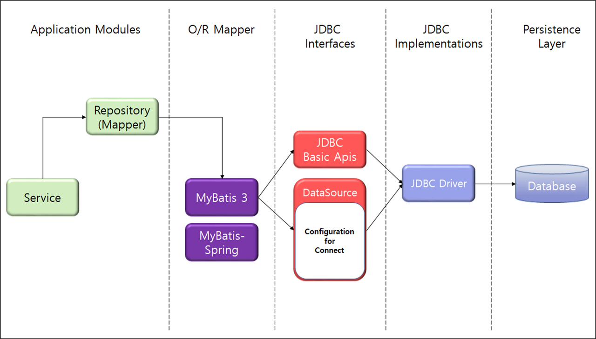
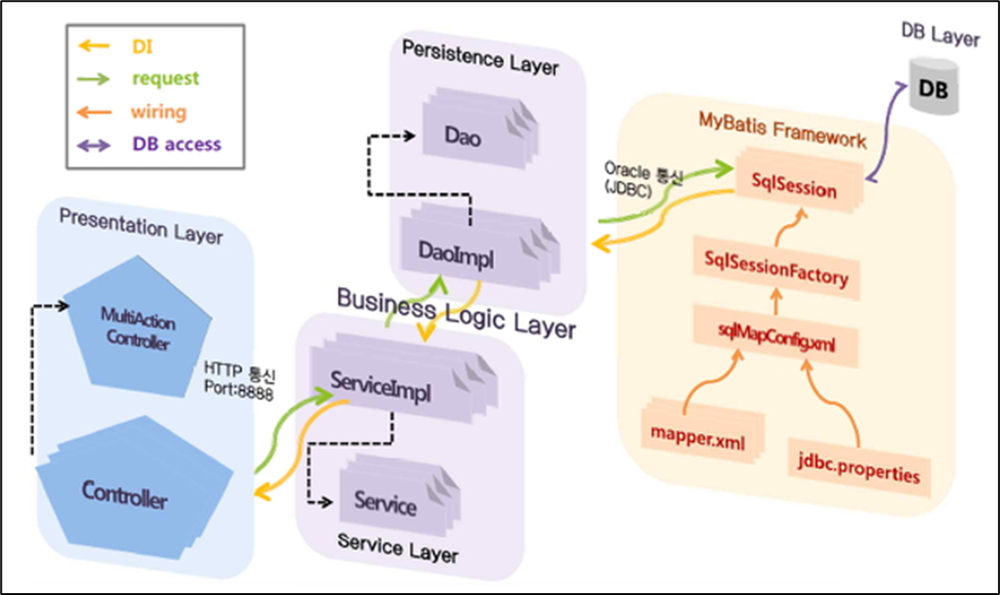
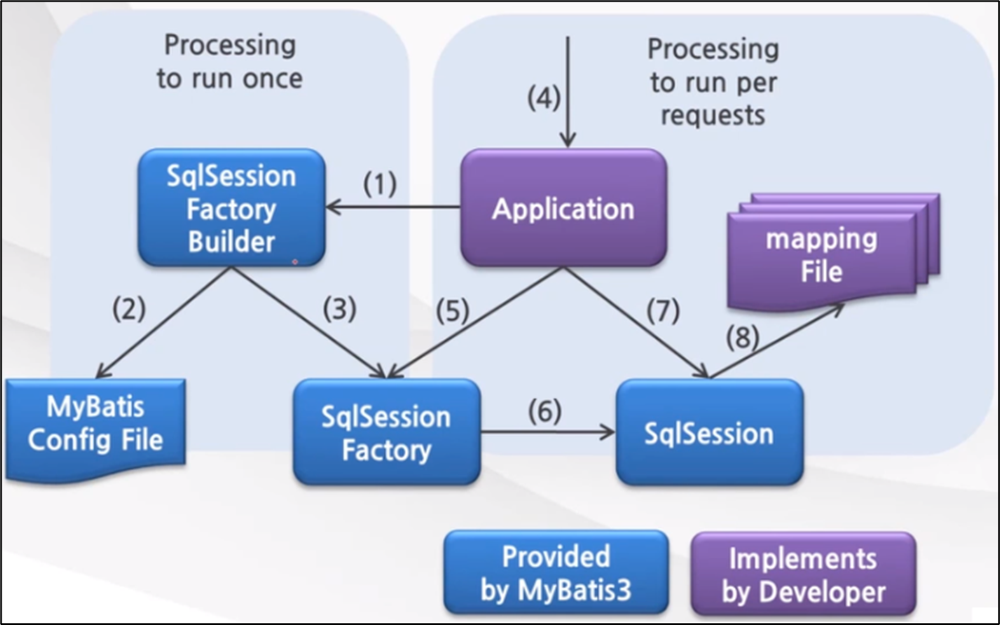
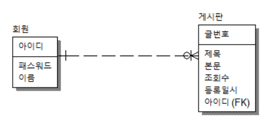

<nav id="quick" style="position:fixed;top:150px;right:100px;width:200px;height:auto;overflow:hidden;z-index:999;background-color:rgba(255,255,255,0.75);">
	<label for="chap10" style="color:black;font-size:28px;">10. Mybatis & Mapper XML</label>
	<input type="radio" name="chap" id="chap10" style="display:none;">
	<ul class="menu">
		<li><a href="#10-1" style="color:black;font-size:20px;text-decoration:none;">10-1. MyBatis 개념</a></li>
		<li><a href="#10-2" style="color:black;font-size:20px;text-decoration:none;">10-2. MyBatis 설정</a></li>
		<li><a href="#10-3" style="color:black;font-size:20px;text-decoration:none;">10-3. MyBatis 기본 문법</a></li>
		<li><a href="#10-4" style="color:black;font-size:20px;text-decoration:none;">10-4. MyBatis 동적 SQL 구현</a></li>
	</ul>	
</nav>

<div id="10"></div>

# 10. Mybatis & Mapper XML

<div id="10-1"></div>

## 10-1. MyBatis 개념

### 10-1-1. MyBatis 란?

- 객체 지향 언어인 자바의 관계형 데이터베이스 프로그래밍을 좀 더 쉽게 할 수 있게 도와 주는 개발 프레임 워크로서 JDBC를 통해 데이터베이스에 엑세스하는 작업을 캡슐화하고 일반 SQL 쿼리, 저장 프로 시저 및 고급 매핑을 지원하며 모든 JDBC 코드 및 매개 변수의 중복작업을 제거 합니다. Mybatis에서는 프로그램에 있는 SQL쿼리들을 한 구성파일에 구성하여 프로그램 코드와 SQL을 분리할 수 있는 장점을 가지고 있습니다.

<br><br>

### 10-1-2. MyBatis 주요 구성 요소

<br>



<br>

1. 응용 프로그램이 SqlSessionFactoryBuilder를 위해 SqlSessionFactory를 빌드하도록 요청합니다.
2. SqlSessionFactoryBuilder는 SqlSessionFactory를 생성하기 위한 MyBatis 구성 파일을 읽습니다.
3. SqlSessionFactoryBuilder는 MyBatis 구성 파일의 정의에 따라 SqlSessionFactory를 생성합니다.

<br>

| 구성 요소 | 설명 |
|------------------------|---------------------------------------------------------------------------|
| SqlSessionFactoryBuilder | - MyBatis3 구성 파일을 읽고 SqlSessionFactory를 생성하는 구성 요소입니다.<br>- 해당 클래스는 인스턴스화되어 사용되고 던져질 수 있으며, SqlSessionFactory를 생성한 후 유지할 필요가 없다. <br><br> · XML, 어노테이션, 자바 설정을 통해 SqlSessionFactory를 생성할 수 있습니다. <br><br> · SqlSessionFactory build(InputStream inputStream) <br> · SqlSessionFactory build(InputStream inputStream, String environment) <br> · SqlSessionFactory build(InputStream inputStream, Properties properties) <br> · SqlSessionFactory build(InputStream inputStream, String env, Properties props) <br> · SqlSessionFactory build(Configuration config) |
| SqlSessionFactory | SqlSession을 생성하는 구성 요소입니다. <br> SqlSessionFactory는 애플리케이션을 실행하는 동안 존재해야한다. <br> 때문에, SqlSessionFactory의 생명주기를 싱글톤으로 관리하는 것이 좋다. <br> · 오토 커밋 여부, 설정된 DataSource 사용, 적용 모드를 파라미터로 설정할 수 있습니다. <br> · ExecutorType.SIMPLE : 구문 실행마다 새로운 PreparedStatement를 생성합니다. <br> · ExecutorType.REUSE : 생성된 PreparedStatements를 재사용합니다. <br> · ExecutorType.BATCH : update 구문을 일괄 처리합니다. <br><br> · SqlSession openSession() <br> · SqlSession openSession(boolean autoCommit) <br> · SqlSession openSession(Connection connection) <br> · SqlSession openSession(TransactionIsolationLevel level) <br> · SqlSession openSession(ExecutorType execType, TransactionIsolationLevel level) <br> · SqlSession openSession(ExecutorType execType) <br> · SqlSession openSession(ExecutorType execType, boolean autoCommit) <br> · SqlSession openSession(ExecutorType execType, Connection connection) |
| SqlSession | SQL 실행 및 트랜잭션 제어를 위한 API를 제공하는 구성 요소입니다. <br> SqlSession 인스턴스는 공유되지 않고, 쓰레드에 안전하지 않다. <br> 때문에, 요청 또는 메소드 스코프로 사용하는 것이 좋다. <br> SqlSession은 static 필드나 클래스의 인스턴스 필드로 지정하지 않고, 요청을 받을때마다 만들고 닫는 것이 중요하다. <br><br> · 데이터를 조작할 수 있는 CRUD 기능을 제공합니다. <br> · 트랜잭션 제어를 할 수 있는 기능을 제공합니다. <br> · JDBC 드라이버 클래스에 저장된 배치 수정구문을 지우는 flush 기능을 제공합니다. <br><br> · <T> T selectOne(String statement) <br> · <E> List<E> selectList(String statement) <br> · <T> Cursor<T> selectCursor(String statement) <br> · <K,V> Map<K,V> selectMap(String statement, String mapKey) <br> · int insert(String statement) <br> · int update(String statement) <br> · int delete(String statement) <br> · void commit() <br> · List<BatchResult> flushStatements() <br> · void rollback() |

<br><br>

### 10-1-3. MyBatis-Spring 컴포넌트 구조

<br>



<br>

1. SqlSessionFactoryBean은 SqlSessionFactoryBuilder를 위해 SqlSessionFactory를 빌드하도록 요청합니다.
2. SessionFactoryBuilder는 SqlSessionFactory 생성을 위해 MyBatis 구성 파일을 읽습니다. 
3. SqlSessionFactoryBuilder는 MyBatis 구성 파일의 정의에 따라 SqlSessionFactory를 생성합니다. 따라서 생성된 SqlSessionFactory는 Spring DI 컨테이너에 의해 저장됩니다.
4. MapperFactoryBean은 안전한 SqlSession(SqlSessionTemplate) 및 스레드 안전 매퍼 개체(Mapper 인터페이스의 프록시 객체)를 생성합니 다. 따라서 생성되는 매퍼 객체는 스프링 DI 컨테이너에 의해 저장되며 서비스 클래스 등에 DI가 적용됩니다. 매퍼 개체는 안전한 SqlSession(SqlSessionTemplate)을 사용하여 스레드 안전 구현을 제공합니다.

<br>

| 구성 요소 | 설명 |
|------------------------|---------------------------------------------------------------------------|
| SqlSessionFactoryBean | SqlSessionFactory를 작성하고 Srping DI 컨테이너에 개체를 저장하는 구성 요소입니다. <br> 표준 MyBatis3에서 SqlSessionFactory는 MyBatis 구성 파일에 정의된 정보를 기반으로 합니다. <br> 그러나 SqlSessionFactoryBean을 사용하면 MyBatis 구성 파일이 없어도 SqlSessionFactory를 빌드할 수 있습니다. |
| MapperFactoryBean | Singleton Mapper 개체를 만들고 Spring DI 컨테이너에 개체를 저장하는 구성 요소입니다. <br> MyBatis3 표준 메커니즘에 의해 생성된 매퍼 객체는 스레드가 안전하지 않습니다.따라서 각 스레드에 대한 인스턴스를 할당해야 했습니다. MyBatis-Spring 구성 요소에 의해 생성된 매퍼 개체는 안전한 매퍼 개체를 생성할 수 있습니다. 따라서 서비스 등 싱글톤 구성요소에 DI를 적용할 수 있습니다. |
| SqlSessionTemplate | SqlSession 인터페이스를 구현하는 Singleton 버전의 SqlSession 구성 요소입니다. <br> 쓰레드에 안전하고 여러개의 DAO나 매퍼에서 공유할 수 있습니다. 커밋이나 롤백 등 트랜잭션과 세션의 생명주기를 관리해줍니다. |
| root-context.xml | 데이터베이스의 접속 주소 정보나 Mapping File의 경로 등의 고정된 환경정보를 설정합니다. |
| mybatis-config.xml | MyBatis를 통하여 오고 가는 데이터를 저장할 DTO에 대한 환경설정을 합니다. |
| xxxMapper.xml | MyBatis 명령에 해당하는 xml 태그가 있는 mapper 파일을 작성합니다. |


<br>



- MyBatis는 개발자가 지정한 SQL, 저장프로시저, 몇가지 고급 매핑을 지원하는 퍼시스턴스 프레임워크
- JDBC로 처리하는 상당부분의 코드와 파라미터 설정 및 결과 매핑을 대신 처리해줌.


<br><br><br>

<div id="10-2"></div>

## 10-2. MyBatis 설정

<br><br>

### 10-2-1. MyBatis 라이브러리 의존성 등록

- MyBatis를 사용하기 위해 메이븐에 의존성 추가
- mybatis-x.x.x.jar 파일을 클래스패스에 두어 사용할 수도 있음

**pom.xml 파일에 MyBatis 내용 추가**

```xml
	<dependency>
		<groupId>org.mybatis</groupId>
		<artifactId>mybatis</artifactId>
		<version>3.4.0</version>
	</dependency>

	<dependency>
		<groupId>org.mybatis</groupId>
		<artifactId>mybatis-spring</artifactId>
		<version>1.3.2</version>
	</dependency>
```

<br><br>

### 10-2-2. MyBatis 의존성 추가 및 주입

- 마이바티스의 핵심이 되는 설정은 트랜잭션을 제어하기 위한 TransactionManager과 함께 데이터베이스 Connection 인스턴스를 가져오기 위한 DataSource를 포함합니다.
- 연동 DB 정보, mapper 위치 설정
- SQL을 수행하는 SqlSession 객체 생성 및 주입
- 트랜잭션 및 로깅 수행 설정과 주입


**src/main/webapp/WEB-INF/spring/root-context.xml 파일 작성**

```xml
<?xml version="1.0" encoding="UTF-8"?>
<beans xmlns="http://www.springframework.org/schema/beans"
	xmlns:xsi="http://www.w3.org/2001/XMLSchema-instance"
	xmlns:mybatis-spring="http://mybatis.org/schema/mybatis-spring"
	xmlns:context="http://www.springframework.org/schema/context"
	xmlns:aop="http://www.springframework.org/schema/aop"
	xmlns:jdbc="http://www.springframework.org/schema/jdbc"
	xmlns:tx="http://www.springframework.org/schema/tx"
	xsi:schemaLocation="http://www.springframework.org/schema/jdbc http://www.springframework.org/schema/jdbc/spring-jdbc-4.3.xsd
		http://mybatis.org/schema/mybatis-spring http://mybatis.org/schema/mybatis-spring-1.2.xsd
		http://www.springframework.org/schema/beans https://www.springframework.org/schema/beans/spring-beans.xsd
		http://www.springframework.org/schema/context http://www.springframework.org/schema/context/spring-context-4.3.xsd
		http://www.springframework.org/schema/aop http://www.springframework.org/schema/aop/spring-aop-4.3.xsd
		http://www.springframework.org/schema/tx http://www.springframework.org/schema/tx/spring-tx-4.3.xsd">
	
	<!-- Root Context: defines shared resources visible to all other web components -->
	<!-- 데이터베이스 설정 -->
	<!-- spring-jdbc-5.0.8.RELEASE.jar 안의 드라이버매니저 연결 -->
	<bean id="dataSource" class="org.springframework.jdbc.datasource.DriverManagerDataSource">
	<!-- 데이터 소스 및 드라이버 설정 : log4jdbc-log4j2-jdbc4-1.16.jar -->
		<property name="driverClassName" value="net.sf.log4jdbc.sql.jdbcapi.DriverSpy"></property>
	<!-- 연결 url, 사용자 아이디, 비밀번호 설정  -->
		<property name="url" value="jdbc:log4jdbc:oracle:thin:@localhost:1521:xe" />
		<property name="username" value="system" />
		<property name="password" value="1234"></property>
	</bean>
	<!-- sql을 대신할 my-batis 설정 : mybatis-spring-1.3.2.jar의 세션팩토리빈클래스 연결 -->
	<bean id="sqlSessionFactory" class="org.mybatis.spring.SqlSessionFactoryBean">
		<property name="dataSource" ref="dataSource" />
		<!-- mybatis 설정파일 등록-->
		<property name="configLocation" value="classpath:/mybatis-config.xml"></property>
		<!-- sql처럼 데이터베이스와 자바 클래스를 데이터 연관을 지어줄 파일 위치와 이름 지정 -->
		<property name="mapperLocations" value="classpath:mappers/**/*Mapper.xml"></property>
	</bean>	
	<!-- SqlSession 객체 주입 -->
	<bean id="sqlSession" class="org.mybatis.spring.SqlSessionTemplate" destroy-method="clearCache">
		<constructor-arg name="sqlSessionFactory" ref="sqlSessionFactory"></constructor-arg>
	</bean>
	
	<!-- 트랜잭션 및 DB 패키지 방안 및 각 종 로깅과 보안 설정 -->
	<bean id="transactionManager" class="org.springframework.jdbc.datasource.DataSourceTransactionManager">
		<property name="dataSource" ref="dataSource" />
	</bean>
		
	<!-- @Transactional 어노테이션 처리 -->
	<tx:annotation-driven transaction-manager="transactionManager" />	
</beans>
```

<br><br>

### 10-2-3. MyBatis 설정

#### 10-2-3-1. package 로 설정

**src/main/resources/mybatis-config.xml 파일 작성**

```xml
<?xml version="1.0" encoding="UTF-8"?>
<!DOCTYPE configuration PUBLIC 
"-//mybatis.org//DTD Config 3.0//EN" 
"http://mybatis.org/dtd/mybatis-3-config.dtd">
<configuration>
	<typeAliases>
		<package name="com.spring1" />
	</typeAliases>
</configuration>
```

<br><br>

#### 10-2-3-2. typeAlias 로 설정

- alias(별칭)이 중복되어서는 안되며, 사용자가 생성한 DTO나 VO 클래스로 하거나 아래에서 제시한 타입은 기본으로 제공하고 있어서 보통은 기본 타입이나 자바 타입의 경우는 설정하지 않는다.

| 별칭 | 매핑된 타입 |
|-----------------------------------|----------------------------------------|
| _byte	| byte |
| _char (since 3.5.10)	| char |
| _character (since 3.5.10)	| char |
| _long	| long |
| _short | short |
| _int | int |
| _integer | int |
| _double | double |
| _float | float |
| _boolean | boolean |
| string | String |
| byte | Byte |
| char (since 3.5.10) | Character |
| character (since 3.5.10) | Character |
| long | Long |
| short | Short |
| int | Integer |
| integer | Integer |
| double | Double |
| float | Float |
| boolean | Boolean |
| date | Date |
| decimal | BigDecimal |
| bigdecimal | BigDecimal |
| biginteger | BigInteger |
| object | Object |
| date[] | Date[] |
| decimal[] | BigDecimal[] |
| bigdecimal[] | BigDecimal[] |
| biginteger[]	BigInteger[] |
| object[] | Object[] |
| map | Map |
| hashmap | HashMap |
| list | List |
| arraylist | ArrayList |
| collection | Collection |
| iterator | Iterator |

<br>

**src/main/resources/mybatis-config.xml 파일 작성**

```xml
<?xml version="1.0" encoding="UTF-8"?>
<!DOCTYPE configuration PUBLIC 
"-//mybatis.org//DTD Config 3.0//EN" 
"http://mybatis.org/dtd/mybatis-3-config.dtd">
<configuration>
	<typeAliases>
		<typeAlias type="com.spring1.dto.Board" alias="Board" />
		<typeAlias type="com.spring1.dto.Custom" alias="Custom" />
		<typeAlias type="com.spring1.dto.Sample" alias="Sample" />
	</typeAliases>
</configuration>
```

<br><br>

### 10-2.4. Mapper 파일 생성

**src/main/resources/mappers/boardMapper.xml 파일 생성**

```xml
<?xml version="1.0" encoding="UTF-8"?>
<!DOCTYPE mapper PUBLIC 
"-//mybatis.org//DTD Mapper 3.0//EN" 
"http://mybatis.org/dtd/mybatis-3-mapper.dtd">
<mapper namespace="board">

</mapper>
```

<br><br><br>

<div id="10-3"></div>

## 10-3. MyBatis 기본 문법

[MyBatis 메뉴얼](https://mybatis.org/mybatis-3/ko/getting-started.html)

<br><br>

### 10-3-0. 기본 태그

| 기본 태그 | 설명 |
|--------------|------------------------------------------------------------------------|
| cache | 해당 네임스페이스을 위한 캐시 설정 |
| cache-ref | 다른 네임스페이스의 캐시 설정에 대한 참조 |
| resultMap | 데이터베이스 결과데이터를 객체에 로드하는 방법을 정의하는 엘리먼트 |
| include | sql 태그로 정의된 부분을 해당 태그에 삽입할 경우 사용하는 엘리먼트 |
| sql | 다른 구문에서 재사용하기 위한 SQL 조각을 정의하는 엘리먼트 |
| insert | sql의 INSERT 구문을 매핑하는 엘리먼트 |
| update | sql의 UPDATE 구문을 매핑하는 엘리먼트 |
| delete | sql의 DELETE 구문을 매핑하는 엘리먼트 |
| select | sql의 SELECT 구문을 매핑하는 엘리먼트 |

<br><br>

**select 태그 구문에 적용할 수 있는 속성**

| 속성 | 설명 |
|-------------------|--------------------------------------------------------------------------|
| id | 구문을 찾기 위해 사용될 수 있는 네임스페이스내 유일한 구분자로서 절대 중복되서는 안됨 |
| parameterType | 구문에 전달될 파라미터의 패키지 경로를 포함한 전체 클래스명이나 별칭 |
| resultType | 구문에 의해 리턴되는 반환타입의 패키지 경로를 포함한 전체 클래스명이나 별칭. <br> collection인 경우 collection 타입 자체가 아닌 collection 이 포함된 타입이 될 수 있음. <br> resultType이나 resultMap을 사용함 |
| resultMap | 외부 resultMap 의 참조명. 결과맵은 마이바티스의 가장 강력한 기능 <br> resultType이나 resultMap을 사용함 |
| flushCache | true 로 셋팅하면 구문이 호출될때마다 로컬, 2nd 레벨 캐시가 지워질것이다(flush). 디폴트는 false임 |
| useCache | true 로 셋팅하면 구문의 결과가 2nd 레벨 캐시에 캐시 될 것이며, 디폴트는 true임
timeout	예외가 던져지기 전에 데이터베이스의 요청 결과를 기다리는 최대시간을 설정함. 디폴트는 셋팅하지 않는 것이고 드라이버에 따라 다소 지원되지 않을 수 있음 |
| fetchSize | 지정된 수만큼의 결과를 리턴하도록 하는 드라이버 힌트 형태의 값이며, 디폴트는 셋팅하지 않는 것이고 드라이버에 따라 다소 지원되지 않을 수 있음 |
| statementType | STATEMENT, PREPARED 또는 CALLABLE 중 하나를 선택할 수 있으며, 마이바티스에게 Statement, PreparedStatement 또는 CallableStatement를 사용하게 함. 디폴트는 PREPARED임 |
| resultSetType | FORWARD_ONLY, SCROLL_SENSITIVE, SCROLL_INSENSITIVE, DEFAULT(same as unset)중 하나를 선택할 수 있으며, 디폴트는 셋팅하지 않는 것이고 드라이버에 다라 다소 지원되지 않을 수 있음 |
| databaseId | 설정된 databaseIdProvider가 있는 경우 마이바티스는 databaseId 속성이 없는 모든 구문을 로드하거나 일치하는 databaseId와 함께 로드될 것임. 같은 구문에서 databaseId가 있거나 없는 경우 모두 있다면 뒤에 나온 것이 무시됨. |
| resultOrdered | 이 설정은 내포된 결과를 조회하는 구문에서만 적용이 가능하며, true로 설정하면 내포된 결과를 가져오거나 새로운 주요 결과 레코드를 리턴할때 함께 가져오도록 함. 이전의 결과 레코드에 대한 참조는 더 이상 발생하지 않음. 이 설정은 내포된 결과를 처리할때 조금 더 많은 메모리를 채우며, 디폴트값은 false 임 |
| resultSets | 여러 결과 세트에만 적용 가능합니다. 명령문에 의해 반환될 결과 집합을 나열하고 각 결과 집합에 이름을 지정하며, 이름은 쉼표로 구분됨 |
| affectData | 트랜잭션이 올바르게 제어되도록 데이터를 반환하는 INSERT, UPDATE 또는 DELETE 문을 작성할 때 이를 true로 설정하며, 기본값: false (since 3.5.12) |

<br><br>

**insert/update/delete 태그 구문에 적용할 수 있는 속성**

| 속성 | 설명 |
|-------------------|--------------------------------------------------------------------------|
| id | 구문을 찾기 위해 사용될 수 있는 네임스페이스내 유일한 구분자로서 절대 중복되서는 안됨 |
| parameterType | 구문에 전달될 파라미터의 패키지 경로를 포함한 전체 클래스명이나 별칭 |
| flushCache | true 로 셋팅하면 구문이 호출될때마다 로컬, 2nd 레벨 캐시가 지워질것이다(flush). 디폴트는 false임 |
| statementType | STATEMENT, PREPARED 또는 CALLABLE 중 하나를 선택할 수 있으며, 마이바티스에게 Statement, PreparedStatement 또는 CallableStatement를 사용하게 함. 디폴트는 PREPARED임 |
| timeout | 예외가 던져지기 전에 데이터베이스의 요청 결과를 기다리는 최대시간을 설정하며, 디폴트는 셋팅하지 않는 것이고 드라이버에 따라 다소 지원되지 않을 수 있음 |
| statementType | STATEMENT, PREPARED 또는 CALLABLE중 하나를 선택할 수 있으며, 마이바티스에게 Statement, PreparedStatement 또는 CallableStatement를 사용하게 함. 디폴트는 PREPARED 임 |
| useGeneratedKeys | insert, update에만 적용되며, 데이터베이스에서 내부적으로 생성한 키 (예를들어 MySQL또는 SQL Server와 같은 RDBMS의 자동 증가 필드)를 받는 JDBC getGeneratedKeys메소드를 사용하도록 설정하며, 디폴트는 false 임 |
| keyProperty | insert, update에만 적용되며, getGeneratedKeys 메소드나 insert 구문의 selectKey 하위 엘리먼트에 의해 리턴된 키를 셋팅할 프로퍼티를 지정. 디폴트는 셋팅하지 않는 것으로 여러개의 칼럼을 사용한다면 프로퍼티명에 콤마를 구분자로 나열할수 있음 |
| keyColumn | insert, update에만 적용되며, 생성키를 가진 테이블의 칼럼명을 셋팅. 키 칼럼이 테이블이 첫번째 칼럼이 아닌 데이터베이스(PostgreSQL 처럼)에서만 필요함. 여러 개의 칼럼을 사용한다면 프로퍼티명에 콤마를 구분자로 나열할수 있음 |
| databaseId | 설정된 databaseIdProvider가 있는 경우 마이바티스는 databaseId 속성이 없는 모든 구문을 로드하거나 일치하는 databaseId와 함께 로드될 것이며, 같은 구문에서 databaseId가 있거나 없는 경우 모두 있다면 뒤에 나온 것이 무시됨 |

<br><br>

**selectKey 태그 구문에 적용할 수 있는 속성**

| 속성 | 설명 |
|-------------------|--------------------------------------------------------------------------|
| keyProperty | selectKey구문의 결과가 셋팅될 대상 프로퍼티 |
| keyColumn | 리턴되는 결과셋의 칼럼명은 프로퍼티에 일치하며, 여러 개의 칼럼을 사용한다면 칼럼명의 목록은 콤마를 사용해서 구분 |
| resultType | 반환(결과)의 타입. 마이바티스는 이 기능을 제거할 수 있지만 추가하는게 문제가 되지는 않으며, 마이바티스는 String을 포함하여 키로 사용될 수 있는 간단한 타입을 허용 |
| order	| BEFORE 또는 AFTER를 셋팅할 수 있으며, BEFORE로 설정하면 키를 먼저 조회하고 그 값을 keyProperty 에 셋팅한 뒤 insert 구문을 실행하고, AFTER로 설정하면 insert 구문을 실행한 뒤 selectKey 구문을 실행함. 오라클과 같은 데이터베이스에서는 insert구문 내부에서 일관된 호출형태로 처리 |
| statementType	| 마이바티스는 Statement, PreparedStatement 그리고 CallableStatement을 매핑하기 위해 STATEMENT, PREPARED 그리고 CALLABLE 구문타입을 지원 |

<br><br>

**resultMap 태그 구문**

- resultMap엘리먼트는 많은 하위 엘리먼트를 가지며, 엘리먼트의 개념적인 뷰(conceptual view) 를 설정할 때 사용합니다.

| 속성 | 종류 | 설명 |
|-------------------|------------------|--------------------------------------------------------------------------|
| constructor  | 하위 엘리먼트 | 인스턴스화되는 클래스의 생성자에 결과를 삽입하기 위해 사용됨 <br> idArg - ID 인자. ID 와 같은 결과는 전반적으로 성능을 향상시킴 <br> arg - 생성자에 삽입되는 일반적인 결과 |
| result | 하위 엘리먼트 | 필드나 자바빈 프로퍼티에 삽입되는 일반적인 결과 |
| association | 하위 엘리먼트 | 복잡한 타입의 연관관계로서 많은 결과는 타입으로 나타냄 <br> 중첩된 결과 매핑 – resultMap 스스로의 연관관계 |
| collection | 하위 엘리먼트 | 복잡한 타입의 컬렉션 <br> 중첩된 결과 매핑 – resultMap 스스로의 연관관계
| discriminator | 하위 엘리먼트 | 사용할 resultMap 을 판단하기 위한 결과값을 사용 |
| case | 하위 엘리먼트 | 몇 가지 값에 기초한 결과 매핑 <br> 중첩된 결과 매핑 – 이 경우 또한 결과매핑 자체이고 이러한 동일한 엘리먼트를 많이 포함하거나 외부 resultMap을 참조할 수 있음 |
| id | 속성 | 결과매핑을 참조하기 위해 사용할 수 있는 값으로 네임스페이스에서 유일한 식별자 |
| type | 속성 | 패키지를 포함한 자바 클래스명이나 타입별칭 |
| autoMapping | 속성 | 마이바티스는 결과매핑을 자동매핑으로 처리할지 말지를 처리하며, 이 속성은 autoMappingBehavior 라는 전역설정을 덮으며, 디폴트는 unset임 |

<br><br>

### 10-3-1. 레코드 검색

```xml
<select id="selectPerson" parameterType="int" resultType="hashmap">
  SELECT * FROM PERSON WHERE ID = #{id}
</select>
```

<br><br>

### 10-3-2. 레코드 추가

```xml
<insert id="insertAuthor">
  insert into Author (id,username,password,email,bio)
  values (#{id},#{username},#{password},#{email},#{bio})
</insert>
<insert id="insertAuthor2" useGeneratedKeys="true" keyProperty="id">
  insert into Author (username,password,email,bio)
  values (#{username},#{password},#{email},#{bio})
</insert>
<insert id="insertAuthor3" useGeneratedKeys="true" keyProperty="id">
  insert into Author (username, password, email, bio) values
  <foreach item="item" collection="list" separator=",">
    (#{item.username}, #{item.password}, #{item.email}, #{item.bio})
  </foreach>
</insert>
<insert id="insertAuthor4">
  <selectKey keyProperty="id" resultType="int" order="BEFORE">
    select CAST(RANDOM()*1000000 as INTEGER) a from SYSIBM.SYSDUMMY1
  </selectKey>
  insert into Author
    (id, username, password, email,bio, favourite_section)
  values
    (#{id}, #{username}, #{password}, #{email}, #{bio}, #{favouriteSection,jdbcType=VARCHAR})
</insert>
```

<br><br>

### 10-3-3. 레코드 변경

```xml
<update id="updateAuthor">
  update Author set
    username = #{username},
    password = #{password},
    email = #{email},
    bio = #{bio}
  where id = #{id}
</update>
```

<br><br>

### 10-3-4. 레코드 삭제

```xml
<delete id="deleteAuthor">
  delete from Author where id = #{id}
</delete>
```

<br><br>

### 10-3-5. 중복 구문을 위한 sql과 include와 property 태그

**sql/include/propert 기본 문법**

```xml
<sql id="아이디">
	컬럼명1 [, 컬럼명2,....컬럼명n]
</sql>

<include refid="sql구문의 id" />

<property name="변수명" value="값"/>
```


<br>

**sql/include/propert 사용 예시**

```xml
<sql id="sometable">
  ${prefix}Table
</sql>

<sql id="someinclude">
  from
    <include refid="${include_target}"/>
</sql>

<select id="select" resultType="map">
  select
    field1, field2, field3
  <include refid="someinclude">
    <property name="prefix" value="Some"/>
    <property name="include_target" value="sometable"/>
  </include>
</select>
```

<br><br>

### 10-3-6. selectKey 의 사용

```xml
  <selectKey keyProperty="id" resultType="int" order="BEFORE">
    select CAST(RANDOM()*1000000 as INTEGER) a from SYSIBM.SYSDUMMY1
  </selectKey>
```

<br><br>

### 10-3-7. resultMap의 사용

```xml
  <resultMap type="org.apache.ibatis.submitted.rounding.User" id="usermap">
    <id column="id" property="id"/>
    <result column="name" property="name"/>
    <result column="funkyNumber" property="funkyNumber"/>
    <result column="roundingMode" property="roundingMode"/>
  </resultMap>

  <select id="getUser" resultMap="usermap">
    select * from users
  </select>
  <insert id="insert">
      insert into users (id, name, funkyNumber, roundingMode) values (
        #{id}, #{name}, #{funkyNumber}, #{roundingMode}
      )
  </insert>
```

```xml
<resultMap id="detailedBlogResultMap" type="Blog">
  <constructor>
    <idArg column="blog_id" javaType="int"/>
  </constructor>
  <result property="title" column="blog_title"/>
  <association property="author" javaType="Author">
    <id property="id" column="author_id"/>
    <result property="username" column="author_username"/>
    <result property="password" column="author_password"/>
    <result property="email" column="author_email"/>
    <result property="bio" column="author_bio"/>
    <result property="favouriteSection" column="author_favourite_section"/>
  </association>
  <collection property="posts" ofType="Post">
    <id property="id" column="post_id"/>
    <result property="subject" column="post_subject"/>
    <association property="author" javaType="Author"/>
    <collection property="comments" ofType="Comment">
      <id property="id" column="comment_id"/>
    </collection>
    <collection property="tags" ofType="Tag" >
      <id property="id" column="tag_id"/>
    </collection>
    <discriminator javaType="int" column="draft">
      <case value="1" resultType="DraftPost"/>
    </discriminator>
  </collection>
</resultMap>

<resultMap id="blogResult" type="Blog">
  <association property="author" column="author_id" javaType="Author" select="selectAuthor"/>
</resultMap>
<select id="selectBlog" resultMap="blogResult">
  SELECT * FROM BLOG WHERE ID = #{id}
</select>
<select id="selectAuthor" resultType="Author">
  SELECT * FROM AUTHOR WHERE ID = #{id}
</select>
```

```xml
<resultMap id="blogExample" type="Blog">
	<!-- id, result 하위 엘리먼트 -->
	<id property="id" column="post_id"/>
	<result property="subject" column="post_subject"/>
	<!-- constructor 하위 엘리먼트 -->
	<constructor>
	<idArg column="id" javaType="int" name="id" />
	<arg column="age" javaType="_int" name="age" />
	<arg column="username" javaType="String" name="username" />
	</constructor>
	<!-- association 하위 엘리먼트 -->
	<association property="author" column="blog_author_id" javaType="Author">
		<id property="id" column="author_id"/>
		<result property="username" column="author_username"/>
	</association>
	<!-- collection 하위 엘리먼트 -->
	<collection property="posts" ofType="domain.blog.Post">
		<id property="id" column="post_id"/>
		<result property="subject" column="post_subject"/>
		<result property="body" column="post_body"/>
	</collection>
</resultMap>

<resultMap id="blogResult" type="Blog">
  <id property="id" column="blog_id" />
  <result property="title" column="blog_title"/>
  <association property="author" column="blog_author_id" javaType="Author" resultMap="authorResult"/>
</resultMap>

<resultMap id="authorResult" type="Author">
  <id property="id" column="author_id"/>
  <result property="username" column="author_username"/>
  <result property="password" column="author_password"/>
  <result property="email" column="author_email"/>
  <result property="bio" column="author_bio"/>
</resultMap>

<resultMap id="blogResult" type="Blog">
  <id property="id" column="blog_id" />
  <result property="title" column="blog_title"/>
  <association property="author" javaType="Author">
    <id property="id" column="author_id"/>
    <result property="username" column="author_username"/>
    <result property="password" column="author_password"/>
    <result property="email" column="author_email"/>
    <result property="bio" column="author_bio"/>
  </association>
</resultMap>
```

<br><br><br>

<div id="10-4"></div>

## 10-4. MyBatis 동적 SQL 구현

| 태그 | 설명 |
|------------|------------------------------------------------------------------------------|
| if | 조건에 따라 여러 가지 방식의 문장을 실행할 수 있습니다. |
| choose, when, otherwise | 다단계의 조건으로 그 조건에 따라 해당 문장을 실행할 수 있습니다. |
| foreach | 배열 객체가 파라미터로 넘어올 경우 반복하여 처리할 수 있습니다. |
| where | · <where> 내부에는 조건을 표현할 수 있는 <if>나 <choose>가 사용될 수 있습니다. <br> · <where> 내부 코드가 추가되는 경우 동적으로 WHERE 키워드를 붙이고, 가장 앞에 해당되는 "AND"나 "OR"를 지워줍니다. |
| set | 동적으로 SET 키워드를 붙이고 필요없는 콤마를 제거합니다. |
| trim | · 접두사, 접미사를 추가하거나 오버라이딩하여 커스텀하게 동적 쿼리를 만들 수 있습니다.<br> · prefix : 실행될 쿼리의 가장 앞에 문자를 추가합니다. <br> · prefixOverrides : 실행될 쿼리의 가장 앞에 해당하는 문자가 있는 경우 지워줍니다. <br> · suffix : 실행될 쿼리의 가장 뒤에 문자를 추가합니다. <br> · suffixOverrides : 실행될 쿼리의 가장 뒤에 해당하는 문자가 있는 경우 지워줍니다. |
| selectKey | MyBatis 쿼리문을 실행하기전 <selectKey> 태그안에 쿼리를 먼저 수행하여 해당 조회된 결과를 파라미터로 사용할 수 있습니다. |
| bind | 엘리먼트 내부에서 해당 변수의 값이나 패턴을 바인딩시킬 때 사용합니다. |

<br><br>

### 10-4-1. 조건문 태그(if, choose, when, otherwise)

**if 기본 문법**

```xml
<if test="조건">
    조건이 참일 때 추가될 문장
</if>
```

<br>

**if 사용 예**

```xml
<!-- 학생 ID로 학생 정보 조회 -->
<select id="getStudentInfo" parameterType="String" resultType="hashMap">
    SELECT *
    FROM STUDENT
    WHERE USE_YN = 'Y'
    <if test='studentId != null and studentId != ""'>
        AND STUDENT_ID = #{studentId}
    </if> 
</select>
```

<br>

**choose, when, otherwise 기본 문법**

```xml
<choose>
    <when test="조건1">
        조건1이 참일 때 추가될 문장
    </when>
    <when test="조건2">
        조건1이 거짓이고, 조건2가 참일 때 추가될 문장
    </when>
    <otherwise>
        조건1, 조건2 모두 거짓일 때 실행할 문장
    </otherwise>
</choose>
```

<br>

**choose, when, otherwise 사용 예시**

```xml
<!-- 검색 기준에 따른 값으로 게시판 정보 조회 -->
<select id="getStudentInfo" parameterType="hashMap" resultType="hashMap">
    SELECT *
    FROM BOARD
    WHERE USE_YN = 'Y'
    <choose>
        <when test='"writer".equals(searchType)'>
            AND WRITER = #{searchValue}
        </when>
        <when test='"content".equals(searchType)'>
            AND CONTENT = #{searchValue}
        </when>
        <otherwise>
            AND TITLE = #{searchValue}
        </otherwise>
    </choose>
</select>
```

<br><br>

### 10-4-2. 반복문 태그(foreach)

**foreach 사용 가능한 속성**

| 속성 | 설명 |
|----------------|------------------------------------------------------------------------|
| collection | 컬렉션 파라미터(Map, List, Set, 배열, .. 등 반복가능한 객체) |
| item | 현재 반복되는 값을 저장할 변수 |
| index | 현재 반복되는 인덱스 값을 저장할 변수 |
| open | 쿼리가 실행될 때 앞에 추가될 접두사(시작문자열) |
| close | 쿼리가 실행될 때 끝에 추가될 접미사(종료문자열) |
| separator | 컬렉션이 반복될 때 추가될 문자(구분자 문자열) |

<br>

**foreach 기본 문법**

```xml
<foreach collection="컬렉션 변수" item="항목" index="인덱스" open="시작문자열" close="종료문자열" separator="구분자">
    #{item}
</foreach>
```

<br>

**foreach 사용 예시**

```xml
<!-- List<HashMap<String, Object> params = new ArrayList<HashMap<String, Object>();
 HashMap<String, Object>에는 studentId 키값으로 존재 -->
<select id="getStudentInfoList" parameterType="hashMap" resultType="hashMap">
    SELECT *
    FROM STUDENT
    WHERE STUDENT_ID IN
    <foreach collection="params" item="item" open="(" separator="," close=")">
        #{item.studentId}
    </foreach>
</select>

<!-- List<String> params = new ArrayList<String>(); -->
<select id="getStudentInfoList" parameterType="hashMap" resultType="hashMap">
    SELECT *
    FROM STUDENT
    WHERE STUDENT_ID IN
    <foreach collection="params" item="item" open="(" separator="," close=")">
        #{item}
    </foreach>
</select>
```

<br><br>

### 10-4-3. 기타 태그(where, set, trim, bind, selectKey)

**where 기본 문법**

```xml
<WHERE>
    <if test="조건">
        AND 컬럼명 = #{변수}
    </if>
    <if test="조건">
        AND 컬럼명 = #{변수}
    </if>
</WHERE>
```

<br>

**where 예시 코드**

```xml
<select id="getStudentInfo" parameterType="hashMap" resultType="hashMap">
    SELECT *
    FROM BOARD
    <where>
        <if test='title != null and title != ""'>
            AND TITLE = #{title}
        </if>
        <if test='writer != null and writer != ""'>
            AND WRITER = #{writer}
        </if>
        <if test='reportingDate != null and reportingDate != ""'>
            AND REPORTING_DATE = #{reportingDate}
        </if>
    </where>
</select>
```

<br><br>

<br>

**set 기본 문법**

```xml
<set>
    <if test="조건">
        컬럼명 = #{변수},
    </if>
    <if test="조건">
        컬럼명 = #{변수},
    </if>
</set>
```

<br>

**set 사용 예시**

```xml
<update id="updateStudentInfo">
    UPDATE
        STUDENT
    <set>
        <if test='age != null age != ""'>
            AGE = #{age},
        </if>
        <if test='name != null name != ""'>
            NAME = #{name},
        </if>
        <if test='phoneNumber != null phoneNumber != ""'>
            PHONE_NUMBER = #{phoneNumber},
        </if>
    </set>
</update>
```

<br>

**trim 기본 문법**

```xml
<trim prefix="문자열" prefixOverrides="문자열" suffix="문자열" suffixOverrides="문자열">
   실행될 쿼리
</trim>
```

<br>

**trim 사용 예시**

```xml
<select id="getStudentInfo" parameterType="hashMap" resultType="hashMap">
    SELECT *
    FROM BOARD
    <trim prefix="WHERE" prefixOverrides="AND|OR">
        <if test='title != null and title != ""'>
            AND TITLE = #{title}
        </if>
        <if test='writer != null and writer != ""'>
            AND WRITER = #{writer}
        </if>
        <if test='reportingDate != null and reportingDate != ""'>
            AND REPORTING_DATE = #{reportingDate}
        </if>
    </trim>
</select>
<update id="updateStudentInfo">
    UPDATE
        STUDENT
    <trim prefix="SET" prefixOverrides="," suffixOverrides=",">
        <if test='age != null age != ""'>
            AGE = #{age},
        </if>
        <if test='name != null name != ""'>
            NAME = #{name},
        </if>
        <if test='phoneNumber != null phoneNumber != ""'>
            PHONE_NUMBER = #{phoneNumber},
        </if>
    </trim>
</update>
```

**selectKey 의 속성**

| 속성 | 설명 |
|--------------|----------------------------------------------------------------------|
| resultType | 결과의 타입 |
| keyProperty | selectKey 구문의 결과가 세팅될 대상 프로퍼티
| keyColumn | 리턴되는 결과셋의 컬럼명은 프로퍼티에 일치, 여러개의 컬럼을 사용하는 경우 콤마를 사용해서 구분 |
| order | 쿼리 수행 순서(BEFORE, AFTER) |

<br>

**selectKey 기본 문법**

```xml
<!-- 1. 단일 프로퍼티(BEFORE)
 #{프로퍼티명} 으로 바인드 변수 사용할 수 있음 -->
<selectKey keyProperty="프로퍼티명" resultType="string" order="BEFORE">
    SELECT 컬럼명
    FROM 테이블명
    WHERE 조건
</selectKey>

<!-- 1. 단일 프로퍼티(AFTER)
 JAVA단에서 AFTER로 보낸 값을 사용할 수 있음, 바인드변수 불가 -->
<selectKey keyProperty="프로퍼티명" resultType="string" order="AFTER">
    SELECT 컬럼명
    FROM 테이블명
    WHERE 조건
</selectKey>

<!-- 2. 다중 프로퍼티 -->
<selectKey keyColumn="컬럼명, 컬럼명" keyProperty="변수명, 변수명" resultType="hashMap" order="BEFORE">
    SELECT 컬럼명, 컬럼명
    FROM 테이블명
    WHERE 조건
</selectKey>
```

**selectKey 사용 예시**

```xml
<!-- 입력하기전 특정키값을 조회하여 처리 -->
<insert id="insert">
    <selectKey keyProperty="boardId" resultType="string" order="BEFORE">
        SELECT MAX(BOARD_ID) + 1 AS boardId
        FROM BOARD
    </selectKey>
    INSERT INTO BOARD (
        BOARD_ID,
        TITLE,
        CONTENT
    ) VALUES (
        #{boardId},
        #{title},
        #{content}
    )
</insert>

<!-- 방금 입력한 값의 특정값 리턴 -->
<insert id="insertSurveyInfo" parameterType="Board">
    INSERT INTO BOARD (
        BOARD_ID,
        TITLE,
        CONTENT
    ) VALUES (
        #{boardId},
        #{title},
        #{content}
    )
    <selectKey keyProperty="boardId" resultType="string" order="AFTER">
        SELECT LAST_INSERT_ID()
    </selectKey>        
</insert>

<!-- selectKey 여러개 사용 -->
<insert id="insert">
    <selectKey keyColumn="boardId, seq" keyProperty="boardId, seq" resultType="hashMap" order="BEFORE">
        SELECT MAX(BOARD_ID) + 1 AS boardId,
               boardSeq.NEXTVAL AS seq
        FROM BOARD
    </selectKey>
    INSERT INTO BOARD (
        SEQ,
        BOARD_ID,
        TITLE,
        CONTENT
    ) VALUES (
        #{seq},
        #{boardId},
        #{title},
        #{content}
    )
</insert>
```

<br>

**bind 기본 문법**

```xml
<bind name="변수명" value="값" />
```

<br>

**bind 사용 예시**

```xml
	<select id="getBoard" parameterType="Integer" resultType="com.spring.dto.Board">
		<bind name="pattern" value="5" />
		select * from board where 
		bno = #{pattern}
	</select>
	<!-- bind 태그 예시 -->
	<select id="getBoard2" parameterType="String" resultType="com.spring.dto.Board">
		<bind name="pattern" value="'%' + keyword + '%'" />
		select * from board where 
		title like #{pattern}
	</select>
```

<br><br>

### 10-4-4. MyBatis에서 게시판의 페이징 처리 기법

**DTO 작성**

```java
package com.spring1.dto;

import lombok.Getter;
import lombok.Setter;

@Getter
@Setter
public class SearchDTO {

    private int page;             // 현재 페이지 번호
    private int recordSize;       // 페이지당 출력할 데이터 개수
    private int pageSize;         // 화면 하단에 출력할 페이지 사이즈
    private String keyword;       // 검색 키워드
    private String searchType;    // 검색 유형

    public SearchDTO() {
        this.page = 1;
        this.recordSize = 10;
        this.pageSize = 10;
    }

    public int getOffset() {
        return (page - 1) * recordSize;
    }
}
```

<br>

**BoardDTO 수정**

```java
    /**
     * 게시글 리스트 조회
     * @return 게시글 리스트
     */
    List<Board> findAll(SearchDTO params);

    /**
     * 게시글 수 카운팅
     * @return 게시글 수
     */
    int count(SearchDTO params);
```

<br>

**boardMapper.xml 수정**

```xml
    <!-- 게시글 리스트 조회 -->
    <select id="findAll" parameterType="com.spring1.dto.SearchDTO" resultType="com.spring1.dto.Board">
        SELECT
            <include refid="postColumns" />
        FROM
            tb_post
        WHERE
            delete_yn = 0
        ORDER BY
            id DESC
        LIMIT #{offset}, #{recordSize}
    </select>
    
    
    <!-- 게시글 수 카운팅 -->
    <select id="count" parameterType="com.spring1.dto.SearchDTO" resultType="int">
        SELECT
            COUNT(*)
        FROM
            tb_post
        WHERE
            delete_yn = 0
    </select>
```

<br><br><br>

### 10-4-5. MyBatis의 연관 및 조인에 따른 게시판의 페이징 처리

**ERD**



<br><br>

**src/mainwebapp/WEB-INF/spring/root-context.xml 작성**

```xml
<?xml version="1.0" encoding="UTF-8"?>
<beans xmlns="http://www.springframework.org/schema/beans"
	xmlns:xsi="http://www.w3.org/2001/XMLSchema-instance"
	xmlns:context="http://www.springframework.org/schema/context"
	xmlns:mybatis-spring="http://mybatis.org/schema/mybatis-spring"
	xsi:schemaLocation="http://mybatis.org/schema/mybatis-spring http://mybatis.org/schema/mybatis-spring-1.2.xsd
		http://www.springframework.org/schema/beans http://www.springframework.org/schema/beans/spring-beans.xsd
		http://www.springframework.org/schema/context http://www.springframework.org/schema/context/spring-context-4.3.xsd">
	
	<!-- 1. DBCP(ver.2) 설정 -->
	<bean id="dbcp" class="org.apache.commons.dbcp2.BasicDataSource">
		<property name="driverClassName" value="oracle.jdbc.OracleDriver"/>
		<property name="url" value="jdbc:oracle:thin:@127.0.0.1:1521:xe"/>
		<property name="username" value="scott"/>
		<property name="password" value="tiger"/>
	</bean>
	
	<!--2. SqlSessionFactory 설정 -->
	<!-- @Mapper 어노테이션을 이용해 Proxy(대리인) 객체 (DAOImpl)를 생성하게 하는 설정 -->
	<mybatis-spring:scan base-package="org.kosta.myproject.model.mapper"/>
	<bean id="sqlSessionFactoryBean" class="org.mybatis.spring.SqlSessionFactoryBean">
		<!-- DBCP(datebase connection pool) 주입 -->
		<property name="dataSource" ref="dbcp"/>
		
		<!-- Mapper 어노테이션을 적용하여, 자동으로 DAO 구현체를 생성할 때는
			 아래 설정은 필요없다. 
		<property name="mapperLocations" value="classpath:/mybatis/config/*.xml"/>-->
		
		<!-- Package에 별칭주기 : vo까지 잡아주어 상세히 한다.-->
		<property name="typeAliasesPackage" value="org.kosta.myproject.model.vo"/>
		<!-- underScore 표기법을 Camel 표기법으로 mapping(변환)해주는 설정 -->
		<property name="configuration">
			<bean class="org.apache.ibatis.session.Configuration">
				<property name="mapUnderscoreToCamelCase" value="true"></property>
			</bean>
		</property>
	</bean>
 
	<!--3. SqlSessionTemplate설정 : 트랜잭션 제어를 지원-->
	<bean id="SqlSessionTemplate" class="org.mybatis.spring.SqlSessionTemplate">
		<constructor-arg ref="sqlSessionFactoryBean"/>
	</bean>
	
	<!--4. IOC 설정 : <context:component-scan> :  IOC, DI, DL에 대한 설정-->
	<context:component-scan base-package="org.kosta"></context:component-scan>

</beans>
```

<br><br>

****src/mainwebapp/WEB-INF/spring/appServlet/servlet-context.xml 작성**

```xml
<?xml version="1.0" encoding="UTF-8"?>
<beans xmlns="http://www.springframework.org/schema/beans"
	xmlns:xsi="http://www.w3.org/2001/XMLSchema-instance"
	xmlns:mvc="http://www.springframework.org/schema/mvc"
	xsi:schemaLocation="http://www.springframework.org/schema/mvc http://www.springframework.org/schema/mvc/spring-mvc-4.3.xsd
		http://www.springframework.org/schema/beans http://www.springframework.org/schema/beans/spring-beans.xsd">

	<!--5. SpringMVC 설정-->
	<mvc:annotation-driven/>

	<!--6. ViewResolver 설정 : client에게 응답하는 view에 대한 설정 -->
	<bean id="ViewResolver" class="org.springframework.web.servlet.view.InternalResourceViewResolver">
		<property name="prefix" value="/WEB-INF/views/"/>
		<property name="suffix" value=".jsp"/>
	</bean>
	
</beans>
```

<br><br>

**/src/main/webapp/WEB-INF/views/board/list.jsp 작성**

```java
<%@ page language="java" contentType="text/html; charset=UTF-8"
    pageEncoding="UTF-8"%>
<%@ taglib prefix="c" uri="http://java.sun.com/jsp/jstl/core" %>
<!DOCTYPE html>
<html lang="en">
<head>
  <title>board</title>
  <meta charset="utf-8">
  <meta name="viewport" content="width=device-width, initial-scale=1">
  <link rel="stylesheet" href="https://maxcdn.bootstrapcdn.com/bootstrap/3.3.7/css/bootstrap.min.css">
  <link rel="stylesheet" href="${pageContext.request.contextPath}/resources/css/board.css">
  <script src="https://ajax.googleapis.com/ajax/libs/jquery/3.2.1/jquery.min.js"></script>
  <script src="https://maxcdn.bootstrapcdn.com/bootstrap/3.3.7/js/bootstrap.min.js"></script>
</head>
<body>
<!-- container-fluid: 화면 너비와 상관없이 항상 100% -->
<div class="container-fluid">
  <div class="row header">
    <div class="col-sm-2" ></div>
    <div class="col-sm-8" align="right">
   	<c:import url="/WEB-INF/views/member/login.jsp"></c:import>
    </div>
    <div class="col-sm-2" ></div>
  </div>
  <div class="row main">
    <div class="col-sm-2" ></div>
    <div class="col-sm-8">
	<table class="table table-bordered  table-hover boardlist">
		<caption>목록</caption>
		<thead>
		<tr>
			<th class="no">NO</th>
			<th class="title">제목</th>
			<th class="name">이름</th>
			<th class="date">작성일</th>
			<th class="hit">HIT</th>
			</tr>
		</thead>
		<tbody>			
		<c:forEach var="pvo" items="${requestScope.lvo.list}">				
			<tr>
			    <td>${pvo.no }</td>				
				<td>
				<c:choose>
				<c:when test="${sessionScope.mvo!=null}">
				<a href="${pageContext.request.contextPath}/post-detail.do?no=${pvo.no }">
				${pvo.title}</a>
				</c:when>
				<c:otherwise>
				${pvo.title}
				</c:otherwise>
				</c:choose>
				</td>
				<td>${pvo.memberVO.name}</td>
				<td>${pvo.timePosted}</td>
				<td>${pvo.hits}</td>
			</tr>	
			</c:forEach>
		</tbody>					
	</table><br></br>		
<div class="pagingInfo">
	<%-- 코드를 줄이기 위해 pb 변수에 pagingBean을 담는다. --%>
	<c:set var="pb" value="${requestScope.lvo.pagingBean}"></c:set>
	<!-- 
			step2 1) 이전 페이지 그룹이 있으면 화살표 보여준다
				   		페이징빈의 previousPageGroup 이용 
				   2)  이미지에 이전 그룹의 마지막 페이지번호를 링크한다. 
				   	    hint)   startPageOfPageGroup-1 하면 됨 		 
	 -->  
	<!-- step1. 1)현 페이지 그룹의 startPage부터 endPage까지 forEach 를 이용해 출력한다
				   2) 현 페이지가 아니면 링크를 걸어서 서버에 요청할 수 있도록 한다.
				      현 페이지이면 링크를 처리하지 않는다.  
				      PagingBean의 nowPage
				      jstl choose 를 이용  
				      예) <a href="DispatcherServlet?command=list&pageNo=...">				   
	 -->	
	<ul class="pagination">
	<c:if test="${pb.previousPageGroup}">	
	<li><a href="${pageContext.request.contextPath}/list.do?pageNo=${pb.startPageOfPageGroup-1}">&laquo;</a></li>
	</c:if>
	<c:forEach var="i" begin="${pb.startPageOfPageGroup}" 
	end="${pb.endPageOfPageGroup}">
	<c:choose>
	<c:when test="${pb.nowPage!=i}">
	<li><a href="${pageContext.request.contextPath}/list.do?pageNo=${i}">${i}</a></li> 
	</c:when>
	<c:otherwise>
	<li class="active"><a href="#">${i}</a></li>
	</c:otherwise>
	</c:choose>
	&nbsp;
	</c:forEach>
	<c:if test="${pb.nextPageGroup}">	
	<li><a href="${pageContext.request.contextPath}/list.do?pageNo=${pb.endPageOfPageGroup+1}">&raquo;</a></li>
	</c:if>
	</ul>	 		
	</div> 	
	<!-- 
			step3 1) 다음 페이지 그룹이 있으면 화살표 보여준다. 
				   		페이징빈의 nextPageGroup 이용 
				   2)  이미지에 이전 그룹의 마지막 페이지번호를 링크한다. 
				   	    hint)   endPageOfPageGroup+1 하면 됨 		 
	 -->   
	 </div>
    <div class="col-sm-2" ></div>
  </div>
</div>
</body>
</html>
```

<br><br>

**/src/main/webapp/WEB-INF/views/board/post-detail.jsp 작성**

```java
<%@ page language="java" contentType="text/html; charset=UTF-8"
    pageEncoding="UTF-8"%>
<%@ taglib prefix="c" uri="http://java.sun.com/jsp/jstl/core" %>
<!DOCTYPE html>
<html lang="en">
<head>
  <title>board</title>
  <meta charset="utf-8">
  <meta name="viewport" content="width=device-width, initial-scale=1">
  <link rel="stylesheet" href="https://maxcdn.bootstrapcdn.com/bootstrap/3.3.7/css/bootstrap.min.css">
  <link rel="stylesheet" href="${pageContext.request.contextPath}/resources/css/board.css">
  <script src="https://ajax.googleapis.com/ajax/libs/jquery/3.2.1/jquery.min.js"></script>
  <script src="https://maxcdn.bootstrapcdn.com/bootstrap/3.3.7/js/bootstrap.min.js"></script>
<script type="text/javascript">
    $(document).ready(function(){
    	
    	$("#deleteForm").submit(function() {
			return confirm("게시글을 삭제하시겠습니까?");
		});//deleteForm
		
		$("#updateForm").submit(function() {
			return confirm("게시글을 수정하시겠습니까?");
		});//updateForm
    
    });//ready	
</script>
</head>
<body>
<!-- container-fluid: 화면 너비와 상관없이 항상 100% -->
<div class="container-fluid">
  <div class="row header">
    <div class="col-sm-2" ></div>
    <div class="col-sm-8" align="right">
   	<c:import url="/WEB-INF/views/member/login.jsp"></c:import>
    </div>
    <div class="col-sm-2" ></div>
  </div>
  <div class="row main">
    <div class="col-sm-2" ></div>
    <div class="col-sm-8">
<table  class="table">
	<tr >
			<td>글번호 ${requestScope.pvo.no }</td>
			<td>제목: ${requestScope.pvo.title} </td>
			<td>작성자 :  ${requestScope.pvo.memberVO.name }</td>
			<td>조회수 : ${requestScope.pvo.hits }</td>
			<td>${requestScope.pvo.timePosted }</td>
		</tr>		
		<tr>
			<td colspan="5" class="content">
			<pre>${requestScope.pvo.content}</pre>
			</td>
		</tr>
		<tr>
			<td colspan="5" class="btnArea">
			 <c:if test="${requestScope.pvo.memberVO.id==sessionScope.mvo.id}">
			 <button form="deleteForm" type="submit">삭제</button>
			 <button form="updateForm" type="submit">수정</button>
			 
			 <!-- 삭제 form -->
			 <form action="deletePost.do" id="deleteForm" method="POST">
			 	<input type="hidden" name="no" value="${requestScope.pvo.no}">			
			 </form>
			 
			 <!-- 수정 form -->
			 <form action="updateView.do" id="updateForm" method="POST">
			 	<input type="hidden" name="no" value="${requestScope.pvo.no}">			
			 </form>			 
			 </c:if>
			 </td>
		</tr>
	</table>
    </div>
    <div class="col-sm-2" ></div>
  </div>
</div>
</body>
</html>
```

<br><br>

**/src/main/webapp/WEB-INF/views/board/write.jsp 작성**

```java
<%@ page language="java" contentType="text/html; charset=UTF-8"
    pageEncoding="UTF-8"%>
<%@ taglib prefix="c" uri="http://java.sun.com/jsp/jstl/core" %>
<!DOCTYPE html>
<html lang="en">
<head>
  <title>board</title>
  <meta charset="utf-8">
  <meta name="viewport" content="width=device-width, initial-scale=1">
  <link rel="stylesheet" href="https://maxcdn.bootstrapcdn.com/bootstrap/3.3.7/css/bootstrap.min.css">
  <link rel="stylesheet" href="${pageContext.request.contextPath}/resources/css/board.css">
  <script src="https://ajax.googleapis.com/ajax/libs/jquery/3.2.1/jquery.min.js"></script>
  <script src="https://maxcdn.bootstrapcdn.com/bootstrap/3.3.7/js/bootstrap.min.js"></script>
</head>
<body>
<!-- container-fluid: 화면 너비와 상관없이 항상 100% -->
<div class="container-fluid">
  <div class="row header">
    <div class="col-sm-2" ></div>
    <div class="col-sm-8" align="right">
   	<c:import url="/WEB-INF/views/member/login.jsp"></c:import>
    </div>
    <div class="col-sm-2" ></div>
  </div>
  <div class="row main">
    <div class="col-sm-2" ></div>
    <div class="col-sm-8">
  <form action="${pageContext.request.contextPath}/write.do" method="post" id="write_form">
 <table class="table" >
    <tr>
    <td>제목 &nbsp;&nbsp;
     <input type="text" name="title" placeholder="게시글 제목을 입력하세요" required="required">
    </td>
    </tr>   
    <tr>
     <td>     
     <textarea cols="90" rows="15" name="content" required="required" placeholder="본문내용을 입력하세요"></textarea>
     </td>
    </tr> 
     </table>    
     <div class="btnArea">
     <button type="submit" class="btn" >확인</button>  
     <button type="reset" class="btn" >취소</button>   
    </div>  
  </form>
  
     <!-- jQuery Ajax -->
     <script type="text/javascript">
     	$(document).ready(function() {
     		
     		//submit 버튼의 아이디를 처리할 때는 form의 아이디로 select한다.
     		$("#write_form").submit(function() {
     			//취소를 누르면 return false로 submit되지 않는다.
     			return confirm("글을 등록하시겠습니까?"); 
			});//submit
     		
     	});ready
     
     </script>
     
    </div>
    <div class="col-sm-2" ></div>
  </div>
</div>
</body>
</html>
```

<br><br>

**/src/main/webapp/WEB-INF/views/board/update.jsp 작성**

```java
<%@ page language="java" contentType="text/html; charset=UTF-8"
	pageEncoding="UTF-8"%>
<%@ taglib prefix="c" uri="http://java.sun.com/jsp/jstl/core"%>
<!DOCTYPE html>
<html lang="en">
<head>
<title>board</title>
<meta charset="utf-8">
<meta name="viewport" content="width=device-width, initial-scale=1">
<link rel="stylesheet"
	href="https://maxcdn.bootstrapcdn.com/bootstrap/3.3.7/css/bootstrap.min.css">
<link rel="stylesheet"
	href="${pageContext.request.contextPath}/resources/css/board.css">
<script
	src="https://ajax.googleapis.com/ajax/libs/jquery/3.2.1/jquery.min.js"></script>
<script
	src="https://maxcdn.bootstrapcdn.com/bootstrap/3.3.7/js/bootstrap.min.js"></script>
<script type="text/javascript">
	$(document).ready(function() {
		
		$("#updateForm").submit(function() {
			return true;
		});
	});
</script>
</head>
<body>
	<!-- container-fluid: 화면 너비와 상관없이 항상 100% -->
	<div class="container-fluid">
		<div class="row header">
			<div class="col-sm-2"></div>
			<div class="col-sm-8" align="right">
				<c:import url="/WEB-INF/views/member/login.jsp"></c:import>
			</div>
			<div class="col-sm-2"></div>
		</div>
		<div class="row main">
			<div class="col-sm-2"></div>
			<div class="col-sm-8">
				<form method="post" id="updateForm"
					action="${pageContext.request.contextPath}/updatePost.do">
					<input type="hidden" name="no" value="${pvo.no}">
					<table class="table">
						<tr>
							<td>제목 &nbsp;&nbsp; <input type="text" name="title"
								value="${pvo.title}" required="required">
							</td>
						</tr>
						<tr>
							<td><textarea cols="90" rows="15" name="content"
									required="required">${pvo.content}</textarea></td>
						</tr>
					</table>
					<div class="btnArea">
						<button type="submit" class="btn">수정</button>
						<button type="reset" class="btn">취소</button>
					</div>					
				</form>
			</div>
			<div class="col-sm-2"></div>
		</div>
	</div>
</body>
</html>
```

<br><br>

**/src/main/webapp/WEB-INF/views/board/login.jsp 작성**

```java
<%@ page language="java" contentType="text/html; charset=UTF-8"
    pageEncoding="UTF-8"%>
    <%@ taglib prefix="c" uri="http://java.sun.com/jsp/jstl/core" %> 
  <script src="//code.jquery.com/jquery.min.js"></script> 
    <script type="text/javascript">
    $(document).ready(function(){
    	
    	$("#logout").click(function() {
    		if (confirm("로그아웃 하시겠습니까?"))
				location.href = "logout.do";	
			else 
				return;
		});//logout
		
    });//ready
</script>
<p>
&nbsp;&nbsp;
<c:choose>
<c:when test="${sessionScope.mvo==null}">
<form method="post" action="${pageContext.request.contextPath}/login.do">
아이디  <input type="text" name="id" size="7" >
비밀번호  <input type="password" name="password" size="7">
<input type="submit" value="로그인">
</form>
</c:when>
<c:otherwise>
<a href="${pageContext.request.contextPath}/list.do">홈</a>
<a href="${pageContext.request.contextPath}/writeForm.do">| 글쓰기</a> 
| ${sessionScope.mvo.name}님 | <a href="#" id="logout">로그아웃</a>
</c:otherwise>
</c:choose>
</p>
```

<br><br>

**/src/main/webapp/WEB-INF/views/board/login_result.jsp 작성**

```java
<%@ page language="java" contentType="text/html; charset=UTF-8"
    pageEncoding="UTF-8" %>
<%@ taglib prefix="c" uri="http://java.sun.com/jsp/jstl/core" %>    
<c:choose>
<c:when test="${sessionScope.mvo==null}">
	<script type="text/javascript">
			alert("로그인 실패!");
			location.href="${pageContext.request.contextPath}/list.do";
	</script>
</c:when>
<c:otherwise>
		<script type="text/javascript">
			alert("${sessionScope.mvo.name}님 로그인 ok!");
			location.href="${pageContext.request.contextPath}/list.do";
		</script>		
</c:otherwise>
</c:choose>
```

<br><br>

**/src/main/webapp/resources/board.css 작성**

```css
@CHARSET "utf-8";

.header {
	padding-top: 20px;
	padding-bottom: 30px;
}
.title {
	width: 50%;
}

.boardlist th,.boardlist td,.btnArea,.pagingInfo{
	text-align: center;
}
```

<br><br>

**src/main/resources/MemberMapper.xml 작성**

```xml
<?xml version="1.0" encoding="UTF-8"?>
<!-- Sql Mapper -->
<!DOCTYPE mapper
PUBLIC "-//mybatis.org//DTD Mapper 3.0//EN"
"http://mybatis.org/dtd/mybatis-3-mapper.dtd">
<mapper namespace="org.kosta.springmvc11.model.mapper.MemberMapper">

	<sql id="selectMember">
		SELECT id, password, name, address
		FROM   spring_member
	</sql>
	
 	<select id="login" parameterType="memberVO" resultType="memberVO">
 		<include refid="selectMember"/>
 		WHERE id=#{id} AND password=#{password}
 	</select>
</mapper>
```

<br><br>

**src/main/resources/BoardMapper.xml 작성**

```xml
<?xml version="1.0" encoding="UTF-8"?>
<!-- Sql Mapper -->
<!DOCTYPE mapper
PUBLIC "-//mybatis.org//DTD Mapper 3.0//EN"
"http://mybatis.org/dtd/mybatis-3-mapper.dtd">
<mapper namespace="org.kosta.springmvc11.model.mapper.BoardMapper">

	<!-- 0. 총 게시물 수 -->
	<select id="getTotalPostCount" resultType="int">
		SELECT COUNT(*)
		FROM   spring_board_inst
	</select>
	
	<!-- has a 관계 표현 -->
	<resultMap type="postVO" id="boardRM">
		<result property="memberVO.id" column="id"/>
		<result property="memberVO.name" column="name"/>
	</resultMap>
	
	<!-- 1. 게시물 조회 -->
	<select id="getPostList" parameterType="pagingBean" resultMap="boardRM">
		SELECT b.no,b.title,b.time_posted, b.hits, b.id, m.name
		FROM (  SELECT row_number() over(order by no desc) as rnum,no,title,hits,
					   to_char(time_posted,'YYYY.MM.DD') as time_posted,id
				FROM   spring_board_inst) b, spring_member m 
				WHERE  b.id=m.id and rnum between #{startRowNumber} AND #{endRowNumber} 
		ORDER BY no DESC
	</select>
	
	<!-- 2. 게시물 등록 -->
	<insert id="write" parameterType="postVO">
		<selectKey keyProperty="no" resultType="int" order="BEFORE">
			SELECT spring_board_inst_seq.nextval
			FROM   dual
		</selectKey>
		INSERT INTO spring_board_inst(no, title, content, time_posted, id) 
		VALUES(#{no}, #{title}, #{content}, sysdate, #{memberVO.id})
	</insert>
	
	<!-- 3. 게시글 상세 보기 -->
	<select id="getPostDetail" resultMap="boardRM">
		SELECT b.no,b.title,to_char(b.time_posted,'YYYY.MM.DD HH24:MI:SS') as
			   time_posted, b.content, b.hits,m.id, m.name 
		FROM   spring_board_inst b,spring_member m 
		where  b.id=m.id AND no=#{value}
	</select>
	
	<!-- 4. 조회수 증가 -->
	<update id="updateHits" parameterType="int">
		UPDATE spring_board_inst SET hits=hits+1 WHERE no=#{no}
	</update>
	
	<!-- 5. 게시글 수정 -->
	<update id="updatePost" parameterType="postVO">
		UPDATE spring_board_inst 
		SET    title=#{title}, content=#{content}
		WHERE  no=#{no} 
	</update>
	
	<!-- 6. 게시글 삭제 -->
	<delete id="deletePost" parameterType="int">
		DELETE FROM spring_board_inst
		WHERE  no=#{value}
	</delete>
	
</mapper>
```

<br><br>

**org.kosta.springmvc11.model.mapper.MemberMapper 인터페이스 작성**

```java
package org.kosta.springmvc11.model.mapper;

import org.apache.ibatis.annotations.Mapper;
import org.kosta.springmvc11.model.vo.MemberVO;

@Mapper
public interface MemberMapper {

	// 로그인
	public MemberVO login(MemberVO paramVO);
	
}
```

<br><br>

**org.kosta.springmvc11.model.mapper.BoardMapper 인터페이스 작성**

```java
package org.kosta.springmvc11.model.mapper;

import java.util.List;

import org.kosta.springmvc11.model.service.PagingBean;
import org.kosta.springmvc11.model.vo.PostVO;

public interface BoardMapper {
	
	// 0 . 총 게시물 수 조회 
	int getTotalPostCount();

	// 1. 게시물 조회 (PagingBean 객체 매개변수로 설정)
	List<PostVO> getPostList(PagingBean pagingBean);

	// 2. 게시물 등록
	void write(PostVO postVO);

	// 3. 게시글 상세보기
	PostVO getPostDetail(int no);
	
	// 4. 조회수 증가
	void updateHits(int no);

	// 5. 게시글 수정
	void updatePost(PostVO pvo);

	// 6. 게시글 삭제
	void deletePost(int i);	
}
```

<br><br>

**org.kosta.springmvc11.model.vo.MemberVO 클래스 작성**

```java
package org.kosta.springmvc11.model.vo;

public class MemberVO {
	private String id;
	private String password;
	private String name;
	private String address;
	public MemberVO() {
		super();
	}
	public MemberVO(String id, String password, String name, String address) {
		super();
		this.id = id;
		this.password = password;
		this.name = name;
		this.address = address;
	}
	public String getId() {
		return id;
	}
	public void setId(String id) {
		this.id = id;
	}
	public String getPassword() {
		return password;
	}
	public void setPassword(String password) {
		this.password = password;
	}
	public String getName() {
		return name;
	}
	public void setName(String name) {
		this.name = name;
	}
	public String getAddress() {
		return address;
	}
	public void setAddress(String address) {
		this.address = address;
	}
	@Override
	public String toString() {
		return "MemberVO [id=" + id + ", password=" + password + ", name="
				+ name + ", address=" + address + "]";
	}
	
}
```

<br><br>

**org.kosta.springmvc11.model.vo.PostVO 클래스 작성**

```java
package org.kosta.springmvc11.model.vo;

public class PostVO {
	private int no;
	private String title;
	private String content;
	private int hits;
	private String timePosted;
	private MemberVO memberVO;
	public PostVO() {
		super();		
	}	
	public PostVO(int no, String title, String content, int hits,
			String timePosted, MemberVO memberVO) {
		super();
		this.no = no;
		this.title = title;
		this.content = content;
		this.hits = hits;
		this.timePosted = timePosted;
		this.memberVO = memberVO;
	}
	public int getNo() {
		return no;
	}
	public void setNo(int no) {
		this.no = no;
	}
	public String getTitle() {
		return title;
	}
	public void setTitle(String title) {
		this.title = title;
	}
	public String getContent() {
		return content;
	}
	public void setContent(String content) {
		this.content = content;
	}
	public int getHits() {
		return hits;
	}
	public void setHits(int hits) {
		this.hits = hits;
	}
	public String getTimePosted() {
		return timePosted;
	}
	public void setTimePosted(String timePosted) {
		this.timePosted = timePosted;
	}
	public MemberVO getMemberVO() {
		return memberVO;
	}
	public void setMemberVO(MemberVO memberVO) {
		this.memberVO = memberVO;
	}
	@Override
	public String toString() {
		return "PostVO [no=" + no + ", title=" + title + ", content="
				+ content + ", hits=" + hits + ", timePosted=" + timePosted
				+ ", memberVO=" + memberVO + "]";
	}
	
}
```

<br><br>

**org.kosta.springmvc11.model.vo.ListVO 클래스 작성**

```java
package org.kosta.springmvc11.model.vo;


import java.util.List;

import org.kosta.springmvc11.model.service.PagingBean;

/**
 * 게시물 리스트 정보와 페이징 정보를 가지고 있는 클래스 
 * @author inst
 *
 */
public class ListVO {
	private List<PostVO> list;
	private PagingBean pagingBean;
	
	public ListVO() {
		super();
		// TODO Auto-generated constructor stub
	}

	public ListVO(List<PostVO> list, PagingBean pagingBean) {
		super();
		this.list = list;
		this.pagingBean = pagingBean;
	}

	public List<PostVO> getList() {
		return list;
	}

	public void setList(List<PostVO> list) {
		this.list = list;
	}

	public PagingBean getPagingBean() {
		return pagingBean;
	}

	public void setPagingBean(PagingBean pagingBean) {
		this.pagingBean = pagingBean;
	}

	@Override
	public String toString() {
		return "ListVO [list=" + list + ", pagingBean=" + pagingBean + "]";
	}
	
}
```

<br><br>

**org.kosta.springmvc11.model.service.PagingBean 클래스 작성**

```java
package org.kosta.springmvc11.model.service;

/**
 * 페이징 처리를 위한 비즈니스 계층의 클래스 PagingBean method 구현순서 getStartRowNumber()
 * getEndRowNumber() getTotalPage() getTotalPageGroup() getNowPageGroup()
 * getStartPageOfPageGroup() getEndPageOfPageGroup() isPreviousPageGroup()
 * isNextPageGroup()
 * 
 * @author kosta
 *
 */
public class PagingBean {
	/**
	 * 현재 페이지
	 */
	private int nowPage = 1;
	/**
	 * 페이지당 게시물수
	 */
	private int contentNumberPerPage = 5;
	/**
	 * 페이지 그룹당 페이지수
	 */
	private int pageNumberPerPageGroup = 4;
	/**
	 * database에 저장된 총게시물수
	 */
	private int totalContents;

	public PagingBean() {
	}

	public PagingBean(int totalContents) {
		this.totalContents = totalContents;
	}

	public PagingBean(int totalContents, int nowPage) {
		this.totalContents = totalContents;
		this.nowPage = nowPage;
	}

	public int getNowPage() {
		return nowPage;
	}

	/**
	 * 현재 페이지번호에 해당하는 시작 게시물의 row number를 반환 hint : 이전페이지의 마지막 번호 + 1 ((현재페이지-1)
	 * * 페이지당 게시물수) +1
	 * 
	 * @return
	 */
	public int getStartRowNumber() {
		return ((nowPage - 1) * contentNumberPerPage) + 1;
	}

	/**
	 * 현재 페이지에서 보여줄 게시물 행(row)의 마지막 번호
	 * 현재페이지*contentNumberPerPage 만약 총게시물수보다<br>
	 * 연산결과의 번호가 클 경우 총게시물수가 마지막 번호가 되어야 한다 ex) 총게시물수 7 개 총페이지는 2페이지 : 1 2 3 4 5<br>
	 * | 6 7 | 1page 2page 현재페이지는 2페이지이고 2*5(페이지당 게시물수) 는 10 이고 실제 마지막 번호 7이다 -><br>
	 * 연산결과가 총게시물수보다 클 경우 총게시물수가 마지막번호가 되어야 함
	 * 
	 * @return
	 */
	public int getEndRowNumber() {
		int endRowNumber = nowPage * contentNumberPerPage;
		if (totalContents < endRowNumber)
			endRowNumber = totalContents;
		return endRowNumber;
	}

	/**
	 * 총 페이지 수를 return한다.<br>
	 * 1. 전체 데이터(게시물) % 한 페이지에 보여줄 데이터 개수 <br>
	 * => 0 이면 둘을 / 값이 총 페이지 수<br>
	 * 2. 전체 데이터(게시물) % 한 페이지에 보여줄 데이터 개수 <br>
	 * => 0보다 크면 둘을 / 값에 +1을 한 값이 총 페이지 수<br>
	 * 게시물수 1 2 3 4 5 6 7 8 9 10 11 12<br>
	 * 1페이지 1~5<br>
	 * 2페이지 6~10<br>
	 * 3페이지 11 <br>
	 * ex) 게시물 32 개 , 페이지당 게시물수 5개-> 7 페이지
	 * 
	 * @return
	 */
	public int getTotalPage() {
		int num = this.totalContents % this.contentNumberPerPage;
		int totalPage = 0;
		if (num == 0) {
			totalPage = this.totalContents / this.contentNumberPerPage;
		} else {
			totalPage = this.totalContents / this.contentNumberPerPage + 1;
		}
		return totalPage;
	}

	/**
	 * 총 페이지 그룹의 수를 return한다.<br>
	 * 1. 총 페이지수 % Page Group 내 Page 수. <br>
	 * => 0 이면 둘을 / 값이 총 페이지 수<br>
	 * 2. 총 페이지수 % Page Group 내 Page 수. <br>
	 * => 0보다 크면 둘을 / 값에 +1을 한 값이 총 페이지 수<br>
	 * ex) 총 게시물 수 23 개 <br>
	 * 총 페이지 ? 총 페이지 그룹수 ? <br>
	 * 페이지 1 2 3 4 5<br>
	 * 페이지그룹 1234(1그룹) 5(2그룹)<br>
	 * 
	 */
	public int getTotalPageGroup() {
		int num = this.getTotalPage() % this.pageNumberPerPageGroup;
		int totalPageGroup = 0;
		if (num == 0) {
			totalPageGroup = this.getTotalPage() / this.pageNumberPerPageGroup;
		} else {
			totalPageGroup = this.getTotalPage() / this.pageNumberPerPageGroup + 1;
		}
		return totalPageGroup;
	}

	/**
	 * 현재 페이지가 속한 페이지 그룹 번호(몇 번째 페이지 그룹인지) 을 return 하는 메소드 <br>
	 * 1. 현재 페이지 % Page Group 내 Page 수 => 0 이면 <br>
	 * 둘을 / 값이 현재 페이지 그룹. <br>
	 * 2. 현재 페이지 % Page Group 내 Page 수 => 0 크면 <br>
	 * 둘을 / 값에 +1을 한 값이 현재 페이지 그룹<br>
	 * 페이지 1 2 3 4 /5 6 7 8/ 9 10 1그룹 2그룹 3그룹
	 * 
	 * @return
	 */
	public int getNowPageGroup() {
		int num = this.nowPage % this.pageNumberPerPageGroup;
		int nowPageGroup = 0;
		if (num == 0) {
			nowPageGroup = this.nowPage / this.pageNumberPerPageGroup;
		} else {
			nowPageGroup = this.nowPage / this.pageNumberPerPageGroup + 1;
		}
		return nowPageGroup;
	}

	/**
	 * 현재 페이지가 속한 페이지 그룹의 시작 페이지 번호를 return 한다.<br>
	 * Page Group 내 Page 수*(현재 페이지 그룹 -1) + 1을 한 값이 첫 페이지이다.<br>
	 * (페이지 그룹*페이지 그룹 개수, 그룹의 마지막 번호이므로) <br>
	 * 페이지 그룹 <br>
	 * 1 2 3 4 -> 5 6 7 8 -> 9 10 <br>
	 * 
	 * @return
	 */
	public int getStartPageOfPageGroup() {
		int num = this.pageNumberPerPageGroup * (this.getNowPageGroup() - 1) + 1;
		return num;
	}

	/**
	 * 현재 페이지가 속한 페이지 그룹의 마지막 페이지 번호를 return 한다.<br>
	 * 1. 현재 페이지 그룹 * 페이지 그룹 개수 가 마지막 번호이다. <br>
	 * 2. 그 그룹의 마지막 페이지 번호가 전체 페이지의 마지막 페이지 번호보다 <br>
	 * 큰 경우는 전체 페이지의 마지막 번호를 return 한다.<br>
	 * 1 2 3 4 -> 5 6 7 8 -> 9 10
	 * 
	 * @return
	 */
	public int getEndPageOfPageGroup() {
		int num = this.getNowPageGroup() * this.pageNumberPerPageGroup;
		if (this.getTotalPage() < num) {
			num = this.getTotalPage();
		}
		return num;
	}

	/**
	 * 이전 페이지 그룹이 있는지 체크하는 메서드 <br>
	 * 현재 페이지가 속한 페이지 그룹이 1보다 크면 true<br>
	 * ex ) 페이지 1 2 3 4 / 5 6 7 8 / 9 10 <br>
	 * 1 2 3 group
	 * 
	 * @return
	 */
	public boolean isPreviousPageGroup() {
		boolean flag = false;
		if (this.getNowPageGroup() > 1) {
			flag = true;
		}
		return flag;
	}

	/**
	 * 다음 페이지 그룹이 있는지 체크하는 메서드 <br>
	 * 현재 페이지 그룹이 마지막 페이지 그룹(<br>
	 * 마지막 페이지 그룹 == 총 페이지 그룹 수) 보다 작으면 true<br>
	 * * ex ) 페이지 <br>
	 * 1 2 3 4 / 5 6 7 8 / 9 10 <br>
	 * 1 2 3 group
	 * 
	 * @return
	 */
	public boolean isNextPageGroup() {
		boolean flag = false;
		if (this.getNowPageGroup() < this.getTotalPageGroup()) {
			flag = true;
		}
		return flag;
	}

	public static void main(String args[]) {
		PagingBean p = new PagingBean(47, 10);
		// 현페이지의 시작 row number 를 조회 46
		System.out.println("getBeginRowNumber:" + p.getStartRowNumber());
		// 현페이지의 마지막 row number 를 조회 47
		System.out.println("getEndRowNumber:" + p.getEndRowNumber());
		// 전체 페이지 수 : 10
		System.out.println("getTotalPage:" + p.getTotalPage());
		// 전체 페이지 그룹 수 : 3
		System.out.println("getTotalPageGroup:" + p.getTotalPageGroup());
		System.out.println("////////////////////////////");
		p = new PagingBean(31, 6);// 게시물수 31 현재 페이지 6
		// 현페이지의 시작 row number 를 조회 26
		System.out.println("getStartRowNumber:" + p.getStartRowNumber());
		// 현페이지의 마지막 row number 를 조회 30
		System.out.println("getEndRowNumber:" + p.getEndRowNumber());
		// 게시물수 31 -> 총페이지수 7 -> 총페이지그룹->2
		// 현재 페이지 그룹 : 2
		System.out.println("getNowPageGroup:" + p.getNowPageGroup());
		// 페이지 그룹의 시작 페이지 : 5
		System.out.println("getStartPageOfPageGroup:" + p.getStartPageOfPageGroup());
		// 페이지 그룹의 마지막 페이지 : 7
		System.out.println("getEndPageOfPageGroup:" + p.getEndPageOfPageGroup());
		// 이전 페이지 그룹이 있는 지 : true
		System.out.println("isPreviousPageGroup:" + p.isPreviousPageGroup());
		// 다음 페이지 그룹이 있는 지 : false
		System.out.println("isNextPageGroup:" + p.isNextPageGroup());

	}

}
```

<br><br>

**org.kosta.springmvc11.model.service.BoardService 인터페이스 작성**

```java
package org.kosta.springmvc11.model.service;

import org.kosta.springmvc11.model.vo.ListVO;
import org.kosta.springmvc11.model.vo.PostVO;

public interface BoardService {

	// getPostList() : 페이지 번호가 없을 때는 default 1 page
	ListVO getPostList();

	// getPostList(String pageNo) 오버로딩
	ListVO getPostList(String pageNo);

	// write(PostVO postVO) : 글쓰기
	void write(PostVO postVO);

	// getPostDetailNoHits : 게시판 상세 정보 조회 시, 조회수 증가 X
	PostVO getPostDetailNoHits(int no);

	// updateHits : 조회 수 증가
	void updateHits(int no);

	// deletePost : 게시글 삭제
	void deletePost(int no);

	// updatePost : 게시글 수정
	void updatePost(PostVO postVO);

}
```

<br><br>


**org.kosta.springmvc11.model.service.BoardServiceImpl 클래스 작성**

```java
package org.kosta.springmvc11.model.service;

import javax.annotation.Resource;

import org.kosta.springmvc11.model.mapper.BoardMapper;
import org.kosta.springmvc11.model.vo.ListVO;
import org.kosta.springmvc11.model.vo.PostVO;
import org.springframework.stereotype.Service;

@Service
public class BoardServiceImpl implements BoardService {
	
	@Resource
	private BoardMapper boardMapper;

	// getPostList() : 페이지 번호가 없을 때는 default 1 page
	@Override
	public ListVO getPostList() {
		return getPostList("1");
	}
	
	// getPostList(String pageNo) 오버로딩
	@Override
	public ListVO getPostList(String pageNo) {
		int postTotalCount = boardMapper.getTotalPostCount();
		PagingBean pagingBean = null;
		if (pageNo == null)
			pagingBean = new PagingBean(postTotalCount);
		else
			pagingBean = new PagingBean(postTotalCount, Integer.parseInt(pageNo));
		ListVO listVO = new ListVO(boardMapper.getPostList(pagingBean), pagingBean);
		
		return listVO;
	}

	// write(PostVO) : 글쓰기
	@Override
	public void write(PostVO postVO) {
		boardMapper.write(postVO);	
	}

	// getPostDetailNoHits : 게시판 상세 정보 조회 시, 조회수 증가 X
	@Override
	public PostVO getPostDetailNoHits(int no) {
		return boardMapper.getPostDetail(no);
	}

	// updateHits : 조회 수 증가
	@Override
	public void updateHits(int no) {
		boardMapper.updateHits(no);
	}

	// deletePost : 게시글 삭제
	@Override
	public void deletePost(int no) {
		boardMapper.deletePost(no);
	}

	// updatePost : 게시글 수정
	@Override
	public void updatePost(PostVO postVO) {
		boardMapper.updatePost(postVO);;
	}
}
```

<br><br>

**org.kosta.springmvc11.model.service.MemberService 인터페이스 작성**

```java
package org.kosta.springmvc11.controller;

import org.kosta.springmvc11.model.vo.MemberVO;

public interface MemberSerivce {

	MemberVO login(MemberVO memberVO);
}
```

<br><br>

**org.kosta.springmvc11.model.service.MemberServiceImpl 클래스 작성**

```java
package org.kosta.springmvc11.controller;

import javax.annotation.Resource;

import org.kosta.springmvc11.model.mapper.MemberMapper;
import org.kosta.springmvc11.model.vo.MemberVO;
import org.springframework.stereotype.Service;

@Service
public class MemberSerivceImpl implements MemberSerivce {
	@Resource
	private MemberMapper memberMapper;
	
	@Override
	public MemberVO login(MemberVO memberVO) {
		return memberMapper.login(memberVO);
	}
}
```

<br><br>

**org.kosta.springmvc11.model.controller.HimeController 클래스 작성**

```java
package org.kosta.springmvc11.controller;

import javax.annotation.Resource;

import org.kosta.springmvc11.model.service.BoardService;
import org.kosta.springmvc11.model.vo.ListVO;
import org.springframework.stereotype.Controller;
import org.springframework.web.bind.annotation.RequestMapping;
import org.springframework.web.servlet.ModelAndView;

@Controller
public class HomeController {
	
	@Resource
	private BoardService boardService;
	
	@RequestMapping("home.do")
	public ModelAndView home() {
		//listVO - ArrayList와 PagingBean이 있다.
		ListVO listVO = boardService.getPostList();
		return new ModelAndView("board/list", "lvo", listVO);
	}
}
```

<br><br>

**org.kosta.springmvc11.model.controller.BoardController 클래스 작성**

```java
package org.kosta.springmvc11.controller;

import java.util.ArrayList;

import javax.annotation.Resource;
import javax.servlet.http.HttpSession;

import org.kosta.springmvc11.model.service.BoardService;
import org.kosta.springmvc11.model.vo.MemberVO;
import org.kosta.springmvc11.model.vo.PostVO;
import org.springframework.stereotype.Controller;
import org.springframework.ui.Model;
import org.springframework.web.bind.annotation.PostMapping;
import org.springframework.web.bind.annotation.RequestMapping;
import org.springframework.web.servlet.ModelAndView;
import org.springframework.web.servlet.mvc.support.RedirectAttributes;

@Controller
public class BoardController {
	@Resource
	private BoardService boardService;
	
	// list.jsp에서 paging bar 클릭 시 게시판 리스트 페이지 이동
	@RequestMapping("list.do")
	public ModelAndView list(String pageNo) {
		return new ModelAndView("board/list",
				"lvo", boardService.getPostList(pageNo));
	}
	
	// 글쓰기 폼으로 이동
	@RequestMapping("writeForm.do")
	public String writeForm(HttpSession session) {
		//세션 만료 시 홈으로 - AOP 대상(cross-cutting concern)
		if (session.getAttribute("mvo") == null)
			return "redirect:home.do";
		return "board/write";
	}
	
	// 글쓰기 기능
	@PostMapping("write.do")
	//RedirectAttributes : 쿼리스트링 방식을 간단하게 처리할 수 있는 interface
	public String write(PostVO postVO, HttpSession session, RedirectAttributes ra) {
		//세션 만료 시 홈으로 - AOP 대상(cross-cutting concern)
		if (session.getAttribute("mvo") == null)
			return "redirect:home.do";
		//세션에서 memberVO 정보 받아와서 postVO객체에 할당
		// (작성자 정보를 삽입하기 위해)
		MemberVO mvo = (MemberVO) session.getAttribute("mvo");
		postVO.setMemberVO(mvo);
		//글 작성 동작
		boardService.write(postVO);
		
		//RedirectAttributes 방식으로 정보 전달(postDetailNoHits()로 보냄)
		ra.addAttribute("no", postVO.getNo());
		
		//재동작 방지를 위해 redirect 방식으로 전송한다.
		// 본인이 작성한 글이기 때문에, 카운트가 올라가지 않는 post-detail로 이동
		return "redirect:post-detail-no-hits.do";
	}
	
	// 본인이 게시한 게시글 상세보기 (조회수 증가 X)
	//  - 글쓰기, 수정 시 사용
	@RequestMapping("post-detail-no-hits.do")
	public ModelAndView postDetailNoHits(int no) {
		return new ModelAndView("board/post_detail",
				"pvo", boardService.getPostDetailNoHits(no));
	}
	
	// 타인이 게시글 상세보기 (조회수 증가 O)
	/**
	 * 상세 글 보기
	 *  1. 상세 글 보기 시에는 조회수가 증가되어야 한다.
	 *  2. 만약 조회한 글일 경우에는 조회수가 증가되지 않도록 해야 한다.
	 *   (현재는 session을 통해 진행하는 것이다.
	 *    만약 더 넓게한다면 cookie, db에 저장하여 조회 기록을 남길 수 있다.
	 *    - 주로 DB에 저장한다. ** 자동로그인의 경우는 cookie로 설정한다)
	 * @return
	 */
	@RequestMapping("post-detail.do")
	public String postDetail(int no, HttpSession session, RedirectAttributes ra) {
		
		//세션 만료 시 홈으로 - AOP 대상(cross-cutting concern)
		if (session.getAttribute("mvo") == null)
			return "redirect:home.do";
		
		//MemberController의 login 메서드를 확인
		@SuppressWarnings("unchecked")
		ArrayList<Integer> noList 
			= (ArrayList<Integer>) session.getAttribute("noList");
		
		//noList에 조회하는 게시글의 번호가 존재하지 않으면
		if (noList.contains(no) == false) {
			boardService.updateHits(no); //조회 수 증가
			noList.add(no); //noList에 조회한 게시글 no 추가
		}
		// 데이터 전달 (조회한 게시글의 no)
		ra.addAttribute("no", no);
		
		return "redirect:post-detail-no-hits.do";
	}
	
	@PostMapping("deletePost.do")
	public String deletePost(int no, HttpSession session) {
		//세션 만료 시 홈으로 - AOP 대상(cross-cutting concern)
		if (session.getAttribute("mvo") == null)
			return "redirect:home.do";
		//게시글 삭제
		boardService.deletePost(no);
		return "redirect:list.do";
	}
	
	
	// 수정 폼으로 이동
	@RequestMapping("updateView.do")
	public String updateForm(int no, HttpSession session, Model model) {
		//세션 만료 시 홈으로 - AOP 대상(cross-cutting concern)
		if (session.getAttribute("mvo") == null)
			return "redirect:home.do";
		
		//pvo에 no로 포스팅 정보를 전송해준다.
		model.addAttribute("pvo", boardService.getPostDetailNoHits(no));
		return "board/update";
	}
	
	// 게시글 수정
	@PostMapping("updatePost.do")
	public ModelAndView updatePost(PostVO updateVO, HttpSession session) {
		//세션 만료 시 홈으로 - AOP 대상(cross-cutting concern)
		if (session.getAttribute("mvo") == null)
			return new ModelAndView("redirect:home.do");
		
		// 게시글 수정
		boardService.updatePost(updateVO);
		
		// 수정된 게시글의 번호와 함께 post-detail로 보내기
		return new ModelAndView("redirect:post-detail-no-hits.do?no="
				+ updateVO.getNo());
	}
}
```

<br><br>

**org.kosta.springmvc11.model.controller.MemberController 클래스 작성**

```java
package org.kosta.springmvc11.controller;

import java.util.ArrayList;

import javax.annotation.Resource;
import javax.servlet.http.HttpSession;

import org.kosta.springmvc11.model.service.MemberSerivce;
import org.kosta.springmvc11.model.vo.MemberVO;
import org.springframework.stereotype.Controller;
import org.springframework.web.bind.annotation.PostMapping;
import org.springframework.web.bind.annotation.RequestMapping;

@Controller
public class MemberController {
	
	@Resource
	MemberSerivce memberService;
	
	@PostMapping("login.do")
	public String login(MemberVO paramVO, HttpSession session) {
		MemberVO loginVO = memberService.login(paramVO);
		if (loginVO != null) {
			session.setAttribute("mvo", loginVO);
			// 조회수 증가 방지를 위해 세션에 noList를 추가한다.
			// noList : 조회한 게시글들의 게시글 no
			session.setAttribute("noList", new ArrayList<Integer>());
		}
		return "member/login_result";
	}
	
	@RequestMapping("logout.do")
	public String logout(HttpSession session) {
		if (session != null) {
			session.invalidate(); //세션 만료
		}
		return "redirect:home.do";
	}
}
```

<br><br>