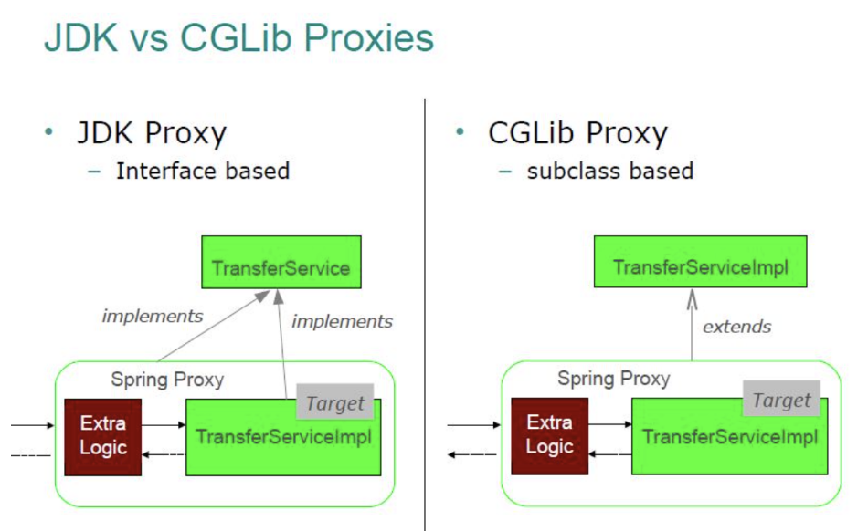
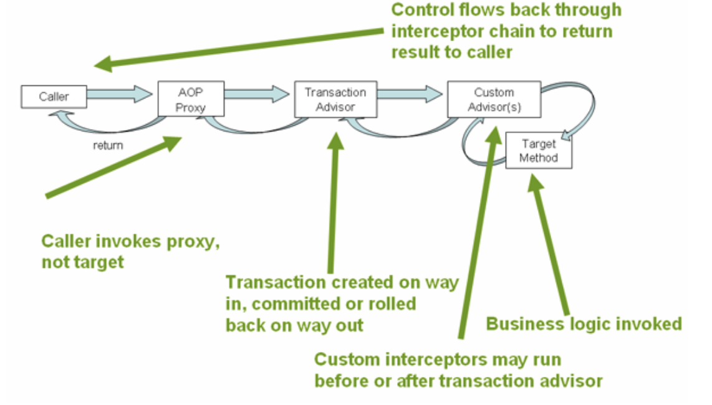
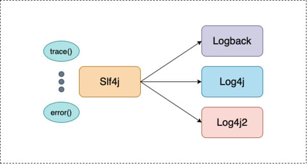
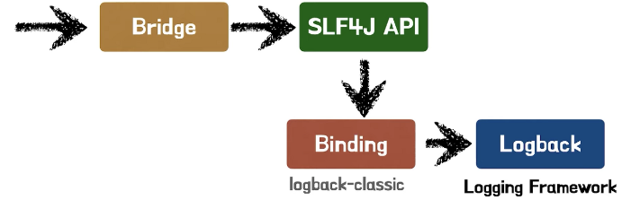

<nav id="quick" style="">
	<label for="chap10" style="color:black;font-size:28px;">11. 스프링 트랜잭션 & 로깅</label>
	<input type="radio" name="chap" id="chap10" style="display:none;">
	<ul class="menu">
		<li><a href="#11-1" style="color:black;font-size:20px;text-decoration:none;">11-1. 어노테이션에 의한 트랜잭션 처리</a></li>
		<li><a href="#11-2" style="color:black;font-size:20px;text-decoration:none;">11-2. AOP를 이용한 트랜잭션 처리</a></li>
		<li><a href="#11-3" style="color:black;font-size:20px;text-decoration:none;">11-3. SLF4J와 Logback을 이용한 로그</a></li>
	</ul>	
</nav>

<div id="11"></div>

# 11. 스프링 트랜잭션 & 로깅

- 선언적 트랜잭션 - 스프링은 선언적 트랜잭션 방식을 사용
  - 어노테이션을 이용한 선언적 방식
  - AOP를 이용한 선언적 방식
  - 프로그램에 의한 트랜잭션 처리
- 스프링프레임워크에서 트랜잭션 처리 권장 사항
  - 선언적 방식에 의한 트랜잭션 처리
  - 트랜잭션은 주로 서비스 메소드를 대상으로 함
  - 프로그램에 의한 트랜잭션 처리는 권장하지 않습니다. 왜냐하면, 스프링프레임워크에서 제어할 수 있도록 IoC를 구현해야 하기 때문입니다.
- Slf4j는 Logback과 Log4j와 연동하여 이용한 사용 기록인 로그를 남깁니다.
<br><br>

**pom.xml에 라이브러리 추가**

```xml
	<!-- AspectJ : 관점지향형(AOP) 기능 제공 라이브러리 -->
	<dependency>
		<groupId>org.aspectj</groupId>
		<artifactId>aspectjrt</artifactId>
		<version>${org.aspectj-version}</version>
	</dependency>	
	
	<dependency>
		<groupId>org.springframework</groupId>
		<artifactId>spring-aop</artifactId>
		<version>${org.springframework-version}</version> 
	</dependency>
	
	<dependency>
		<groupId>org.aspectj</groupId>
		<artifactId>aspectjweaver</artifactId>
		<version>${org.aspectj-version}</version> 
	</dependency>

	<!-- 스프링 트랜잭션 라이브러리 -->
	<dependency>
		<groupId>org.springframework</groupId>
		<artifactId>spring-tx</artifactId>
		<version>${org.springframework-version}</version>
	</dependency>
```

<br><br>

<div id="11-1"></div>

## 11-1. 어노테이션에 의한 트랜잭션 처리

- @Transactional 어노테이션은 스프링에서 많이 사용되는 선언적 트랜잭션 방식입니다.
- 해당 어노테이션은 getConnection(), setAutoCommit(false), 예외 발생 시 롤백, 정상 종료 시 커밋 등의 필요한 코드를 삽입해줍니다.

	1. @root-context.xml에 Transaction Manager Bean을 설정
	2. < tx:annotation-driven ../> 설정
	트랜잭션이 필요한 클래스나 메소드에 
	3. @Transactional 어노테이션 추가
	주로 서비스 클래스의 메소드에 적용

<br><br>

### 11-1-1. @Transactional 사용 방법

- 스프링 레거시에서는 해당 어노테이션을 사용하기 위해선 PlatformTransactionManager 와 어노테이션 활성화 설정이 필요합니다.
- 스프링 부트에선 @EnableTransactionManagement 설정이 되어 있어서 자동으로 사용할 수 있으며 각 프로젝트에 맞게 클래스 또는 메서드에 @Transactional 어노테이션을 적용하면 됩니다.
	- PlatformTransactionManager는 스프링이 제공하는 TransactionManager의 최상위 인터페이스로, 환경에 맞는 클래스를 주입할 수 있도록 구성되어 있다. DataSourceTransactionManger, JpaTransactionManager 등 필요한 정보를 Bean으로 등록하고 DI를 받아 사용합니다.
	- 스프링 컨테이너는 @Transactional 어노테이션이 있으면, 해당 타겟 빈을 상속받은 프록시 객체를 생성하므로 private 메서드는 상속이 불가하기 때문에 어노테이션을 붙여도 동작하지 않습니다.

<br><br>

### 11-1-2. @Transcational 동작 원리

- @Transactional은 Spring AOP를 통해 프록시 객체를 생성하여 사용됩니다.
- 스프링에서 Target 객체를 직접 참조하지 않고, 프록시 객체를 사용하는 이유는, Aspect 클래스에서 제공하는 부가 기능을 사용하기 위해서이며, Target 객체를 직접 참조하는 경우, 원하는 위치에서 직접 Aspect 클래스를 호출해야하기 때문에 유지보수가 어려워집니다.
- 스프링에서 사용하는 프록시 구현체는 JDK Proxy(Dynamic Proxy), CGLib 두 가지가 있습니다.



<br><br>

### 11-1-3.  @Transcational 사용을 위한 설정

```xml
	<!-- root-context.xml에 트랜잭션 설정 추가 -->
	<!-- 트랜잭션매니저 객체 생성 -->
	<bean id="transactionManager" class="org.springframework.jdbc.datasource.DataSourceTransactionManager">
		<property name="dataSource" ref="dataSource" />
	</bean>
	
	<!-- @Transactional 어노테이션으로 처리하는 경우 설정 -->
	<tx:annotation-driven transaction-manager="transactionManager" />
```

<br><br>

### 11-1-4. @Transcational 의 적용 및 구현

```java
	//BoardServiceImpl 에서의 트랜잭션 처리
	//글을 상세보기 하기 전에 글을 읽은 횟수를 증가시키고, 글 상세보기를 구현
	@Transactional
	@Override
	public Board getBoard(int bno) {
		boardDAO.upCount(bno);
		return boardDAO.getBoard(bno);
	}
```

<br><br><hr><br><br>

## 11-2. AOP를 이용한 트랜잭션 처리

- AOP를 이용한 트랜잭션 처리에서도 AOP 프록시 생성과정에서 Target 객체의 인터페이스 구현 여부에 따라 다음과 같이 나뉩니다.
  - JDK Dynamic Proxy : Target 클래스가 인터페이스 구현체일 경우 생성되며, 구현 클래스가 아닌 인터페이스를 프록시 객체로 구현해서 코드에 끼워넣는 방식입니다.
  - CGLib Proxy : 스프링에서 사용하는 디폴트 프록시 생성방식으로, Target 클래스를 프록시 객체로 생성하여 코드에 끼워넣는 방식입니다.

<br>

**JDK 방식**

	JDK 방식은 java.lang.Reflection 을 이용해서 동적으로 프록시를 생성해준다. 해당 방식의 단점은 AOP 적용을 위해 반드시 인터페이스를 구현해야된다는 점, 리플렉션은 private 접근이 가능하다는 점 때문에 스프링 부트에선 기본 방식으로 CGLib 방식을 채택하였다. (스프링 레거시는 JDK 기본 동작)

<br>

**CGLib 방식**

	CGLib는 바이트 코드를 조작하여 프록시 객체를 생성한다. 직접 원본 객체를 호출하지 않고 MethodInterceptor 와 같은 프록시와 원본 객체 사이에 인터셉터를 두어 메서드 호출을 조작할 수 있도록 도와준다.

<br>



- Target에 대한 호출(Caller)이 오면, AOP 프록시(AOP Proxy)가 인터셉터 체인을 통해 가로채온 후 트랜잭션 어드바이저(Transaction Advisor)에게 전달합니다.
- 트랜잭션 어드바이저(Transaction Advisor)는 트랜잭션(Transaction)을 생성합니다.
- 사용자 정의 어드바이저(Custom Advisor)가 있다면, 실행한 후 비즈니스 로직의 타켓 메소드(Business Logic Target Method)를 호출합니다.
- 트랜잭션 어드바이저(Transaction Advisor)는 커밋(Commit) 또는 롤백(Rollback) 등의 트랜잭션 결과를 반환(Return)합니다.

<br><br>

### 11-2-1. 트랜잭션 매니저 설정

```xml
<!-- root-context.xml에 추가할 내용 -->
<!-- Transaction Manager -->
<bean id="transactionManager" class="org.springframework.jdbc.datasource.DataSourceTransactionManager">
	<property name="dataSource" ref="dataSource"></property>
</bean>
```

<br><br>

### 11-2-2. 트랜잭션 어드바이스 설정

#### 11-2-2-1. tx:advice 태그를 활용하여 트랜잭션 어드바이스 설정

**tx:advice/tx:attributes/tx:method 태그를 이용하여 트랜잭션 어드바이스 설정**

```xml
<!-- root-context.xml에 추가할 내용1 -->
<tx:advice id="txAdvice" transaction-manager="transactionManager">
	<tx:attributes>
        <tx:method name="get*" propagation="REQUIRED" read-only="true" timeout="30"/>
        <tx:method name="upgrade*" propagation="REQUIRES_NEW" isolation="SERIALIZABLE"/>
        <tx:method name="*" propagation="REQUIRED"/>
    </tx:attributes>
</tx:advice>
```

`<tx:method name="get*" propagation="REQUIRED" read-only="true" timeout="30"/>`

- Propagation: REQUIRED는 이미 시작된 트랜잭션이 있으면 해당 트랜잭션을 사용하고, 없으면 새 트랜잭션을 시작합니다.
- Read-only: true로 설정되어 있어서 이 메서드는 읽기 전용 트랜잭션으로 실행됩니다.
- Timeout: 30초 동안 트랜잭션이 완료되지 않으면 롤백됩니다.

<br>

`<tx:method name="upgrade*" propagation="REQUIRES_NEW" isolation="SERIALIZABLE"/>`

- Propagation: REQUIRES_NEW는 항상 새로운 트랜잭션을 시작하고, 기존 트랜잭션이 있으면 일시 중지합니다.
- Isolation: SERIALIZABLE은 가장 엄격한 격리 수준으로, 트랜잭션 간의 간섭을 최소화합니다.

<br>

`<tx:method name="*" propagation="REQUIRED"/>`

- Propagation: REQUIRED는 기본 설정으로, 메서드 이름이 위에서 지정된 패턴(get*, upgrade*)과 일치하지 않으면 이 설정이 적용됩니다.

<br>

**tx:method 태그의 속성**

| 속성명 | 설명 |
|------------------|----------------------------------------------------------------------|
| name | 트랜잭션이 적용될 메서드 패턴 지정 |
| read-only | 읽기 전용 여부 지정 (default : false) |
| no-rollback-for | 롤백하지 않는 경우 지정 |
| rollback-for | 롤백할 경우 지정 |
| propagation | 트랜잭션 전파 범위 지정 <br> REQUIRED (기본값) : 이미 진행 중인 트랜잭션이 없으면 새로 시작하고, 있다면 기존 트랜잭션에 참여 <br> REQUIRED_NEW : 트랜잭션 존재 유무와 상관 없이 항상 새로운 트랜잭션 시작 (독립 보장) <br> MANDATORY : 진행 중인 트랜잭션이 없으면 예외를 발생하고, 있으면 참여한다. (독립 트랜잭션 생성 안됨을 보장) <br> SUPPORTS : 메소드가 트랜잭션을 필요로 하지는 않지만, 진행 중인 트랜잭션이 존재하면 트랜잭션을 사용한다는 것을 의미한다. 진행 중인 트랜잭션이 존재하지 않더라도 메소드는 정상적으로 동작한다. <br> NESTED : 이미 실행 중인 트랜잭션이 존재하면, 자식 트랜잭션을 만든다.(부모의 커밋과 롤백에는 영향 받지만, 자식의 결과는 부모에게 영향을 주지 않는다.), 실행 중인 트랜잭션이 없다면, 새로운 트랜잭션을 생성해서 사용한다. <br> NEVER : 트랜잭션을 사용하지 않도록 강제한다. 트랜잭션이 존재하면 예외를 발생한다. |

<br><br>

#### 11-2-2-2. bean 태그를 활용하여 트랜잭션 어드바이스 설정

**bean/property/props/prop 태그를 이용하여 트랜잭션 어드바이스 설정**

```xml
<!-- root-context.xml에 추가할 내용2 -->
<bean id="transactionAdvice" 
    class="org.springframework.transaction.interceptor.TransactionInterceptor">
    <property name="transactionManager" ref="transactionManager"/>
    <property name="transactionAttributes">
        <props>
            <prop key="get*">PROPAGATION_REQUIRED,readOnly,timeout_30</prop>
            <prop key="upgrade*">PROPAGATION_REQUIRES_NEW,ISOLATION_SERIALIZABLE</prop>
            <prop key="*">PROPAGATION_REQUIRED</prop>
        </props>
    </property>
</bean>
```

<br>

`<prop key="get*">PROPAGATION_REQUIRED,readOnly,timeout_30</prop>`

PROPAGATION_REQUIRED: 이미 시작된 트랜잭션이 있으면 해당 트랜잭션을 사용하고, 없으면 새 트랜잭션을 시작합니다.
readOnly: 이 메서드는 읽기 전용 트랜잭션으로 실행됩니다.
timeout_30: 트랜잭션이 30초 내에 완료되지 않으면 롤백됩니다.

<br>

`<prop key="upgrade*">PROPAGATION_REQUIRES_NEW,ISOLATION_SERIALIZABLE</prop>`

PROPAGATION_REQUIRES_NEW: 항상 새로운 트랜잭션을 시작하며, 기존 트랜잭션이 있으면 일시 중지합니다.
ISOLATION_SERIALIZABLE: 가장 엄격한 격리 수준으로 트랜잭션 간의 간섭을 최소화합니다.

<br>

`<prop key="*">PROPAGATION_REQUIRED</prop>`

PROPAGATION_REQUIRED: 나머지 메서드에 대해 기본적으로 REQUIRED 전파 수준을 사용합니다.

<br><br><br>

### 11-2-3. AOP 설정

```xml
<!-- root-context.xml에 추가할 내용 -->
<aop:config>
  <aop:pointcut id="transactionPointcut"
                expression="execution(* com.spring1.service.*.*(..))" />
  <aop:advisor advice-ref="txAdvice" pointcut-ref="transactionPointcut" />
</aop:config>
```

<br>

`<aop:config>` : AOP 설정을 정의하는 루트 엘리먼트입니다. AOP 관련 설정은 이 안에 포함됩니다.

<br>

`<aop:pointcut>` : 포인트컷을 정의합니다. 포인트컷은 특정 조인 포인트(즉, 메서드 실행, 객체 생성 등)를 식별하는 표현식입니다.

- id="transactionPointcut": 이 포인트컷의 식별자입니다. 나중에 참조할 때 사용됩니다.
- expression="execution(* com.spring1.service.*.*(..))": AOP 표현식으로, com.spring1.service 패키지 내의 모든 클래스의 모든 메서드 실행을 대상으로 합니다.

<br>

`<aop:advisor>` : 어드바이저를 정의합니다. 어드바이저는 포인트컷과 어드바이스를 결합하여 특정 시점에 어드바이스를 적용합니다.

- advice-ref="txAdvice": 적용할 어드바이스를 참조합니다. 여기서 txAdvice는 트랜잭션 어드바이스를 가리킵니다.
- pointcut-ref="transactionPointcut": 적용할 포인트컷을 참조합니다. 여기서는 transactionPointcut 포인트컷이 참조됩니다.

<br>

#### 11-2-3-1. AOP 트랜잭션 처리 전체 예시 코드

**root-context.xml의 코드 전체 내용**

```xml
<?xml version="1.0" encoding="UTF-8"?>
<beans xmlns="http://www.springframework.org/schema/beans"
	xmlns:xsi="http://www.w3.org/2001/XMLSchema-instance"
	xmlns:mybatis-spring="http://mybatis.org/schema/mybatis-spring"
	xmlns:context="http://www.springframework.org/schema/context"
	xmlns:aop="http://www.springframework.org/schema/aop"
	xmlns:jdbc="http://www.springframework.org/schema/jdbc"
	xmlns:tx="http://www.springframework.org/schema/tx"
	xsi:schemaLocation="http://www.springframework.org/schema/jdbc http://www.springframework.org/schema/jdbc/spring-jdbc-4.3.xsd
		http://mybatis.org/schema/mybatis-spring http://mybatis.org/schema/mybatis-spring-1.2.xsd
		http://www.springframework.org/schema/beans https://www.springframework.org/schema/beans/spring-beans.xsd
		http://www.springframework.org/schema/context http://www.springframework.org/schema/context/spring-context-4.3.xsd
		http://www.springframework.org/schema/aop http://www.springframework.org/schema/aop/spring-aop-4.3.xsd
		http://www.springframework.org/schema/tx http://www.springframework.org/schema/tx/spring-tx-4.3.xsd">
	
	<!-- Root Context: defines shared resources visible to all other web components -->
	<!-- 데이터베이스 설정 -->
	<!-- spring-jdbc-5.0.8.RELEASE.jar 안의 드라이버매니저 연결 -->
	<bean id="dataSource" class="org.springframework.jdbc.datasource.DriverManagerDataSource">
	<!-- 데이터 소스 및 드라이버 설정 : log4jdbc-log4j2-jdbc4-1.16.jar -->
		<property name="driverClassName" value="net.sf.log4jdbc.sql.jdbcapi.DriverSpy"></property>
	<!-- 연결 url, 사용자 아이디, 비밀번호 설정  -->
		<property name="url" value="jdbc:log4jdbc:oracle:thin:@localhost:1521:xe" />
		<property name="username" value="system" />
		<property name="password" value="1234"></property>
	</bean>
	<!-- sql을 대신할 my-batis 설정 : mybatis-spring-1.3.2.jar의 세션팩토리빈클래스 연결 -->
	<bean id="sqlSessionFactory" class="org.mybatis.spring.SqlSessionFactoryBean">
		<property name="dataSource" ref="dataSource" />
		<!-- mybatis 설정파일 등록-->
		<property name="configLocation" value="classpath:/mybatis-config.xml"></property>
		<!-- sql처럼 데이터베이스와 자바 클래스를 데이터 연관을 지어줄 파일 위치와 이름 지정 -->
		<property name="mapperLocations" value="classpath:mappers/**/*Mapper.xml"></property>
	</bean>	
	<!-- SqlSession 객체 주입 -->
	<bean id="sqlSession" class="org.mybatis.spring.SqlSessionTemplate" destroy-method="clearCache">
		<constructor-arg name="sqlSessionFactory" ref="sqlSessionFactory"></constructor-arg>
	</bean>
	
	<!-- 트랜잭션 및 DB 패키지 방안 및 각 종 로깅과 보안 설정 -->
	<bean id="transactionManager" class="org.springframework.jdbc.datasource.DataSourceTransactionManager">
		<property name="dataSource" ref="dataSource" />
	</bean>
	
	<!-- @Transactional 어노테이션으로 처리하는 경우 설정 -->
	<tx:annotation-driven transaction-manager="transactionManager" />
	
	<!-- 트랜잭션을 AOP로 처리하는 경우 어드바이스 설정 -->
	<tx:advice id="txAdvice" transaction-manager="transactionManager">
	  	<tx:attributes>
	        <tx:method name="sel*" propagation="REQUIRED" read-only="true" timeout="30"/>
	        <tx:method name="count*" propagation="REQUIRES_NEW" isolation="SERIALIZABLE"/>
	        <tx:method name="*" propagation="REQUIRED"/>
    	</tx:attributes>
	</tx:advice>
	
	<!-- 트랜잭션을 AOP로 처리하는 경우 AOP 설정 -->
	<aop:config>
	  <aop:pointcut id="transactionPointcut"
	                expression="execution(* com.spring1.service.*.*(..))" />
	  <aop:advisor advice-ref="txAdvice" pointcut-ref="transactionPointcut" />
	</aop:config>	
</beans>
```

<br><br>

#### 11-2-3-2. AOP 트랜잭션 처리 비즈니스 로직 서비스 예시 코드

```java
package com.spring1.service;

import java.util.List;

import org.springframework.beans.factory.annotation.Autowired;
import org.springframework.stereotype.Service;
import org.springframework.transaction.annotation.Transactional;

import com.spring1.dao.BoardDAO;
import com.spring1.dto.Board;

@Service
public class BoardServiceImpl implements BoardService {

	@Autowired
	private BoardDAO boardDAO;
	
	@Override
	public List<Board> getBoardList() {
		return boardDAO.getBoardList();
	}

	@Transactional
	@Override
	public Board getBoard(int bno) {
		boardDAO.upCount(bno);
		return boardDAO.getBoard(bno);
	}

	@Override
	public Board selBoard(int bno) {
		return boardDAO.getBoard(bno);
	}

	@Override
	public void countUp(Board board) {
		boardDAO.upBoard(board);
	}

	@Override
	public int maxNum() {
		return boardDAO.maxNum();
	}

	@Override
	public void insBoard(Board board) {
		boardDAO.insBoard(board);
	}

	@Override
	public void upBoard(Board board) {
		boardDAO.upBoard(board);
	}

	@Override
	public void delBoard(int bno) {
		boardDAO.delBoard(bno);		
	}	
}
```

<br>

위 11-2-3-1. AOP 트랜잭션 처리 전체 예시 코드 내용대로 설정하면 com.spring1.service 패키지의 모든 메서드에 대해 트랜잭션이 자동으로 적용됩니다:

- selBoard 메서드는 읽기 전용 트랜잭션(PROPAGATION_REQUIRED, readOnly, timeout_30)이 적용됩니다.
- countUp 메서드는 새로운 트랜잭션(PROPAGATION_REQUIRES_NEW, ISOLATION_SERIALIZABLE)이 적용됩니다.
- 나머지 메서드(processData 등)에는 기본 트랜잭션 속성(PROPAGATION_REQUIRED)이 적용됩니다.
이 방식으로 트랜잭션을 선언적으로 관리하면 비즈니스 로직에서 트랜잭션 관리 코드를 제거하고, 코드의 가독성과 유지보수성을 높일 수 있습니다.

<br><br>

### 11-2-4. 트랜잭션 사용시 주의사항

- 스프링에서 트랜잭션은 처음으로 호출하는 메서드나 클래스의 속성을 따라가게 되어있어 동일한 빈 안에서 하위 메서드에서만 트랜잭션이 설정되어 있다면, 전이되지 않습니다. 반대로, 상위에 적용되면 하위 메서드는 트랜잭션 설정이 없어도 전이가 됩니다. 따라서, 클래스를 분리하거나, 상위 메서드에 트랜잭션을 설정해야 합니다.
- RuntimeException 이나 Error 의 경우에만 실패시 롤백이 되며, Exception의 경우 rollbackFor 옵션을 주어 처리하는 방법도 있습니다.


<br><br><hr><br><br>

## 11-3. SLF4J와 Log4j, Logback을 이용한 로그

- 스프링 로그 시스템인 Slf4j는 Log4j와 logback을 기반으로 하는 로그 시스템으로 시스템의 상태, 이상 유무, 사용 현황, 요구 처리 내용 등을 기록하게 됩니다.
- 예전에는 log4j와 commons-logging이 주로 사용되었으며, 아직도 Spring도 commons-logging을 사용해 로그를 남기고 있는 애플리케이션도 간혹 있습니다.
- SLF4J가 나온 이후 수많은 오픈소스 프로젝트가 SLF4J을 선택하고 있고, 그 비중이 점점 커져가고 있으며, 여러 오픈소스 프로젝트를 사용하다 보면 Logging Tool이 혼재되어 충돌이 되는 경우가 빈번한데, 이럴 경우 Logging Tool을 하나로 통일시켜주어야 하며, 이 중 가장 최근에 나오고 가장 많이 사용되고 있는 SLF4J, Logback으로 통일시키고 있습니다.

<br>

**SLF4J**



SLF4J(Simple Logging Facade for Java)라는 이름에서 알 수 있듯이 파사드 패턴이 적용되어 logback, log4j와 같은 로깅에 대한 추상 레이어를 제공하는 추상화 로깅 라이브러리이다. 라이브러리이기 때문에 개발자가 스프링프레임워크에 로깅 라이브러리를 등록 해주어야 합니다.

그러면 굳이 SLF4J라는 추상 라이브러리를 사용하는 이유는 무엇일까?

만약, SLF4J없이 log4j를 사용하다가 치명적인 보안이슈가 발견되어 걷어내고 logback 으로 변경해야하는 경우가 생기면 log4j를 사용한 전체 코드를 수정해야할 것입니다. 하지만, 추상 인터페이스를 사용함으로써 전체 코드를 수정하지 않고 로깅 프레임워크만 변경해주면 됩니다. 한마디로 객체지향 OCP원리를 적용한 방법이 되겠습니다.



<br><br>

### 11-3-1. Log4j 설정

**src/main/resources/log4j.xml 설정**

```xml
<?xml version="1.0" encoding="UTF-8"?>
<!DOCTYPE log4j:configuration PUBLIC "-//APACHE//DTD LOG4J 1.2//EN" "log4j.dtd">
<log4j:configuration xmlns:log4j="http://jakarta.apache.org/log4j/">

	<!-- Appenders -->
	<appender name="console" class="org.apache.log4j.ConsoleAppender">
		<param name="Target" value="System.out" />
		<layout class="org.apache.log4j.PatternLayout">
			<param name="ConversionPattern" value="%-5p: %c - %m%n" />
		</layout>
	</appender>

	<!-- Application Loggers -->
	<logger name="com.spring1.myapp">
		<level value="info" />
	</logger>
	
	<logger name="com.spring1.controller">
		<level value="info" />
	</logger>
	
	<logger name="com.spring1.dao">
		<level value="info" />
	</logger>

	<logger name="com.spring1.dto">
		<level value="info" />
	</logger>
	
	<logger name="com.spring1.service">
		<level value="info" />
	</logger>
	
	<logger name="com.spring1.filter">
		<level value="info" />
	</logger>
	
	<logger name="com.spring1.test">
		<level value="info" />
	</logger>
	
	<logger name="com.spring1.util">
		<level value="info" />
	</logger>
	
	<logger name="com.spring1.aop">
		<level value="trace" />
	</logger>
	
	<!-- 3rdparty Loggers -->
	<logger name="org.springframework.core">
		<level value="info" />
	</logger>
	
	<logger name="org.springframework.beans">
		<level value="info" />
	</logger>
	
	<logger name="org.springframework.context">
		<level value="info" />
	</logger>

	<logger name="org.springframework.web">
		<level value="info" />
	</logger>

	<!-- Root Logger -->
	<root>
		<priority value="trace" />
		<appender-ref ref="console" />
	</root>
	
</log4j:configuration>
```

<br>

**로그의 Level**

| 로그레벨 | 설명 |
|----------|-----------------------------------------------|
| FATAL | 심각한 시스템 이상 내용 표시 |
| ERROR | 요청에 대한 문제 발생시 표시 |
| WARN | 처리는 가능하지만 경고성 메시지 발신 표시 |
| INFO | 정보성 메시지 표시 |
| DEBUG | 실행 내용에 대한 설명을 표시 |
| TRACE | 실행 내용이나 추적할 경로 등을 표시 |


```
하위 레벨은 그 바로 전의 로그 내용을 포함하여 출력합니다.
FATAL < ERROR < WARN < INFO < DEBUG < TRACE
```

<br><br><br>

### 11-3-2. 로그 기록의 백업 설정

**src/main.resources/logback.xml 파일 작성**

```xml
<?xml version="1.0" encoding="UTF-8"?>
<configuration>
    <!-- log4jdbc-log4j2 -->
	<logger name="jdbc.sqlonly"        level="DEBUG"/>
    <logger name="jdbc.sqltiming"      level="INFO"/>
    <logger name="jdbc.audit"          level="WARN"/>
    <logger name="jdbc.resultset"      level="ERROR"/>
    <logger name="jdbc.resultsettable" level="ERROR"/>
    <logger name="jdbc.connection"     level="INFO"/>
    
	<appender name="CONSOLE" class="ch.qos.logback.core.ConsoleAppender">
		<layout class="ch.qos.logback.classic.PatternLayout">
			<pattern>%d{HH:mm:ss.SSS} [%thread] %-4level [%logger.%method:%line]-
				%msg%n</pattern>
		</layout>
	</appender>

	<appender name="LOGFILE"
		class="ch.qos.logback.core.rolling.RollingFileAppender">
		<file>/WEB-INF/logback.log</file>
		<rollingPolicy class="ch.qos.logback.core.rolling.TimeBasedRollingPolicy">
			<fileNamePattern>logback.%d{yyyy-MM-dd}.log</fileNamePattern>
			<!-- 30일 지난 파일은 삭제한다. -->
			<maxHistory>30</maxHistory>
		</rollingPolicy>
		<encoder>
			<pattern>%d{yyyy-MM-dd HH:mm:ss.SSS} %-4level [%logger.%method:%line]
				- %msg %n</pattern>
		</encoder>
	</appender>

	<!-- 로그의 레벨( 지정된 로그 레벨 이상만 수집 ) : DEBUG < INFO < WARN < ERROR < FATAL -->
	<logger name="myweb" additivity="false">
		<level value="INFO" />
		<appender-ref ref="LOGFILE" />
		<appender-ref ref="CONSOLE" />
	</logger>

	<root>
		<level value="INFO" />
		<appender-ref ref="CONSOLE" />
	</root>

</configuration>
```

<br>

**Logback Log Level**

| 로그레벨 | 설명 |
|----------|-----------------------------------------------|
| FATAL | 심각한 에러 |
| ERROR | 에러가 일어 났을 때 사용, 개발자가 의도하지 않은 에러 |
| WARN | 에러는 아니지만 주의할 필요한 로그에 사용 |
| INFO | 운영에 참고할만한 사항 또는 중요 정보를 나타낼 때 사용 |
| DEBUG | 개발 단계에서 사용하며, 일반 정보를 나타낼 때 사용 |
| TRACE | 모든 레벨에 대한 로깅이 추적 |

<br>

**logback 환경 설정에 사용하는 태그**

| 태그 | 설명 |
|-------------|-------------------------------------------------------------------------|
| logger | 로그의 name 속성을 통해 class 별로 지역설정을 할 수 있으며 additivity 속성을 통해 log level을 상속 유무 설정이 가능합니다. |
| root | logger 중에 전역 logger를 root로 따로 분리했다고 보시면 됩니다. 전역 설정이기때문에 name 속성이 없으며 level 속성을 통해 log level만 지정해주면 됩니다. |
| level | 로그 기록의 레벨을 지정합니다. |
| appender | log 메시지가 출력될 대상을 결정합니다. |
| appender-ref | 기 작성된 appender 중에서 참고할 appender를 지정합니다. |
| layout | 기록될 로그의 대상 또는 형태나 형식을 가진 클래스를 지정합니다. |
| pattern | 기록되는 로그의 패턴을 지정합니다. |
| file | 로그가 기록되는 파일을 지정합니다. |
| rollingPolicy | 로그가 기록되는 파일을 설정하는 클래스를 지정합니다. |
| fileNamePattern | 로그가 기록되는 파일의 이름 패턴을 지정합니다. |
| encoder | 로그가 기록되는 파일의 인코딩 형식과 패턴을 지정합니다. |

<br>

**appender에 지정하는 클래스**

| 클래스명 | 설명 |
|-------------|-------------------------------------------------------------------------|
| ch.qos.logback.core.ConsoleAppender | 콘솔에 로그를 찍음, 로그를 OutputStream에 작성하여 콘솔에 출력되도록 합니다. |
| ch.qos.logback.core.FileAppender | 파일에 로그를 찍음, 최대 보관 일 수 등를 지정할 수 있습니다. |
| ch.qos.logback.core.rolling.RollingFileAppender | 여러개의 파일을 롤링, 순회하면서 로그를 찍습니다. FileAppender를 상속 받으며, 지정 용량이 넘어간 Log File을 넘버링 하여 나누어 저장할 수 있습니다. |
| ch.qos.logback.classic.net.SMTPAppender | 로그를 메일에 찍어 보냅니다. |
| ch.qos.logback.classic.db.DBAppender | DB(데이터베이스)에 로그를 찍는다. |

<br>

**rollingPolicy 종류 및 하위 요소**

| 종류 (하위요소) | 설명 |
|-------------|-------------------------------------------------------------------------|
| TimeBasedRollingPolicy | 이름에서 알 수 있듯이 시간에 기반하여 rollover 정책을 정의할 수 있습니다. |
| SizeAndTimeBasedRollingPolicy | TimeBasedRollingPolicy 상속받아 maxFileSize 을 통해 파일의 크기까지 고려할 수 있습니다. |
| FixedWindowRollingPolicy | Fixed Window 알고리즘에 따라 로그 파일의 이름을 지정합니다. |
| (fileNamePattern) | 아카이브 되는 파일의 패턴을 지정할 수 있습니다. |
| (maxHistory) | 보관할 최대 파일 수를 제어하여 이전 파일을 삭제합니다. |
| (maxFileSize) | 분할할 용량 사이즈를 의미합니다. |
| totalSizeCap | 전체 파일 크기를 제어하며, 전체 크기 제한을 초과하면 가장 오래된 파일을 삭제합니다. |

<br><br><br>

### 11-3-3. 제어 구성 파일

- log4jdbc 라이브러리를 사용하는 애플리케이션에서 SQL 쿼리 및 데이터베이스 활동을 로깅하는 방법을 정의하는 것으로 이 설정을 통해 log4jdbc가 SLF4J를 사용하여 로깅하도록 지정합니다.

<br>

**src/main/resources/log4jdbc.log4j2.properties 파일 작성**

```properties
log4jdbc.spylogdelegator.name=net.sf.log4jdbc.log.slf4j.Slf4jSpyLogDelegator
```

- 위 설정된 내용은 log4jdbc가 로깅을 수행할 때 Slf4jSpyLogDelegator 클래스를 사용하도록 지정합니다. 이렇게 하면 log4jdbc가 SQL 쿼리 및 기타 JDBC 활동을 SLF4J를 통해 로그로 기록하도록 지정한 것입니다.
- 이렇게 하게 되면, 다양한 로깅 프레임워크와 호환되며, 로깅을 일관되게 관리할 수 있습니다.

<br><br>

#### 11-3-3-1. log4jdbc란?

- log4jdbc는 데이터베이스와의 상호작용을 감시하고 로깅하는 JDBC 드라이버 래퍼입니다. 이를 통해 SQL 쿼리, JDBC 메서드 호출, 그리고 실행 시간을 로그 파일에 기록할 수 있습니다. 이는 개발자들이 데이터베이스와의 상호작용을 디버깅하고 성능 문제를 식별하는 데 유용합니다.

<br><br>

#### 11-3-3-2. Slf4jSpyLogDelegator란?

- Slf4jSpyLogDelegator는 log4jdbc의 로깅을 SLF4J를 통해 수행하는 클래스입니다. SLF4J (Simple Logging Facade for Java)는 여러 로깅 프레임워크에 대한 추상화 계층을 제공하여, 다양한 로깅 프레임워크(Logback, Log4j 등)를 쉽게 교체하거나 사용할 수 있도록 합니다.


<br><br><hr><br><br>