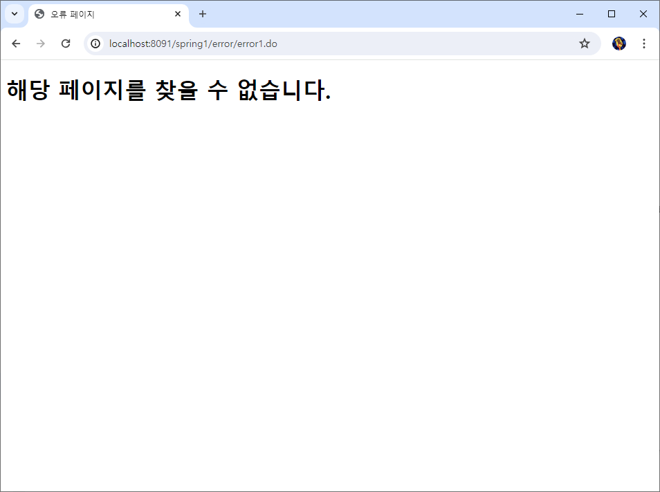
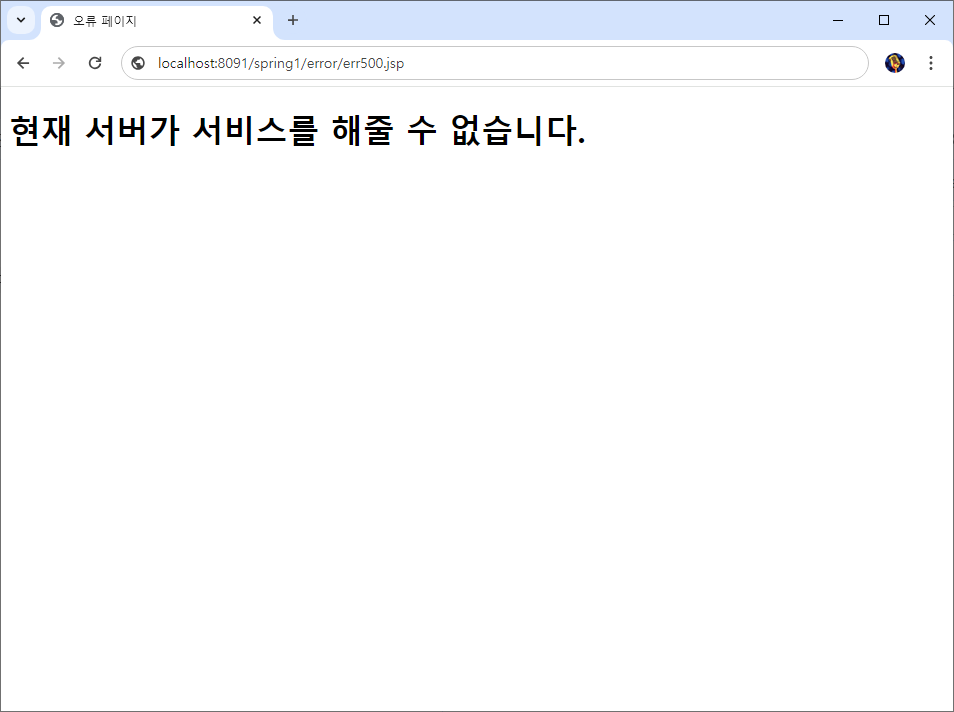
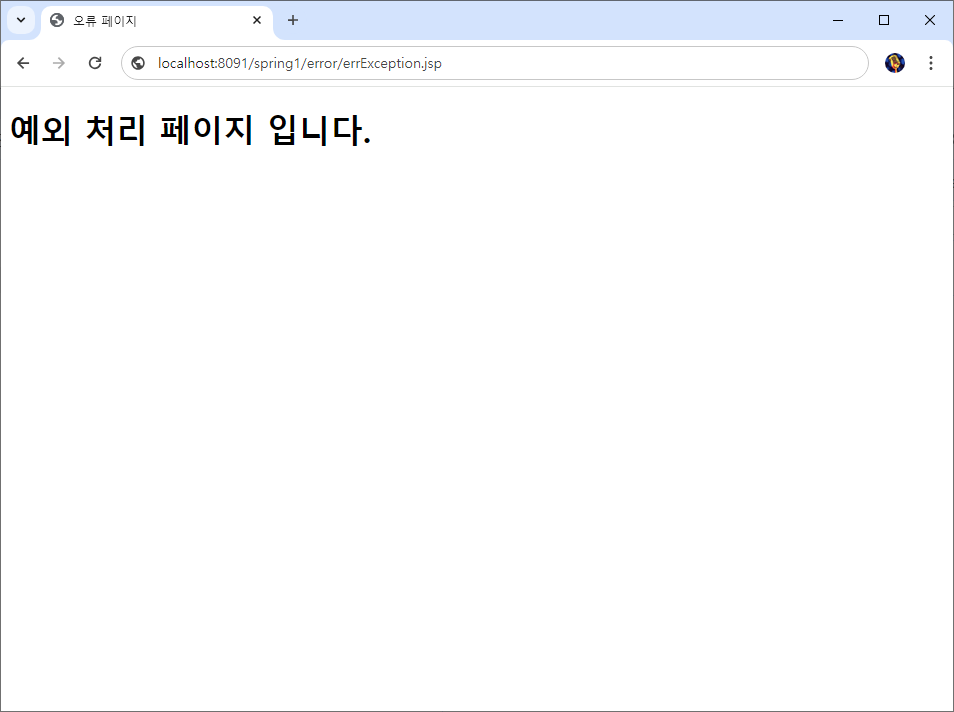
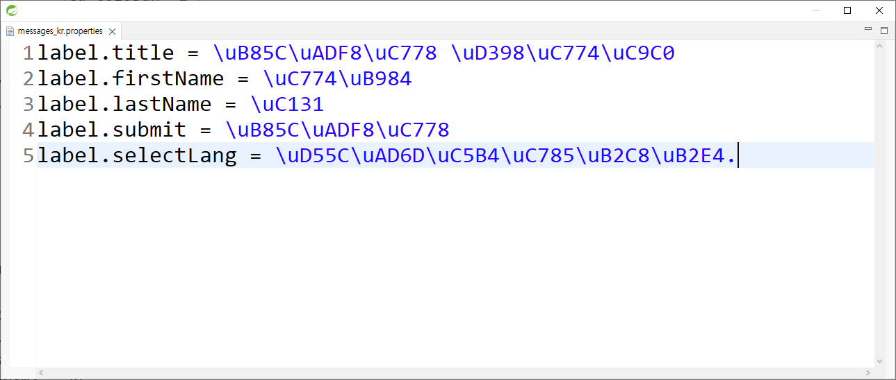
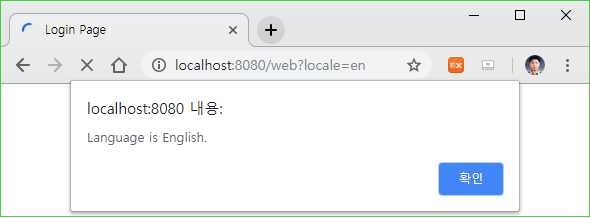
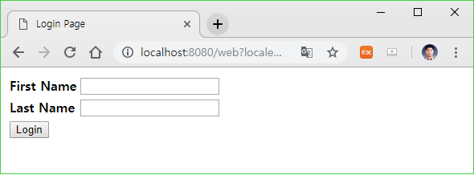
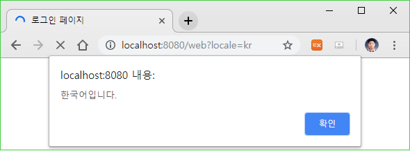
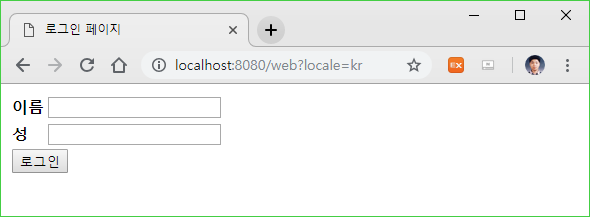

<nav id="quick" style="">
	<label for="chap12" style="color:black;font-size:28px;">12. 예외 및 오류 처리와 다국어 처리</label>
	<input type="radio" name="chap" id="chap12" style="display:none;">
	<ul class="menu">
		<li><a href="#12-1" style="color:black;font-size:20px;text-decoration:none;">12-1. 오류 처리와 페이지</a></li>
		<li><a href="#12-2" style="color:black;font-size:20px;text-decoration:none;">12-2. 예외 처리와 페이지</a></li>
		<li><a href="#12-3" style="color:black;font-size:20px;text-decoration:none;">12-3.  예외 클래스 구현</a></li>
		<li><a href="#12-4" style="color:black;font-size:20px;text-decoration:none;">12-4. 메시지를 이용한 다국어 처리</a></li>
	</ul>	
</nav>

<div id="12"></div>

# 12. 예외 및 오류 처리와 다국어 처리

<div id="12-1"></div>

## 12-1. 오류 처리와 페이지

### 12-1-1. 오류 페이지 작성

**src/main/webapp/WEB-INF/views/error/error404.jsp 페이지 작성**

```java
<%@ page language="java" contentType="text/html; charset=UTF-8"
    pageEncoding="UTF-8" isErrorPage="true" %>
<%@ taglib prefix="c" uri="http://java.sun.com/jsp/jstl/core"  %>
<%@ taglib prefix="fmt" uri="http://java.sun.com/jsp/jstl/fmt" %>
<%@ taglib prefix="fn" uri = "http://java.sun.com/jsp/jstl/functions"%>
<!DOCTYPE html>
<html>
<head>
<meta charset="UTF-8">
<title>오류 페이지</title>
</head>
<body>
	<h1>해당 페이지를 찾을 수 없습니다.</h1>
</body>
</html>
```

<br><br>

**src/main/webapp/WEB-INF/views/error/error500.jsp 페이지 작성**

```java
<%@ page language="java" contentType="text/html; charset=UTF-8"
    pageEncoding="UTF-8" isErrorPage="true" %>
<%@ taglib prefix="c" uri="http://java.sun.com/jsp/jstl/core"  %>
<%@ taglib prefix="fmt" uri="http://java.sun.com/jsp/jstl/fmt" %>
<%@ taglib prefix="fn" uri = "http://java.sun.com/jsp/jstl/functions"%>
<!DOCTYPE html>
<html>
<head>
<meta charset="UTF-8">
<title>오류 페이지</title>
</head>
<body>
	<h1>현재 서버가 서비스를 해줄 수 없습니다.</h1>
</body>
</html>
```

<br><br>

<br><br>

**src/main/webapp/WEB-INF/web.xml에 에러 페이지 등록**

```xml
	<!-- web.xml에 web-app 태그 닫기 전에 추가 -->
    <error-page>
        <error-code>404</error-code>
        <location>/WEB-INF/views/error/error404.jsp</location>
    </error-page>
    <error-page>
        <error-code>500</error-code>
        <location>/WEB-INF/views/error/error500.jsp</location>
    </error-page>
```

<br><br>

**src/main/webapp/WEB-INF/views/home.jsp 페이지 수정**

```java
<%@ page language="java" contentType="text/html; charset=UTF-8"
    pageEncoding="UTF-8"%>
<%@ taglib uri="http://java.sun.com/jsp/jstl/core" prefix="c" %>
<%@ taglib prefix="c" uri="http://java.sun.com/jsp/jstl/core"  %>
<%@ taglib prefix="fmt" uri="http://java.sun.com/jsp/jstl/fmt" %>
<%@ taglib prefix="fn" uri = "http://java.sun.com/jsp/jstl/functions"%>
<c:set var="path2" value="${pageContext.request.contextPath }" />
<!DOCTYPE html>
<html>
<head>
<meta charset="UTF-8">
<title>메인 페이지</title>
</head>
<body>
	<h2>${serverTime }</h2>
	<h2>${author }</h2>
	<h2>${company }</h2>
	<p>${msg }</p>	
	<hr>
	<ul>
		<li><a href="${path2 }/ajax/">AJAX 테스트</a></li>
		<li><a href="${path2 }/ajax2/">AJAX2 테스트</a></li>
		<li><a href="${path2 }/ajax3/">AJAX3 테스트</a></li>
		<li><a href="${path2 }/check/">폼 검증 테스트</a></li>
	</ul>
	<hr>
	<ul>
		<li><a href="${path2 }/error/error1.do">오류처리</a></li>
		<li><a href="${path2 }/error/exception.do">예외처리</a></li>
		<li><a href="${path2 }/error/formcheck.do">스프링 폼 에러 처리</a></li>
	</ul>
	<hr>
	<c:if test="${empty cus}">
	<ul>
		<li><a href="${path2 }/custom/login.do">로그인</a></li>
		<li><a href="${path2 }/custom/agree.do">회원가입</a></li>
	</ul>
	</c:if>
	<c:if test="${!empty cus}">
	<ul>
		<li><a href="${path2 }/custom/myInfo.do">마이페이지</a></li>
		<li><a href="${path2 }/custom/myUpdate.do">회원정보수정</a></li>
		<li><a href="${path2 }/custom/logout.do">로그아웃</a></li>
	</ul>
	</c:if>
	<ul>
		<li><a href="${path2 }/board/boardList.do">게시판 목록</a></li>
	</ul>
	<c:if test="${sid.equals('admin') }">
	<ul>
		<li><a href="${path2 }/admin/customList.do">회원목록</a></li>
	</ul>
	</c:if>	
</body>
</html>
```

<br><br>

**사용자가 요청주소가 없을 때 요청하는 경우**



<br><br>

**서버에 오류가 있을 경우**



<br><br><hr><br><br>

<div id="12-2"></div>

## 12-2. 예외 처리와 페이지

**src/main/webapp/WEB-INF/web.xml에 예외 내용 등록**

```xml
	<!-- web.xml에 web-app 태그 닫기 전에 추가 -->
    <error-page>
        <exception-type>java.lang.NullPointerException</exception-type>
        <location>/WEB-INF/views/error/errorException.jsp</location>
    </error-page>
    <error-page>
        <exception-type>java.lang.ArithmeticException</exception-type>
        <location>/WEB-INF/views/error/errorException.jsp</location>
    </error-page>
```

<br><br>

**src/main/webapp/WEB-INF/views/error/errorException.jsp 페이지 작성**

```java
<%@ page language="java" contentType="text/html; charset=UTF-8"
    pageEncoding="UTF-8" isErrorPage="true" %>
<%@ taglib prefix="c" uri="http://java.sun.com/jsp/jstl/core"  %>
<%@ taglib prefix="fmt" uri="http://java.sun.com/jsp/jstl/fmt" %>
<%@ taglib prefix="fn" uri = "http://java.sun.com/jsp/jstl/functions"%>
<!DOCTYPE html>
<html>
<head>
<meta charset="UTF-8">
<title>예외 처리 페이지</title>
</head>
<body>
	<h1>예외 처리 페이지 입니다.</h1>
</body>
</html>
```

<br><br>

**예외가 발생하는 경우**



<br><br><hr><br><br>

<div id="12-3"></div>

## 12-3. 예외 클래스 구현

**com.spring1.util.TestException 클래스 생성**

```java
package com.spring1.util;

import lombok.NoArgsConstructor;

@NoArgsConstructor
public class TestException extends Exception {
    public TestException(String msg) {
        super(msg);
    }
}
```

<br><br>

**com.spring1.controller.ErrorController 클래스 생성**

```java
package com.spring1.controller;

import org.springframework.http.HttpStatus;
import org.springframework.stereotype.Controller;
import org.springframework.ui.Model;
import org.springframework.web.bind.annotation.ExceptionHandler;
import org.springframework.web.bind.annotation.GetMapping;
import org.springframework.web.bind.annotation.RequestMapping;
import org.springframework.web.servlet.ModelAndView;

import com.spring1.util.TestException;

@Controller
@RequestMapping("/error/")
public class ErrorController {

    @GetMapping("death")
    public Model getBoardListView(Model model) throws Exception {
        throw new TestException();
    }
	
    @ExceptionHandler(TestException.class)
    public ModelAndView testExceptionHandler(Exception e) {
        ModelAndView mv = new ModelAndView();
        mv.setStatus(HttpStatus.BAD_REQUEST);
        mv.setViewName("error/errorException");
        return mv;
    }
	
    @ExceptionHandler(TestException.class)
    public ModelAndView testExceptionHandler2(Exception e) {
        ModelAndView mv = new ModelAndView();
        mv.setStatus(HttpStatus.BAD_REQUEST);
        mv.setViewName("error/errorException");
        return mv;
    }
}
```

<br><br>


**모든 예외가 발생하거나 /error/death를 요청하는 경우**


<br><br><hr><br><br>

<div id="12-4"></div>

## 12-4. 메시지를 이용한 다국어 처리

<br><br>

**src/main/webapp/WEB-INF/views/home.jsp 페이지 수정**

```java
<%@ page language="java" contentType="text/html; charset=UTF-8"
    pageEncoding="UTF-8"%>
<%@ taglib uri="http://java.sun.com/jsp/jstl/core" prefix="c" %>
<%@ taglib prefix="c" uri="http://java.sun.com/jsp/jstl/core"  %>
<%@ taglib prefix="fmt" uri="http://java.sun.com/jsp/jstl/fmt" %>
<%@ taglib prefix="fn" uri = "http://java.sun.com/jsp/jstl/functions"%>
<c:set var="path2" value="${pageContext.request.contextPath }" />
<!DOCTYPE html>
<html>
<head>
<meta charset="UTF-8">
<title>메인 페이지</title>
</head>
<body>
	<h2>${serverTime }</h2>
	<h2>${author }</h2>
	<h2>${company }</h2>
	<p>${msg }</p>	
	<hr>
	<ul>
		<li><a href="${path2 }/ajax/">AJAX 테스트</a></li>
		<li><a href="${path2 }/ajax2/">AJAX2 테스트</a></li>
		<li><a href="${path2 }/ajax3/">AJAX3 테스트</a></li>
		<li><a href="${path2 }/check/">폼 검증 테스트</a></li>
	</ul>
	<hr>
	<ul>
		<li><a href="${path2 }/error/error1.do">오류처리</a></li>
		<li><a href="${path2 }/error/exception.do">예외처리</a></li>
		<li><a href="${path2 }/error/formcheck.do">스프링 폼 에러 처리</a></li>
		<li><a href="${path2 }/error/message.do">다국어 지원</a></li>
	</ul>
	<hr>
	<c:if test="${empty cus}">
	<ul>
		<li><a href="${path2 }/custom/login.do">로그인</a></li>
		<li><a href="${path2 }/custom/agree.do">회원가입</a></li>
	</ul>
	</c:if>
	<c:if test="${!empty cus}">
	<ul>
		<li><a href="${path2 }/custom/myInfo.do">마이페이지</a></li>
		<li><a href="${path2 }/custom/myUpdate.do">회원정보수정</a></li>
		<li><a href="${path2 }/custom/logout.do">로그아웃</a></li>
	</ul>
	</c:if>
	<ul>
		<li><a href="${path2 }/board/boardList.do">게시판 목록</a></li>
	</ul>
	<c:if test="${sid.equals('admin') }">
	<ul>
		<li><a href="${path2 }/admin/customList.do">회원목록</a></li>
	</ul>
	</c:if>	
</body>
</html>
```

<br><br>

**src/main/webapp/WEB-INF/views/error/message.jsp 페이지 작성**

```java
<%@ page language="java" contentType="text/html; charset=utf-8" pageEncoding="utf-8"%>
<%@taglib uri="http://www.springframework.org/tags" prefix="spring"%>
<%@ taglib prefix="c" uri="http://java.sun.com/jsp/jstl/core"  %>
<%@ taglib prefix="fmt" uri="http://java.sun.com/jsp/jstl/fmt" %>
<%@ taglib prefix="fn" uri = "http://java.sun.com/jsp/jstl/functions"%>
<!DOCTYPE html>
<html>
<head>
<title><spring:message code="label.title" /></title>
<script>
    function init(){
        alert('<spring:message code="label.selectLang" />');
    }
</script>
</head>
<body onload="init()">
    <form method="post" action="login">
        <table>
            <tr>
                <td>
                    <label>
                        <strong><spring:message code="label.firstName" /></strong>
                    </label>
                </td>
                <td><input name="firstName" /></td>
            </tr>
            <tr>
                <td>
                    <label>
                        <strong><spring:message code="label.lastName" /></strong>
                    </label>
                </td>
                <td><input name="lastName" /></td>
            </tr>
            <tr>
                <spring:message code="label.submit" var="labelSubmit" />
                <td colspan="2">
                    <input type="submit" value="${labelSubmit}" />
                </td>
            </tr>
        </table>
    </form>
</body>
</html>
```

<br><br>

**src/main/resources/locale/message_kr.properties 작성**

```properties
label.title = 로그인 페이지
label.firstName = 이름
label.lastName = 성
label.submit = 로그인
label.selectLang = 한국어입니다.
```

※ properties 파일 안에 특수 문자나 한글이 있는 경우 반드시 UTF-8로 저장하여야 하며, 실제 저장은 아래 그림과 같이 에디터에 나올 수 있습니다.



<br><br>

**src/main/resources/locale/message_en.properties 작성**

```properties
label.title=Login Page
label.firstName=First Name
label.lastName=Last Name
label.submit=Login
label.selectLang = Language is English.
```

<br><br>

**src/main/webapp/WEB-INF/spring/appServlet/servlet-context.xml 수정**

```xml
<?xml version="1.0" encoding="UTF-8"?>
<beans:beans xmlns="http://www.springframework.org/schema/mvc"
	xmlns:xsi="http://www.w3.org/2001/XMLSchema-instance"
	xmlns:beans="http://www.springframework.org/schema/beans"
	xmlns:context="http://www.springframework.org/schema/context"
	xsi:schemaLocation="http://www.springframework.org/schema/mvc https://www.springframework.org/schema/mvc/spring-mvc.xsd
		http://www.springframework.org/schema/beans https://www.springframework.org/schema/beans/spring-beans.xsd
		http://www.springframework.org/schema/context https://www.springframework.org/schema/context/spring-context.xsd">

	<!-- DispatcherServlet 의 요청 처리 인프라를 정의 -->
	
	<!-- Spring MVC @Controller 프로그래밍 모델을 활성화합니다. -->
	<annotation-driven />

	<!--  접근 자원에 대한 권한 설정 -->
	<!-- Handles HTTP GET requests for /resources/** by efficiently serving up static resources in the ${webappRoot}/resources directory -->
	<resources mapping="/resources/**" location="/resources/" />
	<resources mapping="/data/**" location="/data/" />
	
	<resources mapping="/include/**" location="/WEB-INF/views/include" />
	<resources mapping="/board/**" location="/WEB-INF/views/board" />
	<resources mapping="/member/**" location="/WEB-INF/views/member" />
	<resources mapping="/reservate/**" location="/WEB-INF/views/reservate" />
	<resources mapping="/qna/**" location="/WEB-INF/views/qna" />
	<resources mapping="/databank/**" location="/WEB-INF/views/databank" />
	<resources mapping="/util/**" location="/WEB-INF/views/util" />
	<resources mapping="/sample/**" location="/WEB-INF/views/sample" />
	<resources mapping="/check/**" location="/WEB-INF/views/check" />
	<resources mapping="/user/**" location="/WEB-INF/views/user" />
	<resources mapping="/free/**" location="/WEB-INF/views/free" />
	<resources mapping="/test/**" location="/WEB-INF/views/test" />
	<resources mapping="/test2/**" location="/WEB-INF/views/test2" />
	<resources mapping="/api/**" location="/WEB-INF/views/api" />
	<resources mapping="/ajax/**" location="/WEB-INF/views/ajax" />
	<resources mapping="/ajax2/**" location="/WEB-INF/views/ajax2" />
	<resources mapping="/custom/**" location="/WEB-INF/views/custom" />
	<resources mapping="/error/**" location="/WEB-INF/views/error" />
	<resources mapping="/admin/**" location="/WEB-INF/views/admin" />
		
	<!-- 리졸버에 대한 접두사와 접미사 설정 -->
	<!-- @Controller가 렌더링하기 위해 선택한 뷰를 /WEB-INF/views 디렉터리의 .jsp 리소스로 확인합니다. -->
	<beans:bean class="org.springframework.web.servlet.view.InternalResourceViewResolver">
		<beans:property name="prefix" value="/WEB-INF/views/" />
		<beans:property name="suffix" value=".jsp" />
	</beans:bean>
	
	<!-- 멀티파트 리졸버 설정 -->
	<beans:bean id="multipartResolver" class="org.springframework.web.multipart.commons.CommonsMultipartResolver">
		<beans:property name="maxUploadSize" value="10485760" /> <!-- 10mb 제한 -->
	</beans:bean>
	
	<!-- 멀티파트 업로드 디렉토리 지정 -->
	<beans:bean id="uploadPath" class="java.lang.String">
		<beans:constructor-arg value="D:\kim\springframework\spring1\src\main\webapp\resources\upload"></beans:constructor-arg>
	</beans:bean>
	
	<!-- Spring Validator 지정 -->
	<annotation-driven validator="validator"/>
	<beans:bean id="validator" class="org.springframework.validation.beanvalidation.LocalValidatorFactoryBean" />
	
	<!-- 기본 메인 패키지 및 컨트롤러 패키지 설정 -->
	<context:component-scan base-package="com.spring1" />

	<beans:bean id="adminIntercepter" class="com.spring1.filter.AdminInterceptor" />
    <interceptors>
        <interceptor>
            <mapping path="/admin/**"/>
            <beans:ref bean="adminIntercepter" />
        </interceptor>
    </interceptors>
	
	<beans:bean id="messageSource"  class="org.springframework.context.support.ReloadableResourceBundleMessageSource">
        <!--<beans:property name="basename" value="classpath:messages" />-->
        <beans:property name="basename" value="classpath:locale/messages" /><!--messages 파일이 위치한 폴더에 맞게 수정-->
        <beans:property name="defaultEncoding" value="UTF-8" />
    </beans:bean>
 
    <beans:bean id="localeResolver" class="org.springframework.web.servlet.i18n.CookieLocaleResolver">
        <beans:property name="defaultLocale" value="kr" /> <!--기본 lang값입니다.-->
        <beans:property name="cookieName"   value="myAppLocaleCookie"></beans:property>
        <beans:property name="cookieMaxAge" value="3600"></beans:property>
    </beans:bean>
 
    <interceptors>
        <beans:bean class="org.springframework.web.servlet.i18n.LocaleChangeInterceptor">
            <beans:property name="paramName" value="locale" /><!--다국어 locale값을 보내주는 param명입니다.-->
        </beans:bean>
    </interceptors>
</beans:beans>
```

<br><br>

**출력 언어를 영어로 한 경우**





<br><br>

**출력 언어를 한글로 한 경우**





<br><br><hr><br><br>
