<nav id="quick" style="">
	<label for="chap13" style="color:black;font-size:28px;">13. Springframework Annotation Note</label>
	<input type="radio" name="chap" id="chap13" style="display:none;">
	<ul class="menu">
		<li><a href="#13-1" style="color:black;font-size:20px;text-decoration:none;">13-1. 스프링프레임워크 어노테이션</a></li>
		<li><a href="#13-2" style="color:black;font-size:20px;text-decoration:none;">13-2. Spring Boot 에서 추가된 어노테이션</a></li>
		<li><a href="#13-3" style="color:black;font-size:20px;text-decoration:none;">13-3. Lombok 관련 어노테이션</a></li>
		<li><a href="#13-4" style="color:black;font-size:20px;text-decoration:none;">13-4. JPA 관련 어노테이션</a></li>
	</ul>	
</nav>

<div id="13"></div>

# 13. Springframework Annotation Note

<div id="13-1"></div>

## 13-1. 스프링프레임워크 어노테이션

| 어노테이션 | 설명 |
|------------|------------------------------------------------------------------------------|
| @Controller | Presentation Layer의 MVC Controller에 사용합니다. <br> 스프링 웹 서블릿에 의해 웹 요청을 처리하는 컨트롤러 빈으로 선정합니다. |
| @Service | Service Layer 클래스에 사용합니다. |
| @Repository | DAO 또는 Repository 클래스에 사용합니다. <br> DataAccessException 자동변환과 같은 AOP 적용대상을 선정하기 위해 사용합니다. |
| @Component | @Repository, @Service, @Controller 의 레이어 구분을 적용하기 어려운 일반적인 경우에 설정합니다. |
| @Scope | component의 scope을 설정합니다. 기본값은 singleton |
| @Configuration | 설정 클래스임을 명시합니다. |
| @Bean | 스프링 컨테이너가 관리하는 자바객체로 수동 지정합니다. 메소드 이름으로 빈 이름이 결정되므로 항상 unique하게 정해야 합니다. <br> @Configuration으로 지정된 클래스에 작성합니다. |
| @Autowired | 스프링 프레임워크에서 지원하는 dependency 정의 용도의 어노테이션입니다. 타입에 맞춰서 연결합니다.  <br> 멤버변수, setter, constructor, 일반 method에 사용가능합니다. |
| @Qualifier("name") | @Autowired 와 함께 쓰이며, 동일한 타입의 bean이 여러개일 경우 name으로 식별할 수 있도록 합니다. |
| @Resource | Spring 2.5부터 지원되며, JNDI 리소스와 연관 지어 생각할 수 있고 특정 Bean이 JNDI 리소스에 대한 Injection을 필요로 하는 경우에 사용할 것을 권장합니다. |
| @Inject | Spring 3.0부터 지원되며, @Autowired가 스프링 프레임워크에 종속적이기 때문에 특정 프레임워크에 종속되지 않은 애플리케이션을 구성하기 위해서는 사용할 것을 권장합니다. |
| @RequestMapping("url-pattern") | ("url-pattern") <br> (value="{url-pattern1, url-pattern2}) <br> (value="{url-pattern"}, method=RequestMethod.POST) <br> 요청된 url을 매핑합니다. method를 지정하면 그 method에서만 실행됩니다. |
| @PostMapping("url-pattern") | 해당 url을 post method일때 매핑합니다. |
| @GetMapping("url-pattern") | 해당 url을 get method일때 매핑합니다. |
| @PutMapping | 해당 url을 put method일때 매핑합니다. (rest controller에서 사용) |
| @DeleteMapping | 해당 url을 delete method일때 매핑합니다. (rest controller에서 사용) |
| @RequestParam("key") | ("key") <br> (value="key", required=false) <br> (value = "key", required = false, defaultValue = "___") <br> HTTP 요청 파라미터를 매핑합니다. |
| @PathVariable("key") | uri 템플릿변수에 접근할 때 사용합니다. uri에 있는 변수를 가져올 수 있습니다. |
| @CookieValue | HTTP 쿠키를 매핑합니다. |
| @RequestHeader | HTTP 요청 헤더를 매핑합니다. |
| @RequestBody | HTTP 요청의 body 내용에 접근할 때 사용합니다. <br> 예) JSON데이터를 원하는 타입으로 바인딩해서 받을 수 있습니다. |
| @ModelAttribute | DTO를 받을 때 모델명을 지정하기 위해 사용합니다. 이 어노테이션을 사용하지않으면 기본적으로 클래스 이름을 모델명으로 사용합니다. |
| @SessionAttributes("key") | HTTPSession을 사용해 직접 세션을 추가하지 않고 "key"가 똑같은 데이터를 model에 추가하면 자동으로 데이터가 세션에 추가됩니다. |
| @SessionAttribute | key값으로 세션 데이터를 가져오면서 매핑합니다. 형변환이 자동으로 됩니다. |
| @ControllerAdvice | 컨트롤러에 예외가 발생하면 이 어노테이션을 붙인 클래스로 가서 맞는 예외처리메서드가 있는지 확인합니다. |
| @ExceptionHandler | 어떤 클래스의 예외를 처리할지 정합니다. |
| @ResponseStatus | 예외를 처리할 HTTP Status을 지정합니다. |
| @CrossOrigin("*") | 기본적으로 모든 도메인, 모든 요청방식에 대해 허용하게 됨. 이 어노테이션을 붙이지 않으면 동일한 출처의 Origin만 리소스를 공유할 수 있습니다. <br> 예시처럼 "*"을 넣으면 모든 주소에 허용한다는 뜻입니다. |
| @RestController | 컨트롤러가 rest 방식을 처리하기 위한 것임을 명시합니다. |
| @ResponseBody | 해당 메서드는 view가 아닌 데이터를 전달한다고 명시합니다. @RestController에는 해당 어노테이션을 붙일 필요가 없다. |
| @Transactional | 메서드, 클래스, 인터페이스 위에 사용합니다. 적용된 범위 내에서 프록시 객체가 생성되어 자동으로 commit과 rollback을 진행합니다. |
| @Cacheable | 최초에 호출하게 된다면 캐시에 적재하고 다음부터는 동일한 호출이 있다면 캐시에서  결과를 가져와 return해주어 호출 횟수를 줄여 줍니다. |
| @Mapper | DAO 구현 클래스를 생성하지 않고, MyBatis mapper xml 파일과 연동하거나 SQL 관련 어노테이션인 @Select, @Insert, @Delete, @Update 등을 각 메소드 위에 기재하여 구현할 수 있는 인터페이스를 선언할 때 사용되는 어노테이션입니다. |

<br><br><br>

### 13-1-1. 컴포넌트 관련 어노테이션

- @Controller, @Service, @Repository, @Component, @Scope, @Configuration, @Mapper 어노테이션은 각 클래스가 어떠한 계층의 클래스인지 지정하게 됩니다.

<br><br>

#### 13-1-1-1. @Controller

- 현재 클래스가 Spring MVC 에서의 Prezentation(Controller) Layer에 속하는 클래스임을 정의합니다.
- 컨트롤러 클래스는 브라우저를 통하여 들어오는 요청을 처리하는 클래스 입니다.

```java
package com.spring1.controller;

import org.springframework.beans.factory.annotation.Autowired;
import org.springframework.stereotype.Controller;
import com.spring1.service.ProjectService;

@Controller
public class ProjectController {

	@Autowired
	private ProjectService projectService;

	/* 생략 */
}
```

<br><br> 

#### 13-1-1-1. @Service

- 현재 클래스가 Spring MVC 에서의 Business(Service) Layer에 속하는 클래스임을 정의합니다.
- 서비스 클래스는 컨트롤러에서 호출된 메소드를 구현하는 비즈니스 로직 구현 클래스입니다.

<br>

**Service 추상체**

```java
package com.spring1.service;

public interface ProjectService {
	/* 생략 */
}
```

<br>

**Service 구현체**

```java
package com.spring1.service;

import org.springframework.beans.factory.annotation.Autowired;
import org.springframework.stereotype.Service;
import com.spring1.dao.repository.ProjectDAO;

@Service
public class ProjectServiceImpl implements ProjectService {
	@Autowired
	private ProjectDAO projectDAO;

	/* 생략 */
}
```

<br><br> 

#### 13-1-1-2. @Repository

- 현재 클래스가 Spring MVC 에서의 Persistence(Repository) Layer에 속하는 클래스임을 정의합니다.
- 레포시터리 클래스는 서비스 클래스에서 호출된 메소드를 구현하면, MyMatis와 연동하여 영속 기능을 구현하는 클래스입니다.

<br>

**Repository(DAO) 추상체**

```java
package com.spring1.repository;

public interface ProjectDAO {
	/* 생략 */
}
```

<br>

**Repository(DAO) 구현체**

```java
package com.spring1.repository;

import org.springframework.beans.factory.annotation.Autowired;
import org.springframework.stereotype.Repository;
import org.apache.ibatis.session.SqlSession;

@Repository
public class ProjectDAOImpl implements ProjectDAO {

	@Autowired
	private SqlSession sqlSession;

	/* 생략 */
}
```

<br><br> 

#### 13-1-1-3. @Component 

- 현재 클래스가 Spring MVC 에서의 어느 하나의 Layer에 속하는 클래스임을 정의합니다.

<br>

**@Component를 활용한 DAO 생성**

```java
package com.spring1.repository;

import org.springframework.stereotype.Component;

import lombok.Data;

@Component
@Data
public class BoardRepository {
	/* 생략 */
}
```

<br>

**@Component를 활용한 Service 생성**

```java
package com.spring1.repository;

import org.springframework.stereotype.Component;

import lombok.Data;

@Component
@Data
public class BoardService {
	@Setter(onMethod_ = @Autowired)
	private BoardRepository boardRepository;
}
```

<br><br> 

#### 13-1-1-4. @Scope 

- Component의 scope를 설정합니다. 기본값은 singleton 입니다.

<br>

**singletone 타입 Scope 설정**

```java
package com.spring1.bean;

import org.springframework.context.annotation.Scope;
import org.springframework.stereotype.Component;

@Component
@Scope("singleton")
public class SingletonBean {
    private static int instanceCounter = 0;
    private int instanceNumber;

    public SingletonBean() {
        instanceCounter++;
        instanceNumber = instanceCounter;
    }

    public void printInstanceNumber() {
        System.out.println("Singleton instance number: " + instanceNumber);
    }
}
```

<br>

**prototype 타입 Scope 설정**

```java
ackage com.spring1.bean;

import org.springframework.context.annotation.Scope;
import org.springframework.stereotype.Component;

@Component
@Scope("prototype")
public class PrototypeBean {
    private static int instanceCounter = 0;
    private int instanceNumber;

    public PrototypeBean() {
        instanceCounter++;
        instanceNumber = instanceCounter;
    }

    public void printInstanceNumber() {
        System.out.println("Prototype instance number: " + instanceNumber);
    }
}
```

<br>

**@SessionScope 을 활용한 Scope 설정**

```java
package com.example.bean;

import org.springframework.context.annotation.Scope;
import org.springframework.stereotype.Component;
import org.springframework.web.context.annotation.SessionScope;

@Component
@SessionScope
public class SessionBean {
    private static int instanceCounter = 0;
    private int instanceNumber;

    public SessionBean() {
        instanceCounter++;
        instanceNumber = instanceCounter;
    }

    public void printInstanceNumber() {
        System.out.println("Session instance number: " + instanceNumber);
    }
}
```

<br><br> 

#### 13-1-1-5. @Configuration

- 현재 클래스가 Spring MVC의 구성 내용을 설정하는 클래스임을 정의합니다.
- Spring Legacy는 여러 xml 파일로 프로젝트에 필요한 정보를 설정하기도 하지만, 설정자(Configurer) 클래스를 두어 별도의 xml로 설정하지 않고, 자바(java) 코드로 설정하려고 할 경우 활용되는 클래스입니다.

```java
/* 생략 */
@Configuration  // IocContainer에 bean을 등록하는 클래스이다.
public class AppConfig {

  // 메소드를 bean으로 등록하기 위해서 @Bean을 추가한다. 
  @Bean
  public Calculator calc() {
    return new Calculator();
  }

  /* 생략 */
}
```

<br><br>

#### 13-1-1-6. @Mapper 인터페이스와 MyBatis를 활용한 구현

- DAO 구현 클래스를 생성하지 않고, MyBatis mapper xml 파일과 연동하거나 SQL 관련 어노테이션인 @Select, @Insert, @Delete, @Update 등을 각 메소드 위에 기재하여 구현할 수 있는 인터페이스를 선언할 때 사용되는 어노테이션입니다.

<br>

**BoardVO 클래스**

```java
package com.example.domain;

import java.util.Date;

import lombok.Data;

@Data
public class BoardVO {
	
	private int num;
	private String mbrid;
	private String title;
	private String content;
	private Date regDate;
	private int readcount;
	private String ip;
	private int reRef;  // 글 그룹 번호
	private int reLev;  // 글 들여쓰기 레벨
	private int reSeq;  // 글 그룹 내에서의 순번
}
```

<br>

**BoardMapper 인터페이스**

```java
package com.example.mapper;

import java.util.List;

import com.example.domain.BoardVO;

public interface BoardMapper {

	int insert(BoardVO boardVO); // 글 한개 등록하기
	
	int getTotalCount(); // 전체 글 개수 가져오기
	
	int nextBoardNum(); // 다음 insert할 글번호 생성하기
	
	void updateReadcount(int num); // 글번호에 해당하는 글의 조회수 1 증가시키기
	
	BoardVO getBoard(int num); // 글번호에 해당하는 글 한개 가져오기
	
	List<BoardVO> getBoards();
	
	int deleteBoard(int num); // 글번호에 해당하는 글 한개 삭제하기
	
	int deleteAll();
}
```

<br>

**BoardMapper.xml**

```xml
<?xml version="1.0" encoding="UTF-8"?>
<!DOCTYPE mapper
  PUBLIC "-//mybatis.org//DTD Mapper 3.0//EN"
  "http://mybatis.org/dtd/mybatis-3-mapper.dtd">
<mapper namespace="com.example.mapper.BoardMapper">

	<insert id="insert">
		<![CDATA[
		INSERT INTO board (num, mbrid, title, content, reg_date, readcount, ip, re_ref, re_lev, re_seq) 
		VALUES (#{num}, #{mbrid}, #{title}, #{content}, #{regDate}, #{readcount}, #{ip}, #{reRef}, #{reLev}, #{reSeq})
		]]>
	</insert>
	
	<select id="getTotalCount" resultType="int">
		<![CDATA[
			SELECT COUNT(*) FROM board
		]]>
	</select>
	
	<select id="nextBoardNum" resultType="int">
		<![CDATA[
			SELECT NVL(MAX(num), 0) + 1 AS bnum FROM board
		]]>
	</select>
	
	<update id="updateReadcount">
		<![CDATA[
			UPDATE board
			set readcount = readcount + 1
			WHERE num = #{num};
		]]>
	</update>
	
	<!-- boardVO -->
	<select id="getBoard" resultType="boardVO">
		<![CDATA[
			SELECT * FROM board WHERE num = #{num};
		]]>
	</select>
	
	<select id="getBoards" resultType="boardVO">
		<![CDATA[
			SELECT * FROM board ORDER BY num DESC
		]]>
	</select>
	
	<delete id="deleteBoard">
		<![CDATA[
			DELETE FROM board
			WHERE num = #{num}
		]]>
	</delete>
	
	<delete id="deleteAll">
		<![CDATA[
		DELETE FROM board
		]]>
	</delete>
	
</mapper>
```

<br>

**BoardService 클래스**

```java
package com.example.service;

import java.util.List;

import org.springframework.beans.factory.annotation.Autowired;
import org.springframework.stereotype.Service;
import org.springframework.transaction.annotation.Transactional;

import com.example.domain.BoardVO;
import com.example.mapper.BoardMapper;

import lombok.Setter;

@Service
public class BoardService {

	@Setter(onMethod_ = @Autowired)
	private BoardMapper boardMapper;
	
	public int register(BoardVO boardVO) {
		return boardMapper.insert(boardVO);
		
	}
	
	// 전체 글 개수 가져오기
	public int getTotalCount() {
		return boardMapper.getTotalCount();
	}
	
	public int nextBoardNum() {
		return boardMapper.nextBoardNum();
	}
	
	public void modifyReadcount(int num) {
		boardMapper.updateReadcount(num);
	}
	
	public BoardVO getBoard(int num) {
		return boardMapper.getBoard(num);
	}
	
	public List<BoardVO> getBoards() {
		return boardMapper.getBoards();
	}
	
	public int removeBoard(int num) {
		return boardMapper.deleteBoard(num);
	}
	
	public int removeAll() {
		return boardMapper.deleteAll();
	}	
}
```

<br>

**BoardServiceTest 클래스**

```java
package com.example.service;

import java.util.Date;

import org.junit.Test;
import org.junit.runner.RunWith;
import org.springframework.beans.factory.annotation.Autowired;
import org.springframework.test.context.ContextConfiguration;
import org.springframework.test.context.junit4.SpringJUnit4ClassRunner;

import com.example.domain.BoardVO;

import lombok.Setter;

@RunWith(SpringJUnit4ClassRunner.class)
@ContextConfiguration("file:src/main/webapp/WEB-INF/spring/root-context.xml")
public class BoardServiceTests {

	@Setter(onMethod_ = @Autowired)
	private BoardService boardService;
	
	@Test
	public void testRegister() {
		
		boardService.removeAll();
		
		// 샘플 주 글 여러개 생성하기
		for(int i = 0; i < 100; i++) {
			BoardVO boardVO = new BoardVO();
			
			int num = boardService.nextBoardNum(); // insert할려는 글번호 가져오기
					
			boardVO.setNum(num);
			boardVO.setMbrid("aaa");
			boardVO.setTitle("글제목" + num);
			boardVO.setContent("글내용" + num + "\n안녕하세요.!!");
			boardVO.setRegDate(new Date());
			boardVO.setReadcount(0);
			boardVO.setIp("127.0.0.1");
			boardVO.setReRef(num); // 주 글은 글그룹번호가 자신의 글번호와 동일하다.
			boardVO.setReLev(0); // 주 글은 들여쓰기 레벨이 0 (들여쓰기 안함)
			boardVO.setReSeq(0); // 주 글은 같은 글그룹 안에서 순번이 0 (오름차순 정렬시 최상단 정렬을 위해)
			
			System.out.println(boardVO);
			
			boardService.register(boardVO);
			
		} //for
		
		
		
	} //testRegister()
}
```

<br><br><br>

#### 13-1-1-7. @Mapper, @Select, @Insert, @Update, @Delete 를 활용한 구현

**Article 클래스**

```java
package com.example.domain;

import java.util.Date;

import lombok.Data;

@Data
public class Article {
	
	private int id;
	private String title;
	private String body;
	private String updateDate;
	private int num;
}
```

<br>

**ArticleRepository 인터페이스**

```java
import org.springframework.beans.factory.annotation.Autowired;
import org.springframework.stereotype.Mapper;

import com.example.domain.Article;

@Mapper
public interface ArticleRepository {

	@Insert("INSERT INTO article(id, title, body, updateDate, num) VALUES (default, #{title}, #{body}, NOW(), default)")
    public Article writeArticle(String title, String body);

	@Select("SELECT count(*) FROM article")
	public int getTotalCount();

    @Select("SELECT * FROM article WHERE id = #{id}")
    public Article getArticle(int id);

    @Select("SELECT * FROM article")
    public List<Article> getArticles();

    @Delete("DELETE FROM article WHERE id = #{id}")
    public void deleteArticle(int id);

	@Delete("DELETE FROM article")
	public void deleteAll()

    @Update("UPDATE article SET updateDate = NOW(), title = #{title}, body= #{body} WHERE id = #{id}")
    public void modifyArticle(int id, String title, String body);

	@Update("UPDATE article SET num=num+1 WHERE id = #{id}")
    public void updateReadcount(int id);
}
```

<br>

**ArticleService 클래스**

```java
package com.example.service;

import java.util.List;

import org.springframework.beans.factory.annotation.Autowired;
import org.springframework.stereotype.Service;
import org.springframework.transaction.annotation.Transactional;

import com.example.domain.Article;
import com.example.mapper.ArticleMapper;

import lombok.Setter;

@Service
public class ArticleService {

	@Setter(onMethod_ = @Autowired)
	private ArticleMapper articleMapper;
	
	public int register(String title, String body) {
		return articleMapper.writeArticle(String title, String body);
	}
	
	// 전체 글 개수 가져오기
	public int getTotalCount() {
		return articleMapper.getTotalCount();
	}
	
	public void modifyArticle(int id, String title, String body){
		articleMapper.modifyArticle(id, title, body);
	}

	public Article getArticle(int id) {
		return articleMapper.getArticle(id);
	}
	
	public List<Article> getArticles() {
		return articleMapper.getArticles();
	}
	
	public int removeArticle(int num) {
		return articleMapper.deleteArticle(num);
	}
	
	public int removeAll() {
		return articleMapper.deleteAll();
	}	

	public void modifyReadcount(int id) {
		articleMapper.updateReadcount(id);
	}
}
```

<br><br><br>

### 13-1-2. 클래스 객체 주입(DI) 및 IoC 관련 어노테이션

#### 13-1-2-1. @Bean

- @Bean은 개발자가 직접 제어가 불가능한 외부 라이브러리등을 Bean으로 만들려할 때 사용되는 어노테이션입니다. 1개의 외부 라이브러리로 부터 생성한 객체를 등록 시 사용하며, new로 객체를 생성 후 직접 bean으로 등록할 때 사용합니다.

```java
@Configuration
public class ApplicationConfig {    
    @Bean
    public ArrayList<String> array(){
        return new ArrayList<String>();
    }   
}
```

- ArrayList같은 라이브러리등을 Bean으로 등록하기 위해서는 별도로 해당 라이브러리 객체를 반환하는 Method를 만들고 @Bean 어노테이션을 사용하면 됩니다.
- 위의 경우 @Bean에 아무런 값을 지정하지 않았으므로 Method 이름을 camelCase로 변경한 것이 Bean id로 등록됩니다.

**ArrayList()인 경우**

```java
@Configuration
public class ApplicationConfig {    
    @Bean(name="myarray")
    public ArrayList<String> array(){
        return new ArrayList<String>();
    }   
}
```

- .method 이름이 arrayList()인 경우 arrayList가 Bean id입니다.
- 위와 같이 @Bean에 name이라는 값을 이용하면 자신이 원하는 id로 Bean을 등록할 수 있습니다.
- Configuration 클래스에서 외부라이브러리 관련 객체를 미리 객체화 시켜놓을 때 많이 사용합니다.

<br><br>

#### 13-1-2-2. @Autowired

- 속성(field), setter method, constructor(생성자)에서 사용하며 Type에 따라 알아서 Bean을 주입해 줍니다. 무조건적인 객체에 대한 의존성을 주입시킬때 사용되며, 이 어노테이션을 사용할 시, 스프링이 자동적으로 값을 할당합니다.
- 주로 Controller 클래스에서 DAO나 Service에 관한 객체들을 주입 시킬 때 많이 사용합니다.
- 즉, Dependency Injection를 위한 곳에 사용됩니다.
- 필드, 생성자, 입력 파라미터가 여러 개인 메소드(@Qualifier는 메소드의 파라미터)에 적용이 가능하며, 
Type을 먼저 확인한 후 못 찾으면 Name에 따라 주입합니다. 
- Name으로 강제하는 방법은 @Qualifier을 같이 명시합니다.

<br>

**Bean을 주입받는 방식 (3가지)**

- Field(필드)로 주입
- Setter(수정자) 메서드로 주입
- Constrector(생성자)로 주입 : 권장방식하는 방식

<br>

**필드로 주입**

```java
    @Autowired
    private BoardDto boardDto1;  // Spring Container에 BoardDto 타입의 객체가 2개가 있으므로 이름이 일치하는 boardDto1 객체를 가져온다.
    @Autowired
    private BoardDto boardDto2;  // Spring Container에 BoardDto 타입의 객체가 2개가 있으므로 이름이 일치하는 boardDto2 객체를 가져온다.
   
    @Autowired
    @Qualifier(value="boardDto1")  // 가져올 객체 이름을 boardDto1으로 지정한다.
    private BoardDto b1;
   
    @Autowired
    @Qualifier(value="boardDto2")  // 가져올 객체 이름을 boardDto1으로 지정한다.
    private BoardDto b2;
```

<br>

**수정자로 주입**

```java
    private BoardDto boardDto1;
    private BoardDto boardDto2;
   
    @Autowired
    public void setBean(BoardDto boardDto1, BoardDto boardDto2) {  // Spring Container에 저장된 객체를 매개변수로 가져온다.
      this.boardDto1 = boardDto1;
      this.boardDto2 = boardDto2;
    }
```

<br>

**생성자로 주입**

```java
    private BoardDto boardDto1;
    private BoardDto boardDto2;
   
    @Autowired  // 스프링 4 이후 생략 가능
    public BoardController(BoardDto boardDto1, BoardDto boardDto2) {  // Spring Container에 저장된 객체를 매개변수로 가져온다.
      this.boardDto1 = boardDto1;
      this.boardDto2 = boardDto2;
    }
```

<br><br>

#### 13-1-2-3. @Inject

- @Autowired 어노테이션과 비슷한 역할을 한다.

```java
public class MyView {  
    @Inject
    public void create(Composite parent, IWorkbenchHelpSystem help) {
		/* 생략 */
    }
}
```

<br><br>

#### 13-1-2-4. @Required

- setter method에 적용해주면 Bean 생성시 필수 프로퍼티 임을 알립닏.
- Required Annotation을 사용하여 optional 하지 않은, 꼭 필요한 속성들을 정의합니다.
- 영향을 받는 bean property를 구성할 시에는 XML 설정 파일에 반드시 property를 채워야 합니다.엄격한 체크, 그렇지 않으면 BeanInitializationException 예외를 발생시킵니다.

<br>

**spring-context.xml의 추가 내용**

```xml
<!-- Definition for student bean -->
<bean id="student" class = "com.spring1.dto.Student">
    <property name = "name" value = "Gitae" />
    <property name = "age"  value = "38"/>
</bean>
```

<br><br>

#### 13-1-2-5. @Qualifier("name")

- @Autowired와 같이 쓰이며, 같은 타입의 Bean 객체가 있을 때 해당 아이디를 적어 원하는 Bean이 주입될 수 있도록 하는 어노테이션입니다.
- 만약, 같은 타입이 존재하는 경우에는 `ex) 동물 = 원숭이, 닭, 개, 돼지`와 같은 타입의 Bean이 두 개 이상이 존재하는 경우에 Spring이 어떤 Bean을 주입해야 할지 알 수 없어서 Spring Container를 초기화하는 과정에서 예외를 발생시킵니다.

<br>

**context.xml 의 설정 내용**

```xml
<context:annotation-config>
    <bean id="member1" class="example.Member">
        <qualifier value="m1"/>
    </bean>

    <bean id="member2" class="example.Member"/>
        <qualifier value="m2"/>
    </bean>
<context:annotation-config/>
```

<br>

**@Qualifier의 적용 예시**

```java
pubic class MemberDao{  
    @Autowired  @Qualifier("m1")
    private Member member;       

    public void setMember(Member member){      
        this.member = member;  
    }
}
```

<br><br><br>


### 13-1-3. HttpRequestMapping 관련 어노테이션

#### 13-1-3-1. @RequestMapping

- 컨트롤러 클래스의 각 메소드 상단에 기재하는 어노테이션으로 요청 URL을 어떤 method가 처리할지 mapping해주는 어노테이션입니다.
- 요청을 받는 형식인 GET, POST, PATCH, PUT, DELETE 를 정의할 수 있습니다.
- 요청 받는 형식을 정의하지 않을 경우에는 자동적으로 GET으로 설정됩니다.

```java
/* 생략 */
@Controller
@RequestMapping("/app") 
public class AppController {
	/* 생략 */
	@RequestMapping("/list"), @RequestMapping("/home, /about");
    public String getMethod1(Model model) {
        /* 생략 */
    }

	@RequestMapping(value="/admin", method=RequestMethod.GET) 
    public String getMethod2(@RequestParam("id") String id, Model model) {
        /* 생략 */
    }

	@RequestMapping(value="/post", method=RequestMethod.POST) 
    public String postMethod(@RequstAttribute("user") User user, Model model) {
        /* 생략 */
    }

	@RequestMapping(value="/put", method=RequestMethod.PUT) 
    public String putMethod(@RequstAttribute("user") User user, Model model) {
        /* 생략 */
    }

	@RequestMapping(value="/delete", method=RequestMethod.DELETE) 
    public String deleteMethod(@RequestParam("id") String id, Model model) {
        /* 생략 */
    }

	@RequestMapping(value="/patch", method=RequestMethod.PATCH) 
    public String patchMethod(@RequstAttribute("user") User user, Model model) {
        /* 생략 */
    }

	/* 생략 */
}	
```

<br><br>

#### 13-1-3-2. @GetMapping

- `@RequestMapping(Method=RequestMethod.GET)`과 같습니다.

```java
/* 생략 */
@Controller
@RequestMapping("/app") 
public class AppController {

	@GetMapping("/admin", method=RequestMethod.GET) 
    public String getMethod2(@RequestParam("id") String id, Model model) {
        /* 생략 */
    }

	/* 생략 */
}	
```

<br><br>

#### 13-1-3-3. @PostMapping

- `@RequestMapping(Method=RequestMethod.POST)`과 같습니다.

```java
/* 생략 */
@Controller
@RequestMapping("/app") 
public class AppController {
	/* 생략 */

	@PostMapping("/post") 
    public String postMethod(@RequstAttribute("user") User user, Model model) {
        /* 생략 */
    }

	/* 생략 */
}	
```

<br><br>

#### 13-1-3-4. @PutMapping

- `@RequestMapping(Method=RequestMethod.PUT)`과 같습니다.

```java
/* 생략 */
@Controller
@RequestMapping("/app") 
public class AppController {

	@PutMapping("/put") 
    public String putMethod(@RequstAttribute("user") User user, Model model) {
        /* 생략 */
    }

	/* 생략 */
}	
```

<br><br>

#### 13-1-3-5. @PatchMapping

- `@RequestMapping(Method=RequestMethod.PATCH)`과 같습니다.

```java
/* 생략 */
@Controller
@RequestMapping("/app") 
public class AppController {

	@PatchMapping("/patch") 
    public String patchMethod(@RequstAttribute("user") User user, Model model) {
        /* 생략 */
    }

	/* 생략 */
}	
```

<br><br>

#### 13-1-3-6. @DeleteMapping

- `@RequestMapping(Method=RequestMethod.DELETE)`과 같습니다.

```java
/* 생략 */
@Controller
@RequestMapping("/app") 
public class AppController {

	@DeleteMapping("/delete") 
    public String deleteMethod(@RequestParam("id") String id, Model model) {
        /* 생략 */
    }

	/* 생략 */
}	
```

<br><br><br>

### 13-1-4. Request Parameter Value 관련 어노테이션

#### 13-1-4-1. @RequestAttribute

- Request에 설정되어 있는 속성 값을 가져올 수 있습니다.

```java
/* 생략 */
	@GetMapping("/accounts/me")
	public String exampleMethod(@RequestAttribute("userId") UserId userId) {
		/* 생략 */
	}
	/* 생략 */
```


<br><br>

#### 13-1-4-2. @RequestHeader

- Request의 header값을 가져올 수 있습니다. 메소드의 파라미터에 사용합니다.
- 자동으로 HTTP 요청의 헤더 항목중에서 어노테이션이 명시한 value값에 해당하는 항목을 메소드의 파라미터 변수에 매핑해줍니다.

```java
//ko-KR,ko;q=0.8,en-US;q=0.6
@RequestHeader(value="Accept-Language")String acceptLanguage 로 사용 
```

```java
/* 생략 */
	@GetMapping("/greeting")
	public ResponseEntity<String> greeting(@RequestHeader("accept-language") String language) {
		return new ResponseEntity<String>(greeting, HttpStatus.OK);
	}

	@GetMapping("/double")
	public ResponseEntity<String> doubleNumber(@RequestHeader("my-number") int myNumber) {
		return new ResponseEntity<String>(String.format("%d * 2 = %d", 
		myNumber, (myNumber * 2)), HttpStatus.OK);
	}
	/* 생략 */
```

<br><br>

#### 13-1-4-3. @RequestParam

- @PathVariable과 비슷합니다.
- - 요청 URL Query Parameter에서 가져와 매핑해줍니다. 
- method의 파라미터에 사용되며, ?moviename=thepurge 와 같은 쿼리 파라미터를 파싱해줍니다.
- 괄호 안에 입력 값을 따로 넣지 않으면, HTTP 요청 parameter 중에서 method의 파라미터명과 일치하는 값을 가져옵니다.
- HTTP GET 요청에 대해 매칭되는 request parameter 값이 자동으로 들어갑니다.url 뒤에 붙는 parameter 값을 가져올 때 사용합니다.

**요청 주소**

```
http://localhost:8080/home?index=1&page=2
```

<br>

**예시 코드**

```java
	/* 생략 */
	@GetMapping("/home")
	public String show(@RequestParam("page") int pageNum {
		/* 생략 */
	}
	/* 생략 */
```

- 위의 경우 GET /home?index=1&page=2와 같이 uri가 전달될 때 page parameter를 받아 옵니다.
- @RequestParam 어노테이션의 괄호 안의 문자열이 전달 인자 이름(실제 값을 표시)입니다.

**예시 코드2**

```java
/* 생략 */
	@RequestMapping(value = "/search/movie", method = RequestMethod.GET)
	public ResponseEntity<?> someMethod(@RequestParam String moviename) {
		// request URI would be like '/search/movie?moviename=thepurge'
		try {
		List<Movie> movies = service.searchByMoviename(moviename);
		} catch(Exception e) {
		e.printStackTrace();
		}
		// return some response here
	}
	/* 생략 */
```

<br><br>

#### 13-1-4-4. @RequestPart

- Request로 온 MultipartFile을 바인딩해줍니다.

```java
/* 생략 */
@RequestPart("file") MultipartFile file
/* 생략 */
```

**적용 예시**

```java
/* 생략 */
	@PostMapping(value = "/api/v1/posts/file", consumes = {MediaType.APPLICATION_JSON_VALUE, MediaType.MULTIPART_FORM_DATA_VALUE})
    public ResponseEntity<PostResponseDTO> savePostFile(@RequestPart(value = "file", required = false) MultipartFile multipartFile) throws IOException {
        if (!multipartFile.isEmpty()) {
            log.info("파일 이름 : " + multipartFile.getOriginalFilename());
        } else {
            log.info("파일이 존재하지 않습니다.");
        }
        return ResponseEntity.ok(new PostResponseDTO());
    }
	/* 생략 */
```


<br><br>

#### 13-1-4-6. @PathVariable

- method parameter 앞에 사용하면서 해당 URL에서 {특정값}을 변수로 받아 올 수 있습니다.
- 괄호 안에 입력 값을 따로 넣지 않으면, HTTP 요청 path 변수 중에서 method의 파라미터명과 일치하는 값을 가져온다. 
 
```java
/* 생략 */
	@RequestMapping(value = "/some/path/{id}", method = RequestMethod.GET)
	public ResponseEntity<?> someMethod(@PathVariable int id) {
		/* 생략 */
	}
	/* 생략 */
```

- 위 코드에서 브라우저 URL은 /some/path/{id} 일 경우의 예입니다.
- HTTP 요청에 대해 매핑되는 request parameter 값이 자동으로 Binding 됩니다.
- uri에서 각 구분자에 들어오는 값을 처리해야 할 때 사용합니다.
- REST API에서 값을 호출할 때 주로 많이 사용합니다.

**요청 주소**

```
http://localhost:8080/index/1
```

<br>

**@PathVariable 사용 예시**

```java
/* 생략 */
	@PostMapping("/index/{idx}")
	@ResponseBody
	public boolean deletePost(@PathVariable("idx") int postNum) {
		return postService.deletePost(postNum);
	}
	/* 생략 */
```

**@RequestParam와 @PathVariable 동시 사용 예시**

```java
/* 생략 */
	@GetMapping("/user/{userId}/invoices")
	public List<Invoice> listUsersInvoices(@PathVariable("userId") int user,
		@RequestParam(value = "date", required = false) Date dateOrNull) {
	}
	/* 생략 */
```

- 위의 경우 GET /user/{userId}/invoices?date=190101 와 같이 uri가 전달될 때구분자 {userId}는 @PathVariable(“userId”)로,뒤에 이어붙은 parameter는 @RequestParam(“date”)로 받아옵니다.

<br><br>

#### 13-1-4-7. @ModelAttribute

- view에서 전달해주는 parameter를 Class(VO/DTO)의 멤버 변수로 binding 해주는 어노테이션입니다.
- binding 기준은 `<input name="id" />` 처럼 어떤 태그의 name값이 해당 Class의 멤버 변수명과 일치해야하고 setmethod명도 일치해야 합니다.

```java
publicclass Person{
	String id;
	public void setId(String id){ this.id = id;}
	public String getId(){ return this.id }
}
```

```java
@Controller
@RequestMapping("/person/*")
public class PersonController{
	@RequestMapping(value = "/info", method=RequestMethod.GET)
    	//view에서 myMEM으로 던져준 데이터에 담긴 id 변수를 Person타입의 person이라는 객체명으로 바인딩.
	public void show(@ModelAttribute("myMEM") Person person, Model model)
	{ model.addAttribute(service.read(person.getId())); }
}
```

<br><br><br>

#### 13-1-4-8. @SessionAttributes

- Session에 data를 넣을 때 사용하는 어노테이션입니다.
- @SessionAttributes("name")이라고 하면 Model에 key값이 "name"으로 있는 값은 자동으로 세션에도 저장합니다.

```java
@Controller
@SessionAttributes("user")
public class UserController {

    @GetMapping("/login")
    public String loginForm(Model model) {
        model.addAttribute("user", new User());
        return "login";
    }

    @PostMapping("/login")
    public String login(@ModelAttribute("user") User user) {
        // 로그인 처리 로직
        return "redirect:/home";
    }

    @GetMapping("/home")
    public String home(@ModelAttribute("user") User user) {
        // 홈 화면 로직
        return "home";
    }
}
```

<br><br>

#### 13-1-8-9. @CookieValue

- 쿠키 값을 parameter로 전달 받을 수 있는 방법입니다.
- 해당 쿠키가 존재하지 않으면 500 에러를 발생시킵니다.
- 속성으로 required가 있는데 default는 true다.false를 적용하면 해당 쿠키 값이 없을 때 null로 받고 에러를 발생시키지 않습니다.

```java
// 쿠키의 key가 auth에 해당하는 값을 가져옴
public String view(@CookieValue(value="auth")String auth){...}; 
```

<br><br><br>

### 13-1-5. API 및 JSON 관련 어노테이션

#### 13-1-5-1. @RestController

- 해당 클래스의 class 선언부 상단에 추가되는 어노테이션으로 view가 필요없는 API만 지원하는 컨트롤러에서 사용됩니다.
- @Controller와 @ResponseBody 가 합쳐진 형태입니다.
- @Controller 어노테이션과 요청에 대한 처리는 같으나 요청에 대한 응답을 할 때 JSON이나 XML형식으로 매핑되어 응답하게 됩니다.

- 컨트롤러 클래스는 브라우저를 통하여 들어오는 요청을 처리하는 클래스 입니다.

```java
package com.spring1.controller;

import org.springframework.beans.factory.annotation.Autowired;
import org.springframework.stereotype.Controller;
import com.spring1.service.ProjectService;

@RestController
@RequestMapping("/project/")
public class ProjectController {

	@Autowired
	private ProjectService projectService;

	@RequestMapping("getData")
	public List<Student>(){
		List<Student> studentList = projectService.getStudentList();
		return studentList;
	}

	/* 생략 */
}
```

<br><br>

#### 13-1-5-2. @RequestBody

- 요청이 온 데이터 Http Body(JSON이나 XML형식)를 바로 Class나 model로 매핑하기 위한 어노테이션입니다.
- POST나 PUT, PATCH로 요청을 받을때에, 요청에서 넘어온 body 값들을 자바 타입으로 파싱해줍니다.
- HTTP POST 요청에 대해 request body에 있는 request message에서 값을 얻어와 매핑합니다.
- RequestData를 바로 Model이나 클래스로 매핑합니다.
- 이를테면 JSON 이나 XML같은 데이터를 적절한 messageConverter로 읽을 때 사용하거나 POJO 형태의 데이터 전체로 받는 경우에 사용합니다.

```java
/* 생략 */
	@RequestMapping(value = "/book", method = RequestMethod.POST)
	public ResponseEntity<?> someMethod(@RequestBody Book book) {
	// we can use the variable named book which has Book model type.
	try {
	service.insertBook(book);
	} catch(Exception e) {
		e.printStackTrace();
	}

	// return some response here
	}
	/* 생략 */
```

<br><br>

#### 13-1-5-3. @ResponseBody

- HttpMessageConverter를 이용하여 JSON 혹은 xml 로 요청에 응답할수 있게 해주는 어노테이션입니다.
- view가 아닌 JSON 형식의 값을 응답할 때 사용하는 Annotation으로 문자열을 리턴하면 그 값을 http response header가 아닌 response body에 들어갑니다.
- 이미 RestController 어노테이션입니 붙어 있다면, 쓸 필요가 없지만, 그렇지 않은 단순 컨트롤러라면, HttpResponse로 응답 할 수 있게 해줍니다.
- 만약, 객체를 return하는 경우 JACKSON 라이브러리에 의해 문자열로 변환되어 전송됩니다.
- context에 설정된 viewResolver를 무시한다고 보면됩니다.

```java
package com.spring1.controller;

import org.springframework.beans.factory.annotation.Autowired;
import org.springframework.stereotype.Controller;
import com.spring1.service.ProjectService;

@Controller
@RequestMapping("/project/")
public class ProjectController {

	@Autowired
	private ProjectService projectService;

	@RequestMapping("getData")
	@ResponseBody
	public List<Student>(){
		List<Student> studentList = projectService.getStudentList();
		return studentList;
	}

	/* 생략 */
}
```

<br><br><br>

### 13-1-6. 검증 관련 어노테이션

#### 13-1-6-1. @Valid

- 유효성 검증이 필요한 객체임을 지정합니다.POJO Java Class 검증을 수행합니다.
- 주로 Controller에서 @RequestBody와 주로 같이 사용합니다.

```java
public class Article {

    private Long id;
    
    @NotEmpty
    private String title;
    
    @NotEmpty
    private String content;
    
	/* 생략 */
}
```

<br>

**@Valid 어노테이션으로 검증가능한 어노테이션 종류**

| Anotation | 제약조건 |
|-----------------------------------|----------------------------------------|
| @NotNull | Null 불가 |
| @Null | Null만 입력 가능 |
| @NotEmpty | Null, 빈 문자열 불가 |
| @NotBlank	| Null, 빈 문자열, 스페이스만 있는 문자열 불가 |
| @Size(min= , max= ) | 문자열, 배열등의 크기가 만족하는가? |
| @Pattern(regex= ) | 정규식을 만족하는가? |
| @Max(숫자) | 지정 값 이하인가? |
| @Min(숫자) | 지정 값 이상인가 |
| @Future | 현재 보다 미래인가? |
| @Past | 현재 보다 과거인가? |
| @Positive | 양수만 가능 |
| @PositiveOrZero | 양수와 0만 가능 |
| @Negative | 음수만 가능 |
| @NegativeOrZero | 음수와 0만 가능 |
| @Email | 이메일 형식만 가능 |
| @Digits(integer= , fraction = ) | 대상 수가 지정된 정수와 소수 자리 수 보다 작은가? |
| @DecimalMax(value= ) |	지정된 값(실수) 이하인가? |
| @DecimalMin(value= ) | 지정된 값(실수) 이상인가? |
| @AssertFalse | false 인가? |
| @AssertTrue | true 인가? |

<br>

```java
@RestController
public class ArticleController {

    @PostMapping("/article/write")
    public ResponseEntity articleWrite(@RequestBody @Valid Article article) {
        /* 생략 */
    }
}
```

<br><br>

#### 13-1-6-2. @Validated

```java
public class Article {

    private Long id;
    
    @NotEmpty
    private String title;
    
    @NotEmpty
    private String content;
    
	/* 생략 */
}
```

- 스프링에서 제공하는 @Valid 기능을 확장한 어노테이션이고 그룹핑 목적으로 사용합니다. 
- 예를 들어 위 예제에서 본 Article 클래스에서 @NotEmpty를 통해 게시글 제목과 내용에 null값과 빈 문자열이 들어가지 못하도록 설정했는데 @Valid를 사용하면 필드에 적용된 모든 어노테이션에 대한 검증이 이뤄지므로 특정 필드만 유효성 검사를 하고 싶을 경우에는 필드를 그룹핑하여 일부만 유효성 검사를 할 수 있습니다.

<br>

```java
public class ValidationGroups {
    public interface groupA {};
    public interface groupB {};
}
```

<br>

```java
public class Article {
	/* 생략 */
    private Long id;
    
    @NotEmpty(group = {ValidationGroups.groupA.class})
    private String title;
    
    @NotEmpty(group = {ValidationGroups.groupB.class})
    private String content;
	
	/* 생략 */
}
```

<br>

```java
@RestController
public class ArticleController {
	/* 생략 */
    @PostMapping("/article/write")
    public ResponseEntity articleWrite(@RequestBody 
		@Validated(ValidationGroup.groupB.class) Article article) {
		/* 생략 */
    }
	/* 생략 */
}
```

<br><br>

#### 13-1-6-3. @InitBinder

- @Valid 애노테이션으로 유효성 검증이 필요하다고 한 객체를 가져오기전에 수행해야할 method를 지정합니다.

```java
@InitBinder
public void InitBinder(WebDataBinder dataBinder) {
    SimpleDateFormat dateFormat = new SimpleDateFormat("yyyy-MM-dd");
    dataBinder.registerCustomEditor(java.util.Date.class, new CustomDateEditor(dateFormat, true));
}
```

<br><br><br>

### 13-1-7. 예외 및 오류 처리 관련 어노테이션

#### @ExceptionHandler(ExceptionClassName.class)

- 해당하는 예외클래스 형식의 예외가 발생했을 경우, 예외를 캐치하여 처리합니다.
method 상단에 추가하며, 각 Service, Controller, Component 등을 작성하다가 throw new [CustomBusinessException]("~") 등으로 작성해주면, 해당 method가 실행됩니다.
- @ControllerAdvice 어노테이션이 붙은 class 내에서 사용됩니다.

```java
package com.spring1.controller;

import org.springframework.http.HttpStatus;
import org.springframework.stereotype.Controller;
import org.springframework.ui.Model;
import org.springframework.web.bind.annotation.ExceptionHandler;
import org.springframework.web.bind.annotation.GetMapping;
import org.springframework.web.bind.annotation.RequestMapping;
import org.springframework.web.servlet.ModelAndView;

import com.spring1.util.TestException;

@Controller
@RequestMapping("/error/")
public class ErrorController {
	
    @ExceptionHandler(TestException.class)
    public ModelAndView testExceptionHandler(Exception e) {
        ModelAndView mv = new ModelAndView();
        mv.setStatus(HttpStatus.BAD_REQUEST);
        mv.setViewName("error/errorException");
        return mv;
    }
    
}
```

<br><br>

#### @ControllerAdvice

- 해당 예외처리를 진행하는 Class 위에 ControllerAdvice를 붙이고 어떤 예외를 잡아낼 것인지는 각 메소드 상단에 @ExceptionHandler(예외클래스명.class)를 붙여서 기술합니다.

<br><br>

```java
@Target(ElementType.TYPE) 
@Retention(RetentionPolicy.RUNTIME) 
@Documented 
@Component 
public @interface ControllerAdvice {
    /* 생략 */ 
}
```

<br>

```java
@ControllerAdvice
public class GlobalExceptionHandler {

    @ExceptionHandler(NoSuchElementFoundException.class)
	@ResponseBody
    protected ResponseEntity<?> handleIllegalArgumentException(NoSuchElementFoundException e) {
        final ErrorResponse errorResponse = ErrorResponse.builder()
                .code("Item Not Found")
                .message(e.getMessage()).build();

        return ResponseEntity.status(HttpStatus.NOT_FOUND).body(errorResponse);
    }
}
```

<br><br>


#### @RestControllerAdvice

- @ControllerAdvice + @ResponseBody 입니다.
- Service, Controller, Component 등에서 @ExceptionHandler(A.class) 처럼 A.class 예외가 throw되면, API 결과로 에러(ResponseBody 형식으로 반환)를 던집니다.

```java
@Target(ElementType.TYPE) 
@Retention(RetentionPolicy.RUNTIME) 
@Documented 
@ControllerAdvice 
@ResponseBody 
public @interface RestControllerAdvice {
    /* 생략 */
} 
```

<br>

```java
@RestControllerAdvice
public class GlobalExceptionHandler {

    @ExceptionHandler(NoSuchElementFoundException.class)
    protected ResponseEntity<?> handleIllegalArgumentException(NoSuchElementFoundException e) {
        final ErrorResponse errorResponse = ErrorResponse.builder()
                .code("Item Not Found")
                .message(e.getMessage()).build();

        return ResponseEntity.status(HttpStatus.NOT_FOUND).body(errorResponse);
    }
}
```

<br><br>

#### @ResponseStatus

- 사용자에게 원하는 response code와 reason을 return해주는 어노테이션입니다.
@ResponseStatus(value = HttpStatus.NOT_FOUND, reason = "my page URL changed..") => 예외처리 함수 앞에 사용합니다.

```java
/* 생략 */
@ResponseStatus(HttpStatus.I_AM_A_TEAPOT)
void teaPot() {}

@ResponseStatus(code = HttpStatus.BAD_REQUEST)
class CustomException extends RuntimeException {}

@ResponseStatus(HttpStatus.BAD_REQUEST, reason = "Some parameters are invalid")
void onIllegalArgumentException(IllegalArgumentException exception) {}
/* 생략 */
```


<br><br>

#### @EnableEurekaServer 

```yaml
## application.yml
server:
  port: 8761

spring:
  application:
    name: service-discovery

eureka:
  client:
    register-with-eureka: false # 유레카 서비스에 (자신을) 등록 여부
    fetch-registry: false  # (유레카 클라이언트 기반) 다른 서비스들의 정보를 fetch 유무
    serviceUrl:
      defaultZone: http://localhost:8761/eureka/ # 설정을 하지 않으면 기본 http://localhost:8761/ 로 연동된다.

  server:
    wait-time-in-ms-when-sync-empty: 5  # 서버가 요청을 받기 전 대기할 초기 시간(ms) : 거의 대기 없음 (default 5분 : 상용에서는 모든 서비스가 등록 되길 기다리기 위해 5분 후 정보를 공유)

management:
  endpoints:
    web:
      exposure:
        include: "*"
```

- Eureka 서버로 만들어준다.

```java
package com.spring1.demo;

import org.springframework.boot.SpringApplication;
import org.springframework.boot.autoconfigure.SpringBootApplication;
import org.springframework.cloud.netflix.eureka.server.EnableEurekaServer;

@SpringBootApplication
@EnableEurekaServer
public class DemoApplication {
	public static void main(String[] args) {
		SpringApplication.run(DemoApplication.class, args);
	}
}
```

<br><br>

#### @EnableDiscoveryClient

- Eureka 서버에서 관리될 수 있는 클라이언트 임을 알려주기위한 어노테이션입니다.

```yaml
## application.yml
server:
  port: 8011

spring:
  application:
    name: service1

eureka:
  instance:
    prefer-ip-address: true
  client:
    register-with-eureka: true # 유레카 서비스에 (자신을) 등록 여부
    fetch-registry: true
    serviceUrl:
      defaultZone: http://localhost:8761/eureka/

management:
  endpoints:
    web:
      exposure:
        include: "*"
```

```java
package com.spring1.service;

import org.springframework.boot.SpringApplication;
import org.springframework.boot.autoconfigure.SpringBootApplication;
import org.springframework.cloud.client.discovery.EnableDiscoveryClient;

@SpringBootApplication
@EnableDiscoveryClient
public class Service1Application {

	public static void main(String[] args) {
		SpringApplication.run(Service1Application.class, args);
	}
}
```

<br><br><br>

### 13-1.8. 기타 어노테이션

<br><br><br>

#### 13-1-8-1. @Transactional

- 데이터베이스 트랜잭션을 설정하고 싶은 method에 Annotation을 적용하면 method 내부에서 일어나는 데이터베이스 로직이 전부 성공하게되거나 데이터베이스 접근중 하나라도 실패하면 다시 롤백할 수 있게 해주는 어노테이션입니다.
- 해당 class에 Annotation을 적용하면, class 내 모든 method에 해당 기능이 적용됩니다.
- `@Transaction(readOnly=true, rollbackFor=Exception.class)`에서 `readOnly`는 읽기전용임을 알리고 rollbackFor는 해당 Exception이 생기면 롤백하라는 뜻입니다.
- `@Transaction(noRollbackFor=Exception.class)`는 해당 Exception이 나타나도 롤백하지 말라는 뜻입니다.
- `@Transaction(timeout = 10)`은 10초안에 해당 로직을 수행하지 못하면 롤백하라는 뜻입니다.
- 메소드 내에서 Exception이 발생하면 해당 메소드에서 이루어진 모든 데이터베이스 작업을 초기화합니다.
- save 메소드를 통해서 10개를 등록해야 하는데 5번째에서 Exception이 발생하면 앞에 저장된 4개 까지 모두 롤백하며, 정확히 얘기하면, 이미 넣은걸 롤백시키는건 아니며, 모든 처리가 정상적으로 되었을 때만 데이터베이스를 커밋하며 그렇지 않은 경우엔 커밋하지 않는 것입니다.
- 비지니스 로직과 트랜잭션 관리는 대부분 Service에서 관리합니다.
- 따라서, 일반적으로 데이터베이스 데이터를 등록/수정/삭제 하는 Service 메소드는 @Transactional를 필수적으로 가져갑니다.

```java
	@Override
	@Transactional // db 동시에
	public void insert(CommentDTO comment) {
		// 댓글 추가
		mapper.insert(comment);
		// 댓글 수 증감
		bmapper.updateReplyCnt(comment.getBnum(), 1);
	}
```

<br><br>

#### 13-1-8-2. @EnableCaching

- Spring에서 @Cacheable과 같은 어노테이션 기반의 캐시 기능을 사용하기 위해서는 먼저 별도의 선언이 필요하기때문에 @EnableCaching 어노테이션을 설정 클래스에 추가해주어야 합니다.

```java
@EnableCaching
@Configuration
public class EhCacheConfiguration { /* ... */}
```

<br><br>

#### 13-1-8-3. @Cacheable

method 앞에 지정하면 해당 method를 최초에 호출하면 캐시에 적재하고 다음부터는 동일한 method 호출이 있을 때 캐시에서 결과를 가져와서 return하므로 method 호출 횟수를 줄여주는 어노테이션입니다.
주의할 점은 입력이 같으면 항상 출력이 같은 method(=순수 함수)에 적용해야합니다.
그런데 또 항상 같은 값만 뱉어주는 메서드에 적용하려면 조금 아쉬울 수 있습니다.
따라서 메서드 호출에 사용되는 자원이 많고 자주 변경되지 않을 때 사용하고 나중에 수정되면 캐시를 없애는 방법을 선택할 수 있습니다.

```java
@Cacheable(value="cacheKey"), @Cacheable(key="cacheKey")
public Response test(Long cacheKey) 

@Cacheable(cacheNames = "cache repository name")
public Set<Response> test(Set<Long> key) 

@Cacheable(cacheNames = "cache repository name")
public Set<Response> test(Set<Long> keys) {
    List<Response> results = new ArrayList<>();

    for(Long key : keys) {
        results.add(test(key));
    }

    return results;
}
```

<br><br>

#### 13-1-8-4. @CachePut

- 캐시를 업데이트하기 위해서 method를 항상 실행하게 강제하는 어노테이션입니다.
- 해당 어노테이션이 있으면 method 호출을 항상합니다. 그러므로 @Cacheable과 상충되어 같이 사용하면 안됩니다.

```java
/* 생략 */
	@CachePut(value = "users", key = "#userId")
	public User updateUser(String userId, User updatedUser) {
			User foundUser = userRepository.findById(userId);
			
			if (foundUser != null) {
					existingUser.setName(updatedUser.getName());
			existingUser.setEmail(updatedUser.getEmail());
			}
			return foundUser;
	}
	/* 생략 */
```

<br><br>

#### 13-1-8-5. @CacheEvict

- 캐시에서 데이터를 제거하는 트리거로 동작하는 method에 붙이는 어노테이션입니다.
- 캐시된 데이터는 언제가는 지워져야합니다. 그러지 않으면 결과값이 변경이 일어났는데도 기존의 데이터(캐시된 데이터)를 불러와서 오류가 발생할 수 있습니다.
- 물론 캐시 설정에서 캐시 만료시간을 줄 수도 있습니다.

`@CacheEvict(value="cacheKey"), @CacheEvict(value="cacheKey", allEntries=true)` 에서 allEntries는 전체 캐시를 지울지 여부를 선택하는 것입니다.

<br>

**@CacheEvict의 하위 엘리먼트**

| Element | Description | Type |
|-----------|-----------------------------------------------------------|------------------|
| cacheName | 제거할 캐시 이름 | String[] |
| value | cacheName의 Alias | String[] |
| key | 동적인 키 값을 사용하는 SpEL 표현식동일한 cache name을 사용하지만 구분될 필요가 있을 경우 사용되는 값 | String |
| allEntries | 캐시 내의 모든 리소스를 삭제할지의 여부 | boolean |
| condition | SpEL 표현식이 참일 경우에만 삭제 진행- or, and 등 조건식, 논리연산 가능 | String |
| cacheManager | 사용 할 CacheManager 지정(EHCacheCacheManager, RedisCacheManager 등) | String |
| beforeInvocation | true - 메서드 수행 이전 캐시 리소스 삭제 false - 메서드 수행 후 캐시 리소스 삭제 | boolean |

<br>

```java
/* 생략 */
	@CacheEvict(value = "bestSeller")
	public void clearBestSeller() {
		/* 생략 */
	}
	@CacheEvict(value = "book", key = "#book.bookNo")
	public void updateBook(Book book) {
		/* 생략 */
	}

	@CacheEvict(value = "bestSeller", allEntires = true)
	public void clearBestSeller() {
		/* 생략 */
	}
	/* 생략 */
```

<br><br>

#### 13-1-8-6. @CacheConfig

- 클래스 레벨에서 공통의 캐시설정을 공유하는 기능이다.

<br>

**@CacheConfig의 하위 엘리먼트**

| Element | Description | Type |
|-----------|-----------------------------------------------------------|------------------|
| cacheNames | 해당 클래스 내 정의된 캐시 작업에서의 default 캐시 이름 | String[] |
| cacheManager | 사용 할 CacheManager 지정(EHCacheCacheManager, RedisCacheManager 등) | String |

<br>

```java
@CacheConfig(cacheNames={"addresses"})
public class CustomerDataService {
    // ...
    @Cacheable
    public String getAddress(Customer customer) {...}
    // ...
}
```

<br><br>

#### 13-1-8-6. @Scheduled

- Linux의 crontab처럼 정해진 시간에 실행해야하는 경우에 사용합니다.
- `@Scheduled(cron = "0 0 07 * * ?")"` 로 설정하였을 경우 초 분 시 일 월 요일 년(선택)에 해당 메서드 호출합니다.

<br>

**context.xml에 bean 등록 및 주입**

```xml
<task:scheduler id="jobScheduler" pool-size="10" />
<task:annotation-driven scheduler="jobScheduler" />
```

<br>

**스케줄러 적용**

```java
@Component
public class Scheduler {
	
    //Scheduling 기능을 적용하기 위해 작성한 service나 dao 등을 불러와서 작성
    
    @Autowired
    private TestDao testDao;
	
    //1시간마다 INSERT
    @Scheduled(cron = "0 0 0/1 1/1 * ?")
    public void autoInsert() {
        testDao.addTest();
    }
    
}
```

<br><br>

####  13-1-8-7. @EnableWebMvc

- 어노테이션 기반의 SpringMvc를 구성할 때 필요한 Bean 설정들을 자동으로 해주는 어노테이션(설정 자동화)입니다.
- 기본적으로 등록해주는 Bean들 이외에 추가적으로 개발자가 필요로하는 Bean들을 등록을 손쉽게 할 수 있도록 도와줍니다.
- 보통은 WebMvcConfigurer 클래스를 상속받는 @Configuration 클래스에 주로 함께 추가합니다.
- Boot를 사용할 때에는 @Configuration과 @EnableWebMvc를 사용하면 Boot에서 제공하는 기본적인 MVC설정을 하지 않고, Spring Mvc에서 제공하는 기본설정만 사용하게 됩니다. 스프링에서는 @Enable로 적용되는 인프라 빈에 대해 추가적인 설정을 할 수 있도록 ~Configurer로 끝나는 인터페이스(빈 설정자)를 제공하고 있습니다.(@Override로 추가 설정)
- 과거에 Java의 인터페이스가 default 메소드를 제공하지 않을 때는 인터페이스인 WebMvcConfigurer를 구현하기 위해 모든 메소드를 오버라이딩해주어야 했습니다. 그래서 이러한 불편함을 해결하고 필요한 메소드만을 오버라이딩하도록 WebMvcConfigurerAdpater라는 클래스를 제공하여 상속하도록 하였는데, 인터페이스에 default 메소드를 제공하면서 Deprecated되었습니다. @SpringBootApplication 어노테이션 내부의 @EnableAutoConfiguration이 자동으로 @EnableWebMvc을 적용시켜 줍니다.


```java
@Configuration
@EnableWebMvc
public class WebConfig{
    @Override
    public RequestMappingHandlerMapping requestMappingHandlerMapping() {
        RequestMappingHandlerMapping handlerMapping = super.requestMappingHandlerMapping();
        handlerMapping.setRemoveSemicolonContent(false);
        handlerMapping.setOrder(1);
        return handlerMapping;
    }
}
```

<br><br>

#### 13-1-8-8. @CrossOrigin

- CORS 보안상의 문제로 브라우저에서 리소스를 현재 origin에서 다른 곳으로의 AJAX요청을 방지하는 것입니다.
- @RequestMapping이 있는 곳에 사용하면 해당 요청은 타 도메인에서 온 ajax요청을 처리해줍니다.

```java
//기본 도메인이 http://www.gitae.com 인 곳에서 온 ajax요청만 받아주도록 설정
@CrossOrigin(origins = "http://www.gitae.com", maxAge = 3600)
```

<br>

**어노테이션을 통한 적용**

```java
@CrossOrigin(maxAge = 3600)
@RestController
@RequestMapping("/account")
public class AccountController {

    @CrossOrigin("http://domain2.com")
    @GetMapping("/{id}")
    public Account retrieve(@PathVariable Long id) {
        // ...
    }

    @DeleteMapping("/{id}")
    public void remove(@PathVariable Long id) {
        // ...
    }
}
```

<br>

**전역 설정을 통한 적용**

```java
@Configuration
@EnableWebMvc
public class WebConfig implements WebMvcConfigurer {

    @Override
    public void addCorsMappings(CorsRegistry registry) {

        registry.addMapping("/api/**")
            .allowedOrigins("http://domain2.com")
            .allowedMethods("PUT", "DELETE")
            .allowedHeaders("header1", "header2", "header3")
            .exposedHeaders("header1", "header2")
            .allowCredentials(true).maxAge(3600);

        // Add more mappings...
    }
}
```

<br><br><br>

<div id="13-2"></div>

## 13-2. Spring Boot 에서 추가된 어노테이션

| 어노테이션 | 설명 |
|------------|------------------------------------------------------------------------------|
| @SpringBootApplication | @Configuration, @EnableAutoConfiguration, @ComponentScan 3가지를 하나로 합친 어노테이션입니다. <br> 스프링부트 구동시 구동되는 메인 클래스에 적용되어 있습니다.  |
| @EnableAutoConfiguration | Spring Application Context 를 만들때 자동으로 설정하는 기능을 활성화 합니다. 만약 tomcat-embed-core.jar 가 존재하면 톰캣 서버가 자동 setting 됩니다. |
| @ComponentsScan | @Component, @Service, @Repository, @Configuration, @Controller 등이 붙은 Bean을 찾아서 Context에 bean등록을 해줍니다. |
| @ConfigurationProperties | 설정 파일인 properties 또는 yaml 파일을 읽도록 설정합니다. default 로 application.yaml 파일을 조회 |
| @PostConstruct, @PreConstruct | 의존하는 객체를 생성한 이후 초기화 작업을 위해 객체 생성 전/후에(pre/post) 실행해야 할 method 앞에 붙입니다. |
| @PreDestroy | 객체를 제거하기 전(pre)에 해야할 작업을 수행하기 위해 사용합니다. |
| @PropertySource | 해당 프로퍼티 파일을 Environment로 로딩하게 해주며, 클래스에 @PropertySource("classpath:/settings.properties")라고 적고 클래스 내부에 @Resource를 Environment타입의 멤버 변수앞에 적으면 매핑됩니다. |
| @Value | properties에서 값을 가져와 적용할때 사용합니다. |
| @Scheduled | Linux의 crontab 처럼 정해진 시간에 자동실행 기능 부여할 때 사용합니다. |
| @Lazy | 지연로딩을 지원합니다. |

<br><br>

### 13-2-1. @SpringBootApplication

```java
package com.spring1.myapp

/* 중략 */

@SpringBootApplication
public class Chapter01Application {

    public static void main(String[] args) {
        //SpringApplication.run(Chapter01Application.class, args);
        SpringApplication application = new SpringApplication(Chapter01Application.class); // 자기자신을 인자로 넘겨준다
        application.setWebApplicationType(WebApplicationType.SERVLET);
        application.setBannerMode(Banner.Mode.OFF);
        application.run(args);

    }
}
```

- 위 코드는 묵시적으로 해당 패키지(package com.spring1.myapp;)를 베이스 패키지로 지정하고 있습니다

<br><br><br>

### 13-2-2. 자동 주입(@ComponentScan, @EnableAutoConfiguration)

- @ComponentScan 은 개발자가 만든 클래스의 객체를 메모리에 띄울 때 사용합니다.
- @EnableAutoConfiguration 은 선언된 클래스의 필요한 요소를 자동으로 생성해주며, 스프링 컨테이너가 제공하는 클래스들의 객체를 생성할 때 사용합니다.

```java
@SpringBootConfiguration
@EnableAutoConfiguration
@ComponentScan
public class Chapter02Application {
    public static void main(String[] args) {
        SpringApplication.run(Chapter02Application.class, args);
    }
}
```

1. Chapter02Application 클래스가 동작하는 순간, @ComponentScan 스캔이 동작합니다.
   - 내가 만든 클래스들을 컴포넌트 스캔으로 메모리에 올립니다.
2. @EnableAutoConfiguration 이 동작해서, 스프링이 제공하는 클래스 빈의 객체가 메모리에 뜹니다.
3. 객체 환경 설정을 담당하는 클래스라는 것을 @SpringBootConfiguration 으로 Bean Factory 에게 알려줍니다.
	- @Bean 메서드가 있다면 메모리에 올려줍니다.
4. @Configuration 과 @SpringBootConfiguration 는 거의 같은 것으로 보면 됩니다.

<br><br><br>

### 13-2-3. 자동 설정(@EnableAutoConfiguration, @ConditionalOnWebApplication, @ConditionalOnClass)

**자동 설정 라이브러리 pom.xml에 등록**

```xml
  <dependency>
	<groupId>org.springframework.boot</groupId>
	<artifactId>spring-boot-autoconfigure</artifactId>
	<version>2.7.1</version>
  </dependency>
```

<br><br>

**자동 설정에 대한 환경설정 파일인 scr/main/resources/spring-factories 파일 생성**

```
org.springframework.boot.autoconfigure.EnableAutoConfiguration=\com.spring1.jdbc.config.BoardAutoConfiguration
```

<br><br>

**@EnableAutoConfiguration**

- spring.factories 파일을 무조건 로딩합니다.
- 해당 파일에는 상당히 많은 자동 설정 클래스(~~~Configuation)가 들어가 있습니다.
	- 많은 클래스들 그리고 각 클래스 안에 수많은 @Bean 들이 메모리에 로딩되므로 메모리가 낭비될 수 있습니다.

<br><br>

**@ConditionalOnWebApplication**

- 메인 클래스의 웹애플리케이션 타입이 none 인지 servlet 인지 정의합니다.
	- servlet : 디폴트 값, servlet 웹으로 실행합니다.
	- none : 일반 자바 어플리케이션으로 실행합니다.
- 즉, 웹인지 자바 프로젝트로 실행할지를 정하는 것입니다.

```java
@ConditionalOnWebApplication(type = Type.SERVLET) 
public class ClassName {
	/* 생략 */
}
```

- 위 코드 내용에서 @EnableAutoConfiguration 가 적용된 클래스에서는 SERVLET 으로 실행할 때만,
위 ‘ClassName’ 클래스가 동작합니다.
- 자동 설정 클래스라고 해서 무조건 자동으로 다 뜨는 것은 아니며, NONE 으로 실행되면 자동으로 뜨지 않습니다.

<br><br>

**@ConditionalOnClass**

- @ConditionalOnMissingBean 와는 반대로 적용되는 어노테이션으로 특정 클래스가 클래스 패스에 있을 경우에만, 자동 설정 클래스를 동작시킵니다.

```java
@ConditionalOnClass(DispatcherServlet.class) 
public class ClassName {
	/* 생략 */
}
```

- 위 코드 내용은 DispatcherServlet 클래스가 있을 때만, 즉 DispatcherServlet 클래스가 클래스 패스 상에 존재하면 위 ‘ClassName’이 동작합니다.

<br><br>

**@ConditionalOnMissingBean**

- @ConditionalOnClass와는 반대로 어떤 클래스의 객체가 메모리에 없다면, 자동 설정 클래스를 동작시킵니다.

```java
@ConditionalOnMissingBean(WebMvcConfigurationSupport.class) 
public class ClassName {
	/* 생략 */
}
```

- 위 코드 내용은 WebMvcConfigurationSupport.class 클래스의 객체가 메모리에 없다면, 위 ‘ClassName’을 동작시킵니다.
- 만약, WebMvcConfigurationSupport.class 클래스와 ‘ClassName’ 이 비슷한 객체들을 가지고 있다면,
WebMvcConfigurationSupport.class 클래스가 메모리에 로딩이 되어 있지 않을 때, ‘ClassName’ 이 메모리에 로딩되도록 하여 메모리에 뜬 웹 관련 객체들이 중복되지 않도록 합니다.

<br><br>

**@AutoConfigureOrder**

- 자동 설정 클래스의 우선 순위 지정 어노테이션입니다.

<br><br>

**@AutoConfigureAfter**

- 현재의 설정 클래스가 지정된 다른 설정 클래스의 다음에 적용되도록 지정하는 어노테이션입니다.

<br><br><br>

### 13-2-4. @ConfigurationProperties

- 지정한 yaml 이나 properties 파일을 읽습니다.
- default는 classpath:application.properties 파일이 조회됩니다.
- 속성 클래스를 따로 만들어두고 그 위에 (prefix="mail")을 써서 프로퍼티의 접두사를 사용할 수 있습니다.

**application.properties 파일 내용**

```properties
mail.host = mailserver@mail.com
mail.port = 9000
mail.defaultRecipients[0] = admin@mail.com
mail.defaultRecipients[1] = customer@mail.com
```

<br>

**클래스에 적용**

```java
@ConfigurationProperties(prefix="mail")
public class ClassName {
	/* 중략 */
}
```


<br><br><br>

<div id="13-3"></div>

## 13-3. Lombok 관련 어노테이션

| 어노테이션 | 설명 |
|------------|------------------------------------------------------------------------------|
| @NoArgsConstructor | 기본생성자를 자동으로 추가합니다. |
| @RequiredArgsConstructor | final 로 선언된 필드값만 파라미터로 받는 생성자를 자동 추가합니다. |
| @AllArgsConstructor | 모든 필드를 파라미터로 받는 생성자를 추가합니다. |
| @Getter, @Setter | 클래스내 모든 필드에 getter 와 setter 메소드 추가 <br> (Entity 클래스에는 Setter를 설정해서는 안됩니다. 데이터 안전성 때문입니다.) |
| @ToString | 클래스내 모든 필드에 toString 메소드 자동 생성합니다. |
| @Builder | 인스턴스 생성시점에 필드값을 채워줍니다.  생성자와 비슷하지만, 생성자와 다르게 어떤 필드에 어떤 값을 넣을지를 명확하게 구분하여 입력할 수 있습니다. |
| @Data | @Getter @Setter @EqualsAndHashCode @AllArgsConstructor을 포함하지만 모든 기능 허용으로 위험이 존재하여 실제로 사용을 많이 하지 않습니다. |
| @EqualsAndHashCode | 사용 객체에 대해서 equals(), hashCode() 메서드를 생성합니다. |
| @Log | log라는 변수를 이용하여 로그 기능을 사용할 수 있습니다. <br> 컴파일시 : private static final java.util.logging.Logger log = java.util.logging.Logger.getLogger(this.class.getName());
-> 해당 코드가 생성됩니다. |
| @Log4j, @Slf4J	Log4J(Slf4J) 설정을 이용하여 로그 기능 사용할 수 있습니다. <br> 마찬가지로 log 변수를 통해 사용합니다. |
| @SneakyThrows | 예외 발생시 Throwable 타입으로 반환해줍니다. <br> JVM(.class) 에서 검사 여부 관계없이 모든 예외에 대해 throw동작 <br> 논란의 여지가 있는 어노테이션으로 사용시 주의해야 하며,  롬복 공식 홈페이지에서는 신중하게 사용하라는 권고가 있습니다. |
| @Synchronized | Method 에서 동기화 설정합니다. <br> 동기화 관련 문제 발생을 해당 어노테이션을 통해 가상의 필드 레벨에서 조금이나마 안전하게 락을 걸어줍니다. |
| @NonNull | 필드의 값이 null이 될 수 없음을 명시해줍니다. |
| @Value | 불변 클래스를(Immutable Class) 생성해줍니다. <br> 모든 필드를 Private, Final 로 설정하고, Setter를 생성하지 않는다.(상수로 만들어 줍니다.) <br> Final 이 붙기 때문에 Setter는 존재할 수가 없는 것입니다. |
| @UtilityClass |유틸리티성 클래스는 인스턴스를 만들 필요가 없기 때문에 static 메서드와 상수만 가지게 됩니다. 
lombok에서 `@UtilityClass`는 어노테이션을 붙힌 클래스 내에 모든 메서드를 static으로, 필드를 상수로 만듭니다. 그리고 생성자를 private 으로 변경해 인스턴스화를 막습니다.
해당 어노테이션과 함께 선언된 Util 클래스는 타 클래스에서 ...Util.메소드() 등으로 사용 가능합니다. |


<br><br>

### 13-3-1. @Data

**@Data 적용 전**

```java
public class StoreDTO {

    private String storeName;       /* 가게명 */
    private String storeTypeCode;   /* 가게 업종 코드 */
    private String tele;            /* 가게 전화번호 */
    private String storeType;       /* 업종명() */
    private String addr;            /* 가게 주소 */
    
    /* Getter, Setter, ToString 생략 */
}
```

<br><br>

**@Data 적용 후**

```java
@Data 
public class StoreDTO {
    private String storeName;       /* 가게명 */
    private String storeTypeCode;   /* 가게 업종 코드 */
    private String tele;            /* 가게 전화번호 */
    private String storeType;       /* 업종명() */
    private String addr;            /* 가게 주소 */
}
```

- 위 내용과 같이 @Getter, @Setter, @ToString, @RequiredArgsConstructor, @EqualsAndHashCode 어노테이션의 집합체입니다.
- 해당 기능은 누가봐도 좋게 보인다고 생각하겠지만, 강력한 기능을 제공함에 따라 그 만큼의 부작용도 많다고 생각합니다.
- JPA Entity 예시 : @Data 에는 @ToString이 포함되어있으므로, 양방향 연관관계에서 순환참조 문제가 발생합니다.(무한)

<br><br><br>

### 13-3-2. @Getter,  @Setter

- @Getter, @Setter 의 경우 클래스 위에 적용시킨다면 모든 변수들에 적용이 됩니다.
- 아래와 같이 필드(변수) 위에 할당한다면 해당 변수에만 적용이 가능 합니다.

```java
@Getter
public class StoreDTO {
	@Setter
    private String storeName;       /* 가게명 */
    private String storeTypeCode;   /* 가게 업종 코드 */
    private String tele;            /* 가게 전화번호 */
    private String storeType;       /* 업종명() */
    private String addr;            /* 가게 주소 */
}
```

- 위의 경우 storeName 에만 @Setter가 할당 되어 있으므로 dto(객체).set~ 메서드는 storeName 하나만 사용이 가능합니다.

<br><br><br>

### 13-3-3. @ToString

- 클래스 전체에 적용 시킨다면 해당 클래스 변수들을 toString 메서드를 자동 완성시켜줍니다.
- toString을 적용하고 싶지 않다면, 원치 않는 필드 위에 @ToString.Exclude 를 붙여주거나   클래스위에서 @ToString(exclude = "storeType")을 붙여주면 됩니다.

```java
@ToString(exclude = "storeType")
public class StoreDTO {

    private String storeName;       /* 가게명 */
    private String storeTypeCode;   /* 가게 업종 코드 */
    private String tele;            /* 가게 전화번호 */
    private String storeType;       /* 업종명() */
    
    @ToString.Exclude
    private String addr;            /* 가게 주소 */
}
```

<br><br><br>

### 13-3-4. @AllArgsConstructor

- 해당 어노테이션은 모든 필드를 사용하는 생성자를 만들어 주는 어노테이션입니다.

```java
@AllArgsConstructor
public class StoreDTO {

    private String storeName;       /* 가게명 */
    private String storeTypeCode;   /* 가게 업종 코드 */
    private String tele;            /* 가게 전화번호 */
    private String storeType;       /* 업종명() */
    private String addr;            /* 가게 주소 */

//  아래의 생성자를 @AllArgsConstructor를 통해 생성합니다.
    /*public StoreDTO(String storeName, String storeTypeCode, String tele, String storeType, String addr) {
        this.storeName = storeName;
        this.storeTypeCode = storeTypeCode;
        this.tele = tele;
        this.storeType = storeType;
        this.addr = addr;
    }*/
}
```

<br><br><br>

### 13-3-5. @NoArgsConstructor

- @NoArgsConstructor는 파라미터가 없는 생성자를 만들어 줍니다.

```java
@NoArgsConstructor
public class StoreDTO {

    private String storeName;       /* 가게명 */
    private String storeTypeCode;   /* 가게 업종 코드 */
    private String tele;            /* 가게 전화번호 */
    private String storeType;       /* 업종명() */
    private String addr;            /* 가게 주소 */
      
	//@NoArgsConstructor 사용시 만들어지는 생성자  
//	public Store() {}
}
```

<br><br><br>

### 13-3-6. @RequiredArgsConstructor

- 해당 annotation은 final 키워드가 붙은 필드를 포함하여 생성자를 생성해줍니다.
- DI 주입시 주로 사용되며, Controller가 Spring Container에 Bean 이 등록될 때 Service 를 주입시켜줍니다. 
- 아래는 가장 많이 쓰이는 예시로 Controller class 로 예제입니다.

```java
@RestController
@RequiredArgsConstructor
@Slf4j
@CrossOrigin(origins = "http://localhost:3000")
@RequestMapping("/item/v1/")
public class ItemBoardController {

    private final ItemBoardService service;

	// @RequiredArgsConstructor가 생성해주는 부분
	*/public ItemBoardController(ItemBoardService itemBoardService) {
    this.service = itemBoardService;
    }*/
	/* 중략 */
}
```

<br><br><br>

### 13-3-7. @EqualsAndHashCode

- 클래스에 대한 equals(), hashCode() 함수를 자동 생성해줍니다.
- 2개의 객체가 존재할 때 서로 같은 객체인지 판단하고 싶을 때 사용합니다.

**선언 예시**

```java
@Getter
@Setter
@ToString
@RequiredArgsConstructor
@EqualsAndHashCode(of = {"storeName"})
public class StoreDTO {
    @NonNull
    private String storeName;       /* 가게명 */
    private String storeTypeCode;   /* 가게 업종 코드 */
    private String tele;            /* 가게 전화번호 */
    private String storeType;       /* 업종명() */
    private String addr;            /* 가게 주소 */
}
```

<br>

**적용 예시**

```java
@Slf4J
public class testClass() {

	Store store1 = new Store("store1");
    Store store2 = new Store("store2");
    Store store3 = new Store("store2");
	
    // 비교 
    log.debug(store1.equals(store2)); // false    
    log.debug(store2.equals(store3)); // true
}
```

<br><br><br>

### 13-3-8. @Builder

- 클래스위에 적용 한다면 해당 클래스 모든 변수에 대해서 빌더 패턴을 사용할 수 있게 해줍니다. 
- 특정 변수만에 적용 할 수 있습니다.

**선언 예시**

```java
@Builder
public class StoreDTO {

    private String storeName;       /* 가게명 */
    private String storeTypeCode;   /* 가게 업종 코드 */
    private String tele;            /* 가게 전화번호 */
    private String storeType;       /* 업종명() */
    private String addr;            /* 가게 주소 */
}
```

<br>

**적용 예시**

```java
@Slf4J
public class testClass() {
	Store store = Store.builder()
    				   .storeName("스토어1")
                       .tele("01012341234")
                       .build();
	/*
    store = [storeName="스토어1", tele="01012341234"]
	*/
}
```

<br><br><br>

### 13-3-9. JPA Entity Lombok 적용 예시

```java
@Entity
@Table(name = "store")
@ToString
@Getter
@NoArgsConstructor
public class Store extends Common {

    private String storeName;       /* 가게명 */
    private String storeTypeCode;   /* 가게 업종 코드 */
    private String tele;            /* 가게 전화번호 */
    private String storeType;       /* 업종명() */
    private String addr;            /* 가게 주소 */
	
    @Builder
    public Store(String storeName, String storeTypeCode){
        this.storeName = storeName;
        this.storeTypeCode = storeTypeCode;
    }   
}
```

<br><br><br>

### 13-3-10. 일반적인 Lombok 적용 예시

```java
@Getter
@Setter
@ToString
@NoArgsConstructor
@AllArgsConstructor
@Slf4J
@Builder
public class StoreDTO {
    @NonNull // Null이면 안되는 필드
    private String storeName;       /* 가게명 */
    private String storeTypeCode;   /* 가게 업종 코드 */
    private String tele;            /* 가게 전화번호 */
    private String storeType;       /* 업종명() */
    private String addr;            /* 가게 주소 */
    /* 추가 Inner DTO */
    
}
```

<br><br><br>

<div id="13-4"></div>

## 13-4. JPA 관련 어노테이션

| 어노테이션 | 설명 |
|------------|------------------------------------------------------------------------------|
| @Entity | DB의 테이블과 매칭될 클래스임을 명시합니다. <br> 한마디로는 테이블과 링크될 클래스입니다. |
| @Table | Entity Class에 매핑되는 테이블 정보를 알려줍니다. <br> ex) @Table(name ="Board") |
| @SecondaryTable | 하나의 엔티티에 다수의 테이블을 매핑하기 위해서는 @SecondaryTable 을 사용합니다. |
| @GeneratedValue | PK의 생성 규칙을 나타내줍니다. |
| @Id | 해당 table의 PK 필드를 나타내줍니다. |
| @MapsId |  외래 키와 매핑한 연관관계를 기본 키에도 매핑하겠다는 뜻으로 속성값은 @EmbeddedId 를 사용한 필드명을 지정합니다. |
| @EmbeddedId | 기본키가 복합키일 경우 지정합니다. |
| @Column | 테이블의 컬럼을 나타내고 선언하지 않아도 해당 클래스의 필드는 모두 컬럼이 됩니다. <br> ex) @Column(name = "username") <br> 주로 문자열의 사이즈를 늘리고 싶거나 타입을 바꿀때 사용이 됩니다. |
| @Access | JPA가 엔티티 데이터에 접근하는 방식을 지정합니다. |
| @Enumerated | 자바 enum 타입을 매핑할 때 사용합니다. |
| @Temporal | 날짜 타입을 매핑할 때 사용합니다. |
| @Lob | 데이터베이스의 BLOB, CLOB 타입과 매핑할 때 사용되며, 정의할 속성은 따로 지정하지 않고, 대신 필드 타입이 문자열이면 CLOB, 나머지는 BLOB을 매핑합니다. |
| @Transient | 데이터베이스에 저장하지도 조회하지도 않으며, 객체에 임시로 값을 보관하고 싶을 때 사용합니다. |

<br><br>

### 13-4-1. @Entity

- @Entity 어노테이션은 JPA를 사용해 테이블과 매핑할 클래스에 붙여주는 어노테이션입니다. 이 어노테이션을 붙임으로써 JPA가 해당 클래스를 관리하게 됩니다.

| 속성 | 기능 |
|------------|-----------------------------------------------------------------------------|
| name | JPA에서 사용할 엔티티 이름 지정. name을 쓰지 않을 경우 (default) 클래스이름을 엔티티 이름으로 지정합니다. |

- 아래의 코드 결과를 보면 name="user"로 함으로써 user 테이블이 생성된 것을 볼 수 있습니다.

```java
@Entity(name = "user")
public class User {}
```

<br>

**주의 사항**

```danger
- 기본 생성자가 꼭 필요합니다.
- final, enum, interface, innter class에서는 사용 불가합니다.
- 필드(변수)를 final로 선언이 불가합니다.
```

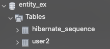

<br><br><br>

### 13-4-2. @Table, @SecondaryTable

- @Table은 엔티티와 매핑할 테이블을 지정

| 속성 | 기능 |
|------------|-----------------------------------------------------------------------------|
| name | 매핑할 테이블 이름. 생략시 엔티티 이름(@Entity(name="~") 사용 |
| catalog | catalog 기능이 있는 DB에서 catalog 매핑 |
| schema | schema기능이 있는 DB에서 schema 매핑 |
| uniqueContraints | DDL 생성시 유니크 제약조건 생성 <br> ※ 스키마 자동 생성 기능을 사용해 DDL을 만들 때만 사용 |

- 아래 코드 결과를 보면 @Table에 name을 추가하면 테이블이름이 name값으로 설정이 되고 생략시 Entity이름으로 테이블이 만들어집니다.

```java
@Entity
@Table(name = "user3")
@Getter
@Setter
public class User {
    @Id
    @GeneratedValue
    private Long id;
    private String name;
}
```

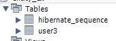

```java
@Entity(name="user2")
@Table
@Getter
@Setter
public class User {
    @Id
    @GeneratedValue
    private Long id;
    private String name;
}
```

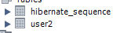

<br>

**@SecondaryTable의 사용**

- 하나의 엔티티에 다수의 테이블을 매핑하기 위해서는 @SecondaryTable 을 사용하면 됩니다.
- name 은 매핑할 다른 테이블의 이름입니다.
- pkJoinColumns은 매핑할 다른테이블의 키속성을 나타냅니다.

```java
@Entity
@Table(name = "BOARD")
@SecondaryTable(name = "BOARD_DETAIL",
                pkJoinColumns = @PrimaryKeyJoinColumn(name = "BOARD_DETAL_ID")) 
				// pkJoinColumns 를 사용하지 않으면 @Id 를 기본으로 가져갑니다.
@Getter
@Setter
public class Board {
    @Id
    @Column(name = "BOARD_ID")
    private String id;
    private String title;
    @Column(table = "BOARD_DETAIL",
            name = "BOARD_CONTENT")
    private String content;
}
```


<br><br><br>

### 13-4-3. @Id

- @Id는 특정 속성을 기본키로 설정하는 어노테이션입니다.

```java
@Entity
@Table(name = "User")
public class User {
    @Id
    private Long id;
    private String name;
}
```

- @Id 어노테이션만 적게될 경우 기본키값을 직접 부여해주어야 합니다. 하지만, 보통 데이터베이스를 설계할 때는 기본키는 직접 부여하지 않고 Mysql AUTO_INCREMENT처럼 자동 부여하게 합니다.

```java
@Entity(name="user2")
@Table
@Getter
@Setter
public class User {
    @Id
    @GeneratedValue
    private Long id;
    private String name;
}
```

- @GeneratedValue 어노테이션을 사용하면 기본값을 데이터베이스에서 자동으로 생성하는 전략을 사용 할 수 있습니다.
- 전략에는 IDENEITY, SEQUENCE, TABLE 3가지가 있습니다.

| 속성 | 기능 |
|----------------------------------------------|-------------------------------------------|
| @GeneratedValue(startegy = GenerationType.IDENTITY) | 기본 키 생성을 DB에 위임 (Mysql) |
| @GeneratedValue(startegy = GenerationType.SEQUENCE) | DB시퀀스를 사용해서 기본 키 할당  (ORACLE) |
| @GeneratedValue(startegy = GenerationType.TABLE) | 키 생성 테이블 사용 (모든 DB 사용 가능) |
| @GeneratedValue(startegy = GenerationType.AUTO) | 선택된 DB에 따라 자동으로 전략 선택 |

- 위 처럼 다양한 전략이 있는 이유는 데이터베이스마다 지원하는 방식이 다르기 때문입니다.

- AUTO 같은 경우에는 데이터베이스에 따라 전략을 JPA가 자동으로 선택합니다. 이로 인해 데이터베이스를 변경해도 코드를 수정할 필요 없다는 장점이 있습니다.

<br><br>

**@EmbeddedId 사용**

- 일반적인 경우에는 PK(기본키) 를 단일 @Id 로 구성하지만 경우에 따라선 복합키로서 테이블의 PK 를 정의 하기도 합니다. 복합키는 두개 이상의 @Id 로 구성이 되는데 이를 직접 Entity 에 정의하는 것이 아니라 별도의 Value 를 사용해 복합키를 정의합니다.
- 먼저 Value 를 생성한 다음 @Embeddable 어노테이션을 이용해 이 Value 가 Entity 에 삽입이 가능함을 명시 하고 Entity 에서는 @EmbeddedId 어노테이션을 이용해 이 Entity 에 해당 Value 를 PK 로 사용한다고 지정합니다.

```java
@Embeddable
public class CompanyOrganizationKey implements Serializable {
	@Column(name = "company_code")
    private String companyCode;
    
    @Column(name = "organization_code")
    private String organizationCode;
}

@Entity(name = "company_organization")
public class CompanyOrganization {
    @EmbeddedId
    protected CompanyOrganizationKey companyOrganizationKey;
}
```

<br><br><br>

### 13-4-4. @Column

- @Column은 객체 필드를 테이블 컬럼과 매핑합니다.

```java
@Column
private String name;
```

| 속성 | 설명 |
|------------|------------------------------------------------------------------------------|
| name	필드와 매핑할 테이블의 컬럼 이름 지정<br> default는 필드이름으로 대체 |
| insertable | true : 엔티티 저장시 필드값 저장 <br> false : 필드값이 저장되지 않음 |
| updatable	| true : 엔티티 수정시 값이 수정 <br> false : 엔티티 수정시 값이 수정 되지 않음 |
| table | 하나의 엔티티를 두 개 이상의 테이블에 매핑할 때 사용 |
| nullable | null값 허용 여부 설정 <br> false not null 제약 조건 |
| unique | 컬럼에 유니크 제약조건 부여 |
| columnDefinition | 데이터베이스 컬럼 정보를 직접 부여 |
| length | 문자 길이 제약조건 <br> String 타입일 때 사용 |
| precision, scale | BigDecimal 타입에서 사용 <br> precision : 소수점을 포함한 전체 자릿수 설정 scale : 소수의 자릿수 |

<br>

**insertable**

```java
//Entity
@Entity(name="user2")
@Builder
@AllArgsConstructor
@NoArgsConstructor
public class User {
    @Id
    @GeneratedValue
    private Long id;
    @Column(insertable = false)
    private String name;
    private String age;
}
```

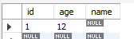

<br>

```java
//Service
@Service
@RequiredArgsConstructor
public class TestService {
    private final EntityManager em;
    @Transactional
    public void test() {
        User user = User.builder()
                .age("12")
                .name("test")
                .build();
        em.persist(user);
    }
}
```


- 위의 결과는 User 엔티티에 name 컬럼에 "test"를 입력해도 데이터베이스에는 값이 들어가지 않습니다.

<br>

**updatable**

```java
//Entity
@Entity(name="user2")
@Builder
@AllArgsConstructor
@NoArgsConstructor
@Setter
public class User {
    @Id
    @GeneratedValue
    private Long id;
    @Column(updatable = false)
    private String name;
    private String age;
}
```

```java
//Service
@Service
@RequiredArgsConstructor
public class TestService {
    private final EntityManager em;
    @Transactional
    public void test() {
        User user = User.builder()
                .age("12")
                .name("test")
                .build();
        em.persist(user);
        user.setName("change test");
    }
}
```

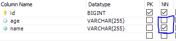

- 위의 결과는 User 엔티티 name 컬럼에 "test"를 입력하고 "change test"로 변경해도 변경값이 적용되지 않는다.

<br>

**nullable**

```java
@Entity(name="user2")
@Builder
@AllArgsConstructor
@NoArgsConstructor
@Setter
public class User {
    @Id
    @GeneratedValue
    private Long id;
    @Column(nullable = false)
    private String name;
    @Column(nullable = true)
    private String age;
}
```


- 위의 결과는 nullable true, false에 따라 not null이 적용되는지 여부입니다.

<br>

**unique**

```java
@Entity(name="user2")
@Builder
@AllArgsConstructor
@NoArgsConstructor
@Setter
public class User {
    @Id
    @GeneratedValue
    private Long id;
    @Column(unique = true)
    private String name;
    @Column(unique = false)
    private String age;
}
```

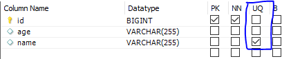

<br>

**columnDefinition**

```java
@Entity(name="user2")
@Builder
@AllArgsConstructor
@NoArgsConstructor
@Setter
public class User {
    @Id
    @GeneratedValue
    private Long id;
    @Column(unique = true)
    private String name;
    @Column(columnDefinition = "VARCHAR(15) NOT NULL")
    private String age;
}
```


<br>

**length**

```java
@Entity(name="user2")
@Builder
@AllArgsConstructor
@NoArgsConstructor
@Setter
public class User {
    @Id
    @GeneratedValue
    private Long id;
    @Column(length = 11)
    private String name;
    @Column(columnDefinition = "VARCHAR(15) NOT NULL")
    private String age;
}
```

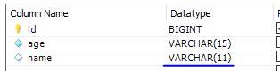

<br><br><br>

### 13-4-5. @Access

- @Access는 JPA가 엔티티 데이터에 접근하는 방식을 지정합니다.

| 접근 방식 | 기능 |
|--------------------------|---------------------------------------------------------|
| AccessType.FILED | 필드에 직접 접근 <br> 필드 접근 권한이 private여도 접근 가능 |
| AccessType.PROPERTY | getter를 통해 접근 <br> @Access를 설정하지 않으면 기본키를 설정하는 @Id의 위치를 기준으로 접근 방식 설정 |

```java
@Entity(name = "user2")
@Table(name = "user3")
@Getter
@Setter
public class User {
    @Id
    @GeneratedValue
    private Long id;
}
```

- 위 코드처럼 @Id가 필드에 설정되면 @Access(AccessType.FILED)로 설정된 아래 코드랑 같습니다.

```java
@Entity(name = "user2")
@Table(name = "user3")
@Getter
@Setter
@Access(AccessType.FIELD)
public class User {
    @Id
    @GeneratedValue
    private Long id;
}
```

- 아래 처럼 getter에 @id를 설정함으로 써 프로퍼티 접근으로 할 수 있습니다. 아래와 같은 경우 @Id가 getter에 위치하므로 @Access를 생략할 수 있습니다.

```java
@Entity(name = "user2")
@Table(name = "user3")
@Setter
@Access(AccessType.PROPERTY)
public class User {

    @GeneratedValue
    private Long id;

    @Id
    public Long getId() {
        return id;
    }
}
```

- 필드 접근과 프로퍼티 접근을 혼합하여 아래처럼 사용할 수 있습니다.

```java
//Entity
@Entity(name = "user2")
@Table(name = "user3")
@Getter
@Setter
public class User {
    @Id
    @GeneratedValue
    private Long id;

    @Transient
    private String name;

    @Access(AccessType.PROPERTY)
    public String getFullName() {
        return name + " hello";
    }
    protected void setFullName(String firstName) { }
}
```

```java
//Service
@Service
@RequiredArgsConstructor
public class TestService {
    private final EntityManager em;
    @Transactional
    public void test() {
        User user = new User();
        user.setName("aaa");
        em.persist(user);
    }
}
```

- getter에 AccessType.PROPERTY를 함으로써 getter의 fullName을 column으로 지정합니다.

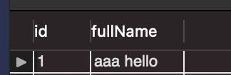

<br><br><br>

### 13-4-6. @Enumerated

- @Enumerated는 자바 enum 타입을 매핑할 때 사용합니다.

| 속성 | 기능 |
|---------------|--------------------------------------------------------------------------|
| value | EnumType.ORDINAL : enum 순서를 DB에 저장 EnumType.STRING : enum이름을 데이터베이스에 저장 |

```java
//Enum 클래스
public enum RoleType {
    ADMIN, USER
}
```

```java
//Entity
@Entity(name = "user2")
@Table(name = "user3")
@Getter
@Setter
public class User {
    @Id
    @GeneratedValue
    private Long id;
    private String name;
    @Enumerated(value = EnumType.ORDINAL)
    private RoleType ordinal;
    @Enumerated(value = EnumType.STRING)
    private RoleType string;
}
```

```java
//Service
@Service
@RequiredArgsConstructor
public class TestService {
    private final EntityManager em;
    @Transactional
    public void test() {
        User user = new User();
        user.setName("test");
        user.setOrdinal(RoleType.ADMIN);
        user.setString(RoleType.ADMIN);
        em.persist(user);
    }
}
```

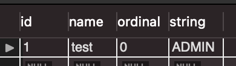

- 결과를 보면 EnumType.ORDINAL은 ADMIN의 순서인 0이 저장되고, EnumType.STRING은 문자열 자체가 저장됩니다.

- 사용할 때 주의점은 ADMIN, USER 사이에 enum이 하나 추가되면 USER가 순서상 2번이 됩니다. 하지만 DB에서는 기존 번호 USER를 1로 저장했기 때문에 문제가 발생할 수 있으므로 되도록이면 EnumType.STRING사용을 권장합니다.

<br><br><br>

### 13-4-7. @Temporal

- @Temporal은 날짜 타입을 매핑할 때 사용합니다.


| 속성 | 기능 |
|-----------------|------------------------------------------------------------------------|
| value | TemporalType.DATE : 날짜, DB date 타입과 매핑(예 : 2020-02-12) <br> TemporalType.TIME : 시간, DB time 타입과 매핑(예: 12:12:12) <br> TemporalType.TIMESTAMP : 날짜와 시간 DB timestamp타입과 매핑(예 : 2020-02-12 12:12:12) |


```java
//Entity
@Entity(name = "user2")
@Table(name = "user3")
@Getter
@Setter
public class User {
    @Id
    @GeneratedValue
    private Long id;
    private String name;
    @Enumerated(value = EnumType.ORDINAL)
    private RoleType ordinal;
    @Enumerated(value = EnumType.STRING)
    private RoleType string;
    @Temporal(value = TemporalType.DATE)
    private Date date;
    @Temporal(value = TemporalType.TIME)
    private Date time;
    @Temporal(value = TemporalType.TIMESTAMP)
    private Date timeStamp;
}
```

```java
//Service
@Service
@RequiredArgsConstructor
public class TestService {
    private final EntityManager em;
    @Transactional
    public void test() {
        User user = new User();
        Date date = new Date();
        user.setName("test");
        user.setOrdinal(RoleType.ADMIN);
        user.setString(RoleType.ADMIN);
        user.setTime(date);
        user.setDate(date);
        user.setTimeStamp(date);
        em.persist(user);
    }
}
```

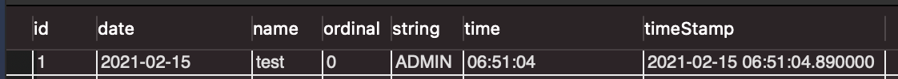

<br><br><br>

### 13-4-8. @Lob

- 데이터베이스 BLOB, CLOB 타입과 매핑 @Lob은 정의할 속성이 따로 없으며, 대신 필드 타입이 문자열이면 CLOB, 나머지는 BLOB을 매핑합니다.

```java
//Entity
@Entity(name = "user2")
@Table(name = "user3")
@Getter
@Setter
public class User {
    @Id
    @GeneratedValue
    private Long id;
    private String name;
    @Enumerated(value = EnumType.ORDINAL)
    private RoleType ordinal;
    @Enumerated(value = EnumType.STRING)
    private RoleType string;
    @Temporal(value = TemporalType.DATE)
    private Date date;
    @Temporal(value = TemporalType.TIME)
    private Date time;
    @Temporal(value = TemporalType.TIMESTAMP)
    private Date timeStamp;
    @Lob
    private String stringLob;
    @Lob
    private Integer integerLob;
}
```


```java
//Service
@Service
@RequiredArgsConstructor
public class TestService {
    private final EntityManager em;
    @Transactional
    public void test() {
        User user = new User();
        Date date = new Date();
        user.setName("test");
        user.setOrdinal(RoleType.ADMIN);
        user.setString(RoleType.ADMIN);
        user.setTime(date);
        user.setDate(date);
        user.setTimeStamp(date);
        user.setStringLob("hello");
        user.setIntegerLob(2);
        em.persist(user);
    }
}
```

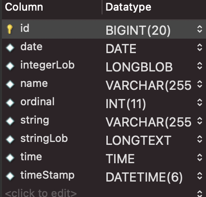

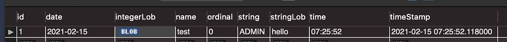

- Mysql에서의 결과를 보면 stringLob은 LONGTEXT, integerLob은 LONGBLOB으로 매핑된 것을 확인할 수 있습니다.

<br><br><br>

### 13-4-9. @Transient

- @Transient 어노테이션을 붙인 필드는 데이터베이스에 저장하지도 조회하지도 않는다. 객체에 임시로 값을 보관하고 싶을 때 사용합니다.

```java
@Entity(name = "user2")
@Table(name = "user3")
@Getter
@Setter
public class User {
    @Id
    @GeneratedValue
    private Long id;
    private String name;
    @Enumerated(value = EnumType.ORDINAL)
    private RoleType ordinal;
    @Enumerated(value = EnumType.STRING)
    private RoleType string;
    @Temporal(value = TemporalType.DATE)
    private Date date;
    @Temporal(value = TemporalType.TIME)
    private Date time;
    @Temporal(value = TemporalType.TIMESTAMP)
    private Date timeStamp;
    @Lob
    private String stringLob;
    @Lob
    private Integer integerLob;

    //임시 사용
    @Transient
    private String trans;
}
```

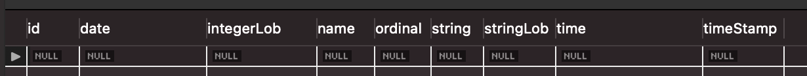

- @Transient를 단 trans필드가 DB컬럼에 추가되지 않는것을 확인할 수 있습니다.


