<nav id="quick" style="">
	<label for="chap1" style="color:black;font-size:28px;">14. Open API 와 API 용용 및 부가 기능</label>
	<input type="radio" name="chap" id="chap1" style="display:none;">
	<ul class="menu">
		<li><a href="#14-1" style="color:black;font-size:20px;text-decoration:none;">14-1. 스프링프레임워크 이메일 보내기 설정</a></li>
		<li><a href="#14-2" style="color:black;font-size:20px;text-decoration:none;">14-2. 스프링프레임워크 이메일 보내기 Controller 구현하기</a></li>
        <li><a href="#14-3" style="color:black;font-size:20px;text-decoration:none;">14-3. 파일 업로드 구현</li>
        <li><a href="#14-4" style="color:black;font-size:20px;text-decoration:none;">14-4. Editor Board 구현</li>
        <li><a href="#14-5" style="color:black;font-size:20px;text-decoration:none;">14-5. 결제 Api 구현</li>
        <li><a href="#14-6" style="color:black;font-size:20px;text-decoration:none;">14-6. Chat Api 구현</li>
	</ul>
</nav>

<div id="14"></div>

# 14. Open API 와 API 용용 및 부가 기능

<div id="14-1"></div>

## 14-1. 스프링프레임워크 이메일 보내기 설정

- 스프링프레임워크에서 메일서버(SMTP Server)를 이용하여 메일을 전송하는 방법에 대해서 알아보고자 합니다. SMTP는 Simple Mail Transfer Protocol로서 전자 메일 전송을 위한 표준 프로토콜입니다. 따라서 SMTP Server란 이메일을 송신하는 서버입니다. (메일서버는 SMTP Server, POP3 Server가 있고 POP3 Server는 이메일을 수신하는 서버입니다.)
- 메일 전송 기능을 구현하기 위해선 아래의 4가지가 필요합니다.
  1. pom.xml 설정
  2. mailSender Bean 등록(root-context.xml 도는 servlet-context.xml)
  3. Controller 메서드 추가
  4. 메일 계정 보안 설정

- 메일서버(SMTP Server)를 통해 메일을 전송할 때 다음과 같은 두 가지 방법이 있습니다.
     첫 번째, 메일 서버가 릴레이(relay)를 허용하는 경우 
          ※릴레이(Relay) : 외부(외부 네트워크)에서 해당 메일서버(smtp 서버)를 경유해서 외부로 메일을 보내는 것을 의미함.
        - 이 방식은 계정이 존재하지 않더라도 메일을 발송할 수 있습니다. 
        - 릴레이(relay)를 허용하는 경우 잘못된 방식(타인에 의한 스팸메일)으로 악용 될 수 있습니다. 
        - 따라서 특정 IP에서만 릴레이가 되도록 하는게 일반적입니다.

     두 번째, 메일 서버에 계정 인증 후 메일을 전송하는 방법

위 두 가지 방법 선택은 "2.mailSender Bean 등록"에서 이루어집니다. 
아래의 자세한 설명에서 어떻게 설정해야 하는지 설명은 하지만 주 방식은 계정 인증 후 메일을 전송하는 방법으로 설명을 진행하고자 합니다.

### 14-1-1. 메일 계정 보안 설정
 
- SMTP Server를 통해서 메일 전송 기능을 구현하기 위해선 사용하고자 하는 메일의 SMTP 보안 단계를 낮추어야 합니다. 네이버의 경우 로그인시 휴대폰승인을 통한 보안 단계까지 설정이 되어 있을 경우 아래의 설정만으로는 부족합니다. 

#### 14-1-1-1. 구글 이메일 설정

   1) 구글 메인페이지 오른쪽 상단에 자신의 계정을 클릭하고 아래의 그림과 같이 "Google 계정 관리"를 클릭합니다.

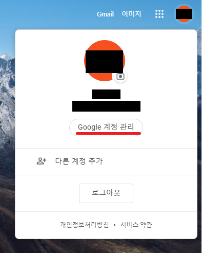

		그림 1-1
 

   2) 왼쪽 목록중 [보안]을 클릭합니다.

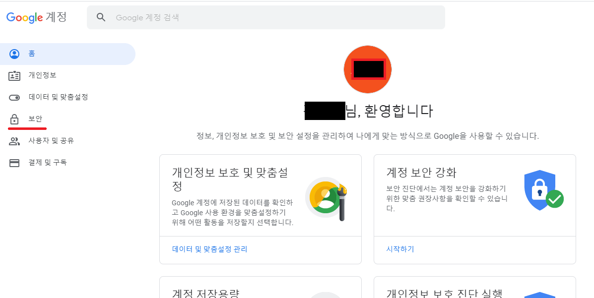

		그림 1-2
 
   3) 보안 항목에서 "보안 수준이 낮은 앱의 액세스"를 찾은 후 "액세스 사용 설정(권장하지 않음)"을 클릭합니다.

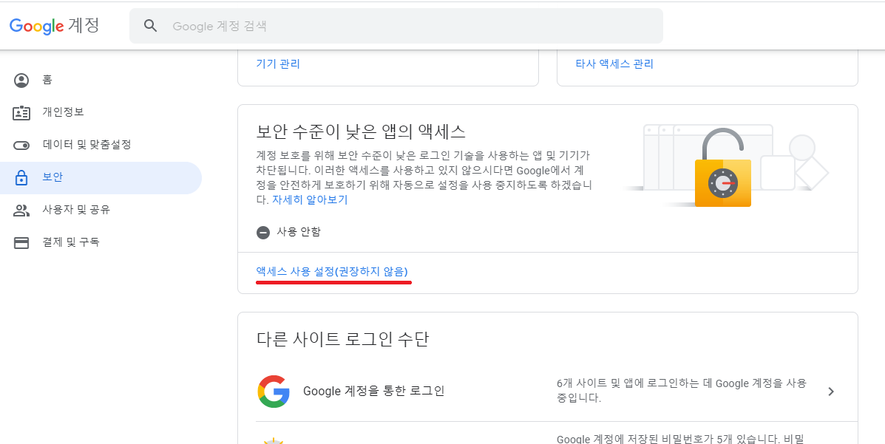

		그림 1-3
 

4) 보안 수준이 낮은 앱 허용을 사용함으로 변경합니다. 

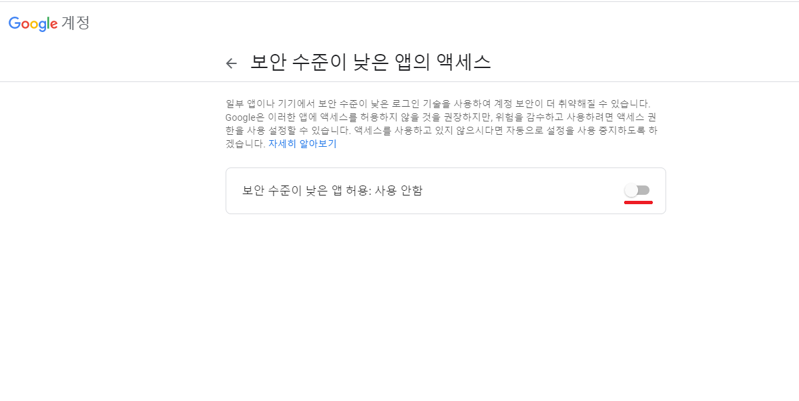

		그림 1-4
 
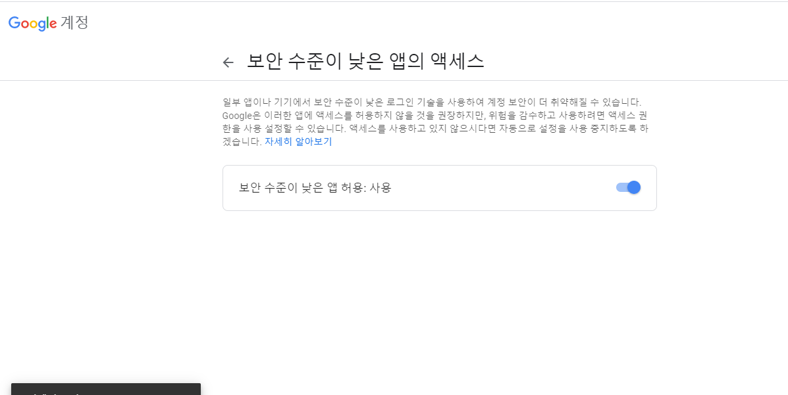

		그림 1-5
 

<br><br>

#### 14-1-1-2. 네이버 이메일 설정

   1) 네이버 메일 페이지 들어간 후 왼쪽 최하단에 "환결 설정"을 클릭합니다.

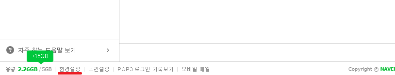

		그림 1-6
 
   2) 상단 목록 중 "POP3/IMAP 설정"을 클릭합니다.

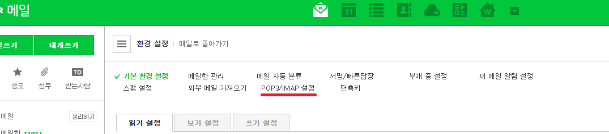

		그림 1-7
 
   3) "POP3/SMTP 사용"을 '사용함'으로 체크 후 확인버튼을 클릭합니다.

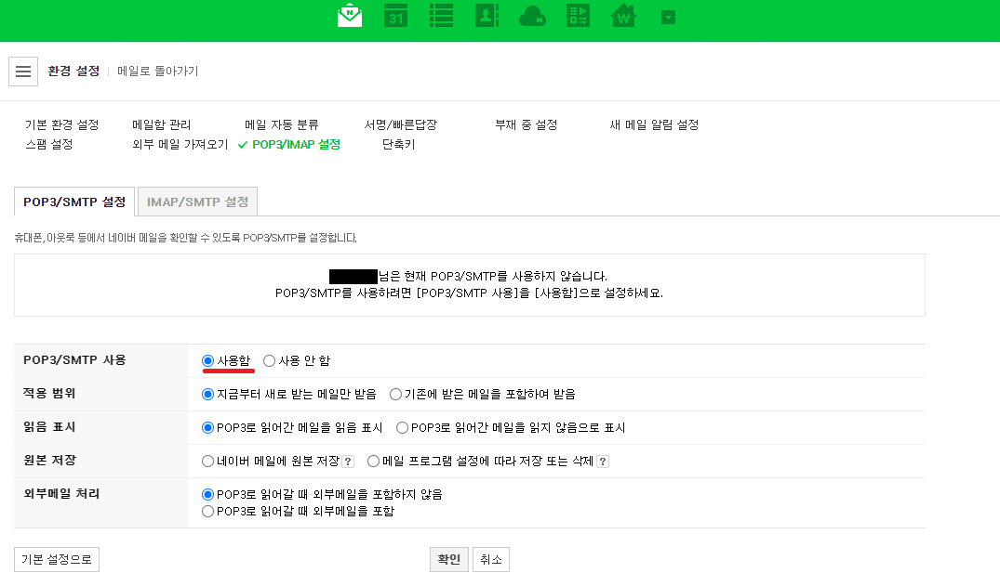

		그림 1-8
 

<br><br>

#### 14-1-1-3. 다음 이메일 설정

   1) 다음 메일페이지 들어간 후 왼쪽 목록 중 제일 아래에 "환결 설정"을 클릭합니다.

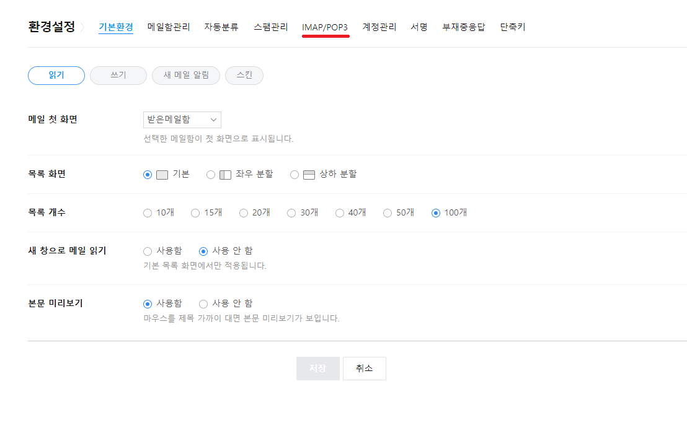

		그림 1-9
 
   2) 상단 목록 중 "IMAP/POP3"을 클릭합니다.

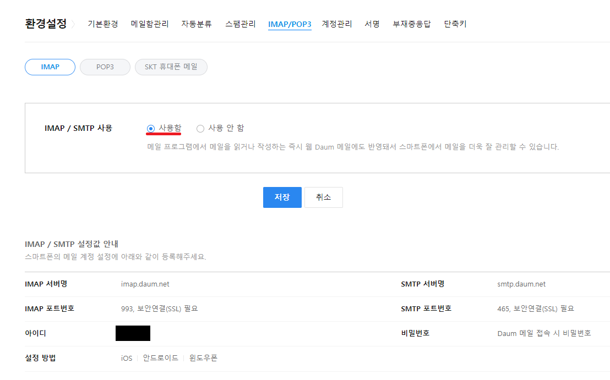

		그림 1-10
 
   3) "IMAP / SMTP 사용"을 '사용함'으로 체크 후 저장을 클릭합니다.


		그림 1-11
 

<br><br><br>

### 14-1-2. pom.xml 설정

#### 14-1-2-1 mail 라이브러리를 추가해줍니다.

   - 버전은 자신에게 맞는 버전을 선택하시면 됩니다.
   - (글쓰는 현재 가장 최신 버전은 1.5.0-b01이지만 아직 안정적이지 않은 거 같아서 가장 많이 사용한 1.4.7을 선택하였습니다.)

```xml
<!-- https://mvnrepository.com/artifact/javax.mail/mail -->
<dependency>
    <groupId>javax.mail</groupId>
    <artifactId>mail</artifactId>
    <version>1.4.7</version>
</dependency>
```

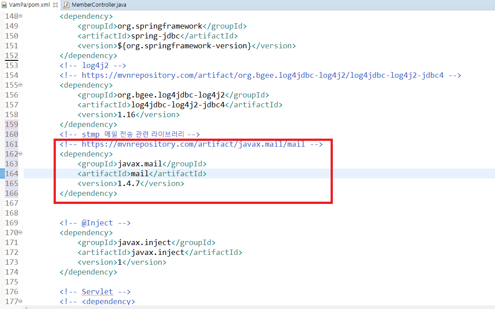

		그림 2-1

- java에서 메일을 보내기 위해 필요로한 라이브러리입니다.
- 실제 전송되는 메일 객체를 가집니다.
- 주요 클래스로 Session, Message, Address, Authenticator, Tranport 등이 잇습니다.
- 해당 라이브러리만으로도 메일 전송 기능이 구현 가능합니다. 하지만 개발자가 모든 세팅을 직접 해주어야 하기 때문에 번거롭습니다.
- 여기서는 spring-context-support 라이브러리를 사용할 것이기 때문에, mail 라이브러리에선 javax.mail.internet.MimeMessage만 사용됩니다. 

<br><br>

#### 14-1-2-2 spring-context-support 라이브러리를 추가합니다.
 
```xml
<!-- https://mvnrepository.com/artifact/org.springframework/spring-context-support -->
<dependency>
    <groupId>org.springframework</groupId>
    <artifactId>spring-context-support</artifactId>
    <version>${org.springframework-version}</version>
</dependency>
```

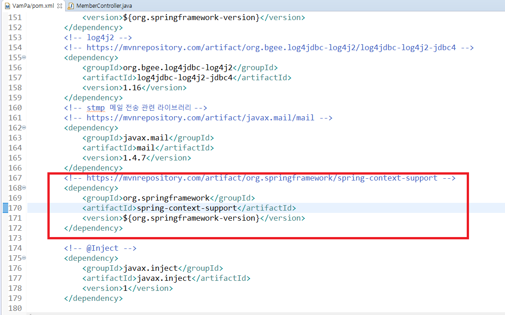

			그림 2-2
 
- JavaMailSender 인터페이스(JavaMailSenderImpl)를 사용하기 위해 필요로 합니다. mail 라이브러리를 일일이 세팅을 할 필요 없이 몇 가지의 설정(MailSender Bean설정)만으로도 사용될 수 있도록 도와줍니다.
- JavaMailSender 인터페이스는 MIME 형식의 메일을 보낼 수 있도록 해줍니다.(javax.mail.MimeMessage 사용 가능)
- 스프링 프레임워크에서는 기본적으로 JavaMailSender 인터페이스와 비슷한 역할을 하는 메인 인터페이스 MainSender가 있습니다. 하지만 MainSender는 SimpleMailMessage만 사용 가능합니다. (javax.mail.MimeMessage 사용 불가능)

* SimpleMailMessage는 단순한 텍스트 메시지만 사용할 수 있고, MimeMessage는 텍스트와 더불어 이미지와 같은 첨부파일을 같이 메시지에 포함시킬 수 있습니다.

<br><br><br> 

### 14-1-3. 이메일로 파일을 보내기 위한 Bean 등록과 mailSender Bean 등록

- servlet-context.xml에 아래의 코드를 추가해줍니다.
  
```xml
	<!-- 멀티파트 리졸버 설정 -->
	<beans:bean id="multipartResolver" class="org.springframework.web.multipart.commons.CommonsMultipartResolver">
		<beans:property name="maxUploadSize" value="10485760" /> <!-- 10mb 제한 -->
		<beans:property name="defaultEncoding" value="UTF-8" />
	</beans:bean>
	
	<!-- 멀티파트 업로드 디렉토리 지정 -->
	<beans:bean id="uploadPath" class="java.lang.String">
		<beans:constructor-arg value="D:\kim\springframework\study14\src\main\webapp\resources\upload"></beans:constructor-arg>
	</beans:bean>
```  

<br><br>

- Bean 등록은 root-context.xml에 설정해주시면 됩니다. 릴레이를 허용하는 서버를 사용한 경우의 빈 설정과 아이디/비밀번호로 인증 후 발송하는 빈 설정은 구글 / 네이버 / 다음 순으로 알아보겠습니다. 

<br><br>

#### 14-1-3-1. 메일 서버가 릴레이(relay)를 허용하는 경우

- root-context.xml에 아래의 코드를 추가해줍니다.

```xml 
<bean id="mailSender" class="org.springframework.mail.javamail.JavaMailSenderImpl"> 
 <property name="host" value="stmp 도메인 주소"/> 
</bean>
```

- host의 value값은 아래의 링크에서 '2. 사용 가능한 메일서버 찾기(nslookup)'을 참고하셔서 해당 주소를 입력하시면 됩니다.

<br><br>
 
#### 14-1-3-2. 메일 서버에 계정 인증 후 메일을 전송하는 방법
 
- host, port, username, password <property> 태그는 각 메일서버에 맞게 설정해주시면 됩니다. 각 메일서버에서 가장 크게 다른 점은 name이 javaMailProperties인 <property> 태그입니다. 해당 태그는 각 메일서버에서 사용 중인 보안 프로토콜을 인증하기 위해 사용되는 코드가 삽입됩니다. 

<br><br>

**gmail**
  - root-context.xml에 아래의 코드를 추가해줍니다.

```xml
<!-- gmail설정 -->
<bean id="mailSender2" class="org.springframework.mail.javamail.JavaMailSenderImpl"> 
    <property name="host" value="smtp.gmail.com" />
    <property name="port" value="587" />
    <property name="username" value="your_email"/> <!-- 자신의 이메일 아이디 -->
    <property name="password" value="your_password!"/> <!-- 자신의 비밀번호 -->
    <property name="defaultEncoding" value="utf-8" />
    <!-- 보안연결 TLS과 관련된 설정 -->
    <property name="javaMailProperties">
        <props>
            <prop key="mail.smtp.starttls.enable">true</prop>
            <prop key="mail.smtp.auth">true </prop>
            <prop key="mail.transport.protocol">smtp</prop>
            <prop key="mail.debug">true</prop>
            <prop key="mail.smtp.ssl.trust">smtp.gmail.com</prop>
            <prop key="mail.smtp.ssl.protocols">TLSv1.2</prop>
        </props>
    </property>
</bean>
```
 
- host : "smtp.gmail.com" 입력
- port : "587" 입력
- username : 자신의 이메일 아이디 입력
- password : 자신의 이메일 비밀번호 입력
- javaMailProperties인 <property> 태그에 삽입된 코드는 TLS 인증 코드입니다.

* SSL이란 웹사이트와 브라우저 사이에서 전송되는 데이터를 암호화하여 인터넷 연결을 보안을 유지하는 표준 기술입니다. TLS는 더 강력한 버전의 SSL입니다. TLS 도한 SSL이라 불리기도 합니다. 

<br><br>

**naver**

- root-context.xml에 아래의 코드를 추가해줍니다.

```xml
<!-- navermail설정 -->
<bean id="mailSender" class="org.springframework.mail.javamail.JavaMailSenderImpl"> 
 <property name="host" value="smtp.naver.com"/> <!-- 메이서버 호스트 -->
 <property name="port" value="465"/> <!-- 메이서버 포트번호 -->
 <property name="username" value="your_email"/> <!-- 자신의 이메일 아이디 -->
 <property name="password" value="your_password"/> <!-- 자신의 비밀번호 -->
   <!-- 보안연결 SSL과 관련된 설정 -->
 <property name="javaMailProperties">
  <props>
  <prop key="mail.smtp.auth">true</prop>
  <prop key="mail.smtp.starttls.enable">true</prop>
  <prop key="mail.smtps.checkserveridentity">true</prop>
  <prop key="mail.smtps.ssl.trust">*</prop>
  <prop key="mail.debug">true</prop>
  <prop key="mail.smtp.socketFactory.class">javax.net.ssl.SSLSocketFactory</prop>
  </props>
 </property>
</bean>
```
- host : "smtp.naver.com" 입력
- port : "465" 입력
- username : 자신의 이메일 아이디 입력
- password : 자신의 이메일 비밀번호 입력
- javaMailProperties인 <property> 태그에 삽입된 코드는 SSL 인증 코드입니다.

<br><br>
 
**daum**

- root-context.xml에 아래의 코드를 추가해줍니다.

```xml
<!-- daum mail설정 -->
<bean id="mailSender3" class="org.springframework.mail.javamail.JavaMailSenderImpl"> 
        <property name="host" value="smtp.daum.net"/> <!-- 메이서버 호스트 -->
        <property name="port" value="465"/> <!-- 메일서버 포트번호 -->
        <property name="username" value="your_email"/> <!-- 자신의 이메일 아이디 -->
        <property name="password" value="your_password"/> <!-- 자신의 비밀번호 -->
        <property name="defaultEncoding" value="utf-8" />
        <!-- 보안연결 SSL과 관련된 설정 -->
        <property name="javaMailProperties">
            <props>
                <prop key="mail.smtp.auth">true</prop>
                <prop key="mail.smtp.starttls.enable">true</prop>
                <prop key="mail.smtps.checkserveridentity">true</prop>
                <prop key="mail.smtps.ssl.trust">*</prop>
                <prop key="mail.debug">true</prop>
                <prop key="mail.smtp.socketFactory.class">javax.net.ssl.SSLSocketFactory</prop>
            </props>
        </property>
</bean>
```

- host : "smtp.daum.net" 입력
- port : "465" 입력
- username : 자신의 이메일 아이디 입력
- password : 자신의 이메일 비밀번호 입력
- javaMailProperties인 <property>태그에 삽입된 코드는 네이버와 동일하게 SSL 인증 코드입니다.

<br><br><br>

**email 폴더 만들기**

src/main/webapp/WEB-INF/views에 email 폴더 만들기

<br><br>

**servlet-context.xml의 내용 추가**

```xml
    <!-- 생략 -->
    <resources mapping="/email/**" location="/WEB-INF/views/email" />
    <!-- 생략 -->
```

<br><br><br><br>

<div id="14-2"></div>

## 14-2. Controller / View(jsp) 작성
 
- MimeMessage 객체를 직접 생성하여 메일을 발송하는 방법과 MimeMessagePreparator 를 사용해서 메일을 전송하는 방법이 있습니다. 두가지 코드 모두 알아보겠습니다.

- 보내는 이 이메일, 받는 이 이메일, 메일 제목, 메일 내용 4가지의 데이터를 입력해주어야하는데 해당 데이터들을 VO객체에 담아서도 가능하고 Controller 메서드 내에 직접 삽입 하는 것도 가능합니다. 직접 삽입 방식으로 진행하겠습니다.

- 메일전송을 위해 필요로한 정보를 세팅하였던 "mailSender" Bean을 인젝션(의존성 주입) 하여 사용하겠습니다. 


```java
	@Autowired
	private JavaMailSenderImpl mailSender; //네이버 메일
	
	@Autowired
	private JavaMailSenderImpl mailSender2; //지메일
	
	@Autowired
	private JavaMailSenderImpl mailSender3; //다음 메일

    @Autowired
	private String uploadPath;
```

<br><br>

### 14-2-1. MimeMessage 객체를 직접 생성하여 메일을 발송하는 방법

이 방식을 사용하기 위해 import 되는 클래스들은 아래와 같습니다. 
 
```java
import javax.mail.internet.MimeMessage;
import org.springframework.mail.javamail.JavaMailSenderImpl;
import org.springframework.mail.javamail.MimeMessageHelper;
```

*MimeMessage 대신 SimpleMailMessage를 사용할 수도 있습니다. 둘의 차이점은 MimeMessage의 경우 멀티파트 데이터를 처리 할 수 있고 SimpleMailMessage는 단순한 텍스트 데이터만 전송이 가능합니다. 

<br>

Controller에 메서드는 아래와 같이 작성하면됩니다. 
 
```java
    @RequestMapping(value = "/sendMail", method = RequestMethod.GET)
    public void sendMailTest() throws Exception{
        
        String subject = "test 메일";
        String content = "메일 테스트 내용";
        String from = "보내는이 아이디@도메인주소";
        String to = "받는이 아이디@도메인주소";
        
        try {
            MimeMessage mail = mailSender.createMimeMessage();
            MimeMessageHelper mailHelper = new MimeMessageHelper(mail,true,"UTF-8");
            // true는 멀티파트 메세지를 사용하겠다는 의미
            
            /*
             * 단순한 텍스트 메세지만 사용시엔 아래의 코드도 사용 가능 
             * MimeMessageHelper mailHelper = new MimeMessageHelper(mail,"UTF-8");
             */
            
            mailHelper.setFrom(from);
            // 빈에 아이디 설정한 것은 단순히 smtp 인증을 받기 위해 사용 따라서 보내는이(setFrom())반드시 필요
            // 보내는이와 메일주소를 수신하는이가 볼때 모두 표기 되게 원하신다면 아래의 코드를 사용하시면 됩니다.
            //mailHelper.setFrom("보내는이 이름 <보내는이 아이디@도메인주소>");
            mailHelper.setTo(to);
            mailHelper.setSubject(subject);
            mailHelper.setText(content, true);
            // true는 html을 사용하겠다는 의미입니다.
            
            /*
             * 단순한 텍스트만 사용하신다면 다음의 코드를 사용하셔도 됩니다. mailHelper.setText(content);
             */
            
            mailSender.send(mail);
            
        } catch(Exception e) {
            e.printStackTrace();
        }
        
    }
``` 

<br><br>

- MimeMessageHelper mailHelper = new MimeMessageHelper(mail,true,"UTF-8") 에서 true는 멀티파트 메세지를 사용하겠다는 의미입니다. 단순한 텍스트 메세지만 사용하신다면 아래의 코드를 사용하시면됩니다.
- mailHelper.setText(content, true) 에서 true는 html을 사용한다는 의미입니다. html을 사용하게되면 이미지를 첨부 할 수 있는 img 태그를 사용 할 수 있습니다. 
- 단순한 텍스트만 사용할 시엔 mailHelper.setText(content)로 사용하시면 됩니다. 
- 보내는이(from)은 반드시 있어야합니다. mailSender 빈에서 아이디를 기입하였지만 이는 SMTP 사용 권한을 얻어 오는 역할을 수행합니다.


* 메일 주소에 보내는이와 메일주소를 모두 표기를 원한다면 아래와 같이 작성하시면 됩니다.
 
```java
mailHelper.setFrom("보내는이 이름 <보내는이 아이디@도메인주소>");
```

<br><br>

### 14-2-2. MimeMessagePreparator를 사용해서 메일을 전송하는 방법
 
- 해당 방식은 MimeMessage를 직접 객체화 하지 않고 MimeMessagePreparator 클래스를 사용하는 방식입니다. 이방식을 사용하기위해 import 되는 클래스는 다음과 같습니다.

- 14-2-1 과 다른점은 import org.springframework.mail.javamail.MimeMessagePreparator 가 추가적으로 추가 된다는 점입니다.
 
```java
import javax.mail.internet.MimeMessage;
import org.springframework.mail.javamail.JavaMailSenderImpl;
import org.springframework.mail.javamail.MimeMessageHelper;
import org.springframework.mail.javamail.MimeMessagePreparator;
```

- Controller에 메서드는 다음과 같이 작성 하시면 됩니다. 
- new MimeMessageHelper(mail,true,"UTF-8") / mailHelper.setText(content, true) 는 14-2-1 설명과 동일합니다.

 
```java
    @RequestMapping(value = "/sendMail2", method = RequestMethod.GET)
    public void sendMailTest2() throws Exception{
 
        String subject = "test 메일";
        String content = "메일 테스트 내용.";
        String from = "보내는이 아이디@도메인주소";
        String to = "받는이 아이디@도메인주소";
        
        
        final MimeMessagePreparator preparator = new MimeMessagePreparator() {
            
            public void prepare(MimeMessage mimeMessage) throws Exception{
                final MimeMessageHelper mailHelper = new MimeMessageHelper(mimeMessage, true, "UTF-8");
                
                mailHelper.setFrom(from);
                mailHelper.setTo(to);
                mailHelper.setSubject(subject);
                mailHelper.setText(content, true);
 
            }
            
        };
        
        try {    
            mailSender.send(preparator);
            
        } catch(Exception e) {
            e.printStackTrace();
        }        
        
    }
```
 
<br><br><br>

### 14-2-2. 텍스트 / 이미지 / 업로드 전송
 
- 설명하기 앞서 이미지 / 업로드 전송을 위해선 멀티파트 메세지를 허용해야하며 html 허용을 설정해 주어야 합니다.해당 설명은 14-2-1 의 Controller 메서드 코드를 기반으로 진행하겠습니다. 


```java
// 멀티파트 메세지 허용
MimeMessageHelper mailHelper = new MimeMessageHelper(mail,true,"UTF-8");
 
// html 
mailHelper.setText(content, true);
```

<br><br> 

#### 14-2-2-1. 단순 텍스트 

- 14-2-1 코드 예시와 같이 메세지 내용을 단순한 텍스트로 전송하는 것입니다. 

```java
@RequestMapping(value = "/sendMail2", method = RequestMethod.GET)
    public void sendMailTest2() throws Exception{
        
        String subject = "test 메일";
        String content = "메일 테스트 내용";
        String from = "보내는이 아이디@도메인주소";
        String to = "받는이 아이디@도메인주소";
        
        try {
            MimeMessage mail = mailSender.createMimeMessage();
            MimeMessageHelper mailHelper = new MimeMessageHelper(mail,true,"UTF-8");
            // true는 멀티파트 메세지를 사용하겠다는 의미
            
            /*
             * 단순한 텍스트 메세지만 사용시엔 아래의 코드도 사용 가능 
             * MimeMessageHelper mailHelper = new MimeMessageHelper(mail,"UTF-8");
             */
            
            mailHelper.setFrom(from);
            // 빈에 아이디 설정한 것은 단순히 smtp 인증을 받기 위해 사용 따라서 보내는이(setFrom())반드시 필요
            // 보내는이와 메일주소를 수신하는이가 볼때 모두 표기 되게 원하신다면 아래의 코드를 사용하시면 됩니다.
            //mailHelper.setFrom("보내는이 이름 <보내는이 아이디@도메인주소>");
            mailHelper.setTo(to);
            mailHelper.setSubject(subject);
            mailHelper.setText(content, true);
            // true는 html을 사용하겠다는 의미입니다.
            
            /*
             * 단순한 텍스트만 사용하신다면 다음의 코드를 사용하셔도 됩니다. mailHelper.setText(content);
             */
            
            mailSender.send(mail);
            
        } catch(Exception e) {
            e.printStackTrace();
        }
        
    }
```

<br><br> 

#### 14-2-2-2. 이미지

- 이미지를 첨부하는 방법은 html 허용을 설정했기때문에 이미지 태그()를 사용합니다. 예를 들면 다음과 같습니다. 
 
```java
String content = "메일 테스트 내용" + "";
``` 

```java
    @RequestMapping(value = "/sendMail3", method = RequestMethod.GET)
    public void sendMailTest3() throws Exception{
        
        String subject = "test 메일";
        String content = "메일 테스트 내용" + "";
        String from = "보내는이 아이디@도메인주소";
        String to = "받는이 아이디@도메인주소";
        
        try {
            MimeMessage mail = mailSender.createMimeMessage();
            MimeMessageHelper mailHelper = new MimeMessageHelper(mail,true,"UTF-8");
            
            mailHelper.setFrom(from);
            mailHelper.setTo(to);
            mailHelper.setSubject(subject);
            mailHelper.setText(content, true);
            
            mailSender.send(mail);
            
        } catch(Exception e) {
            e.printStackTrace();
        }
        
    }
```
 
<br><br>

#### 14-2-2-3. 업로드

- 업로드 된 파일을 전송하기 위해선 추가적인 클래스 import가 필요로합니다.
 
```java
import org.springframework.core.io.FileSystemResource;
import java.io.File;
```
 
추가해주어야할 코드는 다음과 같습니다.

```java
FileSystemResource file = new FileSystemResource(new File("경로\업로드할파일.형식")); 
helper.addAttachment("업로드파일.형식", file);
```
 
```java
    @RequestMapping(value = "/sendMail4", method = RequestMethod.GET)
    public void sendMailTest4() throws Exception{
        
        String subject = "test 메일";
        String content = "메일 테스트 내용" + "";
        String from = "보내는이 아이디@도메인주소";
        String to = "받는이 아이디@도메인주소";
        
        try {
            MimeMessage mail = mailSender.createMimeMessage();
            MimeMessageHelper mailHelper = new MimeMessageHelper(mail,true,"UTF-8");
            
            mailHelper.setFrom(from);
            mailHelper.setTo(to);
            mailHelper.setSubject(subject);
            mailHelper.setText(content, true);
            
            FileSystemResource file = new FileSystemResource(new File("D:\\test.txt")); 
            mailHelper.addAttachment("업로드파일.형식", file);
            
            mailSender.send(mail);
            
        } catch(Exception e) {
            e.printStackTrace();
        }
        
    }
```

<br><br>

### 14-2-3. 인증코드 발송

```java
	@Autowired
	private CustomService customService;

    @RequestMapping("findAuth")
    @ResponseBody
    public Map findAuth(@ModelAttribute("vo") Custom vo, Model model) {
        
        Map map = new HashMap();
        
        //사용자가 작성한 아이디를 기준으로 존재하는 사용자인지 확인한다.(id는 회원가입시 중복 체크를 했기 때문에 유니크하다.)
        Custom isUser = customService.getCustom(vo.getId());
        
        if(isUser != null) {//회원가입이 되어있는, 존재하는 사용자라면
            Random r = new Random();
            int num = r.nextInt(999999); //랜덤 난수 
            
            StringBuilder sb = new StringBuilder();
            
            // DB에 저장된 email            입력받은 email
            if(isUser.getEmail().equals(vo.getEmail())) {//이메일 정보 또한 동일하다면 
        
                String setFrom = "kkt09072@naver.com";//발신자 이메일
                String tomail = isUser.getEmail();//수신자 이메일
                String title = "비밀번호 변경 인증 이메일입니다.";
                sb.append(String.format("안녕하세요 %s님\n", isUser.getName()));
                sb.append(String.format("비밀번호 찾기(변경) 인증번호는 %d입니다.", num));
                String content = sb.toString();
                
                try {
                    MimeMessage msg = mailSender.createMimeMessage();
                    MimeMessageHelper msgHelper = new MimeMessageHelper(msg, true, "utf-8");
                    msgHelper.setFrom(setFrom);
                    msgHelper.setTo(tomail);
                    msgHelper.setSubject(title);
                    msgHelper.setText(content);
                    mailSender.send(msg);                    //메일 전송                    
                } catch (Exception e) {
                    System.out.println(e.getMessage());
                }
                
                //성공적으로 메일을 보낸 경우
                map.put("status", true);
                map.put("num", num);
                map.put("m_idx", isUser.getId());                
            }
        }
		return map;
    }   
```

<br><br><br> 

### 14-2-4. 메일 전송 테스트

- 테스트 클래스를 통해 Controller 메서드에 추가했던 코드들을 테스트 해보겠습니다. 테스트 클래스를 생성 후 아래의 코드를 작성하였습니다. mailSendTest(), mailSendTest2()가 있는데 둘 중 하나를 사용하시면 됩니다. 
 
```java
import java.io.File;
 
import javax.mail.internet.MimeMessage;
 
import org.junit.Test;
import org.junit.runner.RunWith;
import org.springframework.beans.factory.annotation.Autowired;
import org.springframework.core.io.FileSystemResource;
import org.springframework.mail.javamail.JavaMailSenderImpl;
import org.springframework.mail.javamail.MimeMessageHelper;
import org.springframework.mail.javamail.MimeMessagePreparator;
import org.springframework.test.context.ContextConfiguration;
import org.springframework.test.context.junit4.SpringJUnit4ClassRunner;
 
@RunWith(SpringJUnit4ClassRunner.class)
@ContextConfiguration("file:src/main/webapp/WEB-INF/spring/root-context.xml")
public class MailTestController {
 
    @Autowired
    JavaMailSenderImpl mailSender;
    
    // MimeMessage 객체를 직접 생성하여 메일을 발송하는 방법
    @Test
    public void mailSendTest() throws Exception{
        
        String subject = "test 메일";
        String content = "메일 테스트 내용" + "";
        String from = "보내는이 아이디@도메인주소";
        String to = "받는이 아이디@도메인주소";
        
        try {
            MimeMessage mail = mailSender.createMimeMessage();
            MimeMessageHelper mailHelper = new MimeMessageHelper(mail, "UTF-8");
            
            mailHelper.setFrom(from);
            mailHelper.setTo(to);
            mailHelper.setSubject(subject);
            mailHelper.setText(content, true);
            
            FileSystemResource file = new FileSystemResource(new File("D:\\test.txt")); 
            mailHelper.addAttachment("test.txt", file);            
            
            mailSender.send(mail);
            
        } catch(Exception e) {
            e.printStackTrace();
        }
    }
    
    // MimeMessagePreparator를 사용해서 메일을 전송하는 방법
    @Test
    public void mailSendTest2() throws Exception{
        
        String subject = "test 메일";
        String content = "메일 테스트 내용" + "";
        String from = "보내는이 아이디@도메인주소";
        String to = "받는이 아이디@도메인주소";
        
        try {
            final MimeMessagePreparator preparator = new MimeMessagePreparator() {
                
                public void prepare(MimeMessage mimeMessage) throws Exception{
                    final MimeMessageHelper mailHelper = new MimeMessageHelper(mimeMessage, true, "UTF-8");
                    
                    mailHelper.setFrom(from);
                    mailHelper.setTo(to);
                    mailHelper.setSubject(subject);
                    mailHelper.setText(content, true);
                    
                    FileSystemResource file = new FileSystemResource(new File("D:\\test.txt")); 
                    mailHelper.addAttachment("test.txt", file);
                    
                }
                
            };
            
            mailSender.send(preparator);
            
        } catch(Exception e) {
            e.printStackTrace();
        }      
    }
}
``` 

- 테스트 결과입니다. 

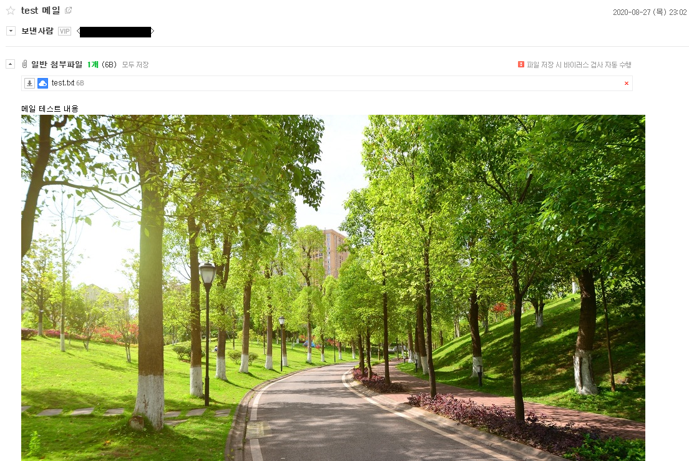

			그림 2-1-1

<br><br><br>

### 14-2-5. 이메일 전체 소스 코드

**pom.xml 에 필요한 라이브러리 등록**

```xml
<project xmlns="http://maven.apache.org/POM/4.0.0" xmlns:xsi="http://www.w3.org/2001/XMLSchema-instance" 
	xsi:schemaLocation="http://maven.apache.org/POM/4.0.0 https://maven.apache.org/xsd/maven-4.0.0.xsd">
  <modelVersion>4.0.0</modelVersion>
  <groupId>spring1</groupId>
  <artifactId>spring1</artifactId>
  <version>0.0.1-SNAPSHOT</version>
  <name>study10</name>
  <packaging>war</packaging>
  <properties>
  	<java-version>11</java-version>
  	<org.springframework-version>5.0.8.RELEASE</org.springframework-version>
  	<org.aspectj-version>1.8.10</org.aspectj-version>
  	<org.slf4j-version>1.7.25</org.slf4j-version>
  </properties>
  <dependencies>
		<dependency>
			<groupId>org.springframework</groupId>
			<artifactId>spring-context</artifactId>
			<version>${org.springframework-version}</version>
			<exclusions>
				<!-- Exclude Commons Logging in favor of SLF4j -->
				<exclusion>
					<groupId>commons-logging</groupId>
					<artifactId>commons-logging</artifactId>
				 </exclusion>
			</exclusions>
		</dependency>
		<dependency>
			<groupId>org.springframework</groupId>
			<artifactId>spring-webmvc</artifactId>
			<version>${org.springframework-version}</version>
		</dependency>
				
		<!-- aspectjweaver -->
		<dependency>
		  <groupId>org.aspectj</groupId>
		  <artifactId>aspectjweaver</artifactId>
		  <version>${org.aspectj-version}</version>
		</dependency>
						
		<!-- AspectJ : 관점지향형(AOP) 기능 제공 라이브러리 -->
		<dependency>
			<groupId>org.aspectj</groupId>
			<artifactId>aspectjrt</artifactId>
			<version>${org.aspectj-version}</version>
		</dependency>	
		
		<!-- Logging : 모든 자원의 접속 로그를 기록하는 라이브러리 -->
		<dependency>
			<groupId>org.slf4j</groupId>
			<artifactId>slf4j-api</artifactId>
			<version>${org.slf4j-version}</version>
		</dependency>
		<dependency>
			<groupId>org.slf4j</groupId>
			<artifactId>jcl-over-slf4j</artifactId>
			<version>${org.slf4j-version}</version>
			<scope>runtime</scope>
		</dependency>
		<dependency>
			<groupId>org.slf4j</groupId>
			<artifactId>slf4j-log4j12</artifactId>
			<version>${org.slf4j-version}</version>
			<scope>runtime</scope>
		</dependency>
		<dependency>
			<groupId>log4j</groupId>
			<artifactId>log4j</artifactId>
			<version>1.2.15</version>
			<exclusions>
				<exclusion>
					<groupId>javax.mail</groupId>
					<artifactId>mail</artifactId>
				</exclusion>
				<exclusion>
					<groupId>javax.jms</groupId>
					<artifactId>jms</artifactId>
				</exclusion>
				<exclusion>
					<groupId>com.sun.jdmk</groupId>
					<artifactId>jmxtools</artifactId>
				</exclusion>
				<exclusion>
					<groupId>com.sun.jmx</groupId>
					<artifactId>jmxri</artifactId>
				</exclusion>
			</exclusions>
			<scope>runtime</scope>
		</dependency>

		<!-- @Inject : 의존성 주입 라이브러리 -->
		<dependency>
			<groupId>javax.inject</groupId>
			<artifactId>javax.inject</artifactId>
			<version>1</version>
		</dependency>
		
		<!-- JSP/Servlet 라이브러리 -->
		<dependency>
		    <groupId>javax.servlet</groupId>
		    <artifactId>javax.servlet-api</artifactId>
		    <version>4.0.1</version>
		    <scope>provided</scope>
		</dependency>
		<dependency>
			<groupId>javax.servlet.jsp</groupId>
			<artifactId>jsp-api</artifactId>
			<version>2.1</version>
			<scope>provided</scope>
		</dependency>
		<dependency>
			<groupId>javax.servlet</groupId>
			<artifactId>jstl</artifactId>
			<version>1.2</version>
		</dependency>
		
		<!-- Test : junit 테스트 라이브러리 -->
		<dependency>
			<groupId>junit</groupId>
			<artifactId>junit</artifactId>
			<version>4.13</version>
			<scope>test</scope>
		</dependency>  
		  
		<!--  스프링 테스트 라이브러리 추가 -->
		<dependency>
			<groupId>org.springframework</groupId>
			<artifactId>spring-test</artifactId>
			<version>5.0.8.RELEASE</version>
		</dependency>
		
		<!-- war 배포 및 패키징 라이브러리 추가 -->
		<dependency>
			<groupId>org.apache.maven.plugins</groupId>
			<artifactId>maven-war-plugin</artifactId>
			<version>3.2.0</version>
		</dependency>    
		
		<!--  getter, setter, constructer를 자동 생성해주는 라이브러리 -->
		<dependency>
		    <groupId>org.projectlombok</groupId>
		    <artifactId>lombok</artifactId>
		    <version>1.18.22</version>
		    <scope>provided</scope>
		</dependency>

		<!--  log4jdbc-log4j2-jdbc4 : DB 접속로그를 기록하는 라이브러리 -->
		<dependency>
		    <groupId>org.bgee.log4jdbc-log4j2</groupId>
		    <artifactId>log4jdbc-log4j2-jdbc4</artifactId>
		    <version>1.16</version>
		</dependency>
		
				
		<!-- 스프링 트랜잭션 라이브러리 -->
		<dependency>
		    <groupId>org.springframework</groupId>
		    <artifactId>spring-tx</artifactId>
		    <version>${org.springframework-version}</version>
		</dependency>
		
		<!-- 스프링 jdbc 라이브러리 -->
		<dependency>
		    <groupId>org.springframework</groupId>
		    <artifactId>spring-jdbc</artifactId>
		    <version>${org.springframework-version}</version>
		</dependency>
		
		<!-- commons-dbcp : 자바 웹 DB 연결 공용 라이브러리 -->
		<dependency>
		    <groupId>commons-dbcp</groupId>
		    <artifactId>commons-dbcp</artifactId>
		    <version>1.4</version>
		</dependency>
		
		<!--  오라클 jdbc 라이브러리 -->
		<dependency>
		    <groupId>com.oracle.database.jdbc</groupId>
		    <artifactId>ojdbc11</artifactId>
		    <version>21.1.0.0</version>
		</dependency>
		
		<!-- SQL 구문을 XML로 쉽게 구현하기 위한 MyBatis 라이브러리 -->
		<dependency>
		    <groupId>org.mybatis</groupId>
		    <artifactId>mybatis</artifactId>
		    <version>3.4.0</version>
		</dependency>
		
		<dependency>
		    <groupId>org.mybatis</groupId>
		    <artifactId>mybatis-spring</artifactId>
		    <version>1.3.2</version>
		</dependency>
		
		<!-- 구글 JSON -->
		<dependency>
		    <groupId>com.google.code.gson</groupId>
		    <artifactId>gson</artifactId>
		    <version>2.7</version>
		</dependency>
		<dependency>
		    <groupId>org.jsoup</groupId>
		    <artifactId>jsoup</artifactId>
		    <version>1.12.1</version>
		</dependency>
		<dependency>
		    <groupId>org.json</groupId>
		    <artifactId>json</artifactId>
		    <version>20200518</version>
		</dependency>
		
		<!-- org.json.simple JSON 라이브러리 -->
	    <dependency>
	      <groupId>org.apache.clerezza.ext</groupId>
	      <artifactId>org.json.simple</artifactId>
	      <version>0.4</version>
	    </dependency>
		
		<!-- jackson 라이브러리 -->
		<dependency>
		    <groupId>com.fasterxml.jackson.core</groupId>
		    <artifactId>jackson-databind</artifactId>
		    <version>2.9.4</version>
		</dependency>
		
		<dependency>
		    <groupId>org.codehaus.jackson</groupId>
		    <artifactId>jackson-mapper-asl</artifactId>
		    <version>1.9.13</version>
		</dependency>
		
				<!-- 파일 첨부 및 업로드 라이브러리 -->		
		<dependency>
		    <groupId>commons-fileupload</groupId>
		    <artifactId>commons-fileupload</artifactId>
		    <version>1.3.2</version>
		</dependency>
		<dependency>
			<groupId>commons-io</groupId>
			<artifactId>commons-io</artifactId>
			<version>2.4</version>
		</dependency>
		<!--  이미지 편집 라이브러리 -->
		<dependency>
		    <groupId>org.imgscalr</groupId>
		    <artifactId>imgscalr-lib</artifactId>
		    <version>4.0</version>
		</dependency>
		
		<!-- 자바 이메일 기본 라이브러리 -->
		<dependency>
		    <groupId>javax.mail</groupId>
		    <artifactId>javax.mail-api</artifactId>
		    <version>1.4.7</version>
		</dependency>
		
		<!-- 이메일 및 자원에 대한 외부 송출 라이브러리 -->
		<dependency>
		    <groupId>org.springframework</groupId>
		    <artifactId>spring-context-support</artifactId>
		    <version>${org.springframework-version}</version>
		</dependency>

		<!-- java의 validation 라이브러리 -->		
		<dependency>
		    <groupId>javax.validation</groupId>
		    <artifactId>validation-api</artifactId>
		    <version>2.0.1.Final</version>
		</dependency>
		<!-- 폼 검증을 애노테이션으로 검증하도록 하는 hibernate 라이브러리 -->
		<dependency>
		    <groupId>org.hibernate</groupId>
		    <artifactId>hibernate-annotations</artifactId>
		    <version>3.5.6-Final</version>
		</dependency> 
		<!--  hibernate Validator 라이브러리 -->
		<dependency>
		    <groupId>org.hibernate.validator</groupId>
		    <artifactId>hibernate-validator</artifactId>
		    <version>6.2.0.Final</version>
		</dependency>
		<dependency>
		    <groupId>javax.xml.bind</groupId>
		    <artifactId>jaxb-api</artifactId>
		    <version>2.3.0</version>
		</dependency>
		
		<dependency>
		    <groupId>javax.annotation</groupId>
		    <artifactId>javax.annotation-api</artifactId>
		    <version>1.2</version>
		</dependency>
		
	    <!-- 스프링 암호화 라이브러리 -->
	    <dependency>
	      <groupId>org.springframework.security</groupId>
	      <artifactId>spring-security-core</artifactId>
	      <version>5.4.0</version>
	    </dependency>
	    <dependency>
	      <groupId>org.springframework.security</groupId>
	      <artifactId>spring-security-web</artifactId>
	      <version>5.4.0</version>
	    </dependency>
	    <dependency>
	      <groupId>org.springframework.security</groupId>
	      <artifactId>spring-security-config</artifactId>
	      <version>5.4.0</version>
	    </dependency>
	    <dependency>
	      <groupId>org.springframework.security</groupId>
	      <artifactId>spring-security-taglibs</artifactId>
	      <version>5.4.0</version>
	    </dependency>
		
  </dependencies>
  <build>
    <plugins>
        <plugin>
            <artifactId>maven-eclipse-plugin</artifactId>
            <version>2.9</version>
            <configuration>
                <additionalProjectnatures>
                    <projectnature>org.springframework.ide.eclipse.core.springnature</projectnature>
                </additionalProjectnatures>
                <additionalBuildcommands>
                    <buildcommand>org.springframework.ide.eclipse.core.springbuilder</buildcommand>
                </additionalBuildcommands>
                <downloadSources>true</downloadSources>
                <downloadJavadocs>true</downloadJavadocs>
            </configuration>
        </plugin>
        <plugin>
            <groupId>org.apache.maven.plugins</groupId>
            <artifactId>maven-compiler-plugin</artifactId>
            <version>2.5.1</version>
            <configuration>
                <source>11</source>
                <target>11</target>
                <compilerArgument>-Xlint:all</compilerArgument>
                <showWarnings>true</showWarnings>
                <showDeprecation>true</showDeprecation>
            </configuration>
        </plugin>
        <plugin>
            <groupId>org.codehaus.mojo</groupId>
            <artifactId>exec-maven-plugin</artifactId>
            <version>1.2.1</version>
            <configuration>
                <mainClass>org.test.int1.Main</mainClass>
            </configuration>
        </plugin>
    </plugins>
  </build>
</project>
```

<br><br>

#### 14-2-5-1. root-context.xml

```xml
<?xml version="1.0" encoding="UTF-8"?>
<beans xmlns="http://www.springframework.org/schema/beans"
	xmlns:xsi="http://www.w3.org/2001/XMLSchema-instance"
	xmlns:mybatis-spring="http://mybatis.org/schema/mybatis-spring"
	xmlns:context="http://www.springframework.org/schema/context"
	xmlns:aop="http://www.springframework.org/schema/aop"
	xmlns:jdbc="http://www.springframework.org/schema/jdbc"
	xmlns:tx="http://www.springframework.org/schema/tx"
	xsi:schemaLocation="http://www.springframework.org/schema/jdbc http://www.springframework.org/schema/jdbc/spring-jdbc-4.3.xsd
		http://mybatis.org/schema/mybatis-spring http://mybatis.org/schema/mybatis-spring-1.2.xsd
		http://www.springframework.org/schema/beans https://www.springframework.org/schema/beans/spring-beans.xsd
		http://www.springframework.org/schema/context http://www.springframework.org/schema/context/spring-context-4.3.xsd
		http://www.springframework.org/schema/aop http://www.springframework.org/schema/aop/spring-aop-4.3.xsd
		http://www.springframework.org/schema/tx http://www.springframework.org/schema/tx/spring-tx-4.3.xsd">
	
	<!-- Root Context: defines shared resources visible to all other web components -->
	<!-- 데이터베이스 설정 -->
	<!-- spring-jdbc-5.0.8.RELEASE.jar 안의 드라이버매니저 연결 -->
	<bean id="dataSource" class="org.springframework.jdbc.datasource.DriverManagerDataSource">
	<!-- 데이터 소스 및 드라이버 설정 : log4jdbc-log4j2-jdbc4-1.16.jar -->
		<property name="driverClassName" value="net.sf.log4jdbc.sql.jdbcapi.DriverSpy"></property>
	<!-- 연결 url, 사용자 아이디, 비밀번호 설정  -->
		<property name="url" value="jdbc:log4jdbc:oracle:thin:@localhost:1521:xe" />
		<property name="username" value="system" />
		<property name="password" value="1234"></property>
	</bean>
	<!-- sql을 대신할 my-batis 설정 : mybatis-spring-1.3.2.jar의 세션팩토리빈클래스 연결 -->
	<bean id="sqlSessionFactory" class="org.mybatis.spring.SqlSessionFactoryBean">
		<property name="dataSource" ref="dataSource" />
		<!-- mybatis 설정파일 등록-->
		<property name="configLocation" value="classpath:/mybatis-config.xml"></property>
		<!-- sql처럼 데이터베이스와 자바 클래스를 데이터 연관을 지어줄 파일 위치와 이름 지정 -->
		<property name="mapperLocations" value="classpath:mappers/**/*Mapper.xml"></property>
	</bean>	
	<!-- SqlSession 객체 주입 -->
	<bean id="sqlSession" class="org.mybatis.spring.SqlSessionTemplate" destroy-method="clearCache">
		<constructor-arg name="sqlSessionFactory" ref="sqlSessionFactory"></constructor-arg>
	</bean>
	
	<!-- 트랜잭션 및 DB 패키지 방안 및 각 종 로깅과 보안 설정 -->
	<bean id="transactionManager" class="org.springframework.jdbc.datasource.DataSourceTransactionManager">
		<property name="dataSource" ref="dataSource" />
	</bean>
		
	<!-- @Transactional 어노테이션 처리 -->
	<tx:annotation-driven transaction-manager="transactionManager" />
	
	<!-- naver/daum/google 메일 서버 설정 -->
	
	<!-- navermail설정 -->
	<bean id="mailSender" class="org.springframework.mail.javamail.JavaMailSenderImpl"> 
	 <property name="host" value="smtp.naver.com"/> <!-- 메이서버 호스트 -->
	 <property name="port" value="465"/> <!-- 메일서버 포트번호 -->
	 <property name="username" value="your_email"/> <!-- 자신의 이메일 아이디 -->
	 <property name="password" value="your_password"/> <!-- 자신의 비밀번호 -->
	 <property name="defaultEncoding" value="utf-8" />
	   <!-- 보안연결 SSL과 관련된 설정 -->
	 <property name="javaMailProperties">
	  <props>
	  <prop key="mail.smtp.auth">true</prop>
	  <prop key="mail.smtp.starttls.enable">true</prop>
	  <prop key="mail.smtps.checkserveridentity">true</prop>
	  <prop key="mail.smtps.ssl.trust">*</prop>
	  <prop key="mail.debug">true</prop>
	  <prop key="mail.smtp.socketFactory.class">javax.net.ssl.SSLSocketFactory</prop>
	  </props>
	 </property>
	</bean>
	
	<!-- gmail설정 -->
	<bean id="mailSender2" class="org.springframework.mail.javamail.JavaMailSenderImpl"> 
	     <property name="host" value="smtp.gmail.com" />
	     <property name="port" value="587" />
		 <property name="username" value="your_email"/> <!-- 자신의 이메일 아이디 -->
		 <property name="password" value="your_password!"/> <!-- 자신의 비밀번호 -->
		 <property name="defaultEncoding" value="utf-8" />
		 <!-- 보안연결 TLS과 관련된 설정 -->
	     <property name="javaMailProperties">
	     <props>
	        <prop key="mail.smtp.starttls.enable">true</prop>
			<prop key="mail.smtp.auth">true </prop>
			<prop key="mail.transport.protocol">smtp</prop>
			<prop key="mail.debug">true</prop>
			<prop key="mail.smtp.ssl.trust">smtp.gmail.com</prop>
			<prop key="mail.smtp.ssl.protocols">TLSv1.2</prop>
	     </props>
	     </property>
	</bean>

	<!-- daum email설정 -->
	<bean id="mailSender3" class="org.springframework.mail.javamail.JavaMailSenderImpl"> 
		 <property name="host" value="smtp.daum.net"/> <!-- 메이서버 호스트 -->
		 <property name="port" value="465"/> <!-- 메일서버 포트번호 -->
		 <property name="username" value="your_email"/> <!-- 자신의 이메일 아이디 -->
		 <property name="password" value="your_password"/> <!-- 자신의 비밀번호 -->
		 <property name="defaultEncoding" value="utf-8" />
		 <!-- 보안연결 SSL과 관련된 설정 -->
		 <property name="javaMailProperties">
			  <props>
				  <prop key="mail.smtp.auth">true</prop>
				  <prop key="mail.smtp.starttls.enable">true</prop>
				  <prop key="mail.smtps.checkserveridentity">true</prop>
				  <prop key="mail.smtps.ssl.trust">*</prop>
				  <prop key="mail.debug">true</prop>
				  <prop key="mail.smtp.socketFactory.class">javax.net.ssl.SSLSocketFactory</prop>
			  </props>
		 </property>
	</bean>
			
</beans>
```

<br><br>

#### 14-2-5-2. servlet-context.xml

```xml
<?xml version="1.0" encoding="UTF-8"?>
<beans:beans xmlns="http://www.springframework.org/schema/mvc"
	xmlns:xsi="http://www.w3.org/2001/XMLSchema-instance"
	xmlns:beans="http://www.springframework.org/schema/beans"
	xmlns:context="http://www.springframework.org/schema/context"
	xsi:schemaLocation="http://www.springframework.org/schema/mvc https://www.springframework.org/schema/mvc/spring-mvc.xsd
		http://www.springframework.org/schema/beans https://www.springframework.org/schema/beans/spring-beans.xsd
		http://www.springframework.org/schema/context https://www.springframework.org/schema/context/spring-context.xsd">

	<!-- DispatcherServlet 의 요청 처리 인프라를 정의 -->
	
	<!-- Spring MVC @Controller 프로그래밍 모델을 활성화합니다. -->
	<annotation-driven />

	<!--  접근 자원에 대한 권한 설정 -->
	<!-- Handles HTTP GET requests for /resources/** by efficiently serving up static resources in the ${webappRoot}/resources directory -->
	<resources mapping="/resources/**" location="/resources/" />
	<resources mapping="/data/**" location="/data/" />
	
	<resources mapping="/include/**" location="/WEB-INF/views/include" />
	<resources mapping="/board/**" location="/WEB-INF/views/board" />
	<resources mapping="/member/**" location="/WEB-INF/views/member" />
	<resources mapping="/reservate/**" location="/WEB-INF/views/reservate" />
	<resources mapping="/qna/**" location="/WEB-INF/views/qna" />
	<resources mapping="/databank/**" location="/WEB-INF/views/databank" />
	<resources mapping="/util/**" location="/WEB-INF/views/util" />
	<resources mapping="/sample/**" location="/WEB-INF/views/sample" />
	<resources mapping="/check/**" location="/WEB-INF/views/check" />
	<resources mapping="/user/**" location="/WEB-INF/views/user" />
	<resources mapping="/free/**" location="/WEB-INF/views/free" />
	<resources mapping="/test/**" location="/WEB-INF/views/test" />
	<resources mapping="/test2/**" location="/WEB-INF/views/test2" />
	<resources mapping="/api/**" location="/WEB-INF/views/api" />
	<resources mapping="/ajax/**" location="/WEB-INF/views/ajax" />
	<resources mapping="/ajax2/**" location="/WEB-INF/views/ajax2" />
	<resources mapping="/custom/**" location="/WEB-INF/views/custom" />
	<resources mapping="/admin/**" location="/WEB-INF/views/admin" />
	<resources mapping="/email/**" location="/WEB-INF/views/email" />
		
	<!-- 리졸버에 대한 접두사와 접미사 설정 -->
	<!-- @Controller가 렌더링하기 위해 선택한 뷰를 /WEB-INF/views 디렉터리의 .jsp 리소스로 확인합니다. -->
	<beans:bean class="org.springframework.web.servlet.view.InternalResourceViewResolver">
		<beans:property name="prefix" value="/WEB-INF/views/" />
		<beans:property name="suffix" value=".jsp" />
	</beans:bean>
	
	<!-- 멀티파트 리졸버 설정 -->
	<beans:bean id="multipartResolver" class="org.springframework.web.multipart.commons.CommonsMultipartResolver">
		<beans:property name="maxUploadSize" value="10485760" /> <!-- 10mb 제한 -->
		<beans:property name="defaultEncoding" value="UTF-8" />
	</beans:bean>
	
	<!-- 멀티파트 업로드 디렉토리 지정 -->
	<beans:bean id="uploadPath" class="java.lang.String">
		<beans:constructor-arg value="D:\kim\springframework\study14\src\main\webapp\resources\upload"></beans:constructor-arg>
	</beans:bean>
	
	<!-- Spring Validator 지정 -->
	<annotation-driven validator="validator"/>
	<beans:bean id="validator" class="org.springframework.validation.beanvalidation.LocalValidatorFactoryBean" />
	
	<!-- 기본 메인 패키지 및 컨트롤러 패키지 설정 -->
	<context:component-scan base-package="com.spring1" />

	<beans:bean id="adminIntercepter" class="com.spring1.filter.AdminInterceptor" />
    <interceptors>
        <interceptor>
            <mapping path="/admin/**"/>
            <beans:ref bean="adminIntercepter" />
        </interceptor>
    </interceptors>
	
</beans:beans>
```

<br><br>

#### 14-2-5-3. 컨트롤러(Controller)

**com.spring1.controller.EmailController**

```java
package com.spring1.controller;

import java.io.File;
import java.util.HashMap;
import java.util.Iterator;
import java.util.Map;
import java.util.Random;

import javax.mail.internet.MimeMessage;
import javax.servlet.http.HttpServletRequest;

import org.slf4j.Logger;
import org.slf4j.LoggerFactory;
import org.springframework.beans.factory.annotation.Autowired;
import org.springframework.core.io.FileSystemResource;
import org.springframework.mail.javamail.JavaMailSenderImpl;
import org.springframework.mail.javamail.MimeMessageHelper;
import org.springframework.mail.javamail.MimeMessagePreparator;
import org.springframework.stereotype.Controller;
import org.springframework.ui.Model;
import org.springframework.web.bind.annotation.GetMapping;
import org.springframework.web.bind.annotation.ModelAttribute;
import org.springframework.web.bind.annotation.RequestMapping;
import org.springframework.web.bind.annotation.RequestMethod;
import org.springframework.web.bind.annotation.ResponseBody;
import org.springframework.web.multipart.MultipartFile;
import org.springframework.web.multipart.MultipartHttpServletRequest;

import com.spring1.dto.Custom;
import com.spring1.service.CustomService;

@Controller
@RequestMapping("/email/")
public class EmailController {
	
	private static final Logger log = LoggerFactory.getLogger(EmailController.class);
	
	@Autowired
	private JavaMailSenderImpl mailSender; //네이버 메일
	
	@Autowired
	private JavaMailSenderImpl mailSender2; //지메일
	
	@Autowired
	private JavaMailSenderImpl mailSender3; //다음 메일

	@Autowired
	private String uploadPath;
	
	@Autowired
	private CustomService customService;
	
	@GetMapping("main")
	public String home(Model model) {
		return "email/home";
	}
	
	@GetMapping("email1")
	public String email1(Model model) {
		return "email/sendEmail1";
	}
	
	@GetMapping("email2")
	public String email2(Model model) {
		return "email/sendEmail2";
	}
	
	@GetMapping("email3")
	public String email3(Model model) {
		return "email/sendEmail3";
	}

	@GetMapping("email4")
	public String email4(Model model) {
		return "email/sendEmail4";
	}
	
	@GetMapping("email5")
	public String email5(Model model) {
		return "email/sendEmail5";
	}

	@GetMapping("email11")
	public String email11(Model model) {
		return "email/sendEmail11";
	}
	
	@GetMapping("email12")
	public String email12(Model model) {
		return "email/sendEmail12";
	}
	
	@GetMapping("email13")
	public String email13(Model model) {
		return "email/sendEmail13";
	}

	@GetMapping("email14")
	public String email14(Model model) {
		return "email/sendEmail14";
	}
	
	@GetMapping("email15")
	public String email15(Model model) {
		return "email/sendEmail15";
	}
	
	@GetMapping("email21")
	public String email21(Model model) {
		return "email/sendEmail21";
	}
	
	@GetMapping("email22")
	public String email22(Model model) {
		return "email/sendEmail22";
	}
	
	@GetMapping("email23")
	public String email23(Model model) {
		return "email/sendEmail23";
	}

	@GetMapping("email24")
	public String email24(Model model) {
		return "email/sendEmail24";
	}
	
	@GetMapping("email25")
	public String email25(Model model) {
		return "email/sendEmail25";
	}
	
	//여기부터는 네이버 이메일 보내기입니다.
	//1. MimeMessage 객체를 직접 생성하여 메일을 발송하는 방법
	@RequestMapping(value = "sendMail1", method = RequestMethod.POST)
    public String sendMailTest(HttpServletRequest req, Model model) throws Exception{
		String author = req.getParameter("author");
		String name = req.getParameter("name");
		String tel = req.getParameter("tel");
        String subject = req.getParameter("subject");
        String content = req.getParameter("content");
        String from = req.getParameter("from");
        String to = req.getParameter("to");
        boolean ps = false;
        try {
            MimeMessage mail = mailSender.createMimeMessage();
            MimeMessageHelper mailHelper = new MimeMessageHelper(mail,true,"UTF-8");
            // true는 멀티파트 메세지를 사용하겠다는 의미
            /*
             * 단순한 텍스트 메세지만 사용시엔 아래의 코드도 사용 가능 
             * MimeMessageHelper mailHelper = new MimeMessageHelper(mail,"UTF-8");
             */
            mailHelper.setFrom(from);
            // 빈에 아이디 설정한 것은 단순히 smtp 인증을 받기 위해 사용 따라서 보내는이(setFrom())반드시 필요
            // 보내는이와 메일주소를 수신하는이가 볼때 모두 표기 되게 원하신다면 아래의 코드를 사용하시면 됩니다.
            //mailHelper.setFrom("보내는이 이름 <보내는이 아이디@도메인주소>");
            mailHelper.setTo(to);
            mailHelper.setSubject(subject);
            mailHelper.setText(content, true);
            // true는 html을 사용하겠다는 의미입니다.            
            /*
             * 단순한 텍스트만 사용하신다면 다음의 코드를 사용하셔도 됩니다. mailHelper.setText(content);
             */
            mailSender.send(mail);
            ps = true;
        } catch(Exception e) {
        	ps= false;
            e.printStackTrace();
        } 

        model.addAttribute("ps", ps);
        model.addAttribute("from", from);
        model.addAttribute("to", to);
        model.addAttribute("name", author+"/"+name+"/"+tel);
        model.addAttribute("subject", subject);
        model.addAttribute("content", content);
        
        return "email/sendEmailOk1";
    }

	
	//2. MimeMessagePreparator를 사용해서 메일을 전송하는 방법
    @RequestMapping(value = "sendMail2", method = RequestMethod.GET)
    public String sendMail2(HttpServletRequest req, Model model) throws Exception{
		String author = req.getParameter("author");
		String name = req.getParameter("name");
		String tel = req.getParameter("tel");
        String subject = req.getParameter("subject");
        String content = req.getParameter("content");
        String from = req.getParameter("from");
        String to = req.getParameter("to"); 
        boolean ps = false;
        final MimeMessagePreparator preparator = new MimeMessagePreparator() {
            public void prepare(MimeMessage mimeMessage) throws Exception{
                final MimeMessageHelper mailHelper = new MimeMessageHelper(mimeMessage, true, "UTF-8");                
                mailHelper.setFrom(from);
                mailHelper.setTo(to);
                mailHelper.setSubject(subject);
                mailHelper.setText(content, true);
            }            
        };
        try {    
            mailSender.send(preparator);
            ps = true;
        } catch(Exception e) {
        	ps = false;
            e.printStackTrace();
        }
        
        model.addAttribute("ps", ps);
        model.addAttribute("from", from);
        model.addAttribute("to", to);
        model.addAttribute("name", author+"/"+name+"/"+tel);
        model.addAttribute("subject", subject);
        model.addAttribute("content", content);
        
        return "email/sendEmailOk2";
    }
    
    
    //3. 이미지를 내장하여 이메일 발송
    @RequestMapping(value = "sendMail3", method = RequestMethod.GET)
    public String sendMail3(MultipartHttpServletRequest multi, Model model) throws Exception{
    	
    	String root = multi.getSession().getServletContext().getRealPath("/");
    	String path = root + "resources/upload/";
    	boolean ps = false;
    	
    	File dir = new File(path);
    	
    	if(!dir.isDirectory()) {	//해당 디렉토리가 없는 경우 디렉토리 생성
    		dir.mkdir();
    	}
    	
    	Iterator<String> files = multi.getFileNames();
    	
    	String fileName_original = "";
    	String uploadFile = "";
    	MultipartFile mFile;
    	long size = 0L;
    	if(files.hasNext()) {
    		uploadFile = files.next();
    		mFile = multi.getFile(uploadFile);
    		fileName_original = mFile.getOriginalFilename();
    		try {
    			mFile.transferTo(new File(uploadPath+fileName_original));
    			size = mFile.getSize();
    			log.info("전송된 파일 이름 : "+fileName_original);
    			log.info("전송된 파일 크기 : "+mFile.getSize());
    		} catch (Exception e) {
    			e.printStackTrace();
    		}
    	}
		String author = multi.getParameter("author");
		String name = multi.getParameter("name");
		String tel = multi.getParameter("tel");
        String subject = multi.getParameter("subject");
        String content = multi.getParameter("content") + "";
        String from = multi.getParameter("from");
        String to = multi.getParameter("to");
        
        try {
            MimeMessage mail = mailSender.createMimeMessage();
            MimeMessageHelper mailHelper = new MimeMessageHelper(mail,true,"UTF-8");
            mailHelper.setFrom(from);
            mailHelper.setTo(to);
            mailHelper.setSubject(subject);
            mailHelper.setText(content, true);
            mailSender.send(mail);
            ps = true;
        } catch(Exception e) {
        	ps = false;
            e.printStackTrace();
        }
        
        model.addAttribute("ps", ps);
        model.addAttribute("from", from);
        model.addAttribute("to", to);
        model.addAttribute("name", author+"/"+name+"/"+tel);
        model.addAttribute("subject", subject);
        model.addAttribute("content", content);
        model.addAttribute("filename", fileName_original);
        model.addAttribute("size", size);
        
        return "email/sendEmailOk3";
    }

    
    //4. 파일을 첨부하여 이메일 발송
    @RequestMapping(value = "sendMail4", method = RequestMethod.GET)
    public String sendMail4(MultipartHttpServletRequest multi, Model model) throws Exception{
    	String root = multi.getSession().getServletContext().getRealPath("/");
    	String path = root + "resources/upload/";  
    	boolean ps = false;
    	
    	File dir = new File(path);
    	
    	if(!dir.isDirectory()) {	//해당 디렉토리가 없는 경우 디렉토리 생성
    		dir.mkdir();
    	}
    	
    	Iterator<String> files = multi.getFileNames();
    	String fileName_original = "";
    	String uploadFile = "";
    	MultipartFile mFile;
    	long size = 0L;
    	
    	if(files.hasNext()) {
    		uploadFile = files.next();
    		mFile = multi.getFile(uploadFile);
    		fileName_original = mFile.getOriginalFilename();
    		try {
    			mFile.transferTo(new File(uploadPath+fileName_original));
    			size = mFile.getSize();
    			log.info("전송된 파일 이름 : "+fileName_original);
    			log.info("전송된 파일 크기 : "+mFile.getSize());
    		} catch (Exception e) {
    			e.printStackTrace();
    		}
    	}
		String author = multi.getParameter("author");
		String name = multi.getParameter("name");
		String tel = multi.getParameter("tel");
        String subject = multi.getParameter("subject");
        String content = multi.getParameter("content");
        String from = multi.getParameter("from");
        String to = multi.getParameter("to");
        
        try {
            MimeMessage mail = mailSender.createMimeMessage();
            MimeMessageHelper mailHelper = new MimeMessageHelper(mail,true,"UTF-8");
            mailHelper.setFrom(from);
            mailHelper.setTo(to);
            mailHelper.setSubject(subject);
            mailHelper.setText(content, true);
            FileSystemResource file = new FileSystemResource(new File(uploadPath+fileName_original)); 
            mailHelper.addAttachment(fileName_original, file);
            mailSender.send(mail);
            ps = true;
        } catch(Exception e) {
        	ps = false;
            e.printStackTrace();
        }
        
        model.addAttribute("ps", ps);
        model.addAttribute("from", from);
        model.addAttribute("to", to);
        model.addAttribute("name", author+"/"+name+"/"+tel);
        model.addAttribute("subject", subject);
        model.addAttribute("content", content);
        model.addAttribute("filename", fileName_original);
        model.addAttribute("size", size);
        
        return "email/sendEmailOk4";
    }
    
    
    //5. 이메일 인증번호 보내기 
    @RequestMapping("findAuth")
    @ResponseBody
    public Map findAuth(@ModelAttribute("vo") Custom vo, Model model) {
        
        Map map = new HashMap();
        
        //사용자가 작성한 아이디를 기준으로 존재하는 사용자인지 확인한다.(id는 회원가입시 중복 체크를 했기 때문에 유니크하다.)
        Custom isUser = customService.getCustom(vo.getId());
        
        if(isUser != null) {//회원가입이 되어있는, 존재하는 사용자라면
            Random r = new Random();
            int num = r.nextInt(999999); //랜덤 난수 
            
            StringBuilder sb = new StringBuilder();
            
            // DB에 저장된 email            입력받은 email
            if(isUser.getEmail().equals(vo.getEmail())) {//이메일 정보 또한 동일하다면 
        
                String setFrom = "kkt09072@naver.com";//발신자 이메일
                String tomail = isUser.getEmail();//수신자 이메일
                String title = "비밀번호 변경 인증 이메일입니다.";
                sb.append(String.format("안녕하세요 %s님\n", isUser.getName()));
                sb.append(String.format("비밀번호 찾기(변경) 인증번호는 %d입니다.", num));
                String content = sb.toString();
                
                try {
                    MimeMessage msg = mailSender.createMimeMessage();
                    MimeMessageHelper msgHelper = new MimeMessageHelper(msg, true, "utf-8");
                    msgHelper.setFrom(setFrom);
                    msgHelper.setTo(tomail);
                    msgHelper.setSubject(title);
                    msgHelper.setText(content);
                    mailSender.send(msg);                    //메일 전송                    
                } catch (Exception e) {
                    System.out.println(e.getMessage());
                }
                
                //성공적으로 메일을 보낸 경우
                map.put("status", true);
                map.put("num", num);
                map.put("m_idx", isUser.getId());                
            }
        }
		return map;
    }    
    

    /* 여기 부터는 Gmail 입니다. */
	//1. MimeMessage 객체를 직접 생성하여 메일을 발송하는 방법
	@RequestMapping(value = "sendMail11", method = RequestMethod.POST)
    public String sendMailTest11(HttpServletRequest req, Model model) throws Exception{
		String author = req.getParameter("author");
		String name = req.getParameter("name");
		String tel = req.getParameter("tel");
        String subject = req.getParameter("subject");
        String content = req.getParameter("content");
        String from = req.getParameter("from");
        String to = req.getParameter("to");
        boolean ps = false;
        try {
            MimeMessage mail = mailSender2.createMimeMessage();
            MimeMessageHelper mailHelper = new MimeMessageHelper(mail,true,"UTF-8");
            // true는 멀티파트 메세지를 사용하겠다는 의미
            /*
             * 단순한 텍스트 메세지만 사용시엔 아래의 코드도 사용 가능 
             * MimeMessageHelper mailHelper = new MimeMessageHelper(mail,"UTF-8");
             */
            mailHelper.setFrom(from);
            // 빈에 아이디 설정한 것은 단순히 smtp 인증을 받기 위해 사용 따라서 보내는이(setFrom())반드시 필요
            // 보내는이와 메일주소를 수신하는이가 볼때 모두 표기 되게 원하신다면 아래의 코드를 사용하시면 됩니다.
            //mailHelper.setFrom("보내는이 이름 <보내는이 아이디@도메인주소>");
            mailHelper.setTo(to);
            mailHelper.setSubject(subject);
            mailHelper.setText(content, true);
            // true는 html을 사용하겠다는 의미입니다.            
            /*
             * 단순한 텍스트만 사용하신다면 다음의 코드를 사용하셔도 됩니다. mailHelper.setText(content);
             */
            mailSender2.send(mail);
            ps = true;
        } catch(Exception e) {
        	ps= false;
            e.printStackTrace();
        } 

        model.addAttribute("ps", ps);
        model.addAttribute("from", from);
        model.addAttribute("to", to);
        model.addAttribute("name", author+"/"+name+"/"+tel);
        model.addAttribute("subject", subject);
        model.addAttribute("content", content);
        
        return "email/sendEmailOk11";
    }

	
	//2. MimeMessagePreparator를 사용해서 메일을 전송하는 방법
    @RequestMapping(value = "sendMail12", method = RequestMethod.GET)
    public String sendMail12(HttpServletRequest req, Model model) throws Exception{
		String author = req.getParameter("author");
		String name = req.getParameter("name");
		String tel = req.getParameter("tel");
        String subject = req.getParameter("subject");
        String content = req.getParameter("content");
        String from = req.getParameter("from");
        String to = req.getParameter("to"); 
        boolean ps = false;
        final MimeMessagePreparator preparator = new MimeMessagePreparator() {
            public void prepare(MimeMessage mimeMessage) throws Exception{
                final MimeMessageHelper mailHelper = new MimeMessageHelper(mimeMessage, true, "UTF-8");                
                mailHelper.setFrom(from);
                mailHelper.setTo(to);
                mailHelper.setSubject(subject);
                mailHelper.setText(content, true);
            }            
        };
        try {    
            mailSender2.send(preparator);
            ps = true;
        } catch(Exception e) {
        	ps = false;
            e.printStackTrace();
        }
        
        model.addAttribute("ps", ps);
        model.addAttribute("from", from);
        model.addAttribute("to", to);
        model.addAttribute("name", author+"/"+name+"/"+tel);
        model.addAttribute("subject", subject);
        model.addAttribute("content", content);
        
        return "email/sendEmailOk12";
    }
    
    
    //3. 이미지를 내장하여 이메일 발송
    @RequestMapping(value = "sendMail13", method = RequestMethod.GET)
    public String sendMail13(MultipartHttpServletRequest multi, Model model) throws Exception{
    	
    	String root = multi.getSession().getServletContext().getRealPath("/");
    	String path = root + "resources/upload/";
    	boolean ps = false;
    	
    	File dir = new File(path);
    	
    	if(!dir.isDirectory()) {	//해당 디렉토리가 없는 경우 디렉토리 생성
    		dir.mkdir();
    	}
    	
    	Iterator<String> files = multi.getFileNames();
    	
    	String fileName_original = "";
    	String uploadFile = "";
    	MultipartFile mFile;
    	long size = 0L;
    	if(files.hasNext()) {
    		uploadFile = files.next();
    		mFile = multi.getFile(uploadFile);
    		fileName_original = mFile.getOriginalFilename();
    		try {
    			mFile.transferTo(new File(uploadPath+fileName_original));
    			size = mFile.getSize();
    			log.info("전송된 파일 이름 : "+fileName_original);
    			log.info("전송된 파일 크기 : "+mFile.getSize());
    		} catch (Exception e) {
    			e.printStackTrace();
    		}
    	}
		String author = multi.getParameter("author");
		String name = multi.getParameter("name");
		String tel = multi.getParameter("tel");
        String subject = multi.getParameter("subject");
        String content = multi.getParameter("content") + "";
        String from = multi.getParameter("from");
        String to = multi.getParameter("to");
        
        try {
            MimeMessage mail = mailSender2.createMimeMessage();
            MimeMessageHelper mailHelper = new MimeMessageHelper(mail,true,"UTF-8");
            mailHelper.setFrom(from);
            mailHelper.setTo(to);
            mailHelper.setSubject(subject);
            mailHelper.setText(content, true);
            mailSender2.send(mail);
            ps = true;
        } catch(Exception e) {
        	ps = false;
            e.printStackTrace();
        }
        
        model.addAttribute("ps", ps);
        model.addAttribute("from", from);
        model.addAttribute("to", to);
        model.addAttribute("name", author+"/"+name+"/"+tel);
        model.addAttribute("subject", subject);
        model.addAttribute("content", content);
        model.addAttribute("filename", fileName_original);
        model.addAttribute("size", size);
        
        return "email/sendEmailOk13";
    }

    
    //4. 파일을 첨부하여 이메일 발송
    @RequestMapping(value = "sendMail14", method = RequestMethod.GET)
    public String sendMail14(MultipartHttpServletRequest multi, Model model) throws Exception{
    	String root = multi.getSession().getServletContext().getRealPath("/");
    	String path = root + "resources/upload/";  
    	boolean ps = false;
    	
    	File dir = new File(path);
    	
    	if(!dir.isDirectory()) {	//해당 디렉토리가 없는 경우 디렉토리 생성
    		dir.mkdir();
    	}
    	
    	Iterator<String> files = multi.getFileNames();
    	String fileName_original = "";
    	String uploadFile = "";
    	MultipartFile mFile;
    	long size = 0L;
    	
    	if(files.hasNext()) {
    		uploadFile = files.next();
    		mFile = multi.getFile(uploadFile);
    		fileName_original = mFile.getOriginalFilename();
    		try {
    			mFile.transferTo(new File(uploadPath+fileName_original));
    			size = mFile.getSize();
    			log.info("전송된 파일 이름 : "+fileName_original);
    			log.info("전송된 파일 크기 : "+mFile.getSize());
    		} catch (Exception e) {
    			e.printStackTrace();
    		}
    	}
		String author = multi.getParameter("author");
		String name = multi.getParameter("name");
		String tel = multi.getParameter("tel");
        String subject = multi.getParameter("subject");
        String content = multi.getParameter("content");
        String from = multi.getParameter("from");
        String to = multi.getParameter("to");
        
        try {
            MimeMessage mail = mailSender2.createMimeMessage();
            MimeMessageHelper mailHelper = new MimeMessageHelper(mail,true,"UTF-8");
            mailHelper.setFrom(from);
            mailHelper.setTo(to);
            mailHelper.setSubject(subject);
            mailHelper.setText(content, true);
            FileSystemResource file = new FileSystemResource(new File(uploadPath+fileName_original)); 
            mailHelper.addAttachment(fileName_original, file);
            mailSender2.send(mail);
            ps = true;
        } catch(Exception e) {
        	ps = false;
            e.printStackTrace();
        }
        
        model.addAttribute("ps", ps);
        model.addAttribute("from", from);
        model.addAttribute("to", to);
        model.addAttribute("name", author+"/"+name+"/"+tel);
        model.addAttribute("subject", subject);
        model.addAttribute("content", content);
        model.addAttribute("filename", fileName_original);
        model.addAttribute("size", size);
        
        return "email/sendEmailOk14";
    }
    
    
    //5. 이메일 인증번호 보내기 
    @RequestMapping("findAuth2")
    @ResponseBody
    public Map findAuth2(@ModelAttribute("vo") Custom vo, Model model) {
        
        Map map = new HashMap();
        
        //사용자가 작성한 아이디를 기준으로 존재하는 사용자인지 확인한다.(id는 회원가입시 중복 체크를 했기 때문에 유니크하다.)
        Custom isUser = customService.getCustom(vo.getId());
        
        if(isUser != null) {//회원가입이 되어있는, 존재하는 사용자라면
            Random r = new Random();
            int num = r.nextInt(999999); //랜덤 난수 
            
            StringBuilder sb = new StringBuilder();
            
            // DB에 저장된 email            입력받은 email
            if(isUser.getEmail().equals(vo.getEmail())) {//이메일 정보 또한 동일하다면 
        
                String setFrom = "kkt09072@gmail.com";//발신자 이메일
                String tomail = isUser.getEmail();//수신자 이메일
                String title = "비밀번호 변경 인증 이메일입니다.";
                sb.append(String.format("안녕하세요 %s님\n", isUser.getName()));
                sb.append(String.format("비밀번호 찾기(변경) 인증번호는 %d입니다.", num));
                String content = sb.toString();
                
                try {
                    MimeMessage msg = mailSender2.createMimeMessage();
                    MimeMessageHelper msgHelper = new MimeMessageHelper(msg, true, "utf-8");
                    msgHelper.setFrom(setFrom);
                    msgHelper.setTo(tomail);
                    msgHelper.setSubject(title);
                    msgHelper.setText(content);
                    mailSender2.send(msg);                    //메일 전송                    
                } catch (Exception e) {
                    System.out.println(e.getMessage());
                }
                
                //성공적으로 메일을 보낸 경우
                map.put("status", true);
                map.put("num", num);
                map.put("m_idx", isUser.getId());                
            }
        }
		return map;
    }    
    
    
    /* 여기 부터는 Daum Email 입니다. */
    //1. MimeMessage 객체를 직접 생성하여 메일을 발송하는 방법
  	@RequestMapping(value = "sendMail21", method = RequestMethod.POST)
      public String sendMailTest21(HttpServletRequest req, Model model) throws Exception{
  		String author = req.getParameter("author");
  		String name = req.getParameter("name");
  		String tel = req.getParameter("tel");
          String subject = req.getParameter("subject");
          String content = req.getParameter("content");
          String from = req.getParameter("from");
          String to = req.getParameter("to");
          boolean ps = false;
          try {
              MimeMessage mail = mailSender3.createMimeMessage();
              MimeMessageHelper mailHelper = new MimeMessageHelper(mail,true,"UTF-8");
              // true는 멀티파트 메세지를 사용하겠다는 의미
              /*
               * 단순한 텍스트 메세지만 사용시엔 아래의 코드도 사용 가능 
               * MimeMessageHelper mailHelper = new MimeMessageHelper(mail,"UTF-8");
               */
              mailHelper.setFrom(from);
              // 빈에 아이디 설정한 것은 단순히 smtp 인증을 받기 위해 사용 따라서 보내는이(setFrom())반드시 필요
              // 보내는이와 메일주소를 수신하는이가 볼때 모두 표기 되게 원하신다면 아래의 코드를 사용하시면 됩니다.
              //mailHelper.setFrom("보내는이 이름 <보내는이 아이디@도메인주소>");
              mailHelper.setTo(to);
              mailHelper.setSubject(subject);
              mailHelper.setText(content, true);
              // true는 html을 사용하겠다는 의미입니다.            
              /*
               * 단순한 텍스트만 사용하신다면 다음의 코드를 사용하셔도 됩니다. mailHelper.setText(content);
               */
              mailSender3.send(mail);
              ps = true;
          } catch(Exception e) {
          	ps= false;
              e.printStackTrace();
          } 

          model.addAttribute("ps", ps);
          model.addAttribute("from", from);
          model.addAttribute("to", to);
          model.addAttribute("name", author+"/"+name+"/"+tel);
          model.addAttribute("subject", subject);
          model.addAttribute("content", content);
          
          return "email/sendEmailOk21";
      }

  	
  	//2. MimeMessagePreparator를 사용해서 메일을 전송하는 방법
      @RequestMapping(value = "sendMail22", method = RequestMethod.GET)
      public String sendMail22(HttpServletRequest req, Model model) throws Exception{
  		String author = req.getParameter("author");
  		String name = req.getParameter("name");
  		String tel = req.getParameter("tel");
          String subject = req.getParameter("subject");
          String content = req.getParameter("content");
          String from = req.getParameter("from");
          String to = req.getParameter("to"); 
          boolean ps = false;
          final MimeMessagePreparator preparator = new MimeMessagePreparator() {
              public void prepare(MimeMessage mimeMessage) throws Exception{
                  final MimeMessageHelper mailHelper = new MimeMessageHelper(mimeMessage, true, "UTF-8");                
                  mailHelper.setFrom(from);
                  mailHelper.setTo(to);
                  mailHelper.setSubject(subject);
                  mailHelper.setText(content, true);
              }            
          };
          try {    
              mailSender3.send(preparator);
              ps = true;
          } catch(Exception e) {
          	ps = false;
              e.printStackTrace();
          }
          
          model.addAttribute("ps", ps);
          model.addAttribute("from", from);
          model.addAttribute("to", to);
          model.addAttribute("name", author+"/"+name+"/"+tel);
          model.addAttribute("subject", subject);
          model.addAttribute("content", content);
          
          return "email/sendEmailOk22";
      }
      
      
      //3. 이미지를 내장하여 이메일 발송
      @RequestMapping(value = "sendMail23", method = RequestMethod.GET)
      public String sendMail23(MultipartHttpServletRequest multi, Model model) throws Exception{
      	
      	String root = multi.getSession().getServletContext().getRealPath("/");
      	String path = root + "resources/upload/";
      	boolean ps = false;
      	
      	File dir = new File(path);
      	
      	if(!dir.isDirectory()) {	//해당 디렉토리가 없는 경우 디렉토리 생성
      		dir.mkdir();
      	}
      	
      	Iterator<String> files = multi.getFileNames();
      	
      	String fileName_original = "";
      	String uploadFile = "";
      	MultipartFile mFile;
      	long size = 0L;
      	if(files.hasNext()) {
      		uploadFile = files.next();
      		mFile = multi.getFile(uploadFile);
      		fileName_original = mFile.getOriginalFilename();
      		try {
      			mFile.transferTo(new File(uploadPath+fileName_original));
      			size = mFile.getSize();
      			log.info("전송된 파일 이름 : "+fileName_original);
      			log.info("전송된 파일 크기 : "+mFile.getSize());
      		} catch (Exception e) {
      			e.printStackTrace();
      		}
      	}
  		String author = multi.getParameter("author");
  		String name = multi.getParameter("name");
  		String tel = multi.getParameter("tel");
          String subject = multi.getParameter("subject");
          String content = multi.getParameter("content") + "";
          String from = multi.getParameter("from");
          String to = multi.getParameter("to");
          
          try {
              MimeMessage mail = mailSender3.createMimeMessage();
              MimeMessageHelper mailHelper = new MimeMessageHelper(mail,true,"UTF-8");
              mailHelper.setFrom(from);
              mailHelper.setTo(to);
              mailHelper.setSubject(subject);
              mailHelper.setText(content, true);
              mailSender3.send(mail);
              ps = true;
          } catch(Exception e) {
          	ps = false;
              e.printStackTrace();
          }
          
          model.addAttribute("ps", ps);
          model.addAttribute("from", from);
          model.addAttribute("to", to);
          model.addAttribute("name", author+"/"+name+"/"+tel);
          model.addAttribute("subject", subject);
          model.addAttribute("content", content);
          model.addAttribute("filename", fileName_original);
          model.addAttribute("size", size);
          
          return "email/sendEmailOk23";
      }

      
      //4. 파일을 첨부하여 이메일 발송
      @RequestMapping(value = "sendMail24", method = RequestMethod.GET)
      public String sendMail24(MultipartHttpServletRequest multi, Model model) throws Exception{
      	String root = multi.getSession().getServletContext().getRealPath("/");
      	String path = root + "resources/upload/";  
      	boolean ps = false;
      	
      	File dir = new File(path);
      	
      	if(!dir.isDirectory()) {	//해당 디렉토리가 없는 경우 디렉토리 생성
      		dir.mkdir();
      	}
      	
      	Iterator<String> files = multi.getFileNames();
      	String fileName_original = "";
      	String uploadFile = "";
      	MultipartFile mFile;
      	long size = 0L;
      	
      	if(files.hasNext()) {
      		uploadFile = files.next();
      		mFile = multi.getFile(uploadFile);
      		fileName_original = mFile.getOriginalFilename();
      		try {
      			mFile.transferTo(new File(uploadPath+fileName_original));
      			size = mFile.getSize();
      			log.info("전송된 파일 이름 : "+fileName_original);
      			log.info("전송된 파일 크기 : "+mFile.getSize());
      		} catch (Exception e) {
      			e.printStackTrace();
      		}
      	}
  		String author = multi.getParameter("author");
  		String name = multi.getParameter("name");
  		String tel = multi.getParameter("tel");
          String subject = multi.getParameter("subject");
          String content = multi.getParameter("content");
          String from = multi.getParameter("from");
          String to = multi.getParameter("to");
          
          try {
              MimeMessage mail = mailSender3.createMimeMessage();
              MimeMessageHelper mailHelper = new MimeMessageHelper(mail,true,"UTF-8");
              mailHelper.setFrom(from);
              mailHelper.setTo(to);
              mailHelper.setSubject(subject);
              mailHelper.setText(content, true);
              FileSystemResource file = new FileSystemResource(new File(uploadPath+fileName_original)); 
              mailHelper.addAttachment(fileName_original, file);
              mailSender3.send(mail);
              ps = true;
          } catch(Exception e) {
          	ps = false;
              e.printStackTrace();
          }
          
          model.addAttribute("ps", ps);
          model.addAttribute("from", from);
          model.addAttribute("to", to);
          model.addAttribute("name", author+"/"+name+"/"+tel);
          model.addAttribute("subject", subject);
          model.addAttribute("content", content);
          model.addAttribute("filename", fileName_original);
          model.addAttribute("size", size);
          
          return "email/sendEmailOk24";
      }
      
      
      //5. 이메일 인증번호 보내기 
      @RequestMapping("findAuth3")
      @ResponseBody
      public Map findAuth3(@ModelAttribute("vo") Custom vo, Model model) {
          
          Map map = new HashMap();
          
          //사용자가 작성한 아이디를 기준으로 존재하는 사용자인지 확인한다.(id는 회원가입시 중복 체크를 했기 때문에 유니크하다.)
          Custom isUser = customService.getCustom(vo.getId());
          
          if(isUser != null) {//회원가입이 되어있는, 존재하는 사용자라면
              Random r = new Random();
              int num = r.nextInt(999999); //랜덤 난수 
              
              StringBuilder sb = new StringBuilder();
              
              // DB에 저장된 email            입력받은 email
              if(isUser.getEmail().equals(vo.getEmail())) {//이메일 정보 또한 동일하다면 
          
                  String setFrom = "kkt090724@daum.net";//발신자 이메일
                  String tomail = isUser.getEmail();//수신자 이메일
                  String title = "비밀번호 변경 인증 이메일입니다.";
                  sb.append(String.format("안녕하세요 %s님\n", isUser.getName()));
                  sb.append(String.format("비밀번호 찾기(변경) 인증번호는 %d입니다.", num));
                  String content = sb.toString();
                  
                  try {
                      MimeMessage msg = mailSender3.createMimeMessage();
                      MimeMessageHelper msgHelper = new MimeMessageHelper(msg, true, "utf-8");
                      msgHelper.setFrom(setFrom);
                      msgHelper.setTo(tomail);
                      msgHelper.setSubject(title);
                      msgHelper.setText(content);
                      mailSender3.send(msg);                    //메일 전송                    
                  } catch (Exception e) {
                      System.out.println(e.getMessage());
                  }
                  
                  //성공적으로 메일을 보낸 경우
                  map.put("status", true);
                  map.put("num", num);
                  map.put("m_idx", isUser.getId());                
              }
          }
  		return map;
      }    
}
```

<br><br>

#### 14-2-5-4. 이메일 발송 View(jsp)

**src/main/webapp/WEB-INF/views/home.jsp 작성**

```java
<%@ page language="java" contentType="text/html; charset=UTF-8"
    pageEncoding="UTF-8"%>
<%@ taglib uri="http://java.sun.com/jsp/jstl/core" prefix="c" %>
<%@ taglib prefix="c" uri="http://java.sun.com/jsp/jstl/core"  %>
<%@ taglib prefix="fmt" uri="http://java.sun.com/jsp/jstl/fmt" %>
<%@ taglib prefix="fn" uri = "http://java.sun.com/jsp/jstl/functions"%>
<c:set var="path2" value="${pageContext.request.contextPath }" />
<!DOCTYPE html>
<html>
<head>
<meta charset="UTF-8">
<title>메인 페이지</title>
</head>
<body>
	<h2>${serverTime }</h2>
	<h2>${author }</h2>
	<h2>${company }</h2>
	<p>${msg }</p>	
	<hr>
	<ul>
		<li><a href="${path2 }/email/main">이메일 보내기 실습</a></li>
	</ul>
</body>
</html>
```

<br><br>

**src/main/webapp/WEB-INF/views/email/home.jsp 작성**

```java
<%@ page language="java" contentType="text/html; charset=UTF-8"
    pageEncoding="UTF-8"%>
<%@ taglib prefix="c" uri="http://java.sun.com/jsp/jstl/core"  %>
<%@ taglib prefix="fmt" uri="http://java.sun.com/jsp/jstl/fmt" %>
<%@ taglib prefix="fn" uri = "http://java.sun.com/jsp/jstl/functions"%>
<c:set var="path2" value="${pageContext.request.contextPath }" />
<!DOCTYPE html>
<html>
<head>
<meta charset="UTF-8">
<title>이메일 보내기 실습</title>
</head>
<body>
<div id="contents">
	<section class="page" id="page1">
		<div style="width:1400px; margin:0 auto;">
			<h3 class="page_title">이메일 보내기 실습</h3>
			<ul>
				<li><h3>네이버 이메일 보내기</h3></li>
				<li><a href="${path2 }/email/email1">1. MimeMessage 객체 메일 발송</a></li>
				<li><a href="${path2 }/email/email2">2. MimeMessagePreparator 이용하여 메일 발송</a></li>
				<li><a href="${path2 }/email/email3">3. 이미지를 내장하여 이메일 발송</a></li>
				<li><a href="${path2 }/email/email4">4. 파일을 첨부하여 이메일 발송</a></li>
				<li><a href="${path2 }/email/email5">5. 이메일 인증번호 보내기</a></li>
				<li><hr></li>
				<li><h3>지메일 보내기</h3></li>
				<li><a href="${path2 }/email/email11">1. MimeMessage 객체 메일 발송</a></li>
				<li><a href="${path2 }/email/email12">2. MimeMessagePreparator 이용하여 메일 발송</a></li>
				<li><a href="${path2 }/email/email13">3. 이미지를 내장하여 이메일 발송</a></li>
				<li><a href="${path2 }/email/email14">4. 파일을 첨부하여 이메일 발송</a></li>
				<li><a href="${path2 }/email/email15">5. 이메일 인증번호 보내기</a></li>
				<li><hr></li>
				<li><h3>다음 이메일 보내기</h3></li>
				<li><a href="${path2 }/email/email21">1. MimeMessage 객체 메일 발송</a></li>
				<li><a href="${path2 }/email/email22">2. MimeMessagePreparator 이용하여 메일 발송</a></li>
				<li><a href="${path2 }/email/email23">3. 이미지를 내장하여 이메일 발송</a></li>
				<li><a href="${path2 }/email/email24">4. 파일을 첨부하여 이메일 발송</a></li>
				<li><a href="${path2 }/email/email25">5. 이메일 인증번호 보내기</a></li>
				<li><hr></li>
			</ul>
			<hr>
			<a href="${path2 }">홈으로</a>
		</div>
	</section>
</div>
</body>
</html>
```

<br><br>

**src/main/webapp/WEB-INF/views/email/sendEmail1.jsp 작성**

```java
<%@ page language="java" contentType="text/html; charset=UTF-8"
    pageEncoding="UTF-8"%>
<%@ taglib prefix="c" uri="http://java.sun.com/jsp/jstl/core"  %>
<%@ taglib prefix="fmt" uri="http://java.sun.com/jsp/jstl/fmt" %>
<%@ taglib prefix="fn" uri = "http://java.sun.com/jsp/jstl/functions"%>
<c:set var="path2" value="${pageContext.request.contextPath }" />
<!DOCTYPE html>
<html>
<head>
<meta charset="UTF-8">
<title>네이버 이메일 보내기</title>
</head>
<body>
<div id="contents">
	<section class="page" id="page1">
		<div style="width:1400px; margin:0 auto;">
			<h3 class="page_title">네이버 이메일 보내기</h3>
			<form action="${path2 }/email/sendEmail1" method="post">
				<table class="table">
					<tbody>
						<tr>
							<th><label for="author">작성자 아이디</label></th>
							<td>
								<input type="text" name="author" id="author" class="form-control" maxlength="100" required>
							</td>
						</tr>
						<tr>
							<th><label for="name">작성자 이름</label></th>
							<td>
								<input type="text" name="name" id="name" class="form-control" maxlength="100" required>
							</td>
						</tr>
						<tr>
							<th><label for="from">작성자 이메일</label></th>
							<td>
								<input type="email" name="from" id="from" class="form-control" maxlength="100" required>
							</td>
						</tr>
						<tr>
							<th><label for="to">받는 사람 이메일</label></th>
							<td>
								<input type="email" name="to" id="to" class="form-control" value="kkt09072@naver.com" maxlength="100" readonly>
							</td>
						</tr>
						<tr>
							<th><label for="tel">연락처</label></th>
							<td>
								<input type="tel" name="tel" id="tel" class="form-control" maxlength="100" required>
							</td>
						</tr>
						<tr>
							<th><label for="subject">이메일 제목</label></th>
							<td>
								<input type="text" name="subject" id="subject" class="form-control" maxlength="100" required>
							</td>
						</tr>
						<tr>
							<th><label for="content">이메일 내용</label></th>
							<td>
								<textarea name="content" id="content" rows="8" cols="80" class="form-control"></textarea>
							</td>
						</tr>
					</tbody>
				</table>
				<hr>
				<div class="btn-group">
				  <button type="submit" class="btn btn-secondary">이메일 발송</button>
				</div>
			</form>
		</div>
	</section>
</div>
</body>
</html>
```

<br><br>

**src/main/webapp/WEB-INF/views/email/sendEmailOk1.jsp 작성**

```java
<%@ page language="java" contentType="text/html; charset=UTF-8"
    pageEncoding="UTF-8"%>
<%@ taglib prefix="c" uri="http://java.sun.com/jsp/jstl/core"  %>
<%@ taglib prefix="fmt" uri="http://java.sun.com/jsp/jstl/fmt" %>
<%@ taglib prefix="fn" uri = "http://java.sun.com/jsp/jstl/functions"%>
<c:set var="path2" value="${pageContext.request.contextPath }" />
<!DOCTYPE html>
<html>
<head>
<meta charset="UTF-8">
<title>이메일 보내기 결과</title>
</head>
<body>
<div id="contents">
	<section class="page" id="page1">
		<div style="width:1400px; margin:0 auto;">
			<h3 class="page_title">이메일 보내기 결과</h3>
				<table class="table">
					<tbody>
						<c:if test="${ps }">
						<tr>
							<th><label for="name">작성자 이름</label></th>
							<td>
								${name }
							</td>
						</tr>
						<tr>
							<th><label for="from">작성자 이메일</label></th>
							<td>
								${from }
							</td>
						</tr>
						<tr>
							<th><label for="to">받는 사람 이메일</label></th>
							<td>
								${to }
							</td>
						</tr>
						<tr>
							<th><label for="subject">이메일 제목</label></th>
							<td>
								${subject }
							</td>
						</tr>
						<tr>
							<th><label for="content">이메일 내용</label></th>
							<td>
								${content }
							</td>
						</tr>
						</c:if>
						<c:if test="${not ps }">
							<tr>
								<td colspan="2">이메일 보내기 실패</td>
							</tr>
						</c:if>
					</tbody>
				</table>
				
				<hr>
				<div class="btn-group">
				  <a href="${path2 }/email/email1" class="btn btn-secondary">이메일 폼으로 가기</a>
				  <a href="${path2 }" class="btn btn-secondary">홈으로</a>
				</div>
		</div>
	</section>
</div>
</body>
</html>
```

<br><br>

**src/main/webapp/WEB-INF/views/email/sendEmail2.jsp 작성**

```java
<%@ page language="java" contentType="text/html; charset=UTF-8"
    pageEncoding="UTF-8"%>
<%@ taglib prefix="c" uri="http://java.sun.com/jsp/jstl/core"  %>
<%@ taglib prefix="fmt" uri="http://java.sun.com/jsp/jstl/fmt" %>
<%@ taglib prefix="fn" uri = "http://java.sun.com/jsp/jstl/functions"%>
<c:set var="path2" value="${pageContext.request.contextPath }" />
<!DOCTYPE html>
<html>
<head>
<meta charset="UTF-8">
<title>네이버 이메일 보내기2</title>
</head>
<body>
<div id="contents">
	<section class="page" id="page1">
		<div style="width:1400px; margin:0 auto;">
			<h3 class="page_title">네이버 이메일 보내기2</h3>
			<form action="${path2 }/email/sendEmail2" method="post">
				<table class="table">
					<tbody>
						<tr>
							<th><label for="author">작성자 아이디</label></th>
							<td>
								<input type="text" name="author" id="author" class="form-control" maxlength="100" required>
							</td>
						</tr>
						<tr>
							<th><label for="name">작성자 이름</label></th>
							<td>
								<input type="text" name="name" id="name" class="form-control" maxlength="100" required>
							</td>
						</tr>
						<tr>
							<th><label for="from">작성자 이메일</label></th>
							<td>
								<input type="email" name="from" id="from" class="form-control" maxlength="100" required>
							</td>
						</tr>
						<tr>
							<th><label for="to">받는 사람 이메일</label></th>
							<td>
								<input type="email" name="to" id="to" class="form-control" value="kkt09072@naver.com" maxlength="100" readonly>
							</td>
						</tr>
						<tr>
							<th><label for="tel">연락처</label></th>
							<td>
								<input type="tel" name="tel" id="tel" class="form-control" maxlength="100" required>
							</td>
						</tr>
						<tr>
							<th><label for="subject">이메일 제목</label></th>
							<td>
								<input type="text" name="subject" id="subject" class="form-control" maxlength="100" required>
							</td>
						</tr>
						<tr>
							<th><label for="content">이메일 내용</label></th>
							<td>
								<textarea name="content" id="content" rows="8" cols="80" class="form-control"></textarea>
							</td>
						</tr>
					</tbody>
				</table>
				<hr>
				<div class="btn-group">
				  <button type="submit" class="btn btn-secondary">이메일 발송</button>
				</div>
			</form>
		</div>
	</section>
</div>
</body>
</html>
```

<br><br>

**src/main/webapp/WEB-INF/views/email/sendEmailOk2.jsp 작성**

```java
<%@ page language="java" contentType="text/html; charset=UTF-8"
    pageEncoding="UTF-8"%>
<%@ taglib prefix="c" uri="http://java.sun.com/jsp/jstl/core"  %>
<%@ taglib prefix="fmt" uri="http://java.sun.com/jsp/jstl/fmt" %>
<%@ taglib prefix="fn" uri = "http://java.sun.com/jsp/jstl/functions"%>
<c:set var="path2" value="${pageContext.request.contextPath }" />
<!DOCTYPE html>
<html>
<head>
<meta charset="UTF-8">
<title>이메일 보내기2 결과</title>
</head>
<body>
<div id="contents">
	<section class="page" id="page1">
		<div style="width:1400px; margin:0 auto;">
			<h3 class="page_title">이메일 보내기2 결과</h3>
				<table class="table">
					<tbody>
						<c:if test="${ps }">
						<tr>
							<th><label for="name">작성자 이름</label></th>
							<td>
								${name }
							</td>
						</tr>
						<tr>
							<th><label for="from">작성자 이메일</label></th>
							<td>
								${from }
							</td>
						</tr>
						<tr>
							<th><label for="to">받는 사람 이메일</label></th>
							<td>
								${to }
							</td>
						</tr>
						<tr>
							<th><label for="subject">이메일 제목</label></th>
							<td>
								${subject }
							</td>
						</tr>
						<tr>
							<th><label for="content">이메일 내용</label></th>
							<td>
								${content }
							</td>
						</tr>
						</c:if>
						<c:if test="${not ps }">
							<tr>
								<td colspan="2">이메일 보내기 실패</td>
							</tr>
						</c:if>
					</tbody>
				</table>
				
				<hr>
				<div class="btn-group">
				  <a href="${path2 }/email/email2" class="btn btn-secondary">이메일 폼으로 가기</a>
				  <a href="${path2 }" class="btn btn-secondary">홈으로</a>
				</div>
		</div>
	</section>
</div>
</body>
</html>
```

<br><br>

**src/main/webapp/WEB-INF/views/email/sendEmai3.jsp 작성**

```java
<%@ page language="java" contentType="text/html; charset=UTF-8"
    pageEncoding="UTF-8"%>
<%@ taglib prefix="c" uri="http://java.sun.com/jsp/jstl/core"  %>
<%@ taglib prefix="fmt" uri="http://java.sun.com/jsp/jstl/fmt" %>
<%@ taglib prefix="fn" uri = "http://java.sun.com/jsp/jstl/functions"%>
<c:set var="path2" value="${pageContext.request.contextPath }" />
<!DOCTYPE html>
<html>
<head>
<meta charset="UTF-8">
<title>네이버 이메일 보내기3</title>
</head>
<body>
<div id="contents">
	<section class="page" id="page1">
		<div style="width:1400px; margin:0 auto;">
			<h3 class="page_title">네이버 이메일 보내기3 - 이미지 포함하여</h3>
			<form action="${path2 }/email/sendEmail3" method="post" encType="multipart/form-data">
				<table class="table">
					<tbody>
						<tr>
							<th><label for="author">작성자 아이디</label></th>
							<td>
								<input type="text" name="author" id="author" class="form-control" maxlength="100" required>
							</td>
						</tr>
						<tr>
							<th><label for="name">작성자 이름</label></th>
							<td>
								<input type="text" name="name" id="name" class="form-control" maxlength="100" required>
							</td>
						</tr>
						<tr>
							<th><label for="from">작성자 이메일</label></th>
							<td>
								<input type="email" name="from" id="from" class="form-control" maxlength="100" required>
							</td>
						</tr>
						<tr>
							<th><label for="to">받는 사람 이메일</label></th>
							<td>
								<input type="email" name="to" id="to" class="form-control" value="kkt09072@naver.com" maxlength="100" readonly>
							</td>
						</tr>
						<tr>
							<th><label for="tel">연락처</label></th>
							<td>
								<input type="tel" name="tel" id="tel" class="form-control" maxlength="100" required>
							</td>
						</tr>
						<tr>
							<th><label for="subject">이메일 제목</label></th>
							<td>
								<input type="text" name="subject" id="subject" class="form-control" maxlength="100" required>
							</td>
						</tr>
						<tr>
							<th><label for="content">이메일 내용</label></th>
							<td>
								<textarea name="content" id="content" rows="8" cols="80" class="form-control"></textarea>
							</td>
						</tr>
						<tr>
							<th><label for="file">이미지</label></th>
							<td>
								<input type="file" name="file" id="file" accept="image/*" class="form-control" required />
							</td>
						</tr>
					</tbody>
				</table>
				<hr>
				<div class="btn-group">
				  <button type="submit" class="btn btn-secondary">이메일 발송</button>
				</div>
			</form>
		</div>
	</section>
</div>
</body>
</html>
```

<br><br>

**src/main/webapp/WEB-INF/views/email/sendEmailOk3.jsp 작성**

```java
<%@ page language="java" contentType="text/html; charset=UTF-8"
    pageEncoding="UTF-8"%>
<%@ taglib prefix="c" uri="http://java.sun.com/jsp/jstl/core"  %>
<%@ taglib prefix="fmt" uri="http://java.sun.com/jsp/jstl/fmt" %>
<%@ taglib prefix="fn" uri = "http://java.sun.com/jsp/jstl/functions"%>
<c:set var="path2" value="${pageContext.request.contextPath }" />
<!DOCTYPE html>
<html>
<head>
<meta charset="UTF-8">
<title>이메일 보내기3 결과</title>
</head>
<body>
<div id="contents">
	<section class="page" id="page1">
		<div style="width:1400px; margin:0 auto;">
			<h3 class="page_title">이메일 보내기3 결과</h3>
				<table class="table">
					<tbody>
						<c:if test="${ps }">
						<tr>
							<th><label for="name">작성자 이름</label></th>
							<td>
								${name }
							</td>
						</tr>
						<tr>
							<th><label for="from">작성자 이메일</label></th>
							<td>
								${from }
							</td>
						</tr>
						<tr>
							<th><label for="to">받는 사람 이메일</label></th>
							<td>
								${to }
							</td>
						</tr>
						<tr>
							<th><label for="subject">이메일 제목</label></th>
							<td>
								${subject }
							</td>
						</tr>
						<tr>
							<th><label for="content">이메일 내용</label></th>
							<td>
								${content }
							</td>
						</tr>
						<tr>
							<th><label for="filename">파일 이름</label></th>
							<td>
								${filename }
							</td>
						</tr>
						<tr>
							<th><label for="size">파일 크기</label></th>
							<td>
								${size } Byte
							</td>
						</tr>
						</c:if>
						<c:if test="${not ps }">
							<tr>
								<td colspan="2">이메일 보내기 실패</td>
							</tr>
						</c:if>
					</tbody>
				</table>
				
				<hr>
				<div class="btn-group">
				  <a href="${path2 }/email/email3" class="btn btn-secondary">이메일 폼으로 가기</a>
				  <a href="${path2 }" class="btn btn-secondary">홈으로</a>
				</div>
		</div>
	</section>
</div>
</body>
</html>
```

<br><br>

**src/main/webapp/WEB-INF/views/email/sendEmail4.jsp 작성**

```java
<%@ page language="java" contentType="text/html; charset=UTF-8"
    pageEncoding="UTF-8"%>
<%@ taglib prefix="c" uri="http://java.sun.com/jsp/jstl/core"  %>
<%@ taglib prefix="fmt" uri="http://java.sun.com/jsp/jstl/fmt" %>
<%@ taglib prefix="fn" uri = "http://java.sun.com/jsp/jstl/functions"%>
<c:set var="path2" value="${pageContext.request.contextPath }" />
<!DOCTYPE html>
<html>
<head>
<meta charset="UTF-8">
<title>네이버 이메일 보내기4</title>
</head>
<body>
<div id="contents">
	<section class="page" id="page1">
		<div style="width:1400px; margin:0 auto;">
			<h3 class="page_title">네이버 이메일 보내기4 - 파일 첨부 전송</h3>
			<form action="${path2 }/email/sendEmail4" method="post" encType="multipart/form-data">
				<table class="table">
					<tbody>
						<tr>
							<th><label for="author">작성자 아이디</label></th>
							<td>
								<input type="text" name="author" id="author" class="form-control" maxlength="100" required>
							</td>
						</tr>
						<tr>
							<th><label for="name">작성자 이름</label></th>
							<td>
								<input type="text" name="name" id="name" class="form-control" maxlength="100" required>
							</td>
						</tr>
						<tr>
							<th><label for="from">작성자 이메일</label></th>
							<td>
								<input type="email" name="from" id="from" class="form-control" maxlength="100" required>
							</td>
						</tr>
						<tr>
							<th><label for="to">받는 사람 이메일</label></th>
							<td>
								<input type="email" name="to" id="to" class="form-control" value="kkt09072@naver.com" maxlength="100" readonly>
							</td>
						</tr>
						<tr>
							<th><label for="tel">연락처</label></th>
							<td>
								<input type="tel" name="tel" id="tel" class="form-control" maxlength="100" required>
							</td>
						</tr>
						<tr>
							<th><label for="subject">이메일 제목</label></th>
							<td>
								<input type="text" name="subject" id="subject" class="form-control" maxlength="100" required>
							</td>
						</tr>
						<tr>
							<th><label for="content">이메일 내용</label></th>
							<td>
								<textarea name="content" id="content" rows="8" cols="80" class="form-control"></textarea>
							</td>
						</tr>
						<tr>
							<th><label for="file">첨부 파일</label></th>
							<td>
								<input type="file" name="file" id="file" class="form-control" required />
							</td>
						</tr>
					</tbody>
				</table>
				<hr>
				<div class="btn-group">
				  <button type="submit" class="btn btn-secondary">이메일 발송</button>
				</div>
			</form>
		</div>
	</section>
</div>
</body>
</html>
```

<br><br>

**src/main/webapp/WEB-INF/views/email/sendEmailOk4.jsp 작성**

```java
<%@ page language="java" contentType="text/html; charset=UTF-8"
    pageEncoding="UTF-8"%>
<%@ taglib prefix="c" uri="http://java.sun.com/jsp/jstl/core"  %>
<%@ taglib prefix="fmt" uri="http://java.sun.com/jsp/jstl/fmt" %>
<%@ taglib prefix="fn" uri = "http://java.sun.com/jsp/jstl/functions"%>
<c:set var="path2" value="${pageContext.request.contextPath }" />
<!DOCTYPE html>
<html>
<head>
<meta charset="UTF-8">
<title>이메일 보내기4 결과</title>
</head>
<body>
<div id="contents">
	<section class="page" id="page1">
		<div style="width:1400px; margin:0 auto;">
			<h3 class="page_title">이메일 보내기4 결과</h3>
				<table class="table">
					<tbody>
						<c:if test="${ps }">
						<tr>
							<th><label for="name">작성자 이름</label></th>
							<td>
								${name }
							</td>
						</tr>
						<tr>
							<th><label for="from">작성자 이메일</label></th>
							<td>
								${from }
							</td>
						</tr>
						<tr>
							<th><label for="to">받는 사람 이메일</label></th>
							<td>
								${to }
							</td>
						</tr>
						<tr>
							<th><label for="subject">이메일 제목</label></th>
							<td>
								${subject }
							</td>
						</tr>
						<tr>
							<th><label for="content">이메일 내용</label></th>
							<td>
								${content }
							</td>
						</tr>
						<tr>
							<th><label for="filename">파일 이름</label></th>
							<td>
								${filename }
							</td>
						</tr>
						<tr>
							<th><label for="size">파일 크기</label></th>
							<td>
								${size } Byte
							</td>
						</tr>
						</c:if>
						<c:if test="${not ps }">
							<tr>
								<td colspan="2">이메일 보내기 실패</td>
							</tr>
						</c:if>
					</tbody>
				</table>
				
				<hr>
				<div class="btn-group">
				  <a href="${path2 }/email/email4" class="btn btn-secondary">이메일 폼으로 가기</a>
				  <a href="${path2 }" class="btn btn-secondary">홈으로</a>
				</div>
		</div>
	</section>
</div>
</body>
</html>
```

<br><br>

**src/main/webapp/WEB-INF/views/email/sendEmail5.jsp 작성**

```java
<%@ page language="java" contentType="text/html; charset=UTF-8"
    pageEncoding="UTF-8"%>
<%@ taglib prefix="c" uri="http://java.sun.com/jsp/jstl/core"  %>
<%@ taglib prefix="fmt" uri="http://java.sun.com/jsp/jstl/fmt" %>
<%@ taglib prefix="fn" uri = "http://java.sun.com/jsp/jstl/functions"%>
<c:set var="path2" value="${pageContext.request.contextPath }" />
<!DOCTYPE html>
<html>
<head>
<meta charset="UTF-8">
<title>네이버 이메일 보내기5</title>
</head>
<body>
<div id="contents">
	<section class="page" id="page1">
		<div style="width:1400px; margin:0 auto;">
			<h3 class="page_title">네이버 이메일 보내기5 - 인증키 발송</h3>
			<form action="${path2 }/email/findAuth" method="post">
				<table class="table">
					<tbody>
						<tr>
							<th><label for="author">작성자 아이디</label></th>
							<td>
								<input type="text" name="author" id="author" class="form-control" maxlength="100" required>
							</td>
						</tr>
						<tr>
							<th><label for="name">작성자 이름</label></th>
							<td>
								<input type="text" name="name" id="name" class="form-control" maxlength="100" required>
							</td>
						</tr>	
						<tr>
							<th><label for="to">이메일</label></th>
							<td>
								<input type="hidden" name="from" id="from" class="form-control" value="kkt09072@naver.com" maxlength="100" required>
								<input type="email" name="to" id="to" class="form-control" maxlength="100">
							</td>
						</tr>
						<tr>
							<th><label for="tel">연락처</label></th>
							<td>
								<input type="tel" name="tel" id="tel" class="form-control" maxlength="100" required>
							</td>
						</tr>
					</tbody>
				</table>
				<hr>
				<div class="btn-group">
				  <button type="submit" class="btn btn-secondary">이메일 인증</button>
				</div>
			</form>
		</div>
	</section>
</div>
</body>
</html>
```

<br><br><br>

**src/main/webapp/WEB-INF/views/email/sendEmail11.jsp 작성**

```java
<%@ page language="java" contentType="text/html; charset=UTF-8"
    pageEncoding="UTF-8"%>
<%@ taglib prefix="c" uri="http://java.sun.com/jsp/jstl/core"  %>
<%@ taglib prefix="fmt" uri="http://java.sun.com/jsp/jstl/fmt" %>
<%@ taglib prefix="fn" uri = "http://java.sun.com/jsp/jstl/functions"%>
<c:set var="path2" value="${pageContext.request.contextPath }" />
<!DOCTYPE html>
<html>
<head>
<meta charset="UTF-8">
<title>지메일 보내기</title>
</head>
<body>
<div id="contents">
	<section class="page" id="page1">
		<div style="width:1400px; margin:0 auto;">
			<h3 class="page_title">지메일 보내기</h3>
			<form action="${path2 }/email/sendEmail11" method="post">
				<table class="table">
					<tbody>
						<tr>
							<th><label for="author">작성자 아이디</label></th>
							<td>
								<input type="text" name="author" id="author" class="form-control" maxlength="100" required>
							</td>
						</tr>
						<tr>
							<th><label for="name">작성자 이름</label></th>
							<td>
								<input type="text" name="name" id="name" class="form-control" maxlength="100" required>
							</td>
						</tr>
						<tr>
							<th><label for="from">작성자 이메일</label></th>
							<td>
								<input type="email" name="from" id="from" class="form-control" maxlength="100" required>
							</td>
						</tr>
						<tr>
							<th><label for="to">받는 사람 이메일</label></th>
							<td>
								<input type="email" name="to" id="to" class="form-control" value="kkt09072@naver.com" maxlength="100" readonly>
							</td>
						</tr>
						<tr>
							<th><label for="tel">연락처</label></th>
							<td>
								<input type="tel" name="tel" id="tel" class="form-control" maxlength="100" required>
							</td>
						</tr>
						<tr>
							<th><label for="subject">이메일 제목</label></th>
							<td>
								<input type="text" name="subject" id="subject" class="form-control" maxlength="100" required>
							</td>
						</tr>
						<tr>
							<th><label for="content">이메일 내용</label></th>
							<td>
								<textarea name="content" id="content" rows="8" cols="80" class="form-control"></textarea>
							</td>
						</tr>
					</tbody>
				</table>
				<hr>
				<div class="btn-group">
				  <button type="submit" class="btn btn-secondary">이메일 발송</button>
				</div>
			</form>
		</div>
	</section>
</div>
</body>
</html>
```

<br><br>

**src/main/webapp/WEB-INF/views/email/sendEmailOk11.jsp 작성**

```java
<%@ page language="java" contentType="text/html; charset=UTF-8"
    pageEncoding="UTF-8"%>
<%@ taglib prefix="c" uri="http://java.sun.com/jsp/jstl/core"  %>
<%@ taglib prefix="fmt" uri="http://java.sun.com/jsp/jstl/fmt" %>
<%@ taglib prefix="fn" uri = "http://java.sun.com/jsp/jstl/functions"%>
<c:set var="path2" value="${pageContext.request.contextPath }" />
<!DOCTYPE html>
<html>
<head>
<meta charset="UTF-8">
<title>이메일 보내기 결과</title>
</head>
<body>
<div id="contents">
	<section class="page" id="page1">
		<div style="width:1400px; margin:0 auto;">
			<h3 class="page_title">이메일 보내기 결과</h3>
				<table class="table">
					<tbody>
						<c:if test="${ps }">
						<tr>
							<th><label for="name">작성자 이름</label></th>
							<td>
								${name }
							</td>
						</tr>
						<tr>
							<th><label for="from">작성자 이메일</label></th>
							<td>
								${from }
							</td>
						</tr>
						<tr>
							<th><label for="to">받는 사람 이메일</label></th>
							<td>
								${to }
							</td>
						</tr>
						<tr>
							<th><label for="subject">이메일 제목</label></th>
							<td>
								${subject }
							</td>
						</tr>
						<tr>
							<th><label for="content">이메일 내용</label></th>
							<td>
								${content }
							</td>
						</tr>
						</c:if>
						<c:if test="${not ps }">
							<tr>
								<td colspan="2">이메일 보내기 실패</td>
							</tr>
						</c:if>
					</tbody>
				</table>
				
				<hr>
				<div class="btn-group">
				  <a href="${path2 }/email/email11" class="btn btn-secondary">이메일 폼으로 가기</a>
				  <a href="${path2 }" class="btn btn-secondary">홈으로</a>
				</div>
		</div>
	</section>
</div>
</body>
</html>
```

<br><br>

**src/main/webapp/WEB-INF/views/email/sendEmail12.jsp 작성**

```java
<%@ page language="java" contentType="text/html; charset=UTF-8"
    pageEncoding="UTF-8"%>
<%@ taglib prefix="c" uri="http://java.sun.com/jsp/jstl/core"  %>
<%@ taglib prefix="fmt" uri="http://java.sun.com/jsp/jstl/fmt" %>
<%@ taglib prefix="fn" uri = "http://java.sun.com/jsp/jstl/functions"%>
<c:set var="path2" value="${pageContext.request.contextPath }" />
<!DOCTYPE html>
<html>
<head>
<meta charset="UTF-8">
<title>지메일 보내기2</title>
</head>
<body>
<div id="contents">
	<section class="page" id="page1">
		<div style="width:1400px; margin:0 auto;">
			<h3 class="page_title">지메일 보내기2</h3>
			<form action="${path2 }/email/sendEmail12" method="post">
				<table class="table">
					<tbody>
						<tr>
							<th><label for="author">작성자 아이디</label></th>
							<td>
								<input type="text" name="author" id="author" class="form-control" maxlength="100" required>
							</td>
						</tr>
						<tr>
							<th><label for="name">작성자 이름</label></th>
							<td>
								<input type="text" name="name" id="name" class="form-control" maxlength="100" required>
							</td>
						</tr>
						<tr>
							<th><label for="from">작성자 이메일</label></th>
							<td>
								<input type="email" name="from" id="from" class="form-control" maxlength="100" required>
							</td>
						</tr>
						<tr>
							<th><label for="to">받는 사람 이메일</label></th>
							<td>
								<input type="email" name="to" id="to" class="form-control" value="kkt09072@naver.com" maxlength="100" readonly>
							</td>
						</tr>
						<tr>
							<th><label for="tel">연락처</label></th>
							<td>
								<input type="tel" name="tel" id="tel" class="form-control" maxlength="100" required>
							</td>
						</tr>
						<tr>
							<th><label for="subject">이메일 제목</label></th>
							<td>
								<input type="text" name="subject" id="subject" class="form-control" maxlength="100" required>
							</td>
						</tr>
						<tr>
							<th><label for="content">이메일 내용</label></th>
							<td>
								<textarea name="content" id="content" rows="8" cols="80" class="form-control"></textarea>
							</td>
						</tr>
					</tbody>
				</table>
				<hr>
				<div class="btn-group">
				  <button type="submit" class="btn btn-secondary">이메일 발송</button>
				</div>
			</form>
		</div>
	</section>
</div>
</body>
</html>
```

<br><br>

**src/main/webapp/WEB-INF/views/email/sendEmailOk12.jsp 작성**

```java
<%@ page language="java" contentType="text/html; charset=UTF-8"
    pageEncoding="UTF-8"%>
<%@ taglib prefix="c" uri="http://java.sun.com/jsp/jstl/core"  %>
<%@ taglib prefix="fmt" uri="http://java.sun.com/jsp/jstl/fmt" %>
<%@ taglib prefix="fn" uri = "http://java.sun.com/jsp/jstl/functions"%>
<c:set var="path2" value="${pageContext.request.contextPath }" />
<!DOCTYPE html>
<html>
<head>
<meta charset="UTF-8">
<title>이메일 보내기2 결과</title>
</head>
<body>
<div id="contents">
	<section class="page" id="page1">
		<div style="width:1400px; margin:0 auto;">
			<h3 class="page_title">이메일 보내기2 결과</h3>
				<table class="table">
					<tbody>
						<c:if test="${ps }">
						<tr>
							<th><label for="name">작성자 이름</label></th>
							<td>
								${name }
							</td>
						</tr>
						<tr>
							<th><label for="from">작성자 이메일</label></th>
							<td>
								${from }
							</td>
						</tr>
						<tr>
							<th><label for="to">받는 사람 이메일</label></th>
							<td>
								${to }
							</td>
						</tr>
						<tr>
							<th><label for="subject">이메일 제목</label></th>
							<td>
								${subject }
							</td>
						</tr>
						<tr>
							<th><label for="content">이메일 내용</label></th>
							<td>
								${content }
							</td>
						</tr>
						</c:if>
						<c:if test="${not ps }">
							<tr>
								<td colspan="2">이메일 보내기 실패</td>
							</tr>
						</c:if>
					</tbody>
				</table>
				
				<hr>
				<div class="btn-group">
				  <a href="${path2 }/email/email12" class="btn btn-secondary">이메일 폼으로 가기</a>
				  <a href="${path2 }" class="btn btn-secondary">홈으로</a>
				</div>
		</div>
	</section>
</div>
</body>
</html>
```

<br><br>

**src/main/webapp/WEB-INF/views/email/sendEmail13.jsp 작성**

```java
<%@ page language="java" contentType="text/html; charset=UTF-8"
    pageEncoding="UTF-8"%>
<%@ taglib prefix="c" uri="http://java.sun.com/jsp/jstl/core"  %>
<%@ taglib prefix="fmt" uri="http://java.sun.com/jsp/jstl/fmt" %>
<%@ taglib prefix="fn" uri = "http://java.sun.com/jsp/jstl/functions"%>
<c:set var="path2" value="${pageContext.request.contextPath }" />
<!DOCTYPE html>
<html>
<head>
<meta charset="UTF-8">
<title>지메일 보내기3</title>
</head>
<body>
<div id="contents">
	<section class="page" id="page1">
		<div style="width:1400px; margin:0 auto;">
			<h3 class="page_title">지메일 보내기3 - 이미지 포함하여</h3>
			<form action="${path2 }/email/sendEmail13" method="post" encType="multipart/form-data">
				<table class="table">
					<tbody>
						<tr>
							<th><label for="author">작성자 아이디</label></th>
							<td>
								<input type="text" name="author" id="author" class="form-control" maxlength="100" required>
							</td>
						</tr>
						<tr>
							<th><label for="name">작성자 이름</label></th>
							<td>
								<input type="text" name="name" id="name" class="form-control" maxlength="100" required>
							</td>
						</tr>
						<tr>
							<th><label for="from">작성자 이메일</label></th>
							<td>
								<input type="email" name="from" id="from" class="form-control" maxlength="100" required>
							</td>
						</tr>
						<tr>
							<th><label for="to">받는 사람 이메일</label></th>
							<td>
								<input type="email" name="to" id="to" class="form-control" value="kkt09072@naver.com" maxlength="100" readonly>
							</td>
						</tr>
						<tr>
							<th><label for="tel">연락처</label></th>
							<td>
								<input type="tel" name="tel" id="tel" class="form-control" maxlength="100" required>
							</td>
						</tr>
						<tr>
							<th><label for="subject">이메일 제목</label></th>
							<td>
								<input type="text" name="subject" id="subject" class="form-control" maxlength="100" required>
							</td>
						</tr>
						<tr>
							<th><label for="content">이메일 내용</label></th>
							<td>
								<textarea name="content" id="content" rows="8" cols="80" class="form-control"></textarea>
							</td>
						</tr>
						<tr>
							<th><label for="file">이미지</label></th>
							<td>
								<input type="file" name="file" id="file" accept="image/*" class="form-control" required />
							</td>
						</tr>
					</tbody>
				</table>
				<hr>
				<div class="btn-group">
				  <button type="submit" class="btn btn-secondary">이메일 발송</button>
				</div>
			</form>
		</div>
	</section>
</div>
</body>
</html>
```

<br><br>

**src/main/webapp/WEB-INF/views/email/sendEmailOk13.jsp 작성**

```java
<%@ page language="java" contentType="text/html; charset=UTF-8"
    pageEncoding="UTF-8"%>
<%@ taglib prefix="c" uri="http://java.sun.com/jsp/jstl/core"  %>
<%@ taglib prefix="fmt" uri="http://java.sun.com/jsp/jstl/fmt" %>
<%@ taglib prefix="fn" uri = "http://java.sun.com/jsp/jstl/functions"%>
<c:set var="path2" value="${pageContext.request.contextPath }" />
<!DOCTYPE html>
<html>
<head>
<meta charset="UTF-8">
<title>이메일 보내기3 결과</title>
</head>
<body>
<div id="contents">
	<section class="page" id="page1">
		<div style="width:1400px; margin:0 auto;">
			<h3 class="page_title">이메일 보내기3 결과</h3>
				<table class="table">
					<tbody>
						<c:if test="${ps }">
						<tr>
							<th><label for="name">작성자 이름</label></th>
							<td>
								${name }
							</td>
						</tr>
						<tr>
							<th><label for="from">작성자 이메일</label></th>
							<td>
								${from }
							</td>
						</tr>
						<tr>
							<th><label for="to">받는 사람 이메일</label></th>
							<td>
								${to }
							</td>
						</tr>
						<tr>
							<th><label for="subject">이메일 제목</label></th>
							<td>
								${subject }
							</td>
						</tr>
						<tr>
							<th><label for="content">이메일 내용</label></th>
							<td>
								${content }
							</td>
						</tr>
						<tr>
							<th><label for="filename">파일 이름</label></th>
							<td>
								${filename }
							</td>
						</tr>
						<tr>
							<th><label for="size">파일 크기</label></th>
							<td>
								${size } Byte
							</td>
						</tr>
						</c:if>
						<c:if test="${not ps }">
							<tr>
								<td colspan="2">이메일 보내기 실패</td>
							</tr>
						</c:if>
					</tbody>
				</table>
				
				<hr>
				<div class="btn-group">
				  <a href="${path2 }/email/email13" class="btn btn-secondary">이메일 폼으로 가기</a>
				  <a href="${path2 }" class="btn btn-secondary">홈으로</a>
				</div>
		</div>
	</section>
</div>
</body>
</html>
```

<br><br>

**src/main/webapp/WEB-INF/views/email/sendEmail14.jsp 작성**

```java
<%@ page language="java" contentType="text/html; charset=UTF-8"
    pageEncoding="UTF-8"%>
<%@ taglib prefix="c" uri="http://java.sun.com/jsp/jstl/core"  %>
<%@ taglib prefix="fmt" uri="http://java.sun.com/jsp/jstl/fmt" %>
<%@ taglib prefix="fn" uri = "http://java.sun.com/jsp/jstl/functions"%>
<c:set var="path2" value="${pageContext.request.contextPath }" />
<!DOCTYPE html>
<html>
<head>
<meta charset="UTF-8">
<title>지메일 보내기4</title>
</head>
<body>
<div id="contents">
	<section class="page" id="page1">
		<div style="width:1400px; margin:0 auto;">
			<h3 class="page_title">지메일 보내기4 - 파일 첨부 전송</h3>
			<form action="${path2 }/email/sendEmail14" method="post" encType="multipart/form-data">
				<table class="table">
					<tbody>
						<tr>
							<th><label for="author">작성자 아이디</label></th>
							<td>
								<input type="text" name="author" id="author" class="form-control" maxlength="100" required>
							</td>
						</tr>
						<tr>
							<th><label for="name">작성자 이름</label></th>
							<td>
								<input type="text" name="name" id="name" class="form-control" maxlength="100" required>
							</td>
						</tr>
						<tr>
							<th><label for="from">작성자 이메일</label></th>
							<td>
								<input type="email" name="from" id="from" class="form-control" maxlength="100" required>
							</td>
						</tr>
						<tr>
							<th><label for="to">받는 사람 이메일</label></th>
							<td>
								<input type="email" name="to" id="to" class="form-control" value="kkt09072@naver.com" maxlength="100" readonly>
							</td>
						</tr>
						<tr>
							<th><label for="tel">연락처</label></th>
							<td>
								<input type="tel" name="tel" id="tel" class="form-control" maxlength="100" required>
							</td>
						</tr>
						<tr>
							<th><label for="subject">이메일 제목</label></th>
							<td>
								<input type="text" name="subject" id="subject" class="form-control" maxlength="100" required>
							</td>
						</tr>
						<tr>
							<th><label for="content">이메일 내용</label></th>
							<td>
								<textarea name="content" id="content" rows="8" cols="80" class="form-control"></textarea>
							</td>
						</tr>
						<tr>
							<th><label for="file">첨부 파일</label></th>
							<td>
								<input type="file" name="file" id="file" class="form-control" required />
							</td>
						</tr>
					</tbody>
				</table>
				<hr>
				<div class="btn-group">
				  <button type="submit" class="btn btn-secondary">이메일 발송</button>
				</div>
			</form>
		</div>
	</section>
</div>
</body>
</html>
```

<br><br>

**src/main/webapp/WEB-INF/views/email/sendEmailOk14.jsp 작성**

```java
<%@ page language="java" contentType="text/html; charset=UTF-8"
    pageEncoding="UTF-8"%>
<%@ taglib prefix="c" uri="http://java.sun.com/jsp/jstl/core"  %>
<%@ taglib prefix="fmt" uri="http://java.sun.com/jsp/jstl/fmt" %>
<%@ taglib prefix="fn" uri = "http://java.sun.com/jsp/jstl/functions"%>
<c:set var="path2" value="${pageContext.request.contextPath }" />
<!DOCTYPE html>
<html>
<head>
<meta charset="UTF-8">
<title>이메일 보내기4 결과</title>
</head>
<body>
<div id="contents">
	<section class="page" id="page1">
		<div style="width:1400px; margin:0 auto;">
			<h3 class="page_title">이메일 보내기4 결과</h3>
				<table class="table">
					<tbody>
						<c:if test="${ps }">
						<tr>
							<th><label for="name">작성자 이름</label></th>
							<td>
								${name }
							</td>
						</tr>
						<tr>
							<th><label for="from">작성자 이메일</label></th>
							<td>
								${from }
							</td>
						</tr>
						<tr>
							<th><label for="to">받는 사람 이메일</label></th>
							<td>
								${to }
							</td>
						</tr>
						<tr>
							<th><label for="subject">이메일 제목</label></th>
							<td>
								${subject }
							</td>
						</tr>
						<tr>
							<th><label for="content">이메일 내용</label></th>
							<td>
								${content }
							</td>
						</tr>
						<tr>
							<th><label for="filename">파일 이름</label></th>
							<td>
								${filename }
							</td>
						</tr>
						<tr>
							<th><label for="size">파일 크기</label></th>
							<td>
								${size } Byte
							</td>
						</tr>
						</c:if>
						<c:if test="${not ps }">
							<tr>
								<td colspan="2">이메일 보내기 실패</td>
							</tr>
						</c:if>
					</tbody>
				</table>
				
				<hr>
				<div class="btn-group">
				  <a href="${path2 }/email/email14" class="btn btn-secondary">이메일 폼으로 가기</a>
				  <a href="${path2 }" class="btn btn-secondary">홈으로</a>
				</div>
		</div>
	</section>
</div>
</body>
</html>
```

<br><br>

**src/main/webapp/WEB-INF/views/email/sendEmail15.jsp 작성**

```java
<%@ page language="java" contentType="text/html; charset=UTF-8"
    pageEncoding="UTF-8"%>
<%@ taglib prefix="c" uri="http://java.sun.com/jsp/jstl/core"  %>
<%@ taglib prefix="fmt" uri="http://java.sun.com/jsp/jstl/fmt" %>
<%@ taglib prefix="fn" uri = "http://java.sun.com/jsp/jstl/functions"%>
<c:set var="path2" value="${pageContext.request.contextPath }" />
<!DOCTYPE html>
<html>
<head>
<meta charset="UTF-8">
<title>지메일 보내기</title>
</head>
<body>
<div id="contents">
	<section class="page" id="page1">
		<div style="width:1400px; margin:0 auto;">
			<h3 class="page_title">지메일 보내기 - 인증키 발송</h3>
			<form action="${path2 }/email/findAuth2" method="post">
				<table class="table">
					<tbody>
						<tr>
							<th><label for="author">작성자 아이디</label></th>
							<td>
								<input type="text" name="author" id="author" class="form-control" maxlength="100" required>
							</td>
						</tr>
						<tr>
							<th><label for="name">작성자 이름</label></th>
							<td>
								<input type="text" name="name" id="name" class="form-control" maxlength="100" required>
							</td>
						</tr>	
						<tr>
							<th><label for="to">이메일</label></th>
							<td>
								<input type="hidden" name="from" id="from" class="form-control" value="kkt09072@naver.com" maxlength="100" required>
								<input type="email" name="to" id="to" class="form-control" maxlength="100">
							</td>
						</tr>
						<tr>
							<th><label for="tel">연락처</label></th>
							<td>
								<input type="tel" name="tel" id="tel" class="form-control" maxlength="100" required>
							</td>
						</tr>
					</tbody>
				</table>
				<hr>
				<div class="btn-group">
				  <button type="submit" class="btn btn-secondary">이메일 인증</button>
				</div>
			</form>
		</div>
	</section>
</div>
</body>
</html>
```

<br><br><br>

**src/main/webapp/WEB-INF/views/email/sendEmail21.jsp 작성**

```java
<%@ page language="java" contentType="text/html; charset=UTF-8"
    pageEncoding="UTF-8"%>
<%@ taglib prefix="c" uri="http://java.sun.com/jsp/jstl/core"  %>
<%@ taglib prefix="fmt" uri="http://java.sun.com/jsp/jstl/fmt" %>
<%@ taglib prefix="fn" uri = "http://java.sun.com/jsp/jstl/functions"%>
<c:set var="path2" value="${pageContext.request.contextPath }" />
<!DOCTYPE html>
<html>
<head>
<meta charset="UTF-8">
<title>다음 이메일 보내기</title>
</head>
<body>
<div id="contents">
	<section class="page" id="page1">
		<div style="width:1400px; margin:0 auto;">
			<h3 class="page_title">다음 이메일 보내기</h3>
			<form action="${path2 }/email/sendEmail21" method="post">
				<table class="table">
					<tbody>
						<tr>
							<th><label for="author">작성자 아이디</label></th>
							<td>
								<input type="text" name="author" id="author" class="form-control" maxlength="100" required>
							</td>
						</tr>
						<tr>
							<th><label for="name">작성자 이름</label></th>
							<td>
								<input type="text" name="name" id="name" class="form-control" maxlength="100" required>
							</td>
						</tr>
						<tr>
							<th><label for="from">작성자 이메일</label></th>
							<td>
								<input type="email" name="from" id="from" class="form-control" maxlength="100" required>
							</td>
						</tr>
						<tr>
							<th><label for="to">받는 사람 이메일</label></th>
							<td>
								<input type="email" name="to" id="to" class="form-control" value="kkt09072@naver.com" maxlength="100" readonly>
							</td>
						</tr>
						<tr>
							<th><label for="tel">연락처</label></th>
							<td>
								<input type="tel" name="tel" id="tel" class="form-control" maxlength="100" required>
							</td>
						</tr>
						<tr>
							<th><label for="subject">이메일 제목</label></th>
							<td>
								<input type="text" name="subject" id="subject" class="form-control" maxlength="100" required>
							</td>
						</tr>
						<tr>
							<th><label for="content">이메일 내용</label></th>
							<td>
								<textarea name="content" id="content" rows="8" cols="80" class="form-control"></textarea>
							</td>
						</tr>
					</tbody>
				</table>
				<hr>
				<div class="btn-group">
				  <button type="submit" class="btn btn-secondary">이메일 발송</button>
				</div>
			</form>
		</div>
	</section>
</div>
</body>
</html>
```

<br><br>

**src/main/webapp/WEB-INF/views/email/sendEmailOk21.jsp 작성**

```java
<%@ page language="java" contentType="text/html; charset=UTF-8"
    pageEncoding="UTF-8"%>
<%@ taglib prefix="c" uri="http://java.sun.com/jsp/jstl/core"  %>
<%@ taglib prefix="fmt" uri="http://java.sun.com/jsp/jstl/fmt" %>
<%@ taglib prefix="fn" uri = "http://java.sun.com/jsp/jstl/functions"%>
<c:set var="path2" value="${pageContext.request.contextPath }" />
<!DOCTYPE html>
<html>
<head>
<meta charset="UTF-8">
<title>이메일 보내기1 결과</title>
</head>
<body>
<div id="contents">
	<section class="page" id="page1">
		<div style="width:1400px; margin:0 auto;">
			<h3 class="page_title">이메일 보내기1 결과</h3>
				<table class="table">
					<tbody>
						<c:if test="${ps }">
						<tr>
							<th><label for="name">작성자 이름</label></th>
							<td>
								${name }
							</td>
						</tr>
						<tr>
							<th><label for="from">작성자 이메일</label></th>
							<td>
								${from }
							</td>
						</tr>
						<tr>
							<th><label for="to">받는 사람 이메일</label></th>
							<td>
								${to }
							</td>
						</tr>
						<tr>
							<th><label for="subject">이메일 제목</label></th>
							<td>
								${subject }
							</td>
						</tr>
						<tr>
							<th><label for="content">이메일 내용</label></th>
							<td>
								${content }
							</td>
						</tr>
						</c:if>
						<c:if test="${not ps }">
							<tr>
								<td colspan="2">이메일 보내기 실패</td>
							</tr>
						</c:if>
					</tbody>
				</table>
				
				<hr>
				<div class="btn-group">
				  <a href="${path2 }/email/email11" class="btn btn-secondary">이메일 폼으로 가기</a>
				  <a href="${path2 }" class="btn btn-secondary">홈으로</a>
				</div>
		</div>
	</section>
</div>
</body>
</html>
```

<br><br>

**src/main/webapp/WEB-INF/views/email/sendEmail22.jsp 작성**

```java
<%@ page language="java" contentType="text/html; charset=UTF-8"
    pageEncoding="UTF-8"%>
<%@ taglib prefix="c" uri="http://java.sun.com/jsp/jstl/core"  %>
<%@ taglib prefix="fmt" uri="http://java.sun.com/jsp/jstl/fmt" %>
<%@ taglib prefix="fn" uri = "http://java.sun.com/jsp/jstl/functions"%>
<c:set var="path2" value="${pageContext.request.contextPath }" />
<!DOCTYPE html>
<html>
<head>
<meta charset="UTF-8">
<title>다음 이메일 보내기2</title>
</head>
<body>
<div id="contents">
	<section class="page" id="page1">
		<div style="width:1400px; margin:0 auto;">
			<h3 class="page_title">다음 이메일 보내기2</h3>
			<form action="${path2 }/email/sendEmail22" method="post">
				<table class="table">
					<tbody>
						<tr>
							<th><label for="author">작성자 아이디</label></th>
							<td>
								<input type="text" name="author" id="author" class="form-control" maxlength="100" required>
							</td>
						</tr>
						<tr>
							<th><label for="name">작성자 이름</label></th>
							<td>
								<input type="text" name="name" id="name" class="form-control" maxlength="100" required>
							</td>
						</tr>
						<tr>
							<th><label for="from">작성자 이메일</label></th>
							<td>
								<input type="email" name="from" id="from" class="form-control" maxlength="100" required>
							</td>
						</tr>
						<tr>
							<th><label for="to">받는 사람 이메일</label></th>
							<td>
								<input type="email" name="to" id="to" class="form-control" value="kkt09072@naver.com" maxlength="100" readonly>
							</td>
						</tr>
						<tr>
							<th><label for="tel">연락처</label></th>
							<td>
								<input type="tel" name="tel" id="tel" class="form-control" maxlength="100" required>
							</td>
						</tr>
						<tr>
							<th><label for="subject">이메일 제목</label></th>
							<td>
								<input type="text" name="subject" id="subject" class="form-control" maxlength="100" required>
							</td>
						</tr>
						<tr>
							<th><label for="content">이메일 내용</label></th>
							<td>
								<textarea name="content" id="content" rows="8" cols="80" class="form-control"></textarea>
							</td>
						</tr>
					</tbody>
				</table>
				<hr>
				<div class="btn-group">
				  <button type="submit" class="btn btn-secondary">이메일 발송</button>
				</div>
			</form>
		</div>
	</section>
</div>
</body>
</html>
```

<br><br>

**src/main/webapp/WEB-INF/views/email/sendEmailOk22.jsp 작성**

```java
<%@ page language="java" contentType="text/html; charset=UTF-8"
    pageEncoding="UTF-8"%>
<%@ taglib prefix="c" uri="http://java.sun.com/jsp/jstl/core"  %>
<%@ taglib prefix="fmt" uri="http://java.sun.com/jsp/jstl/fmt" %>
<%@ taglib prefix="fn" uri = "http://java.sun.com/jsp/jstl/functions"%>
<c:set var="path2" value="${pageContext.request.contextPath }" />
<!DOCTYPE html>
<html>
<head>
<meta charset="UTF-8">
<title>이메일 보내기2 결과</title>
</head>
<body>
<div id="contents">
	<section class="page" id="page1">
		<div style="width:1400px; margin:0 auto;">
			<h3 class="page_title">이메일 보내기2 결과</h3>
				<table class="table">
					<tbody>
						<c:if test="${ps }">
						<tr>
							<th><label for="name">작성자 이름</label></th>
							<td>
								${name }
							</td>
						</tr>
						<tr>
							<th><label for="from">작성자 이메일</label></th>
							<td>
								${from }
							</td>
						</tr>
						<tr>
							<th><label for="to">받는 사람 이메일</label></th>
							<td>
								${to }
							</td>
						</tr>
						<tr>
							<th><label for="subject">이메일 제목</label></th>
							<td>
								${subject }
							</td>
						</tr>
						<tr>
							<th><label for="content">이메일 내용</label></th>
							<td>
								${content }
							</td>
						</tr>
						</c:if>
						<c:if test="${not ps }">
							<tr>
								<td colspan="2">이메일 보내기 실패</td>
							</tr>
						</c:if>
					</tbody>
				</table>
				
				<hr>
				<div class="btn-group">
				  <a href="${path2 }/email/email12" class="btn btn-secondary">이메일 폼으로 가기</a>
				  <a href="${path2 }" class="btn btn-secondary">홈으로</a>
				</div>
		</div>
	</section>
</div>
</body>
</html>
```

<br><br>

**src/main/webapp/WEB-INF/views/email/sendEmail23.jsp 작성**

```java
<%@ page language="java" contentType="text/html; charset=UTF-8"
    pageEncoding="UTF-8"%>
<%@ taglib prefix="c" uri="http://java.sun.com/jsp/jstl/core"  %>
<%@ taglib prefix="fmt" uri="http://java.sun.com/jsp/jstl/fmt" %>
<%@ taglib prefix="fn" uri = "http://java.sun.com/jsp/jstl/functions"%>
<c:set var="path2" value="${pageContext.request.contextPath }" />
<!DOCTYPE html>
<html>
<head>
<meta charset="UTF-8">
<title>다음 이메일 보내기3</title>
</head>
<body>
<div id="contents">
	<section class="page" id="page1">
		<div style="width:1400px; margin:0 auto;">
			<h3 class="page_title">다음 이메일 보내기3 - 이미지 포함하여</h3>
			<form action="${path2 }/email/sendEmail23" method="post" encType="multipart/form-data">
				<table class="table">
					<tbody>
						<tr>
							<th><label for="author">작성자 아이디</label></th>
							<td>
								<input type="text" name="author" id="author" class="form-control" maxlength="100" required>
							</td>
						</tr>
						<tr>
							<th><label for="name">작성자 이름</label></th>
							<td>
								<input type="text" name="name" id="name" class="form-control" maxlength="100" required>
							</td>
						</tr>
						<tr>
							<th><label for="from">작성자 이메일</label></th>
							<td>
								<input type="email" name="from" id="from" class="form-control" maxlength="100" required>
							</td>
						</tr>
						<tr>
							<th><label for="to">받는 사람 이메일</label></th>
							<td>
								<input type="email" name="to" id="to" class="form-control" value="kkt09072@naver.com" maxlength="100" readonly>
							</td>
						</tr>
						<tr>
							<th><label for="tel">연락처</label></th>
							<td>
								<input type="tel" name="tel" id="tel" class="form-control" maxlength="100" required>
							</td>
						</tr>
						<tr>
							<th><label for="subject">이메일 제목</label></th>
							<td>
								<input type="text" name="subject" id="subject" class="form-control" maxlength="100" required>
							</td>
						</tr>
						<tr>
							<th><label for="content">이메일 내용</label></th>
							<td>
								<textarea name="content" id="content" rows="8" cols="80" class="form-control"></textarea>
							</td>
						</tr>
						<tr>
							<th><label for="file">이미지</label></th>
							<td>
								<input type="file" name="file" id="file" accept="image/*" class="form-control" required />
							</td>
						</tr>
					</tbody>
				</table>
				<hr>
				<div class="btn-group">
				  <button type="submit" class="btn btn-secondary">이메일 발송</button>
				</div>
			</form>
		</div>
	</section>
</div>
</body>
</html>
```

<br><br>

**src/main/webapp/WEB-INF/views/email/sendEmailOk23.jsp 작성**

```java
<%@ page language="java" contentType="text/html; charset=UTF-8"
    pageEncoding="UTF-8"%>
<%@ taglib prefix="c" uri="http://java.sun.com/jsp/jstl/core"  %>
<%@ taglib prefix="fmt" uri="http://java.sun.com/jsp/jstl/fmt" %>
<%@ taglib prefix="fn" uri = "http://java.sun.com/jsp/jstl/functions"%>
<c:set var="path2" value="${pageContext.request.contextPath }" />
<!DOCTYPE html>
<html>
<head>
<meta charset="UTF-8">
<title>이메일 보내기3 결과</title>
</head>
<body>
<div id="contents">
	<section class="page" id="page1">
		<div style="width:1400px; margin:0 auto;">
			<h3 class="page_title">이메일 보내기3 결과</h3>
				<table class="table">
					<tbody>
						<c:if test="${ps }">
						<tr>
							<th><label for="name">작성자 이름</label></th>
							<td>
								${name }
							</td>
						</tr>
						<tr>
							<th><label for="from">작성자 이메일</label></th>
							<td>
								${from }
							</td>
						</tr>
						<tr>
							<th><label for="to">받는 사람 이메일</label></th>
							<td>
								${to }
							</td>
						</tr>
						<tr>
							<th><label for="subject">이메일 제목</label></th>
							<td>
								${subject }
							</td>
						</tr>
						<tr>
							<th><label for="content">이메일 내용</label></th>
							<td>
								${content }
							</td>
						</tr>
						<tr>
							<th><label for="filename">파일 이름</label></th>
							<td>
								${filename }
							</td>
						</tr>
						<tr>
							<th><label for="size">파일 크기</label></th>
							<td>
								${size } Byte
							</td>
						</tr>
						</c:if>
						<c:if test="${not ps }">
							<tr>
								<td colspan="2">이메일 보내기 실패</td>
							</tr>
						</c:if>
					</tbody>
				</table>
				
				<hr>
				<div class="btn-group">
				  <a href="${path2 }/email/email13" class="btn btn-secondary">이메일 폼으로 가기</a>
				  <a href="${path2 }" class="btn btn-secondary">홈으로</a>
				</div>
		</div>
	</section>
</div>
</body>
</html>
```

<br><br>

**src/main/webapp/WEB-INF/views/email/sendEmail24.jsp 작성**

```java
<%@ page language="java" contentType="text/html; charset=UTF-8"
    pageEncoding="UTF-8"%>
<%@ taglib prefix="c" uri="http://java.sun.com/jsp/jstl/core"  %>
<%@ taglib prefix="fmt" uri="http://java.sun.com/jsp/jstl/fmt" %>
<%@ taglib prefix="fn" uri = "http://java.sun.com/jsp/jstl/functions"%>
<c:set var="path2" value="${pageContext.request.contextPath }" />
<!DOCTYPE html>
<html>
<head>
<meta charset="UTF-8">
<title>다음 이메일 보내기4</title>
</head>
<body>
<div id="contents">
	<section class="page" id="page1">
		<div style="width:1400px; margin:0 auto;">
			<h3 class="page_title">다음 이메일 보내기4 - 파일 첨부 전송</h3>
			<form action="${path2 }/email/sendEmail24" method="post" encType="multipart/form-data">
				<table class="table">
					<tbody>
						<tr>
							<th><label for="author">작성자 아이디</label></th>
							<td>
								<input type="text" name="author" id="author" class="form-control" maxlength="100" required>
							</td>
						</tr>
						<tr>
							<th><label for="name">작성자 이름</label></th>
							<td>
								<input type="text" name="name" id="name" class="form-control" maxlength="100" required>
							</td>
						</tr>
						<tr>
							<th><label for="from">작성자 이메일</label></th>
							<td>
								<input type="email" name="from" id="from" class="form-control" maxlength="100" required>
							</td>
						</tr>
						<tr>
							<th><label for="to">받는 사람 이메일</label></th>
							<td>
								<input type="email" name="to" id="to" class="form-control" value="kkt09072@naver.com" maxlength="100" readonly>
							</td>
						</tr>
						<tr>
							<th><label for="tel">연락처</label></th>
							<td>
								<input type="tel" name="tel" id="tel" class="form-control" maxlength="100" required>
							</td>
						</tr>
						<tr>
							<th><label for="subject">이메일 제목</label></th>
							<td>
								<input type="text" name="subject" id="subject" class="form-control" maxlength="100" required>
							</td>
						</tr>
						<tr>
							<th><label for="content">이메일 내용</label></th>
							<td>
								<textarea name="content" id="content" rows="8" cols="80" class="form-control"></textarea>
							</td>
						</tr>
						<tr>
							<th><label for="file">첨부 파일</label></th>
							<td>
								<input type="file" name="file" id="file" class="form-control" required />
							</td>
						</tr>
					</tbody>
				</table>
				<hr>
				<div class="btn-group">
				  <button type="submit" class="btn btn-secondary">이메일 발송</button>
				</div>
			</form>
		</div>
	</section>
</div>
</body>
</html>
```

<br><br>

**src/main/webapp/WEB-INF/views/email/sendEmailOk24.jsp 작성**

```java
<%@ page language="java" contentType="text/html; charset=UTF-8"
    pageEncoding="UTF-8"%>
<%@ taglib prefix="c" uri="http://java.sun.com/jsp/jstl/core"  %>
<%@ taglib prefix="fmt" uri="http://java.sun.com/jsp/jstl/fmt" %>
<%@ taglib prefix="fn" uri = "http://java.sun.com/jsp/jstl/functions"%>
<c:set var="path2" value="${pageContext.request.contextPath }" />
<!DOCTYPE html>
<html>
<head>
<meta charset="UTF-8">
<title>이메일 보내기4 결과</title>
</head>
<body>
<div id="contents">
	<section class="page" id="page1">
		<div style="width:1400px; margin:0 auto;">
			<h3 class="page_title">이메일 보내기4 결과</h3>
				<table class="table">
					<tbody>
						<c:if test="${ps }">
						<tr>
							<th><label for="name">작성자 이름</label></th>
							<td>
								${name }
							</td>
						</tr>
						<tr>
							<th><label for="from">작성자 이메일</label></th>
							<td>
								${from }
							</td>
						</tr>
						<tr>
							<th><label for="to">받는 사람 이메일</label></th>
							<td>
								${to }
							</td>
						</tr>
						<tr>
							<th><label for="subject">이메일 제목</label></th>
							<td>
								${subject }
							</td>
						</tr>
						<tr>
							<th><label for="content">이메일 내용</label></th>
							<td>
								${content }
							</td>
						</tr>
						<tr>
							<th><label for="filename">파일 이름</label></th>
							<td>
								${filename }
							</td>
						</tr>
						<tr>
							<th><label for="size">파일 크기</label></th>
							<td>
								${size } Byte
							</td>
						</tr>
						</c:if>
						<c:if test="${not ps }">
							<tr>
								<td colspan="2">이메일 보내기 실패</td>
							</tr>
						</c:if>
					</tbody>
				</table>
				
				<hr>
				<div class="btn-group">
				  <a href="${path2 }/email/email14" class="btn btn-secondary">이메일 폼으로 가기</a>
				  <a href="${path2 }" class="btn btn-secondary">홈으로</a>
				</div>
		</div>
	</section>
</div>
</body>
</html>
```

<br><br>

**src/main/webapp/WEB-INF/views/email/sendEmail25.jsp 작성**

```java
<%@ page language="java" contentType="text/html; charset=UTF-8"
    pageEncoding="UTF-8"%>
<%@ taglib prefix="c" uri="http://java.sun.com/jsp/jstl/core"  %>
<%@ taglib prefix="fmt" uri="http://java.sun.com/jsp/jstl/fmt" %>
<%@ taglib prefix="fn" uri = "http://java.sun.com/jsp/jstl/functions"%>
<c:set var="path2" value="${pageContext.request.contextPath }" />
<!DOCTYPE html>
<html>
<head>
<meta charset="UTF-8">
<title>다음 이메일 보내기</title>
</head>
<body>
<div id="contents">
	<section class="page" id="page1">
		<div style="width:1400px; margin:0 auto;">
			<h3 class="page_title">다음 메일 보내기 - 인증키 발송</h3>
			<form action="${path2 }/email/findAuth3" method="post">
				<table class="table">
					<tbody>
						<tr>
							<th><label for="author">작성자 아이디</label></th>
							<td>
								<input type="text" name="author" id="author" class="form-control" maxlength="100" required>
							</td>
						</tr>
						<tr>
							<th><label for="name">작성자 이름</label></th>
							<td>
								<input type="text" name="name" id="name" class="form-control" maxlength="100" required>
							</td>
						</tr>	
						<tr>
							<th><label for="to">이메일</label></th>
							<td>
								<input type="hidden" name="from" id="from" class="form-control" value="kkt09072@naver.com" maxlength="100" required>
								<input type="email" name="to" id="to" class="form-control" maxlength="100">
							</td>
						</tr>
						<tr>
							<th><label for="tel">연락처</label></th>
							<td>
								<input type="tel" name="tel" id="tel" class="form-control" maxlength="100" required>
							</td>
						</tr>
					</tbody>
				</table>
				<hr>
				<div class="btn-group">
				  <button type="submit" class="btn btn-secondary">이메일 인증</button>
				</div>
			</form>
		</div>
	</section>
</div>
</body>
</html>
```

<br><br><hr><br><br>

<div id="14-3"></div>

## 14-3. 파일 업로드 구현

### 14-3-1. 의존성 라이브러리 등록

**pom.xml에 파일업로드 관련 라이브러리 등록**

```xml
    <!-- 생략 -->
    <!-- 서블릿 3.0이상 사용 가능한 파일 업로드 api-->
    <dependency>
        <groupId>commons-fileupload</groupId>
        <artifactId>commons-fileupload</artifactId>
        <version>1.3.1</version>
    </dependency>
    
    <!-- commons-io -->
    <dependency>
        <groupId>commons-io</groupId>
        <artifactId>commons-io</artifactId>
        <version>2.4</version>
    </dependency>
    <!-- 생략 -->
```

<br><br>

**pom.xml 전체 코드**

```xml
<project xmlns="http://maven.apache.org/POM/4.0.0" xmlns:xsi="http://www.w3.org/2001/XMLSchema-instance" 
	xsi:schemaLocation="http://maven.apache.org/POM/4.0.0 https://maven.apache.org/xsd/maven-4.0.0.xsd">
  <modelVersion>4.0.0</modelVersion>
  <groupId>spring1</groupId>
  <artifactId>spring1</artifactId>
  <version>0.0.1-SNAPSHOT</version>
  <name>study10</name>
  <packaging>war</packaging>
  <properties>
  	<java-version>11</java-version>
  	<org.springframework-version>5.0.8.RELEASE</org.springframework-version>
  	<org.aspectj-version>1.8.10</org.aspectj-version>
  	<org.slf4j-version>1.7.25</org.slf4j-version>
  </properties>
  <dependencies>
		<dependency>
			<groupId>org.springframework</groupId>
			<artifactId>spring-context</artifactId>
			<version>${org.springframework-version}</version>
			<exclusions>
				<!-- Exclude Commons Logging in favor of SLF4j -->
				<exclusion>
					<groupId>commons-logging</groupId>
					<artifactId>commons-logging</artifactId>
				 </exclusion>
			</exclusions>
		</dependency>
		<dependency>
			<groupId>org.springframework</groupId>
			<artifactId>spring-webmvc</artifactId>
			<version>${org.springframework-version}</version>
		</dependency>
				
		<!-- aspectjweaver -->
		<dependency>
		  <groupId>org.aspectj</groupId>
		  <artifactId>aspectjweaver</artifactId>
		  <version>${org.aspectj-version}</version>
		</dependency>
						
		<!-- AspectJ : 관점지향형(AOP) 기능 제공 라이브러리 -->
		<dependency>
			<groupId>org.aspectj</groupId>
			<artifactId>aspectjrt</artifactId>
			<version>${org.aspectj-version}</version>
		</dependency>	
		
		<!-- Logging : 모든 자원의 접속 로그를 기록하는 라이브러리 -->
		<dependency>
			<groupId>org.slf4j</groupId>
			<artifactId>slf4j-api</artifactId>
			<version>${org.slf4j-version}</version>
		</dependency>
		<dependency>
			<groupId>org.slf4j</groupId>
			<artifactId>jcl-over-slf4j</artifactId>
			<version>${org.slf4j-version}</version>
			<scope>runtime</scope>
		</dependency>
		<dependency>
			<groupId>org.slf4j</groupId>
			<artifactId>slf4j-log4j12</artifactId>
			<version>${org.slf4j-version}</version>
			<scope>runtime</scope>
		</dependency>
		<dependency>
			<groupId>log4j</groupId>
			<artifactId>log4j</artifactId>
			<version>1.2.15</version>
			<exclusions>
				<exclusion>
					<groupId>javax.mail</groupId>
					<artifactId>mail</artifactId>
				</exclusion>
				<exclusion>
					<groupId>javax.jms</groupId>
					<artifactId>jms</artifactId>
				</exclusion>
				<exclusion>
					<groupId>com.sun.jdmk</groupId>
					<artifactId>jmxtools</artifactId>
				</exclusion>
				<exclusion>
					<groupId>com.sun.jmx</groupId>
					<artifactId>jmxri</artifactId>
				</exclusion>
			</exclusions>
			<scope>runtime</scope>
		</dependency>

		<!-- @Inject : 의존성 주입 라이브러리 -->
		<dependency>
			<groupId>javax.inject</groupId>
			<artifactId>javax.inject</artifactId>
			<version>1</version>
		</dependency>
		
		<!-- JSP/Servlet 라이브러리 -->
		<dependency>
		    <groupId>javax.servlet</groupId>
		    <artifactId>javax.servlet-api</artifactId>
		    <version>4.0.1</version>
		    <scope>provided</scope>
		</dependency>
		<dependency>
			<groupId>javax.servlet.jsp</groupId>
			<artifactId>jsp-api</artifactId>
			<version>2.1</version>
			<scope>provided</scope>
		</dependency>
		<dependency>
			<groupId>javax.servlet</groupId>
			<artifactId>jstl</artifactId>
			<version>1.2</version>
		</dependency>
		
		<!-- Test : junit 테스트 라이브러리 -->
		<dependency>
			<groupId>junit</groupId>
			<artifactId>junit</artifactId>
			<version>4.13</version>
			<scope>test</scope>
		</dependency>  
		  
		<!--  스프링 테스트 라이브러리 추가 -->
		<dependency>
			<groupId>org.springframework</groupId>
			<artifactId>spring-test</artifactId>
			<version>5.0.8.RELEASE</version>
		</dependency>
		
		<!-- war 배포 및 패키징 라이브러리 추가 -->
		<dependency>
			<groupId>org.apache.maven.plugins</groupId>
			<artifactId>maven-war-plugin</artifactId>
			<version>3.2.0</version>
		</dependency>    
		
		<!--  getter, setter, constructer를 자동 생성해주는 라이브러리 -->
		<dependency>
		    <groupId>org.projectlombok</groupId>
		    <artifactId>lombok</artifactId>
		    <version>1.18.22</version>
		    <scope>provided</scope>
		</dependency>

		<!--  log4jdbc-log4j2-jdbc4 : DB 접속로그를 기록하는 라이브러리 -->
		<dependency>
		    <groupId>org.bgee.log4jdbc-log4j2</groupId>
		    <artifactId>log4jdbc-log4j2-jdbc4</artifactId>
		    <version>1.16</version>
		</dependency>
		
				
		<!-- 스프링 트랜잭션 라이브러리 -->
		<dependency>
		    <groupId>org.springframework</groupId>
		    <artifactId>spring-tx</artifactId>
		    <version>${org.springframework-version}</version>
		</dependency>
		
		<!-- 스프링 jdbc 라이브러리 -->
		<dependency>
		    <groupId>org.springframework</groupId>
		    <artifactId>spring-jdbc</artifactId>
		    <version>${org.springframework-version}</version>
		</dependency>
		
		<!-- commons-dbcp : 자바 웹 DB 연결 공용 라이브러리 -->
		<dependency>
		    <groupId>commons-dbcp</groupId>
		    <artifactId>commons-dbcp</artifactId>
		    <version>1.4</version>
		</dependency>
		
		<!--  오라클 jdbc 라이브러리 -->
		<dependency>
		    <groupId>com.oracle.database.jdbc</groupId>
		    <artifactId>ojdbc11</artifactId>
		    <version>21.1.0.0</version>
		</dependency>

		<!-- SQL 구문을 XML로 쉽게 구현하기 위한 MyBatis 라이브러리 -->
		<dependency>
		    <groupId>org.mybatis</groupId>
		    <artifactId>mybatis</artifactId>
		    <version>3.4.0</version>
		</dependency>
		
		<dependency>
		    <groupId>org.mybatis</groupId>
		    <artifactId>mybatis-spring</artifactId>
		    <version>1.3.2</version>
		</dependency>
		
		<!-- 구글 JSON -->
		<dependency>
		    <groupId>com.google.code.gson</groupId>
		    <artifactId>gson</artifactId>
		    <version>2.7</version>
		</dependency>
		<dependency>
		    <groupId>org.jsoup</groupId>
		    <artifactId>jsoup</artifactId>
		    <version>1.12.1</version>
		</dependency>
		<dependency>
		    <groupId>org.json</groupId>
		    <artifactId>json</artifactId>
		    <version>20200518</version>
		</dependency>
		
		<!-- org.json.simple JSON 라이브러리 -->
	    <dependency>
	      <groupId>org.apache.clerezza.ext</groupId>
	      <artifactId>org.json.simple</artifactId>
	      <version>0.4</version>
	    </dependency>
		
		<!-- jackson 라이브러리 -->
		<dependency>
		    <groupId>com.fasterxml.jackson.core</groupId>
		    <artifactId>jackson-databind</artifactId>
		    <version>2.9.4</version>
		</dependency>
		
		<dependency>
		    <groupId>org.codehaus.jackson</groupId>
		    <artifactId>jackson-mapper-asl</artifactId>
		    <version>1.9.13</version>
		</dependency>
		
				<!-- 파일 첨부 및 업로드 라이브러리 -->		
		<dependency>
		    <groupId>commons-fileupload</groupId>
		    <artifactId>commons-fileupload</artifactId>
		    <version>1.3.2</version>
		</dependency>
		<dependency>
			<groupId>commons-io</groupId>
			<artifactId>commons-io</artifactId>
			<version>2.4</version>
		</dependency>
		<!--  이미지 편집 라이브러리 -->
		<dependency>
		    <groupId>org.imgscalr</groupId>
		    <artifactId>imgscalr-lib</artifactId>
		    <version>4.0</version>
		</dependency>
		
		<!-- 자바 이메일 기본 라이브러리 -->
		<dependency>
		    <groupId>javax.mail</groupId>
		    <artifactId>javax.mail-api</artifactId>
		    <version>1.4.7</version>
		</dependency>
		
		<!-- 이메일 및 자원에 대한 외부 송출 라이브러리 -->
		<dependency>
		    <groupId>org.springframework</groupId>
		    <artifactId>spring-context-support</artifactId>
		    <version>${org.springframework-version}</version>
		</dependency>

		<!-- java의 validation 라이브러리 -->		
		<dependency>
		    <groupId>javax.validation</groupId>
		    <artifactId>validation-api</artifactId>
		    <version>2.0.1.Final</version>
		</dependency>
		<!-- 폼 검증을 애노테이션으로 검증하도록 하는 hibernate 라이브러리 -->
		<dependency>
		    <groupId>org.hibernate</groupId>
		    <artifactId>hibernate-annotations</artifactId>
		    <version>3.5.6-Final</version>
		</dependency> 
		<!--  hibernate Validator 라이브러리 -->
		<dependency>
		    <groupId>org.hibernate.validator</groupId>
		    <artifactId>hibernate-validator</artifactId>
		    <version>6.2.0.Final</version>
		</dependency>
		<dependency>
		    <groupId>javax.xml.bind</groupId>
		    <artifactId>jaxb-api</artifactId>
		    <version>2.3.0</version>
		</dependency>
		
		<dependency>
		    <groupId>javax.annotation</groupId>
		    <artifactId>javax.annotation-api</artifactId>
		    <version>1.2</version>
		</dependency>
		
	    <!-- 스프링 암호화 라이브러리 -->
	    <dependency>
	      <groupId>org.springframework.security</groupId>
	      <artifactId>spring-security-core</artifactId>
	      <version>5.4.0</version>
	    </dependency>
	    <dependency>
	      <groupId>org.springframework.security</groupId>
	      <artifactId>spring-security-web</artifactId>
	      <version>5.4.0</version>
	    </dependency>
	    <dependency>
	      <groupId>org.springframework.security</groupId>
	      <artifactId>spring-security-config</artifactId>
	      <version>5.4.0</version>
	    </dependency>
	    <dependency>
	      <groupId>org.springframework.security</groupId>
	      <artifactId>spring-security-taglibs</artifactId>
	      <version>5.4.0</version>
	    </dependency>
		
  </dependencies>
  <build>
    <plugins>
        <plugin>
            <artifactId>maven-eclipse-plugin</artifactId>
            <version>2.9</version>
            <configuration>
                <additionalProjectnatures>
                    <projectnature>org.springframework.ide.eclipse.core.springnature</projectnature>
                </additionalProjectnatures>
                <additionalBuildcommands>
                    <buildcommand>org.springframework.ide.eclipse.core.springbuilder</buildcommand>
                </additionalBuildcommands>
                <downloadSources>true</downloadSources>
                <downloadJavadocs>true</downloadJavadocs>
            </configuration>
        </plugin>
        <plugin>
            <groupId>org.apache.maven.plugins</groupId>
            <artifactId>maven-compiler-plugin</artifactId>
            <version>2.5.1</version>
            <configuration>
                <source>11</source>
                <target>11</target>
                <compilerArgument>-Xlint:all</compilerArgument>
                <showWarnings>true</showWarnings>
                <showDeprecation>true</showDeprecation>
            </configuration>
        </plugin>
        <plugin>
            <groupId>org.codehaus.mojo</groupId>
            <artifactId>exec-maven-plugin</artifactId>
            <version>1.2.1</version>
            <configuration>
                <mainClass>org.test.int1.Main</mainClass>
            </configuration>
        </plugin>
    </plugins>
  </build>
</project>
```

<br><br><br>

### 14-3-2. 객체 등록 및 빈(Bean) 생성

**root-context.xml의 내용 추가**

```xml
    <!-- 생략 -->
    <beans:bean id="multipartResolver" class="org.springframework.web.multipart.commons.CommonsMultipartResolver">
      <beans:property name="maxUploadSize" value="10485760" />
      <beans:property name="defaultEncoding" value="utf-8" />
   </beans:bean>
   <!-- 생략 -->
```

<br><br>

**root-context.xml 전체코드**

```xml
<?xml version="1.0" encoding="UTF-8"?>
<beans xmlns="http://www.springframework.org/schema/beans"
	xmlns:xsi="http://www.w3.org/2001/XMLSchema-instance"
	xmlns:mybatis-spring="http://mybatis.org/schema/mybatis-spring"
	xmlns:context="http://www.springframework.org/schema/context"
	xmlns:aop="http://www.springframework.org/schema/aop"
	xmlns:jdbc="http://www.springframework.org/schema/jdbc"
	xmlns:tx="http://www.springframework.org/schema/tx"
	xsi:schemaLocation="http://www.springframework.org/schema/jdbc http://www.springframework.org/schema/jdbc/spring-jdbc-4.3.xsd
		http://mybatis.org/schema/mybatis-spring http://mybatis.org/schema/mybatis-spring-1.2.xsd
		http://www.springframework.org/schema/beans https://www.springframework.org/schema/beans/spring-beans.xsd
		http://www.springframework.org/schema/context http://www.springframework.org/schema/context/spring-context-4.3.xsd
		http://www.springframework.org/schema/aop http://www.springframework.org/schema/aop/spring-aop-4.3.xsd
		http://www.springframework.org/schema/tx http://www.springframework.org/schema/tx/spring-tx-4.3.xsd">
	
	<!-- Root Context: defines shared resources visible to all other web components -->
	<!-- 데이터베이스 설정 -->
	<!-- spring-jdbc-5.0.8.RELEASE.jar 안의 드라이버매니저 연결 -->
	<bean id="dataSource" class="org.springframework.jdbc.datasource.DriverManagerDataSource">
	<!-- 데이터 소스 및 드라이버 설정 : log4jdbc-log4j2-jdbc4-1.16.jar -->
		<property name="driverClassName" value="net.sf.log4jdbc.sql.jdbcapi.DriverSpy"></property>
	<!-- 연결 url, 사용자 아이디, 비밀번호 설정  -->
		<property name="url" value="jdbc:log4jdbc:oracle:thin:@localhost:1521:xe" />
		<property name="username" value="system" />
		<property name="password" value="1234"></property>
	</bean>
	<!-- sql을 대신할 my-batis 설정 : mybatis-spring-1.3.2.jar의 세션팩토리빈클래스 연결 -->
	<bean id="sqlSessionFactory" class="org.mybatis.spring.SqlSessionFactoryBean">
		<property name="dataSource" ref="dataSource" />
		<!-- mybatis 설정파일 등록-->
		<property name="configLocation" value="classpath:/mybatis-config.xml"></property>
		<!-- sql처럼 데이터베이스와 자바 클래스를 데이터 연관을 지어줄 파일 위치와 이름 지정 -->
		<property name="mapperLocations" value="classpath:mappers/**/*Mapper.xml"></property>
	</bean>	
	<!-- SqlSession 객체 주입 -->
	<bean id="sqlSession" class="org.mybatis.spring.SqlSessionTemplate" destroy-method="clearCache">
		<constructor-arg name="sqlSessionFactory" ref="sqlSessionFactory"></constructor-arg>
	</bean>
	
	<!-- 트랜잭션 및 DB 패키지 방안 및 각 종 로깅과 보안 설정 -->
	<bean id="transactionManager" class="org.springframework.jdbc.datasource.DataSourceTransactionManager">
		<property name="dataSource" ref="dataSource" />
	</bean>
		
	<!-- @Transactional 어노테이션 처리 -->
	<tx:annotation-driven transaction-manager="transactionManager" />
	
	<!-- naver/daum/google 메일 서버 설정 -->
	
	<!-- navermail설정 -->
	<bean id="mailSender" class="org.springframework.mail.javamail.JavaMailSenderImpl"> 
	 <property name="host" value="smtp.naver.com"/> <!-- 메이서버 호스트 -->
	 <property name="port" value="465"/> <!-- 메일서버 포트번호 -->
	 <property name="username" value="your_email"/> <!-- 자신의 이메일 아이디 -->
	 <property name="password" value="your_password"/> <!-- 자신의 비밀번호 -->
	 <property name="defaultEncoding" value="utf-8" />
	   <!-- 보안연결 SSL과 관련된 설정 -->
	 <property name="javaMailProperties">
	  <props>
	  <prop key="mail.smtp.auth">true</prop>
	  <prop key="mail.smtp.starttls.enable">true</prop>
	  <prop key="mail.smtps.checkserveridentity">true</prop>
	  <prop key="mail.smtps.ssl.trust">*</prop>
	  <prop key="mail.debug">true</prop>
	  <prop key="mail.smtp.socketFactory.class">javax.net.ssl.SSLSocketFactory</prop>
	  </props>
	 </property>
	</bean>
	
	<!-- gmail설정 -->
	<bean id="mailSender2" class="org.springframework.mail.javamail.JavaMailSenderImpl"> 
	     <property name="host" value="smtp.gmail.com" />
	     <property name="port" value="587" />
		 <property name="username" value="your_email"/> <!-- 자신의 이메일 아이디 -->
		 <property name="password" value="your_password!"/> <!-- 자신의 비밀번호 -->
		 <property name="defaultEncoding" value="utf-8" />
		 <!-- 보안연결 TLS과 관련된 설정 -->
	     <property name="javaMailProperties">
	     <props>
	        <prop key="mail.smtp.starttls.enable">true</prop>
			<prop key="mail.smtp.auth">true </prop>
			<prop key="mail.transport.protocol">smtp</prop>
			<prop key="mail.debug">true</prop>
			<prop key="mail.smtp.ssl.trust">smtp.gmail.com</prop>
			<prop key="mail.smtp.ssl.protocols">TLSv1.2</prop>
	     </props>
	     </property>
	</bean>

	<!-- daum email설정 -->
	<bean id="mailSender3" class="org.springframework.mail.javamail.JavaMailSenderImpl"> 
		 <property name="host" value="smtp.daum.net"/> <!-- 메이서버 호스트 -->
		 <property name="port" value="465"/> <!-- 메일서버 포트번호 -->
		 <property name="username" value="your_email"/> <!-- 자신의 이메일 아이디 -->
		 <property name="password" value="your_password"/> <!-- 자신의 비밀번호 -->
		 <property name="defaultEncoding" value="utf-8" />
		 <!-- 보안연결 SSL과 관련된 설정 -->
		 <property name="javaMailProperties">
			  <props>
				  <prop key="mail.smtp.auth">true</prop>
				  <prop key="mail.smtp.starttls.enable">true</prop>
				  <prop key="mail.smtps.checkserveridentity">true</prop>
				  <prop key="mail.smtps.ssl.trust">*</prop>
				  <prop key="mail.debug">true</prop>
				  <prop key="mail.smtp.socketFactory.class">javax.net.ssl.SSLSocketFactory</prop>
			  </props>
		 </property>
	</bean>	
</beans>
```

<br><br><br>

### 14-3-3. Servlet을 통한 View의 접근 권한 열기

**fileupload 폴더 만들기**

src/main/webapp/WEB-INF/views에 fileupload 폴더 만들기

<br><br>

**servlet-context.xml의 내용 추가**

```xml
    <!-- 생략 -->
    <resources mapping="/fileupload/**" location="/WEB-INF/views/fileupload" />
    <!-- 생략 -->
```

<br><br>

**servlet-context.xml의 전체 코드**

```xml
<?xml version="1.0" encoding="UTF-8"?>
<beans:beans xmlns="http://www.springframework.org/schema/mvc"
	xmlns:xsi="http://www.w3.org/2001/XMLSchema-instance"
	xmlns:beans="http://www.springframework.org/schema/beans"
	xmlns:context="http://www.springframework.org/schema/context"
	xsi:schemaLocation="http://www.springframework.org/schema/mvc https://www.springframework.org/schema/mvc/spring-mvc.xsd
		http://www.springframework.org/schema/beans https://www.springframework.org/schema/beans/spring-beans.xsd
		http://www.springframework.org/schema/context https://www.springframework.org/schema/context/spring-context.xsd">

	<!-- DispatcherServlet 의 요청 처리 인프라를 정의 -->
	
	<!-- Spring MVC @Controller 프로그래밍 모델을 활성화합니다. -->
	<annotation-driven />

	<!--  접근 자원에 대한 권한 설정 -->
	<!-- Handles HTTP GET requests for /resources/** by efficiently serving up static resources in the ${webappRoot}/resources directory -->
	<resources mapping="/resources/**" location="/resources/" />
	<resources mapping="/data/**" location="/data/" />
	
	<resources mapping="/include/**" location="/WEB-INF/views/include" />
	<resources mapping="/board/**" location="/WEB-INF/views/board" />
	<resources mapping="/member/**" location="/WEB-INF/views/member" />
	<resources mapping="/reservate/**" location="/WEB-INF/views/reservate" />
	<resources mapping="/qna/**" location="/WEB-INF/views/qna" />
	<resources mapping="/databank/**" location="/WEB-INF/views/databank" />
	<resources mapping="/util/**" location="/WEB-INF/views/util" />
	<resources mapping="/sample/**" location="/WEB-INF/views/sample" />
	<resources mapping="/check/**" location="/WEB-INF/views/check" />
	<resources mapping="/user/**" location="/WEB-INF/views/user" />
	<resources mapping="/free/**" location="/WEB-INF/views/free" />
	<resources mapping="/test/**" location="/WEB-INF/views/test" />
	<resources mapping="/test2/**" location="/WEB-INF/views/test2" />
	<resources mapping="/api/**" location="/WEB-INF/views/api" />
	<resources mapping="/ajax/**" location="/WEB-INF/views/ajax" />
	<resources mapping="/ajax2/**" location="/WEB-INF/views/ajax2" />
	<resources mapping="/custom/**" location="/WEB-INF/views/custom" />
	<resources mapping="/admin/**" location="/WEB-INF/views/admin" />
	<resources mapping="/email/**" location="/WEB-INF/views/email" />
	<resources mapping="/fileupload/**" location="/WEB-INF/views/fileupload" />
		
	<!-- 리졸버에 대한 접두사와 접미사 설정 -->
	<!-- @Controller가 렌더링하기 위해 선택한 뷰를 /WEB-INF/views 디렉터리의 .jsp 리소스로 확인합니다. -->
	<beans:bean class="org.springframework.web.servlet.view.InternalResourceViewResolver">
		<beans:property name="prefix" value="/WEB-INF/views/" />
		<beans:property name="suffix" value=".jsp" />
	</beans:bean>
	
	<!-- 멀티파트 리졸버 설정 -->
	<beans:bean id="multipartResolver" class="org.springframework.web.multipart.commons.CommonsMultipartResolver">
		<beans:property name="maxUploadSize" value="10485760" /> <!-- 10mb 제한 -->
		<beans:property name="defaultEncoding" value="UTF-8" />
	</beans:bean>
	
	<!-- 멀티파트 업로드 디렉토리 지정 -->
	<beans:bean id="uploadPath" class="java.lang.String">
		<beans:constructor-arg value="D:\kim\springframework\study14\src\main\webapp\resources\upload"></beans:constructor-arg>
	</beans:bean>
	
	<!-- Spring Validator 지정 -->
	<annotation-driven validator="validator"/>
	<beans:bean id="validator" class="org.springframework.validation.beanvalidation.LocalValidatorFactoryBean" />
	
	<!-- 기본 메인 패키지 및 컨트롤러 패키지 설정 -->
	<context:component-scan base-package="com.spring1" />

	<beans:bean id="adminIntercepter" class="com.spring1.filter.AdminInterceptor" />
    <interceptors>
        <interceptor>
            <mapping path="/admin/**"/>
            <beans:ref bean="adminIntercepter" />
        </interceptor>
    </interceptors>
	
</beans:beans>
```

<br><br><br>

### 14-3-4. 파일 업로드 VIEW(jsp) 파일 작성

**Form encType**

| 속성값 | 설명 |
|--------------------------------------|-----------------------------------------------------------------|
| application/x-www-form-urlencode | 기본값으로 모든 문자들은 서버로 보내기 전에 인코딩되어야 함을 지정 |
| multipart/form-data | 모든 문자를 인코딩하지 않으며, 이 방식은 `<form>` 요소가 파일이나 이미지를 서버로 전송시에 지정 |
| text/plain | 공백 문자는 "+" 기호로 변환하지만, 나머지 문자는 모두 인코딩되지 않을 경우 지정 |

<br><br>

**src/main/webapp/WEB-INF/views/home.jsp 내용 수정**

```java
<%@ page language="java" contentType="text/html; charset=UTF-8"
    pageEncoding="UTF-8"%>
<%@ taglib uri="http://java.sun.com/jsp/jstl/core" prefix="c" %>
<%@ taglib prefix="c" uri="http://java.sun.com/jsp/jstl/core"  %>
<%@ taglib prefix="fmt" uri="http://java.sun.com/jsp/jstl/fmt" %>
<%@ taglib prefix="fn" uri = "http://java.sun.com/jsp/jstl/functions"%>
<c:set var="path2" value="${pageContext.request.contextPath }" />
<!DOCTYPE html>
<html>
<head>
<meta charset="UTF-8">
<title>메인 페이지</title>
</head>
<body>
	<h2>${serverTime }</h2>
	<h2>${author }</h2>
	<h2>${company }</h2>
	<p>${msg }</p>	
	<hr>
	<ul>
		<li><a href="${path2 }/email/main">이메일 보내기 실습</a></li>
        <li><a href="${path2 }/fileupload/main">파일 업로드 실습</a></li>
	</ul>
</body>
</html>
```

<br><br>

**src/main/webapp/WEB-INF/views/fileupload/home.jsp 작성**

```java
<%@ page language="java" contentType="text/html; charset=UTF-8"
    pageEncoding="UTF-8"%>
<%@ taglib prefix="c" uri="http://java.sun.com/jsp/jstl/core"  %>
<%@ taglib prefix="fmt" uri="http://java.sun.com/jsp/jstl/fmt" %>
<%@ taglib prefix="fn" uri = "http://java.sun.com/jsp/jstl/functions"%>
<c:set var="path2" value="${pageContext.request.contextPath }" />
<!DOCTYPE html>
<html>
<head>
<meta charset="UTF-8">
<title>파일 업로드 실습</title>
</head>
<body>
<div id="contents">
	<section class="page" id="page1">
		<div style="width:1400px; margin:0 auto;">
			<h3 class="page_title">파일 업로드 실습</h3>
			<ul>
				<li><h3>로컬 시스템에 업로드</h3></li>
				<li><a href="${path2 }/fileupload/upload">파일 업로드 테스트1 - 하나의 파일</a></li>
				<li><a href="${path2 }/fileupload/upload2">파일 업로드 테스트2 - 여러 파일</a></li>
				<li><a href="${path2 }/fileupload/upload3">파일 업로드 테스트3 - 자료실 파일 첨부</a></li>
				<li><a href="${path2 }/fileupload/upload4">파일 업로드 테스트4 - 상품 정보 여러 파일 첨부</a></li>
				<li><hr></li>
				<li><h3>서버 시스템에 업로드</h3></li>
				<li><a href="${path2 }/fileupload/upload5">파일 업로드 테스트5 - 하나의 파일</a></li>
				<li><a href="${path2 }/fileupload/upload6">파일 업로드 테스트6 - 여러 파일</a></li>
				<li><a href="${path2 }/fileupload/upload7">파일 업로드 테스트7 - 자료실 파일 첨부</a></li>
				<li><a href="${path2 }/fileupload/upload8">파일 업로드 테스트8 - 상품 정보 여러 파일 첨부</a></li>
				<li><hr></li>
				<li><h3>서버 시스템에 파일 변경/삭제</h3></li>
				<li><a href="${path2 }/fileupload/update">파일 업로드 테스트9 - 상품 정보 파일 변경</a></li>
				<li><a href="${path2 }/fileupload/delete">파일 업로드 테스트10 - 상품 이미지 삭제</a></li>
			</ul>
			<hr>
			<a href="${path2 }">홈으로</a>
		</div>
	</section>
</div>
</body>
</html>
```

<br><br>

**src/main/webapp/WEB-INF/views/fileupload/fileUpload.jsp 작성**

```java
<%@ page language="java" contentType="text/html; charset=UTF-8"
    pageEncoding="UTF-8"%>
<%@ taglib prefix="c" uri="http://java.sun.com/jsp/jstl/core" %>
<%@ taglib prefix="fmt" uri="http://java.sun.com/jsp/jstl/fmt" %> 
<c:set var="path0" value="<%=request.getContextPath() %>" />
<!DOCTYPE html>
<html lang="ko">
<head>
    <meta charset="UTF-8">
    <meta name="viewport" content="width=device-width, initial-scale=1.0">
    <title>파일 업로드</title>
</head>
<body>
    <h2>파일 업로드</h2>

	<!-- 파일 업로드에서는 enctype(인코딩타입)을 multipart/form-data로 반드시 설정 -->
	<form action="${path0}/fileupload/uploadPro" method="post" enctype="multipart/form-data">
		파일 선택 : <input type="file" name="file">
		<input type="submit" value="전송">
	</form>
	
	<a href="${path0 }">홈으로</a>
</body>
</html>
```

<br><br>

**src/main/webapp/WEB-INF/views/fileupload/fileUploadOk.jsp 작성**

```java
<%@ page language="java" contentType="text/html; charset=UTF-8"
    pageEncoding="UTF-8"%>
<%@ taglib prefix="c" uri="http://java.sun.com/jsp/jstl/core" %>
<%@ taglib prefix="fmt" uri="http://java.sun.com/jsp/jstl/fmt" %> 
<c:set var="path0" value="<%=request.getContextPath() %>" />
<!DOCTYPE html>
<html lang="ko">
<head>
    <meta charset="UTF-8">
    <meta name="viewport" content="width=device-width, initial-scale=1.0">
    <title>파일 업로드 성공</title>
</head>
<body>
    <h2>파일 업로드 성공</h2>

	<div>
		<ul>
			<li>${fileRealName }</li>
			<li>${size }</li>
			<li>${uuid }</li>
			<li>${uuidName }</li>
		</ul>
	</div>
	<a href="${path0 }">홈으로</a>
</body>
</html>
```

<br><br>

**src/main/webapp/WEB-INF/views/fileupload/fileUpload2.jsp 작성**

```java
<%@ page language="java" contentType="text/html; charset=UTF-8"
    pageEncoding="UTF-8"%>
<%@ taglib prefix="c" uri="http://java.sun.com/jsp/jstl/core" %>
<%@ taglib prefix="fmt" uri="http://java.sun.com/jsp/jstl/fmt" %> 
<c:set var="path0" value="<%=request.getContextPath() %>" />
<!DOCTYPE html>
<html lang="ko">
<head>
    <meta charset="UTF-8">
    <meta name="viewport" content="width=device-width, initial-scale=1.0">
    <title>파일 업로드2</title>
</head>
<body>
    <h2>파일 업로드2</h2>
	
	<!-- 파일 두 개이상 붙히는거 -->
	<form action="${path0}/fileupload/uploadPro2" method="post" enctype="multipart/form-data">
		파일 선택 : <input type="file" multiple="multiple" name="files"> 
		<input type="submit" value="전송">
	</form>
	
	<a href="${path0 }">홈으로</a>
</body>
</html>
```

<br><br>

**src/main/webapp/WEB-INF/views/fileupload/fileUploadOk2.jsp 작성**

```java
<%@ page language="java" contentType="text/html; charset=UTF-8"
    pageEncoding="UTF-8"%>
<%@ taglib prefix="c" uri="http://java.sun.com/jsp/jstl/core" %>
<%@ taglib prefix="fmt" uri="http://java.sun.com/jsp/jstl/fmt" %> 
<c:set var="path0" value="<%=request.getContextPath() %>" />
<!DOCTYPE html>
<html lang="ko">
<head>
    <meta charset="UTF-8">
    <meta name="viewport" content="width=device-width, initial-scale=1.0">
    <title>파일 업로드 성공2</title>
</head>
<body>
    <h2>파일 업로드 성공2</h2>

    <c:choose>
        <c:when test="${not empty datas}">
            <c:forEach var="data" items="${datas}">
                <div class="item">
                    <ul>
                        <li>${data.name}</li>
                        <li>${data.size} Byte</li>
                    </ul>
                    <hr>
                </div>
            </c:forEach>
        </c:when>
        <c:otherwise>
            <p>업로드된 파일이 없습니다.</p>
        </c:otherwise>
    </c:choose>
	<a href="${path0 }">홈으로</a>
</body>
</html>
```

<br><br>

**src/main/webapp/WEB-INF/views/fileupload/fileUpload3.jsp 작성**

```java
<%@ page language="java" contentType="text/html; charset=UTF-8"
    pageEncoding="UTF-8"%>
<%@ taglib prefix="c" uri="http://java.sun.com/jsp/jstl/core" %>
<%@ taglib prefix="fmt" uri="http://java.sun.com/jsp/jstl/fmt" %> 
<c:set var="path0" value="<%=request.getContextPath() %>" />
<!DOCTYPE html>
<html lang="ko">
<head>
    <meta charset="UTF-8">
    <meta name="viewport" content="width=device-width, initial-scale=1.0">
    <title>파일 및 글 업로드</title>
</head>
<body>
    <h2>파일 및 글 업로드</h2>
	
	<!-- 파일 두 개이상 붙히는거 -->
	<h2>파일 및 글 업로드</h2>
    <form action="${path0}/fileupload/uploadPro3" method="post" enctype="multipart/form-data">
        <label for="title">제목:</label>
        <input type="text" id="title" name="title"><br><br>
        <label for="content">내용:</label>
        <textarea id="content" name="content"></textarea><br><br>
        <label for="file">파일 선택:</label>
        <input type="file" id="file" name="file"><br><br>
        <button type="submit">업로드</button>
    </form>
	
	<a href="${path0 }">홈으로</a>
</body>
</html>
```

<br><br>

**src/main/webapp/WEB-INF/views/fileupload/fileUploadOk3.jsp 작성**

```java
<%@ page language="java" contentType="text/html; charset=UTF-8"
    pageEncoding="UTF-8"%>
<%@ taglib prefix="c" uri="http://java.sun.com/jsp/jstl/core" %>
<%@ taglib prefix="fmt" uri="http://java.sun.com/jsp/jstl/fmt" %> 
<c:set var="path0" value="<%=request.getContextPath() %>" />
<!DOCTYPE html>
<html lang="ko">
<head>
    <meta charset="UTF-8">
    <meta name="viewport" content="width=device-width, initial-scale=1.0">
    <title>파일 글 업로드 성공</title>
</head>
<body>
    <h2>파일 글 업로드 성공</h2>
	<hr>
    <div class="item">
        <ul>
            <li>제목: ${title}</li>
		    <li>내용: ${content}</li>
		    <li>파일명: ${fileRealName}</li>
		    <li>파일 크기: ${size} bytes</li>
		    <li>저장된 파일 경로: ${uuidName}</li>
        </ul>
        <hr>
    </div>
	<a href="${path0 }">홈으로</a>
</body>
</html>
```

<br><br>

**src/main/webapp/WEB-INF/views/fileupload/fileUpload4.jsp 작성**

```java
<%@ page language="java" contentType="text/html; charset=UTF-8"
    pageEncoding="UTF-8"%>
<%@ taglib prefix="c" uri="http://java.sun.com/jsp/jstl/core" %>
<%@ taglib prefix="fmt" uri="http://java.sun.com/jsp/jstl/fmt" %> 
<c:set var="path0" value="<%=request.getContextPath() %>" />
<!DOCTYPE html>
<html lang="ko">
<head>
    <meta charset="UTF-8">
    <meta name="viewport" content="width=device-width, initial-scale=1.0">
    <title>상품 정보 및 이미지 업로드</title>
</head>
<body>
    <h2>상품 정보 및 이미지 업로드</h2>
    <form action="${path0 }/fileupload/uploadPro4" method="post" enctype="multipart/form-data">
        <label for="productName">상품명:</label>
        <input type="text" id="productName" name="productName"><br><br>
        <label for="description">설명:</label>
        <textarea id="description" name="description"></textarea><br><br>
        <label for="price">가격:</label>
        <input type="number" id="price" name="price"><br><br>
        <label for="files">이미지 선택:</label>
        <input type="file" id="files" name="files" multiple><br><br>
        <button type="submit">업로드</button>
    </form>
</body>
</html>
```

<br><br>

**src/main/webapp/WEB-INF/views/fileupload/fileUploadOk4.jsp 작성**

```java
<%@ page language="java" contentType="text/html; charset=UTF-8"
    pageEncoding="UTF-8"%>
<%@ taglib prefix="c" uri="http://java.sun.com/jsp/jstl/core" %>
<%@ taglib prefix="fmt" uri="http://java.sun.com/jsp/jstl/fmt" %> 
<c:set var="path0" value="<%=request.getContextPath() %>" />
<!DOCTYPE html>
<html lang="ko">
<head>
    <meta charset="UTF-8">
    <meta name="viewport" content="width=device-width, initial-scale=1.0">
        <title>상품 정보 업로드 성공</title>
</head>
<body>
    <h2>상품 정보 업로드 성공</h2>
    <p>상품명: ${product.name}</p>
    <p>설명: ${product.description}</p>
    <p>가격: ${product.price}</p>
    <h3>이미지 목록:</h3>
    <c:forEach var="image" items="${product.images}">
        <div class="item">
            <ul>
                <li>파일명: ${image.name}</li>
                <li>파일 크기: ${image.size} bytes</li>
            </ul>
            <hr>
        </div>
    </c:forEach>
    <a href="${path0}">홈으로</a>
</body>
</html>
```

<br><br>

**src/main/webapp/WEB-INF/views/fileupload/fileUpload5.jsp 작성**

```java
<%@ page language="java" contentType="text/html; charset=UTF-8"
    pageEncoding="UTF-8"%>
<%@ taglib prefix="c" uri="http://java.sun.com/jsp/jstl/core" %>
<%@ taglib prefix="fmt" uri="http://java.sun.com/jsp/jstl/fmt" %> 
<c:set var="path0" value="<%=request.getContextPath() %>" />
<!DOCTYPE html>
<html lang="ko">
<head>
    <meta charset="UTF-8">
    <meta name="viewport" content="width=device-width, initial-scale=1.0">
    <title>파일 업로드</title>
</head>
<body>
    <h2>파일 업로드</h2>

	<!-- 파일 업로드에서는 enctype(인코딩타입)을 multipart/form-data로 반드시 설정 -->
	<form action="${path0}/fileupload/uploadPro5" method="post" enctype="multipart/form-data">
		파일 선택 : <input type="file" name="file">
		<input type="submit" value="전송">
	</form>
	<hr>
	<a href="${path0 }">홈으로</a>
</body>
</html>
```

<br><br>

**src/main/webapp/WEB-INF/views/fileupload/fileUploadOk5.jsp 작성**

```java
<%@ page language="java" contentType="text/html; charset=UTF-8"
    pageEncoding="UTF-8"%>
<%@ taglib prefix="c" uri="http://java.sun.com/jsp/jstl/core" %>
<%@ taglib prefix="fmt" uri="http://java.sun.com/jsp/jstl/fmt" %> 
<c:set var="path0" value="<%=request.getContextPath() %>" />
<!DOCTYPE html>
<html lang="ko">
<head>
    <meta charset="UTF-8">
    <meta name="viewport" content="width=device-width, initial-scale=1.0">
    <title>파일 업로드 성공</title>
</head>
<body>
    <h2>파일 업로드 성공</h2>

	<div>
		<ul>
			<li>${fileRealName }</li>
			<li>${size }</li>
			<li>${uuid }</li>
			<li>${uuidName }</li>
		</ul>
	</div>
	<a href="${path0 }">홈으로</a>
</body>
</html>
```

<br><br>

**src/main/webapp/WEB-INF/views/fileupload/fileUpload6.jsp 작성**

```java
<%@ page language="java" contentType="text/html; charset=UTF-8"
    pageEncoding="UTF-8"%>
<%@ taglib prefix="c" uri="http://java.sun.com/jsp/jstl/core" %>
<%@ taglib prefix="fmt" uri="http://java.sun.com/jsp/jstl/fmt" %> 
<c:set var="path0" value="<%=request.getContextPath() %>" />
<!DOCTYPE html>
<html lang="ko">
<head>
    <meta charset="UTF-8">
    <meta name="viewport" content="width=device-width, initial-scale=1.0">
    <title>파일 업로드2</title>
</head>
<body>
    <h2>파일 업로드2</h2>
	
	<!-- 파일 두 개이상 붙히는거 -->
	<form action="${path0}/fileupload/uploadPro6" method="post" enctype="multipart/form-data">
		파일 선택 : <input type="file" multiple="multiple" name="files"> 
		<input type="submit" value="전송">
	</form>
	<hr>
	<a href="${path0 }">홈으로</a>
</body>
</html>
```

<br><br>

**src/main/webapp/WEB-INF/views/fileupload/fileUploadOk6.jsp 작성**

```java
<%@ page language="java" contentType="text/html; charset=UTF-8"
    pageEncoding="UTF-8"%>
<%@ taglib prefix="c" uri="http://java.sun.com/jsp/jstl/core" %>
<%@ taglib prefix="fmt" uri="http://java.sun.com/jsp/jstl/fmt" %> 
<c:set var="path0" value="<%=request.getContextPath() %>" />
<!DOCTYPE html>
<html lang="ko">
<head>
    <meta charset="UTF-8">
    <meta name="viewport" content="width=device-width, initial-scale=1.0">
    <title>파일 업로드 성공2</title>
</head>
<body>
    <h2>파일 업로드 성공2</h2>

    <c:choose>
        <c:when test="${not empty datas}">
            <c:forEach var="data" items="${datas}">
                <div class="item">
                    <ul>
                        <li>${data.name}</li>
                        <li>${data.size} Byte</li>
                    </ul>
                    <hr>
                </div>
            </c:forEach>
        </c:when>
        <c:otherwise>
            <p>업로드된 파일이 없습니다.</p>
        </c:otherwise>
    </c:choose>
	<a href="${path0 }">홈으로</a>
</body>
</html>
```

<br><br>

**src/main/webapp/WEB-INF/views/fileupload/fileUpload7.jsp 작성**

```java
<%@ page language="java" contentType="text/html; charset=UTF-8"
    pageEncoding="UTF-8"%>
<%@ taglib prefix="c" uri="http://java.sun.com/jsp/jstl/core" %>
<%@ taglib prefix="fmt" uri="http://java.sun.com/jsp/jstl/fmt" %> 
<c:set var="path0" value="<%=request.getContextPath() %>" />
<!DOCTYPE html>
<html lang="ko">
<head>
    <meta charset="UTF-8">
    <meta name="viewport" content="width=device-width, initial-scale=1.0">
    <title>파일 및 글 업로드</title>
</head>
<body>
    <h2>파일 및 글 업로드</h2>
	
	<!-- 파일 두 개이상 붙히는거 -->
	<h2>파일 및 글 업로드</h2>
    <form action="${path0}/fileupload/uploadPro7" method="post" enctype="multipart/form-data">
        <label for="title">제목:</label>
        <input type="text" id="title" name="title"><br><br>
        <label for="content">내용:</label>
        <textarea id="content" name="content"></textarea><br><br>
        <label for="file">파일 선택:</label>
        <input type="file" id="file" name="file"><br><br>
        <button type="submit">업로드</button>
    </form>
    <hr>
    <a href="${path0}">홈으로</a>
</body>
</html>
```

<br><br>

**src/main/webapp/WEB-INF/views/fileupload/fileUploadOk7.jsp 작성**

```java
<%@ page language="java" contentType="text/html; charset=UTF-8"
    pageEncoding="UTF-8"%>
<%@ taglib prefix="c" uri="http://java.sun.com/jsp/jstl/core" %>
<%@ taglib prefix="fmt" uri="http://java.sun.com/jsp/jstl/fmt" %> 
<c:set var="path0" value="<%=request.getContextPath() %>" />
<!DOCTYPE html>
<html lang="ko">
<head>
    <meta charset="UTF-8">
    <meta name="viewport" content="width=device-width, initial-scale=1.0">
    <title>파일 글 업로드 성공</title>
</head>
<body>
    <h2>파일 글 업로드 성공</h2>
	<hr>
    <div class="item">
        <ul>
            <li>제목: ${title}</li>
		    <li>내용: ${content}</li>
		    <li>파일명: ${fileRealName}</li>
		    <li>파일 크기: ${size} bytes</li>
		    <li>저장된 파일 경로: ${uuidName}</li>
        </ul>
        <hr>
    </div>
	<a href="${path0 }">홈으로</a>
</body>
</html>
```

<br><br>

**src/main/webapp/WEB-INF/views/fileupload/fileUpload8.jsp 작성**

```java
<%@ page language="java" contentType="text/html; charset=UTF-8"
    pageEncoding="UTF-8"%>
<%@ taglib prefix="c" uri="http://java.sun.com/jsp/jstl/core" %>
<%@ taglib prefix="fmt" uri="http://java.sun.com/jsp/jstl/fmt" %> 
<c:set var="path0" value="<%=request.getContextPath() %>" />
<!DOCTYPE html>
<html lang="ko">
<head>
    <meta charset="UTF-8">
    <meta name="viewport" content="width=device-width, initial-scale=1.0">
    <title>상품 정보 및 이미지 업로드</title>
</head>
<body>
    <h2>상품 정보 및 이미지 업로드</h2>
    <form action="${path0 }/fileupload/uploadPro8" method="post" enctype="multipart/form-data">
        <label for="productName">상품명:</label>
        <input type="text" id="productName" name="productName"><br><br>
        <label for="description">설명:</label>
        <textarea id="description" name="description"></textarea><br><br>
        <label for="price">가격:</label>
        <input type="number" id="price" name="price"><br><br>
        <label for="files">이미지 선택:</label>
        <input type="file" id="files" name="files" multiple><br><br>
        <button type="submit">업로드</button>
    </form>
    <hr>
    <a href="${path0}">홈으로</a>
</body>
</html>
```

<br><br>

**src/main/webapp/WEB-INF/views/fileupload/fileUploadOk8.jsp 작성**

```java
<%@ page language="java" contentType="text/html; charset=UTF-8"
    pageEncoding="UTF-8"%>
<%@ taglib prefix="c" uri="http://java.sun.com/jsp/jstl/core" %>
<%@ taglib prefix="fmt" uri="http://java.sun.com/jsp/jstl/fmt" %> 
<c:set var="path0" value="<%=request.getContextPath() %>" />
<!DOCTYPE html>
<html lang="ko">
<head>
    <meta charset="UTF-8">
    <meta name="viewport" content="width=device-width, initial-scale=1.0">
        <title>상품 정보 업로드 성공</title>
</head>
<body>
    <h2>상품 정보 업로드 성공</h2>
    <p>상품명: ${product.name}</p>
    <p>설명: ${product.description}</p>
    <p>가격: ${product.price}</p>
    <h3>이미지 목록:</h3>
    <c:forEach var="image" items="${product.images}">
        <div class="item">
            <ul>
                <li>파일명: ${image.name}</li>
                <li>파일 크기: ${image.size} bytes</li>
            </ul>
            <hr>
        </div>
    </c:forEach>
    <a href="${path0}">홈으로</a>
</body>
</html>
```

<br><br>

**src/main/webapp/WEB-INF/views/fileupload/fileUploadUpdate.jsp 작성**

```java
<%@ page language="java" contentType="text/html; charset=UTF-8"
    pageEncoding="UTF-8"%>
<%@ taglib prefix="c" uri="http://java.sun.com/jsp/jstl/core"  %>
<%@ taglib prefix="fmt" uri="http://java.sun.com/jsp/jstl/fmt" %>
<%@ taglib prefix="fn" uri = "http://java.sun.com/jsp/jstl/functions"%>
<c:set var="path0" value="<%=request.getContextPath() %>" />
<!DOCTYPE html>
<html lang="ko">
<head>
    <meta charset="UTF-8">
    <meta name="viewport" content="width=device-width, initial-scale=1.0">
    <title>상품 정보 및 이미지 변경</title>
</head>
<body>
    <h2>상품 정보 및 이미지 변경</h2>
    <form action="${path0}/fileupload/updatePro" method="post" enctype="multipart/form-data">
        <input type="hidden" name="productId" value="${product.id}">
        <label for="productName">상품명:</label>
        <input type="text" id="productName" name="productName" value="${product.name}"><br><br>
        <label for="description">설명:</label>
        <textarea id="description" name="description">${product.description}</textarea><br><br>
        <label for="price">가격:</label>
        <input type="number" id="price" name="price" value="${product.price}"><br><br>
        <label for="files">새로운 이미지 선택:</label>
        <input type="file" id="files" name="files" multiple><br><br>
        <h3>기존 이미지:</h3>
        <c:forEach var="image" items="${product.images}">
            <div>
                
                <input type="checkbox" name="deleteFiles" value="${image.uuidName}"> 삭제
            </div>
        </c:forEach>
        <button type="submit">업로드</button>
    </form>
    <hr>
    <a href="${path0}">홈으로</a>
</body>
</html>
```

<br><br>

**src/main/webapp/WEB-INF/views/fileupload/updateSuccess.jsp 작성**

```java
<%@ page language="java" contentType="text/html; charset=UTF-8"
    pageEncoding="UTF-8"%>
<%@ taglib prefix="c" uri="http://java.sun.com/jsp/jstl/core" %>
<%@ taglib prefix="fmt" uri="http://java.sun.com/jsp/jstl/fmt" %> 
<c:set var="path0" value="<%=request.getContextPath() %>" />
<!DOCTYPE html>
<html lang="ko">
<head>
    <meta charset="UTF-8">
    <meta name="viewport" content="width=device-width, initial-scale=1.0">
        <title>상품 정보 업데이트 성공</title>
</head>
<body>
    <h2>상품 정보 업데이트 성공</h2>
    <p>상품명: ${product.name}</p>
    <p>설명: ${product.description}</p>
    <p>가격: ${product.price}</p>
    <h3>이미지 목록:</h3>
    <c:forEach var="image" items="${product.images}">
        <div class="item">
            <ul>
                <li>파일명: ${image.name}</li>
                <li>파일 크기: ${image.size} bytes</li>
            </ul>
            <hr>
        </div>
    </c:forEach>
    <hr>
    <a href="${path0}">홈으로</a>
</body>
</html>
```

<br><br>

**src/main/webapp/WEB-INF/views/fileupload/deleteFile.jsp 작성**

```java
<%@ page language="java" contentType="text/html; charset=UTF-8"
    pageEncoding="UTF-8"%>
<%@ taglib prefix="c" uri="http://java.sun.com/jsp/jstl/core" %>
<%@ taglib prefix="fmt" uri="http://java.sun.com/jsp/jstl/fmt" %> 
<c:set var="path0" value="<%=request.getContextPath() %>" />
<!DOCTYPE html>
<html lang="ko">
<head>
    <meta charset="UTF-8">
    <meta name="viewport" content="width=device-width, initial-scale=1.0">
    <title>이미지 삭제</title>
</head>
<body>
    <h3>기존 이미지:</h3>
    <hr>
	<c:forEach var="image" items="${product.images}">
	    <div>
	        
	        <a href="${path0}/fileupload/deleteFile?fileName=${image.uuidName}">삭제</a>
	    </div>
	</c:forEach>
    <hr>
    <a href="${path0}">홈으로</a>
</body>
</html>
```

<br><br><br>

### 14-3-5. DTO 또는 VO 클래스 작성

**com.spring1.vo.UploadVO 작성**

```java
package com.spring1.vo;

import org.springframework.web.multipart.MultipartFile;

import lombok.AllArgsConstructor;
import lombok.Getter;
import lombok.NoArgsConstructor;
import lombok.Setter;
import lombok.ToString;

@Getter
@Setter
@ToString
@NoArgsConstructor
@AllArgsConstructor
public class UploadVO {
	private String name;
	private MultipartFile file;
}
```

<br><br>

**com.spring1.vo.MultiUploadVO 작성**

```java
package com.spring1.vo;

import java.util.List;

import lombok.Getter;
import lombok.Setter;
import lombok.ToString;

@Getter
@Setter
@ToString
public class MultiUploadVO {
	private List<UploadVO> list;
}
```

<br><br>

**com.spring1.dto.BoardVO 작성**

```java
package com.spring1.dto;

import lombok.AllArgsConstructor;
import lombok.Data;
import lombok.NoArgsConstructor;

@Data
@NoArgsConstructor
@AllArgsConstructor
public class BoardVO {
	private int bno;
	private String title;
	private String content;
	private String author;
	private int hits;
	private String filename;
}
```

<br><br>

**com.spring1.dto.Product 작성**

```java
package com.spring1.dto;

import java.util.List;

import com.spring1.vo.UploadData;

import lombok.AllArgsConstructor;
import lombok.Getter;
import lombok.NoArgsConstructor;
import lombok.Setter;
import lombok.ToString;

@Getter
@Setter
@ToString
@NoArgsConstructor
@AllArgsConstructor
public class Product {
    private String name;
    private String description;
    private double price;
    private List<UploadData> images;
}
```

<br><br><br>

### 14-3-6. 파일 업로드 컨트롤러 작성

**com.spring1.controller.FileUploadController 클래스 작성**

```java
package com.spring1.controller;

import java.io.File;
import java.io.IOException;
import java.util.ArrayList;
import java.util.List;
import java.util.UUID;

import javax.servlet.ServletContext;

import org.slf4j.Logger;
import org.slf4j.LoggerFactory;
import org.springframework.beans.factory.annotation.Autowired;
import org.springframework.stereotype.Controller;
import org.springframework.ui.Model;
import org.springframework.web.bind.annotation.GetMapping;
import org.springframework.web.bind.annotation.PostMapping;
import org.springframework.web.bind.annotation.RequestMapping;
import org.springframework.web.bind.annotation.RequestParam;
import org.springframework.web.multipart.MultipartFile;
import org.springframework.web.multipart.MultipartHttpServletRequest;

import com.spring1.dto.Product;
import com.spring1.vo.UploadData;

@Controller
@RequestMapping("/fileupload/")
public class FileUploadController {
	
	private static final Logger log = LoggerFactory.getLogger(FileUploadController.class); 
	
	@GetMapping("main")
	public String home(Model model) {
		return "fileupload/home";
	}
	
	//업로드로 가는 메소드
	@GetMapping("upload")
	public String uploadForm(Model model) {
		return "fileupload/fileUpload";
	}
	
	@PostMapping("uploadPro")
	public String upload(@RequestParam("file") MultipartFile file, Model model) {
		String fileRealName = file.getOriginalFilename(); //파일명을 얻어낼 수 있는 메서드!
		long size = file.getSize(); //파일 사이즈
		
		log.info("파일명 : {}", fileRealName);
		log.info("용량크기(byte) : {}", size);
		
		model.addAttribute("fileRealName", "파일명 : " + fileRealName);
		model.addAttribute("size", "용량크기(byte) : "+size);
		
		//서버에 저장할 파일이름 fileextension으로 .jsp이런식의  확장자 명을 구함
		String fileExtension = fileRealName.substring(fileRealName.lastIndexOf("."),fileRealName.length());
		String uploadFolder = "D:\\test\\upload";
		
		
		/*
		  파일 업로드시 파일명이 동일한 파일이 이미 존재할 수도 있고 사용자가 
		  업로드 하는 파일명이 언어 이외의 언어로 되어있을 수 있습니다. 
		  타인어를 지원하지 않는 환경에서는 정산 동작이 되지 않습니다.(리눅스가 대표적인 예시)
		  고유한 랜던 문자를 통해 db와 서버에 저장할 파일명을 새롭게 만들어 준다.
		 */
		
		UUID uuid = UUID.randomUUID();
		log.info("UUID : {}", uuid.toString());
		String[] uuids = uuid.toString().split("-");
		
		String uniqueName = uuids[0];
		
		log.info("생성된 고유문자열 : {}", uniqueName);
		log.info("확장자명 : {}", fileExtension);
		
		model.addAttribute("uuid", "uuid : "+uuid.toString());
		
		String uuidName = uploadFolder+"\\"+uniqueName + fileExtension;
		
		model.addAttribute("uuidName", "uuidName : "+uuidName);
		
		// File saveFile = new File(uploadFolder+"\\"+fileRealName); uuid 적용 전
		
		File saveFile = new File(uuidName);  // 적용 후
		try {
			file.transferTo(saveFile); // 실제 파일 저장메서드(filewriter 작업을 손쉽게 한방에 처리해준다.)
		} catch (IllegalStateException e) {
			e.printStackTrace();
		} catch (IOException e) {
			e.printStackTrace();
		}
		return "fileupload/fileUploadOk";
	}
	
	@GetMapping("upload2")
	public String uploadForm2(Model model) {
		return "fileupload/fileUpload2";
	}
	
    @PostMapping("uploadPro2")
    public String upload2(MultipartHttpServletRequest files, Model model) {
        String uploadFolder = "D:\\test\\upload";
        List<MultipartFile> list = files.getFiles("files");
        
        List<UploadData> datas = new ArrayList<>();
        
        for (MultipartFile file : list) {
            String fileRealName = file.getOriginalFilename();
            long size = file.getSize();
            
            log.info("파일명: {}", fileRealName);
            log.info("파일 크기(byte): {}", size);
            
            datas.add(new UploadData(fileRealName, size));
            
            File saveFile = new File(uploadFolder + "\\" + fileRealName);
            try {
                file.transferTo(saveFile);
            } catch (IllegalStateException | IOException e) {
                e.printStackTrace();
            }
        }
        
        model.addAttribute("datas", datas);
        return "fileupload/fileUploadOk2";
    }
    
    @GetMapping("upload3")
    public String uploadForm3(Model model) {
        return "fileupload/fileUpload3"; // HTML 폼이 있는 JSP 파일의 이름
    }
    
    @PostMapping("uploadPro3")
    public String upload3(
            @RequestParam("title") String title,
            @RequestParam("content") String content,
            @RequestParam("file") MultipartFile file,
            Model model) {
        
        String fileRealName = file.getOriginalFilename();
        long size = file.getSize();
        
        log.info("제목: {}", title);
        log.info("내용: {}", content);
        log.info("파일명: {}", fileRealName);
        log.info("파일 크기(byte): {}", size);
        
        // 서버에 저장할 파일 이름 생성
        String fileExtension = fileRealName.substring(fileRealName.lastIndexOf("."));
        String uploadFolder = "D:\\test\\upload";
        
        UUID uuid = UUID.randomUUID();
        String uniqueName = uuid.toString().split("-")[0];
        String uuidName = uploadFolder + "\\" + uniqueName + fileExtension;
        
        // 파일 저장
        File saveFile = new File(uuidName);
        try {
            file.transferTo(saveFile);
        } catch (IllegalStateException | IOException e) {
            e.printStackTrace();
        }
        
        // 데이터 모델에 추가
        model.addAttribute("title", title);
        model.addAttribute("content", content);
        model.addAttribute("fileRealName", fileRealName);
        model.addAttribute("size", size);
        model.addAttribute("uuidName", uuidName);
        
        return "fileupload/fileUploadOk3"; // 업로드 성공 페이지
    }
    
    @GetMapping("upload4")
    public String uploadForm4(Model model) {
        return "fileupload/fileUpload4"; // HTML 폼이 있는 JSP 파일의 이름
    }
    
    @PostMapping("uploadPro4")
    public String uploadProduct(
            @RequestParam("productName") String productName,
            @RequestParam("description") String description,
            @RequestParam("price") double price,
            MultipartHttpServletRequest files,
            Model model) {

        String uploadFolder = "D:\\test\\upload";
        List<MultipartFile> fileList = files.getFiles("files");
        List<UploadData> uploadDatas = new ArrayList<>();

        for (MultipartFile file : fileList) {
            String fileRealName = file.getOriginalFilename();
            long size = file.getSize();

            log.info("파일명: {}", fileRealName);
            log.info("파일 크기(byte): {}", size);

            String fileExtension = fileRealName.substring(fileRealName.lastIndexOf("."));
            UUID uuid = UUID.randomUUID();
            String uniqueName = uuid.toString().split("-")[0];
            String uuidName = uploadFolder + "\\" + uniqueName + fileExtension;

            uploadDatas.add(new UploadData(fileRealName, size));

            File saveFile = new File(uuidName);
            try {
                file.transferTo(saveFile);
            } catch (IllegalStateException | IOException e) {
                e.printStackTrace();
            }
        }

        Product product = new Product(productName, description, price, uploadDatas);
        model.addAttribute("product", product);

        return "fileupload/fileUploadOk4"; // 업로드 성공 페이지
    }
    
    /* 여기까지는 로컬에 업로드하는 경우임 */
    
    
    /* 여기부터는 서버에 업로드하는 경우임 */
    
    @Autowired
    private ServletContext servletContext;
    
	@GetMapping("upload5")
	public String uploadForm5(Model model) {
		return "fileupload/fileUpload5";
	}
	
	@PostMapping("uploadPro5")
	public String upload5(@RequestParam("file") MultipartFile file, Model model) {
		String fileRealName = file.getOriginalFilename(); //파일명을 얻어낼 수 있는 메서드!
		long size = file.getSize(); //파일 사이즈
		String uploadFolder = servletContext.getRealPath("/resources/upload");
		
		log.info("파일명 : {}", fileRealName);
		log.info("용량크기(byte) : {}", size);
		
		model.addAttribute("fileRealName", "파일명 : " + fileRealName);
		model.addAttribute("size", "용량크기(byte) : "+size);
		
		//서버에 저장할 파일이름 fileextension으로 .jsp이런식의  확장자 명을 구함
		String fileExtension = fileRealName.substring(fileRealName.lastIndexOf("."),fileRealName.length());
		
		/*
		  파일 업로드시 파일명이 동일한 파일이 이미 존재할 수도 있고 사용자가 
		  업로드 하는 파일명이 언어 이외의 언어로 되어있을 수 있습니다. 
		  타인어를 지원하지 않는 환경에서는 정산 동작이 되지 않습니다.(리눅스가 대표적인 예시)
		  고유한 랜던 문자를 통해 db와 서버에 저장할 파일명을 새롭게 만들어 준다.
		 */
		
		UUID uuid = UUID.randomUUID();
		log.info("UUID : {}", uuid.toString());
		String[] uuids = uuid.toString().split("-");
		
		String uniqueName = uuids[0];
		
		log.info("생성된 고유문자열 : {}", uniqueName);
		log.info("확장자명 : {}", fileExtension);
		
		model.addAttribute("uuid", "uuid : "+uuid.toString());
		
		String uuidName = uploadFolder+"\\"+uniqueName + fileExtension;
		
		model.addAttribute("uuidName", "uuidName : "+uuidName);
		
		// File saveFile = new File(uploadFolder+"\\"+fileRealName); uuid 적용 전
		
		File saveFile = new File(uuidName);  // 적용 후
		try {
			file.transferTo(saveFile); // 실제 파일 저장메서드(filewriter 작업을 손쉽게 한방에 처리해준다.)
		} catch (IllegalStateException e) {
			e.printStackTrace();
		} catch (IOException e) {
			e.printStackTrace();
		}
		
        /* 서비스 호출 영역 시작 */
        
        
        /* 서비스 호출 영역 끝 */
		
		return "fileupload/fileUploadOk5";
	}
	
	@GetMapping("upload6")
	public String uploadForm6(Model model) {
		return "fileupload/fileUpload6";
	}
	
    @PostMapping("uploadPro6")
    public String upload6(MultipartHttpServletRequest files, Model model) {
        String uploadFolder = servletContext.getRealPath("/resources/upload");
        List<MultipartFile> list = files.getFiles("files");
        
        List<UploadData> datas = new ArrayList<>();
        
        for (MultipartFile file : list) {
            String fileRealName = file.getOriginalFilename();
            long size = file.getSize();
            
            log.info("파일명: {}", fileRealName);
            log.info("파일 크기(byte): {}", size);
            
            datas.add(new UploadData(fileRealName, size));
            
            File saveFile = new File(uploadFolder + "\\" + fileRealName);
            try {
                file.transferTo(saveFile);
            } catch (IllegalStateException | IOException e) {
                e.printStackTrace();
            }
        }
        
        /* 서비스 호출 영역 시작 */
        
        
        /* 서비스 호출 영역 끝 */
        
        model.addAttribute("datas", datas);
        return "fileupload/fileUploadOk6";
    }
    
    @GetMapping("upload7")
    public String uploadForm7(Model model) {
        return "fileupload/fileUpload7"; // HTML 폼이 있는 JSP 파일의 이름
    }
    
    @PostMapping("uploadPro7")
    public String upload7(
            @RequestParam("title") String title,
            @RequestParam("content") String content,
            @RequestParam("file") MultipartFile file,
            Model model) {
        
        String fileRealName = file.getOriginalFilename();
        long size = file.getSize();
        
        log.info("제목: {}", title);
        log.info("내용: {}", content);
        log.info("파일명: {}", fileRealName);
        log.info("파일 크기(byte): {}", size);
        
        // 서버에 저장할 파일 이름 생성
        String fileExtension = fileRealName.substring(fileRealName.lastIndexOf("."));
        String uploadFolder = servletContext.getRealPath("/resources/upload");
        
        UUID uuid = UUID.randomUUID();
        String uniqueName = uuid.toString().split("-")[0];
        String uuidName = uploadFolder + "\\" + uniqueName + fileExtension;
        
        // 파일 저장
        File saveFile = new File(uuidName);
        try {
            file.transferTo(saveFile);
        } catch (IllegalStateException | IOException e) {
            e.printStackTrace();
        }
        
        // 데이터 모델에 추가
        model.addAttribute("title", title);
        model.addAttribute("content", content);
        model.addAttribute("fileRealName", fileRealName);
        model.addAttribute("size", size);
        model.addAttribute("uuidName", uuidName);
        
        /* 서비스 호출 영역 시작 */
        
        
        /* 서비스 호출 영역 끝 */
        
        return "fileupload/fileUploadOk7"; // 업로드 성공 페이지
    }
    
    @GetMapping("upload8")
    public String uploadForm8(Model model) {
        return "fileupload/fileUpload8"; // HTML 폼이 있는 JSP 파일의 이름
    }
    
    @PostMapping("uploadPro8")
    public String upload8(
            @RequestParam("productName") String productName,
            @RequestParam("description") String description,
            @RequestParam("price") double price,
            MultipartHttpServletRequest files,
            Model model) {

        String uploadFolder = servletContext.getRealPath("/resources/upload");
        List<MultipartFile> fileList = files.getFiles("files");
        List<UploadData> uploadDatas = new ArrayList<>();

        for (MultipartFile file : fileList) {
            String fileRealName = file.getOriginalFilename();
            long size = file.getSize();

            log.info("파일명: {}", fileRealName);
            log.info("파일 크기(byte): {}", size);

            String fileExtension = fileRealName.substring(fileRealName.lastIndexOf("."));
            UUID uuid = UUID.randomUUID();
            String uniqueName = uuid.toString().split("-")[0];
            String uuidName = uploadFolder + "\\" + uniqueName + fileExtension;

            uploadDatas.add(new UploadData(fileRealName, size));

            File saveFile = new File(uuidName);
            try {
                file.transferTo(saveFile);
            } catch (IllegalStateException | IOException e) {
                e.printStackTrace();
            }
        }

        Product product = new Product(productName, description, price, uploadDatas);
        model.addAttribute("product", product);
        
        /* 서비스 호출 영역 시작 */
        
        
        /* 서비스 호출 영역 끝 */
        return "fileupload/fileUploadOk8"; // 업로드 성공 페이지
    }
    
    
    //상품 정보 변경
    @GetMapping("update")
    public String updateForm9(@RequestParam("id") Long id, Model model) {
        // DB나 다른 저장소에서 기존 상품 정보를 불러옵니다.
        // 여기서는 예시로 더미 데이터를 사용합니다.
        List<UploadData> existingImages = List.of(
                new UploadData("image1.jpg", 12345L, "uuid1.jpg"),
                new UploadData("image2.jpg", 67890L, "uuid2.jpg")
        );
        Product product = new Product("Existing Product", "This is an existing product.", 999, existingImages);
        model.addAttribute("product", product);
        return "fileupload/fileUploadUpdate"; // 업데이트 폼이 있는 JSP 파일의 이름
    }
    
    //상품 정보 변경
    @PostMapping("updatePro")
    public String updateProduct(
            @RequestParam("productId") Long productId,
            @RequestParam("productName") String productName,
            @RequestParam("description") String description,
            @RequestParam("price") double price,
            @RequestParam(value = "deleteFiles", required = false) String[] deleteFiles,
            MultipartHttpServletRequest files,
            Model model) {

        String uploadFolder = servletContext.getRealPath("/resources/upload");
        
        // 삭제할 파일 처리
        if (deleteFiles != null) {
            for (String fileName : deleteFiles) {
                File file = new File(uploadFolder + File.separator + fileName);
                if (file.exists()) {
                    file.delete();
                }
            }
        }

        // 새로 업로드할 파일 처리
        List<MultipartFile> fileList = files.getFiles("files");
        List<UploadData> uploadDatas = new ArrayList<>();

        for (MultipartFile file : fileList) {
            String fileRealName = file.getOriginalFilename();
            long size = file.getSize();

            log.info("파일명: {}", fileRealName);
            log.info("파일 크기(byte): {}", size);

            String fileExtension = file.getOriginalFilename().substring(fileRealName.lastIndexOf("."));
            UUID uuid = UUID.randomUUID();
            String uniqueName = uuid.toString().split("-")[0];
            String uuidName = uniqueName + fileExtension;

            uploadDatas.add(new UploadData(fileRealName, size, uuidName));

            File saveFile = new File(uploadFolder + File.separator + uuidName);
            try {
                file.transferTo(saveFile);
            } catch (IllegalStateException | IOException e) {
                e.printStackTrace();
            }
        }

        Product product = new Product(productName, description, price, uploadDatas);
        model.addAttribute("product", product);

        /* 서비스 호출 영역 시작 */
        
        
        /* 서비스 호출 영역 끝 */
        
        return "fileupload/updateSuccess"; // 업데이트 성공 페이지
    }
    
    @GetMapping("delete")
    public String delete(Model model) {
    	//아래는 더미 이미지입니다. 실제는 서비스 클래스의 메소드를 호출하여 데이터를 불러와야 합니다.
    	List<UploadData> existingImages = List.of(
                new UploadData("image1.jpg", 12345L, "uuid1.jpg"),
                new UploadData("image2.jpg", 67890L, "uuid2.jpg")
        );
        Product product = new Product("Existing Product", "This is an existing product.", 999, existingImages);
        model.addAttribute("product", product);
    	return "fileupload/deleteFile";
    }
    
    
    @GetMapping("deleteFile")
    public String deleteFile(@RequestParam("fileName") String fileName) {
        String uploadFolder = servletContext.getRealPath("/resources/upload");
        File file = new File(uploadFolder + File.separator + fileName);
        if (file.exists()) {
            file.delete(); // 파일 삭제
        }
        
        /* 서비스 호출 영역 시작 */
        
        
        /* 서비스 호출 영역 끝 */
        
        return "redirect:/"; // 삭제 후 다시 메인으로 이동
    }   
}
```

<br><br><hr><br><br>

<div id="14-4"></div>

## 14-4. CkEditor 4 Board 구현

- 자바스크립트 오픈소스 기반 웹 에디터로서 기본적이며 가장 많이 사용하는 라이브러리라고 볼 수 있으며, 설정이 간편하며 이미 보편화 되어 많이 사용하여 안전성이 입증되어 있습니다. 친숙한 UI를 제공하며, 편의성에 맞는 Standard, Full featured, Inline editing, Widgets 등의 4가지 모드 제공하며, 한 마디로 얘기하면, 글 쓰기가 글 수정 창을 일일히 만들지 않고, 편하게 연결만 하면, 만들 수 있습니다. 또한 태그 편집이나 이미지 업로드 기능 등 다양하고, 편리한 기능을 제공합니다.

<br><br>

**CKEditor 4 브라우저 호환성**

```
desktop 환경 :
    Internet Explorer : 
        8.0 및 9.0 – 거의 완전한 지원,
        10 및 11 – 완전한 지원,
        Microsoft Edge의 IE 모드 – 전체 지원,
        9.0 쿼크 모드 및 9.0 호환 모드 – 제한된 지원.
    Firefox, Chrome, Safari, Microsoft Edge, Opera :
        최신 안정 릴리스 – 완전한 지원.

mobile 환경 :
    Safari (iOS 6+) – 거의 완전한 지원,
    Chrome (Android) – 거의 완벽하게 지원.
```

<br><br>

**CKEditor 5 브라우저 호환성**

```
Chrome (최신 안정 버전).
Firefox (최신 안정 릴리스).
Safari (최신 안정 릴리스).
Opera (최신 안정 릴리스).
Electron (최신 안정 방출).
Edge (최신 안정 릴리스). 알려진 문제 : 선택과 관련된 사소한 문제 : 1.

아직 지원되지 않음 :
    Internet Explorer 11. IE11과의 호환성 티켓을 참조.
```

<br><br>

### 14-4-0. 설정


**1. CKEditor[CkEditor 바로가기](https://ckeditor.com/cke4/builder) 에서 다운로드**

```
사이트(https://ckeditor.com/)에 접속해서 원하는 버전을 선택한다.
원하는 패키지를 선택한 후, 패키지를 다운로드 받을지 CDN으로 사용할지 선택한다.
패키지로 다운로드 받았을 시 아래와 같이 ckeditor.js 파일을 포함한다.
```

<br><br>

**2. 현재 문서에 라이브러리 연결**

```html
<script type="text/javascript" src="프로젝트 경로/ckeditor/ckeditor.js"></script>
```

CDN으로 사용할 시 아래와 같이 추가한다.

```html
<script src="//cdn.ckeditor.com/4.13.0/standard/ckeditor.js"></script>
```

<br><br>

**3. CKEditor 4 해당 요소에 적용하기**

- Class 명으로 CKEditor 사용

```html
<textarea name="ckArea" class="ckeditor" rows="2" cols="2">
```

- 스크립트로 ckeditor 실행. (height 지정이 따로 가능하다.)

```javascript
window.onload=function(){
	CKEDITOR.replace('EDITOR가 십입될 ID', {height: 500});
}
```

<br><br>

**4. CKEditor 5 해당 요소에 적용하기**

- id명으로 CKEditor 사용

```html
    <div id="editor"></div>
```

- 스크립트로 ckeditor 실행

```javascript
    ClassicEditor.create( document.querySelector( '#editor' ), {
        plugins: [ Essentials, Paragraph, Bold, Italic, Image, InsertImage, ImageCaption ],
        toolbar: [ 'bold', 'italic', 'insertImage' ]
    }).then(function(newEditor) {
        $scope.editor = newEditor;
    }).catch(function(error) {
        console.error( error );
    });
```

<br><br><br>

**설정 옵션**

| 옵션 | 설명 | 예시 |
|------------------------|---------------------------------------|-----------------------------------------------------------------|
| language | 편집기에서 사용할 언어를 설정 | config.language = 'en'; |
| toolbar | 툴바에 표시될 아이콘들을 정의 | config.toolbar = [ { name: 'basicstyles', items: ['Bold', <br> 'Italic', 'Underline', 'Strike'] }, <br> { name: 'styles', items: ['Format'] }, <br> { name: 'paragraph', <br> items: ['NumberedList', 'BulletedList', 'Blockquote'] }, <br>  { name: 'links', items: ['Link', 'Unlink'] }, ]; |
| removeButtons | 기본 툴바에서 제거할 버튼을 설정 | config.removeButtons = 'Subscript,Superscript'; |
| filebrowserBrowseUrl, filebrowserUploadUrl | 이미지 또는 파일을 업로드하기 위한 브라우저 다이얼로그의 URL을 설정 | config.filebrowserBrowseUrl = '/ckfinder/ckfinder.html'; <br> config.filebrowserUploadUrl = '/ckfinder/core/connector/php/connector.php?command=QuickUpload&type=Files'; |
| height / width | 에디터의 높이를 300, 너비를 100%으로 설정 | config.height = 300; <br> config.width = '100%'; |
| enterMode | 엔터 키를 눌렀을 때의 동작을 설정 (CKEDITOR.ENTER_P, CKEDITOR.ENTER_BR, CKEDITOR.ENTER_DIV 등) | config.enterMode = CKEDITOR.ENTER_P; |
| extraPlugins | 추가 플러그인을 로드 | config.extraPlugins = 'image2,wordcount,autogrow'; |

<br><br>

**플러그인의 종류**

| 종류 | 내용 | 사용법 |
|-----------------|------------------------------------------------------|-----------------------|
| Autogrow | 에디터의 크기를 동적으로 조절하여 콘텐츠에 맞게 자동으로 늘어나게 하는 플러그인 | config.extraPlugins = 'autogrow'; |
| Emoji | 이모지를 에디터에 쉽게 추가할 수 있는 플러그인 | config.extraPlugins = 'emoji'; |
| CodeSnippet | 코드 조각을 삽입하고 편집할 수 있는 기능을 추가할 수 있는 플러그인	| config.extraPlugins = 'codesnippet'; |
| AutoCorrect | 일반적인 오타를 자동으로 교정하는 플러그인 | config.extraPlugins = 'autocorrect'; |
| Table | 더 나은 표 관리를 위한 플러그인으로 표 삽입, 행 및 열 조작 등을 향상시키는 플러그인 | config.extraPlugins = 'table'; |
| MediaEmbed | 비디오 및 오디오 등의 미디어 콘텐츠를 에디터에 쉽게 삽입할 수 있는 플러그인 | config.extraPlugins = 'mediaembed'; |

<br><br>

**사용 가능한 플러그인 확인 및 여러 플러그인의 적용 방법**

```javascript
//플러그인 목록 확인
ClassicEditor.builtinPlugins.map( plugin => plugin.pluginName );
```

```javascript
//원하는 플러그인을 각각 다운받아 ckeditor의 plugins 폴더 안에 넣고 config.js안에 아래와 같은 코드를 입력하여 사용할 수 있습니다.
config.extraPlugins = 'plugin이름';                               // 하나일 경우
config.extraPlugins = 'plugin이름1, plugin이름2, plugin이름3';     // 여러 개일 경우(공백없이)
```


<br><br>

**pom.xml에 관련 라이브러리 등록 및 확인**

-  아래 라이브러리가 등록이 되어 있다면, 내용을 확인하거나 수정하고, 안 되어 있다면 라이브러리를 추가하도록 합니다.

```xml
<dependency>
	<groupId>com.google.code.gson</groupId>
	<artifactId>gson</artifactId>
	<version>2.8.9</version>
</dependency>
        
<dependency>
	<groupId>org.apache.commons</groupId>
	<artifactId>commons-lang3</artifactId>
	<version>3.4</version>
</dependency>
        
<dependency>
	<groupId>commons-fileupload</groupId>
	<artifactId>commons-fileupload</artifactId>
	<version>1.3.3</version>
</dependency>
```

<br><br>

**servlet-context.xml에 파일 업로드 설정 및 확인**

- 아래 내용이 먼저 기술되어 있다면, 내용을 확인하거나 수정하고, 안 되어 있다면 추가하도록 합니다.

```xml
	<!-- 멀티파트 리졸버 설정 -->
	<beans:bean id="multipartResolver" class="org.springframework.web.multipart.commons.CommonsMultipartResolver">
	    <beans:property name="maxUploadSize" value="52428800" /> <!-- 50mb 제한 -->
		<beans:property name="maxInMemorySize" value="10485760" />
		<beans:property name="defaultEncoding" value="UTF-8" />
	</beans:bean>
```

### 14-4-1. CkEditor 설정 및 다운로드

#### 14-4-1-1. 해당 사이트로 이동

[CkEditor 바로가기](https://ckeditor.com/cke4/builder)

<br><br>

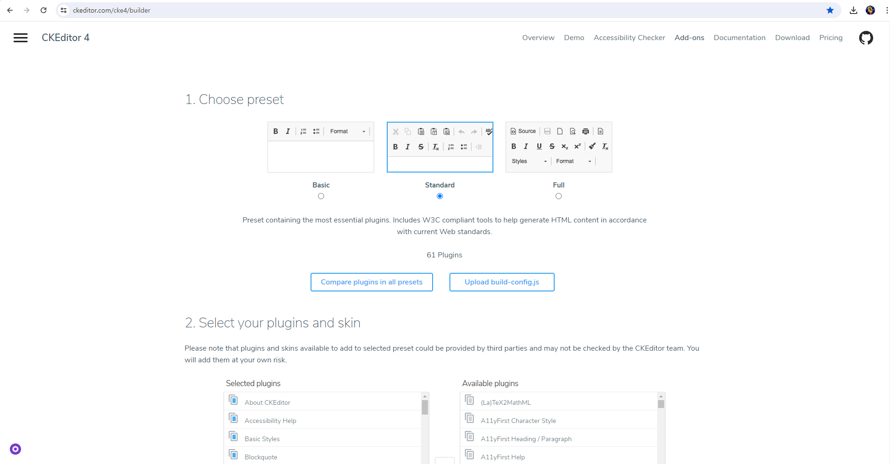

<br><br>

#### 14-4-1-2. 다운로드 및 현재 프로젝트에 내장

**1. 원하는 프리셋을 선택합니다.**

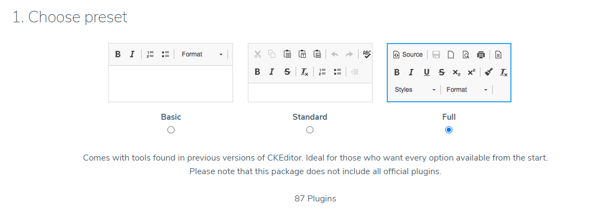

<br><br>

**2. 포함할 플러그인을 선택 및 추가합니다.**

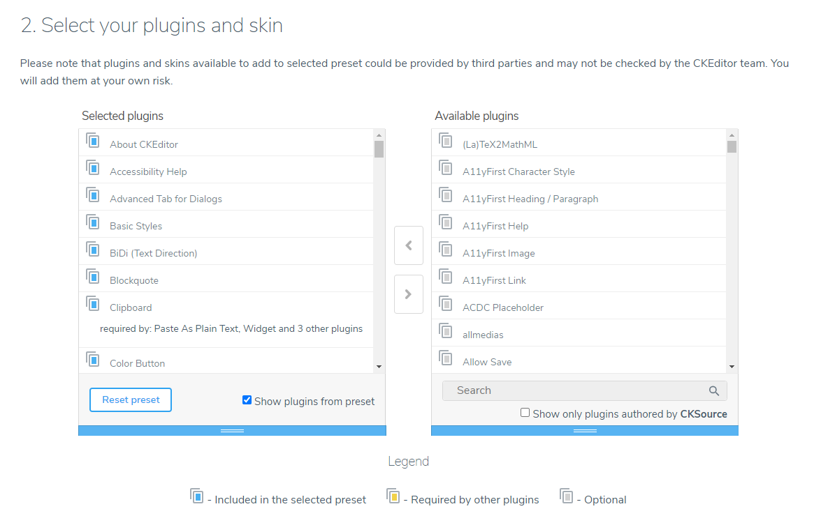

<br><br>

**3. 원하는 스킨을 선택합니다.**

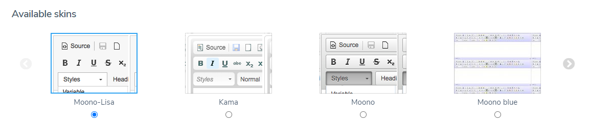

<br><br>

**4. 지원 가능한 언어들을 선택합니다.**

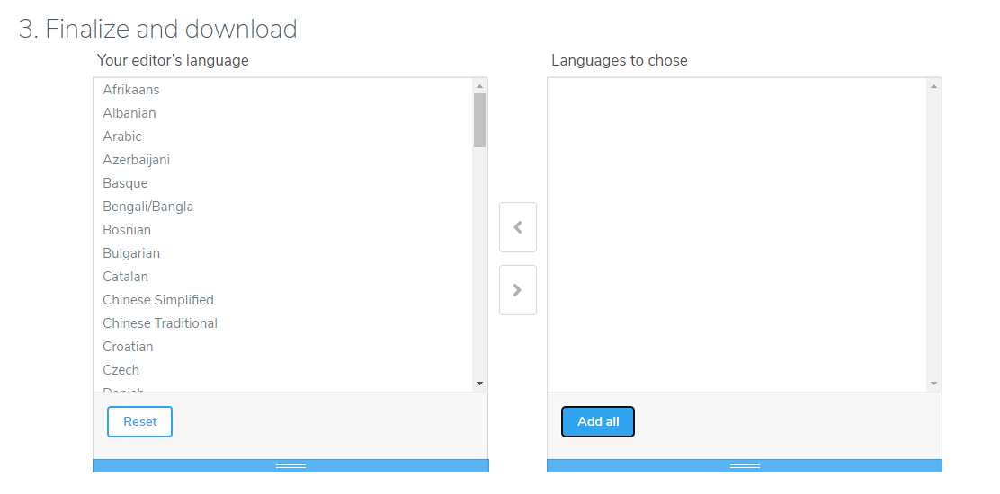

<br><br>

**5. 아래 그림과 같이 CkEditor를 다운로드합니다.**

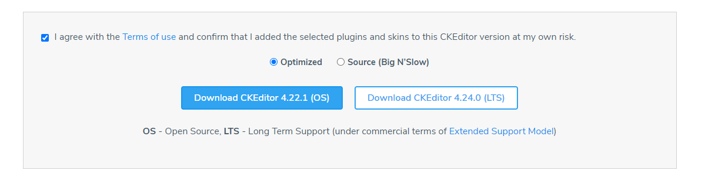

<br><br>

**6. 아래 그림과 같이 ckeditor-4.xx.xx_xxx.zip 압축파일에 대한 압축을 해제합니다.**

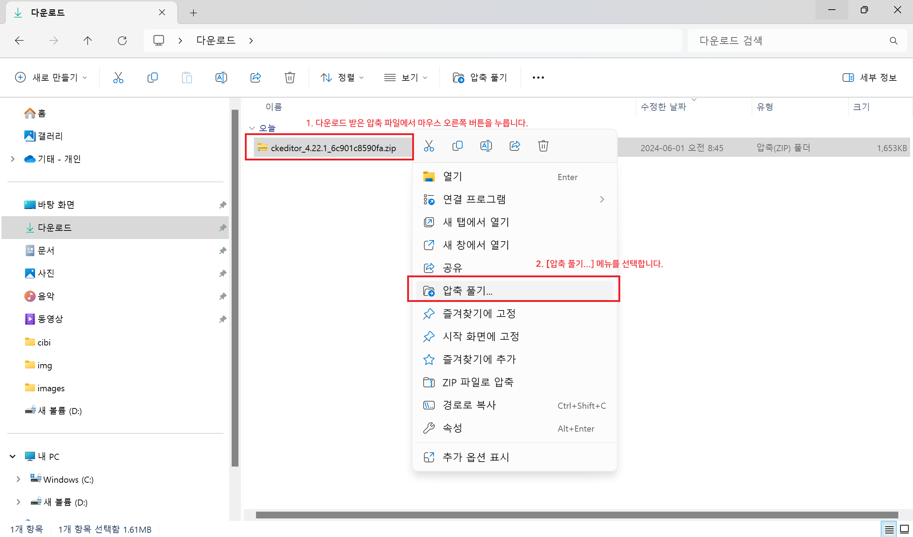

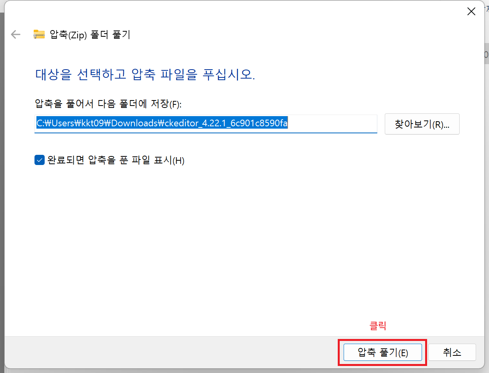

<br><br>

**7. 아래 그림과 같이 압축파일 해제된 ckeditor를 복사하기 하여 해당 프로젝트에 붙여넣기합니다.**

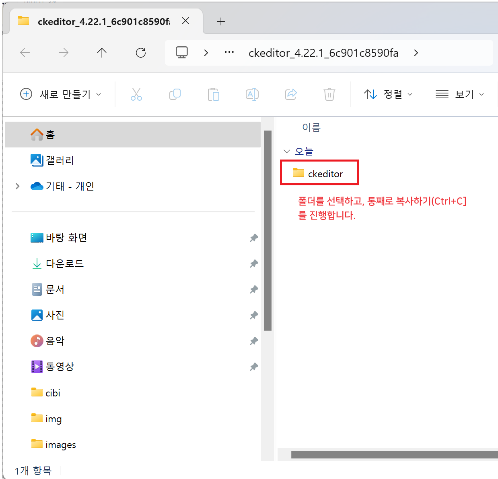

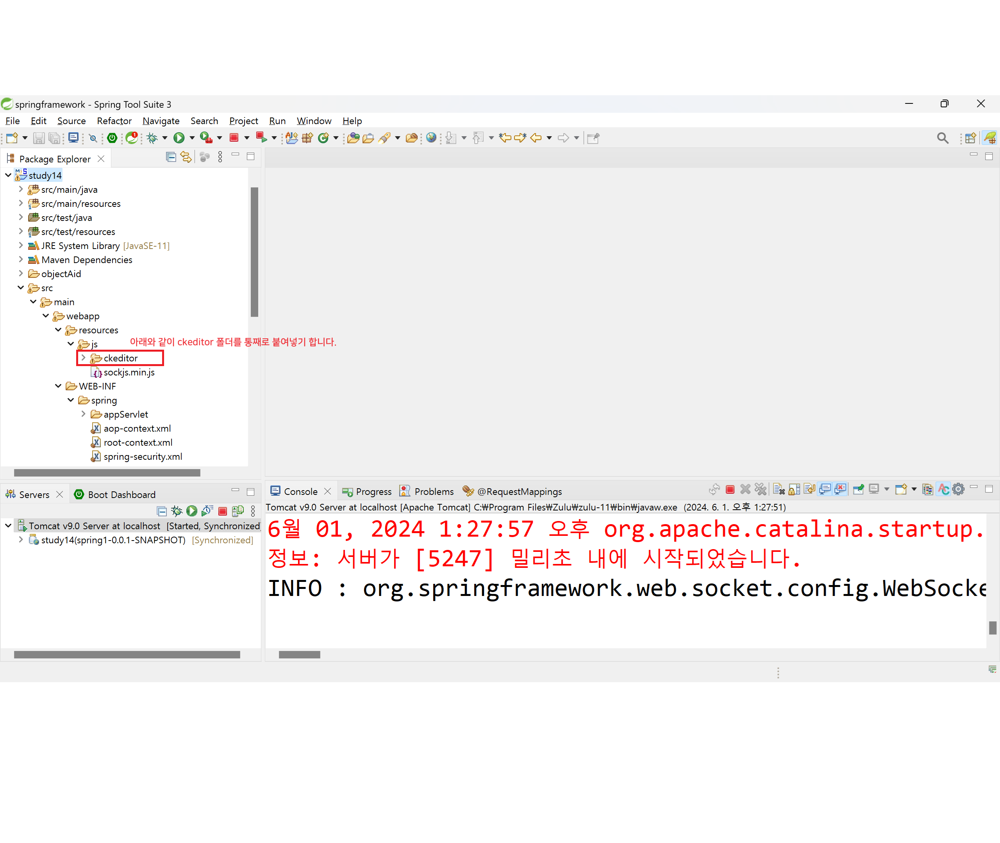


<br><br><br>

### 14-4-3. 테이블과 뷰 및 DTO 생성

**테이블 및 뷰 생성**

```sql
create table free(no int primary key,
title varchar(200), content varchar(1000),
hits int default 0, resdate timestamp default sysdate,
id varchar(20), name varchar(100));

create sequence free_seq increment by 1;

create view ckboard as (select f.no as no, f.title as title, f.content as content, f.hits as hits,
f.resdate, m.id as id, m.name as name from free f, custom m where f.id=m.id);

select * from ckboard;
```

<br><br>

**com.spring1.dto.Free 생성**

```java
package com.spring1.dto;

import lombok.AllArgsConstructor;
import lombok.Data;
import lombok.NoArgsConstructor;

@Data
@NoArgsConstructor
@AllArgsConstructor
public class Free {
	private int no;
	private String title;
	private String content;
	private int hits;
	private String resdate;
	private String id;
	private String name;
}
```


<br><br><br>

### 14-4-4. MyBatis Mapper 작성

**/src/main/resources/mappers/freeMapper.xml 작성**

```xml
<?xml version="1.0" encoding="UTF-8"?>
<!DOCTYPE mapper PUBLIC 
"-//mybatis.org//DTD Mapper 3.0//EN" 
"http://mybatis.org/dtd/mybatis-3-mapper.dtd">
<mapper namespace="free">

	<!-- 총 자유게시판 게시물 수 -->
	<select id="getTotalCount" resultType="int">
		select COUNT(*) from ckboard
	</select>

	<!-- 자유게시판 목록 조회 -->
	<select id="getFreeList" resultType="com.spring1.dto.Free">
        <![CDATA[
        SELECT *
        FROM (
            SELECT ROWNUM rnum, a.*
            FROM (
                SELECT * FROM ckboard ORDER BY no DESC
            ) a
            WHERE ROWNUM <= #{limit} + #{offset}
        )
        WHERE rnum > #{offset}
        ]]>
	</select>	
	
	<!-- 자유게시판 상세 보기 -->
	<select id="getFree" resultType="com.spring1.dto.Free">
		select * from ckboard where no = #{no}
	</select>
	
	    <!-- 자유게시판 글 등록 -->
    <insert id="insFree" parameterType="com.spring1.dto.Free">
        insert into free (no, title, content, hits, resdate, id, name)
        values (free_seq.NEXTVAL, #{title}, #{content}, default, default, #{id}, #{name})
    </insert>

    <!-- 자유게시판 글 변경 -->
    <update id="upFree" parameterType="com.spring1.dto.Free">
        update free set title=#{title}, content=#{content} where no=#{no}
    </update>

    <!-- 자유게시판 글 조회수 증가 -->
    <update id="hitCount">
        update free set hits=hits+1 where no=#{no}
    </update>

    <!-- 자유게시판 글 삭제 -->
    <delete id="delFree">
        delete from free where no=#{no}
    </delete>
</mapper>
```

<br><br><br>

### 14-4-5. Repository 작성

**com.spring1.dao.FreeDAO 작성**

```java
package com.spring1.dao;

import java.util.List;

import com.spring1.dto.Free;

public interface FreeDAO {
	public int getTotalCount();
	public List<Free> getFreeList(int offset, int limit);
	public Free getFree(int no);
	public void insFree(Free free);
	public void upFree(Free free);
	public void hitCount(int no);
	public void delFree(int no);
}
```

<br><br>

**com.spring1.dao.FreeDAOImpl 작성**

```java
package com.spring1.dao;

import java.util.List;

import org.apache.ibatis.session.RowBounds;
import org.apache.ibatis.session.SqlSession;
import org.springframework.beans.factory.annotation.Autowired;
import org.springframework.stereotype.Repository;

import com.spring1.dto.Free;

@Repository
public class FreeDAOImpl implements FreeDAO {

	@Autowired
	private SqlSession sqlSession;
	
	@Override
	public int getTotalCount() {
		return sqlSession.selectOne("free.getTotalCount");
	}

    @Override
    public List<Free> getFreeList(int offset, int limit) {
        return sqlSession.selectList("free.getFreeList", new RowBounds(offset, limit));
    }

	@Override
	public Free getFree(int no) {
		return sqlSession.selectOne("free.getFree", no);
	}

	@Override
	public void insFree(Free free) {
		sqlSession.insert("free.insFree", free);
	}

	@Override
	public void upFree(Free free) {
		sqlSession.update("free.upFree", free);
	}

	@Override
	public void hitCount(int no) {
		sqlSession.update("free.hitCount", no);		
	}

	@Override
	public void delFree(int no) {
		sqlSession.delete("free.delFree", no);
	}
}
```

<br><br><br>

### 14-4-6. Service 작성

**com.spring1.service.FreeService 작성**

```java
package com.spring1.service;

import java.util.List;

import com.spring1.dto.Free;

public interface FreeService {
	public int getTotalCount();
	public List<Free> getFreeList(int offset, int limit);
	public Free getFree(int no);
	public Free getNoCountFree(int no);
	public void insFree(Free free);
	public void upFree(Free free);
	public void hitCount(int no);
	public void delFree(int no);
}
```

<br><br>

**com.spring1.service.FreeServiceImpl 작성**

```java
package com.spring1.service;

import java.util.List;

import org.springframework.beans.factory.annotation.Autowired;
import org.springframework.stereotype.Service;
import org.springframework.transaction.annotation.Transactional;

import com.spring1.dao.FreeDAO;
import com.spring1.dto.Free;

@Service
public class FreeServiceImpl implements FreeService {

	@Autowired
	private FreeDAO freeDAO;
		
	
	@Override
	public int getTotalCount() {
		return freeDAO.getTotalCount();
	}

	@Override
	public List<Free> getFreeList(int offset, int limit) {
		return freeDAO.getFreeList(offset, limit);
	}

	@Override
	@Transactional
	public Free getFree(int no) {
		freeDAO.hitCount(no);
		return freeDAO.getFree(no);
	}

	@Override
	public Free getNoCountFree(int no) {
		return freeDAO.getFree(no);
	}

	@Override
	public void insFree(Free free) {
		freeDAO.insFree(free);		
	}

	@Override
	public void upFree(Free free) {
		freeDAO.upFree(free);		
	}

	@Override
	public void hitCount(int no) {
		freeDAO.hitCount(no);		
	}

	@Override
	public void delFree(int no) {
		freeDAO.delFree(no);		
	}	
}
```

<br><br><br>

### 14-4-7. Controller 작성

**com.spring1.controller.FreeController 작성**

```java
package com.spring1.controller;

import java.io.File;
import java.io.FileOutputStream;
import java.io.IOException;
import java.io.OutputStream;
import java.io.PrintWriter;
import java.util.List;
import java.util.UUID;

import javax.servlet.http.Cookie;
import javax.servlet.http.HttpServletRequest;
import javax.servlet.http.HttpServletResponse;
import javax.servlet.http.HttpSession;

import org.apache.maven.shared.utils.StringUtils;
import org.slf4j.Logger;
import org.slf4j.LoggerFactory;
import org.springframework.beans.factory.annotation.Autowired;
import org.springframework.stereotype.Controller;
import org.springframework.ui.Model;
import org.springframework.web.bind.annotation.GetMapping;
import org.springframework.web.bind.annotation.PostMapping;
import org.springframework.web.bind.annotation.RequestMapping;
import org.springframework.web.bind.annotation.RequestParam;
import org.springframework.web.bind.annotation.ResponseBody;
import org.springframework.web.multipart.MultipartFile;
import org.springframework.web.multipart.MultipartHttpServletRequest;

import com.google.gson.JsonObject;
import com.spring1.dto.Free;
import com.spring1.service.CustomService;
import com.spring1.service.FreeService;

@Controller
@RequestMapping("/free/")
public class FreeController {
	private static final Logger log = LoggerFactory.getLogger(FreeController.class);
	
	@Autowired
	private FreeService freeService;
	
	@Autowired
	private CustomService memberService;
	
	@Autowired
	private HttpSession session;
	
    @RequestMapping("list.do")
    public String getFreeList(Model model, @RequestParam(value="page", defaultValue="1") int page) {
        int limit = 10; // 한 페이지당 게시물 수
        int offset = (page - 1) * limit;

        int totalCount = freeService.getTotalCount();
        List<Free> list = freeService.getFreeList(offset, limit);

        int totalPage = (int)Math.ceil((double)totalCount / limit);

        model.addAttribute("list", list);
        model.addAttribute("currentPage", page);
        model.addAttribute("totalPage", totalPage);

        return "free/list";
    }
	
	@RequestMapping("detail.do")
	public String getFree(@RequestParam("no") int no, HttpServletRequest req, HttpServletResponse res, Model model) {
		
		String id = (String) session.getAttribute("sid");
		
		Cookie viewCookie = null;
		Cookie[] cookies = req.getCookies();
		
		if(cookies !=null) {
			for (int i = 0; i < cookies.length; i++) {
				if(cookies[i].getName().equals("|"+id+"free"+no+"|")) {
					log.info("쿠키 이름 : "+cookies[i].getName());
					viewCookie=cookies[i];
				}	
			}
		} else {
			log.info("아직 방문한 적이 없습니다.");
		}
		
		if(viewCookie==null) {
            try {
            	//쿠키 생성
				Cookie newCookie=new Cookie("|"+id+"free"+no+"|","readCount");
				res.addCookie(newCookie);
                //쿠키가 없으니 증가 로직 진행
				model.addAttribute("free", freeService.getFree(no));	
			} catch (Exception e) {
				log.info("쿠키 확인 불가 : "+e.getMessage());
				e.getStackTrace();
			}
        //만들어진 쿠키가 있으면 증가로직 진행하지 않음
		} else {
			model.addAttribute("free", freeService.getNoCountFree(no));
			log.info("viewCookie 확인 로직 : 쿠키 있음");
			String value=viewCookie.getValue();
			log.info("viewCookie 확인 로직 : 쿠키 value : "+value);
		}
		
		return "free/get";
	}

	@GetMapping("insert.do")
	public String insFree(Free Free, Model model) {
		return "free/insert";
	}
	
	@PostMapping("insertPro.do")
	public String insFreePro(Free free, HttpSession session, Model model) {
		String id = (String) session.getAttribute("sid");
		String name = (String) session.getAttribute("sname");
		free.setId(id);
		free.setName(name);
		freeService.insFree(free);
		return "redirect:list.do";
	}

	@GetMapping("update.do")
	public String upFree(@RequestParam("no") int no, HttpServletRequest req, HttpServletResponse res,Model model) {
		
		String id = (String) session.getAttribute("sid");
		
		Cookie viewCookie = null;
		Cookie[] cookies = req.getCookies();
		
		if(cookies !=null) {
			for (int i = 0; i < cookies.length; i++) {
				if(cookies[i].getName().equals("|"+id+"free"+no+"|")) {
					log.info("쿠키 이름 : "+cookies[i].getName());
					viewCookie=cookies[i];
				}	
			}
		} else {
			log.info("아직 방문한 적이 없습니다.");
		}
		
		if(viewCookie==null) {
            try {
            	//쿠키 생성
				Cookie newCookie=new Cookie("|"+id+"free"+no+"|","readCount");
				res.addCookie(newCookie);
                //쿠키가 없으니 증가 로직 진행
				model.addAttribute("free", freeService.getFree(no));	
			} catch (Exception e) {
				log.info("쿠키 확인 불가 : "+e.getMessage());
				e.getStackTrace();
			}
        //만들어진 쿠키가 있으면 증가로직 진행하지 않음
		} else {
			model.addAttribute("free", freeService.getNoCountFree(no));
			log.info("viewCookie 확인 로직 : 쿠키 있음");
			String value=viewCookie.getValue();
			log.info("viewCookie 확인 로직 : 쿠키 value : "+value);
		}
		
		return "free/edit";
	}
	
	@PostMapping("updatePro.do")
	public String upFreePro(Free free, Model model) {
		freeService.upFree(free);
		return "redirect:list.do";
	}
	
	@GetMapping("delFree.do")
	public String delFree(@RequestParam("no") int no, Model model) {
		freeService.delFree(no);
		return "redirect:list.do";
	}
	
	@PostMapping("fileupload.do") 
	@ResponseBody
	public String fileUpload(HttpServletRequest req, HttpServletResponse resp, 
            MultipartHttpServletRequest multiFile) throws Exception {
		JsonObject json = new JsonObject();
		PrintWriter printWriter = null;
		OutputStream out = null;
		MultipartFile file = multiFile.getFile("upload");
		if(file != null){
			if(file.getSize() > 0 && StringUtils.isNotBlank(file.getName())){
				if(file.getContentType().toLowerCase().startsWith("images/")){
					try{
						String fileName = file.getName();
						byte[] bytes = file.getBytes();
						String uploadPath = req.getServletContext().getRealPath("/img");
						File uploadFile = new File(uploadPath);
						if(!uploadFile.exists()){
							uploadFile.mkdirs();
						}
						fileName = UUID.randomUUID().toString();
						uploadPath = uploadPath + "/" + fileName;
						out = new FileOutputStream(new File(uploadPath));
	                   out.write(bytes);
	                   
	                   printWriter = resp.getWriter();
	                   resp.setContentType("text/html");
	                   String fileUrl = req.getContextPath() + "/images/" + fileName;
	                   
	                   // json 데이터로 등록
	                   // {"uploaded" : 1, "fileName" : "test.jpg", "url" : "/images/test.jpg"}
	                   // 이런 형태로 리턴이 나가야함.
	                   json.addProperty("uploaded", 1);
	                   json.addProperty("fileName", fileName);
	                   json.addProperty("url", fileUrl);
	                   
	                   printWriter.println(json);
	               }catch(IOException e){
	                   e.printStackTrace();
	               }finally{
	                   if(out != null){
	                       out.close();
	                   }
	                   if(printWriter != null){
	                       printWriter.close();
	                   }		
					}
				}
			}
		}
		return null;
	}
}
```

<br><br><br>

### 14-4-8. View(jsp) 작성

**src/main/webapp/WEB-INF/views/home.jsp 수정**

```java
<%@ page language="java" contentType="text/html; charset=UTF-8"
    pageEncoding="UTF-8"%>
<%@ taglib uri="http://java.sun.com/jsp/jstl/core" prefix="c" %>
<%@ taglib prefix="c" uri="http://java.sun.com/jsp/jstl/core"  %>
<%@ taglib prefix="fmt" uri="http://java.sun.com/jsp/jstl/fmt" %>
<%@ taglib prefix="fn" uri = "http://java.sun.com/jsp/jstl/functions"%>
<c:set var="path2" value="${pageContext.request.contextPath }" />
<!DOCTYPE html>
<html>
<head>
<meta charset="UTF-8">
<title>메인 페이지</title>
</head>
<body>
	<h2>${serverTime }</h2>
	<h2>${author }</h2>
	<h2>${company }</h2>
	<p>${msg }</p>	
	<hr>
	<ul>
		<li><a href="${path2 }/custom/login.do">로그인</a></li>
		<li><a href="${path2 }/fileupload/main">파일 업로드 실습</a></li>
		<li><a href="${path2 }/email/main">이메일 보내기 실습</a></li>
		<li><a href="${path2 }/free/list.do">CKEditor를 활용한 자유게시판 실습</a></li>
	</ul>
</body>
</html>
```

<br><br>

**src/main/webapp/WEB-INF/views/free/list.jsp 작성**

```java
<%@ page language="java" contentType="text/html; charset=UTF-8" pageEncoding="UTF-8"%>
<%@ taglib uri="http://java.sun.com/jsp/jstl/core" prefix="c" %>
<%@ taglib uri="http://java.sun.com/jsp/jstl/fmt" prefix="fmt" %>
<%@ taglib uri="http://java.sun.com/jsp/jstl/functions" prefix="fn" %>
<c:set var="path2" value="${pageContext.servletContext.contextPath }" />
<!DOCTYPE html>
<html lang="ko">
<head>
    <meta charset="UTF-8">
    <meta http-equiv="X-UA-Compatible" content="IE=edge">
    <meta name="viewport" content="width=device-width, initial-scale=1.0">
    <title>자유게시판 목록</title>
    <script src="https://code.jquery.com/jquery-latest.js"></script>
</head>
<body>
<div class="full-wrap">
    <main id="contents" class="contents">
        <div id="breadcrumb" class="container breadcrumb-wrap clr-fix" style="height:60px; line-height:60px;">
            <nav class="breadcrumb" aria-label="breadcrumbs">
                <ul>
                    <li><a href="${path2}">Home</a></li>
                    <li><a href="${path2}/free/list.do">Notice</a></li>
                    <li class="is-active"><a href="#" aria-current="page">List</a></li>
                </ul>
            </nav>
        </div>
        <section class="page" id="page1">
            <h2 class="page-title">자유게시판 목록</h2>
            <div class="page-wrap">
                <div class="clr-fix">
                    <br>
                    <table class="table" id="tb1">
                        <thead>
                            <tr>
                                <th class="item1">번호</th>
                                <th class="item2">제목</th>
                                <th class="item3">작성일</th>
                                <th class="item4">조회수</th>
                            </tr>
                        </thead>
                        <tbody>
                            <c:if test="${not empty list}">
                                <c:forEach var="dto" items="${list}">
                                    <tr>
                                        <td>${dto.no}</td>
                                        <td>
                                            <c:if test="${empty cus}">
                                                <strong>${dto.title}</strong>
                                            </c:if>
                                            <c:if test="${not empty cus}">
                                                <a href="${path2}/free/detail.do?no=${dto.no}">${dto.title}</a>
                                            </c:if>
                                        </td>
                                        <td>${dto.resdate}</td>
                                        <td>${dto.hits}</td>
                                    </tr>
                                </c:forEach>
                            </c:if>
                            <c:if test="${empty list}">
                                <tr>
                                    <td colspan="4"><strong>자유게시판 글이 존재하지 않습니다.</strong></td>
                                </tr>
                            </c:if>
                        </tbody>
                    </table>
                    <hr>
                    <c:if test="${not empty cus.id}">
                        <div class="buttons">
                            <a href="${path2}/free/insert.do" class="button is-danger">글 등록</a>
                        </div>
                    </c:if>
                    <div class="pagination">
                        <c:forEach var="i" begin="1" end="${totalPage}">
                            <a href="${path2}/free/list.do?page=${i}"
                               class="${currentPage == i ? 'active' : ''}">${i}</a>
                        </c:forEach>
                    </div>
                </div>
            </div>
        </section>
    </main>
    <script>
    $(document).ready(function(){
        $("#tb1_length, #tb1_filter").css("margin-bottom", "20px");
    });
    </script>
</div>
</body>
</html>
```

<br><br>

**src/main/webapp/WEB-INF/views/free/insert.jsp 작성**

```java
<%@ page language="java" contentType="text/html; charset=UTF-8" pageEncoding="UTF-8"%>
<%@ taglib uri="http://java.sun.com/jsp/jstl/core" prefix="c" %>
<%@ taglib uri="http://java.sun.com/jsp/jstl/fmt" prefix="fmt" %>
<%@ taglib uri="http://java.sun.com/jsp/jstl/functions" prefix="fn" %>
<c:set var="path2" value="${pageContext.servletContext.contextPath }" />
<!DOCTYPE html>
<html lang="ko">
<head>
    <meta charset="UTF-8">
    <meta http-equiv="X-UA-Compatible" content="IE=edge">
    <meta name="viewport" content="width=device-width, initial-scale=1.0">
	<title>자유게시판 글 등록</title>
	<script src="https://code.jquery.com/jquery-latest.js"></script>
	<script src="${path2}/resources/js/ckeditor/ckeditor.js"></script>
</head>
<body>
<div class="full-wrap">
    <main id="contents" class="contents">
    	<div id="breadcrumb" class="container breadcrumb-wrap clr-fix" style="height:60px; line-height:60px;">
	    	<nav class="breadcrumb" aria-label="breadcrumbs">
			  <ul>
			    <li><a href="${path2 }">Home</a></li>
			    <li><a href="${path2 }/free/list.do">자유게시판</a></li>
			    <li class="is-active"><a href="#" aria-current="page">글 등록</a></li>
			  </ul>
			</nav>
    	</div>
 	    <section class="page" id="page1">
    		<h2 class="page-title">자유게시판 글 등록</h2>
    		<div class="page-wrap">
	    		<div class="clr-fix">
	    			<br>
					<form action="${path2 }/free/insertPro.do" method="post">
						<table class="table">
							<tbody>
								<tr>
									<th><label for="title">제목</label></th>
									<td>
										<input type="text" name="title" id="title" class="input" maxlength="100" required>
									</td>
								</tr>
								<tr>
									<th><label for="content">내용</label></th>
									<td>
										<textarea name="content" id="content" rows="8" cols="80" class="textarea"></textarea>
									</td>
								</tr>
							</tbody>
						</table>
						<hr>
						<div class="buttons">
						  <button type="submit" class="button is-danger">글 등록</button>
						  <a href="${path2 }/free/list.do" class="button is-primary">글 목록</a>
						</div>
					</form>
					<script>
					$(function(){
						CKEDITOR.replace('content', {
							filebrowserUploadUrl : '${path2}/free/fileupload.do'
						});
					});
					</script>
				</div>
    		</div>
    	</section>
    </main>
    <script>
    $(document).ready(function(){
    	$("#tb1_length, #tb1_filter").css("margin-bottom", "20px");
    });
    </script>
</div>    
</body>
</html>
```

<br><br>

**src/main/webapp/WEB-INF/views/free/get.jsp 작성**

```java
<%@ page language="java" contentType="text/html; charset=UTF-8" pageEncoding="UTF-8"%>
<%@ taglib uri="http://java.sun.com/jsp/jstl/core" prefix="c" %>
<%@ taglib uri="http://java.sun.com/jsp/jstl/fmt" prefix="fmt" %>
<%@ taglib uri="http://java.sun.com/jsp/jstl/functions" prefix="fn" %>
<c:set var="path2" value="${pageContext.servletContext.contextPath }" />
<!DOCTYPE html>
<html lang="ko">
<head>
    <meta charset="UTF-8">
    <meta http-equiv="X-UA-Compatible" content="IE=edge">
    <meta name="viewport" content="width=device-width, initial-scale=1.0">
	<title>자유게시판 상세보기</title>
	<script src="https://code.jquery.com/jquery-latest.js"></script>
	<script src="${path2}/resources/js/ckeditor/ckeditor.js"></script>
</head>
<body>
<div class="full-wrap">
    <main id="contents" class="contents">
       	<div id="breadcrumb" class="container breadcrumb-wrap clr-fix" style="height:60px; line-height:60px;">
	    	<nav class="breadcrumb" aria-label="breadcrumbs">
			  <ul>
			    <li><a href="${path2 }">Home</a></li>
			    <li><a href="${path2 }/free/list.do">자유게시판</a></li>
			    <li class="is-active"><a href="#" aria-current="page">상세보기</a></li>
			  </ul>
			</nav>
    	</div>
 	    <section class="page" id="page1">
    		<h2 class="page-title">자유게시판 글 상세보기</h2>
    		<div class="page-wrap">
 				<div class="clr-fix">
					<table id="tb1" class="table" width="1200">
						<tbody>
							<tr>
								<th>글 번호</th>
								<td>${free.no }</td>
							</tr>
							<tr>
								<th>글 제목</th>
								<td>${free.title }</td>
							</tr>
							<tr>
								<th>글 내용</th>
								<td>${free.content }</td>
							</tr>
							<tr>
								<th>작성일시</th>		
								<td>${free.resdate }</td>
							</tr>
							<tr>
								<th>조회수</th>
								<td>${free.hits }</td>
							</tr>
							<tr>
								<th>작성자</th>
								<td>${free.id } / ${free.name }</td>
							</tr>
						</tbody>
					</table>
					<hr>
					<div class="buttons">
					  <c:if test="${not empty cus.id }">
					  <a href="${path2 }/free/insert.do" class="button is-danger">글 등록</a>
					  </c:if>
					  <c:if test="${cus.id.equals('admin') or cus.id.equals(free.id)}">    
					  <a href="${path2 }/free/update.do?no=${free.no }" class="button is-warning">글 수정</a>
					  <a href="${path2 }/free/delFree.do?no=${free.no }" class="button is-danger is-dark">글 삭제</a>
					  </c:if>
					  <a href="${path2 }/free/list.do" class="button is-primary">글 목록</a>
					</div>
				</div>
    		</div>
    	</section>
    </main>
    <script>
    $(document).ready(function(){
    	$("#tb1_length, #tb1_filter").css("margin-bottom", "20px");
    });
    </script>
</div>    
</body>
</html>
```

<br><br>

**src/main/webapp/WEB-INF/views/free/edit.jsp 작성**

```java
<%@ page language="java" contentType="text/html; charset=UTF-8" pageEncoding="UTF-8"%>
<%@ taglib uri="http://java.sun.com/jsp/jstl/core" prefix="c" %>
<%@ taglib uri="http://java.sun.com/jsp/jstl/fmt" prefix="fmt" %>
<%@ taglib uri="http://java.sun.com/jsp/jstl/functions" prefix="fn" %>
<c:set var="path2" value="${pageContext.servletContext.contextPath }" />
<!DOCTYPE html>
<html lang="ko">
<head>
    <meta charset="UTF-8">
    <meta http-equiv="X-UA-Compatible" content="IE=edge">
    <meta name="viewport" content="width=device-width, initial-scale=1.0">
	<title>자유게시판 글 수정</title>
	<script src="https://code.jquery.com/jquery-latest.js"></script>
	<script src="${path2}/resources/js/ckeditor/ckeditor.js"></script>
</head>
<body>
<div class="full-wrap">
    <main id="contents" class="contents">
    	<div id="breadcrumb" class="container breadcrumb-wrap clr-fix" style="height:60px; line-height:60px;">
	    	<nav class="breadcrumb" aria-label="breadcrumbs">
			  <ul>
			    <li><a href="${path2 }">Home</a></li>
			    <li><a href="${path2 }/free/list.do">자유게시판</a></li>
			    <li class="is-active"><a href="#" aria-current="page">수정</a></li>
			  </ul>
			</nav>
    	</div>
 	    <section class="page" id="page1">
    		<h2 class="page-title">자유게시판 글 수정</h2>
    		<div class="page-wrap">
	    		<div class="clr-fix">
	    			<br>
					<form action="${path2 }/free/updatePro.do" method="post">
						<table class="table">
							<tbody>
								<tr>
									<th><label for="no">글 번호</label></th>
									<td>
										<input type="text" name="no" id="no" class="input" value="${free.no }" readonly>
									</td>
								</tr>
								<tr>
									<th><label for="title">제목</label></th>
									<td>
										<input type="text" name="title" id="title" class="input" maxlength="100" value="${free.title }" required>
									</td>
								</tr>
								<tr>
									<th><label for="content">내용</label></th>
									<td>
										<textarea name="content" id="content" rows="8" cols="80" class="textarea">${free.content }</textarea>
									</td>
								</tr>
								<tr>
									<th><label for="resdate">작성 일시</label></th>
									<td>
										<input type="text" name="resdate" id="resdate" class="input" value="${free.resdate }" disabled>
									</td>
								</tr>
								<tr>
									<th><label for="visited">읽은 횟수</label></th>
									<td>
										<input type="text" name="visited" id="visited" class="input" value="${free.hits }" disabled>
									</td>
								</tr>
							</tbody>
						</table>
						<hr>
						<div class="buttons">
						  <button type="submit" class="button is-danger">글 수정</button>
						  <a href="${path2 }/free/list.do" class="button is-primary">글 목록</a>
						  <a href="${path2 }/free/detail.do?no=${free.no} " class="button is-success">글 상세보기</a>
						</div>
					</form>
					<script>
					$(function(){
						CKEDITOR.replace('content', {
							filebrowserUploadUrl : '${path2}/free/fileupload.do'
						});
					});
					</script>
				</div>
    		</div>
    	</section>
    </main>
    <script>
    $(document).ready(function(){
    	$("#tb1_length, #tb1_filter").css("margin-bottom", "20px");
    });
    </script>
</div>    
</body>
</html>
```

<br><br><hr><br><br>

<div id="14-5"></div>

## 14-5. 결제 Api 구현

### 14-5-1. 결제 요청 파라미터

| 요청 파라미터 | 설명 |
|------------------------------------|---------------------------------------------|
| pg string | pg사 코드 |
| pay_method string | 결제수단 구분코드 |
| escrow boolean | 에스크로 결제창 활성화 여부로서 일부 PG사만 지원됩니다. |
| escrowProducts array | 에스크로 결제 정보 <br> 에스크로 결제(escrow: true)시에만 유효하고, 필수 값은 아닙니다. | 
| id string | 상품 고유 ID |
| name string | 상품명 |
| code string | 상품 코드 |
| unitPrice number | 상품 단위 가격 |
| quantity number | 수량 |
| merchant_uid string | 고객사 주문번호 <br> 주문번호는 매 결제 요청시 고유하게 채번 되어야 합니다. <br> 40Byte 이내로 작성해주세요 <br> 결제 승인완료 처리된 주문번호를 동일하게 재 설정시 사전거절 처리 됩니다. |
| name string | 결제대상 제품명 <br> 16byte 이내로 작성해주세요 |
| amount number | 결제금액 <br> 숫자타입으로 지정해야 하는점 유의하세요 |
| custom_data object | 사용자 정의 데이터 <br> 결제 응답시 echo 로 받아보실수 있는 필드 입니다. <br> JSON notation(string)으로 저장됩니다. <br> 주문 건에 대해 부가정보를 저장할 공간이 필요할 때 사용합니다. |
| tax_free number | 면세금액 <br> 결제 금액 중 면세금액에 해당하는 금액을 입력합니다. |
| vat_amount: number | 부가세 <br> 결제 금액 중 부가세(기본값: null) <br> 지원되는 PG사 : 나이스페이먼츠, (신) 토스페이 |
| currency string | 결제통화 구분코드 <br> PayPal은 원화(KRW) 미 지원으로 USD가 기본 <br> PayPal에서 지원하는 통화는 PayPal 지원 통화 참조 <br> 결제통화 구분코드 : KRW, USD, EUR, JPY <br> PayPal은 원화(KRW) 미 지원으로 USD가 기본 <br> PayPal에서 지원하는 통화는 PayPal 지원 통화 참조 |
| language string | 결제창 언어 설정 (지원되지 않은 일부 PG사 존재) <br> en (영어), ko (한국어), zh (중국어) |
| buyer_name string | 주문자명 |
| buyer_tel string | 주문자 연락처 <br> 일부 PG사에서 해당 필드 누락시 오류 발생 |
| buyer_email string | 주문자 이메일 <br> 일부 PG사에서 해당 필드 누락시 오류 발생(페이먼트월) |
| buyer_addr string | 주문자 주소 |
| buyer_postcode string | 주문자 우편번호 |
| confirm_url string | confirm_process 사용 시 고객사 endpoint url 설정 <br> 기술지원 메일로 별도 요청이 필요합니다. (support@portone.io) |
| notice_url string | 웹훅(Webhook) 수신 주소 <br> 포트원 관리자 콘솔에 설정한 웹훅 주소대신 사용할 웹훅 주소를 결제시마다 설정할 수 있습니다. <br> 해당 값 설정시 관리자 콘솔에 설정한 주소로는 웹훅발송이 되지 않는점 유의하시기 바랍니다. |
| customer_uid string | 고객사 정의 빌링키 <br> 비인증 결제 이용시 빌링키와 1:1로 맵핑되는 고객사 정의 고객 빌링키입니다. <br> 
| digital boolean | 디지털 구분자 <br> 휴대폰 결제수단인 경우 필수 항목입니다. <br> 결제제품이 실물이 아닌 경우 true 로 설정합니다. <br>
실물/디지털 여부에 따라 수수료율이 상이하게 측정되니 유의하시기 바랍니다. |
| vbank_due string | 가상계좌 입금기한 <br> 결제수단이 가상계좌인 경우 입금기한을 설정할 수 있습니다. <br> 다음과 같은 형식으로 설정이 가능합니다. <br> YYYY-MM-DD, YYYYMMDD, YYYY-MM-DD HH:mm:ss, YYYYMMDDHHmmss |
| m_redirect_url string | 결제완료이후 이동될 EndPoint URL 주소 <br> 결제창이 새로운 창으로 리다이렉트 되어 결제가 진행되는 결제 방식인 경우 필수 설정 항목 입니다. <br> 대부분의 모바일 결제환경에서 결제창 호출시 필수 항목입니다. <br> 리다이렉트 환경에서 해당 필드 누락시 결제 결과를 수신 받지 못합니다. |
| app_scheme string | 모바일 앱 결제중 고객사 앱복귀를 위한 URL scheme <br> WebView 환경 결제시 필수설정 항목 입니다. <br> ISP/앱카드 앱에서 결제정보인증 후 기존 앱으로 복귀할 때 사용합니다. |
| biz_num string | 사업자등록번호 |

<br><br>

**다날-가상계좌 결제수단 사용시 필수 항목**

```javascript
{
  "display": {
    "card_quota": [6] // 할부개월 6개월까지만 활성화
  }
}
```

```
파라미터 설명 : card_quota :

[]: 일시불만 결제 가능
2,3,4,5,6: 일시불을 포함한 2, 3, 4, 5, 6개월까지 할부개월 선택 가능
할부결제는 5만원 이상 결제 요청시에만 이용 가능합니다.
```

<br>

- 할부개월수 3개월까지 활성화 예제

```javascript
const param = {
  //....중략.......
  card: {
    direct: {
      code: "367",
      quota: 3,
    },
  },
};
```

```
파라미터 설명

code : 카드사 금융결제원 표준 코드. 링크 참조 (string)
quota : 할부 개월 수. 일시불일 시 0 으로 지정. (integer)
```

<br><br>

**주의사항**

현재 KG이니시스, KCP, 토스페이먼츠, 나이스페이먼츠, KICC, 다날 6개 PG사에 대해서만 카드사 결제창 direct 호출이 가능합니다.
일부 PG사의 경우, 모든 상점아이디에 대하여 카드사 결제창 direct 노출 기능을 지원하지 않습니다. 반드시 포트원을 통해 현재 사용중인 상점아이디가 카드사 결제창 direct 호출이 가능하도록 설정이 되어있는지 PG사에 확인이 필요합니다.
\ 현대카드 결제모듈 바로 호출 예제

```javascript
{
  "card": {
    "detail": [
      { "card_code": "*", "enabled": false }, //모든 카드사 비활성화
      { "card_code": "366", "enabled": true } //특정 카드만 활성화
    ]
  }
}
```

```
파라미터 설명

card_code : 금결원 카드사코드 링크 참조 (string)
enabled : 해당카드 활성화 여부 (boolean)
신한카드만 결제창 노출 처리 예제
```


<br><br><br>

### 14-5-2. 결제 응답 파라미터


| 응답 파라미터 | 설명 |
|------------------------------------|---------------------------------------------|
| success boolean | 결제 성공여부 <br> 결제승인 혹은 가상계좌 발급이 성공한 경우, True <br> (PG사/결제수단에 따라 imp_success로 반환됨) |
| error_code string | 결제 실패코드 <br> 결제가 실패하는 경우 PG사 원천코드가 내려갑니다. |
| error_msg string | 결제 실패메세지 <br> 결제가 실패하는 경우 PG사 원천메세지가 내려갑니다. |
| imp_uid string | 포트원 고유 결제번호 <br> success가 false이고 사전 validation에 실패한 경우, imp_uid는 null일 수 있음 |
| merchant_uid string | 주문번호 |
| pay_method string | 결제수단 구분코드 |
| paid_amount number | 결제금액 |
| status string | 결제상태 <br> ready(브라우저 창 이탈, 가상계좌 발급 완료 등 미결제 상태) <br> paid(결제완료) <br> failed(신용카드 한도 초과, 체크카드 잔액 부족, 브라우저 창 종료 또는 취소 버튼 클릭 등 결제실패 상태) |
| name string | 주문자명 |
| pg_provider string | PG사 구분코드 |
| emb_pg_provider string | 간편결제 구분코드 <br> 결제창에서 간편결제 호출시 결제 승인된 PG사 구분코드 <br>  일부 PG사 또는 간편결제로 결제가 발생되지 않은 경우 해당 파라미터는 생략됩니다. |
| pg_tid string | PG사 거래번호 <br> PG사에서 거래당 고유하게 부여하는 거래번호입니다. |
| buyer_name string | 주문자명 |
| buyer_email string | 주문자 Email |
| buyer_tel string | 주문자 연락처 |
| buyer_addr string | 주문자 주소 |
| buyer_postcode string | 주문자 우편번호 |
| custom_data string | 고객사 임의 지정 데이터 |
| paid_at string | 결제승인시각 (UNIX timestamp) |
| receipt_url string | 거래 매출전표 URL |
| apply_num string | 신용카드 승인번호 <br> 신용카드 결제수단에 한하여 제공 |
| vbank_num string | 가상계좌 입금 계좌번호 <br> PG사로부터 전달된 정보 그대로 제공에 따라 숫자 외 dash(-) 또는 기타 기호가 포함되어 있을 수 있음 |
| vbank_name string | 가상계좌 입금은행 명 |
| vbank_holder string | 가상계좌 예금주 <br> 계약된 사업자명으로 표시됨, 단, 일부 PG사의 경우 null 을 반환하므로 자체 처리 필요 |
| vbank_date string | 가상계좌 입금기한 (UNIX timestamp) |

<br><br>

**결제 응답 샘플**

```javascript
{
  "apply_num": "42827474",
  "bank_name": null,
  "buyer_addr": "서울특별시 강남구 삼성동",
  "buyer_email": "test@portone.io",
  "buyer_name": "포트원 기술지원팀",
  "buyer_postcode": "123-456",
  "buyer_tel": "010-1234-5678",
  "card_name": "신한카드",
  "card_number": "5428790000000294",
  "card_quota": 0,
  "currency": "KRW",
  "custom_data": null,
  "imp_uid": "imp_347242536261",
  "merchant_uid": "57008833-33004",
  "name": "당근 10kg",
  "paid_amount": 1004,
  "paid_at": 1648344363,
  "pay_method": "card",
  "pg_provider": "kcp",
  "pg_tid": "22336466628585",
  "pg_type": "payment",
  "receipt_url": "https://admin8.kcp.co.kr/assist/bill.BillActionNew.do?cmd=card_bill&tno=22336466628585&order_no=imp_347242536261&trade_mony=1004",
  "status": "paid",
  "success": true
}
```

<br><br><br>

### 14-5-3. PG사 코드와 결제수단 코드

#### 14-5-3-1. pg사 코드

| PG사 코드 | 설명 |
|-----------------------|-------------------------------------------------------|
| danal | 다날 휴대폰소액결제 및 휴대폰 본인인증 |
| danal_tpay | 다날 결제창 일반/정기결제 |
| daou | 키움페이 결제창 일반결제 및 API 수기/정기결제 |
| html5_inicis | 이니시스 결제창 일반/정기결제 |
| inicis_unified | 이니시스 통합인증 |
| inicis | 이니시스 API 수기/정기결제 및 신용카드 본인인증 |
| kcp | NHN KCP 결제창 일반/수기결제 및 API 수기/정기결제 |
| kcp_billing | NHN KCP 결제창 정기결제 |
| kicc | 이지페이(한국정보통신) 결제창 일반/정기결제 |
| ksnet | KSNET 결제창 일반결제 및 API 수기/정기결제 |
| mobilians | 모빌리언스 결제창 일반/정기결제 |
| nice | 나이스페이먼츠(구모듈) 결제창 일반결제 및 API 수기/정기결제 |
| nice_v2 | 나이스페이(신모듈) 결제창 일반결제 및 API 수기/정기결제 |
| settle | 헥토파이낸셜 결제창 일반결제 및 API 수기/정기결제 |
| settle_acc | 헥토파이낸셜 내통장결제 |
| smartro | 스마트로(구모듈) 결제창 일반결제 |
| smartro_v2 | 스마트로(신모듈) 결제창 일반/정기결제 및 API 수기/정기결제 |
| tosspayments | 토스페이먼츠(신모듈) 결제창 일반/수기/정기결제 및 API 일반/수기/정기결제 |
| toss_brandpay | 토스페이먼츠 브랜드페이 |
| uplus | 토스페이먼츠(구모듈) 결제창 일반결제 |
| welcome | 웰컴페이먼츠 결제창 일반/정기결제 및 API 일반/정기결제 |
| tosspay | 간편 결제 지원 토스페이 일반결제 |
| tosspay_v2 | 간편 결제 지원 토스페이 일반/정기결제 |
| payco | 간편 결제 지원 페이코 일반/정기결제 |
| kakaopay | 간편 결제 지원 카카오페이 일반/정기결제 |
| naverpay | 간편 결제 지원 네이버페이-결제형 |
| naverco | 간편 결제 지원 네이버페이-주문형 |
| smilepay | 간편 결제 지원 스마일페이 일반/정기결제 |
| paypal | 해외 결제대행 페이팔(ExpressCheckout) 결제창 일반결제 |
| paypal_v2 | 해외 결제대행 (페이팔(SPB/RT) 결제창 일반/정기결제 |
| eximbay | 해외 결제대행 엑심베이 결제창 일반결제 |
| paymentwall | 해외 결제대행 페이먼트월 결제창 일반 및 API 수기/정기결제 |

<br><br>

#### 14-5-3-2. 결제수단 코드

- PG사별 지원되는 결제수단이 모두 상이합니다.

| 결제수단 코드 | 설명 |
|-----------------------|-------------------------------------------------------|
| card | 신용카드 |
| trans | 실시간계좌이체 |
| vbank | 가상계좌 |
| phone | 휴대폰소액결제 |
| applepay  | 애플페이 |
| naverpay | 네이버페이 |
| samsungpay | 삼성페이 |
| kpay | KPay앱 |
| kakaopay | 카카오페이 |
| payco | 페이코 |
| lpay | LPAY |
| ssgpay | SSG페이 |
| tosspay | 토스페이 |
| vcultureland | 컬쳐랜드 |
| smartculture | 스마트문상 |
| culturegift | 문화상품권 |
| happymoney | 해피머니 |
| booknlife | 도서문화상품권 |
| point | 베네피아 포인트 / OK캐시백 포인트 |
| wechat | 위쳇페이 |
| alipay | 알리페이/알리페이플러스 |
| unionpay | 유니온페이 |
| pinpay | 핀페이 |
| ssgpay_bank | SSG 은행계좌 |
| skpay | 11Pay (구.SKPay ) |
| naverpay_card | 네이버페이 - 카드 |
| naverpay_point | 네이버페이 - 포인트 |
| paypal | 페이팔 SPB 결제 |
| toss_brandpay | 토스페이먼츠 브랜드페이 |
| tosspay_card  | 토스페이 - 카드 |
| tosspay_money  | 토스페이 - 머니 계좌, 포인트 |


<br><br><br>

### 14-5-4. API 가입 및 설정

**1. 아래 사이트에 접속합니다.**

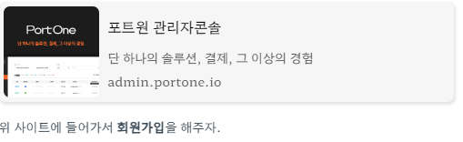

<br><br>

**2. 회원가입이 완료되면 "결제 연동", "상점 - 계정 관리" 탭에서 "내 식별코드 API Keys"를 볼 수 있습니다.**

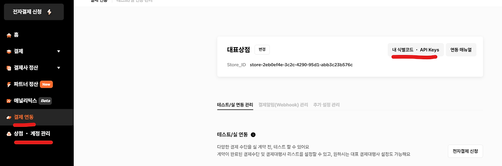

<br><br>

**3. "내 식별코드 API Keys"의 3가지인 가맹점 식별코드, REST API Key, REST API Secret 을 확인하고, 기억해둡니다.**

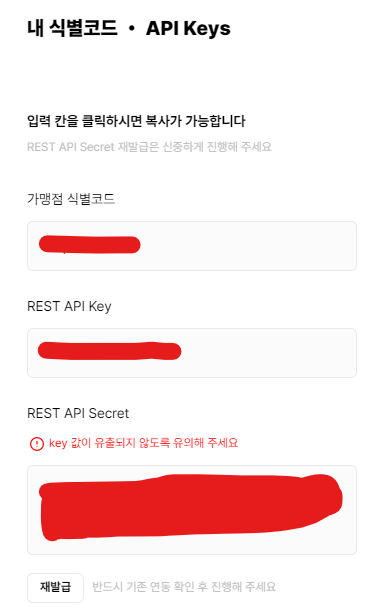

<br><br><br>

### 14-5-5. 의존성 라이브러리 등록

**pom.xml에 해당 라이브러리 추가**

```xml
	<!-- merchant_uid(주문번호)를 무작위로 발생시키기 위한 라이브러리 -->
	<dependency>
		<groupId>org.apache.commons</groupId>
		<artifactId>commons-lang3</artifactId>
		<version>3.4</version>
	</dependency>
```

<br><br><br>

### 14-5-6. 내 식별코드를 저장하고, 주문번호 무작위 발생시키기 위한 클래스 생성

**com.spring1.dto.IamPortClient 작성**

```java
package com.spring1.dto;

import java.util.Date;

import org.apache.commons.lang3.RandomStringUtils;

import lombok.Getter;
import lombok.Setter;
import lombok.ToString;

@Getter
@Setter
@ToString
public class IamPortClient {
	public final static String CODE = "가맹점 식별코드";
	public final static String KEY = "REST API Key";
	public final static String SECRET = "REST API Secret";

	private String randChar;

	public IamPortClient() {
		Date date = new Date();
		this.randChar =  date + RandomStringUtils.randomAlphanumeric(12);
	}
}
```

<br><br><br>

### 14-5-7. 결제 테이블 및 DTO 생성

**오라클에서 결제(payment) 테이블 생성**

```sql
CREATE TABLE payment (
    payment_id VARCHAR2(100) PRIMARY KEY,
    user_id VARCHAR2(100) NOT NULL,
    amount NUMBER(10, 2) NOT NULL,
    status VARCHAR2(20) NOT NULL,
    imp_uid VARCHAR2(100),
    merchant_uid VARCHAR2(100),
    created_at DATE DEFAULT SYSDATE,
    updated_at DATE DEFAULT SYSDATE
);

CREATE INDEX idx_payment_user_id ON payment (user_id);
```

<br><br>

**com.spring1.dto.PaymentDTO 작성**

```java
package com.spring1.dto;

import lombok.AllArgsConstructor;
import lombok.Data;
import lombok.NoArgsConstructor;

@Data
@NoArgsConstructor
@AllArgsConstructor
public class PaymentDTO {
    private String paymentId;
    private String userId;
    private double amount;
    private String status;
    private String impUid;
    private String merchantUid;
    private String createdAt;
    private String updatedAt;
}
```

<br><br><br>

### 14-5-8. MyBatis Mapper XML 작성

**src/main/resources/mybatis-config.xml 수정**

- 생성된 테이블의 컬럼 중에서 payment_id, user_id 컬럼은 DTO 필드 paymentId, userId이 서로 달라 매핑이 되지 못하므로 payment_id가 paymentId 로 user_id는 userId 처럼 카멜케이스로 변경되어 매핑되도록 설정해야 합니다.

```xml
<?xml version="1.0" encoding="UTF-8"?>
<!DOCTYPE configuration PUBLIC 
"-//mybatis.org//DTD Config 3.0//EN" 
"http://mybatis.org/dtd/mybatis-3-config.dtd">
<configuration>
    <settings>
        <!-- Underscore to CamelCase mapping -->
        <setting name="mapUnderscoreToCamelCase" value="true"/>
    </settings>
	<typeAliases>
		<package name="com.spring1" />
	</typeAliases>
</configuration>
```

<br><br>

**src/main/resources/mappers/paymentMapper.xml 작성**

```xml
<?xml version="1.0" encoding="UTF-8"?>
<!DOCTYPE mapper PUBLIC "-//mybatis.org//DTD Mapper 3.0//EN" "http://mybatis.org/dtd/mybatis-3-mapper.dtd">
<mapper namespace="payment">

    <select id="getPaymentById" resultType="com.spring1.dto.PaymentDTO">
        SELECT * FROM payment WHERE payment_id = #{paymentId}
    </select>

    <select id="getPaymentsList" resultType="com.spring1.dto.PaymentDTO">
        SELECT * FROM payment ORDER BY created_at DESC
    </select>
    
    <select id="getPaymentsByUserId" resultType="com.spring1.dto.PaymentDTO">
        SELECT * FROM payment WHERE user_id = #{userId} ORDER BY created_at DESC
    </select>

    <insert id="insertPayment" parameterType="com.spring1.dto.PaymentDTO">
        INSERT INTO payment (payment_id, user_id, amount, status, imp_uid, merchant_uid)
        VALUES (#{paymentId}, #{userId}, #{amount}, #{status}, #{impUid}, #{merchantUid})
    </insert>

    <update id="updatePayment" parameterType="com.spring1.dto.PaymentDTO">
        UPDATE payment SET
        status = #{status},
        imp_uid = #{impUid},
        merchant_uid = #{merchantUid},
        updated_at = SYSDATE
        WHERE payment_id = #{paymentId}
    </update>

    <delete id="deletePayment" parameterType="string">
        DELETE FROM payment WHERE payment_id = #{paymentId}
    </delete>

</mapper>
```

<br><br><br>

### 14-5-9. Repository 작성

**com.spring1.dao.PaymentRepository 작성**

```java
package com.spring1.dao;

import java.util.List;

import org.apache.ibatis.session.SqlSession;
import org.springframework.beans.factory.annotation.Autowired;
import org.springframework.stereotype.Repository;

import com.spring1.dto.PaymentDTO;

@Repository
public class PaymentRepository {

    @Autowired
    private SqlSession sqlSession;

    public PaymentDTO getPaymentById(String paymentId) {
        return sqlSession.selectOne("payment.getPaymentById", paymentId);
    }

    public List<PaymentDTO> getPaymentsList() {
        return sqlSession.selectList("payment.getPaymentsList");
    }
    
    public List<PaymentDTO> getPaymentsByUserId(String userId) {
        return sqlSession.selectList("payment.getPaymentsByUserId", userId);
    }

    public void insertPayment(PaymentDTO payment) {
        sqlSession.insert("payment.insertPayment", payment);
    }

    public void updatePayment(PaymentDTO payment) {
        sqlSession.update("payment.updatePayment", payment);
    }

    public void deletePayment(String paymentId) {
        sqlSession.delete("payment.deletePayment", paymentId);
    }
}
```

<br><br><br>

### 14-5-10. Service 작성

**com.spring1.service.PaymentService 작성**

```java
package com.spring1.service;

import java.util.List;

import org.springframework.beans.factory.annotation.Autowired;
import org.springframework.stereotype.Service;

import com.spring1.dao.PaymentRepository;
import com.spring1.dto.PaymentDTO;


@Service
public class PaymentService {

    @Autowired
    private PaymentRepository paymentRepository;

    public List<PaymentDTO> getPaymentsList() {
        return paymentRepository.getPaymentsList();
    }
    
    public PaymentDTO getPaymentById(String paymentId) {
        return paymentRepository.getPaymentById(paymentId);
    }

    public List<PaymentDTO> getPaymentsByUserId(String userId) {
        return paymentRepository.getPaymentsByUserId(userId);
    }

    public void insertPayment(PaymentDTO payment) {
        paymentRepository.insertPayment(payment);
    }

    public void updatePayment(PaymentDTO payment) {
        paymentRepository.updatePayment(payment);
    }

    public void deletePayment(String paymentId) {
        paymentRepository.deletePayment(paymentId);
    }
}
```

<br><br><br>

### 14-5-11. Controller 작성

**com.spring1.controller.PaymentController 작성**

```java
package com.spring1.controller;

import java.util.List;

import javax.servlet.http.HttpSession;

import org.springframework.beans.factory.annotation.Autowired;
import org.springframework.stereotype.Controller;
import org.springframework.ui.Model;
import org.springframework.web.bind.annotation.GetMapping;
import org.springframework.web.bind.annotation.ModelAttribute;
import org.springframework.web.bind.annotation.PostMapping;
import org.springframework.web.bind.annotation.RequestMapping;
import org.springframework.web.bind.annotation.RequestParam;

import com.spring1.dto.Custom;
import com.spring1.dto.IamPortClient;
import com.spring1.dto.PaymentDTO;
import com.spring1.service.PaymentService;

@Controller
@RequestMapping("/payments/")
public class PaymentController {

    @Autowired
    private PaymentService paymentService;

    @Autowired
    private HttpSession session; 
    
    @GetMapping("list")
    public String getPaymentsList(Model model) {
        model.addAttribute("payments", paymentService.getPaymentsList());
        return "payments/list";
    }
    
    @GetMapping("list2")
    public String getPaymentsByUserId(Model model) {
    	String userId = (String) session.getAttribute("sid");
        List<PaymentDTO> payments = paymentService.getPaymentsByUserId(userId);
        model.addAttribute("payments", payments);
        return "payments/list";
    }

    @GetMapping("detail")
    public String getPaymentById(@RequestParam("paymentId") String paymentId, Model model) {
        PaymentDTO payment = paymentService.getPaymentById(paymentId);
        model.addAttribute("payment", payment);
        return "payments/detail";
    }

    @GetMapping("create")
    public String createPaymentForm(Model model) {
    	
    	IamPortClient iam = new IamPortClient();
    	model.addAttribute("cid", (String) session.getAttribute("sid"));
    	model.addAttribute("pno", 1);
    	model.addAttribute("pname", "최고의 상품");
    	model.addAttribute("cnt", 10);
    	model.addAttribute("com", "양질의 최고의 상품입니다.");
    	model.addAttribute("oprice", 5000);
    	model.addAttribute("code", IamPortClient.CODE);
    	model.addAttribute("paymentId", iam.getRandChar());
        model.addAttribute("payment", new PaymentDTO());
        return "payments/create";
    }

    @PostMapping("create")
    public String createPayment(@ModelAttribute PaymentDTO payment) {
        paymentService.insertPayment(payment);
        return "redirect:/payments/list";
    }

    @GetMapping("edit")
    public String editPaymentForm(@RequestParam("paymentId") String paymentId, Model model) {
        PaymentDTO payment = paymentService.getPaymentById(paymentId);
        model.addAttribute("payment", payment);
        return "payments/edit";
    }

    @PostMapping("edit")
    public String editPayment(@ModelAttribute PaymentDTO payment) {
        paymentService.updatePayment(payment);
        return "redirect:/payments/list";
    }

    @GetMapping("delete")
    public String deletePayment(@RequestParam("paymentId") String paymentId) {
        paymentService.deletePayment(paymentId);
        return "redirect:/payments/list";
    }
}
```

<br><br><br>

### 14-5-12. View(jsp) 작성

**src/main/webapp/WEB-INF/views/home.jsp 수정**

```java
<%@ page language="java" contentType="text/html; charset=UTF-8"
    pageEncoding="UTF-8"%>
<%@ taglib uri="http://java.sun.com/jsp/jstl/core" prefix="c" %>
<%@ taglib prefix="c" uri="http://java.sun.com/jsp/jstl/core"  %>
<%@ taglib prefix="fmt" uri="http://java.sun.com/jsp/jstl/fmt" %>
<%@ taglib prefix="fn" uri = "http://java.sun.com/jsp/jstl/functions"%>
<c:set var="path2" value="${pageContext.request.contextPath }" />
<!DOCTYPE html>
<html>
<head>
<meta charset="UTF-8">
<title>메인 페이지</title>
</head>
<body>
	<h2>${serverTime }</h2>
	<h2>${author }</h2>
	<h2>${company }</h2>
	<p>${msg }</p>	
	<hr>
	<ul>
		<li><a href="${path2 }/custom/login.do">로그인</a></li>
		<li><a href="${path2 }/fileupload/main">파일 업로드 실습</a></li>
		<li><a href="${path2 }/email/main">이메일 보내기 실습</a></li>
		<li><a href="${path2 }/free/list.do">CKEditor를 활용한 자유게시판 실습</a></li>
		<li><a href="${path2 }/payments/list">결제 실습</a></li>
	</ul>
</body>
</html>
```

<br><br><br>

**src/main/webapp/WEB-INF/views/payments/create.jsp 작성**

```java
<%@ page language="java" contentType="text/html; charset=UTF-8" pageEncoding="UTF-8"%>
<%@ taglib uri="http://java.sun.com/jsp/jstl/core" prefix="c" %>
<%@ taglib uri="http://java.sun.com/jsp/jstl/fmt" prefix="fmt" %>
<%@ taglib uri="http://java.sun.com/jsp/jstl/functions" prefix="fn" %>
<c:set var="path2" value="${pageContext.servletContext.contextPath }" />
<!DOCTYPE html>
<html lang="ko">
<head>
    <meta charset="UTF-8">
    <meta http-equiv="X-UA-Compatible" content="IE=edge">
    <meta name="viewport" content="width=device-width, initial-scale=1.0">
	<title>결제하기</title>
	<script src="https://code.jquery.com/jquery-latest.js"></script>
</head>
<body>
<div class="full-wrap">
    <main id="contents" class="contents">
    	<h2 class="page-title">상품 구매</h2>
    	<hr>
   		<div class="page-wrap">
    		<div class="clr-fix">
    			<br>
				<form action="${path2 }/payments/create" method="post">
					<table class="table" id="tb1">
						<tbody>
							<tr>
								<th><h3>제품 정보</h3></th>
								<td>
									<div class="item_fr">
										<input type="hidden" name="pno" id="pno" value="${pno }" />
										<input type="hidden" id="name" value="${cus.name }" />
										<input type="hidden" id="pname" value="${pname }" /> 
										<input type="hidden" name="userId" id="id" value="${cid }" />
										<input type="hidden" id="email" value="${cus.email }" />
										<input type="hidden" id="custel" value="${cus.tel }" />
										<input type="hidden" id="cusaddr" value="${cus.addr1 }" />
										<input type="hidden" id="cusaddr2" value="${cus.addr2 }" />
										<input type="hidden" id="cuspostcode" value="${cus.postcode }" />
										<input type="hidden" name="gtid" id="gtid" />
										<input type="hidden" name="paymentId" id="paymentId" value="${paymentId }" />
										<input type="hidden" name="status" id="status" value="before" />
										<input type="hidden" name="impUid" id="impUid" value="${code}" />
										<input type="hidden" name="merchantUid" id="merchantUid" />
										<h4>제품명 : ${pname }</h4>
										<br>
										<h4>제품 설명</h4>
										<p>${com }</p>
									</div>
								</td>
							</tr>
							<tr>
								<th><h3>구매 정보</h3></th>
								<td>
									<div class="item_fr">
										<strong>단가 </strong> : 
										<input type="number" id="price" value="${oprice }" class="input" style="display:inline-block; width:85%;" readonly /><br>
										<strong>수량 </strong> : 
										<c:if test="${cnt gt 0}">
											<input type="number" name="cnt" id="cnt" min="1" max="${cnt }" step="1" class="input" style="display:inline-block; width:85%;" required />
										</c:if>
										<c:if test="${(cnt eq 0) or (cnt lt 1)}">
											<strong style="color:red">품절</strong>
										</c:if>
										<br>
									</div>
								</td>
							</tr>
							<c:if test="${cnt gt 0}">
							<tr class="change_item">
								<th><h3>결제 정보</h3></th>
								<td>
									<div class="item_fr">
										<strong>결제할 금액</strong> : 
										<input type="number" name="amount" id="amount" class="input" style="display:inline-block; width:85%;" required />											
									</div>
									<div class="item_fr">
										<strong>결제 버튼을 누르세요</strong>
										<input type="hidden" name="paymethod" id="paymethod" />
										<input type="hidden" name="paynum" id="paynum" />
										<input type="hidden" name="gtid" id="gtid" />
									</div>
									<button type="button" id="payBtn" class="button is-danger">결제</button>
									<br>
									<div id="msg">
										
										
									</div>
								</td>
							</tr>
							</c:if>
							<c:if test="${amount gt 0}">
							<tr class="result_item">
								<th><h3>배송 정보</h3></th>
								<td>
									<div class="item_fr">
										<strong>주문자</strong> :
										<strong>${cus.name }</strong> &nbsp; &nbsp; &nbsp; &nbsp; &nbsp; &nbsp; 
										<input type="checkbox" id="ck2">
										<label for="ck2">주문자와 수신자가 동일합니다.</label>											
									</div>
									<div class="item_fr">
										<strong>수신자</strong> :
										<input type="text" name="rname" id="rname" class="input" required /> 											
									</div>
									<div class="item_fr">
										<h4>배송지</h4>
										<hr>
										<strong>기본 주소</strong> : <input type="text" name="addr1" id="addr1" class="input" style="display:inline-block; width:85%;" required><br> 
										<strong>상세 주소</strong> : <input type="text" name="addr2" id="addr2" class="input" style="display:inline-block; width:85%;" required><br>
										<strong>상세 주소</strong> : <input type="text" name="postcode" id="postcode" class="input" style="display:inline-block; width:85%;" required><br><br>
										<input type="button" id="isAddrBtn" class="button is-link" value="주소 입력" onclick="findAddr()">
										<input type="hidden" name="addr" id="addr" />											
									</div>
									<div class="item_fr">
										<strong>연락처</strong> :
										<input type="tel" name="tel" id="tel" class="input" required><br> 
									</div>
								</td>
							</tr>
							</c:if>
						</tbody>
					</table>
					<hr>
					<div class="buttons">
					  <button type="submit" class="button is-danger" id="salesBtn">구매</button>
					</div>
				</form>
	            <script>
                function findAddr() {
                    new daum.Postcode({
                        oncomplete: function(data) {
                            console.log(data);
                            var roadAddr = data.roadAddress;
                            var jibunAddr = data.jibunAddress;
                            document.getElementById("postcode").value = data.zonecode;
                            if(roadAddr !== '') {
                                document.getElementById("addr1").value = roadAddr;
                            } else if(jibunAddr !== ''){
                                document.getElementById("addr1").value = jibunAddr;
                            }
                            document.getElementById("addr2").focus();
                        }
                    }).open();
                }
            	</script>
            	<script src="https://t1.daumcdn.net/mapjsapi/bundle/postcode/prod/postcode.v2.js"></script>
				
				<!-- 결제 API -->
				<script src="https://cdn.iamport.kr/js/iamport.payment-1.1.5.js"></script>
				<script>
				$(document).ready(function(){
					
					$("#addr2").focusout(function(){
						$("#addr").val($("#addr1").val()+"   "+$("#addr2").val()+"   "+$("#postcode").val());
					});
					
					$(".change_item").css("display", "none");
					$(".result_item").css("display", "none");
					$("#salesBtn").css("display", "none");
					
					$("#cnt").on("change", function(){
						$("#amount").val(parseInt($("#price").val())*parseInt($("#cnt").val()));
						$(".change_item").css("display", "");	
					});
					
					$("#cnt").on("keyup", function(){
						$("#amount").val(parseInt($("#price").val())*parseInt($("#cnt").val()));
						$(".change_item").css("display", "");	
					});
					
					$("#payBtn").click(function(){
						var money = parseInt($("#amount").val());
						var code = `${code}`;
						var merchantUid = 'merchant_' + new Date().getTime();
						console.log("결제");
				        IMP.init(code); // 가맹점 식별코드로 Iamport 초기화
				        IMP.request_pay({ // 결제 요청
				            pg: "danal_tpay",   // PG사 설정
				            pay_method: "card", // 결제 방법
				            merchant_uid: merchantUid, // 주문 번호
				            name: $("#pname").val(), // 상품 이름
				            amount: money, // 결제 가격
				            buyer_email: $("#email").val(),
				            buyer_name: $("#name").val(), // 구매자 이름 (buyer_ 부분은 꼭 작성하지 않아도된다. (선택사항))
				            buyer_tel: $("#custel").val(), // 구매자 연락처
				            buyer_postcode: $("#cuspostcode").val(), // 구매자 우편번호
				            buyer_addr: $("#cusaddr").val() // 구매자 주소
				        }, function(rsp){
				        	
				        	var gt_id = "12345678";	//거래 승인 번호
				        	var card_name = "삼성카드";
				        	var card_number = "1234567890123";
				        	var pay_method = "card";
				        	var amount = money;
				        	
				        	if (rsp.success) {
				        		//결제 성공시 처리하는 구문들
					        	gt_id = rsp.apply_num;
					        	pay_method = rsp.pay_method;
					        	
					        	console.log('PG사 구분코드 : ' + rsp.pg_provider);
					        	console.log('고유ID : ' + rsp.imp_uid);
					        	console.log('상점 거래ID : ' + rsp.merchant_uid);
					        	console.log('결제 수단 : ' + rsp.pay_method);
					        	console.log('결제 금액 : ' + rsp.paid_amount);
					        	console.log('거래 매출전표 URL : ' + rsp.receipt_url);
					        	console.log('결제 통화 : '+rsp.currency);
					        	console.log('거래 승인번호 : ' + rsp.apply_num);
					        	
					        	if(rsp.pay_method=='card') { //카드인 경우
					        		console.log('신용 카드 이름 : ' + rsp.card_name);
					        		console.log('신용 카드 번호 : ' + rsp.card_number);
						        	card_name = rsp.card_name;
						        	card_number = rsp.card_number;
					        	}
					        	
					        	if(rsp.pay_method=='vbank') { //가상 계좌인 경우
						        	console.log('가상계좌 입금 계좌번호 : ' + rsp.vbank_num);
						        	console.log('가상계좌 입금 은행명 : ' + rsp.vbank_name);
						        	console.log('가상계좌 입금 예금주 : ' + rsp.vbank_holder);
					        	}
					        	
					        	if(rsp.pay_method=='trans') { //실시간 계좌이체인 경우
					        		//결제 응답 파라미터 참조
					        	}
					        	
					        	if(rsp.pay_method=='phone') { //휴대폰 소액결제인 경우
					        		//결제 응답 파라미터 참조	
					        	}						        	

					        	if(rsp.pay_method=='samsung') { //삼성페이인 경우
					        		//결제 응답 파라미터 참조
					        	}
					        	
					        	if(rsp.pay_method=='kakaopay') { //카카오페이인 경우
					        		//결제 응답 파라미터 참조
					        	}
					        	
					        	if(rsp.pay_method=='naverpay') { //네이버페이인 경우
					        		//결제 응답 파라미터 참조
					        	}
					        	
					        	//여기에 나머지 코딩
					        	
					        	
				        	} else {
				        		//결제가 실패되었을 경우
				        		console.log('에러 코드 : '+rsp.error_code);
				        		console.log('에러 메시지 : '+rsp.error_msg);
				        	}
				        	
				        	console.log('결제 상태 : '+rsp.status);
				        	
				        	
				        	/* 아래 코드는 부분은 원래 if (rsp.success) { ... } 블록의 가장 아래에 넣어야 합니다.
				        		연습이므로 밖에 기술하였음
				        	*/
				        	
				        	pay_num = card_name+" : "+card_number;
				        	
				        	var msg = "";
				        	msg += "결제수단 : "+pay_method+"<br>";
				        	msg += "결제번호 : "+pay_num+"<br>";
				        	msg += "결제금액 : "+money+"<br>";
				        	msg += "거래 승인 번호 : "+gt_id+"<br>";
				        	
				        	$("#status").val("pay");
				        	$("#merchantUid").val(merchantUid);
				        	
				        	$("#paymethod").val(pay_method);	
				        	$("#paynum").val(pay_num);
				        	$("#gtid").val(gt_id);
				        	
                            $("#msg").html(msg);
				            $(".result_item").css("display", "");
                            $("#salesBtn").css("display", "inline-block");
                            
                            
				        });
					});
				        
				});
				</script>
				<script>
				$(document).ready(function(){
				    // #ck2 checkbox가 클릭되었을 때
				    $("#ck2").click(function(){
				        // 체크 상태를 확인하여 작업을 수행
				        if($(this).is(':checked')){
				            // 체크되었을 때 실행할 작업
				       		$("#rname").val($("#name").val());
				       		$("#addr1").val($("#cusaddr").val());
				       		$("#addr2").val($("#cusaddr2").val());
				       		$("#postcode").val($("#cuspostcode").val());
				       		$("#tel").val($("#custel").val());
				       		$("#isAddrBtn").css("display","none");
				        } else {
				            // 체크가 해제되었을 때 실행할 작업
				       		$("#rname").val("");
				       		$("#addr1").val("");
				       		$("#addr2").val("");
				       		$("#postcode").val("");
				       		$("#tel").val("");
				       		$("#isAddrBtn").css("display","inline-block");
				        }
				    });
				});
				</script>
			</div>
   		</div>
    </main>
</div>    
</body>
</html>
```

<br><br><br>

**src/main/webapp/WEB-INF/views/payments/list.jsp 작성**

```java
<%@ page language="java" contentType="text/html; charset=UTF-8" pageEncoding="UTF-8"%>
<%@ taglib uri="http://java.sun.com/jsp/jstl/core" prefix="c" %>
<%@ taglib uri="http://java.sun.com/jsp/jstl/fmt" prefix="fmt" %>
<%@ taglib uri="http://java.sun.com/jsp/jstl/functions" prefix="fn" %>
<c:set var="path2" value="${pageContext.servletContext.contextPath }" />
<!DOCTYPE html>
<html lang="ko">
<head>
    <meta charset="UTF-8">
    <meta http-equiv="X-UA-Compatible" content="IE=edge">
    <meta name="viewport" content="width=device-width, initial-scale=1.0">
    <title>결제 목록</title>
    <script src="https://code.jquery.com/jquery-latest.js"></script>
</head>
<body>
    <h2>결제 목록</h2>
    <table border="1">
        <thead>
        <tr>
            <th>결제 ID</th>
            <th>사용자 ID</th>
            <th>금액</th>
            <th>상태</th>
            <th>결제일</th>
            <th>액션</th>
        </tr>
        </thead>
        <tbody>
        <c:forEach var="payment" items="${payments}">
            <tr>
                <td>${payment.paymentId}</td>
                <td>${payment.userId}</td>
                <td>${payment.amount}</td>
                <td>${payment.status}</td>
                <td>${payment.createdAt}</td>
                <td>
                    <a href="${path2 }/payments/detail?paymentId=${payment.paymentId}">상세</a>
                    <a href="${path2 }/payments/delete?paymentId=${payment.paymentId}">삭제</a>
                </td>
            </tr>
        </c:forEach>
        </tbody>
    </table>
    <a href="${path2 }/payments/create">새 결제 추가</a>
</body>
</html>
```


<br><br><br>

**src/main/webapp/WEB-INF/views/payments/detail.jsp 작성**

```java
<%@ page language="java" contentType="text/html; charset=UTF-8" pageEncoding="UTF-8"%>
<%@ taglib uri="http://java.sun.com/jsp/jstl/core" prefix="c" %>
<%@ taglib uri="http://java.sun.com/jsp/jstl/fmt" prefix="fmt" %>
<%@ taglib uri="http://java.sun.com/jsp/jstl/functions" prefix="fn" %>
<c:set var="path2" value="${pageContext.servletContext.contextPath }" />
<!DOCTYPE html>
<html lang="ko">
<head>
    <meta charset="UTF-8">
    <meta http-equiv="X-UA-Compatible" content="IE=edge">
    <meta name="viewport" content="width=device-width, initial-scale=1.0">
	<title>결제 상세보기</title>
	<script src="https://code.jquery.com/jquery-latest.js"></script>
</head>
<body>
    <h2>결제 상세</h2>
    <hr>
    <p>결제 ID: ${payment.paymentId}</p>
    <p>사용자 ID: ${payment.userId}</p>
    <p>금액: ${payment.amount}</p>
    <p>상태: ${payment.status}</p>
    <p>결제일: ${payment.createdAt}</p>
    <p>수정일: ${payment.updatedAt}</p>
    <a href="${path2 }/payments/list">목록으로</a>
</body>
</html>
```

<br><br><hr><br><br>

<div id="14-6"></div>

## 14-6. Chat Api 구현

### 14-6-1. WebSocket API

- WebSocket API는 자바 EE 7에서 소개된 표준 프로그래밍 인터페이스로, Java 애플리케이션에서 WebSocket 서버 및 클라이언트를 구현할 수 있도록 지원합니다. Spring Framework에서도 WebSocket을 지원하는 여러 가지 어노테이션, 메소드, 파라미터, 옵션 등을 제공합니다. 


#### 14-6-1-1. 주요 어노테이션

| 어노테이션 |  설명 | 관련 속성 및 매개변수 |
|--------------------|-----------------------------------------|---------------------------------------------------------------|
| @ServerEndpoint | WebSocket 서버 엔드포인트를 정의합니다. | value: WebSocket 서버의 URI 경로입니다. <br> decoders: 디코더 클래스를 지정합니다. <br> encoders: 인코더 클래스를 지정합니다. <br> configurator: WebSocketConfigurator 클래스를 지정하여 사용자 정의 구성 작업을 수행할 수 있습니다. |
| @ClientEndpoint | WebSocket 클라이언트 엔드포인트를 정의합니다. | 속성은 @ServerEndpoint와 유사합니다. |
| @OnOpen | 클라이언트가 WebSocket 서버에 연결할 때 호출되는 메소드에 사용합니다. <br> 메소드 매개변수: Session, EndpointConfig 등을 받을 수 있습니다. |
| @OnMessage | 서버가 클라이언트로부터 메시지를 받을 때 호출되는 메소드에 사용합니다. | 메소드 매개변수: Session, String, byte[], PongMessage 등을 받을 수 있습니다. |
| @OnError | WebSocket 통신 중 오류가 발생했을 때 호출되는 메소드에 사용합니다. | 메소드 매개변수: Session, Throwable 등을 받을 수 있습니다. |
| @OnClose | 클라이언트가 WebSocket 서버와의 연결을 닫을 때 호출되는 메소드에 사용합니다. | 메소드 매개변수: Session, CloseReason 등을 받을 수 있습니다. |

<br><br><br>

#### 14-6-1-2. 주요 클래스 및 메소드

| 클래스 및 매개변수 |  설명 | 메소드 |
|--------------------|------------------------------------------------|--------------------------------------------------------|
| Session | 클라이언트와 서버 간의 WebSocket 연결을 나타내는 클래스입니다. | getId(): 세션 ID를 반환합니다. <br> getBasicRemote(): 기본 원격 엔드포인트를 반환합니다. <br> getAsyncRemote(): 비동기 원격 엔드포인트를 반환합니다. <br> close(): WebSocket 연결을 닫습니다. |
| RemoteEndpoint.Basic | 동기 방식으로 메시지를 전송할 때 사용합니다. | sendText(String message): 텍스트 메시지를 전송합니다. <br> sendBinary(ByteBuffer message): 바이너리 메시지를 전송합니다. |
| RemoteEndpoint.Async | 비동기 방식으로 메시지를 전송할 때 사용합니다. | sendText(String message, SendHandler handler): 텍스트 메시지를 비동기 방식으로 전송합니다. <br> sendBinary(ByteBuffer message, SendHandler handler): 바이너리 메시지를 비동기 방식으로 전송합니다. |


<br><br><br>

#### 14-6-1-3. Spring WebSocket API

- Spring에서는 WebSocket API를 보다 쉽게 사용할 수 있도록 여러 가지 어노테이션과 메소드를 제공합니다. Spring WebSocket API는 Spring Messaging과 통합되어 있으며, STOMP 프로토콜을 지원합니다.

<br><br>

**주요 어노테이션**

| 어노테이션 |  설명 | 특이사항 |
|--------------------|-----------------------------------------|---------------------------------------------------------------|
| @EnableWebSocket | WebSocket 지원을 활성화합니다. | 이 어노테이션을 사용한 클래스는 WebSocketConfigurer 인터페이스를 구현해야 합니다. |
| @EnableWebSocketMessageBroker | WebSocket 메시지 브로커 구성을 활성화합니다. | 이 어노테이션을 사용한 클래스는 WebSocketMessageBrokerConfigurer 인터페이스를 구현해야 합니다. |
| @ServerEndpoint | Java EE WebSocket API와 동일한 역할을 합니다. | 주로 사용되지 않고, Spring에서는 WebSocketHandler를 사용합니다. |
| @MessageMapping | 특정 목적지로 들어오는 메시지를 처리하는 메소드를 정의합니다. | 주로 STOMP 메시지 처리에 사용됩니다. |
| @SendTo | 처리된 메시지를 특정 목적지로 전송합니다. | @MessageMapping과 함께 사용됩니다. |
| @SubscribeMapping | 클라이언트의 구독 요청을 처리합니다. | STOMP 구독 요청을 처리하는 데 사용됩니다. |


<br><br>

**주요 클래스 및 메소드**

| 클래스 및 매개변수 |  설명 | 메소드 |
|--------------------|-------------------------------------|---------------------------------------------------------------|
| WebSocketConfigurer | WebSocket 핸들러를 등록하기 위해 구현하는 인터페이스입니다. | registerWebSocketHandlers(WebSocketHandlerRegistry registry): WebSocket 핸들러를 등록합니다. |
| WebSocketMessageBrokerConfigurer | 메시지 브로커 설정을 위해 구현하는 인터페이스입니다. | configureMessageBroker(MessageBrokerRegistry registry): 메시지 브로커를 구성합니다. <br> registerStompEndpoints(StompEndpointRegistry registry): STOMP 엔드포인트를 등록합니다. |
| WebSocketHandler | WebSocket 이벤트를 처리하는 인터페이스입니다. | afterConnectionEstablished(WebSocketSession session): WebSocket 연결이 수립된 후 호출됩니다. <br> handleMessage(WebSocketSession session, WebSocketMessage<?> message): WebSocket 메시지를 처리합니다. <br> handleTransportError(WebSocketSession session, Throwable exception): WebSocket 전송 오류를 처리합니다. <br> afterConnectionClosed(WebSocketSession session, CloseStatus closeStatus): WebSocket 연결이 닫힌 후 호출됩니다. | 
| TextWebSocketHandler | WebSocketHandler의 구현체로, 텍스트 메시지 처리를 위한 기본 클래스를 제공합니다.  | handleTextMessage(WebSocketSession session, TextMessage message): 텍스트 메시지를 처리합니다. | 
| StompEndpointRegistry | STOMP 엔드포인트를 등록하기 위한 메소드를 제공합니다. | addEndpoint(String... paths): STOMP 엔드포인트를 추가합니다. <br> withSockJS(): SockJS 지원을 추가합니다. |
| MessageBrokerRegistry | 메시지 브로커를 구성하기 위한 메소드를 제공합니다. | enableSimpleBroker(String... destinationPrefixes): 간단한 메시지 브로커를 활성화합니다. <br> setApplicationDestinationPrefixes(String... prefixes): 애플리케이션 목적지 프리픽스를 설정합니다. |


<br><br><br>

#### 14-6-1-4. 예시 코드

**Spring WebSocket 설정 예시**

```java
@Configuration
@EnableWebSocket
@EnableWebSocketMessageBroker
public class WebSocketConfig implements WebSocketConfigurer, WebSocketMessageBrokerConfigurer {

    @Override
    public void registerWebSocketHandlers(WebSocketHandlerRegistry registry) {
        registry.addHandler(new CustomWebSocketHandler(), "/socket.do").setAllowedOrigins("*");
    }

    @Bean
    public CustomWebSocketHandler customWebSocketHandler() {
        return new CustomWebSocketHandler();
    }
    
    @Override
    public void registerStompEndpoints(StompEndpointRegistry registry) {
        registry.addEndpoint("/stomp/chat").setAllowedOrigins("*").withSockJS();
    }

    @Override
    public void configureMessageBroker(MessageBrokerRegistry registry) {
        registry.enableSimpleBroker("/topic");
        registry.setApplicationDestinationPrefixes("/app");
    }
}
```

<br><br><br>

**WebSocket 핸들러 예시**

```java
public class CustomWebSocketHandler extends TextWebSocketHandler {

    private static final List<WebSocketSession> sessions = new ArrayList<>();

    @Override
    public void afterConnectionEstablished(WebSocketSession session) throws Exception {
        sessions.add(session);
        session.sendMessage(new TextMessage("대화방에 연결되었습니다."));
    }

    @Override
    protected void handleTextMessage(WebSocketSession session, TextMessage message) throws Exception {
        for (WebSocketSession webSocketSession : sessions) {
            if (webSocketSession.isOpen() && !session.getId().equals(webSocketSession.getId())) {
                webSocketSession.sendMessage(message);
            }
        }
    }

    @Override
    public void handleTransportError(WebSocketSession session, Throwable exception) throws Exception {
        sessions.remove(session);
    }

    @Override
    public void afterConnectionClosed(WebSocketSession session, CloseStatus status) throws Exception {
        sessions.remove(session);
    }
}
```

- 위 예시에서는 WebSocket 서버를 설정하고 메시지를 처리하는 핸들러를 구현하는 방법을 보여줍니다. 이와 같이 Java EE WebSocket API와 Spring WebSocket 지원을 사용하여 WebSocket 기반 애플리케이션을 개발할 수 있습니다.

<br><br><br>

#### 14-6-1-5. JavaScript WebSocket API

- JavaScript에서 WebSocket API는 클라이언트와 서버 간의 전이중(Full-Duplex) 통신을 가능하게 합니다. WebSocket 객체를 사용하면 브라우저에서 서버로 실시간 데이터를 주고받을 수 있습니다. WebSocket API는 다음과 같은 클래스, 메소드, 속성, 생성자 등을 제공합니다.

<br><br>

**WebSocket 클래스**

- WebSocket 클래스는 WebSocket 서버와의 연결을 나타냅니다. 이 클래스는 WebSocket 통신을 관리하는 데 필요한 메소드와 속성을 제공합니다.

<br><br>

**생성자**

```javascript
var socket = new WebSocket(url, [protocols]);
```

- url: WebSocket 서버의 URL입니다. 예: ws://localhost:8080 또는 보안 WebSocket의 경우 wss://localhost:8080
- protocols: 선택적 매개변수로, 하나 또는 여러 개의 하위 프로토콜을 지정할 수 있습니다. 예: ['protocol1', 'protocol2']
속성
- WebSocket.url: WebSocket 서버의 URL을 반환합니다.
- WebSocket.readyState: WebSocket 연결의 현재 상태를 나타냅니다.
	- 0: CONNECTING - 연결 시도 중
	- 1: OPEN - 연결이 성립됨
	- 2: CLOSING - 연결 종료 시도 중
	- 3: CLOSED - 연결이 종료됨
- WebSocket.bufferedAmount: 아직 전송되지 않은 데이터의 바이트 수를 반환합니다.
- WebSocket.protocol: 서버와 협상된 하위 프로토콜을 반환합니다.
- WebSocket.extensions: 사용된 확장 목록을 반환합니다.

<br><br>

**이벤트 핸들러 속성**

- WebSocket.onopen: 연결이 성립되었을 때 호출되는 이벤트 핸들러입니다.
- WebSocket.onmessage: 메시지가 도착했을 때 호출되는 이벤트 핸들러입니다.
- WebSocket.onerror: 에러가 발생했을 때 호출되는 이벤트 핸들러입니다.
- WebSocket.onclose: 연결이 종료되었을 때 호출되는 이벤트 핸들러입니다.
메소드
- WebSocket.send(data): 서버로 데이터를 전송합니다.
- data: 전송할 데이터로, String, ArrayBuffer, Blob 또는 TypedArray를 사용할 수 있습니다.

```javascript
socket.send("Hello, Server!");
```

<br>

- WebSocket.close([code], [reason]): WebSocket 연결을 종료합니다.
	- code: 선택적 매개변수로, 연결 종료의 상태 코드를 나타냅니다. (예: 1000은 정상 종료)
	- reason: 선택적 매개변수로, 연결 종료의 이유를 설명하는 문자열입니다.

```javascript
socket.close(1000, "Normal closure");
```

<br><br>

**이벤트**

open: WebSocket 연결이 성립되었을 때 발생합니다.

```javascript
socket.onopen = function(event) {
    console.log("Connection opened");
};
```

<br>

message: 서버로부터 메시지를 수신했을 때 발생합니다.

```javascript
socket.onmessage = function(event) {
    console.log("Message received: " + event.data);
};
```

<br>

error: 통신 중 에러가 발생했을 때 발생합니다.

```javascript
socket.onerror = function(event) {
    console.error("WebSocket error observed:", event);
};
```

<br>

close: WebSocket 연결이 종료되었을 때 발생합니다.

```javascript
socket.onclose = function(event) {
    console.log("Connection closed", event);
};
```

<br><br>

**자바스크립트 예시코드**

```javascript
// WebSocket 서버에 연결
var socket = new WebSocket('ws://localhost:8080');

// 연결이 성립되었을 때
socket.onopen = function(event) {
    console.log("Connection opened:", event);
    socket.send("Hello, Server!");
};

// 서버로부터 메시지를 수신했을 때
socket.onmessage = function(event) {
    console.log("Message received from server:", event.data);
};

// 에러가 발생했을 때
socket.onerror = function(event) {
    console.error("WebSocket error observed:", event);
};

// 연결이 종료되었을 때
socket.onclose = function(event) {
    console.log("Connection closed:", event);
};

// 메시지 전송
document.getElementById("sendButton").onclick = function() {
    var message = document.getElementById("messageInput").value;
    if (socket.readyState === WebSocket.OPEN) {
        socket.send(message);
    } else {
        console.log("WebSocket is not open: readyState=" + socket.readyState);
    }
};

// 연결 종료
document.getElementById("closeButton").onclick = function() {
    socket.close(1000, "Normal closure");
};
```

<br><br><br><br>

### 14-6-2. SockJS API

- SockJS는 WebSocket이 지원되지 않는 환경에서도 웹 애플리케이션이 WebSocket-like 통신을 할 수 있도록 하는 JavaScript 라이브러리입니다. SockJS는 다양한 폴백(fallback) 기술을 사용하여 WebSocket의 기능을 에뮬레이션합니다. Spring 프레임워크와 함께 사용할 수 있으며, Spring WebSocket과 통합하여 강력한 실시간 애플리케이션을 개발할 수 있습니다.

<br><br>

#### 14-6-2-1. SockJS 서버 설정 (Spring)

**관련 어노테이션과 메소드**

- Spring WebSocket과 SockJS를 설정하려면 다음과 같은 어노테이션과 메소드를 사용합니다.

@Configuration: Spring 설정 클래스를 정의합니다.
@EnableWebSocketMessageBroker: WebSocket 메시지 브로커를 활성화합니다.
@EnableWebSocket: WebSocket을 활성화합니다.

<br><br>

**WebSocketConfigurer 인터페이스**

- registerWebSocketHandlers(WebSocketHandlerRegistry registry): WebSocket 핸들러를 등록합니다.

```java
@Configuration
@EnableWebSocketMessageBroker
public class WebSocketConfig implements WebSocketMessageBrokerConfigurer {

    @Override
    public void registerStompEndpoints(StompEndpointRegistry registry) {
        registry.addEndpoint("/stomp/chat")
                .setAllowedOrigins("*")
                .withSockJS();
    }

    @Override
    public void configureMessageBroker(MessageBrokerRegistry registry) {
        registry.enableSimpleBroker("/topic");
        registry.setApplicationDestinationPrefixes("/app");
    }
}
```

<br><br><br>

#### 14-6-2-2. SockJS 클라이언트 사용하기

**SockJS 객체 생성**

```javascript
var sock = new SockJS(url, [options]);
```

- url: SockJS 서버의 URL입니다.
- options: 선택적 매개변수로, 다음과 같은 속성을 설정할 수 있습니다.
	- server: 서버 ID를 명시적으로 지정합니다.
	- transports: 사용할 전송 수단의 목록입니다. 예: ['websocket', 'xhr-polling']

<br><br>

**메소드**

- send(data): 서버로 데이터를 전송합니다.
- data: 전송할 데이터입니다. 일반적으로 문자열입니다.

```javascript
sock.send("Hello, Server!");
close([code], [reason]): SockJS 연결을 종료합니다.
```

- code: 선택적 매개변수로, 연결 종료의 상태 코드를 나타냅니다. (예: 1000은 정상 종료)
- reason: 선택적 매개변수로, 연결 종료의 이유를 설명하는 문자열입니다.

```javascript
sock.close(1000, "Normal closure");
```

<br><br>

**이벤트**

- onopen: 연결이 성립되었을 때 발생합니다.

```javascript
sock.onopen = function() {
    console.log('connection opened');
};
```

<br>

- onmessage: 서버로부터 메시지를 수신했을 때 발생합니다.

```javascript
sock.onmessage = function(e) {
    console.log('message received: ' + e.data);
};
```

<br>

- onclose: 연결이 종료되었을 때 발생합니다.

```javascript
sock.onclose = function() {
    console.log('connection closed');
};
```

<br>

- onerror: 통신 중 에러가 발생했을 때 발생합니다.

```javascript
sock.onerror = function(e) {
    console.error('error: ', e);
};
```

<br><br><br>

#### 14-6-2-3. SockJS 사용 예시 코드

**서버 설정 (Spring)**

```java
import org.springframework.context.annotation.Configuration;
import org.springframework.messaging.simp.config.MessageBrokerRegistry;
import org.springframework.web.socket.config.annotation.EnableWebSocketMessageBroker;
import org.springframework.web.socket.config.annotation.StompEndpointRegistry;
import org.springframework.web.socket.config.annotation.WebSocketMessageBrokerConfigurer;

@Configuration
@EnableWebSocketMessageBroker
public class WebSocketConfig implements WebSocketMessageBrokerConfigurer {

    @Override
    public void registerStompEndpoints(StompEndpointRegistry registry) {
        registry.addEndpoint("/stomp/chat")
                .setAllowedOrigins("*")
                .withSockJS();
    }

    @Override
    public void configureMessageBroker(MessageBrokerRegistry registry) {
        registry.enableSimpleBroker("/topic");
        registry.setApplicationDestinationPrefixes("/app");
    }
}
```

<br><br>

**클라이언트 (HTML + JavaScript)**

```html
<!DOCTYPE html>
<html>
<head>
    <title>SockJS Example</title>
    <script src="https://cdn.jsdelivr.net/npm/sockjs-client@1/dist/sockjs.min.js"></script>
    <script>
        var sock = new SockJS('/stomp/chat');

        sock.onopen = function() {
            console.log('connection opened');
        };

        sock.onmessage = function(e) {
            console.log('message received: ' + e.data);
        };

        sock.onclose = function() {
            console.log('connection closed');
        };

        sock.onerror = function(e) {
            console.error('error: ', e);
        };

        function sendMessage() {
            var message = document.getElementById('message').value;
            sock.send(message);
        }

        function closeConnection() {
            sock.close();
        }
    </script>
</head>
<body>
    <input type="text" id="message" placeholder="Enter your message">
    <button onclick="sendMessage()">Send</button>
    <button onclick="closeConnection()">Close</button>
</body>
</html>
```

<br><br><br><br>

### 14-6-3. Stomp API

- STOMP (Simple Text Oriented Messaging Protocol)는 메시지 브로커와 클라이언트 간의 통신을 위한 프로토콜입니다. Spring에서는 STOMP를 사용하여 WebSocket을 통해 메시지 기반 애플리케이션을 구축할 수 있습니다. Spring WebSocket 모듈은 STOMP와 SockJS를 지원하여 실시간 웹 애플리케이션을 쉽게 개발할 수 있게 합니다.

<br><br>

#### 14-6-3-1. STOMP 관련 어노테이션

@MessageMapping: 특정 목적지(destination)로 전송된 메시지를 처리하는 메서드에 사용됩니다. Spring MVC의 @RequestMapping과 유사합니다.

```java
@MessageMapping("/chat")
public void handleChatMessage(String message) {
    // 메시지 처리 로직
}
```

<br><br>

@SendTo: 처리된 결과를 특정 목적지로 다시 전송하는 데 사용됩니다. 기본적으로 처리 메서드의 반환값을 목적지로 보냅니다.

```java
@MessageMapping("/chat")
@SendTo("/topic/messages")
public String handleChatMessage(String message) {
    return message;
}
```

<br><br>

@SendToUser: 특정 사용자에게만 메시지를 전송하는 데 사용됩니다. 개인 채팅이나 알림 등에 유용합니다.

```java
@MessageMapping("/chat.private")
@SendToUser("/queue/reply")
public String handlePrivateMessage(String message) {
    return message;
}
```

<br><br>

@SubscribeMapping: 클라이언트가 목적지에 구독할 때 실행되는 메서드에 사용됩니다. 일반적으로 초기 데이터를 제공하는 데 사용됩니다.

```java
@SubscribeMapping("/init")
public String init() {
    return "initial data";
}
```

<br><br><br>

#### 14-6-3-2. STOMP 서버 설정

- STOMP 서버 설정은 주로 두 가지 주요 인터페이스인 WebSocketMessageBrokerConfigurer 및 StompEndpointRegistry를 통해 이루어집니다.

<br>

**WebSocketMessageBrokerConfigurer 인터페이스**

- registerStompEndpoints(StompEndpointRegistry registry): STOMP 엔드포인트를 등록합니다. SockJS 폴백을 추가할 수 있습니다.

```java
@Override
public void registerStompEndpoints(StompEndpointRegistry registry) {
    registry.addEndpoint("/stomp/chat").setAllowedOrigins("*").withSockJS();
}
```

<br><br>

- configureMessageBroker(MessageBrokerRegistry registry): 메시지 브로커 옵션을 구성합니다.

```java
@Override
public void configureMessageBroker(MessageBrokerRegistry registry) {
    registry.enableSimpleBroker("/topic", "/queue");
    registry.setApplicationDestinationPrefixes("/app");
}
```

<br><br><br>

#### 14-6-3-3. STOMP 클라이언트 사용

- STOMP 클라이언트는 주로 JavaScript로 구현됩니다. @stomp/stompjs 라이브러리를 사용하여 STOMP 클라이언트를 구현할 수 있습니다.

**STOMP 객체 생성 및 설정**

```javascript
const socket = new SockJS('/stomp/chat');
const stompClient = Stomp.over(socket);

stompClient.connect({}, function(frame) {
    console.log('Connected: ' + frame);

    stompClient.subscribe('/topic/messages', function(message) {
        console.log(message.body);
    });

    stompClient.send("/app/chat", {}, JSON.stringify({'message': 'Hello, World!'}));
});
```

<br><br>

**메소드**

- connect(headers, connectCallback, errorCallback): STOMP 브로커와 연결을 설정합니다.
	- headers: 연결 시 사용할 추가 헤더 정보.
	- connectCallback: 연결 성공 시 호출되는 콜백 함수.
	- errorCallback: 연결 실패 시 호출되는 콜백 함수.
- subscribe(destination, callback, headers): 특정 목적지에 대한 구독을 설정합니다.
	- destination: 구독할 목적지.
	- callback: 메시지 수신 시 호출되는 콜백 함수.
	- headers: 추가 헤더 정보.
- send(destination, headers, body): 특정 목적지로 메시지를 전송합니다.
	- destination: 메시지를 보낼 목적지.
	- headers: 추가 헤더 정보.
	- body: 전송할 메시지 본문.
- disconnect(disconnectCallback): 연결을 종료합니다.
	- disconnectCallback: 연결 종료 시 호출되는 콜백 함수.

<br><br>

**이벤트**

- onopen: 연결이 성립되었을 때 발생합니다.

```javascript
socket.onopen = function() {
    console.log('STOMP connection opened');
};
```

<br>

- onmessage: 서버로부터 메시지를 수신했을 때 발생합니다.

```javascript
socket.onmessage = function(event) {
    console.log('STOMP message received: ' + event.data);
};
```

<br>

- onclose: 연결이 종료되었을 때 발생합니다.

```javascript
socket.onclose = function() {
    console.log('STOMP connection closed');
};
```

<br>

- onerror: 통신 중 에러가 발생했을 때 발생합니다.

```javascript
socket.onerror = function(event) {
    console.error('STOMP error: ', event);
};
```

<br><br><br>

#### 14-6-6-4. STOMP 사용 예시

**서버 설정 (Spring)**

```java
import org.springframework.context.annotation.Configuration;
import org.springframework.messaging.simp.config.MessageBrokerRegistry;
import org.springframework.web.socket.config.annotation.EnableWebSocketMessageBroker;
import org.springframework.web.socket.config.annotation.StompEndpointRegistry;
import org.springframework.web.socket.config.annotation.WebSocketMessageBrokerConfigurer;

@Configuration
@EnableWebSocketMessageBroker
public class WebSocketConfig implements WebSocketMessageBrokerConfigurer {

    @Override
    public void registerStompEndpoints(StompEndpointRegistry registry) {
        registry.addEndpoint("/stomp/chat").setAllowedOrigins("*").withSockJS();
    }

    @Override
    public void configureMessageBroker(MessageBrokerRegistry registry) {
        registry.enableSimpleBroker("/topic", "/queue");
        registry.setApplicationDestinationPrefixes("/app");
    }
}
```

<br><br>

**클라이언트 (HTML + JavaScript)**

```html
<!DOCTYPE html>
<html>
<head>
    <title>STOMP Chat</title>
    <script src="https://cdn.jsdelivr.net/npm/sockjs-client@1/dist/sockjs.min.js"></script>
    <script src="https://cdn.jsdelivr.net/npm/@stomp/stompjs@5/umd/stomp.min.js"></script>
    <script>
        var socket = new SockJS('/stomp/chat');
        var stompClient = Stomp.over(socket);

        stompClient.connect({}, function(frame) {
            console.log('Connected: ' + frame);

            stompClient.subscribe('/topic/messages', function(message) {
                document.getElementById('messages').innerHTML += '<br/>' + message.body;
            });
        });

        function sendMessage() {
            var message = document.getElementById('message').value;
            stompClient.send("/app/chat", {}, JSON.stringify({'message': message}));
            document.getElementById('message').value = '';
        }
    </script>
</head>
<body>
    <input type="text" id="message" placeholder="Enter your message">
    <button onclick="sendMessage()">Send</button>
    <div id="messages"></div>
</body>
</html>
```

<br><br><br><br>

### 14-6-4. Chat Api 구현 예시

#### 14-6-4-1. 의존성 라이브러리 등록

**pom.xml에 spring-websocket, javax.websocket-api, spring-messaging, spring-integration-stomp 라이브러리 추가**

```xml
	<!-- https://mvnrepository.com/artifact/org.springframework/spring-websocket -->
	<dependency>
		<groupId>org.springframework</groupId>
		<artifactId>spring-websocket</artifactId>
		<version>5.0.8.RELEASE</version>
	</dependency>
	<!-- https://mvnrepository.com/artifact/javax.websocket/javax.websocket-api -->
	<dependency>
		<groupId>javax.websocket</groupId>
		<artifactId>javax.websocket-api</artifactId>
		<version>1.1</version>
		<scope>provided</scope>
	</dependency>
	
	<dependency>
		<groupId>org.springframework</groupId>
		<artifactId>spring-messaging</artifactId>
		<version>${org.springframework-version}</version>
	</dependency>
		
	<!-- stomp -->
	<!-- https://mvnrepository.com/artifact/org.springframework.integration/spring-integration-stomp -->
	<dependency>
		<groupId>org.springframework.integration</groupId>
		<artifactId>spring-integration-stomp</artifactId>
		<version>5.0.8.RELEASE</version>
	</dependency>
```

<br><br><br>

#### 14-6-4-2. SocketHandler 작성

**com.spring1.util.CustomWebSocketHandler 작성**

- WebSocket 활용을 위해 CustomWebSocketHandler 작성

```java
package com.spring1.util;

import java.util.ArrayList;
import java.util.List;

import org.slf4j.Logger;
import org.slf4j.LoggerFactory;
import org.springframework.web.socket.CloseStatus;
import org.springframework.web.socket.TextMessage;
import org.springframework.web.socket.WebSocketSession;
import org.springframework.web.socket.handler.TextWebSocketHandler;

public class CustomWebSocketHandler extends TextWebSocketHandler {

    private static final List<WebSocketSession> sessionList = new ArrayList<>();
    private Logger log = LoggerFactory.getLogger(this.getClass());

    @Override
    public void afterConnectionEstablished(WebSocketSession session) throws Exception {
        log.info("Open Session : " + session.getId());
        sessionList.add(session);
        session.sendMessage(new TextMessage("채팅 서버 연결 완료"));
    }

    @Override
    protected void handleTextMessage(WebSocketSession session, TextMessage message) throws Exception {
        log.info("Received message: " + message.getPayload() + " from session: " + session.getId());
        session.sendMessage(new TextMessage("변경되었습니다."));
        sendAllSessionToMessage(session, message.getPayload());
    }

    @Override
    public void handleTransportError(WebSocketSession session, Throwable exception) throws Exception {
        log.info("Error in session " + session.getId() + ": " + exception.getMessage());
    }

    @Override
    public void afterConnectionClosed(WebSocketSession session, CloseStatus status) throws Exception {
        log.info("Session : "+ session.getId() + " closed");
        sessionList.remove(session);
    }

    private void sendAllSessionToMessage(WebSocketSession self, String msg) {
        for (WebSocketSession session : sessionList) {
            if (!self.getId().equals(session.getId())) {
                try {
                    session.sendMessage(new TextMessage(msg));
                } catch (Exception e) {
                    log.info(e.getMessage());
                }
            }
        }
    }
}
```

<br><br>

**com.spring1.util.ChatWebSocketHandler 작성**

- WebSocket 활용을 위해 ChatWebSocketHandler 작성

```java
package com.spring1.util;

import org.springframework.web.socket.CloseStatus;
import org.springframework.web.socket.TextMessage;
import org.springframework.web.socket.WebSocketSession;
import org.springframework.web.socket.handler.TextWebSocketHandler;

import java.util.ArrayList;
import java.util.List;

public class ChatWebSocketHandler extends TextWebSocketHandler {

    private List<WebSocketSession> sessions = new ArrayList<>();

    @Override
    public void afterConnectionEstablished(WebSocketSession session) throws Exception {
        sessions.add(session);
        session.sendMessage(new TextMessage("WebSocket: 대화방에 연결되었습니다."));
    }

    @Override
    protected void handleTextMessage(WebSocketSession session, TextMessage message) throws Exception {
        for (WebSocketSession webSocketSession : sessions) {
            if (webSocketSession.isOpen() && !session.getId().equals(webSocketSession.getId())) {
                webSocketSession.sendMessage(message);
            }
        }
    }

    @Override
    public void afterConnectionClosed(WebSocketSession session, CloseStatus status) throws Exception {
        sessions.remove(session);
    }

    @Override
    public void handleTransportError(WebSocketSession session, Throwable exception) throws Exception {
        sessions.remove(session);
        session.close(CloseStatus.SERVER_ERROR);
    }
}
```

<br><br>

**com.spring1.util.ChatSockJsHandler 작성**

- SockJS 활용을 위해 ChatSockJsHandler 작성

```java
package com.spring1.util;

import java.util.ArrayList;
import java.util.List;

import org.springframework.web.socket.CloseStatus;
import org.springframework.web.socket.TextMessage;
import org.springframework.web.socket.WebSocketSession;
import org.springframework.web.socket.handler.TextWebSocketHandler;

public class ChatSockJsHandler extends TextWebSocketHandler {
    private List<WebSocketSession> sessions = new ArrayList<>();

    @Override
    public void afterConnectionEstablished(WebSocketSession session) throws Exception {
        sessions.add(session);
        session.sendMessage(new TextMessage("SockJS: 대화방에 연결되었습니다."));
    }

    @Override
    protected void handleTextMessage(WebSocketSession session, TextMessage message) throws Exception {
        for (WebSocketSession webSocketSession : sessions) {
            if (webSocketSession.isOpen() && !session.getId().equals(webSocketSession.getId())) {
                webSocketSession.sendMessage(message);
            }
        }
    }

    @Override
    public void afterConnectionClosed(WebSocketSession session, CloseStatus status) throws Exception {
        sessions.remove(session);
    }

    @Override
    public void handleTransportError(WebSocketSession session, Throwable exception) throws Exception {
        sessions.remove(session);
        session.close(CloseStatus.SERVER_ERROR);
    }
}
```

<br><br>

**com.spring1.util.ChatStompHandler 작성**

- Stomp 활용을 위해 ChatStompHandler 작성

```java
package com.spring1.util;

import org.springframework.web.socket.TextMessage;
import org.springframework.web.socket.WebSocketSession;
import org.springframework.web.socket.handler.TextWebSocketHandler;

import java.util.ArrayList;
import java.util.List;

public class ChatStompHandler extends TextWebSocketHandler {
    private List<WebSocketSession> sessions = new ArrayList<>();

    @Override
    public void afterConnectionEstablished(WebSocketSession session) throws Exception {
        sessions.add(session);
        session.sendMessage(new TextMessage("STOMP: 대화방에 연결되었습니다."));
    }

    @Override
    protected void handleTextMessage(WebSocketSession session, TextMessage message) throws Exception {
        for (WebSocketSession webSocketSession : sessions) {
            if (webSocketSession.isOpen() && !session.getId().equals(webSocketSession.getId())) {
                webSocketSession.sendMessage(message);
            }
        }
    }
}
```

<br><br><br>

#### 14-6-4-3. Configurer 작성

**com.spring1.util.WebSocketConfig 작성**

```java
package com.spring1.util;

import org.springframework.context.annotation.Bean;
import org.springframework.context.annotation.Configuration;
import org.springframework.messaging.simp.config.MessageBrokerRegistry;
import org.springframework.web.socket.config.annotation.EnableWebSocket;
import org.springframework.web.socket.config.annotation.EnableWebSocketMessageBroker;
import org.springframework.web.socket.config.annotation.StompEndpointRegistry;
import org.springframework.web.socket.config.annotation.WebSocketConfigurer;
import org.springframework.web.socket.config.annotation.WebSocketHandlerRegistry;
import org.springframework.web.socket.config.annotation.WebSocketMessageBrokerConfigurer;

@Configuration
@EnableWebSocket
@EnableWebSocketMessageBroker
public class WebSocketConfig implements WebSocketConfigurer, WebSocketMessageBrokerConfigurer {

    @Override
    public void registerWebSocketHandlers(WebSocketHandlerRegistry registry) {
    	
    	// WebSocket0
        registry.addHandler(new CustomWebSocketHandler(), "/socket.do").setAllowedOrigins("*");
    	
        // WebSocket
        registry.addHandler(new ChatWebSocketHandler(), "/ws/chat").setAllowedOrigins("*");
        
        // SockJS
        registry.addHandler(new ChatSockJsHandler(), "/sockjs/chat").setAllowedOrigins("*").withSockJS();
        
        // STOMP
        registry.addHandler(new ChatStompHandler(), "/stomp/chat").setAllowedOrigins("*").withSockJS();
    }

    @Bean
    public CustomWebSocketHandler customWebSocketHandler() {
        return new CustomWebSocketHandler();
    }
    
    @Override
    public void registerStompEndpoints(StompEndpointRegistry registry) {
        registry.addEndpoint("/stomp/chat").withSockJS();
    }
    
    @Override
    public void configureMessageBroker(MessageBrokerRegistry registry) {
        registry.enableSimpleBroker("/topic");
        registry.setApplicationDestinationPrefixes("/app");
    }   
}
```

<br><br><br>

#### 14-6-4-4. Controller 작성

<div style="font-size:40px; color:red">SocketController는 WebSocket 전용 테스트입니다. SocketController2 를 테스트 할 경우 삭제하여야 합니다.</div>

**com.spring1.controller.SocketController 작성**

```java
package com.spring1.controller;

import java.util.ArrayList;
import java.util.List;

import javax.websocket.OnClose;
import javax.websocket.OnError;
import javax.websocket.OnMessage;
import javax.websocket.OnOpen;
import javax.websocket.RemoteEndpoint.Basic;
import javax.websocket.Session;
import javax.websocket.server.ServerEndpoint;

import org.springframework.stereotype.Controller;
import org.springframework.web.bind.annotation.GetMapping;


@Controller
@ServerEndpoint("/socket.do")
public class SocketController {
	
	private static final List<Session> sessionList = new ArrayList<Session>();
	
	public SocketController(){
		System.out.println("Create Socket");
	}
	
	@GetMapping
	public String viewPage() {
		return "socket/chatTest";
	}

	@OnOpen  // socket 연결 시
	public void onOpen(Session session){
		System.out.println("open session : " + session.getId());
		String msg = session.getId() + "입장";
		try{
			final Basic basic = session.getBasicRemote();
			basic.sendText(msg);
		}catch (Exception e) {
			System.out.println(e.getMessage());
		}
		sessionList.add(session);
		sendAllSessionToMessage(session, msg);
	}
	
	@OnMessage
	public void onMessage (String message, Session session){
		message = session.getId()+" : "+message; 
		try {
			//메세지 보낸 사람에게 표시됨
			final Basic basic = session.getBasicRemote();
			basic.sendText(message);
		} catch (Exception e) {
			System.out.println(e.getMessage());
		}
		// 다른 사람에게 메세지 보내기
		sendAllSessionToMessage(session, message);
	}
	
	@OnError
	public void onError(Throwable e, Session session){
		System.out.println(e.getMessage() + "by session : " + session.getId());
	}
	@OnClose
	public void onClose(Session session){
		System.out.println("Session : "+ session.getId() + " closed");
		sessionList.remove(session);
	}
	
	
	private void sendAllSessionToMessage(Session self,String msg){ // 연결된 모든 사용자에게 메세지 전달
		try {
			for(Session s : SocketController.sessionList){
				if(!self.getId().equals(s.getId())){ 
					s.getBasicRemote().sendText(msg);
				}
			}
		} catch (Exception e) {
			e.printStackTrace();
		}
	}

}
```

<div style="font-size:40px; color:red">SocketController2를 테스트할 경우 SocketController를 삭제하여야 합니다.</div>

**com.spring1.controller.SocketController2 작성**

```java
package com.spring1.controller;

import org.springframework.messaging.handler.annotation.MessageMapping;
import org.springframework.messaging.handler.annotation.SendTo;
import org.springframework.stereotype.Controller;
import org.springframework.web.bind.annotation.GetMapping;

@Controller
public class SocketController2 {

    @GetMapping("/websocket")
    public String websocketChat() {
        return "websocket";
    }

    @GetMapping("/sockjs")
    public String sockjsChat() {
        return "sockjs";
    }

    @GetMapping("/stomp")
    public String stompChat() {
        return "stomp";
    }
    

    @MessageMapping("/chat")
    @SendTo("/topic/messages")
    public String handleChatMessage(String message) {
        return message;
    }  
}
```

<br><br><br>

#### 14-6-4-5. View(JSP) 작성

**src/main/webapp/WEB-INF/views/home.jsp 수정**

```java
<%@ page language="java" contentType="text/html; charset=UTF-8"
    pageEncoding="UTF-8"%>
<%@ taglib uri="http://java.sun.com/jsp/jstl/core" prefix="c" %>
<%@ taglib prefix="c" uri="http://java.sun.com/jsp/jstl/core"  %>
<%@ taglib prefix="fmt" uri="http://java.sun.com/jsp/jstl/fmt" %>
<%@ taglib prefix="fn" uri = "http://java.sun.com/jsp/jstl/functions"%>
<c:set var="path2" value="${pageContext.request.contextPath }" />
<!DOCTYPE html>
<html>
<head>
<meta charset="UTF-8">
<title>메인 페이지</title>
</head>
<body>
	<h2>${serverTime }</h2>
	<h2>${author }</h2>
	<h2>${company }</h2>
	<p>${msg }</p>	
	<hr>
	<ul>
		<li><a href="${path2 }/custom/login.do">로그인</a></li>
		<li><a href="${path2 }/fileupload/main">파일 업로드 실습</a></li>
		<li><a href="${path2 }/email/main">이메일 보내기 실습</a></li>
		<li><a href="${path2 }/free/list.do">CKEditor를 활용한 자유게시판 실습</a></li>
		<li><a href="${path2 }/payments/list">결제 실습</a></li>
		<li><a href="${path2 }/socket.do">채팅 테스트</a></li>
		<li><a href="${path2 }/websocket">채팅 실습</a></li>
		<li><a href="${path2 }/sockjs">채팅 실습2</a></li>
		<li><a href="${path2 }/stomp">채팅 실습3</a></li>
	</ul>
</body>
</html>
```

<br><br>

**src/main/webapp/WEB-INF/views/socket/chatTest.jsp 작성**

```java
<%@ page language="java" contentType="text/html; charset=UTF-8"
    pageEncoding="UTF-8"%>
<%@ taglib prefix="c" uri="http://java.sun.com/jsp/jstl/core"  %>
<%@ taglib prefix="fmt" uri="http://java.sun.com/jsp/jstl/fmt" %>
<%@ taglib prefix="fn" uri = "http://java.sun.com/jsp/jstl/functions"%>
<!DOCTYPE html>
<html>
<head>
	<meta charset="UTF-8">
	<title>채팅 테스트</title>
	<script src="https://code.jquery.com/jquery-latest.js"></script>
	<script type="text/javascript">
    $(function(){
        var ws = new WebSocket("ws://localhost:8091/spring1/socket.do");

        ws.onopen = function(e){ // 연결 시 실행
            console.log("info : connection opened.");
        }

        ws.onmessage = function(e){ // 서버로부터 메세지를 받았을 때 실행
            console.log(e.data); // 전달 받은 메세지 = e.data
            $("#msg").append("<p>"+e.data+"</p>");
        }

        ws.onclose = function(e){ // 연결 종료 시 실행
            console.log("info : connection closed");
        };

        ws.onerror = function(e){
            console.log("error");
        };

        $("#btn").on("click", function(e){
            e.preventDefault();
            if (ws.readyState === WebSocket.OPEN) {
                ws.send($("#testInput").val());
            } else {
                console.log("WebSocket is not open: readyState=" + ws.readyState);
            }
        });
    });
</script>
</head>
<body>
<div class="wrap">
	<h2>Socket Test Page</h2>
	<hr>
	<input type="text" id="testInput">
	<button type="button" id="btn">전송</button>
	<div id="msg">
	</div>
</div>	
</body>
</html>
```

<br><br>

**src/main/webapp/WEB-INF/views/websocket.jsp 수정**

```java
<%@ page language="java" contentType="text/html; charset=UTF-8"
    pageEncoding="UTF-8"%>
<%@ taglib prefix="c" uri="http://java.sun.com/jsp/jstl/core"  %>
<%@ taglib prefix="fmt" uri="http://java.sun.com/jsp/jstl/fmt" %>
<%@ taglib prefix="fn" uri = "http://java.sun.com/jsp/jstl/functions"%>
<!DOCTYPE html>
<html>
<head>
    <meta charset="UTF-8">
    <title>WebSocket Chat</title>
    <script>
        var ws;
        function connect() {
            if (ws !== undefined && ws.readyState !== WebSocket.CLOSED) {
                console.log("WebSocket is already opened.");
                return;
            }

            ws = new WebSocket('ws://localhost:8091/spring1/ws/chat');

            ws.onopen = function(event) {
                if (event.data === undefined) {
                    return;
                }
                document.getElementById('messages').innerHTML += '<br/>' + event.data;
            };

            ws.onmessage = function(event) {
                document.getElementById('messages').innerHTML += '<br/>' + event.data;
            };

            ws.onclose = function(event) {
                document.getElementById('messages').innerHTML += '<br/>WebSocket connection closed';
            };
        }

        function send() {
            var message = document.getElementById('message').value;
            ws.send(message);
            document.getElementById('message').value = '';
        }
    </script>
</head>
<body onload="connect()">
    <div>
        <input type="text" id="message">
        <button onclick="send()">Send</button>
    </div>
    <div id="messages"></div>
</body>
</html>
```

<br><br>

**src/main/webapp/WEB-INF/views/sockjs.jsp 수정**

```java
<%@ page language="java" contentType="text/html; charset=UTF-8"
    pageEncoding="UTF-8"%>
<%@ taglib prefix="c" uri="http://java.sun.com/jsp/jstl/core"  %>
<%@ taglib prefix="fmt" uri="http://java.sun.com/jsp/jstl/fmt" %>
<%@ taglib prefix="fn" uri = "http://java.sun.com/jsp/jstl/functions"%>
<!DOCTYPE html>
<html>
<head>
    <meta charset="UTF-8">
    <title>SockJS Chat</title>
    <script src="https://cdn.jsdelivr.net/npm/sockjs-client@1/dist/sockjs.min.js"></script>
    <script>
        var sock;
        function connect() {
            if (sock !== undefined && sock.readyState !== SockJS.CLOSED) {
                console.log("SockJS is already opened.");
                return;
            }

            sock = new SockJS('http://localhost:8091/spring1/sockjs/chat');

            sock.onopen = function() {
                document.getElementById('messages').innerHTML += '<br/>SockJS: 대화방에 연결되었습니다.';
            };

            sock.onmessage = function(event) {
                document.getElementById('messages').innerHTML += '<br/>' + event.data;
            };

            sock.onclose = function() {
                document.getElementById('messages').innerHTML += '<br/>SockJS connection closed';
            };
        }

        function send() {
            var message = document.getElementById('message').value;
            sock.send(message);
            document.getElementById('message').value = '';
        }
    </script>
</head>
<body onload="connect()">
    <div>
        <input type="text" id="message">
        <button onclick="send()">Send</button>
    </div>
    <div id="messages"></div>
</body>
</html>
```

<br><br>

**src/main/webapp/WEB-INF/views/stomp.jsp 수정**

```java
<%@ page language="java" contentType="text/html; charset=UTF-8"
    pageEncoding="UTF-8"%>
<%@ taglib prefix="c" uri="http://java.sun.com/jsp/jstl/core"  %>
<%@ taglib prefix="fmt" uri="http://java.sun.com/jsp/jstl/fmt" %>
<%@ taglib prefix="fn" uri = "http://java.sun.com/jsp/jstl/functions"%>
<!DOCTYPE html>
<html>
<head>
    <meta charset="UTF-8">
    <title>STOMP Chat</title>
    <script src="https://cdn.jsdelivr.net/npm/sockjs-client@1/dist/sockjs.min.js"></script>
    <script src="https://cdn.jsdelivr.net/npm/@stomp/stompjs@5/umd/stomp.min.js"></script>
    <!-- <script src="https://cdn.jsdelivr.net/npm/@stomp/stompjs@5.4.4/bundles/stomp.umd.min.js"></script> -->
    <script>
        var stompClient;
        function connect() {
            var socket = new SockJS('/spring1/stomp/chat');
            stompClient = Stomp.over(socket);

            stompClient.connect({}, function(frame) {
                document.getElementById('messages').innerHTML += '<br/>STOMP: 대화방에 연결되었습니다.';
                stompClient.subscribe('/topic/messages', function(message) {
                    document.getElementById('messages').innerHTML += '<br/>' + message.body;
                });
            });
        }

        function send() {
            var message = document.getElementById('message').value;
            stompClient.send("/app/chat", {}, message);
            document.getElementById('message').value = '';
        }
    </script>
</head>
<body onload="connect()">
    <div>
        <input type="text" id="message">
        <button onclick="send()">Send</button>
    </div>
    <div id="messages"></div>
</body>
</html>
```
